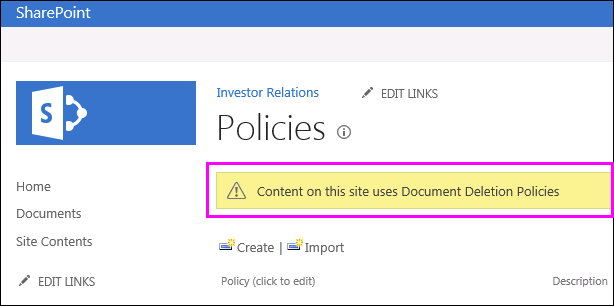

# 套用或移除站台的文件刪除原則Apply or remove a document deletion policy for a site

組織常會基於符合性、法律或其他法規，而必須在特定的一段時間內保留文件。但是，將文件保留超過要求時間，可能會讓組織暴露在法律風險下。為此，您的組織可能會為站台建立文件刪除原則，一般商業文件可能必須在建立的五年之後刪除。Organizations are often subject to compliance, legal, or other regulations that require them to retain documents for a certain period of time. However, retaining documents for longer than required can expose the organization to legal risk. For this reason, your organization may have created a document deletion policy for your site — for example, general business documents might be required to be deleted five years after they were created.
  
視組織之不同，文件刪除原則有可能是：Depending on your organization, a document deletion policy might be:
  
- **必要項目**網站擁有者無法選擇不採用強制原則將會自動套用至網站。**Mandatory** A site owner can't opt out of a mandatory policy, which is automatically applied to the site. 
    
- **預設**：預設原則會自動套用至站台，但站台擁有者可以：**Default** A default policy is automatically applied to a site, but a site owner can: 
    
  - 選擇其他原則 (如果有的話)。Choose another policy if available.
    
  - 選擇完全不採用原則 (如果該原則與站台中的內容不相關)。Opt out of the policy entirely if it is not relevant to the content in the site.
    
- **既非強制，也非預設**：在此情況下將不會對站台自動套用任何原則，站台擁有者必須自行套用原則。**Neither mandatory nor default** In this case, no policy is automatically applied to the site, and the site owner needs to take action to apply one. 
    
文件刪除原則可能包含多個規則；例如，一個規則可能指定要在文件建立的一年後刪除文件，而另一個規則可能指定要在文件前次修改的一年後刪除文件。如果原則包含多個規則，您可以選取最適用於您的站台的規則。刪除規則會套用至站台中的所有文件庫。一個站台在同一時間只能有一個作用中的原則和規則。與原則相同，規則也可設為預設值，而在原則套用時自動隨之套用。A document deletion policy may contain more than one rule — for example, one rule might say delete documents one year after they were created, but another rule might say delete documents one year after they were last modified. If a policy contains more than one rule, you can select the rule that best applies to your site. The delete rule will be applied to all libraries within the site. Only one policy and one rule can be active in a site at one time. Like a policy, a rule can be set as default, so that it is applied automatically when the policy is applied.
  
最後，文件刪除原則是可繼承的。當您選取站台的原則或規則時，所有子網站都將繼承此選取項目，但子站台的擁有者可選取不同的原則或規則，而解除繼承。當您選取原則或規則時，請考慮您的站台下任何子站台的內容。Finally, document deletion policies are inherited. When you select a policy or rule for your site, that selection is inherited by all subsites, although an owner of a subsite can break inheritance by selecting a different policy or rule. When you select a policy or rule, consider the content of any subsites below your site.
  
## 檢視站台集合中可用的文件刪除原則View the document deletion policies available in a site collection

您的組織可以將不同的原則指派至不同的站台集合。在站台集合層級上，站台集合的擁有者可以檢視所有可供該站台集合使用的文件刪除原則。這些原則可以用於站台集合範本中 (因而也可用於所有由此範本建立的站台集合)，或用於此一站台集合。Your organization may assign different policies to different site collections. At the site collection level, an owner of a site collection can view all of the document deletion policies that are available to that site collection. The policies may have been made available to the site collection template (and therefore all site collections created from this template) or to this specific site collection.
  
1. 在頂層網站網站集合中的右上角，選擇 [**設定**[齒輪圖示] \> **網站設定**。In the top-level site in the site collection, in the upper-right corner, choose **Settings** [gear icon] \> **Site Settings**.
    
2. **網站集合管理**下\>**文件刪除原則**。Under **Site Collection Administration** \> **Document Deletion Policies**.
    
    > [!NOTE]
    > 除非已指派原則至網站集合將不會出現 [**文件刪除原則**] 連結。原則已指派給網站後立即不會出現連結的同時，— 約 24 小時的時間從時原則指派給**文件刪除原則**連結出現時。The **Document Deletion Policies** link won't appear unless policies have been assigned to the site collection. Also, the link doesn't appear immediately after policies have been assigned to the site — it can take up to 24 hours from when the policies are assigned to when the **Document Deletion Policies** link appears. 
  
3. 在此頁面您可以檢視：On this page you can view:
    
  - 目前指派的原則和相關聯的規則。選取原則以在右窗格中檢視規則。The currently assigned policies and the associated rules. Select a policy to view the rules in the right pane.
    
  - 預設原則 (如果有的話) 會在 **[預設]** 欄中顯示 **[是]**。The default policy, if any, displays **Yes** in the **Default** column. 
    
  - 如果原則已指派為 **[強制]**，則會在清單下方顯示訊息。A message is displayed below the list if the policy has been assigned as **Mandatory**.
    
此清單僅供檢視，讓站台集合擁有者檢視所有可用的原則和規則。若要套用原則，請參閱下一節。This list is view only, for the site collection owner to see all of the available policies and rules. To apply a policy, see the next section.
  

  
## 套用或移除站台的文件刪除原則Apply or remove a document deletion policy for a site

身為站台擁有者或站台集合擁有者，您的組織可能已建立可讓您套用至站台或選擇完全不採用的原則。As a site owner or site collection owner, your organization may have created policies that you can either apply to your site or opt out of entirely.
  
1. 在右上角，選擇 [**設定**[齒輪圖示] \> **網站設定**。In the upper-right corner, choose **Settings** [gear icon] \> **Site Settings**.
    
2. **網站管理**下\>**文件刪除原則**。Under **Site Administration** \> **Document Deletion Policies**.
    
    > [!NOTE]
    > 除非已指派原則至網站集合將不會出現 [**文件刪除原則**] 連結。原則已指派給網站後立即不會出現連結的同時，— 約 24 小時的時間從時原則指派給**文件刪除原則**連結出現時。The **Document Deletion Policies** link won't appear unless policies have been assigned to the site collection. Also, the link doesn't appear immediately after policies have been assigned to the site — it can take up to 24 hours from when the policies are assigned to when the **Document Deletion Policies** link appears. 
  
3. 執行下列其中一項動作：Do one of the following:
    
  - **若要套用原則**選取原則\>選取該原則中的規則\>**儲存**。**To apply a policy** Select a policy \> select a rule in that policy \> **Save**.
    
    一個站台在同一時間只能有一個作用中的原則和規則。您的組織可提供數個原則和規則以供選擇，或只提供一個原則或規則。Only one policy and one rule can be active in a site at one time. Your organization may provide several policies and rules to choose from, or only one policy or rule.
    
    
  
  - **若要選擇退出原則**選擇 [**選擇延展： 不要注意刪除** \> **儲存**。**To opt out of a policy** Choose **Opt-Out: Do Note Delete** \> **Save**.
    
    身為站台擁有者，如果您認為文件刪除原則不適用於您的站台內容，您可以選擇不採用此原則。但您無法選擇不採用已標示為 **[強制]** 的原則。As a site owner, you can opt out of a document deletion policy if you determine that the policy is not applicable to the content in your site. However, you cannot opt out of a policy that has been marked as **Mandatory**.
    
    ![選擇加入取出] 選項](media/efac709c-bef7-4a02-a09d-5bc7d2b4ec63.png)
  
## 文件刪除原則會覆寫其他原則Document deletion policies override other policies

站台可使用其他原則來保留及刪除內容：A site may use other policies for retaining and deleting content:
  
- 站台集合的內容類型原則。Content type policies for the site collection.
    
- 清單或文件庫的資訊管理原則。Information management policies for a list or library.
    
如果您將文件刪除原則套用至已經使用清單或文件庫的 [內容類型原則或資訊管理原則的網站、 文件刪除原則處於作用中時將會忽略這些原則。如果會略過其他原則，您會看到訊息"這個網站上的內容會使用文件刪除原則 」。If you apply a document deletion policy to a site that already uses content type policies or information management policies for a list or library, those policies are ignored while the document deletion policy is in effect. If other policies are ignored, you will see the message "Content on this site uses Document Deletion Policies".
  
這表示，您在規劃站台時應僅使用適用於結構化內容的原則 (資訊管理原則和內容類型原則) 或非結構化內容的原則 (文件刪除原則)，而非同時使用兩種原則。選擇不採用文件刪除原則時將不會顯示警告，且其他類型的原則會繼續運作。This means you should plan for a site to use only policies meant for structured content (information management policies and content type policies) or unstructured content (document deletion policies), not both. If you opt out of a document deletion policy, the warning will not be displayed and other types of policies will continue to work.
  
網站原則不受文件刪除原則的影響。Site policies are not affected by document deletion policies.
  
### 決定是否要忽略內容類型原則Determine if content type policies are being ignored

如果正在使用您的網站內容類型原則與您現在會看到此訊息，這些原則已不再作用中。若要還原的內容類型原則，您可以從您的網站移除文件刪除原則如前所述，如果沒有可用的退出] 選項。若要選擇退出沒有選項時，文件刪除原則是必要項目，與您需要連絡法務您組織中。If your site was using content type policies and you now see this message, those policies are no longer in effect. To restore the content type policies, you can remove the document deletion policy from your site, as described earlier, if there's an opt-out option available. If there's no option to opt out, the document deletion policy is mandatory, and you need to contact the compliance officer in your organization.
  
1. 在右上角，選擇 [**設定**[齒輪圖示] \> **網站設定**。In the upper-right corner, choose **Settings** [gear icon] \> **Site Settings**.
    
2. **網站管理**下\>**內容類型原則範本**。Under **Site Administration** \> **Content Type Policy Templates**.
    
    
  
### 決定是否要忽略資訊管理原則Determine if information management policies are being ignored

如果您的網站所使用的資訊管理原則您現在可以看到此訊息，這些原則都不再作用中。若要還原的資訊管理原則，您可以從您的網站移除文件刪除原則如前所述，如果沒有可用的退出] 選項。若要選擇退出沒有選項時，文件刪除原則是必要項目，與您需要連絡法務您組織中。If your site was using information management policies and you now see this message, those policies are no longer in effect. To restore the information management policies, you can remove the document deletion policy from your site, as described earlier, if there's an opt-out option available. If there's no option to opt out, the document deletion policy is mandatory, and you need to contact the compliance officer in your organization.
  
- 清單或文件庫、 功能區上的\>**文件庫**] 索引標籤\>**文件庫設定** \> **權限與管理**下\>**資訊管理原則設定**。For a list or library, on the Ribbon \> **Library** tab \> **Library Settings** \> under **Permissions and Management** \> **Information Management Policy Settings**.
    
    
  
## 另請參閱See also

[文件刪除原則概觀Overview of document deletion policies](document-deletion-policies.md)
  
[建立文件刪除原則Create a document deletion policy](create-a-document-deletion-policy.md)

