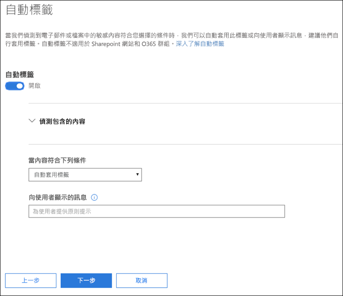
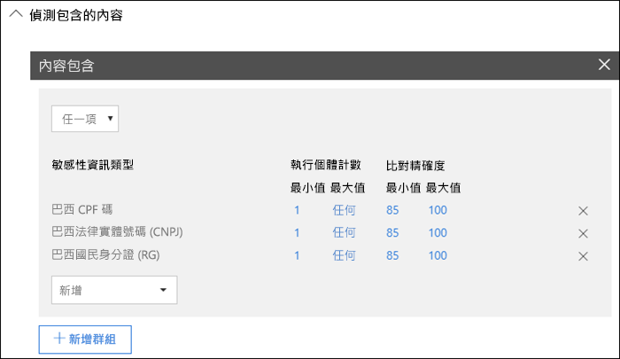
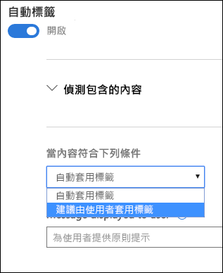
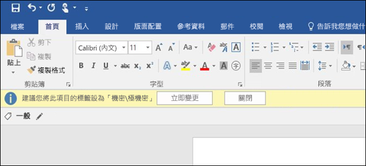

# 自動將敏感度標籤套用到內容

建立敏感度標籤時，您可以自動將該標籤指派給包含敏感性資訊的內容，或者也可以提示使用者套用您建議的標籤。

自動將敏感度標籤套用到內容很重要，因為：

- 您不需要訓練您的使用者記下所有分類。

- 您不需要仰賴使用者正確地將所有內容分類。

- 使用者不再需要了解原則，就可以專心工作。

> [!NOTE]
> 自動套用標籤的功能需要有 Azure 資訊保護 P2 訂閱。若要使用此功能，您必須[下載並安裝 Azure 資訊保護統一標籤用戶端](https://docs.microsoft.com/zh-TW/azure/information-protection/rms-client/install-unifiedlabelingclient-app)。我們正在努力在 Office App 中提供此功能的原生支援，讓此功能不需要 Azure 資訊保護統一標籤用戶端。此外，統一標籤用戶端只能在 Windows 上執行，因此 Mac、iOS 和 Android 尚未支援此功能。

## 根據條件自動套用敏感度標籤

敏感度標籤最強大的功能之一，是能夠自動套用至符合特定條件的內容。在此情況下，貴組織中的人員不需要套用敏感度標籤，Office 365 會替他們做這些事。
   
您可以選擇在內容包含特定類型的敏感性資訊時，自動將敏感度標籤套用到該內容。當您設定自動套用敏感度標籤時，您會看到建立資料外洩防護 (DLP) 原則時的同一份敏感性資訊類型清單。因此，舉例來說，您可以自動將高度機密性標籤套用到包含客戶個人識別資訊 (PII) 的任何內容，例如信用卡號碼或社會安全號碼。 

選擇敏感性資訊類型之後，您可以變更執行個體計數或精確度來精簡條件。如需詳細資訊，請參閱[調整規則以讓它們更容易或更難符合](data-loss-prevention-policies.md#tuning-rules-to-make-them-easier-or-harder-to-match)。

此外，您可以選擇條件是否必須偵測所有敏感性資訊類型，或只偵測其中一種。若要讓條件更具彈性或更複雜，您可以在群組之間新增群組並使用邏輯運算子。如需詳細資訊，請參閱[群組和邏輯運算子](data-loss-prevention-policies.md#grouping-and-logical-operators)。

自動套用敏感度標籤時，使用者會在其 Office App 中看到通知。使用者可以選擇 [確定]**** 來關閉通知。

## 建議使用者套用敏感度標籤

您可以視需要建議使用者套用標籤，而不自動將敏感度標籤套用到內容。此選項可讓使用者享有接受分類和任何關聯保護的彈性，或在標籤不適用於其文件或電子郵件時關閉建議。

請注意，Word、PowerPoint 和 Excel 可支援建議標籤功能 (但必須安裝 Azure 資訊保護統一標籤用戶端)。我們正在努力在 Outlook 中提供建議標籤支援。

以下是設定條件以將標籤套用為建議動作並顯示自訂原則提示的提示範例。您可以選擇要在原則提示中顯示的文字內容。

## 如何套用自動或建議標籤

- 自動標籤可在儲存文件時套用到 Word、Excel 和 PowerPoint，並在傳送電子郵件時套用到 Outlook。這些條件會偵測文件本文和電子郵件內文以及頁首和頁尾中的敏感性資訊，但不會偵測主旨列或電子郵件附件中的敏感性資訊。

- 如果文件或電子郵件之前已手動標示，或之前已使用較高分類自動標示，則無法使用自動分類功能。請切記，您只能將單一敏感度標籤套用到文件或電子郵件 (單一保留標籤也是如此)。

- 建議分類可在儲存文件時套用到 Word、Excel 和 PowerPoint。我們正在努力在 Outlook 中提供建議標籤支援。

- 如果文件之前已使用較高分類標示，則無法使用建議分類功能。在此情況下，當內容已使用較高分類標示時，使用者將無法看到含有建議和原則提示的提示。

## 將多個條件套用到多個標籤時的評估方式

標籤會根據您在原則中指定的標籤位置，針對評估進行排序：位於第一個位置的標籤具有最低的位置 (敏感度最低)，而位於最後一個位置的標籤具有最高的位置 (敏感度最高)。如需有關原則的詳細資訊，請參閱[標籤優先順序 (排序事項)](sensitivity-labels.md#label-priority-order-matters)。