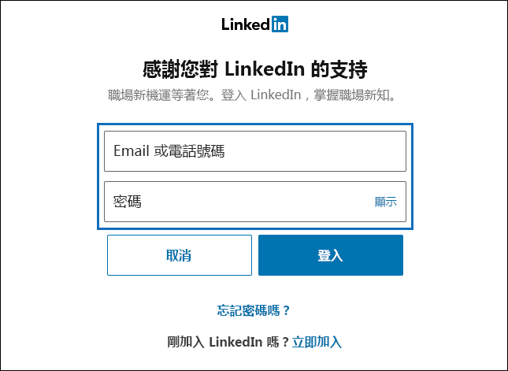
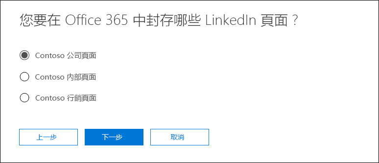

# <a name="set-up-a-connector-to-archive-linkedin-data-in-office-365-preview"></a>在 Office 365 中設定連接器來封存 LinkedIn 資料 (預覽)

在 Office 365 中封存來自 LinkedIn 公司頁面資料的連接器功能目前處於預覽階段。

在安全性與 Office 365 合規性中心使用原生連接器來匯入並保存來自 LinkedIn 公司頁面的資料。 安裝和設定連接器之後，連接器會每 24 小時連線到特定的 LinkedIn 公司頁面中帳戶一次。 連接器會將張貼至公司頁面的訊息轉換為電子郵件訊息，然後在 Office 365 中將這些項目匯入至信箱。

將 LinkedIn 公司頁面資料儲存在信箱之後，您可以將訴訟資料暫留、內容搜尋、就地封存、稽核與 Office 365 保留原則之類的 Office 365 合規性功能套用至 LinkedIn 資料。 例如，您可以使用內容搜尋來搜尋這些項目，或是在進階電子文件探索案例中將儲存空間信箱與監管人建立關聯。 在 Office 365 中建立連接器以匯入和封存 LinkedIn 資料，可協助組織保持符合政府與法規政策的規範。

## <a name="before-you--begin"></a>開始之前

- 您必須具備 LinkedIn 使用者帳戶登入認證 (電子郵件地址或電話號碼和密碼)，該帳號是您想要封存的 LinkedIn 公司頁面的系統管理員。 您可以使用這些認證在設定連接器時登入 LinkedIn。

- 建立 LinkedIn 公司頁面連接器的使用者，必須獲指派 Exchange Online 中的信箱匯入匯出角色。 這是存取安全性與合規性中心的 [封存第三方資料]**** 頁面所需。 依預設，此角色不會指派給 Exchange Online 內的任何角色群組。 您可以在 Exchange Online 中將「信箱匯入匯出」角色新增至「組織管理」角色群組。 或者您可以建立角色群組、指派「信箱匯入匯出」角色，然後將適當的使用者新增為成員。 如需詳細資訊，請參閱「在 Exchange Online 中管理角色群組」文章中的[建立角色群組](https://docs.microsoft.com/Exchange/permissions-exo/role-groups#create-role-groups)或[修改角色群組](https://docs.microsoft.com/Exchange/permissions-exo/role-groups#modify-role-groups)小節。

## <a name="create-a-linkedin-connector"></a>建立 LinkedIn 連接器

1. 移至 <https://protection.office.com>，按一下 [資料控管] \> [匯入]****，然後按一下 [封存第三方資料]****。

2. 在 [封存第三方資料]**** 頁面上，按一下 [新增連接器]****，然後按一下 **LinkedIn**。

3. 在 [服務條款]**** 頁面上，按一下 [接受]****。

4. 在 [使用 LinkedIn 登入]**** 頁面上，按一下 [使用 LinkedIn 登入]****。

   LinkedIn 登入頁面隨即顯示。

   

5. 在 LinkedIn 登入頁面上，輸入與您想要封存的公司頁面相關聯的 LinkedIn 帳戶的電子郵件地址 (或電話號碼) 和密碼，然後按一下 [登入]****。

   精靈頁面隨即會顯示與您登入的帳戶相關聯的所有 LinkedIn 公司頁面的清單。 您只能針對一個公司頁面設定一個連接器。 如果您的組織有多個 LinkedIn 公司頁面，則必須為每個頁面建立一個連接器。

   


6. 選取您要從中封存項目的公司頁面，然後按 [下一步]****。

7. 在 [設定篩選器]**** 頁面上，您可以套用篩選器以開始匯入特定存留期的項目。 選取某個存留期，然後按 [下一步]****。

8. 在 [設定儲存空間帳戶]**** 頁面上，輸入將匯入 LinkedIn 項目的目標 Office 365 信箱的電子郵件地址，然後按 [下一步]****。 項目會匯入至此信箱中的 [收件匣] 資料夾。

9. 檢閱連接器設定，然後按一下 [儲存]**** 來完成連接器設定。

建立連接器之後，您可以返回 [封存第三方資料]**** 頁面來檢視新的連接器 (必要時按一下 [重新整理]**** 來更新連接器清單)。 [狀態]**** 欄中的值為**正在等待啟動**。 最多需要 24 小時的時間，才能開始初始匯入程序。 在連接器第一次執行並匯入 LinkedIn 項目後，連接器會每 24 小時執行一次，並匯入在過去 24 小時於 LinkedIn 公司頁面上建立的任何新項目。

若要檢視更多詳細資訊，請按一下 [封存第三方資料]**** 頁面上清單中的連接器，以顯示飛出視窗。 在 [狀態]**** 下，顯示的日期範圍會指出建立連接器時所選取的存留期篩選器。 

## <a name="more-information"></a>詳細資訊

- LinkedIn 項目會匯入到 Office 365 中儲存空間信箱的 [收件匣] 資料夾。 這些項目會顯示為電子郵件訊息。 郵件的寄件者顯示名稱為 LinkedIn 公司頁面名稱。 寄件者的實際的電子郵件地址是儲存信箱的電子郵件地址。 也會將公司頁面的名稱附加至主旨行的前端。 

- 因為前述的行為，使用 Microsoft 電子文件探索工具來搜尋封存在 Office 365 中的 LinkedIn 項目時，您可以搜尋 `from` 或 `subject` 電子郵件內容。 例如，如果公司頁面的名稱為「Contoso 公司頁面」，您可以在關鍵字搜尋查詢中使用下列其中一個 *property:value* 組：
   
   ```
   from:"Contoso Company Page"
   ```

    或

   ```
   subject:"Contoso Company Page"
   ```

- 為了讓您易於找出或管理匯入至 Office 365 的 LinkedIn 項目，信箱儲存空間的擁有者 (或獲指派 FullAccess 權限的任何人) 都可以設定收件匣規則，將來自特定 LinkedIn 公司頁面的項目移至特定資料夾。 如果儲存空間信箱會用來封存從不同第三方資料來源匯入的項目，則此方式會很有用。 比方說，您可以建立收件匣規則，將主旨欄位中包含特定 LinkedIn 公司頁面名稱的所有項目移動至特定資料夾。