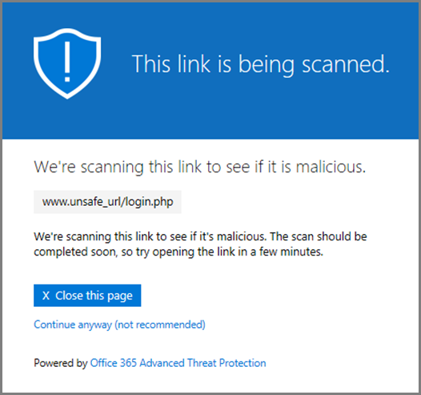

# Office 365 ATP 安全連結警告頁面

[Office 365 的進階的威脅保護](office-365-atp.md)(ATP) 可協助保護您的組織網路釣魚嘗試及透過功能，例如[ATP 安全連結](atp-safe-links.md)、 [ATP 安全附件](atp-safe-attachments.md)及[反網路釣魚保護](anti-phishing-protection.md)惡意程式碼。備妥保護時，就會檢查電子郵件訊息與 Office 文件中的連結 (Url)。如果 URL 會被識別為可疑或惡意，可能會遭到封鎖在按一下時開啟 URL。而非直接進入網站，您可能會看到警告] 頁面。 
  
請閱讀本篇文章以查看[警告頁面的範例](atp-safe-links-warning-pages.md#examples)，以及[最近使用更新為警告頁面](atp-safe-links-warning-pages.md#updates)可能會出現。
  
## 警告頁面的範例

### ATP 會掃描連結

URL 是要掃描的 ATP 安全的連結。您可能必須等候幾分鐘再試一次] 連結。

### URL 是可疑的電子郵件訊息

URL 是似乎類似於其他視為可疑的電子郵件訊息的電子郵件訊息中。我們建議您再次檢查電子郵件再繼續進行至網站。

### URL 會被識別為網路釣魚嘗試在郵件中

URL 會被識別為網路釣魚攻擊電子郵件訊息中。因此，封鎖電子郵件中的所有 Url。我們建議您不要不繼續至網站。

### 站台已識別為惡意

URL 指向已識別為惡意的網站。    我們建議您不要不繼續至網站。

### 封鎖網站

您的組織會封鎖 URL。有數個原因可能會封鎖 URL 的原因。我們建議您連絡組織的 Office 365 系統管理員。

### 發生錯誤

發生錯誤的某種類型，並無法開啟 URL。

## 警告頁面新版更新

Office 365 ATP 最近已更新數個警告頁面。如果尚未準備看到 [更新] 頁面，您將推出。更新加入新的色彩配置、 詳細資訊，並繼續進行至而不管的特定警告和建議的網站的能力。

### 進行中的 URL 掃描

原始的警告] 頁面上：

![原始的警告] 頁面上進行中的 URL 掃描的相關](media/04368763-763f-43d6-94a4-a48291d36893.png)

更新的警告] 頁面上：

### 惡意網站警告

原始的警告] 頁面上：

![原始的警告] 頁面上的惡意網站的相關](media/b9efda09-6dd8-46ef-82cb-56e4d538b8f5.png)

更新的警告] 頁面上：

### 封鎖 URL 警告

原始的警告] 頁面上：

![原始的警告] 頁面上的封鎖 URL 的相關](media/3d6ba028-30bf-45fc-958e-d3aad3defc83.png)

更新的警告] 頁面上：

### 「 發生錯誤 」 警告] 頁面

原始的警告] 頁面上：

![原始"發生錯誤 」 警告] 頁面](media/9aaa4383-2f23-48be-bdaa-8efbcb2acc70.png)

更新的警告] 頁面上：

   
## 相關主題

[Office 如何協助您免受網路釣魚配置](https://support.office.com/article/be0de46a-29cd-4c59-aaaf-136cf177d593)
  
[Office 365 ATP 安全連結](atp-safe-links.md)
  
[Office 365 ATP 安全附件](atp-safe-attachments.md)
  
[Office 365 中的反垃圾郵件和反惡意程式碼保護](anti-spam-and-anti-malware-protection.md)
  

