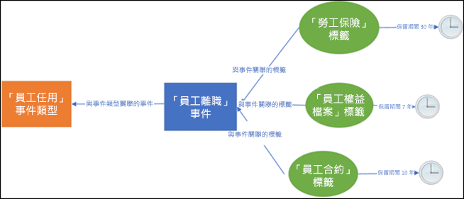
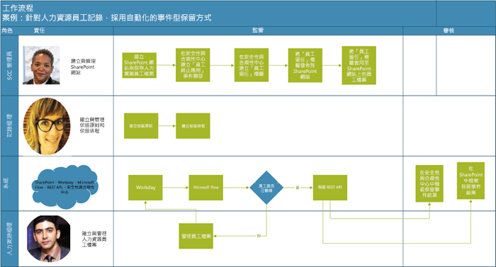
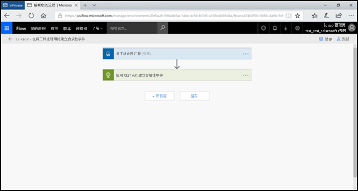
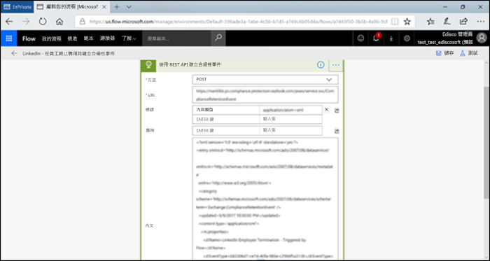
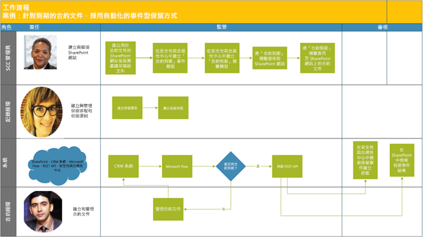
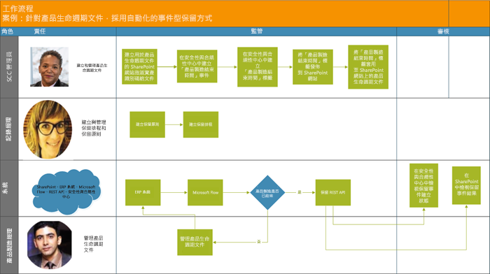

# 自動化事件型保留

組織中的內容量暴增，內容逐漸變得冗餘、過時且瑣碎，有關內容的各種問題已經變成一項嚴重的議題。為了持續迎接法律、商務和法規遵循方面的挑戰，組織必須具備保留和保護重要資訊、同時又能快速找出相關內容的能力。將資訊去蕪存菁，只保留重要且相關的資訊將成為企業致勝的關鍵。

為此，組織可以利用 Office 365 安全規範中心的保留解決方案。保留解決方案可以使用[保留標籤](labels.md)進行觸發。保留標籤可以[根據特定事件選擇保留期間](event-driven-retention.md)。一般而言，保留期間是依據已知的日期，例如內容的建立日期或上次修改日期。然而，組織也可以要求依據事件的發生進行內容處置，例如員工離開組織 7 年後。

為確保內容的處置符合規範，請務必了解事件發生的時間。隨著內容量的迅速暴增，以即時且符合規範的方法保留和處置內容已經演變成一項重大的挑戰。

事件型保留可以解決這個問題。本主題說明如何使用 Microsoft 365 REST API 透過事件進行自動化保留，設定您的商務程序流程。

## 關於事件型保留

組織的規模可以是小型、中型或大型。每日建立和管理的商務文件、法律文件、員工檔案、合約和產品文件的數量卻是急遽增加。

舉例來說，每天有數以百計的員工加入或離開組織，HR 部門依據企業要求不斷地建立、更新或刪除員工相關的文件。這個程序必須針對企業綱要遵循不同的保留原則：

- **內容的保留期間可以是已知的日期**，例如內容的建立日期、上次修改日期或標籤日期。例如，您可以在文件建立後保留文件七年，然後再刪除文件。

- **內容的保留期間也可以是未知的日期**。例如，您可以使用保留標籤，將保留期間設定成依據特定類型事件的發生時間，例如員工離開組織。

事件會觸發保留期間開始進行。在加上標籤的內容中，所有適用於該事件類型的內容都會強制執行標籤的保留動作。這項功能稱為事件型保留，若要深入了解，請參閱[事件導向保留概觀](event-driven-retention.md)。

## 設定事件型保留

本節描述保留內容前必須完成的工作。

### 識別角色

找出組織中執行記錄管理工作，負責有效且有效率地保留商務文件的各種角色。

  | **角色**| **角色**|
  | - | - |
  | 安全規範中心管理員 | 在 SharePoint 中建立保留事件類型、保留標籤和記錄存放庫 |
  | 記錄管理員                                  | 提供保留原則和保留排程的指引和規範詳細資料   |
  | 系統管理員 (企業)                          | 設定和管理外部系統以使用 Microsoft 365                       |
  | 資訊工作者                               | 管理商務程序 (HR、財務、IT 等) 的生命週期                 |

### 設定安全規範中心
  
1. 規範管理員建立事件類型，例如，僱用終止或合約到期或產品製造結束 (請參閱[事件保留文章](https://docs.microsoft.com/zh-TW/office365/securitycompliance/event-driven-retention)中的逐步程序
    
1. 規範管理員依據事件建立保留標籤，將標籤與事件類型建立相關聯
    
1. 保留標籤有 4 種類型的觸發程序：
            
    1. 建立日期
                
    1. 上次修改日期
                
    1. 標籤日期 (內容加上標籤的日期)
                
    1. 事件型
    
1. 規範管理員發佈標籤

### 設定 SharePoint
   
若要建立記錄存放庫，規範系統管理員必須：

1. 建立 SharePoint 網站。

1. 執行下列其中一項動作：
        
    - 建立 SharePoint 文件庫。在文件庫層級設定事件型標籤。如需更多資訊，請參閱[將預設的保留標籤套用至 SharePoint 文件庫、資料夾或文件組的所有內容](labels.md#applying-a-default-retention-label-to-all-content-in-a-sharepoint-library-folder-or-document-set)。
          
    - 在 SharePoint 中設定文件組。如需更多資訊，請參閱[文件組簡介](https://support.office.com/zh-TW/article/Introduction-to-Document-Sets-3DBCD93E-0BED-46B7-B1BA-B31DE2BCD234)。
      
1. 指派資產 ID (資產 ID 是組織使用的產品名稱或代碼，例如，員工編號可以是資產 ID) 給每一個員工文件組 (透過指派資產 ID 給資料夾的方式，該資料夾內的每個項目都會自動繼承相同的資產 ID。這意味著所有的項目可以透過相同的事件觸發保留期間。

## 觸發事件型保留的方法

有兩種方法可以觸發事件型保留：

- **使用安全規範中心的使用者介面**這個程序可以用於一次保留較少的內容，或是觸發頻率不高的保留，例如每月或每年的頻率。如需更多有關此方法資訊，請參閱[事件導向保留概觀](event-driven-retention.md)。然而，這個觸發保留的方法可能非常耗時且容易發生錯誤，從而阻礙了保留的擴展性。因此，使用自動化流暢的解決方案進行觸發保留將可以增強資料的安全性與合規性。

- **使用 M365 REST API**這個程序可以用於一次保留大量內容的時候，和 (或) 觸發頻率高的保留，例如每日或每週的頻率。當偵測到您的商務線系統內發生事件時，流程會接著在安全規範中心內自動建立相關的事件。因此，每次發生事件時，您不需要在使用者介面手動建立事件。

有兩個選項可以使用 REST API：

- **Microsoft Flow 或類似的應用程式**可以用於自動觸發事件的發生。Microsoft Flow 是連線至其他系統的協調器。使用 Microsoft Flow 不需要自訂的解決方案。

- **PowerShell 或 HTTP 用戶端呼叫 REST API**使用 PowerShell (6 或更新版本) 呼叫 Microsoft 365 REST API 建立事件。 

Rest API 是支援 HTTP 操作組 (方法) 的服務端點，提供服務資源的建立、擷取、更新、刪除等存取權，如需更多資訊，請參閱 [REST API 要求/回應的元件](https://docs.microsoft.com/zh-TW/rest/api/gettingstarted/#components-of-a-rest-api-requestresponse)。在這種情況下，透過使用 Microsoft 365 REST API，使用 POST 和 GET 操作 (方法) 可以建立和擷取事件。

## 範例案例

讓我們來考慮以下案例。

### 案例 1：員工離開組織 

組織針對每位員工建立和儲存無數的員工相關文件。這些文件會在每位員工的僱用期間內進行管理和保留。然而，當員工離開組織或僱用終止時，組織有義務根據法律和商務要求在約定時間內保留該位員工的文件。

現在，如果每天有多位員工離開組織，組織每天必須觸發數以千百份文件的保留計時器。

除此之外，還要根據員工記錄的類型計算每位離職員工的保留期間，即僱用終止日期加上天數、月數或年數。例如，同一位員工的薪資補償和福利申報可能需要不同的保留期間。

下圖顯示多個標籤與單一事件相關聯的情況。在圖中，員工薪資補償標籤下的所有檔案與員工福利標籤下的所有檔案同時與單一事件相關聯，這個單一事件是員工離開組織。這些文件各自有不同的保留計時器。因此，當員工離開組織時，在每一個標籤內的文件會開始經歷不同的保留期間。若要針對每一位員工的每一種文件類型或標籤觸發所有不同的保留計時器，這是一項非常具有挑戰性的任務。請再想像一下，為多位員工執行這項任務的情形。

因此，以自動化程序針對多位員工觸發不同的保留計時器不僅節省時間、減少錯誤，而且非常有效率。

**針對這個案例設定自動化事件型保留：**

  - 管理員在文件組建立員工資料夾，例如李莉華、王立民。

  - 管理員將員工檔案新增至每一位員工的員工資料夾，例如福利、薪水、員工的薪資補償

  - 管理員指派資產 ID 至每一個員工資料夾。 

  - SCC 管理員

  - 登入安全規範中心

  - SCC 管理員在安全規範中心建立員工相關的事件類型，例如「僱用終止」、「僱用員工」。

  - SCC 管理員在安全規範中心建立「員工保留」標籤。

  - 這個「員工保留」標籤可以手動或自動發佈並套用至 SharePoint 中的員工檔案

  - HR 管理系統 (例如 Workday) 可以使用 Microsoft Flow 定期執行管理員工檔案

  - 如果員工離開組織，M365 事件型保留 REST API 將會開始特定員工檔案的保留計時器。

#### 使用 Microsoft Flow

步驟 1- 建立流程以使用 Microsoft 365 REST API 建立事件

##### 建立事件

呼叫 REST API 的範例程式碼

<table>
<thead>
<tr class="header">
<th>Method</th>
<th>POST</th>
<th></th>
</tr>
</thead>
<tbody>
<tr class="odd">
<td>URL</td>
<td>https://ps.compliance.protection.outlook.com/psws/service.svc/ComplianceRetentionEvent)</td>
<td></td>
</tr>
<tr class="even">
<td>Headers</td>
<td>Content-Type</td>
<td>application/atom+xml</td>
</tr>
<tr class="odd">
<td>Body</td>
<td>
&lt;?xml version='1.0' encoding='utf-8' standalone='yes'?&gt;

&lt;entry xmlns:d='http://schemas.microsoft.com/ado/2007/08/dataservices'

xmlns:m='http://schemas.microsoft.com/ado/2007/08/dataservices/metadata'

xmlns='http://www.w3.org/2005/Atom'&gt;

&lt;category scheme='http://schemas.microsoft.com/ado/2007/08/dataservices/scheme' term='Exchange.ComplianceRetentionEvent' /&gt;

&lt;updated&gt;9/9/2017 10:50:00 PM&lt;/updated&gt;

&lt;content type='application/xml'&gt;

&lt;m:properties&gt;

&lt;d:Name&gt;僱用終止 &lt;/d:Name&gt;

&lt;d:EventType&gt;99e0ae64-a4b8-40bb-82ed-645895610f56&lt;/d:EventType&gt;

&lt;d:SharePointAssetIdQuery&gt;1234&lt;/d:SharePointAssetIdQuery&gt;

&lt;d:EventDateTime&gt;2018-12-01T00:00:00Z &lt;/d:EventDateTime&gt;

&lt;/m:properties&gt;

&lt;/content&gt;

&lt;/entry&gt;
</td>
<td></td>
</tr>
<tr class="even">
<td>驗證</td>
<td>基本</td>
<td></td>
</tr>
<tr class="odd">
<td>使用者名稱</td>
<td>“Complianceuser”</td>
<td></td>
</tr>
<tr class="even">
<td>密碼</td>
<td>“Compliancepassword”</td>
<td></td>
</tr>
</tbody>
</table>

##### 可用的參數

<table>
<thead>
<tr class="header">
<th><strong>參數</strong></th>
<th><strong>描述</strong></th>
<th><strong>附註</strong></th>
</tr>
</thead>
<tbody>
<tr class="odd">
<td>&lt;d:Name&gt;&lt;/d:Name&gt;</td>
<td>提供事件的唯一名稱，</td>
<td>結尾不可有空格以及下列字元：% * \ &amp; &lt; &gt; | # ? , : ;</td>
</tr>
<tr class="even">
<td>&lt;d:EventType&gt;&lt;/d:EventType&gt;</td>
<td>輸入事件類型名稱 (或 Guid)</td>
<td>例如：「僱用終止」。事件類型必須與保留標籤相關聯。</td>
</tr>
<tr class="odd">
<td>&lt;d:SharePointAssetIdQuery&gt;&lt;/d:SharePointAssetIdQuery&gt;</td>
<td>輸入 ComplianceAssetId: + 員工 ID</td>
<td>例如：&quot;ComplianceAssetId:12345&quot;</td>
</tr>
<tr class="even">
<td>&lt;d:EventDateTime&gt;&lt;/d:EventDateTime&gt;</td>
<td>事件的日期和時間</td>
<td>
格式：yyyy-MM-ddTHH:mm:ssZ，例如：

2018-12-01T00:00:00Z
</td>
</tr>
</tbody>
</table>

##### 回應碼

| **回應碼** | **描述**       |
| ----------------- | --------------------- |
| 302               | 重新導向              |
| 201               | 建立時間               |
| 403               | 授權失敗  |
| 401               | 驗證失敗 |

##### 依據時間範圍取得事件

<table>
<thead>
<tr class="header">
<th>Method</th>
<th>GET</th>
<th></th>
</tr>
</thead>
<tbody>
<tr class="odd">
<td>URL</td>
<td><ol start="4" type="1">
<li>
https://ps.compliance.protection.outlook.com/psws/service.svc/ComplianceRetentionEvent?BeginDateTime=2019-01-11&amp;EndDateTime=2019-01-16
</li>
</ol></td>
<td></td>
</tr>
<tr class="even">
<td>Headers</td>
<td>Content-Type</td>
<td>application/atom+xml</td>
</tr>
<tr class="odd">
<td></td>
<td></td>
<td></td>
</tr>
<tr class="even">
<td>驗證</td>
<td>基本</td>
<td></td>
</tr>
<tr class="odd">
<td>使用者名稱</td>
<td>“Complianceuser”</td>
<td></td>
</tr>
<tr class="even">
<td>密碼</td>
<td>“Compliancepassword”</td>
<td></td>
</tr>
</tbody>
</table>

##### 回應碼

| **回應碼** | **描述**                   |
| ----------------- | --------------------------------- |
| 200               | 好的，以 atom+ xml 格式列出事件清單 |
| 404               | 找不到                         |
| 302               | 重新導向                          |
| 401               | 授權失敗              |
| 403               | 驗證失敗             |

##### 依 ID 取得事件

| Method         | GET   |                      |
| -------------- | ------------------------------------------------------------------------------------------------------------------------------------------------------------------------------------------------------------------------------------------------------------------ | -------------------- |
| URL            | [https://ps.compliance.protection.outlook.com/psws/service.svc/ComplianceRetentionEvent(‘174e9a86-74ff-4450-8666-7c11f7730f66’)](https://ps.compliance.protection.outlook.com/psws/service.svc/ComplianceRetentionEvent\('174e9a86-74ff-4450-8666-7c11f7730f66'\)) |                      |
| Header         | Content-Type                                                                                                                                                                                                                                                       | application/atom+xml |
| 驗證 | 基本                                                                                                                                                                                                                                                              |                      |
| 使用者名稱       | “Complianceuser”                                                                                                                                                                                                                                                   |                      |
| 密碼       | “Compliancepassword”                                                                                                                                                                                                                                               |                      |

##### 回應碼

| **回應碼** | **描述**                                      |
| ----------------- | ---------------------------------------------------- |
| 200               | 好的，回應本文包含有 atom+xml 格式的事件 |
| 404               | 找不到                                            |
| 302               | 重新導向                                             |
| 401               | 授權失敗                                 |
| 403               | 驗證失敗                                |

##### 依名稱取得事件

| Method         | GET       |                      |
| -------------- | -------------------------------------------------------------------------------------------------------------------------------------------- | -------------------- |
| URL            | <https://ps.compliance.protection.outlook.com/psws/service.svc/ComplianceRetentionEvent('EventByRESTPost-2226bfebcc2841a8968ba71f9516b763')> |                      |
| Headers        | Content-Type                                                                                                                                 | application/atom+xml |
| 驗證 | 基本                                                                                                                                        |                      |
| 使用者名稱       | “Complianceuser”                                                                                                                             |                      |
| 密碼       | “Compliancepassword”                                                                                                                         |                      |

##### 回應碼

| **回應碼** | **描述**                                      |
| ----------------- | ---------------------------------------------------- |
| 200               | 好的，回應本文包含有 atom+xml 格式的事件 |
| 404               | 找不到                                            |
| 302               | 重新導向                                             |
| 401               | 授權失敗                                 |
| 403               | 驗證失敗                                |

#### 使用 PowerShell (6 或更新版本) 或任何 HTTP 用戶端

步驟 1：連線至 PowerShell。

步驟 2：執行下列指令碼。

<table>
<tbody>
<tr class="odd">
<td>
param([string]$baseUri)

$userName = &quot;admin@o365ediscoverydemo.onmicrosoft.com&quot;

$password = &quot;EDiscoO365Demo&quot;

$securePassword = ConvertTo-SecureString $password -AsPlainText -Force

$credentials = New-Object System.Management.Automation.PSCredential($userName, $securePassword)

$EventName=&quot;EventByRESTPost-$(([Guid]::NewGuid()).ToString('N'))&quot;

Write-Host &quot;開始建立下列名稱的事件：$EventName&quot;

$body = &quot;&lt;?xml version='1.0' encoding='utf-8' standalone='yes'?&gt;

&lt;entry xmlns:d='http://schemas.microsoft.com/ado/2007/08/dataservices'

xmlns:m='http://schemas.microsoft.com/ado/2007/08/dataservices/metadata'

xmlns='http://www.w3.org/2005/Atom'&gt;

&lt;category scheme='http://schemas.microsoft.com/ado/2007/08/dataservices/scheme' term='Exchange.ComplianceRetentionEvent' /&gt;

&lt;updated&gt;7/14/2017 2:03:36 PM&lt;/updated&gt;

&lt;content type='application/xml'&gt;

&lt;m:properties&gt;

&lt;d:Name&gt;$EventName&lt;/d:Name&gt;

&lt;d:EventType&gt;e823b782-9a07-4e30-8091-034fc01f9347&lt;/d:EventType&gt;

&lt;d:SharePointAssetIdQuery&gt;'ComplianceAssetId:123'&lt;/d:SharePointAssetIdQuery&gt;

&lt;/m:properties&gt;

&lt;/content&gt;

&lt;/entry&gt;&quot;

$event = $null

try

{

$event = Invoke-RestMethod -Body $body -Method 'POST' -Uri &quot;$baseUri/ComplianceRetentionEvent&quot; -ContentType &quot;application/atom+xml&quot; -Authentication Basic -Credential $credentials -MaximumRedirection 0

}

catch

{

$response = $_.Exception.Response

if($response.StatusCode -eq &quot;Redirect&quot;)

{

$url = $response.Headers.Location

Write-Host &quot;redirected to $url&quot;

$event = Invoke-RestMethod -Body $body -Method 'POST' -Uri $url -ContentType &quot;application/atom+xml&quot; -Authentication Basic -Credential $credentials -MaximumRedirection 0

}

}

$event | fl *
</td>
</tr>
</tbody>
</table>

#### 確認兩個選項的結果

步驟 1：前往安全規範中心

步驟 2：按一下 [資料控管] 下的 [事件]

步驟 3：確認已建立 [事件]。

同樣地，上述自動化事件型保留的選項也可以用於下列案例。

### 案例 2：合約到期

組織與客戶、供應商和合作夥伴間的單一合約可以有多筆記錄。這些文件可以存放在如 SharePoint 的文件庫中。合約的結束決定與合約相關聯文件保留期間的開始。例如，所有與合約相關的記錄必須自合約到期日開始保留五年。觸發五年保留期間的事件就是合約到期。

客戶關係管理 (CRM) 系統可以使用 Microsoft 365 並觸發合約文件的保留

**針對這個案例設定自動化事件型保留：**

  - 管理員針對每一種合約類型使用各種資料夾建立 SharePoint 文件庫。

  - 系統管理員將合約檔案 (例如授權合約、開發合約) 新增至每一個合約資料夾

  - 管理員指派資產 ID 至每一個合約資料夾

  - SCC 管理員登入安全規範中心

  - SCC 管理員在安全規範中心建立合約相關的事件類型，例如「合約建立日」、「合約到期日」事件。

  - SCC 管理員在安全規範中心建立「合約到期」標籤。

  - 這個「合約到期」標籤可以手動或自動發佈並套用至 SharePoint 中的合約檔案

  - 合約管理系統可以使用 Microsoft Flow 或類似的應用程式進行定期執行管理合約檔案

  - 如果合約到期，Microsoft Flow 將會觸發 M365 事件型保留 REST API，開始特定合約檔案的保留計時器。

### 案例 3：產品製造結束

生產各種產品線的製造公司建立許多製造規格和價格文件。當產品不再製造時，所有連結至這個產品的規格和文件都必須在產品存留期結束後保留一段特定的時間。

企業資源規劃 (ERP) 系統可以使用 Microsoft 365 和 Microsoft Flow 觸發保留。

**針對這個案例設定自動化事件型保留：**

  - 管理員在文件組建立產品資料夾，例如產品 1、產品 2 等。

  - 管理員將產品檔案新增至每一個產品資料夾，例如製造規格、產品價格、產品授權

  - 管理員指派資產 ID 至每一個產品資料夾。

  - SCC 管理員登入安全規範中心

  - SCC 管理員在安全規範中心建立員工相關的事件類型，例如「產品製造開始」、「產品製造結束」事件。

  - SCC 管理員在安全規範中心建立「產品製造結束」標籤。

  - 這個「產品製造結束」標籤可以手動或自動發佈並套用至 SharePoint 中的產品檔案

  - ERP 系統可以使用 Microsoft Flow 或類似的應用程式進行定期執行管理產品檔案

  - 如果產品的製造結束，Microsoft Flow 將會觸發 M365 事件型保留 REST API，開始特定產品檔案的保留計時器。

## 附錄

### 使用重新導向 302 回應結果呼叫 REST API

1.  使用 REST API URL 叫用 POST 保留事件呼叫<https://ps.compliance.protection.outlook.com/psws/service.svc/ComplianceRetentionEvent> (需要全域管理員權限)

2.  檢查回應碼。如果是 302，則從回應標頭的 Location 屬性取得重新導向的 URL

3.  使用重新導向的 URL 再次叫用 POST 保留事件呼叫。

## 參與名單

本主題的檢閱者：

Antonio Maio Microsoft Office Apps and Services MVP  Antonio.Maio@Protiviti.com
