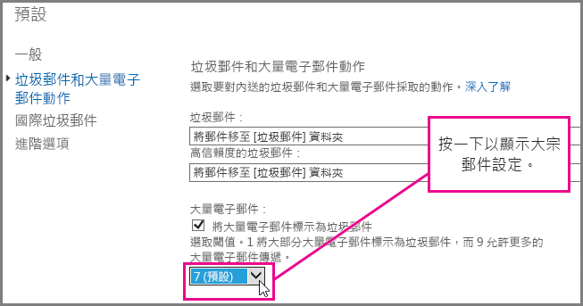
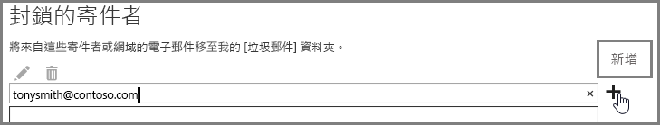

## <a name="customize-the-office-365-anti-spam-filter-with-these-settings"></a>利用這些設定來自訂 Office 365 反垃圾郵件篩選器

系統管理員可以使用數個 Office 365 垃圾郵件篩選器設定，來協助防止垃圾郵件傳送到使用者收件匣。如果您使用此處所列的選項，Office 365 垃圾郵件篩選器將更能封鎖垃圾郵件，並避免誤判郵件。在此情況下，誤判指的是垃圾郵件傳送到使用者的收件匣。
  
### <a name="block-ip-addresses-with-a-connection-filter"></a>利用連線篩選器封鎖 IP 位址

將寄件者 IP 位址新增到連線篩選器 IP 封鎖清單，來自訂您的 Office 365 垃圾郵件篩選器：
  
1. 如[郵件標頭分析器](https://go.microsoft.com/fwlink/p/?LinkId=306583)所述，取得您想要在郵件用戶端 (例如 Outlook 或 Outlook 網頁版 (之前稱為 Outlook Web App)) 封鎖之郵件的標頭。
    
2. 使用[郵件標頭分析器](https://testconnectivity.microsoft.com/?tabid=mha)或手動搜尋位在 X-Forefront-Antispam-Report 標頭中 CIP 標籤後面的 IP 位址。 
    
3. 遵循[設定連線篩選原則](https://technet.microsoft.com/en-us/library/jj200718%28v=exchg.150%29.aspx) (機器翻譯) 中「使用 EAC 來編輯預設連線篩選原則」中的步驟，將 IP 位址新增至 IP 封鎖清單。
    
### <a name="block-bulk-mail-with-mail-flow-rules-transport-rules-or-the-spam-filter"></a>利用郵件流程規則 (傳輸規則) 或垃圾郵件篩選器封鎖大宗郵件

垃圾郵件主要是大宗郵件，例如新聞稿或促銷活動嗎？如果您[使用郵件流程規則來設定大量電子郵件的篩選](use-transport-rules-to-configure-bulk-email-filtering.md) (機器翻譯)，或在垃圾郵件篩選器的[進階垃圾郵件篩選選項](advanced-spam-filtering-asf-options.md) (機器翻譯) 中開啟 [大宗郵件]**** 設定，則可以自訂 Office 365 中的垃圾郵件篩選器。在 Exchange 系統管理中心，開始按一下 [保護]**** \> [內容篩選器]****，然後按兩下您要調整的篩選原則。按一下 [垃圾郵件和大宗郵件動作]****，來調整設定，如下所示。 
  

  
### <a name="block-email-spam-using-spam-filter-block-lists"></a>使用垃圾郵件篩選器封鎖清單封鎖電子郵件垃圾郵件

[設定垃圾郵件篩選原則](https://technet.microsoft.com/en-us/library/jj200684%28v=exchg.150%29.aspx) (機器翻譯)，將寄件者地址新增至寄件者封鎖清單，或將網域新增至垃圾郵件篩選器中的網域封鎖清單。電子郵件若來自垃圾郵件篩選器封鎖清單上的寄件者或網域，即會被標示為垃圾郵件。 
  
## <a name="email-users-can-also-help-ensure-that-false-negative-and-email-spam-is-blocked-with-office-365-spam-filter"></a>電子郵件使用者也可以使用 Office 365 垃圾郵件篩選器，來協助確定封鎖誤判和電子郵件垃圾郵件

如果您告訴使用者將垃圾郵件寄件者地址新增至其封鎖的寄件者清單 (位於 [Outlook](https://go.microsoft.com/fwlink/p/?LinkId=270065) 或 [Outlook 網頁版](https://go.microsoft.com/fwlink/p/?LinkId=294862) 中)，它將有助於您的 Office 365 防止誤判和垃圾郵件的反垃圾郵件工作。在 Outlook 網頁版中，按一下 [設定]**** \> [選項]**** \> [封鎖或允許]****，然後將地址新增至 [封鎖的寄件者]**** 清單，如下所示。 
  

  
> [!NOTE]
> 如需安全寄件者清單的詳細資訊，請參閱[安全寄件者和封鎖的寄件者清單常見問題集](https://technet.microsoft.com/en-us/library/dn133608%28v=exchg.150%29.aspx) (機器翻譯)。 
  
## <a name="eop-only-customers-set-up-directory-synchronization"></a>只使用 EOP 的客戶：設定目錄同步處理

如果您透過目錄同步處理將使用者設定與服務同步，以確保遵守您封鎖的寄件者，它將協助您避免誤判電子郵件垃圾郵件。如需詳細資訊，請參閱「管理 EOP 中的郵件使用者」中的「使用目錄同步處理來管理郵件使用者」。
  
## <a name="eop-only-customers-who-are-not-using-directory-synchronization"></a>不使用目錄同步處理的 EOP 專屬客戶

EOP 服務的設計旨在接受使用者的安全和封鎖的寄件者，如果已與此服務共用資訊的話。如果您是使用 Outlook 的 EOP 客戶，但未將目錄同步處理設定為將您的使用者同步至 Office 365 ，則仍然可以使用封鎖的寄件者，停止將郵件傳遞到您使用者的收件匣。不過，您可能必須在下列情況中設定一些 Exchange 郵件流程規則：
  
- 如果郵件透過 EOP 進行一般垃圾郵件篩選，然後傳遞至本機內部部署 Exchange Server，而且 EOP 將垃圾郵件判決指派為 SCL 1-4 (非垃圾郵件)，則您使用者的本機封鎖的寄件者清單將會覆寫 EOP 垃圾郵件篩選判決，並將它傳遞至他們的垃圾郵件資料夾。
    
- 如果 Exchange 郵件流程規則將 EOP 中的郵件指派為 SCL-1，或由於 IP 位址或網域是在您的允許清單中而有此指派，則系統會使用連接器將 SCL 傳播至內部部署 Exchange Server。在此情況下，系統不會強制採用您使用者的封鎖的寄件者清單。若要變更此情況，您可以建立本機郵件流程規則，將 SCL 設為 0。這將導致 Outlook 強制採用您使用者的本機封鎖的寄件者清單。
    
**設定郵件流程規則，以使用封鎖的寄件者清單，停止郵件傳遞到您使用者的收件匣**
  
1. 在您的內部部署伺服器上開啟 Exchange 管理命令介面。若要了解如何在您的內部部署 Exchange 組織上開啟 Exchange 管理命令介面，請參閱[開啟 Exchange 管理命令介面](https://technet.microsoft.com/library/dd638134%28v=exchg.160%29.aspx) (機器翻譯)。
    
2. 執行下列命令，將內容篩選的垃圾郵件路由傳送至 [垃圾郵件] 資料夾，以便更新被標示為 SCL l-1 的每一封郵件上的 SCL：
    
  ```
  New-TransportRule "NameForRule" -HeaderContainsMessageHeader "X-Forefront-Antispam-Report" -HeaderContainsWords "SCL:-1" -SetSCL 0
  ```

    因為在您的內部部署 Exchange Server 中，SCL 為 0，所以非垃圾郵件將會傳遞到您使用者的收件匣，但仍允許使用者的本機封鎖的寄件者清單將它們傳送到垃圾郵件。如果您使用的是 EOP 中的垃圾郵件隔離，則在您使用者的安全清單上的寄件者仍將有可能被識別為垃圾郵件，並傳送至隔離區。不過，如果您使用的是本機信箱中的 [垃圾郵件] 資料夾，這將允許傳遞到安全寄件者的收件匣。

> [!WARNING]
> 如果您使用郵件流程規則，將 SCL 值變更為 0 (或 -1 以外的任何值)，則所有 Outlook 垃圾郵件選項將套用到郵件。這表示將接受封鎖和安全清單，同時也表示，沒有來自封鎖或安全清單之地址的郵件可能會被客戶端垃圾郵件篩選處理作業標示為垃圾郵件。如果您想要讓 Outlook 處理封鎖和安全清單，但不使用客戶端垃圾郵件篩選器，則您必須在 Outlook 垃圾郵件選項中將選項設為「不自動篩選」。「不自動篩選」是最新 Outlook 版本中的預設選項，但您應該確認此設定適當，以確保客戶端垃圾郵件篩選器不會套用至郵件。身為系統管理員，您可以遵循 [Outlook：停用垃圾郵件 UI 與篩選機制的原則設定](https://support.microsoft.com/en-us/kb/2180568) (機器翻譯) 中的指示，來強制停用 Outlook 垃圾郵件篩選。
  
## <a name="see-also"></a>另請參閱

[Office 365 電子郵件的反垃圾郵件保護](anti-spam-protection.md)
  
[使用安全清單或其他技術防止誤判電子郵件標示為垃圾郵件](prevent-email-from-being-marked-as-spam.md)
