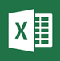

# Office 365 內建行動裝置管理的功能

Office 365 的行動裝置管理可協助您保護和管理例如 Iphone、 Ipad、 Androids，與您組織中的授權 Office 365 使用者所使用的 Windows Phone 行動裝置。您可以建立行動裝置管理原則設定可協助您組織的 Office 365 電子郵件和支援的行動裝置與應用程式的文件的控制存取。遺失或竊裝置時，您可以從遠端抹除裝置移除機密組織資訊。
    
需要更多的功能比隨附 MDM for Office 365 吗？請參閱 Microsoft Intune 是否具有您的需要： [MDM for Office 365 及 Microsoft Intune 之間的選擇](choose-between-mdm-and-intune.md)。
  
## 支援的裝置

您可以使用 Office 365 MDM 安全及管理下列類型的裝置。
  
- Windows Phone 8.1 +
    
- iOS 7.1 或更新版本
    
- Android 4 或更新版本
    
- Windows 8.1\*
    
- Windows 8.1 RT\*
    
- Windows 10\*\*
    
- Windows 10 行動裝置\*\*
    
\*適用於 Windows 8.1 與 Windows 8.1 RT 裝置的存取控制僅限於 Exchange ActiveSync。
  
\*\*需要加入至 Azure Active Directory 及註冊您的組織的行動裝置管理服務中的裝置。
  
如果您組織中的人員使用 Office 365 不支援的行動裝置管理的行動裝置，您可能要封鎖這些裝置，以協助提升您的組織資料安全性的 Office 365 電子郵件的 Exchange ActiveSync 應用程式存取。封鎖 Exchange ActiveSync 的步驟： 請參閱[管理裝置存取設定](manage-device-access-settings.md)。
  
## Office 365 電子郵件和文件的存取控制

下表中的行動裝置的不同類型的支援應用程式會提示使用者在 MDM 中註冊 Office 365 其中有新的行動裝置管理原則套用至使用者的裝置和使用者尚未先前註冊裝置。如果使用者的裝置不遵守原則，根據如何您設定的原則，使用者可能會封鎖從存取這些應用程式] 中的 Office 365 資源或他們可以存取但 Office 365 將會報告原則違規。
  
||**Windows Phone 8.1 +**|**iOS 7.1+**|**Android 4+**|
|:-----|:-----|:-----|:-----|
|**Exchange**   Exchange ActiveSync 包含內建的電子郵件和協力廠商應用程式] like TouchDown，使用 Exchange ActiveSync 版本 14.1 或更新版本。    |Exchange ActiveSync    Exchange 郵件    |Exchange ActiveSync    郵件    |Exchange ActiveSync    電子郵件    |
|**Office** 和**商務用 OneDrive**   |不支援的應用程式    |Outlook    OneDrive    Word    Excel    PowerPoint    |**在手機和平板電腦上：**   Outlook    OneDrive    Word    Excel    PowerPoint    **僅限在手機上：**   Office Mobile    |
   
> [!NOTE]
>  IOS 7.1 與更新版本支援包含 iPhone 與 iPad 裝置。> BlackBerry 裝置管理 Office 365 不支援的行動裝置管理。使用 BlackBerry Business 雲端服務 (BBCS) 從 BlackBerry 管理 BlackBerry 裝置。> 使用者將不會提示註冊並不會封鎖或如果他們使用行動裝置瀏覽器存取 Office 365 SharePoint 網站、 文件中的 Office Online 或 Outlook Web App 中的電子郵件原則違規的報告。 
  
下圖顯示新的裝置的使用者登入應用程式支援 Office 365 的存取控制與 MDM 時會發生什麼情況。使用者會封鎖直到其註冊使用者的裝置存取該應用程式中的 Office 365 資源。
  

  
> [!NOTE]
> Exchange ActiveSync 行動裝置信箱原則和裝置存取規則在 Exchange 系統管理中心中建立的原則和 MDM 中建立的 Office 365 的存取規則會覆寫。裝置在 MDM 中註冊 Office 365 之後，都會被忽略任何 Exchange ActiveSync 行動裝置信箱原則 」 或 「 裝置存取規則套用至裝置。若要深入了解 Exchange ActiveSync，請參閱[Exchange Online 中的 Exchange ActiveSync](https://go.microsoft.com/fwlink/p/?LinkId=524380)。 
  
## 行動裝置的原則設定

如果您建立為封鎖存取開啟特定設定的原則，將會遭到封鎖使用者使用支援的應用程式列中[的 Office 365 電子郵件和文件的存取控制](#access-control-for-office-365-email-and-documents)時存取 Office 365 資源。可以封鎖使用者存取 Office 365 資源的設定包括下列各節：
  
- 安全性
    
- 加密
    
- 越獄
    
- 受管理的電子郵件設定檔
    
例如下, 圖顯示擁有 「 註冊裝置的使用者不是在行動裝置管理原則套用至使用者的裝置的安全性設定符合時會發生什麼情況。使用者登入支援 Office 365 的存取控制與 MDM 應用程式。他們被封鎖存取該應用程式中的 Office 365 資源直到其裝置遵守的安全性設定。
  

  
下列各節列出可用於協助保護及管理行動裝置的連線到組織的 Office 365 資源原則設定。 
  
### 安全性設定

|**設定名稱**|**Windows Phone 8.1 +**|**iOS 7.1+**|**Android 4+**|**Samsung Knox**|
|:-----|:-----|:-----|:-----|:-----|
|需要密碼    |✔    |✔    |✔    |✔    |
|禁止簡單密碼    |✔    |✔    |✖    |✖    |
|需要英數字元密碼    |✔    |✔    |✖    |✖    |
|密碼最小長度    |✔    |✔    |✔    |✔    |
|清除裝置資料前允許的登入失敗次數    |✔    |✔    |✔    |✔    |
|鎖定裝置之前的閒置分鐘    |✔    |✔    |✔    |✔    |
|密碼到期 (天數)    |✔    |✔    |✔    |✔    |
|記住密碼歷程記錄，並防止重複使用    |✔    |✔    |✔    |✔    |
   
### 加密設定

|**設定名稱**|**Windows Phone 8.1 +**|**iOS 7.1+**|**Android 4+**|**Samsung Knox**|
|:-----|:-----|:-----|:-----|:-----|
|裝置上的資料必須加密    |Windows Phone 8.1 已加密，且無法解除加密    |✖    |✔    |✔\*    |
   
\*Samsung Knox 與您可能也需要儲存卡加密。
  
### 越獄設定

|**設定名稱**|**Windows Phone 8.1 +**|**iOS 7.1+**|**Android 4+**|**Samsung Knox**|
|:-----|:-----|:-----|:-----|:-----|
|無法對裝置進行越獄或 root 處理    |✖    |✔    |✔    |✔    |
   
### 受管理的電子郵件設定檔選項

下列選項可阻止使用者存取 Office 365 的電子郵件如果他們使用手動建立電子郵件設定檔。IOS 裝置上的使用者必須刪除其以手動方式建立電子郵件設定檔之前就可以存取其電子郵件。這些刪除設定檔之後，新設定檔將會自動建立在裝置上。
  
|**設定名稱**|**Windows Phone 8.1 +**|**iOS 7.1+**|**Android 4+**|**Samsung Knox**|
|:-----|:-----|:-----|:-----|:-----|
|管理電子郵件設定檔    |✖    |✔    |✖    |✖    |
   
### 雲端設定

|**設定名稱**|**Windows Phone 8.1 +**|**iOS 7.1+**|**Android 4+**|**Samsung Knox**|
|:-----|:-----|:-----|:-----|:-----|
|需要加密備份    |✖    |✔    |✖    |✖    |
|封鎖雲端備份    |✖    |✔    |✖    |✖    |
|封鎖文件同步處理    |✖    |✔    |✖    |✖    |
|封鎖相片同步處理    |✖    |✔    |✖    |✖    |
|允許 Google 備份    |不適用    |不適用    |✖    |✔    |
|允許 Google 帳戶自動同步處理    |不適用    |不適用    |✖    |✔    |
   
### 系統設定

|**設定名稱**|**Windows Phone 8.1 +**|**iOS 7.1+**|**Android 4+**|**Samsung Knox**|
|:-----|:-----|:-----|:-----|:-----|
|封鎖螢幕擷取畫面    |✔    |✔    |✖    |✔    |
|封鎖裝置傳送診斷資料    |✔    |✔    |✖    |✔    |
   
### 應用程式設定

|**設定名稱**|**Windows Phone 8.1 +**|**iOS 7.1+**|**Android 4+**|**Samsung Knox**|
|:-----|:-----|:-----|:-----|:-----|
|封鎖裝置上的視訊會議    |✖    |✔    |✖    |✖    |
|封鎖對應用程式存放區的存取    |✔    |✔    |✖    |✔    |
|存取應用程式存放區時需要密碼    |✖    |✔    |✖    |✖    |
   
### 裝置功能設定

|**設定名稱**|**Windows Phone 8.1 +**|**iOS 7.1+**|**Android 4+**|**Samsung Knox**|
|:-----|:-----|:-----|:-----|:-----|
|封鎖卸除式儲存裝置的連線    |✔    |✖    |✖    |✔    |
|封鎖藍芽連線    |✔    |✖    |✖    |✔    |
   
### 其他設定

您可以使用 PowerShell cmdlet 來設定下列其他原則設定。如需詳細資訊，請參閱[Office 365 安全性&amp;規範中心 cmdlet](https://go.microsoft.com/fwlink/p/?LinkId=827804)。
  
|**設定名稱**|**Windows Phone 8.1 +**|**iOS 7.1+**|**Android 4 + （包括 Samsung Knox）**|
|:-----|:-----|:-----|:-----|
|CameraEnabled    |✔    |✔    |✔    |
|RegionRatings    |✖    |✔    |✖    |
|MoviesRatings    |✖    |✔    |✖    |
|TVShowsRating    |✖    |✔    |✖    |
|AppsRatings    |✖    |✔    |✖    |
|AllowVoiceDialing    |✖    |✔    |✖    |
|AllowVoiceAssistant    |✖    |✔    |✖    |
|AllowAssistantWhileLocked    |✖    |✔    |✖    |
|AllowPassbookWhileLocked    |✖    |✔    |✖    |
|MaxPasswordGracePeriod    |✖    |✔    |✖    |
|PasswordQuality    |✖    |✖    |✔    |
|SystemSecurityTLS    |✖    |✔    |✖    |
|WLANEnabled    |✔    |✖    |✖    |
   
### Windows 所支援的設定

您可以藉由其註冊為行動裝置管理 Windows 8.1 和 Windows 10 裝置。部署適用的原則之後，使用 Windows 8.1 RT 和 Windows 10 RT 裝置的使用者需要將 MDM 在 Office 365 的第一次時用來存取 Office 365 的電子郵件的內建的電子郵件應用程式的註冊。 
  
Windows 8.1 和 Windows 10 註冊為行動裝置的裝置支援下列設定值。這些設定將不會封鎖使用者存取 Office 365 的資源。
  
 **安全性設定**
  
- 需要英數字元密碼
    
- 密碼最小長度
    
- 清除裝置資料前允許的登入失敗次數
    
- 鎖定裝置之前的閒置分鐘
    
- 密碼到期 (天數)
    
- 記住密碼歷程記錄，並防止重複使用
    
 **系統設定**
  
封鎖裝置傳送診斷資料
  
 **其他設定**
  
您可以使用 PowerShell Cmdlet 來設定下列其他原則設定：
  
- AllowConvenienceLogon
    
- UserAccountControlStatus
    
- FirewallStatus
    
- AutoUpdateStatus
    
- AntiVirusStatus
    
- AntiVirusSignatureStatus
    
- SmartScreenEnabled
    
- WorkFoldersSyncUrl
    
## 遠端清除行動裝置

 如果裝置遺失或竊，您可以移除機密的組織資料並協助貴組織的 Office 365 資源防止存取依照抹除從**安全性&amp;規範中心\>資料外洩防護\>裝置管理**。您可以選擇性抹除移除組織的資料或從裝置刪除所有資訊並還原至其中心設定完全清除。
  
如需詳細資訊，請參閱[Office 365 的行動裝置](https://go.microsoft.com/fwlink/p/?LinkId=518157)。
  
## 另請參閱

[Office 365 的行動裝置管理概觀](overview-of-mdm.md)
  
[建立及部署裝置安全性原則](create-device-security-policies.md)

