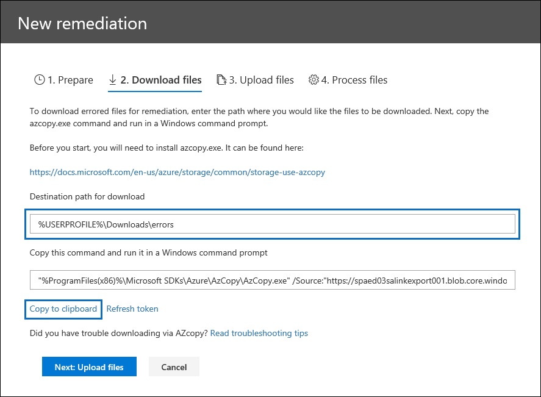

# 處理資料時的錯誤補救

錯誤修正功能可讓 eDiscovery 系統管理員修正資料問題, 使高級 eDiscovery 無法正確處理內容。 例如, 由於檔案受到鎖定或加密, 因此無法處理受到密碼保護的檔案。 使用錯誤修正功能, eDiscovery 系統管理員可以下載有這類錯誤的檔案、移除密碼保護並上傳修正的檔案。

使用下列工作流程修復高級 eDiscovery 案例中含有錯誤的檔案。

## 建立錯誤修復會話以修正含有處理錯誤的檔案

>[!NOTE]
>如果在下列程式中隨時關閉錯誤修正嚮導, 您可以在 [ **View** ] 下拉式功能表中選取 [**錯誤 remediations** ], 從 [**處理**] 索引標籤傳回錯誤修正會話。

1. 在高級 eDiscovery 案例的 [**處理**] 索引標籤上, 選取 [ **View** ] 下拉式功能表中的 [**錯誤**]。

2. 按一下 [錯誤類型] 或 [檔案類型] 旁的選項按鈕, 選取您要修正的錯誤。  在下列範例中, 我們正在修正受密碼保護的檔案。

3. 按一下 [ **+ 新的錯誤修復**]。

    

    錯誤修正會話將從準備階段開始, 其中含有錯誤的檔案會複製到安全的 Azure 位置, 以便下載這些檔案。

    

4. 準備完成後, 請按 **[下一步]: 下載**檔案以繼續下載。

    

5. 若要下載檔案, 請指定**下載的目的地路徑**;這是您的本機電腦上應該下載檔案的路徑。  預設路徑%USERPROFILE%\Downloads\errors, 指向登入使用者的下載資料夾;您可以視需要變更。

    >[!NOTE]
    >建議您使用本機檔案路徑, 而非遠端網路路徑, 以取得最佳效能。

    > [!NOTE]
    > 如果您尚未安裝 AzCopy, 您可以從下列位置進行安裝:https://docs.microsoft.com/en-us/azure/storage/common/storage-use-azcopy

6. 按一下 [**複製至剪貼**簿], 複製預先定義的命令。 啟動 windows 命令提示字元, 貼上命令, 然後按**enter**鍵。  

    將下載檔案。

    

    > [!NOTE]
    > 如果提供的 AzCopy 命令失敗, 請參閱[在高級 eDiscovery 中疑難排解 AzCopy](troubleshooting-azcopy.md)。

7. 下載檔案之後, 您可以使用適當的工具進行修復。 對於密碼保護的檔案, 您可以使用許多密碼破解工具。 如果您知道檔案的密碼, 您可以開啟檔案並移除密碼保護。
    > [!NOTE]
    > 請務必在 tact 中保留已修正檔案的目錄結構和檔案名。  下載的檔案和資料夾中所使用的所有命名慣例, 都能讓 remdiated 檔案回到原始檔案。

8. 現在, 回到 [Advanced eDiscovery], 然後按 **[下一步]: 上傳檔案]**。  這會移至下一個步驟, 您現在可以在其中上傳檔案。

    

9. 在 [檔案**位置路徑**] 文字方塊中, 指定已修正檔案的位置, 然後按一下 [**複製到剪貼**簿]。

10. 將命令貼到 Windows 命令提示字元, 然後按**enter**上傳檔案。

    

11. 最後, 回到 [Advanced eDiscovery], 然後按 **[下一步]: 處理**檔案。

12. 處理完成時。  您可以回到 [審閱] 集, 並查看修正的檔案。

## 修正檔案時會發生什麼情況

當上傳修正的檔案時, 會保留原始的中繼資料, 但不包括下欄欄位: 

- ExtractedTextSize
- HasText
- IsErrorRemediate
- LoadId
- ProcessingErrorMessage
- ProcessingStatus
- Text
- WordCount
- WorkingsetId

如需高級 eDiscovery 中所有檔元資料欄位的定義, 請參閱[檔元資料欄位](document-metadata-fields.md)。
