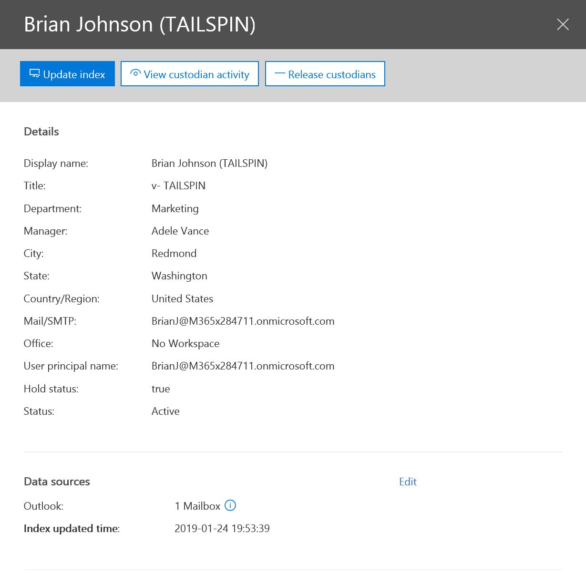

# 管理 custodians 進階電子文件 （預覽） 案例中Manage custodians in an Advanced eDiscovery (Preview) case

[Custodians] 索引標籤包含的情況下的所有 custodians 排序清單。The Custodians tab contains a sortable list of all the custodians in the case. Custodians 新增至案例之後，從 Azure Active Directory 會自動收集有關每個 custodian 的詳細資料。After you add custodians to a case, details about each custodian will automatically be collected from Azure Active Directory.

## 檢視 custodian 詳細資料Viewing custodian details

之後您將 custodian 新增至案例及**Custodians** ] 索引標籤上，從清單中選取他們，會出現包含 custodian 詳細資料彈出式頁面。從這裡開始，您可以檢視該 custodian 與相關的所有詳細資料。The flyout page that contains custodian details appears after you add a custodian to a case and select them from the list on the **Custodians** tab. From here, you can view all the details related to that custodian. 彈出式頁面包含下列欄位：The flyout page contains the following fields:

- 連絡人資訊Contact information

  - **顯示名稱**： custodian 顯示在通訊錄中的名稱。**Display Name**: The name displayed in the address book for the custodian. 這通常是 custodian 名字]、 [中間的初始和最後一個名稱的組合。This is usually the combination of the custodian’s first name, middle initial and last name.
  - **郵件/SMTP**: custodian，例如 jeff@contoso.onmicrosoft.com 的 SMTP 位址。**Mail/SMTP**: The SMTP address for the custodian, for example, jeff@contoso.onmicrosoft.com.  
  - **標題**： custodian 的職稱。**Title**: The custodian’s job title.
  - **部門**： custodian 適用於部門的名稱。**Department**: The name for the department in which the custodian works.
  - **管理員**： custodian 的管理員。**Manager**: The custodian’s manager. 指定的管理員會收到此 custodian 任何呈報通訊。The designated manager will receive any Escalation communications for this custodian.
  
- 位置資訊Location information

  - **縣/市**： custodian 所在的市/鎮。**City**: The city in which the custodian is located.
  - **狀態**： 縣 / 市 custodian 的地址。**State**: The state or province in the custodian’s address.
  - **國家/地區**： 於 custodian 所在; 國家/地區例如，「 美國 」 或者 「 英國 」。**Country/Region**: The country/region in which the custodian’s is located; for example, “US” or “UK”.
  - **Office**： 商務版 custodian 就地的辦公室位置。**Office**: The office location in the custodian’s place of business.

- 案例資訊Case information

  - **保留狀態**： 指出是否 custodian 具有已處於保留狀態。**Hold status**: Indicates if the custodian has been placed on hold. 
  - **通訊狀態**： 指出 custodian 是否已經發出保留通知。**Communication status**: Indicates if the custodian has been issued a hold notice. 如果 custodian 已發出的通知，這會被標示為*已發佈*。If the custodian has been issued a notice, then this will be marked as *Published*. 如果 custodian 已不發出通知，則此狀態將會是*未發佈*。If the custodian has not been issued a notice, then this status will be *Un-Published*. 
  - **狀態**： 在 case custodian 的狀態。**Status**: The status of the custodian within the case. 如果 custodian 仍處於保留的情況下，這會是*作用中*。This will be *Active* if the custodian is still on hold for the case. 如果從案例移除 custodian，其狀態會變更為*發行*。If a custodian is removed from a case, their status will change to *Released*. 

- 處理狀態Processing status

  - **編製索引狀態**： 指出深層索引工作的狀態。**Indexing status**: Indicates the status of the deep indexing job.  
  - **編製索引上次更新時間**： 指出的深層索引工作最後觸發 datestamp。**Indexing Last Updated Time**: Indicates the datestamp of when the deep indexing job was last triggered.
  - **資料來源**： 顯示的信箱、 網站和小組 custodian 已選取的計數。**Data sources**: Shows the count of mailboxes, sites, and Teams that have been selected for the custodian.

## 編輯 custodianEditing a custodian

隨著您案例的進度，您可能會發現可能有其他資料來源相關的特定 custodian & 您的案例。As your case progresses, you may discover that there may be additional data sources relevant to a specific custodian & your case. 在其他情況下，您可能想要移除特定資料來源的檢閱和視為不相關。In other scenarios, you may want to remove certain data sources that have been reviewed and deemed as not relevant.

若要更新 custodian 及選取的資料來源：To update a custodian and the selected data sources:

1. 從**eDiscovery > 進階電子文件 （預覽）** 中選取現有的案例。Select an existing case from the **eDiscovery > Advanced eDiscovery (Preview)**.
  
2. 在案例中，按一下 [ **Custodians** ] 索引標籤。In the case, click the **Custodians** tab.
  
3. 從清單中選取 custodian(s)，然後按一下 [**編輯來源**。Select the custodian(s) from the list and click **Edit sources**.

    
  
4. 按一下 [**選擇資料來源**，更新 Exchange 和 OneDrive 位置的選項。Update selections for Exchange and OneDrive locations by clicking **Choose data sources**.
  
5. 新增或移除 microsoft Teams、 SharePoint 或 Exchange 信箱]，即可選取**其他資料來源**對應的使用者。Add or remove Teams, SharePoint, or Exchange mailboxes mapped the user by clicking to **Select additional data sources**. 如需您可以將對應的資料來源到 custodian 的方式的詳細資訊，請參閱 < <b0>Add custodians 案例</b0>。For more information about how you to map data sources to a custodian, see [Add custodians to a case](add-custodians-to-case.md).
  
6. 若要更新的 custodian 持有狀態，按一下 [ **custodial 就地保留**，以及啟用或停用 custodians 保留。To update the custodian hold status, click **Place custodial holds**, and enable or disable the hold for custodians.

> [!TIP]
> 您可以選取多個 custodians 來執行 [大量動作]，或重新編製索引，放開，編輯一群 custodians 等。You can select multiple custodians to perform bulk actions, like re-indexing, releasing, or editing a set of custodians.

## 解決 custodian 處理錯誤Resolving custodian processing errors

大部分合法的工作流程，即會為特定的調查，新增 custodians 之後會搜尋使用者的資料子集。In most Legal workflows, after custodians are added for a specific investigation, a subset of the users’ data will be searched. 因為大型檔案的大小或可能損毀，custodians 的資料來源中的某些項目可能是已局部編製索引。Due to large file sizes or possible corruption, some items within the custodians’ data sources may be partially indexed. 使用進階電子文件 （預覽） 深層索引功能，這些已局部編製索引的項目可進行自動修復重新編目和重新編製索引視需要這些項目。Using the Advanced eDiscovery (Preview) deep indexing capability, these partially indexed items can be automatically remediated by re-crawling and re-indexing these items on demand. 

當 custodian 新增至案例時，其資料將會自動為 「 deep 編製索引 」 時，允許使用者離開這些已局部編製索引而不必下載、 修正，並重新執行搜尋 Office 365 以外的位置中的項目。When a custodian is added to a case, their data will automatically be "deep indexed”, allowing users to leave these partially indexed items in place instead of having to download, remediate and re-run searches outside of Office 365. 週期中的情況下，使用者可能修復項目，或指定 custodian 新增新的資料來源。During the lifecycle of a case, a user may remediate items or add new data sources for a given custodian. 這可能需要更新 Custodian 索引。This may require the Custodian Index to be updated. 

若要觸發地址重新編製索引程序已局部編製索引的項目：To trigger a re-indexing process to address partially indexed items:

1. 移至**eDiscovery > 進階電子文件 （預覽）** ，然後選取現有的案例。Go to **eDiscovery > Advanced eDiscovery (Preview)** and select an existing case.

2. 在案例中，按一下 [ **Custodians] 索引標籤**。In the case, click to **Custodians tab**. 

3. 選取 [需要以重新建立索引，然後按一下 [custodian(s)Select the custodian(s) that needs to be re-indexed, and then click  在彈出式頁面。on the flyout page.

4. **Custodians** ] 索引標籤上的 [**編製索引工作狀態**] 欄中的連結，即可檢查 custodian 索引的狀態。Check the status of the custodian index by clicking the link in the **Indexing job Status** column on the **Custodians** tab.  

5. 在 [**工作**] 索引標籤上也可以追蹤重新編製索引的程序的狀態。The status for the re-indexing process can also be tracked on the **Jobs** tab.

如需重新編製索引和補救局部編製索引的項目的詳細資訊，請參閱[修正處理錯誤](processing-data-for-case.md)。For more information about re-indexing and remediating partially indexed items, see [Fix processing errors](processing-data-for-case.md).

## 釋放 custodian 從案例Releasing a custodian from a case

Custodian 發行的情況下其中關閉案例、 custodian 不再下義務以保留內容的情況下，或當 custodian 會被視為不會再是相關為特定案例。A custodian is released in situations where a case is closed, a custodian is no longer under obligation to preserve content for a case, or when a custodian is deemed to no longer be relevant to a particular case. 

如果已發佈保留通知之後，您就會釋放 custodian，發行通知會傳送至 custodian。If you release a custodian after a hold notice was published, a release notice will be sent to the custodian. 此外，也會移除歸因於發行 custodians 任何 custodial 保留。In addition, any custodial holds attributed to the released custodians will also be removed.

如果 custodian 已處於暫止無訊息狀態，其所未發出任何合法持有通知，然後將移除歸因於發行 custodians 任何 custodial 保留。If the custodian was placed on a silent hold, where they were not issued any legal hold notifications, then any custodial holds attributed to the released custodians will be removed.  

若要發行 custodian:To release a custodian: 

1.  移至 [ **Custodians** ] 索引標籤。Go to the **Custodians** tab.

2.  從清單中選取 custodian，然後按一下 [Select the custodian from the list and click  在彈出式頁面。on the flyout page.

    Custodian **Custodians** ] 索引標籤上的狀態設為**已發行**並**保留狀態**的彈出式頁面變更為**非作用中**。The status of the custodian on the **Custodians** tab is set to **Released** and the **Hold status** on the flyout page is changed to **Inactive**. 

> [!TIP]
> Custodian 可同時可能參與數個合法持有事件。A custodian might be simultaneously be involved in several legal hold matters. 當 custodian 發行從案例時，不會影響保留和跨其他事件通知。When a custodian is released from a case, the holds and notifications across other matters will not be impacted.

## 相關資訊Related information

 - [處理資料時發生補救錯誤Error remediation when processing data](error-remediation.md) 
- [使用通訊Work with communications](managing-custodian-communications.md)
