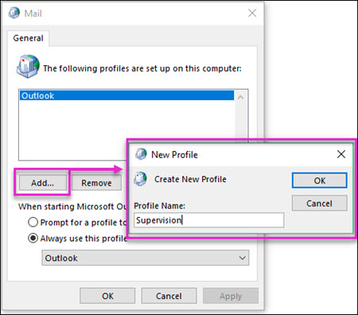

# <a name="configure-supervision-policies-for-your-organization"></a><span data-ttu-id="04f0c-103">為您的組織設定監督原則</span><span class="sxs-lookup"><span data-stu-id="04f0c-103">Configure supervision policies for your organization</span></span>

<span data-ttu-id="04f0c-p101">使用監督原則來擷取由內部或外部檢閱者檢查 「 員工通訊。如需監督原則可幫助您監視組織中的通訊的詳細資訊，請參閱[Office 365 中的監督原則](supervision-policies.md)。</span><span class="sxs-lookup"><span data-stu-id="04f0c-p101">Use supervision policies to capture employee communications for examination by internal or external reviewers. For more information about how supervision policies can help you monitor communications in your organization, see [Supervision policies in Office 365](supervision-policies.md).</span></span>

> [!NOTE]
> <span data-ttu-id="04f0c-p102">監督原則受監控的使用者必須具有進階規範附加元件可以是 Office 365 企業版 E3 授權或包含在 Office 365 企業版 E5 訂閱。如果您未有現有的企業 E5 計劃以及要嘗試監督，您還可以[註冊 Office 365 企業版 E5 的試用版](https://go.microsoft.com/fwlink/p/?LinkID=698279)。</span><span class="sxs-lookup"><span data-stu-id="04f0c-p102">Users monitored by supervision policies must have either an Office 365 Enterprise E3 license with the Advanced Compliance add-on or be included in an Office 365 Enterprise E5 subscription. If you don't have an existing Enterprise E5 plan and want to try supervision, you can [sign up for a trial of Office 365 Enterprise E5](https://go.microsoft.com/fwlink/p/?LinkID=698279).</span></span>
  
<span data-ttu-id="04f0c-108">請遵循下列步驟來設定和 Office 365 組織中使用監督：</span><span class="sxs-lookup"><span data-stu-id="04f0c-108">Follow these steps to set up and use supervision in your Office 365 organization:</span></span>
  
- <span data-ttu-id="04f0c-109">**步驟 1 （選用）** - [設定的監督群組](configure-supervision-policies.md#exampledist)</span><span class="sxs-lookup"><span data-stu-id="04f0c-109">**Step 1 (optional)** - [Set up groups for Supervision](configure-supervision-policies.md#exampledist)</span></span>

    <span data-ttu-id="04f0c-p103">在您開始使用監督之前，請決定誰將其通訊檢閱和誰可以執行這些檢閱 （英文）。如果您想要開始使用少數使用者看到監督的運作方式，您可以略過現在群組設定。</span><span class="sxs-lookup"><span data-stu-id="04f0c-p103">Before you start using supervision, determine who will have their communications reviewed and who will perform those reviews. If you want to get started with just a few users to see how supervision works, you can skip setting up groups for now.</span></span>

- <span data-ttu-id="04f0c-112">**步驟 2 （必要）** - [讓組織中可用的監督](configure-supervision-policies.md#MakeAvailable)</span><span class="sxs-lookup"><span data-stu-id="04f0c-112">**Step 2 (required)** - [Make supervision available in your organization](configure-supervision-policies.md#MakeAvailable)</span></span>

    <span data-ttu-id="04f0c-p104">新增您自己監督檢閱角色群組讓您可以設定原則。已指派給此角色的任何人可以存取**資料控管**下 [**監督**頁面的安全性 & 規範中心。若要檢閱的電子郵件裝載於 Exchange Online，每一個檢閱者也必須具有[遠端 PowerShell 存取至 Exchange Online](https://docs.microsoft.com/powershell/exchange/exchange-online/disable-access-to-exchange-online-powershell)。</span><span class="sxs-lookup"><span data-stu-id="04f0c-p104">Add yourself to the Supervisory Review role group so you can set up policies. Anyone who has this role assigned can access the **Supervision** page under **Data Governance** in the Security & Compliance Center. If email to be reviewed is hosted on Exchange Online, each reviewer must also have [remote PowerShell access to Exchange Online](https://docs.microsoft.com/powershell/exchange/exchange-online/disable-access-to-exchange-online-powershell).</span></span>

- <span data-ttu-id="04f0c-116">**步驟 3 （選用）** - [設定自訂的敏感資訊類型或自訂的關鍵字字典/lexicons](configure-supervision-policies.md#sensitiveinfo)</span><span class="sxs-lookup"><span data-stu-id="04f0c-116">**Step 3 (optional)** - [Configure custom sensitive information types or custom keyword dictionaries/lexicons](configure-supervision-policies.md#sensitiveinfo)</span></span>

    <span data-ttu-id="04f0c-117">如果您需要使用自訂的敏感資訊類型或自訂的關鍵字字典監督原則，您需要建立開始監督精靈之前。</span><span class="sxs-lookup"><span data-stu-id="04f0c-117">If you need to use a custom sensitive info type or a custom keyword dictionary for your supervision policy, you'll need to create it before starting the supervision wizard.</span></span>

- <span data-ttu-id="04f0c-118">**步驟 4 （必要）** - [設定的監督原則](configure-supervision-policies.md#setupsuper)</span><span class="sxs-lookup"><span data-stu-id="04f0c-118">**Step 4 (required)** - [Set up a supervision policy](configure-supervision-policies.md#setupsuper)</span></span>

    <span data-ttu-id="04f0c-p105">您將建立監督原則中安全性 & 規範中心。這些原則定義的通訊會受到組織中的檢閱和指定誰應該執行檢閱 （英文）。通訊包含電子郵件和 Microsoft 小組通訊，以及第 3 廠商平台通訊 （例如 Facebook、 Twitter、 等）</span><span class="sxs-lookup"><span data-stu-id="04f0c-p105">You'll create supervision policies in the Security & Compliance Center. These policies define which communications are subject to review in your organization and specifies who should perform reviews. Communications include email and Microsoft Teams communications, as well as 3rd-party platform communications (such as Facebook, Twitter, etc.)</span></span>

- <span data-ttu-id="04f0c-122">**步驟 5-（選用）**[測試您的新監督原則](configure-supervision-policies.md#TestPolicy)</span><span class="sxs-lookup"><span data-stu-id="04f0c-122">**Step 5 - (optional)** [Test your new supervision policy](configure-supervision-policies.md#TestPolicy)</span></span>

    <span data-ttu-id="04f0c-123">測試以確保能運作視您監督原則是確保合規策略會議您標準重要的一部分。</span><span class="sxs-lookup"><span data-stu-id="04f0c-123">Testing your supervision policy to make sure it is functioning as desired is an important part of ensuring that your compliance strategy is meeting your standards.</span></span>

- <span data-ttu-id="04f0c-124">**步驟 6-（選用）**[Outlook 增益集不想要使用 Office 365 監督儀表板或 （前身為 Outlook Web App） 在 web 上的 Outlook 檢閱監督的通訊的檢閱者的設定](configure-supervision-policies.md#UseOutlook)</span><span class="sxs-lookup"><span data-stu-id="04f0c-124">**Step 6 - (optional)** [Set up Outlook add-in for reviewers who do not want to use Office 365 supervision dashboard or Outlook on the web (formerly known as Outlook Web App) to review supervised communications](configure-supervision-policies.md#UseOutlook)</span></span>

    <span data-ttu-id="04f0c-125">監督的增益集 Outlook 可以讓檢閱者存取 Outlook 用戶端內的監督的功能權限，讓他們可以評估並將每個項目。</span><span class="sxs-lookup"><span data-stu-id="04f0c-125">The Supervision add-in for Outlook gives reviewers access to the supervision functionality right within the Outlook client so they can assess and categorize each item.</span></span>

<span data-ttu-id="04f0c-126"><a name="exampledist"> </a></span><span class="sxs-lookup"><span data-stu-id="04f0c-126"></span></span>

## <a name="step-1---set-up-groups-for-supervision-optional"></a><span data-ttu-id="04f0c-127">步驟 1-設定群組的監督 （選用）</span><span class="sxs-lookup"><span data-stu-id="04f0c-127">Step 1 - Set up groups for Supervision (optional)</span></span>

 <span data-ttu-id="04f0c-p106">當您建立監督原則時，您將決定誰會有檢閱其通訊及誰可以執行這些檢閱 （英文）。在原則中，您將使用電子郵件地址來識別的個人或群組的人員。若要簡化您的安裝程式，建立人員有其檢閱的通訊群組和人員將檢閱這些通訊群組。如果您使用的群組，您可能需要數個 — 例如，如果您想要監視的人員、 兩個不同的群組之間的通訊，或者您想要指定無法移至要指導的群組。如需此的運作方式的詳細資訊，請參閱[範例通訊群組](configure-supervision-policies.md#GroupExample)。</span><span class="sxs-lookup"><span data-stu-id="04f0c-p106">When you create a supervision policy, you'll determine who will have their communications reviewed and who will perform those reviews. In the policy, you'll use email addresses to identify individuals or groups of people. To simplify your setup, create groups for people who will have their communication reviewed and groups for people who will review those communications. If you're using groups, you might need several—for example, if you want to monitor communications between two distinct groups of people, or if you want to specify a group that isn't going to be supervised. See [Example distribution groups](configure-supervision-policies.md#GroupExample) for details about how this works.</span></span>
  
<span data-ttu-id="04f0c-p107">若要管理組織中的群組內或之間的通訊、 設定通訊群組在 Exchange 系統管理中心 (移至 [**收件者** \> **群組**)。如需設定通訊群組的詳細資訊，請參閱[管理通訊群組](http://go.microsoft.com/fwlink/?LinkId=613635)</span><span class="sxs-lookup"><span data-stu-id="04f0c-p107">To supervise communications between or within groups in your organization, set up distribution groups in the Exchange admin center (go to **recipients** \> **groups**). For more information about setting up distribution groups, see [Manage distribution groups](http://go.microsoft.com/fwlink/?LinkId=613635)</span></span>
  
> [!NOTE]
> <span data-ttu-id="04f0c-p108">您也可以使用動態通訊群組或安全性群組的監督若您偏好。若要協助您決定是否這些更適合您組織需求，請參閱[管理擁有郵件功能的安全性群組](http://go.microsoft.com/fwlink/?LinkId=627033)及[管理動態通訊群組](http://go.microsoft.com/fwlink/?LinkId=627058)。</span><span class="sxs-lookup"><span data-stu-id="04f0c-p108">You can also use dynamic distribution groups or security groups for supervision if you prefer. To help you decide if these better fit your organization needs, see [Manage mail-enabled security groups](http://go.microsoft.com/fwlink/?LinkId=627033), and [Manage dynamic distribution groups](http://go.microsoft.com/fwlink/?LinkId=627058).</span></span>
  
<span data-ttu-id="04f0c-137"><a name="GroupExample"> </a></span><span class="sxs-lookup"><span data-stu-id="04f0c-137"></span></span>

### <a name="example-distribution-groups"></a><span data-ttu-id="04f0c-138">通訊群組範例</span><span class="sxs-lookup"><span data-stu-id="04f0c-138">Example distribution groups</span></span>

<span data-ttu-id="04f0c-139">此範例會包含已針對名為 Contoso 財務國際財務組織設定的通訊群組。</span><span class="sxs-lookup"><span data-stu-id="04f0c-139">This example includes a distribution group that has been set up for a financial organization called Contoso Financial International.</span></span>
  
<span data-ttu-id="04f0c-p109">在 Contoso Financial International 中，必須抽樣監管美國境內各代理人間的通訊。不過，不需要監管該群組內的法務人員。在此範例中，我們可以建立下列群組：</span><span class="sxs-lookup"><span data-stu-id="04f0c-p109">In Contoso Financial International, a sampling of communications between brokers in the United States must be supervised. However, compliance officers within that group do not require supervision. For this example, we can create the following groups:</span></span>
  
|<span data-ttu-id="04f0c-143">**設定此通訊群組**</span><span class="sxs-lookup"><span data-stu-id="04f0c-143">**Set up this distribution group**</span></span>|<span data-ttu-id="04f0c-144">**群組地址 (別名)**</span><span class="sxs-lookup"><span data-stu-id="04f0c-144">**Group address (alias)**</span></span>|<span data-ttu-id="04f0c-145">**描述**</span><span class="sxs-lookup"><span data-stu-id="04f0c-145">**Description**</span></span>|
|:-----|:-----|:-----|
|<span data-ttu-id="04f0c-146">所有美國代理人</span><span class="sxs-lookup"><span data-stu-id="04f0c-146">All US brokers</span></span> | <span data-ttu-id="04f0c-147">US_Brokers@Contoso.com</span><span class="sxs-lookup"><span data-stu-id="04f0c-147">US_Brokers@Contoso.com</span></span> | <span data-ttu-id="04f0c-148">此群組包含於 Contoso 任職，所有位於美國的代理人的電子郵件地址。</span><span class="sxs-lookup"><span data-stu-id="04f0c-148">This group includes email addresses for all US-based brokers who work for Contoso.</span></span> |
| <span data-ttu-id="04f0c-149">所有美國法務人員</span><span class="sxs-lookup"><span data-stu-id="04f0c-149">All US compliance officers</span></span> | <span data-ttu-id="04f0c-150">US_Compliance@Contoso.com</span><span class="sxs-lookup"><span data-stu-id="04f0c-150">US_Compliance@Contoso.com</span></span>  | <span data-ttu-id="04f0c-p110">此群組包含所有的美國型法務人員合作 Contoso 的電子郵件地址。因為此群組的所有美國型經紀人子集，您可用於此別名免除法務人員從監督原則。</span><span class="sxs-lookup"><span data-stu-id="04f0c-p110">This group includes email addresses for all US-based compliance officers who work for Contoso. Because this group is a subset of all US-based brokers, you can use this alias to exempt compliance officers from a supervision policy.</span></span> |
  
<span data-ttu-id="04f0c-153"><a name="MakeAvailable"> </a></span><span class="sxs-lookup"><span data-stu-id="04f0c-153"></span></span>

## <a name="step-2---make-supervision-available-in-your-organization-required"></a><span data-ttu-id="04f0c-154">步驟 2-產生監督提供組織 （必要）</span><span class="sxs-lookup"><span data-stu-id="04f0c-154">Step 2 - Make supervision available in your organization (required)</span></span>

<span data-ttu-id="04f0c-155">在安全性 & 規範中心進行**監督**可作為功能表選項，您必須指派監督檢閱系統管理員角色。</span><span class="sxs-lookup"><span data-stu-id="04f0c-155">To make **Supervision** available as a menu option in the Security & Compliance Center, you must be assigned the Supervisory Review Administrator role.</span></span>
  
<span data-ttu-id="04f0c-156">為達成此目的，您也可以新增您自己做監督檢閱角色群組的成員，或您可以建立新的角色群組。</span><span class="sxs-lookup"><span data-stu-id="04f0c-156">To do this, you can either add yourself as a member of the Supervisory Review role group, or you can create a new role group.</span></span>
  
### <a name="add-members-to-the-supervisory-review-role-group"></a><span data-ttu-id="04f0c-157">新增成員至監督檢閱角色群組</span><span class="sxs-lookup"><span data-stu-id="04f0c-157">Add members to the Supervisory Review role group</span></span>

1. <span data-ttu-id="04f0c-158">登入[https://protection.office.com](https://protection.office.com)使用 Office 365 組織中的管理帳戶的認證。</span><span class="sxs-lookup"><span data-stu-id="04f0c-158">Sign into [https://protection.office.com](https://protection.office.com) using credentials for an admin account in your Office 365 organization.</span></span>

2. <span data-ttu-id="04f0c-159">在安全性 & 規範中心中，移至 [**權限**。</span><span class="sxs-lookup"><span data-stu-id="04f0c-159">In the Security & Compliance Center, go to **Permissions**.</span></span>

3. <span data-ttu-id="04f0c-160">選取 [**監督檢閱**角色群組，然後按一下 [編輯] 圖示。</span><span class="sxs-lookup"><span data-stu-id="04f0c-160">Select the **Supervisory Review** role group and then click the Edit icon.</span></span>

4. <span data-ttu-id="04f0c-161">在 [**成員**] 區段中，新增您想要管理您的組織的監督的人員。</span><span class="sxs-lookup"><span data-stu-id="04f0c-161">In the **Members** section, add the people who you want to manage supervision for your organization.</span></span>

### <a name="create-a-new-role-group"></a><span data-ttu-id="04f0c-162">建立新的角色群組</span><span class="sxs-lookup"><span data-stu-id="04f0c-162">Create a new role group</span></span>

1. <span data-ttu-id="04f0c-163">登入[https://protection.office.com](https://protection.office.com)使用 Office 365 組織中的管理帳戶的認證。</span><span class="sxs-lookup"><span data-stu-id="04f0c-163">Sign into [https://protection.office.com](https://protection.office.com) using credentials for an admin account in your Office 365 organization.</span></span>

2. <span data-ttu-id="04f0c-164">在安全性 & 規範中心中，移至 [**權限**和 [新增 (**+**)。</span><span class="sxs-lookup"><span data-stu-id="04f0c-164">In the Security & Compliance Center, go to **Permissions** and then click Add (**+**).</span></span>

3. <span data-ttu-id="04f0c-p111">在 [**角色**] 區段中，按一下 [新增] (**+**) 和**監督檢閱管理員**下的捲軸。將此角色新增至角色群組。</span><span class="sxs-lookup"><span data-stu-id="04f0c-p111">In the **Roles** section, click Add (**+**) and scroll down to **Supervisory Review Administrator**. Add this role to the role group.</span></span>

4. <span data-ttu-id="04f0c-167">在 [**成員**] 區段中，新增您想要管理您的組織的監督的人員。</span><span class="sxs-lookup"><span data-stu-id="04f0c-167">In the **Members** section, add the people who you want to manage supervision for your organization.</span></span>

<span data-ttu-id="04f0c-168">如需有關角色群組和權限的詳細資訊，請參閱[Office 365 安全性權限&amp;規範中心](permissions-in-the-security-and-compliance-center.md)。</span><span class="sxs-lookup"><span data-stu-id="04f0c-168">For more information about role groups and permissions, see [Permissions in the Office 365 Security &amp; Compliance Center](permissions-in-the-security-and-compliance-center.md).</span></span>

### <a name="enable-remote-powershell-access-for-reviewers-if-email-is-hosted-on-exchange-online"></a><span data-ttu-id="04f0c-169">啟用遠端 PowerShell 存取檢閱者 （若電子郵件會被託管在 Exchange Online）</span><span class="sxs-lookup"><span data-stu-id="04f0c-169">Enable remote PowerShell access for reviewers (if email is hosted on Exchange Online)</span></span>

1. <span data-ttu-id="04f0c-170">請遵循[啟用或停用 access to Exchange Online PowerShell](https://docs.microsoft.com/powershell/exchange/exchange-online/disable-access-to-exchange-online-powershell)中的指引。</span><span class="sxs-lookup"><span data-stu-id="04f0c-170">Follow the guidance in [Enable or disable access to Exchange Online PowerShell](https://docs.microsoft.com/powershell/exchange/exchange-online/disable-access-to-exchange-online-powershell).</span></span>

<span data-ttu-id="04f0c-171"><a name="sensitiveinfo"> </a></span><span class="sxs-lookup"><span data-stu-id="04f0c-171"></span></span>
  
## <a name="step-3---create-custom-sensitive-information-types-or-custom-keyword-dictionaries-optional"></a><span data-ttu-id="04f0c-172">步驟 3-建立自訂的敏感資訊類型或自訂的關鍵字字典 （選用）</span><span class="sxs-lookup"><span data-stu-id="04f0c-172">Step 3 - Create custom sensitive information types or custom keyword dictionaries (optional)</span></span>

<span data-ttu-id="04f0c-173">若要挑選的現有自訂的敏感資訊類型或自訂的關鍵字字典監督原則] 精靈中，您需要視建立這些項目。</span><span class="sxs-lookup"><span data-stu-id="04f0c-173">In order to pick from existing custom sensitive information types or custom keyword dictionaries in the supervision policy wizard, you first need to create these items if needed.</span></span>

### <a name="create-custom-sensitive-information-types"></a><span data-ttu-id="04f0c-174">建立自訂的敏感資訊類型</span><span class="sxs-lookup"><span data-stu-id="04f0c-174">Create custom sensitive information types</span></span>

1. <span data-ttu-id="04f0c-p112">在 Office 365 安全性 & 規範中心中建立新的敏感資訊類型。瀏覽至 [**分類** \> **敏感資訊類型**並遵循**新增敏感資訊類型] 精靈**中的步驟。將以下：</span><span class="sxs-lookup"><span data-stu-id="04f0c-p112">Create a new sensitive information type in the Office 365 Security & Compliance Center. Navigate to **Classifications** \> **Sensitive info types** and follow the steps in the **New sensitive info type wizard**. Here you will:</span></span>

    - <span data-ttu-id="04f0c-178">定義的名稱和描述的敏感資訊類型</span><span class="sxs-lookup"><span data-stu-id="04f0c-178">Define a name and description for the sensitive info type</span></span>
    - <span data-ttu-id="04f0c-179">定義鄰近、 信賴等級和主要圖樣元素</span><span class="sxs-lookup"><span data-stu-id="04f0c-179">Define the proximity, confidence level, and primary pattern elements</span></span>
    - <span data-ttu-id="04f0c-180">檢閱您的選項，並建立的敏感資訊類型</span><span class="sxs-lookup"><span data-stu-id="04f0c-180">Review your selections and create the sensitive info type</span></span>

    <span data-ttu-id="04f0c-181">如需詳細資訊，請參閱[建立自訂的敏感資訊類型](create-a-custom-sensitive-information-type.md)。</span><span class="sxs-lookup"><span data-stu-id="04f0c-181">For more detailed information, see [Create a custom sensitive information type](create-a-custom-sensitive-information-type.md).</span></span>

### <a name="create-custom-keyword-dictionarylexicon"></a><span data-ttu-id="04f0c-182">建立自訂的關鍵字字典/lexicon</span><span class="sxs-lookup"><span data-stu-id="04f0c-182">Create custom keyword dictionary/lexicon</span></span>

1. <span data-ttu-id="04f0c-p113">使用文字編輯器 （例如 [記事本])，建立新的檔案包含您想要監視監督原則中的關鍵字詞組。確定每個字詞是以一行和**Unicode/utf-16 (一點 Endian)** 格式儲存檔案。</span><span class="sxs-lookup"><span data-stu-id="04f0c-p113">Using a text editor (like Notepad), create a new file that includes the keyword terms you'd like to monitor in a supervision policy. Make sure each term is on a separate line and save the file in the **Unicode/UTF-16 (Little Endian)** format.</span></span>
2. <span data-ttu-id="04f0c-p114">關鍵字檔案匯入您的 Office 365 租用戶使用 PowerShell。若要連線至 Office 365 powershell，請參閱[Connect to Office 365 安全性 & 規範中心 PowerShell。](https://docs.microsoft.com/powershell/exchange/office-365-scc/connect-to-scc-powershell/connect-to-scc-powershell)</span><span class="sxs-lookup"><span data-stu-id="04f0c-p114">Import the keyword file into your Office 365 tenant using PowerShell. To connect to Office 365 with PowerShell, see [Connect to Office 365 Security & Compliance Center PowerShell](https://docs.microsoft.com/powershell/exchange/office-365-scc/connect-to-scc-powershell/connect-to-scc-powershell).</span></span>

    <span data-ttu-id="04f0c-187">您已連線至 Office 365 with PowerShell 之後，請執行下列命令以匯入關鍵字字典：</span><span class="sxs-lookup"><span data-stu-id="04f0c-187">After you've connected to Office 365 with PowerShell, run the following commands to import your keyword dictionary:</span></span>

    ```
    $fileData = Get-Content "your keyword path and file name" -Encoding Byte -ReadCount 0

    New-DlpKeywordDictionary -Name "Name for your keyword dictionary" -Description "optional description for your keyword dictionary" -FileData $fileData
    ```
    <span data-ttu-id="04f0c-188">如需詳細資訊，請參閱 ＜ [Create 關鍵字字典](create-a-keyword-dictionary.md)。</span><span class="sxs-lookup"><span data-stu-id="04f0c-188">For more detailed information, see [Create a keyword dictionary](create-a-keyword-dictionary.md).</span></span>

3. <span data-ttu-id="04f0c-p115">在 Office 365 安全性 & 規範中心中建立新的敏感資訊類型。瀏覽至 [**分類** \> **敏感資訊類型**並遵循**新增敏感資訊類型] 精靈**中的步驟。將以下：</span><span class="sxs-lookup"><span data-stu-id="04f0c-p115">Create a new sensitive information type in the Office 365 Security & Compliance Center. Navigate to **Classifications** \> **Sensitive info types** and follow the steps in the **New sensitive info type wizard**. Here you will:</span></span>

    - <span data-ttu-id="04f0c-192">定義的名稱和描述的敏感資訊類型</span><span class="sxs-lookup"><span data-stu-id="04f0c-192">Define a name and description for the sensitive info type</span></span>
    - <span data-ttu-id="04f0c-193">將您的自訂字典新增為必要項目相符的項目</span><span class="sxs-lookup"><span data-stu-id="04f0c-193">Add your custom dictionary as a requirement for the matching element</span></span>
    - <span data-ttu-id="04f0c-194">檢閱您的選項，並建立的敏感資訊類型</span><span class="sxs-lookup"><span data-stu-id="04f0c-194">Review your selections and create the sensitive info type</span></span>

    <span data-ttu-id="04f0c-195">建立自訂字典/lexicon 之後，您可以檢視已設定使用[Get DlpKeywordDictionary](https://docs.microsoft.com/powershell/module/exchange/policy-and-compliance-dlp/get-dlpkeyworddictionary)指令程式的關鍵字或新增和移除字詞[組 DlpKeywordDictionary](https://docs.microsoft.com/powershell/module/exchange/policy-and-compliance-dlp/set-dlpkeyworddictionary)指令程式。</span><span class="sxs-lookup"><span data-stu-id="04f0c-195">After the custom dictionary/lexicon is created, you can view the configured keywords using the [Get-DlpKeywordDictionary](https://docs.microsoft.com/powershell/module/exchange/policy-and-compliance-dlp/get-dlpkeyworddictionary) cmdlet or add and remove terms using the [Set-DlpKeywordDictionary](https://docs.microsoft.com/powershell/module/exchange/policy-and-compliance-dlp/set-dlpkeyworddictionary) cmdlet.</span></span>

    <span data-ttu-id="04f0c-196">如需詳細資訊，請參閱[建立自訂的敏感資訊類型](create-a-custom-sensitive-information-type.md)。</span><span class="sxs-lookup"><span data-stu-id="04f0c-196">For more detailed information, see [Create a custom sensitive information type](create-a-custom-sensitive-information-type.md).</span></span>

<span data-ttu-id="04f0c-197"><a name="setupsuper"> </a></span><span class="sxs-lookup"><span data-stu-id="04f0c-197"></span></span>

## <a name="step-4---set-up-a-supervision-policy-required"></a><span data-ttu-id="04f0c-198">步驟 4-設定 （必要） 的監督原則</span><span class="sxs-lookup"><span data-stu-id="04f0c-198">Step 4 - Set up a supervision policy (required)</span></span>
  
1. <span data-ttu-id="04f0c-199">登入[https://protection.office.com](https://protection.office.com)使用 Office 365 組織中的管理帳戶的認證。</span><span class="sxs-lookup"><span data-stu-id="04f0c-199">Sign into [https://protection.office.com](https://protection.office.com) using credentials for an admin account in your Office 365 organization.</span></span>

2. <span data-ttu-id="04f0c-200">在 [安全性 & 規範中心中，選取**監督**。</span><span class="sxs-lookup"><span data-stu-id="04f0c-200">In the Security & Compliance Center, select **Supervision**.</span></span>
  
3. <span data-ttu-id="04f0c-p116">選取 [**建立**，然後遵循精靈來設定下列原則的頁面。您使用精靈，將會：</span><span class="sxs-lookup"><span data-stu-id="04f0c-p116">Select **Create** and then follow the wizard to set up the following pages of the policy. Using the wizard, you will:</span></span>

    - <span data-ttu-id="04f0c-203">提供該原則的名稱和描述。</span><span class="sxs-lookup"><span data-stu-id="04f0c-203">Give the policy a name and description.</span></span>
    - <span data-ttu-id="04f0c-204">選擇 [使用者或群組管理，包括 [選擇使用者或您想要排除的群組。</span><span class="sxs-lookup"><span data-stu-id="04f0c-204">Choose the users or groups to supervise, including choosing users or groups you'd like to exclude.</span></span>
    - <span data-ttu-id="04f0c-205">定義監督原則條件。</span><span class="sxs-lookup"><span data-stu-id="04f0c-205">Define the supervision policy conditions.</span></span>
    - <span data-ttu-id="04f0c-p117">選擇 [是否您想要包含敏感資訊類型。這是您可以在其中選取預設和自訂的敏感資訊類型。</span><span class="sxs-lookup"><span data-stu-id="04f0c-p117">Choose if you'd like to include sensitive information types. This is where you can select default and custom sensitive info types.</span></span>
    - <span data-ttu-id="04f0c-208">定義可供檢閱的通訊的百分比。</span><span class="sxs-lookup"><span data-stu-id="04f0c-208">Define the percentage of communications to review.</span></span>
    - <span data-ttu-id="04f0c-p118">選擇 [原則檢閱者。檢閱者可以是個別使用者或[擁有郵件功能的安全性群組](https://docs.microsoft.com/Exchange/recipients-in-exchange-online/manage-mail-enabled-security-groups#create-a-mail-enabled-security-group)。</span><span class="sxs-lookup"><span data-stu-id="04f0c-p118">Choose the reviewers for the policy. Reviewers can be individual users or [mail-enabled security groups](https://docs.microsoft.com/Exchange/recipients-in-exchange-online/manage-mail-enabled-security-groups#create-a-mail-enabled-security-group).</span></span>
    - <span data-ttu-id="04f0c-211">檢閱您的原則選項並建立原則。</span><span class="sxs-lookup"><span data-stu-id="04f0c-211">Review your policy selections and create the policy.</span></span>

<span data-ttu-id="04f0c-212"><a name="TestPolicy"> </a></span><span class="sxs-lookup"><span data-stu-id="04f0c-212"></span></span>

## <a name="step-5---test-your-supervision-policy-optional"></a><span data-ttu-id="04f0c-213">步驟 5-測試您的監督原則 （選用）</span><span class="sxs-lookup"><span data-stu-id="04f0c-213">Step 5 - Test your supervision policy (optional)</span></span>

<span data-ttu-id="04f0c-p119">建立監督原則之後，它會是不錯的選項進行測試以確定您定義的條件會被正確強制原則。如果您監督原則包含敏感資訊類型也可能會想要[測試您的資料外洩防護 (DLP) 原則](create-test-tune-dlp-policy.md)。請遵循下列步驟來測試您的監督原則：</span><span class="sxs-lookup"><span data-stu-id="04f0c-p119">After you create a supervision policy, it's a good idea to test to make sure that the conditions you defined are being properly enforced by the policy. You may also want to [test your data loss prevention (DLP) policies](create-test-tune-dlp-policy.md) if your supervision policies include sensitive information types. Follow the steps below to test your supervision policy:</span></span>

1. <span data-ttu-id="04f0c-217">開啟的電子郵件用戶端或 Microsoft 小組以登入您想要測試該的原則所定義的監督使用者。</span><span class="sxs-lookup"><span data-stu-id="04f0c-217">Open an email client or Microsoft Teams logged in as a supervised user defined in the policy you want to test.</span></span>
2. <span data-ttu-id="04f0c-p120">傳送電子郵件或符合您已定義的監督原則中之準則的 Microsoft 小組聊天室。這可以是關鍵字附件大小、 網域、 等。請確定您決定是否太嚴格或太寬鬆原則中設定格式化的條件組態的設定。</span><span class="sxs-lookup"><span data-stu-id="04f0c-p120">Send an email or Microsoft Teams chat that meets the criteria you've defined in the supervision policy. This can be a keyword, attachment size, domain, etc. Make sure you determine if your configured conditional settings in the policy is too restrictive or too lenient.</span></span>

    > [!Note]
    > <span data-ttu-id="04f0c-p121">電子郵件受限於定義的原則會以幾近即時地處理及之後設定的原則就可以測試。聊天室中的 Microsoft 小組可能需要 24 小時的時間來完全處理原則中。</span><span class="sxs-lookup"><span data-stu-id="04f0c-p121">Emails subject to defined policies are processed in near real-time and can be tested immediately after the policy is configured. Chats in Microsoft Teams can take up to 24 hours to fully process in a policy.</span></span> 

3. <span data-ttu-id="04f0c-p122">登入您的 Office 365 租用戶為監督原則中指定檢閱者。瀏覽至 [**監督** > *您的自訂原則* > **開啟**以檢視該原則的報告。</span><span class="sxs-lookup"><span data-stu-id="04f0c-p122">Log into your Office 365 tenant as a reviewer designated in the supervision policy. Navigate to **Supervision** > *Your Custom Policy* > **Open** to view the report for the policy.</span></span>

<span data-ttu-id="04f0c-224"><a name="UseOutlook"> </a></span><span class="sxs-lookup"><span data-stu-id="04f0c-224"></span></span>

## <a name="step-6---set-up-outlook-add-in-for-reviewers-optional"></a><span data-ttu-id="04f0c-225">步驟 6-設定 Outlook 增益集的檢閱者 （選用）</span><span class="sxs-lookup"><span data-stu-id="04f0c-225">Step 6 - Set up Outlook add-in for reviewers (optional)</span></span>

<span data-ttu-id="04f0c-226">想要使用 Outlook，而非使用 Office 365 或網路上的 Outlook 中的監督儀表板檢閱通訊的檢閱者必須安裝的監督增益集其 Outlook 用戶端。</span><span class="sxs-lookup"><span data-stu-id="04f0c-226">Reviewers that want to use Outlook instead of using the Supervision dashboard in Office 365 or Outlook on the web to review communications must install the Supervision add-in for their Outlook client.</span></span>

### <a name="step-1-copy-the-address-for-the-supervision-mailbox"></a><span data-ttu-id="04f0c-227">步驟 1： 將複製的監督信箱的地址</span><span class="sxs-lookup"><span data-stu-id="04f0c-227">Step 1: Copy the address for the supervision mailbox</span></span>

<span data-ttu-id="04f0c-228">若要安裝的 Outlook 桌面增益集，您將需要位址監督信箱建立為監督原則安裝程式的一部分。</span><span class="sxs-lookup"><span data-stu-id="04f0c-228">To install the add-in for Outlook desktop, you'll need the address for the supervision mailbox that was created as part of the supervision policy setup.</span></span>
  
> [!NOTE]
> <span data-ttu-id="04f0c-229">如果別人建立原則，您需要從其安裝增益集取得此位址。</span><span class="sxs-lookup"><span data-stu-id="04f0c-229">If someone else created the policy, you'll need to get this address from them to install the add-in.</span></span>

 <span data-ttu-id="04f0c-230">**若要尋找的監督信箱地址**</span><span class="sxs-lookup"><span data-stu-id="04f0c-230">**To find the supervision mailbox address**</span></span>
  
1. <span data-ttu-id="04f0c-231">登入[安全性&amp;規範中心](https://protection.office.com)使用 Office 365 組織中的管理帳戶的認證。</span><span class="sxs-lookup"><span data-stu-id="04f0c-231">Sign into the [Security &amp; Compliance Center](https://protection.office.com) using credentials for an admin account in your Office 365 organization.</span></span>

2. <span data-ttu-id="04f0c-232">移至**監督**。</span><span class="sxs-lookup"><span data-stu-id="04f0c-232">Go to **Supervision**.</span></span>

3. <span data-ttu-id="04f0c-233">按一下 [收集您想要檢閱的通訊的監督原則。</span><span class="sxs-lookup"><span data-stu-id="04f0c-233">Click the supervision policy that's gathering the communications you want to review.</span></span>

4. <span data-ttu-id="04f0c-234">原則的詳細資訊彈出式、 下**監督信箱**中複製的位址。</span><span class="sxs-lookup"><span data-stu-id="04f0c-234">In the policy details flyout, under **Supervision mailbox**, copy the address.</span></span><br/><span data-ttu-id="04f0c-235">!['監督信箱'] 區段中的監督原則的詳細資訊彈出式顯示醒目提示的監督信箱地址](media/71779d0e-4f01-4dd3-8234-5f9c30eeb067.jpg)</span><span class="sxs-lookup"><span data-stu-id="04f0c-235"></span></span>
  
### <a name="step-2-configure-the-supervision-mailbox-for-outlook-desktop-access"></a><span data-ttu-id="04f0c-236">步驟 2： 設定 Outlook 桌面 access 監督信箱</span><span class="sxs-lookup"><span data-stu-id="04f0c-236">Step 2: Configure the supervision mailbox for Outlook desktop access</span></span>

<span data-ttu-id="04f0c-237">接下來，檢閱者需要讓他們可以將 Outlook 連接到監督信箱執行幾個的 Exchange Online PowerShell 命令。</span><span class="sxs-lookup"><span data-stu-id="04f0c-237">Next, reviewers will need to run a couple Exchange Online PowerShell commands so they can connect Outlook to the supervision mailbox.</span></span>
  
1. <span data-ttu-id="04f0c-p123">連線到 Exchange Online PowerShell。[如何執行這？](https://docs.microsoft.com/powershell/exchange/exchange-online/connect-to-exchange-online-powershell/connect-to-exchange-online-powershell)</span><span class="sxs-lookup"><span data-stu-id="04f0c-p123">Connect to Exchange Online PowerShell. [How do I do this?](https://docs.microsoft.com/powershell/exchange/exchange-online/connect-to-exchange-online-powershell/connect-to-exchange-online-powershell)</span></span>

2. <span data-ttu-id="04f0c-240">執行下列命令，其中*SupervisoryReview{GUID}@domain.onmicrosoft.com*是您在上述步驟 1 中複製的地址和*使用者*是檢閱者都要連線至步驟 3 中的監督信箱的名稱。</span><span class="sxs-lookup"><span data-stu-id="04f0c-240">Run the following commands, where  *SupervisoryReview{GUID}@domain.onmicrosoft.com*  is the address you copied in Step 1 above, and  *User*  is the name of the reviewer who will be connecting to the supervision mailbox in Step 3.</span></span>

    ```Add-MailboxPermission "SupervisoryReview{GUID}@domain.onmicrosoft.com" -User <alias or email address of the account that has reviewer permissions to the supervision mailbox> -AccessRights FullAccess```

    ```Set-Mailbox "<SupervisoryReview{GUID}@domain.onmicrosoft.com>" -HiddenFromAddressListsEnabled: $false```

3. <span data-ttu-id="04f0c-241">等待至少一小時前將移至下的步驟 3。</span><span class="sxs-lookup"><span data-stu-id="04f0c-241">Wait at least an hour before moving on to Step 3 below.</span></span>

### <a name="step-3-create-an-outlook-profile-to-connect-to-the-supervision-mailbox"></a><span data-ttu-id="04f0c-242">步驟 3： 建立 Outlook 設定檔連線至監督信箱</span><span class="sxs-lookup"><span data-stu-id="04f0c-242">Step 3: Create an Outlook profile to connect to the supervision mailbox</span></span>

<span data-ttu-id="04f0c-243">最後一個步驟中，檢閱者必須建立 Outlook 設定檔連線至監督信箱。</span><span class="sxs-lookup"><span data-stu-id="04f0c-243">For the final step, reviewers will need to create an Outlook profile to connect to the supervision mailbox.</span></span>

> [!NOTE]
> <span data-ttu-id="04f0c-p124">若要建立新的 Outlook 設定檔，您將在 Windows 控制台中使用 [郵件設定。您需要以取得這些設定的路徑可能會取決於您使用的 Windows 作業系統 （Windows 7、 Windows 8 或 Windows 10），並且已安裝的 Outlook 版本。</span><span class="sxs-lookup"><span data-stu-id="04f0c-p124">To create a new Outlook profile, you'll use the Mail settings in the Windows Control Panel. The path you take to get to these settings might depend on which Windows operating system (Windows 7, Windows 8, or Windows 10) you're using, and which version of Outlook is installed.</span></span>
  
1. <span data-ttu-id="04f0c-246">開啟 [控制台] 中，並在視窗頂端的 [**搜尋**] 方塊中輸入**郵件**。</span><span class="sxs-lookup"><span data-stu-id="04f0c-246">Open the Control Panel, and in the **Search** box at the top of the window, type **Mail**.</span></span><br/><span data-ttu-id="04f0c-p125">(不確定如何取得 Control panel？請參閱[所在控制台吗？](https://support.microsoft.com/help/13764/windows-where-is-control-panel))</span><span class="sxs-lookup"><span data-stu-id="04f0c-p125">(Not sure how to get to the Control Panel? See [Where is Control Panel?](https://support.microsoft.com/help/13764/windows-where-is-control-panel))</span></span>
  
2. <span data-ttu-id="04f0c-249">開啟**郵件**應用程式。</span><span class="sxs-lookup"><span data-stu-id="04f0c-249">Open the **Mail** app.</span></span>

3. <span data-ttu-id="04f0c-250">在 [**郵件設定-Outlook**中，按一下 [**顯示設定檔**]。</span><span class="sxs-lookup"><span data-stu-id="04f0c-250">In **Mail Setup - Outlook**, click **Show Profiles**.</span></span><br/><span data-ttu-id="04f0c-251">!['郵件安裝-Outlook'' 顯示設定檔 」 按鈕醒目提示] 對話方塊](media/28b5dae9-d10c-4f2b-926a-294c857d555c.jpg)</span><span class="sxs-lookup"><span data-stu-id="04f0c-251"></span></span>
  
4. <span data-ttu-id="04f0c-p126">在 [**郵件**] 按一下 [**新增**]。然後，在**新的設定檔**、 輸入的名稱 （例如**監督**） 監督信箱。</span><span class="sxs-lookup"><span data-stu-id="04f0c-p126">In **Mail**, click **Add**. Then, in **New Profile**, enter a name for the supervision mailbox (such as **Supervision**).</span></span><br/><span data-ttu-id="04f0c-254">![在 [設定檔名稱] 方塊中顯示名稱 '監督' ' 新設定檔 」 對話方塊](media/d02ae181-b541-4ec6-8f51-698f30033204.jpg)</span><span class="sxs-lookup"><span data-stu-id="04f0c-254"></span></span>
  
5. <span data-ttu-id="04f0c-255">在 [**連線至 Office 365 的 Outlook**中，按一下 [**連接到不同的帳戶**。</span><span class="sxs-lookup"><span data-stu-id="04f0c-255">In **Connect Outlook to Office 365**, click **Connect to a different account**.</span></span><br/><span data-ttu-id="04f0c-256"></span><span class="sxs-lookup"><span data-stu-id="04f0c-256"></span></span>
  
6. <span data-ttu-id="04f0c-257">在 [**自動帳戶設定**] 選擇**手動安裝程式] 或 [其他伺服器類型**，並再按 [**下一步**。</span><span class="sxs-lookup"><span data-stu-id="04f0c-257">In **Auto Account Setup**, choose **Manual setup or additional server types**, and then click **Next**.</span></span>

7. <span data-ttu-id="04f0c-p127">在 [**選擇您的帳戶類型**，選擇 [ **Office 365**]。然後，在 [**電子郵件地址**] 方塊中輸入您在先前複製監督信箱的地址。</span><span class="sxs-lookup"><span data-stu-id="04f0c-p127">In **Choose Your Account Type**, choose **Office 365**. Then, in the **Email Address** box, enter the address of the supervision mailbox you copied previously.</span></span><br/><span data-ttu-id="04f0c-260">![Outlook 顯示醒目提示 [' 電子郵件地址 」] 方塊中的 [新增帳戶] 對話方塊的 「 選擇您的帳戶類型 」 頁面。](media/4f601236-9f69-4cf6-a58c-0b91204aa8cb.jpg)</span><span class="sxs-lookup"><span data-stu-id="04f0c-260"></span></span>
  
8. <span data-ttu-id="04f0c-261">出現提示時，輸入您的 Office 365 認證。</span><span class="sxs-lookup"><span data-stu-id="04f0c-261">When prompted, enter your Office 365 credentials.</span></span>

9. <span data-ttu-id="04f0c-262">如果成功，您會看見**監督-\<原則名稱\>** 在 Outlook 中的資料夾清單檢視中列出的資料夾。</span><span class="sxs-lookup"><span data-stu-id="04f0c-262">If successful, you'll see the **Supervision - \<policy name\>** folder listed in the Folder List view in Outlook.</span></span>

## <a name="powershell-reference"></a><span data-ttu-id="04f0c-263">PowerShell 參考 （英文)</span><span class="sxs-lookup"><span data-stu-id="04f0c-263">PowerShell reference</span></span>

<span data-ttu-id="04f0c-264">必要時，您可建立並管理使用下列 PowerShell cmdlet 的監督原則：</span><span class="sxs-lookup"><span data-stu-id="04f0c-264">If needed, you can create and manage supervision policies using the following PowerShell cmdlets:</span></span>

- [<span data-ttu-id="04f0c-265">新 SupervisoryReviewPolicyV2</span><span class="sxs-lookup"><span data-stu-id="04f0c-265">New-SupervisoryReviewPolicyV2</span></span>](https://docs.microsoft.com/powershell/module/exchange/policy-and-compliance/new-supervisoryreviewpolicyv2?view=exchange-ps)
- [<span data-ttu-id="04f0c-266">取得 SupervisoryReviewPolicyV2</span><span class="sxs-lookup"><span data-stu-id="04f0c-266">Get-SupervisoryReviewPolicyV2</span></span>](https://docs.microsoft.com/powershell/module/exchange/policy-and-compliance/get-supervisoryreviewpolicyv2?view=exchange-ps)
- [<span data-ttu-id="04f0c-267">設定 SupervisoryReviewPolicyV2</span><span class="sxs-lookup"><span data-stu-id="04f0c-267">Set-SupervisoryReviewPolicyV2</span></span>](https://docs.microsoft.com/powershell/module/exchange/policy-and-compliance/set-supervisoryreviewpolicyv2?view=exchange-ps)
- [<span data-ttu-id="04f0c-268">移除 SupervisoryReviewPolicyV2</span><span class="sxs-lookup"><span data-stu-id="04f0c-268">Remove-SupervisoryReviewPolicyV2</span></span>](https://docs.microsoft.com/powershell/module/exchange/policy-and-compliance/remove-supervisoryreviewpolicyv2?view=exchange-ps)
- [<span data-ttu-id="04f0c-269">新 SupervisoryReviewRule</span><span class="sxs-lookup"><span data-stu-id="04f0c-269">New-SupervisoryReviewRule</span></span>](https://docs.microsoft.com/powershell/module/exchange/policy-and-compliance/new-supervisoryreviewrule?view=exchange-ps)
- [<span data-ttu-id="04f0c-270">設定 SupervisoryReviewRule</span><span class="sxs-lookup"><span data-stu-id="04f0c-270">Set-SupervisoryReviewRule</span></span>](https://docs.microsoft.com/powershell/module/exchange/policy-and-compliance/set-supervisoryreviewrule?view=exchange-ps)
- [<span data-ttu-id="04f0c-271">取得 SupervisoryReviewActivity</span><span class="sxs-lookup"><span data-stu-id="04f0c-271">Get-SupervisoryReviewActivity</span></span>](https://docs.microsoft.com/powershell/module/exchange/reporting/get-supervisoryreviewactivity)
- [<span data-ttu-id="04f0c-272">取得 SupervisoryReviewOverallProgressReport</span><span class="sxs-lookup"><span data-stu-id="04f0c-272">Get-SupervisoryReviewOverallProgressReport</span></span>](https://docs.microsoft.com/powershell/module/exchange/reporting/get-supervisoryreviewoverallprogressreport)
- [<span data-ttu-id="04f0c-273">取得 SupervisoryReviewTopCasesReport</span><span class="sxs-lookup"><span data-stu-id="04f0c-273">Get-SupervisoryReviewTopCasesReport</span></span>](https://docs.microsoft.com/powershell/module/exchange/reporting/get-supervisoryreviewtopcasesreport)