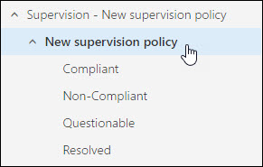

# 為您的組織設定監督原則Configure supervision policies for your organization

使用監督原則來擷取由內部或外部檢閱者檢查 「 員工通訊。Use supervision policies to capture employee communications for examination by internal or external reviewers.
  
> [!NOTE]
> 使用監督原則您的組織需要的 Office 365 E5 訂閱。如果您不具有該對應並想要嘗試監督，您還可以[註冊 Office 365 企業版 E5 的試用版](https://go.microsoft.com/fwlink/p/?LinkID=698279)。Using supervision policies requires an Office 365 E5 subscription for your organization. If you don't have that plan and want to try supervision, you can [sign up for a trial of Office 365 Enterprise E5](https://go.microsoft.com/fwlink/p/?LinkID=698279). 
  
請遵循下列步驟來設定和 Office 365 組織中使用監督：Follow these steps to set up and use supervision in your Office 365 organization: 
  
- [設定群組的監督Set up groups for Supervision](configure-supervision-policies.md#exampledist)
    
    在您開始使用監督之前，請決定誰將其通訊檢閱和誰可以執行這些檢閱 （英文）。如果您想要開始使用少數使用者看到監督的運作方式，您可以略過現在群組設定。Before you start using supervision, determine who will have their communications reviewed and who will perform those reviews. If you want to get started with just a few users to see how supervision works, you can skip setting up groups for now.
    
- [在組織中讓監督Make supervision available in your organization](configure-supervision-policies.md#SRavailable)
    
    新增您自己監督檢閱角色群組讓您可以設定原則。已指派給此角色的任何人可以存取下**資料管理**安全性的**監督**頁面&amp;規範中心。Add yourself to the Supervisory Review role group so you can set up policies. Anyone who has this role assigned can access the **Supervision** page under **Data Governance** in the Security &amp; Compliance Center. 
    
- [設定的監督原則Set up a supervision policy](configure-supervision-policies.md#setupsuper)
    
    您將建立安全性的監督原則&amp;規範中心。這些原則定義的通訊會受到組織中的檢閱和指定誰應該執行檢閱 （英文）。通訊包含電子郵件時 （例如 Facebook、 Twitter、 等） 的第 3 廠商平台通訊You'll create supervision policies in the Security &amp; Compliance Center. These policies define which communications are subject to review in your organization, and specifies who should perform reviews. Communications include email as well as 3rd-party platform communications (such as Facebook, Twitter, etc.)
    
- [使用 Outlook web app 檢閱監督原則所識別的通訊Use Outlook web app to review communications identified by a supervision policy](configure-supervision-policies.md#UseOutlook)
    
    監督增益集可以讓檢閱者存取 Outlook web app 右邊的監督功能，讓他們可以評估並將每個項目。即將推出的桌面的 Outlook 版本支援。The Supervision add-in gives reviewers access to the supervision functionality right within Outlook web app so they can assess and categorize each item. Support for the desktop version of Outlook is coming soon.
    
- **執行監督報告****Run the supervision report**
    
    若要查看檢閱活動層級原則和檢閱者使用監督報告。每個原則，您也可以檢閱活動的目前狀態檢視 live 的統計資料。如需詳細資訊，請參閱[監督報告](supervision-reports.md)。Use the supervision reports to see the review activity at the policy and reviewer level. For each policy, you can also view live statistics on the current state of review activity. For details, see [Supervision reports](supervision-reports.md).
    
## 設定群組的監督Set up groups for Supervision

 當您建立監督原則時，您將決定誰會有檢閱其通訊及誰可以執行這些檢閱 （英文）。在原則中，您將使用電子郵件地址來識別的個人或群組的人員。若要簡化您的安裝程式，建立人員有其檢閱的通訊群組和人員將檢閱這些通訊群組。如果您使用的群組，您可能需要數個 — 例如，如果您想要監視的人員、 兩個不同的群組之間的通訊，或者您想要指定無法移至要指導的群組。如需此的運作方式的詳細資訊，請參閱[範例通訊群組](configure-supervision-policies.md#GroupExample)。When you create a supervision policy, you'll determine who will have their communications reviewed and who will perform those reviews. In the policy, you'll use email addresses to identify individuals or groups of people. To simplify your setup, create groups for people who will have their communication reviewed and groups for people who will review those communications. If you're using groups, you might need several—for example, if you want to monitor communications between two distinct groups of people, or if you want to specify a group that isn't going to be supervised. See [Example distribution groups](configure-supervision-policies.md#GroupExample) for details about how this works. 
  
若要管理組織中的群組內或之間的通訊、 設定通訊群組在 Exchange 系統管理中心 (移至 [**收件者** \> **群組**)。如需設定通訊群組的詳細資訊，請參閱[管理通訊群組](http://go.microsoft.com/fwlink/?LinkId=613635)To supervise communications between or within groups in your organization, set up distribution groups in the Exchange admin center (go to **recipients** \> **groups**). For more information about setting up distribution groups, see [Manage distribution groups](http://go.microsoft.com/fwlink/?LinkId=613635)
  
> [!NOTE]
> 您也可以使用動態通訊群組或安全性群組的監督若您偏好。若要協助您決定是否這些更適合您組織需求，請參閱[管理擁有郵件功能的安全性群組](http://go.microsoft.com/fwlink/?LinkId=627033)及[管理動態通訊群組](http://go.microsoft.com/fwlink/?LinkId=627058)。You can also use dynamic distribution groups or security groups for supervision if you prefer. To help you decide if these better fit your organization needs, see [Manage mail-enabled security groups](http://go.microsoft.com/fwlink/?LinkId=627033), and [Manage dynamic distribution groups](http://go.microsoft.com/fwlink/?LinkId=627058). 
  
### 通訊群組範例Example distribution groups

此範例會包含已針對名為 Contoso 財務國際財務組織設定的通訊群組。This example includes a distribution group that has been set up for a financial organization called Contoso Financial International. 
  
在 Contoso Financial International 中，必須抽樣監管美國境內各代理人間的通訊。不過，不需要監管該群組內的法務人員。在此範例中，我們可以建立下列群組：In Contoso Financial International, a sampling of communications between brokers in the United States must be supervised. However, compliance officers within that group do not require supervision. For this example, we can create the following groups:
  
|**設定此通訊群組****Set up this distribution group**|**群組地址 (別名)****Group address (alias)**|**描述****Description**|
|:-----|:-----|:-----|
|所有美國代理人All US brokers    |US_Brokers@Contoso.comUS_Brokers@Contoso.com    |此群組包含於 Contoso 任職，所有位於美國的代理人的電子郵件地址。This group includes email addresses for all US-based brokers who work for Contoso.    |
|所有美國法務人員All US compliance officers    |US_Compliance@Contoso.comUS_Compliance@Contoso.com    |此群組包含所有的美國型法務人員合作 Contoso 的電子郵件地址。因為此群組的所有美國型經紀人子集，您可用於此別名免除法務人員從監督原則。This group includes email addresses for all US-based compliance officers who work for Contoso. Because this group is a subset of all US-based brokers, you can use this alias to exempt compliance officers from a supervision policy.    |
   
[監督原則設定](configure-supervision-policies.md#setupsuper)] 區段中會說明如何使用這些群組，當您設定的原則。The [Set up a supervision policy](configure-supervision-policies.md#setupsuper) section describes how you can use these groups when you configure the policy. 
  
## 在組織中讓監督Make supervision available in your organization

在 [安全性] 進行**監督**可作為功能表選項&amp;規範中心，您必須指派監督檢閱系統管理員角色。To make **Supervision** available as a menu option in the Security &amp; Compliance Center, you must be assigned the Supervisory Review Administrator role. 
  
為達成此目的，您也可以新增您自己做監督檢閱角色群組的成員，或您可以建立新的角色群組。To do this, you can either add yourself as a member of the Supervisory Review role group, or you can create a new role group.
  
### 新增成員至監督檢閱角色群組Add members to the Supervisory Review role group

1. 登入[https://protection.office.com](https://protection.office.com)使用 Office 365 組織中的管理帳戶的認證。Sign into [https://protection.office.com](https://protection.office.com) using credentials for an admin account in your Office 365 organization. 
    
2. 安全性&amp;規範中心，請移至 [**權限**。In the Security &amp; Compliance Center, go to **Permissions**.
    
3. 選取 [**監督檢閱**角色群組，然後按一下 [編輯] 圖示。Select the **Supervisory Review** role group and then click the Edit icon. 
    
4. 在 [**成員**] 區段中，新增您想要管理您的組織的監督的人員。In the **Members** section, add the people who you want to manage supervision for your organization. 
    
### 建立新的角色群組Create a new role group

1. 登入[https://protection.office.com](https://protection.office.com)使用 Office 365 組織中的管理帳戶的認證。Sign into [https://protection.office.com](https://protection.office.com) using credentials for an admin account in your Office 365 organization. 
    
2. 安全性&amp;規範中心移至 [**權限**] 和 [新增] ( **+**)。In the Security &amp; Compliance Center, go to **Permissions** and then click Add ( **+**).
    
3. 在 [**角色**] 區段中，按一下 [新增] ( **+**) 和**監督檢閱管理員**下的捲軸。將此角色新增至角色群組。In the **Roles** section, click Add ( **+**) and scroll down to **Supervisory Review Administrator**. Add this role to the role group.
    
4. 在 [**成員**] 區段中，新增您想要管理您的組織的監督的人員。In the **Members** section, add the people who you want to manage supervision for your organization. 
    
如需有關角色群組和權限的詳細資訊，請參閱[Office 365 安全性權限&amp;規範中心](permissions-in-the-security-and-compliance-center.md)。For more information about role groups and permissions, see [Permissions in the Office 365 Security &amp; Compliance Center ](permissions-in-the-security-and-compliance-center.md).
  
## 設定的監督原則Set up a supervision policy

> [!IMPORTANT]
> 之前建立的監督原則，您必須先移除任何現有的監督檢閱原則。Before creating a supervision policy, you must first remove any existing supervisory review policies. 
  
1. 登入[https://protection.office.com](https://protection.office.com)使用 Office 365 組織中的管理帳戶的認證。Sign into [https://protection.office.com](https://protection.office.com) using credentials for an admin account in your Office 365 organization. 
    
2. 安全性&amp;規範管理中心，移至按一下 [**資料控管** \> **監督**。In the Security &amp; Compliance Center, go to click **Data governance** \> **Supervision**.
    
    > [!NOTE]
    > 舊版的功能可能會顯示在左導覽中做為**監督檢閱 （淘汰很快）**。此版本將推出已被取代的和移除。呼叫**監督**的新版本需要其位置。The previous version of the feature may show in the left-hand navigation as **Supervisory Review (retiring soon)**. This version will soon be deprecated and removed. The new version called **Supervision** will take its place. 
  
3. 按一下 [**建立**，然後遵循精靈來設定下列原則的頁面。Click **Create** and then follow the wizard to set up the following pages of the policy. 
    
### 原則名稱與描述Policy name and description

輸入名稱與您的原則的描述。基於範例中，我們將命名原則 Contoso 美國經紀人。Enter a name and a description for your policy. For example purposes, we'll name the policy Contoso US Brokers.
  
### 選擇 [管理使用者Choose users to supervise

- 在 [ **Supervise 這些使用者或群組**] 方塊中，選擇 [使用者或群組您想来管理其通訊。如果為 Contoso 美國經紀人堅持與我們的範例，我們將會選擇群組 US_Brokers@Contoso.com 此處。In the **Supervise these users or groups** box, choose the users or groups whose communications your want to supervise. Sticking with our example for Contoso US Brokers, we'll choose the group US_Brokers@Contoso.com here. 
    
- 如果您選擇以管理群組，您可以使用 [**排除這些使用者**] 方塊中選擇免除監督時群組的成員。使用的範例，我們將排除的群組 US_Compliance@Contoso.com 此處。If you chose a group to supervise, you can use the **Exclude these users** box to choose members of the group who are exempt from supervision . Using the example , we'll exclude the group US_Compliance@Contoso.com here. 
    
### 選擇 [可供檢閱的通訊Choose communications to review

根據預設，**方向是**條件會顯示，且無法移除。如果您想要的範圍 （例如僅檢閱含有特定單字或片語的內容） 進一步的檢閱，按一下 [**新增條件**。您可以在必要時指定多個條件。By default, the **Direction is** condition is displayed and can't be removed. If you want to scope the review further (such as only reviewing content that contains certain words or phrases), click **Add a condition**. You can specify multiple conditions if needed.
  
您選擇的條件將套用通訊 (從 Facebook 或投寄箱 like) 您組織中的電子郵件和第 3 廠商來源。如需 Office 365 組織將匯入第 3 廠商通訊的詳細資訊，請參閱[Office 365 中的封存與協力廠商資料](https://technet.microsoft.com/EN-US/library/mt621583.aspx)。The conditions you choose will apply to communications from both email and 3rd-party sources in your organization (like from Facebook or DropBox). For details about importing 3rd-party communications into your Office 365 organization, see [Archiving third-party data in Office 365](https://technet.microsoft.com/EN-US/library/mt621583.aspx).
  
下表說明更多關於每一項條件。The following table explains more about each condition.
  
|**條件****Condition**|**如何使用此條件****How to use this condition**|
|:-----|:-----|
|指示如下Direction is    |選擇**輸入**檢閱就會傳送**至**管理**從**人員選擇的人員不包含在原則中的通訊。Choose **Inbound** to review communications that are sent **to** the people you chose to supervise **from** people not included in the policy.    如果您想要檢閱通訊所選擇**輸出****寄件者選擇管理人員*** * 以 * * 不包含在原則中的人員。Choose **Outbound** if you want to review communications that are sent **from** the people you chose to supervise ** to ** people not included in the policy.    選擇**內部**通訊傳送**之間**檢閱您指定的人員原則中。Choose **Internal** to review communications sent **between** the people you identified in the policy.    |
|郵件包含任何這些字詞Message contains any of these words    郵件包含任何這些字詞Message contains none of these words    |若要將原則套用包含或排除在郵件中特定單字或片語時，輸入每個單字或片語分列一行。您輸入的文字的每一行會分別套用 （僅需一個的這些行必須套用適用於將原則套用至郵件）。如需輸入單字或片語的詳細資訊，請參閱 [下一步] 區段中[比對字與詞至電子郵件或附件](configure-supervision-policies.md#Matchwords)。To apply the policy when certain words or phrases are included or excluded in a message, enter each word or phrase on a separate line. Each line of words you enter will be applied separately (only one of these lines must apply for the policy to apply to the message). For more information about entering words or phrases, see the next section [Matching words and phrases to emails or attachments](configure-supervision-policies.md#Matchwords).    |
|附件中包含任何這些字詞Attachment contains any of these words    附件包含任何這些字詞Attachment contains none of these words    |若要將原則套用包含或排除在郵件附件 （例如 Word 文件） 中特定單字或片語時，輸入每個單字或片語分列一行。您輸入的文字的每一行會分別套用 （僅限一行必須套用適用於將原則套用至附件）。如需輸入單字或片語的詳細資訊，請參閱 [下一步] 區段中[比對字與詞至電子郵件或附件](configure-supervision-policies.md#Matchwords)。To apply the policy when certain words or phrases are included or excluded in a message attachment (such as a Word document), enter each word or phrase on a separate line. Each line of words you enter will be applied separately (only one line must apply for the policy to apply to the attachment). For more information about entering words or phrases, see the next section [Matching words and phrases to emails or attachments](configure-supervision-policies.md#Matchwords).    |
|附件是任何這些檔案類型Attachment is any of these file types    附件為 none 這些檔案類型Attachment is none of these file types    |若要管理包括或排除特定類型的附件的通訊，請輸入副檔名 （例如.exe 或.pdf）。如果您想要包含或排除多個副檔名，輸入這些在個別行上。只有一個附件副檔名必須套用之原則的相符。To supervise communications that include or exclude specific types of attachments, enter the file extensions (such as .exe or .pdf). If you want to include or exclude multiple file extensions, enter these on separate lines. Only one attachment extension needs to match for the policy to apply.    |
|郵件大小大於Message size is larger than    郵件大小大於不Message size is not larger than    |若要檢閱根據特定大小的郵件，請使用這些條件來指定一則訊息可以隨時檢閱之前的最大值或最小大小。例如，如果您指定**的郵件大小大於** \> **1.0 MB**，所有郵件 1.01 MB 且更大會遵循檢閱。您可以選擇位元組、 kb、 （mb） 或 gb 此情況。To review messages based on a certain size, use these conditions to specify the maximum or minimum size a message can be before it is subject to review. For example, if you specify **Message size is larger than** \> **1.0 MB**, all messages that are 1.01 MB and larger will be subject to review. You can choose bytes, kilobytes, megabytes, or gigabytes for this condition.    |
|附件為大於Attachment is larger than    附件是不大於Attachment is not larger than    |若要檢閱其附件的大小為基礎的郵件，請指定附件的最大值或最小大小可以是之前郵件和其附件會受到檢閱。例如，如果您指定**附件大於** \> **2.0 MB**附件的所有郵件 2.01 MB 及移轉會遵循檢閱。您可以選擇位元組、 kb、 （mb） 或 gb 此情況。To review messages based on the size of their attachments, specify the maximum or minimum size an attachment can be before the message and its attachments are subject to review. For example, if you specify **Attachment is larger than** \> **2.0 MB**, all messages with attachments 2.01 MB and over will be subject to review. You can choose bytes, kilobytes, megabytes, or gigabytes for this condition.    |
   
#### 對電子郵件或附件比對單字和字詞Matching words and phrases to emails or attachments

您輸入的文字的每一行會分別套用 （僅限一行必須套用適用於電子郵件或附件套用原則條件）。例如，我們使用條件、**郵件包含任何這些字詞**，關鍵字"也"及"內部貿易"在個別行上。原則會套用到任何包含"也"一字或片語"內部貿易"的訊息。僅有一個這些單字或片語的必須發生以套用此原則條件。在訊息或附件中的文字必須完全符合您的輸入。Each line of words you enter will be applied separately (only one line must apply for the policy condition to apply to the email or attachment). For example, let's use the condition, **Message contains any of these words**, with the keywords "banker" and "insider trading" on separate lines. The policy will apply to any messages that includes the word "banker" or the phrase "insider trading". Only one of these words or phrases must occur for this policy condition to apply. Words in the message or attachment must exactly match what you enter.
  
#### 輸入多個條件Entering multiple conditions

如果您輸入多個條件、 Office 365 使用的所有條件一起決定何時要將原則套用至通訊項目。當您設定多個條件時，他們必須所有符合將原則套用，除非您輸入的例外狀況。例如，假設您需要建立如果郵件包含單字"貿易"且大於 2 MB 應套用原則。不過，如果郵件也包含單字"Contoso 財務的已核准 」，應該不會套用原則。因此，在此例中的三種條件就是，如下所示：If you enter multiple conditions, Office 365 uses all the conditions together to determine when to apply the policy to communication items. When you set up multiple conditions, they must all be met for the policy to apply, unless you enter an exception. For example, let's say you need to create a policy that should apply if a message contains the word "trade", and is larger than 2MB. However, if the message also contains the words "Approved by Contoso financial", the policy should not apply. Thus, in this case, the three conditions would be as follows: 
  
- **郵件包含任何這些字詞**、 使用關鍵字"貿易"**Message contains any of these words**, with the keywords "trade"
    
- **郵件大小大於**，以值 2 MB**Message size is larger than**, with the value 2 MB
    
- **郵件包含不含這些字**、 使用關鍵字"Contoso 財務小組的已核准 」。**Message contains none of these words**, with the keywords "Approved by Contoso financial team".
    
### 指定要檢閱百分比Specify percentage to review

如果您想要減少可供檢閱的內容量，指定百分比。我們隨機將選取的內容量從總符合您所選擇的條件。如果您想檢閱者的所有項目，請輸入**100%**。If you want to reduce the amount of content to review, specify a percentage. We'll randomly select that amount of content from the total that matched the conditions you chose. If you want reviewers to review all items, enter **100%**.
  
### 選擇 [檢閱者Choose reviewers

使用者和群組您選擇要用以監督應用程式 Outlook web app 中檢查傳回依此原則的通訊。您可以在內部或外部檢閱者的包含電子郵件地址。The users and groups you choose will use the Supervision app in Outlook web app to examine the communications that are returned by this policy. You can include email addresses for internal or external reviewers. 
  
### 檢閱您的設定Review your settings

在完成所有章節的監督原則後，檢閱您的設定和 [**完成**] 以儲存您的原則。可能需要幾個小時開始捕捉 communications 原則。監督將供檢閱的所有通訊都傳遞到檢閱者可以存取 Outlook web app 中的共用資料夾。After you've completed all sections of the supervision policy, review your settings and then click **Finish** to save your policy. It might take a few hours for the policy to start capturing communications. Supervision delivers all communications for review into a shared folder that reviewers can access in Outlook web app. 
  
## 使用 Outlook web app 檢閱監督原則所識別的通訊Use Outlook web app to review communications identified by a supervision policy

檢閱者將會使用監督增益集的 Outlook web app 檢閱通訊。增益集會自動安裝 Outlook web app 中所指定之原則的所有檢閱者的。即將推出的桌面的 Outlook 版本支援。Reviewers will use the Supervision add-in for Outlook web app to review communications. The add-in is installed automatically in Outlook web app for all reviewers you specified in the policy. Support for the desktop version of Outlook is coming soon.
  
 **檢閱在 Outlook web app 中的通訊****Reviewing communications in Outlook web app**
  
1. 在 Outlook web app 中，依序展開 [**監督-\<原則名稱\>** 資料夾。In Outlook web app, expand the **Supervision - \<policy name\>** folder. 
    
2. 在**\<原則名稱\>** 子資料夾、 檢閱者將會看到該監督原則所識別的所有通訊。In the **\<policy name\>** subfolder, reviewers will see all the communications identified by that supervision policy. 
    
    
  
3. 開啟檢閱並按一下 [**監督**增益集的項目。Open an item to review and click the **Supervision** add-in. 
    
4. 使用增益集將分類為**符合標準**、**非符合標準**、 **Questionable**或**已解決**的項目。您是否已分類項目之後，將會移至相對應的子資料夾下**\<原則名稱\>** 資料夾。Use the add-in to classify the item as **Compliant**, **Non-Compliant**, **Questionable,** or **Resolved**. After you've classified an item, it will be moved to the corresponding subfolder under the **\<policy name\>** folder. 
    

