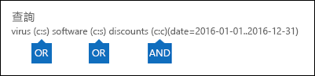

# <a name="content-search-in-office-365"></a><span data-ttu-id="78272-106">Office 365 中的內容搜尋</span><span class="sxs-lookup"><span data-stu-id="78272-106">Content Search in Office 365</span></span>

<span data-ttu-id="78272-107">您可以使用 Office 365 或 Microsoft 365 的合規性中心中的 「 內容搜尋電子文件探索工具來搜尋 Office 365 組織中的 [就地項目，例如電子郵件、 文件，並立即訊息對話。</span><span class="sxs-lookup"><span data-stu-id="78272-107">You can use the Content Search eDiscovery tool in the compliance center in Office 365 or Microsoft 365 to search for in-place items such as email, documents, and instant messaging conversations in your Office 365 organization.</span></span> <span data-ttu-id="78272-108">使用此工具來搜尋這些 Office 365 服務中的項目：</span><span class="sxs-lookup"><span data-stu-id="78272-108">Use this tool to search for items in these Office 365 services:</span></span>
  
- <span data-ttu-id="78272-109">Exchange Online 信箱與公用資料夾</span><span class="sxs-lookup"><span data-stu-id="78272-109">Exchange Online mailboxes and public folders</span></span>
    
- <span data-ttu-id="78272-110">SharePoint Online 網站和商務用 OneDrive 帳戶</span><span class="sxs-lookup"><span data-stu-id="78272-110">SharePoint Online sites and OneDrive for Business accounts</span></span>
    
- <span data-ttu-id="78272-111">Skype 商務交談</span><span class="sxs-lookup"><span data-stu-id="78272-111">Skype for Business conversations</span></span>
    
- <span data-ttu-id="78272-112">Microsoft Teams</span><span class="sxs-lookup"><span data-stu-id="78272-112">Microsoft Teams</span></span> 
    
- <span data-ttu-id="78272-113">Office 365 群組</span><span class="sxs-lookup"><span data-stu-id="78272-113">Office 365 Groups</span></span>
    
<span data-ttu-id="78272-114">之後您執行內容搜尋的內容位置數和預估的搜尋結果數目會顯示在搜尋設定檔。</span><span class="sxs-lookup"><span data-stu-id="78272-114">After you run a Content Search, the number of content locations and an estimated number of search results are displayed in the search profile.</span></span> <span data-ttu-id="78272-115">您可以也快速檢視統計資料，例如擁有大部分的項目符合搜尋查詢的內容位置。</span><span class="sxs-lookup"><span data-stu-id="78272-115">You can also quickly view statistics, such as the content locations that have the most items that match the search query.</span></span> <span data-ttu-id="78272-116">執行搜尋之後，您可預覽結果，或將其匯出至本機電腦。</span><span class="sxs-lookup"><span data-stu-id="78272-116">After you run a search, you can preview the results or export them to a local computer.</span></span>


## <a name="create-a-new-search"></a><span data-ttu-id="78272-117">建立新的搜尋</span><span class="sxs-lookup"><span data-stu-id="78272-117">Create a new search</span></span>

<span data-ttu-id="78272-118">若要擁有存取權來執行搜尋及預覽，並將搜尋結果匯出**內容搜尋**] 頁面上，系統管理員、 法務人員或 eDiscovery 管理員都必須安全性 & 合規性中心中的 eDiscovery 管理員角色群組的成員。</span><span class="sxs-lookup"><span data-stu-id="78272-118">To have access to the **Content search** page to run searches and preview and export search results, an administrator, compliance officer, or eDiscovery manager must be a member of the eDiscovery Manager role group in the Security & Compliance Center.</span></span> <span data-ttu-id="78272-119">如需詳細資訊，請參閱[指派 eDiscovery 權限](assign-ediscovery-permissions.md)。</span><span class="sxs-lookup"><span data-stu-id="78272-119">For more information, see [Assign eDiscovery permissions](assign-ediscovery-permissions.md).</span></span>
  
1. <span data-ttu-id="78272-120">移至 [[https://protection.office.com](https://protection.office.com)和登入您的 Office 365 電子郵件地址和密碼。</span><span class="sxs-lookup"><span data-stu-id="78272-120">Go to [https://protection.office.com](https://protection.office.com) and sign in using your Office 365 email address and password.</span></span>
    
2. <span data-ttu-id="78272-121">按一下 [**搜尋** \> **內容搜尋**。</span><span class="sxs-lookup"><span data-stu-id="78272-121">Click **Search** \> **Content search**.</span></span>
    
3. <span data-ttu-id="78272-122">在 [**搜尋**] 頁面上，按一下箭號下一步]**新的搜尋**。</span><span class="sxs-lookup"><span data-stu-id="78272-122">On the **Search** page, click the arrow next to  **New search**.</span></span> 
    
    ![新的 [搜尋] 下拉式清單](media/76b25861-55c5-4f50-9d48-9e2be2d0d078.png)
  
    <span data-ttu-id="78272-124">使用 [內部 DNS 查閱] 索引標籤來指定在解析郵件伺服器的地址進行內部郵件傳遞時，要使用安裝在此伺服器上的網路介面卡上設定的 DNS 伺服器，或使用特定的 DNS 伺服器。內部 DNS 伺服器是用於解析組織內伺服器的 IP 位址。</span><span class="sxs-lookup"><span data-stu-id="78272-124">You can choose one of the following options:</span></span>
    
    - <span data-ttu-id="78272-125">**「 引導式搜尋**-此選項會啟動將引導您完成建立搜尋] 精靈。</span><span class="sxs-lookup"><span data-stu-id="78272-125">**Guided search** - This option starts a wizard that guides you through the creating the search.</span></span> <span data-ttu-id="78272-126">選取 [內容位置，並建置搜尋查詢的使用者介面是**新的搜尋**選項相同。</span><span class="sxs-lookup"><span data-stu-id="78272-126">The user interface to select content locations and build the search query are the same as the **New search** option.</span></span> 
    
    - <span data-ttu-id="78272-127">**新的搜尋**-此選項會顯示更新的使用者介面，以建立新的搜尋。</span><span class="sxs-lookup"><span data-stu-id="78272-127">**New search** - This option displays an updated user interface to create a new search.</span></span> <span data-ttu-id="78272-128">如果您按一下 [**新增搜尋**，這是預設選項。</span><span class="sxs-lookup"><span data-stu-id="78272-128">This is the default option if you click **New search**.</span></span>
    
    - <span data-ttu-id="78272-129">**搜尋根據識別碼清單**-此選項可讓您搜尋特定的電子郵件訊息和使用 Exchange 識別碼清單的其他信箱項目。</span><span class="sxs-lookup"><span data-stu-id="78272-129">**Search by ID List** - This option lets you search for specific email messages and other mailbox items using a list of Exchange IDs.</span></span> <span data-ttu-id="78272-130">若要建立 （正式稱為的目標式的搜尋） 的識別碼清單搜尋，您提交識別特定信箱的項目若要搜尋的逗號分隔的值 (CSV) 檔案。</span><span class="sxs-lookup"><span data-stu-id="78272-130">To create an ID list search (formally called a targeted search), you submit a comma separated value (CSV) file that identifies the specific mailbox items to search for.</span></span> <span data-ttu-id="78272-131">如需相關指示，請參閱 <<c0>準備識別碼清單在 Office 365 中的內容搜尋的 CSV 檔案。</span><span class="sxs-lookup"><span data-stu-id="78272-131">For instructions, see [Prepare a CSV file for an ID list Content Search in Office 365](csv-file-for-an-id-list-content-search.md).</span></span>
    
    <span data-ttu-id="78272-132">在此程序的步驟的其餘部分會遵循預設新的搜尋工作流程。</span><span class="sxs-lookup"><span data-stu-id="78272-132">The remainder of the steps in this procedure will follow the default new search workflow.</span></span>
    
4. <span data-ttu-id="78272-133">下拉式清單中，按一下 [**新的搜尋**。</span><span class="sxs-lookup"><span data-stu-id="78272-133">Click **New search** in the drop-down list.</span></span> 
    
5. <span data-ttu-id="78272-134">在 [**搜尋查詢**，請指定下列事項。</span><span class="sxs-lookup"><span data-stu-id="78272-134">Under **Search query**, specify the following things.</span></span>
    
    
  
   - <span data-ttu-id="78272-136">**若要搜尋的關鍵字**的搜尋查詢**關鍵字**] 方塊中的類型。</span><span class="sxs-lookup"><span data-stu-id="78272-136">**Keywords to search for** - Type a search query in **Keywords** box.</span></span> <span data-ttu-id="78272-137">您可以指定關鍵字、例如傳送和接收日期的郵件屬性，或者例如檔案名稱或文件上次變更的日期的文件屬性。</span><span class="sxs-lookup"><span data-stu-id="78272-137">You can specify keywords, message properties such as sent and received dates, or document properties such as file names or the date that a document was last changed.</span></span> <span data-ttu-id="78272-138">您可以使用更複雜的查詢，使用布林運算子，例如**AND**、**或**、**不**、 和**NEAR**。</span><span class="sxs-lookup"><span data-stu-id="78272-138">You can use a more complex queries that use a Boolean operator, such as **AND**, **OR**, **NOT**, and **NEAR**.</span></span> <span data-ttu-id="78272-139">您也可以搜尋 （如社會安全編號） 中的文件或外部共用的文件中搜尋的敏感資訊。</span><span class="sxs-lookup"><span data-stu-id="78272-139">You can also search for sensitive information (such as social security numbers) in documents, or search for documents that have been shared externally.</span></span> <span data-ttu-id="78272-140">如果您將 [關鍵字] 方塊保留空白，位於指定的內容位置中的所有內容將會都包含在搜尋結果中。</span><span class="sxs-lookup"><span data-stu-id="78272-140">If you leave the keyword box empty, all content located in the specified content locations will be included in the search results.</span></span>
    
      <span data-ttu-id="78272-141">或者，您可以按一下**顯示關鍵字清單**] 核取方塊並輸入每一列中的關鍵字。</span><span class="sxs-lookup"><span data-stu-id="78272-141">Alternatively, you can click the **Show keyword list** checkbox and the type a keyword in each row.</span></span> <span data-ttu-id="78272-142">如果您這麼做時，每一列上的關鍵字來類似功能中建立搜尋查詢的**OR**運算子邏輯運算子 ( **c:s**) 連線。</span><span class="sxs-lookup"><span data-stu-id="78272-142">If you do this, the keywords on each row are connected by a logical operator ( **c:s**) that is similar in functionality to the **OR** operator in the search query that's created.</span></span> 
    
      <span data-ttu-id="78272-143">為什麼要使用關鍵字清單？</span><span class="sxs-lookup"><span data-stu-id="78272-143">Why use the keyword list?</span></span> <span data-ttu-id="78272-144">您可以取得顯示多少個項目比對每個關鍵字的統計資料。</span><span class="sxs-lookup"><span data-stu-id="78272-144">You can get statistics that show how many items match each keyword.</span></span> <span data-ttu-id="78272-145">這可協助您快速找出哪些關鍵字是最 （和至少） 有效。</span><span class="sxs-lookup"><span data-stu-id="78272-145">This can help you quickly identify which keywords are the most (and least) effective.</span></span> <span data-ttu-id="78272-146">您也可以使用 （以括號括住） 的關鍵字文句] 列中。</span><span class="sxs-lookup"><span data-stu-id="78272-146">You can also use a keyword phrase (surrounded by parentheses) in a row.</span></span> <span data-ttu-id="78272-147">如需搜尋統計資料的詳細資訊，請參閱 <<c0>檢視的內容搜尋結果的關鍵字統計資料。</span><span class="sxs-lookup"><span data-stu-id="78272-147">For more information about search statistics, see [View keyword statistics for Content Search results](view-keyword-statistics-for-content-search.md).</span></span>

    > [!NOTE]
    > <span data-ttu-id="78272-148">若要協助減少大型關鍵字清單所導致的問題，您現在有限的最大值為 20 列在 [關鍵字] 清單中。</span><span class="sxs-lookup"><span data-stu-id="78272-148">To help reduce issues caused by large keyword lists, you're now limited to a maximum of 20 rows in the keyword list.</span></span>
    
    - <span data-ttu-id="78272-149">**條件**-您可以新增搜尋條件縮小搜尋範圍，並傳回更精細的結果集。</span><span class="sxs-lookup"><span data-stu-id="78272-149">**Conditions** - You can add search conditions to narrow a search and return a more refined set of results.</span></span> <span data-ttu-id="78272-150">每個條件將子句新增至搜尋查詢，建立及執行當您啟動搜尋。</span><span class="sxs-lookup"><span data-stu-id="78272-150">Each condition adds a clause to the search query that is created and run when you start the search.</span></span> <span data-ttu-id="78272-151">條件以邏輯方式是透過類似功能**AND**運算子邏輯運算子 ( **c:c**) 連接至 （在 [關鍵字] 方塊中指定） 的關鍵字查詢。</span><span class="sxs-lookup"><span data-stu-id="78272-151">A condition is logically connected to the keyword query (specified in the keyword box) by a logical operator ( **c:c**) that is similar in functionality to the **AND** operator.</span></span> <span data-ttu-id="78272-152">這表示項目必須符合的關鍵字查詢和結果中包含的一或多個條件。</span><span class="sxs-lookup"><span data-stu-id="78272-152">That means that items have to satisfy both the keyword query and one or more conditions to be included in the results.</span></span> <span data-ttu-id="78272-153">這就是條件如何協助您縮小搜尋結果。</span><span class="sxs-lookup"><span data-stu-id="78272-153">This is how conditions help to narrow your results.</span></span> <span data-ttu-id="78272-154">清單和說明您可以在搜尋查詢中使用的條件，請參閱 「 搜尋條件 」 一節中[關鍵字查詢和搜尋條件的內容搜尋](keyword-queries-and-search-conditions.md#search-conditions)。</span><span class="sxs-lookup"><span data-stu-id="78272-154">For a list and description of conditions that you can use in a search query, see the "Search conditions" section in [Keyword queries and search conditions for Content Search](keyword-queries-and-search-conditions.md#search-conditions).</span></span>
    
       - <span data-ttu-id="78272-155">**位置**-選擇要搜尋的內容位置。</span><span class="sxs-lookup"><span data-stu-id="78272-155">**Locations** - Choose the content locations to search.</span></span>
    
      - <span data-ttu-id="78272-156">**所有位置**-使用此選項，以搜尋組織中的所有內容位置。</span><span class="sxs-lookup"><span data-stu-id="78272-156">**All locations** - Use this option to search all content locations in your organization.</span></span> <span data-ttu-id="78272-157">這包括電子郵件中所有的 Exchange 信箱 （包括所有的非使用中信箱、 所有 Office 365 群組的信箱、 所有的 Microsoft Teams 的信箱），所有商務用 Skype 商務交談，所有 SharePoint 和 OneDrive for Business 網站 （包括網站所有 Office 365 群組及 Microsoft Teams），以及所有 Exchange 公用資料夾中的項目。</span><span class="sxs-lookup"><span data-stu-id="78272-157">This includes email in all Exchange mailboxes (including all inactive mailboxes, mailboxes for all Office 365 Groups, mailboxes for all Microsoft Teams), all Skype for Business conversations, all SharePoint and OneDrive for Business sites (including the sites for all Office 365 Groups and Microsoft Teams), and items in all Exchange public folders.</span></span>
    
      - <span data-ttu-id="78272-158">**特定位置**-使用此選項，以搜尋特定的內容位置。</span><span class="sxs-lookup"><span data-stu-id="78272-158">**Specific locations** - Use this option to search specific content locations.</span></span> <span data-ttu-id="78272-159">您可以搜尋特定的 Office 365 服務的所有內容位置 （例如搜尋所有 Exchange 信箱或搜尋所有 SharePoint 網站） 或您可以在任何要顯示 Office 365 服務中都搜尋特定位置。</span><span class="sxs-lookup"><span data-stu-id="78272-159">You can search all content locations for a specific Office 365 service (such as searching all Exchange mailboxes or search all SharePoint sites) or you can search specific locations in any of the Office 365 services that are displayed.</span></span> 
    
        
  
         <span data-ttu-id="78272-161">請注意，您也可以新增通訊群組來搜尋 Exchange 信箱的清單。</span><span class="sxs-lookup"><span data-stu-id="78272-161">Note that you can also add distribution groups to the list of Exchange mailboxes to search.</span></span> <span data-ttu-id="78272-162">通訊群組、 會搜尋群組成員的信箱。</span><span class="sxs-lookup"><span data-stu-id="78272-162">For distribution groups, the mailboxes of group members are searched.</span></span> <span data-ttu-id="78272-163">請注意，不支援動態通訊群組。</span><span class="sxs-lookup"><span data-stu-id="78272-163">Note that dynamic distribution groups aren't supported.</span></span>
    
       <span data-ttu-id="78272-164">**重要：** 當您搜尋所有信箱的位置或只是特定的信箱時，從 MyAnalytics 和其他 Office 365 應用程式已儲存至使用者信箱的資料會包含當您匯出內容都搜尋的結果。</span><span class="sxs-lookup"><span data-stu-id="78272-164">**Important:** When you search all mailbox locations or just specific mailboxes, data from MyAnalytics and other Office 365 applications that's saved to user mailboxes will be included when you export the results of a Content Search.</span></span> <span data-ttu-id="78272-165">此資料不會包含在預估的搜尋結果，並無法供預覽。</span><span class="sxs-lookup"><span data-stu-id="78272-165">This data will not be included in the estimated search results and it won't be available for preview.</span></span> <span data-ttu-id="78272-166">它只會包含當您匯出及下載搜尋結果中。請參閱 <<c0>從 MyAnalytics 匯出資料和其他 Office 365 應用程式中的 「 內容搜尋的相關的其他資訊 」 區段。</span><span class="sxs-lookup"><span data-stu-id="78272-166">It will only be included when you export and download the search results; see [Exporting data from MyAnalytics and other Office 365 applications](#exporting-data-from-myanalytics-and-other-office-365-applications) in the "More information about content search" section.</span></span> 
    
6. <span data-ttu-id="78272-167">您已設定您的搜尋查詢之後，按一下 [**儲存&amp;執行**。</span><span class="sxs-lookup"><span data-stu-id="78272-167">After you've set up your search query, click **Save &amp; run**.</span></span>
    
7. <span data-ttu-id="78272-168">在**儲存搜尋**] 頁面上，輸入搜尋]，並選擇性描述，可協助識別搜尋的名稱。</span><span class="sxs-lookup"><span data-stu-id="78272-168">On the **Save search** page, type a name for the search, and an optional description that helps identify the search.</span></span> <span data-ttu-id="78272-169">請注意，搜尋名稱是唯一的組織中。</span><span class="sxs-lookup"><span data-stu-id="78272-169">Note that the name of the search has to be unique in your organization.</span></span> 
    
8. <span data-ttu-id="78272-170">按一下 [**儲存**] 以啟動搜尋。</span><span class="sxs-lookup"><span data-stu-id="78272-170">Click **Save** to start the search.</span></span> 
    
    <span data-ttu-id="78272-171">儲存後，當您執行搜尋時，搜尋所傳回任何結果會顯示在結果窗格中。</span><span class="sxs-lookup"><span data-stu-id="78272-171">After you save and run the search, any results returned by the search are displayed in the results pane.</span></span> <span data-ttu-id="78272-172">根據您需要的預覽設定，搜尋結果的顯示，或您需要按一下 [**預覽結果**，以檢視它們。</span><span class="sxs-lookup"><span data-stu-id="78272-172">Depending on how you have the preview setting configured, the search results are display or you have to click **Preview results** to view them.</span></span> <span data-ttu-id="78272-173">請參閱下一節以取得詳細資料。</span><span class="sxs-lookup"><span data-stu-id="78272-173">See the next section for details.</span></span> 
    
<span data-ttu-id="78272-174">若要重新存取此內容的搜尋或存取其他內容的搜尋列在 [**內容搜尋**] 頁面上，選取搜尋]，然後按一下 [**開啟**。</span><span class="sxs-lookup"><span data-stu-id="78272-174">To access this content search again or access other content searches listed on the **Content search** page, select the search and then click **Open**.</span></span> 
  
<span data-ttu-id="78272-175">若要清除的結果，或是建立新的搜尋，按一下 [**新的搜尋**。</span><span class="sxs-lookup"><span data-stu-id="78272-175">To clear the results or create a new search, click  **New search**.</span></span> 

  
## <a name="preview-search-results"></a><span data-ttu-id="78272-176">預覽搜尋結果</span><span class="sxs-lookup"><span data-stu-id="78272-176">Preview search results</span></span>

<span data-ttu-id="78272-177">有兩個組態設定來預覽搜尋結果。</span><span class="sxs-lookup"><span data-stu-id="78272-177">There are two configuration settings for previewing search results.</span></span> <span data-ttu-id="78272-178">您執行新的新搜尋或開啟現有的搜尋之後，按一下 [\* \* 個別結果 \* \* 若要檢視下列 「 預覽 」 設定：</span><span class="sxs-lookup"><span data-stu-id="78272-178">After you run a new a new search or open an existing search, click \*\* Individual results \*\* to view the following preview settings:</span></span> 
  

  
1. <span data-ttu-id="78272-180">**自動預覽結果**-此設定會顯示在搜尋結果後執行搜尋。</span><span class="sxs-lookup"><span data-stu-id="78272-180">**Preview results automatically** - This setting displays the search results after you a run a search.</span></span>
    
2. <span data-ttu-id="78272-181">**以手動方式預覽結果**-此設定會預留位置的形式顯示在搜尋結果] 窗格中，並會顯示您需要按一下 [顯示搜尋結果**預覽結果**] 按鈕。</span><span class="sxs-lookup"><span data-stu-id="78272-181">**Preview results manually** - This setting displays placeholders in the search results pane, and displays the **Preview results** button that you have to click to display the search results.</span></span> <span data-ttu-id="78272-182">這是預設設定;它可以協助提升搜尋效能不會自動顯示在搜尋結果，當您開啟現有的搜尋。</span><span class="sxs-lookup"><span data-stu-id="78272-182">This is the default setting; it helps enhance search performance by not automatically displaying the search results when you open an existing search.</span></span> 
    
<span data-ttu-id="78272-183">有多少個項目可用來預覽與相關的限制。</span><span class="sxs-lookup"><span data-stu-id="78272-183">There are limits related to how many items are available to be previewed.</span></span> <span data-ttu-id="78272-184">如需詳細資訊，請參閱 <<c0>內容搜尋的限制。</span><span class="sxs-lookup"><span data-stu-id="78272-184">For more information, see [Limits for Content Search](limits-for-content-search.md).</span></span> 
  
<span data-ttu-id="78272-185">可以預覽支援的檔案類型清單，請參閱 「 內容搜尋的相關的其他資訊 」 區段中的 [ [Previewing 搜尋結果](#previewing-search-results)。</span><span class="sxs-lookup"><span data-stu-id="78272-185">For a list of supported file types that can be previewed, see [Previewing search results](#previewing-search-results) in the "More information about content search" section.</span></span> <span data-ttu-id="78272-186">如果預覽或下載一份文件，不支援的檔案類型，您可以按一下 [**下載原始的檔案**下載到本機電腦。</span><span class="sxs-lookup"><span data-stu-id="78272-186">If a file type isn't supported for preview or to download a copy of a document, you can click **Download original file** to download it to your local computer.</span></span> <span data-ttu-id="78272-187">.aspx 網頁，但是您可能沒有權限來存取] 頁面上，會包含頁面的 URL。</span><span class="sxs-lookup"><span data-stu-id="78272-187">For .aspx Web pages, the URL for the page is included though you might not have permissions to access the page.</span></span> 
  
<span data-ttu-id="78272-188">也請注意未編製索引的項目不適用於預覽。</span><span class="sxs-lookup"><span data-stu-id="78272-188">Also note that unindexed items aren't available for previewing.</span></span>
  
## <a name="view-information-and-statistics-about-a-search"></a><span data-ttu-id="78272-189">檢視資訊和搜尋相關的統計資料</span><span class="sxs-lookup"><span data-stu-id="78272-189">View information and statistics about a search</span></span>

<span data-ttu-id="78272-190">在建立並執行內容搜尋之後，您可以檢視有關預估的搜尋結果的統計資料。</span><span class="sxs-lookup"><span data-stu-id="78272-190">After you create and run a content search, you can view statistics about the estimated search results.</span></span> <span data-ttu-id="78272-191">這包括搜尋結果，例如內容的位置，以符合搜尋查詢的項目數目及內容的位置會有最符合的項目名稱的查詢統計資料的摘要。</span><span class="sxs-lookup"><span data-stu-id="78272-191">This includes a summary of the search results, the query statistics such as the number of content locations with items that match the search query, and the name of content locations that have the most matching items.</span></span> <span data-ttu-id="78272-192">您可以顯示一或多個內容搜尋的統計資料。</span><span class="sxs-lookup"><span data-stu-id="78272-192">You can display statistics for one or more content searches.</span></span> <span data-ttu-id="78272-193">這可讓您快速比較多個搜尋的結果，並且進行決策搜尋查詢的效率。</span><span class="sxs-lookup"><span data-stu-id="78272-193">This lets you to quickly compare the results for multiple searches and make decisions about the effectiveness of your search queries.</span></span>
  
<span data-ttu-id="78272-194">您也可以下載的搜尋統計資料和關鍵字統計資料至 CSV 檔案。</span><span class="sxs-lookup"><span data-stu-id="78272-194">You can also download the search statistics and keyword statistics to a CSV file.</span></span> <span data-ttu-id="78272-195">這可讓您在 Excel 中使用的篩選和排序功能，若要比較的結果，並準備您的搜尋結果中的報告。</span><span class="sxs-lookup"><span data-stu-id="78272-195">This lets you use the filtering and sorting features in Excel to compare results, and prepare reports for your search results.</span></span>
  
<span data-ttu-id="78272-196">若要檢視搜尋統計資料：</span><span class="sxs-lookup"><span data-stu-id="78272-196">To view search statistics:</span></span>
  
1. <span data-ttu-id="78272-197">在 [**內容搜尋**] 頁面上，按一下 [**開啟]** ，然後按一下您想要檢視的統計資料的搜尋。</span><span class="sxs-lookup"><span data-stu-id="78272-197">On the **Content search** page, click **Open** and then click the search that you want to view the statistic for.</span></span> 
    
2. <span data-ttu-id="78272-198">在飛入] 頁面上，按一下 [**開啟查詢**]。</span><span class="sxs-lookup"><span data-stu-id="78272-198">On the fly out page, click **Open query**.</span></span> 
    
3. <span data-ttu-id="78272-199">在**個別的結果**] 下拉式清單中，按一下 [**搜尋設定檔**]。</span><span class="sxs-lookup"><span data-stu-id="78272-199">In the **Individual results** drop down list, click **Search profile**.</span></span>
    
4. <span data-ttu-id="78272-200">在 [**類型**] 下拉式清單中，按一下下列其中一個下列選項根據您想要檢視搜尋統計資料。</span><span class="sxs-lookup"><span data-stu-id="78272-200">In the **Type** drop down list, click one of the following options depending on the search statistics you want to view.</span></span> 
    
  - <span data-ttu-id="78272-201">搜尋**摘要**會顯示每種類型的內容位置的統計資料。</span><span class="sxs-lookup"><span data-stu-id="78272-201">**Summary** - Displays statistics for each type of content locations searched.</span></span> <span data-ttu-id="78272-202">此內容包含項目符合搜尋查詢的內容位置的數目和搜尋結果項目總數和大小。</span><span class="sxs-lookup"><span data-stu-id="78272-202">This contents the number of content locations that contained items that matched the search query, and the total number and size of search result items.</span></span> <span data-ttu-id="78272-203">這是預設設定。</span><span class="sxs-lookup"><span data-stu-id="78272-203">This is the default setting.</span></span>
    
  - <span data-ttu-id="78272-204">**查詢**的搜尋查詢顯示統計資料。</span><span class="sxs-lookup"><span data-stu-id="78272-204">**Queries** - Displays statistics about the search query.</span></span> <span data-ttu-id="78272-205">這包括的內容位置的查詢統計資料適用於類型，適用於搜尋查詢的統計資料的一部分來 （請注意，**主要**表示整個搜尋查詢），包含的內容位置的數項目符合搜尋查詢，總數和大小與項目 （在指定的內容位置） 所找到符合搜尋查詢。</span><span class="sxs-lookup"><span data-stu-id="78272-205">This includes the type of content location the query statistics are applicable to, part of the search query the statistics are applicable to (note that **Primary** indicates the entire search query), the number of the content locations that contain items that match the search query, and the total number and size and items that were found (in the specified content location) that match the search query.</span></span> <span data-ttu-id="78272-206">請注意的未編製索引的項目 （也稱為局部編製索引的項目） 的統計資料也會顯示。</span><span class="sxs-lookup"><span data-stu-id="78272-206">Note that statistics for unindexed items (also called partially indexed items) are also displayed.</span></span> <span data-ttu-id="78272-207">不過，只有已局部編製索引的項目從信箱會包含在統計資料。</span><span class="sxs-lookup"><span data-stu-id="78272-207">However, only partially indexed items from mailboxes are included in the statistics.</span></span> <span data-ttu-id="78272-208">從 SharePoint 和 OneDrive 的已局部編製索引項目不包含在統計資料。</span><span class="sxs-lookup"><span data-stu-id="78272-208">Partially indexed items from SharePoint and OneDrive are not included in the statistics.</span></span>
    
  - <span data-ttu-id="78272-209">**上方的位置**-顯示符合搜尋查詢的每個所搜尋的內容位置的項目數目的統計資料。</span><span class="sxs-lookup"><span data-stu-id="78272-209">**Top locations** - Displays statistics about the number of items that match the search query in each content location that was searched.</span></span> <span data-ttu-id="78272-210">會顯示前 1000 個位置。</span><span class="sxs-lookup"><span data-stu-id="78272-210">The top 1,000 locations are displayed.</span></span>
    
<span data-ttu-id="78272-211">如需搜尋統計資料的詳細資訊，請參閱 <<c0>檢視的內容搜尋結果的關鍵字統計資料。</span><span class="sxs-lookup"><span data-stu-id="78272-211">For more detailed information about search statistics, see [View keyword statistics for Content Search results](view-keyword-statistics-for-content-search.md).</span></span>
  
  
## <a name="export-search-results"></a><span data-ttu-id="78272-212">匯出搜尋結果</span><span class="sxs-lookup"><span data-stu-id="78272-212">Export search results</span></span>

<span data-ttu-id="78272-213">成功執行搜尋之後，您可以匯出到本機電腦上的搜尋結果。</span><span class="sxs-lookup"><span data-stu-id="78272-213">After a search is successfully run, you can export the search results to a local computer.</span></span> <span data-ttu-id="78272-214">當您匯出電子郵件的結果時，他們可以下載到您的電腦為 PST 檔案或個別郵件 （.msg 檔案）。</span><span class="sxs-lookup"><span data-stu-id="78272-214">When you export email results, they can be downloaded to your computer as PST files or as individual messages (.msg files).</span></span> <span data-ttu-id="78272-215">當您匯出內容從 SharePoint 和 OneDrive 網站時，會匯出的原生 Office 文件複本。</span><span class="sxs-lookup"><span data-stu-id="78272-215">When you export content from SharePoint and OneDrive sites, copies of native Office documents are exported.</span></span> <span data-ttu-id="78272-216">匯出的搜尋結果中另外還有其他文件和報告。</span><span class="sxs-lookup"><span data-stu-id="78272-216">There are also additional documents and reports that are included with the exported search results.</span></span> <span data-ttu-id="78272-217">您也可以匯出搜尋結果報告，並不實際的項目。</span><span class="sxs-lookup"><span data-stu-id="78272-217">You can also just export the search results report and not the actual items.</span></span>
  
<span data-ttu-id="78272-218">若要匯出搜尋結果：</span><span class="sxs-lookup"><span data-stu-id="78272-218">To export search results:</span></span>
  
1. <span data-ttu-id="78272-219">在**內容搜尋**] 頁面上，按一下您想要匯出的搜尋結果的搜尋。</span><span class="sxs-lookup"><span data-stu-id="78272-219">On the **Content search** page, click the search that you want to export the search results for.</span></span> 
    
2. <span data-ttu-id="78272-220">在飛入] 頁面上，按一下 [**更多**，然後按一下 [**匯出結果**。</span><span class="sxs-lookup"><span data-stu-id="78272-220">On the fly out page, click  **More**, and then click **Export results**.</span></span> <span data-ttu-id="78272-221">請注意，您也可以匯出搜尋結果報告。</span><span class="sxs-lookup"><span data-stu-id="78272-221">Note that you can also export a search results report.</span></span>
    
3. <span data-ttu-id="78272-222">完成**匯出結果**的章節飛出] 頁面。</span><span class="sxs-lookup"><span data-stu-id="78272-222">Complete the sections on the **Export results** fly out page.</span></span> <span data-ttu-id="78272-223">請務必使用捲軸檢視所有匯出選項。</span><span class="sxs-lookup"><span data-stu-id="78272-223">Be sure to use the scroll bar to view all export options.</span></span> 
    
<span data-ttu-id="78272-224">如需詳細的指示及疑難排解秘訣，請參閱：</span><span class="sxs-lookup"><span data-stu-id="78272-224">For more detailed instructions and troubleshooting tips, see:</span></span>
  
- [<span data-ttu-id="78272-225">匯出內容搜尋結果</span><span class="sxs-lookup"><span data-stu-id="78272-225">Export Content Search results</span></span>](export-search-results.md)
    
- [<span data-ttu-id="78272-226">匯出內容搜尋報告</span><span class="sxs-lookup"><span data-stu-id="78272-226">Export a Content Search report</span></span>](export-a-content-search-report.md)
    
  
## <a name="more-information-about-content-search"></a><span data-ttu-id="78272-227">內容搜尋的詳細資訊</span><span class="sxs-lookup"><span data-stu-id="78272-227">More information about content search</span></span>

<span data-ttu-id="78272-228">請參閱下列各節的內容搜尋的詳細資訊。</span><span class="sxs-lookup"><span data-stu-id="78272-228">See the following sections for more information about content searches.</span></span>
  
[<span data-ttu-id="78272-229">內容搜尋限制</span><span class="sxs-lookup"><span data-stu-id="78272-229">Content search limits</span></span>](#content-search-limits)
  
[<span data-ttu-id="78272-230">建立搜尋查詢</span><span class="sxs-lookup"><span data-stu-id="78272-230">Building a search query</span></span>](#building-a-search-query)
  
[<span data-ttu-id="78272-231">搜尋 OneDrive 帳戶</span><span class="sxs-lookup"><span data-stu-id="78272-231">Searching OneDrive accounts</span></span>](#searching-onedrive-accounts)
  
[<span data-ttu-id="78272-232">搜尋 Microsoft Teams 和 Office 365 群組</span><span class="sxs-lookup"><span data-stu-id="78272-232">Searching Microsoft Teams and Office 365 Groups</span></span>](#searching-microsoft-teams-and-office-365-groups)
  
[<span data-ttu-id="78272-233">搜尋非使用中信箱</span><span class="sxs-lookup"><span data-stu-id="78272-233">Searching inactive mailboxes</span></span>](#searching-inactive-mailboxes)
  
[<span data-ttu-id="78272-234">預覽搜尋結果</span><span class="sxs-lookup"><span data-stu-id="78272-234">Previewing search results</span></span>](#previewing-search-results)
  
[<span data-ttu-id="78272-235">已局部編製索引的項目</span><span class="sxs-lookup"><span data-stu-id="78272-235">Partially indexed items</span></span>](#partially-indexed-items)
  
[<span data-ttu-id="78272-236">MyAnalytics 和其他 Office 365 應用程式的資料匯出</span><span class="sxs-lookup"><span data-stu-id="78272-236">Exporting data from MyAnalytics and other Office 365 applications</span></span>](#exporting-data-from-myanalytics-and-other-office-365-applications)
  
### <a name="content-search-limits"></a><span data-ttu-id="78272-237">內容搜尋限制</span><span class="sxs-lookup"><span data-stu-id="78272-237">Content search limits</span></span>

- <span data-ttu-id="78272-238">會套用至內容的搜尋功能限制的說明，請參閱[內容搜尋的限制](limits-for-content-search.md)。</span><span class="sxs-lookup"><span data-stu-id="78272-238">For a description of the limits that are applied to the Content Search feature, see [Limits for Content Search](limits-for-content-search.md).</span></span>
    
- <span data-ttu-id="78272-239">Microsoft 會收集所有 Office 365 組織所執行的內容搜尋的效能資訊。</span><span class="sxs-lookup"><span data-stu-id="78272-239">Microsoft collects performance information for Content Searches run by all Office 365 organizations.</span></span> <span data-ttu-id="78272-240">雖然複雜的搜尋查詢可能會影響搜尋的時間，搜尋會影響搜尋採取多久為的信箱數目的最大因素。</span><span class="sxs-lookup"><span data-stu-id="78272-240">While the complexity of the search query can impact search times, the biggest factor that affects how long searches take is the number of mailboxes searched.</span></span> <span data-ttu-id="78272-241">雖然 Microsoft 不會提供搜尋次數的服務層級協議下, 表會列出根據包含在搜尋中的信箱數目內容搜尋的平均搜尋時間。</span><span class="sxs-lookup"><span data-stu-id="78272-241">Although Microsoft doesn't provide a Service Level Agreement for search times, the following table lists average search times for a Content Search based on the number of mailboxes included in the search.</span></span>
    
|<span data-ttu-id="78272-242">**信箱數量**</span><span class="sxs-lookup"><span data-stu-id="78272-242">**Number of mailboxes**</span></span>|<span data-ttu-id="78272-243">**平均搜尋時間**</span><span class="sxs-lookup"><span data-stu-id="78272-243">**Average search time**</span></span>|
|:-----|:-----|
|<span data-ttu-id="78272-244">100</span><span class="sxs-lookup"><span data-stu-id="78272-244">100</span></span>  <br/> |<span data-ttu-id="78272-245">30 秒</span><span class="sxs-lookup"><span data-stu-id="78272-245">30 seconds</span></span>  <br/> |
|<span data-ttu-id="78272-246">1,000</span><span class="sxs-lookup"><span data-stu-id="78272-246">1,000</span></span>  <br/> |<span data-ttu-id="78272-247">45 秒</span><span class="sxs-lookup"><span data-stu-id="78272-247">45 seconds</span></span>  <br/> |
|<span data-ttu-id="78272-248">10,000</span><span class="sxs-lookup"><span data-stu-id="78272-248">10,000</span></span>  <br/> |<span data-ttu-id="78272-249">4 分鐘</span><span class="sxs-lookup"><span data-stu-id="78272-249">4 minutes</span></span>  <br/> |
|<span data-ttu-id="78272-250">25000</span><span class="sxs-lookup"><span data-stu-id="78272-250">25,000</span></span>  <br/> |<span data-ttu-id="78272-251">10 分鐘</span><span class="sxs-lookup"><span data-stu-id="78272-251">10 minutes</span></span>  <br/> |
|<span data-ttu-id="78272-252">各 50000 個</span><span class="sxs-lookup"><span data-stu-id="78272-252">50,000</span></span>  <br/> |<span data-ttu-id="78272-253">20 分鐘</span><span class="sxs-lookup"><span data-stu-id="78272-253">20 minutes</span></span>  <br/> |
|<span data-ttu-id="78272-254">100,000</span><span class="sxs-lookup"><span data-stu-id="78272-254">100,000</span></span>  <br/> |<span data-ttu-id="78272-255">25 分鐘</span><span class="sxs-lookup"><span data-stu-id="78272-255">25 minutes</span></span>  <br/> |
  
### <a name="building-a-search-query"></a><span data-ttu-id="78272-256">建立搜尋查詢</span><span class="sxs-lookup"><span data-stu-id="78272-256">Building a search query</span></span>

<span data-ttu-id="78272-257">如需建立搜尋查詢、 使用布林搜尋運算子和搜尋條件，以及搜尋敏感資訊類型，以及與組織外的使用者共用的內容的詳細資訊，請參閱[關鍵字查詢和搜尋條件內容搜尋的](keyword-queries-and-search-conditions.md)。</span><span class="sxs-lookup"><span data-stu-id="78272-257">For detailed information about creating a search query, using Boolean search operators and search conditions, and searching for sensitive information types and content shared with users outside your organization, see [Keyword queries and search conditions for Content Search ](keyword-queries-and-search-conditions.md).</span></span>
  
<span data-ttu-id="78272-258">使用關鍵字清單來建立搜尋查詢時，請保持記住下列事項。</span><span class="sxs-lookup"><span data-stu-id="78272-258">Keeping the following things in mind when using the keyword list to create a search query.</span></span>
  
- <span data-ttu-id="78272-259">您必須選取**顯示關鍵字清單**] 核取方塊，然後在要建立搜尋查詢的個別資料列中輸入每個關鍵字其中每一列中的關鍵字 （或關鍵字片語） 連接所連接**OR**運算子。</span><span class="sxs-lookup"><span data-stu-id="78272-259">You have to select the **Show keyword list** checkbox and then type each keyword in a separate row to create a search query where the keywords (or keyword phrases) in each row are connected by the **OR** operator.</span></span> <span data-ttu-id="78272-260">如果您只要在 [關鍵字] 方塊中貼上的關鍵字清單，或輸入關鍵字之後按**Enter**鍵，他們將不會透過**OR**運算子連接。</span><span class="sxs-lookup"><span data-stu-id="78272-260">If you just paste a list of keywords in the keyword box or press the **Enter** key after typing a keyword, they won't be connected by the **OR** operator.</span></span> <span data-ttu-id="78272-261">以下是不正確和正確新增的關鍵字清單的範例。</span><span class="sxs-lookup"><span data-stu-id="78272-261">Here are incorrect and correct example of adding a list of keywords.</span></span> 
    
    <span data-ttu-id="78272-262">**不正確**</span><span class="sxs-lookup"><span data-stu-id="78272-262">**Incorrect**</span></span>
    
    ![若要設定關鍵字清單格式 （透過貼入 [關鍵字] 方塊中的清單） 不正確的方式](media/fb54e3df-232a-439a-b3d7-27a60ec76a4c.png)
  
    <span data-ttu-id="78272-264">**修正**</span><span class="sxs-lookup"><span data-stu-id="78272-264">**Correct**</span></span>
    
    
  
- <span data-ttu-id="78272-266">您可以也準備一份關鍵字或關鍵字片語中的 Excel 檔案或純文字檔案，然後複製並貼上您的清單中 [關鍵字] 清單。</span><span class="sxs-lookup"><span data-stu-id="78272-266">You can also prepare a list of keywords or keyword phrases in an Excel file or a plain text file, and then copy and paste your list in to the keyword list.</span></span> <span data-ttu-id="78272-267">若要這麼做，您必須選取 [**顯示關鍵字清單**] 核取方塊。</span><span class="sxs-lookup"><span data-stu-id="78272-267">To do this, you have to select the **Show keyword list** check box.</span></span> <span data-ttu-id="78272-268">然後，按一下 [關鍵字] 清單中的第一列，並貼上您的清單。</span><span class="sxs-lookup"><span data-stu-id="78272-268">Then, click the first row in the keyword list and paste your list.</span></span> <span data-ttu-id="78272-269">從 [Excel] 或 [文字檔案每一行會貼上中來分隔列在 [關鍵字] 清單中。</span><span class="sxs-lookup"><span data-stu-id="78272-269">Each line from the Excel or text file will be pasted in to separate row in the keyword list.</span></span> 
    
- <span data-ttu-id="78272-270">建立查詢中使用關鍵字清單之後，它會是確認建立搜尋查詢的搜尋查詢語法是您的意思是個好主意。</span><span class="sxs-lookup"><span data-stu-id="78272-270">After you create a query using the keyword list, it's a good idea to verify the search query syntax to make the search query is what you intended.</span></span> <span data-ttu-id="78272-271">在 [詳細資料窗格中顯示**查詢**] 底下的搜尋查詢，關鍵字會以文字 **(c:s)** 隔開。</span><span class="sxs-lookup"><span data-stu-id="78272-271">In the search query that's displayed under **Query** in the details pane, the keywords are separated by the text **(c:s)**.</span></span> <span data-ttu-id="78272-272">這表示關鍵字由邏輯運算子**OR**運算子類似功能連線。</span><span class="sxs-lookup"><span data-stu-id="78272-272">This indicates that the keywords are connected by a logical operator similar in functionality to the **OR** operator.</span></span> <span data-ttu-id="78272-273">同樣地，如果您的搜尋查詢中包含的條件，關鍵字和條件就會以文字 **(c:c)** 隔開。</span><span class="sxs-lookup"><span data-stu-id="78272-273">Similarly, if your search query includes conditions, the keywords and the conditions are separated by the text **(c:c)**.</span></span> <span data-ttu-id="78272-274">這表示關鍵字已連線至以類似功能**AND**運算子邏輯運算子的條件。</span><span class="sxs-lookup"><span data-stu-id="78272-274">This indicates that the keywords are connected to the conditions with a logical operator similar in functionality to the **AND** operator.</span></span> <span data-ttu-id="78272-275">以下是使用關鍵字清單和條件時，會產生搜尋查詢 （顯示在詳細資料窗格中） 的範例。</span><span class="sxs-lookup"><span data-stu-id="78272-275">Here's an example of the search query (displayed in the Details pane) that results when using the keyword list and a condition.</span></span> 
    
    
  
- <span data-ttu-id="78272-277">當您執行內容搜尋時，Office 365 會自動檢查您的搜尋查詢不受支援的字元，以及可能不會被大寫的布林值運算元。</span><span class="sxs-lookup"><span data-stu-id="78272-277">When you run a content search, Office 365 automatically checks your search query for unsupported characters and for Boolean operators that might not be capitalized.</span></span> <span data-ttu-id="78272-278">不支援的字元通常隱藏和通常會造成搜尋錯誤或傳回非預期的結果。</span><span class="sxs-lookup"><span data-stu-id="78272-278">Unsupported characters are often hidden and typically cause a search error or return unintended results.</span></span> <span data-ttu-id="78272-279">如需會檢查不支援字元的詳細資訊，請參閱[檢查您的內容搜尋查詢有錯誤](check-your-content-search-query-for-errors.md)。</span><span class="sxs-lookup"><span data-stu-id="78272-279">For more information about the unsupported characters that are checked, see [Check your Content Search query for errors](check-your-content-search-query-for-errors.md).</span></span>
    
- <span data-ttu-id="78272-280">如果您有包含非英文字元 （例如中文字元為單位） 的關鍵字搜尋查詢，您可以按一下 [**查詢語言-國家/地區**，然後選取搜尋語言-國家/地區的文化特性代碼值。</span><span class="sxs-lookup"><span data-stu-id="78272-280">If you have a search query that contains keywords for non-English characters (such as Chinese characters), you can click **Query language-country/region** and select a language-country culture code value for the search.</span></span> <span data-ttu-id="78272-281">請注意，預設語言/區域中性。</span><span class="sxs-lookup"><span data-stu-id="78272-281">Note that the default language/region is neutral.</span></span> <span data-ttu-id="78272-282">您可以告訴您是否要變更內容搜尋的語言設定？</span><span class="sxs-lookup"><span data-stu-id="78272-282">How can you tell if you need to change the language setting for a content search?</span></span> <span data-ttu-id="78272-283">如果您是特定內容的位置包含您要搜尋的非英文字元，但搜尋作業沒有傳回任何結果的語言設定可能的原因。</span><span class="sxs-lookup"><span data-stu-id="78272-283">If you're certain content locations contain the non-English characters you're searching for, but the search returns no results, the language setting might be the cause.</span></span> 
  
### <a name="searching-onedrive-accounts"></a><span data-ttu-id="78272-284">搜尋 OneDrive 帳戶</span><span class="sxs-lookup"><span data-stu-id="78272-284">Searching OneDrive accounts</span></span>

- <span data-ttu-id="78272-285">若要收集的組織中的 OneDrive 網站的 Url 清單，請參閱 <<c0>建立的組織中的所有 OneDrive 位置清單。</span><span class="sxs-lookup"><span data-stu-id="78272-285">To collect a list of the URLs for the OneDrive sites in your organization, see [Create a list of all OneDrive locations in your organization](https://support.office.com/article/8e200cb2-c768-49cb-88ec-53493e8ad80a).</span></span> <span data-ttu-id="78272-286">本文中的此指令碼會建立文字檔，其中包含所有 OneDrive 網站的清單。</span><span class="sxs-lookup"><span data-stu-id="78272-286">This script in this article creates a text file that contains a list of all OneDrive sites.</span></span> <span data-ttu-id="78272-287">若要執行此指令碼，您必須安裝並使用 SharePoint Online 管理命令介面。</span><span class="sxs-lookup"><span data-stu-id="78272-287">To run this script, you'll have to install and use the SharePoint Online Management Shell.</span></span> <span data-ttu-id="78272-288">請務必將貴組織的我的網站網域的 URL 附加到您想要搜尋每個 OneDrive 網站。</span><span class="sxs-lookup"><span data-stu-id="78272-288">Be sure to append the URL for your organization's MySite domain to each OneDrive site that you want to search.</span></span> <span data-ttu-id="78272-289">這是包含所有 OneDrive; 的網域例如， `https://contoso-my.sharepoint.com`。</span><span class="sxs-lookup"><span data-stu-id="78272-289">This is the domain that contains all your OneDrive; for example,  `https://contoso-my.sharepoint.com`.</span></span> <span data-ttu-id="78272-290">以下是使用者的 OneDrive 網站 URL 的範例： `https://contoso-my.sharepoint.com/personal/sarad_contoso_onmicrosoft.com`。</span><span class="sxs-lookup"><span data-stu-id="78272-290">Here's an example of a URL for a user's OneDrive site:  `https://contoso-my.sharepoint.com/personal/sarad_contoso_onmicrosoft.com`.</span></span>
    
    <span data-ttu-id="78272-291">會變更人員的使用者主要名稱 (UPN) 的少數情況下，其 OneDrive 位置的 URL 也會變更以納入新的 UPN。</span><span class="sxs-lookup"><span data-stu-id="78272-291">In the rare case that a person's user principal name (UPN) is changed, the URL for their OneDrive location will also be changed to incorporate the new UPN.</span></span> <span data-ttu-id="78272-292">如果發生這種情況，您必須新增使用者的新 OneDrive URL，並移除舊，藉此修改內容搜尋。</span><span class="sxs-lookup"><span data-stu-id="78272-292">If this happens, you'll have to modify a content search by adding the user's new OneDrive URL and removing the old one.</span></span>
  
### <a name="searching-microsoft-teams-and-office-365-groups"></a><span data-ttu-id="78272-293">搜尋 Microsoft Teams 和 Office 365 群組</span><span class="sxs-lookup"><span data-stu-id="78272-293">Searching Microsoft Teams and Office 365 Groups</span></span>

<span data-ttu-id="78272-294">您可以搜尋與 Office 365 群組或 Microsoft 小組相關聯的信箱。</span><span class="sxs-lookup"><span data-stu-id="78272-294">You can search the mailbox that's associated with an Office 365 Group or a Microsoft Team.</span></span> <span data-ttu-id="78272-295">由於 Microsoft Teams 建置在 Office 365 群組，搜尋它們是非常類似。</span><span class="sxs-lookup"><span data-stu-id="78272-295">Because Microsoft Teams are built on Office 365 Groups, searching them is very similar.</span></span> <span data-ttu-id="78272-296">在這兩種情況下，只有群組或小組信箱被搜尋;不搜尋群組或小組成員的信箱。</span><span class="sxs-lookup"><span data-stu-id="78272-296">In both cases, only the group or team mailbox is searched; the mailboxes of the group or team members aren't searched.</span></span> <span data-ttu-id="78272-297">若要進行搜尋，您必須特別是將其新增至搜尋]。</span><span class="sxs-lookup"><span data-stu-id="78272-297">To search them, you have to specifically add them to the search.</span></span>
  
<span data-ttu-id="78272-298">Microsoft Teams 和 Office 365 群組中的內容搜尋時，請記住下列事項。</span><span class="sxs-lookup"><span data-stu-id="78272-298">Keep the following things in mind when searching for content in Microsoft Teams and Office 365 Groups.</span></span>
  
- <span data-ttu-id="78272-299">若要搜尋位於 Microsoft Teams 和 Office 365 群組的內容，您必須指定信箱和相關聯的小組或群組的 SharePoint 網站。</span><span class="sxs-lookup"><span data-stu-id="78272-299">To search for content located in Microsoft Teams and Office 365 Groups, you have to specify the mailbox and SharePoint site that are associated with a team or group.</span></span>
    
- <span data-ttu-id="78272-300">執行**Get UnifiedGroup**指令程式在 Exchange Online 中檢視的 Microsoft Team 或 Office 365 群組內容。</span><span class="sxs-lookup"><span data-stu-id="78272-300">Run the **Get-UnifiedGroup** cmdlet in Exchange Online to view properties for a Microsoft Team or an Office 365 Group.</span></span> <span data-ttu-id="78272-301">這是一個好方法來取得與小組或群組相關聯的網站的 URL。</span><span class="sxs-lookup"><span data-stu-id="78272-301">This is a good way to get the URL for the site that's associated with a team or a group.</span></span> <span data-ttu-id="78272-302">例如，下列指令會選取的內容顯示名為資深領導團隊的 Office 365 群組：</span><span class="sxs-lookup"><span data-stu-id="78272-302">For example, the following command displays selected properties for an Office 365 Group named Senior Leadership Team:</span></span> 
    
  ```
  Get-UnifiedGroup "Senior Leadership Team" | FL DisplayName,Alias,PrimarySmtpAddress,SharePointSiteUrl
  DisplayName            : Senior Leadership Team
  Alias                  : seniorleadershipteam
  PrimarySmtpAddress     : seniorleadershipteam@contoso.onmicrosoft.com
  SharePointSiteUrl      : https://contoso.sharepoint.com/sites/seniorleadershipteam
  
  ```

    > [!NOTE]
    > <span data-ttu-id="78272-303">若要執行**Get UnifiedGroup**指令程式，您必須獲指派 「 僅檢視收件者角色在 Exchange Online 或是角色群組的成員，才會有指派 「 僅檢視收件者 」 角色。</span><span class="sxs-lookup"><span data-stu-id="78272-303">To run the **Get-UnifiedGroup** cmdlet, you have to be assigned the View-Only Recipients role in Exchange Online or be a member of a role group that's assigned the View-Only Recipients role.</span></span> 
  
- <span data-ttu-id="78272-304">當使用者的信箱被搜尋時，將不會搜尋任何 Microsoft Team 或 Office 365 群組的使用者所屬的成員。</span><span class="sxs-lookup"><span data-stu-id="78272-304">When a user's mailbox is searched, any Microsoft Team or Office 365 Group that the user is a member of won't be searched.</span></span> <span data-ttu-id="78272-305">同樣地，當您搜尋 Microsoft Team 或 Office 365 群組，只有群組信箱和群組網站，您指定為搜尋;除非您明確地將它們加入搜尋，不會搜尋信箱和商務用 OneDrive 帳戶的群組成員。</span><span class="sxs-lookup"><span data-stu-id="78272-305">Similarly, when you search a Microsoft Team or an Office 365 Group, only the group mailbox and group site that you specify is searched; the mailboxes and OneDrive for Business accounts of group members aren't searched unless you explicitly add them to the search.</span></span>
    
- <span data-ttu-id="78272-306">若要取得的 Microsoft Team 或 Office 365 群組成員的清單，您可以檢視上的內容**首頁\>群組**Microsoft 365 系統管理中心] 頁面。</span><span class="sxs-lookup"><span data-stu-id="78272-306">To get a list of the members of a Microsoft Team or an Office 365 Group, you can view the properties on the **Home \> Groups** page in the Microsoft 365 admin center.</span></span> <span data-ttu-id="78272-307">或者，您可以在 Exchange Online PowerShell 中執行下列命令：</span><span class="sxs-lookup"><span data-stu-id="78272-307">Alternatively, you can run the following command in Exchange Online PowerShell:</span></span> 
    
  ```
  Get-UnifiedGroupLinks <group or team name> -LinkType Members | FL DisplayName,PrimarySmtpAddress 
  ```

    > [!NOTE]
    > <span data-ttu-id="78272-308">若要執行**Get UnifiedGroupLinks**指令程式，您必須獲指派 「 僅檢視收件者角色在 Exchange Online 或是角色群組的成員，才會有指派 「 僅檢視收件者 」 角色。</span><span class="sxs-lookup"><span data-stu-id="78272-308">To run the **Get-UnifiedGroupLinks** cmdlet, you have to be assigned the View-Only Recipients role in Exchange Online or be a member of a role group that's assigned the View-Only Recipients role.</span></span> 
  
- <span data-ttu-id="78272-309">屬於 Microsoft Teams 通道的交談儲存在 Microsoft 小組與相關聯的信箱。</span><span class="sxs-lookup"><span data-stu-id="78272-309">Conversations that are part of a Microsoft Teams channel are stored in the mailbox that's associated with the Microsoft Team.</span></span> <span data-ttu-id="78272-310">同樣地，小組成員共用通道中的檔案會儲存在小組的 SharePoint 網站上。</span><span class="sxs-lookup"><span data-stu-id="78272-310">Similarly, files that team members share in a channel are stored on the team's SharePoint site.</span></span> <span data-ttu-id="78272-311">因此，您必須將 SharePoint 網站與 Microsoft 小組信箱新增為在通道中搜尋對話和檔案的內容位置。</span><span class="sxs-lookup"><span data-stu-id="78272-311">Therefore, you have to add the Microsoft Team mailbox and SharePoint site as a content location to search conversations and files in a channel.</span></span>
    
- <span data-ttu-id="78272-312">或者，屬於 Microsoft Teams 中的聊天室清單的交談會儲存在 Exchange Online 信箱的使用者參與聊天。</span><span class="sxs-lookup"><span data-stu-id="78272-312">Alternatively, conversations that are part of the Chat list in Microsoft Teams are stored in the Exchange Online mailbox of the users who participate in the chat.</span></span> <span data-ttu-id="78272-313">與使用者共用聊天交談中的檔案會儲存在商務用 OneDrive 帳戶的使用者共用檔案。</span><span class="sxs-lookup"><span data-stu-id="78272-313">And files that a user shares in Chat conversations are stored in the OneDrive for Business account of the user who shares the file.</span></span> <span data-ttu-id="78272-314">因此，您必須新增個別使用者信箱和 OneDrive 商務帳戶做為搜尋對話和檔案，在 [聊天室] 清單中的內容位置。</span><span class="sxs-lookup"><span data-stu-id="78272-314">Therefore, you have to add the individual user mailboxes and OneDrive for Business accounts as content locations to search conversations and files in the Chat list.</span></span>
    
    > [!NOTE]
    > <span data-ttu-id="78272-315">在 Exchange 混合式部署中，使用內部部署信箱的使用者可能會加入對話行列屬於 Microsoft Teams 中的聊天室清單。</span><span class="sxs-lookup"><span data-stu-id="78272-315">In an Exchange hybrid deployment, users with an on-premises mailbox might participate in conversations that are part of the Chat list in Microsoft Teams.</span></span> <span data-ttu-id="78272-316">在此情況下，內容從這些對話也是可搜尋因為具有內部部署信箱的使用者將它儲存到雲端式存放裝置區域 （稱為 「*內部部署使用者的基於雲端的信箱*）。</span><span class="sxs-lookup"><span data-stu-id="78272-316">In this case, content from these conversations is also searchable because it's saved to a cloud-based storage area (called a *cloud-based mailbox for on-premises users*) for users who have an on-premises mailbox.</span></span> <span data-ttu-id="78272-317">如需詳細資訊，請參閱 <<c0>搜尋雲端式信箱的內部部署 Office 365 中的使用者。</span><span class="sxs-lookup"><span data-stu-id="78272-317">For more information, see [Searching cloud-based mailboxes for on-premises users in Office 365](search-cloud-based-mailboxes-for-on-premises-users.md).</span></span>
  
- <span data-ttu-id="78272-318">每個 Microsoft Team 或小組通道包含 Wiki 筆記記錄及共同作業。</span><span class="sxs-lookup"><span data-stu-id="78272-318">Every Microsoft Team or team channel contains a Wiki for note-taking and collaboration.</span></span> <span data-ttu-id="78272-319">Wiki 內容會自動儲存至含有.mht 格式的檔案。</span><span class="sxs-lookup"><span data-stu-id="78272-319">The Wiki content is automatically saved to a file with a .mht format.</span></span> <span data-ttu-id="78272-320">此檔案會儲存在小組的 SharePoint 網站上的 microsoft Teams Wiki 資料文件庫。</span><span class="sxs-lookup"><span data-stu-id="78272-320">This file is stored in the Teams Wiki Data document library on the team's SharePoint site.</span></span> <span data-ttu-id="78272-321">您可以使用 「 內容搜尋 」 工具來搜尋 Wiki 小組的 SharePoint 網站指定為要搜尋的內容位置。</span><span class="sxs-lookup"><span data-stu-id="78272-321">You can use the Content Search tool to search the Wiki by specifying the team's SharePoint site as the content location to search.</span></span> 
    
    > [!NOTE]
    > <span data-ttu-id="78272-322">若要搜尋 Wiki Microsoft Team 或通道 （當您搜尋小組的 SharePoint 網站） 的功能已於 2017 年 6 月 22 日發行。</span><span class="sxs-lookup"><span data-stu-id="78272-322">The capability to search the Wiki for a Microsoft Team or Channel (when you search the team's SharePoint site) was released on June 22, 2017.</span></span> <span data-ttu-id="78272-323">Wiki 頁面儲存或更新的日期或之後可供搜尋。</span><span class="sxs-lookup"><span data-stu-id="78272-323">Wiki pages that were saved or updated on that date or after are available to be searched.</span></span> <span data-ttu-id="78272-324">上次儲存或更新該日期之前的 Wiki 頁面不適用於搜尋。</span><span class="sxs-lookup"><span data-stu-id="78272-324">Wiki pages last saved or updated before that date aren't available for search.</span></span> 
 
- <span data-ttu-id="78272-325">會議和 Microsoft Teams 通道中的呼叫的摘要資訊也會儲存在使用者撥入會議或通話者的信箱。</span><span class="sxs-lookup"><span data-stu-id="78272-325">Summary information for meetings and calls in a Microsoft Teams channel are also stored in the mailboxes of users who dialed into the meeting or call.</span></span> <span data-ttu-id="78272-326">這表示您可以使用內容搜尋來搜尋這些摘要的記錄。</span><span class="sxs-lookup"><span data-stu-id="78272-326">This means you can use Content Search to search these summary records.</span></span> <span data-ttu-id="78272-327">摘要資訊包含：</span><span class="sxs-lookup"><span data-stu-id="78272-327">Summary information includes:</span></span> 
  - <span data-ttu-id="78272-328">日期、 啟動時間、 結束時間與會議或通話期間</span><span class="sxs-lookup"><span data-stu-id="78272-328">Date, start time, end time, and duration of a meeting or call</span></span>

  - <span data-ttu-id="78272-329">每位參與者加入或離開會議或通話時的時間與日期</span><span class="sxs-lookup"><span data-stu-id="78272-329">The date and time when each participant joined or left the meeting or call</span></span>

  - <span data-ttu-id="78272-330">傳送至語音信箱通話</span><span class="sxs-lookup"><span data-stu-id="78272-330">Calls sent to voice mail</span></span>

  - <span data-ttu-id="78272-331">未接或未接聽的通話</span><span class="sxs-lookup"><span data-stu-id="78272-331">Missed or unanswered calls</span></span>

  - <span data-ttu-id="78272-332">來電轉接，被當成兩個不同的呼叫</span><span class="sxs-lookup"><span data-stu-id="78272-332">Call transfers, which are represented as two separate calls</span></span>

  <span data-ttu-id="78272-333">請注意，可能需要多達 8 小時的會議和通話摘要記錄設為可供搜尋。</span><span class="sxs-lookup"><span data-stu-id="78272-333">Note that it can take up to 8 hours for meeting and call summary records to be available to be searched.</span></span>

  <span data-ttu-id="78272-334">在 [搜尋結果中，會議摘要會被識別為在**類型] 欄位**中; 的**會議\*\*\*\*呼叫**視為通話摘要。</span><span class="sxs-lookup"><span data-stu-id="78272-334">In the search results, meeting summaries are identified as **Meeting** in the **Type field**; call summaries are identified as **Call**.</span></span> <span data-ttu-id="78272-335">此外，屬於小組通道和 1xN 聊天交談會被識別為 [**類型**] 欄位中的**IM** 。</span><span class="sxs-lookup"><span data-stu-id="78272-335">Additionally, conversations that are part of a Teams channel and 1xN chats are identified as **IM** in the **Type** field.</span></span>
  
  ![在 [類型] 欄位中識別 teams 會議、 通話，以及 1xN 聊天室](media/O365-ContentSearch-Teams-MessageKind.png)

- <span data-ttu-id="78272-337">您可以使用**類型**的電子郵件屬性或**訊息類型**搜尋條件來搜尋特別針對 Microsoft Teams 中的內容。</span><span class="sxs-lookup"><span data-stu-id="78272-337">You can use the **Kind** email property or the **Message kind** search condition to search specifically for content in Microsoft Teams.</span></span> 
  - <span data-ttu-id="78272-338">若要使用**類型**屬性的搜尋查詢的 [**關鍵字**] 方塊中的關鍵字搜尋查詢的一部分輸入`kind:microsoftteams`。</span><span class="sxs-lookup"><span data-stu-id="78272-338">To use the **Kind** property as part of the keyword search query, in the **Keywords** box of a search query, type `kind:microsoftteams`.</span></span>

    ![在 [關鍵字] 方塊中使用類型： microsoftteams](media/O365-ContentSearch-Teams-Keywords.png)
  
  - <span data-ttu-id="78272-340">若要使用的搜尋條件，加入**郵件種類**的條件，並使用值`microsoftteams`。</span><span class="sxs-lookup"><span data-stu-id="78272-340">To use a search condition, add the **Message kind** condition and use the value `microsoftteams`.</span></span> 

    

<span data-ttu-id="78272-342">請注意，條件以邏輯方式連線至關鍵字查詢**和**運算子的。</span><span class="sxs-lookup"><span data-stu-id="78272-342">Note that conditions are logically connected to the keyword query by the **AND** operator.</span></span> <span data-ttu-id="78272-343">這表示項目必須符合的關鍵字查詢和搜尋條件，以在搜尋結果中傳回。</span><span class="sxs-lookup"><span data-stu-id="78272-343">That means an item must match both the keyword query and the search condition to be returned in the search results.</span></span> <span data-ttu-id="78272-344">如需詳細資訊，請參閱 「 使用條件的指導方針 > 一節[關鍵字查詢和搜尋條件的內容搜尋。](keyword-queries-and-search-conditions.md#guidelines-for-using-conditions)</span><span class="sxs-lookup"><span data-stu-id="78272-344">For more information, see the "Guidelines for using conditions" section in [Keyword queries and search conditions for Content Search.](keyword-queries-and-search-conditions.md#guidelines-for-using-conditions)</span></span>

  
### <a name="searching-inactive-mailboxes"></a><span data-ttu-id="78272-345">搜尋非使用中信箱</span><span class="sxs-lookup"><span data-stu-id="78272-345">Searching inactive mailboxes</span></span>

<span data-ttu-id="78272-346">您可以在內容搜尋中搜尋非使用中信箱。</span><span class="sxs-lookup"><span data-stu-id="78272-346">You can search inactive mailboxes in a content search.</span></span> <span data-ttu-id="78272-347">若要取得您組織中的非使用中信箱的清單，請執行命令`Get-Mailbox -InactiveMailboxOnly`在 Exchange Online PowerShell。</span><span class="sxs-lookup"><span data-stu-id="78272-347">To get a list of the inactive mailboxes in your organization, run the command  `Get-Mailbox -InactiveMailboxOnly` in Exchange Online PowerShell.</span></span> <span data-ttu-id="78272-348">或者，您可以移至 [**資料控管**\>安全性 & 合規性中心內的**保留**，然後按一下 [**更多** \> **非使用中信箱**。</span><span class="sxs-lookup"><span data-stu-id="78272-348">Alternatively, you can go to **Data governance** \> **Retention** in the Security & Compliance Center, and then click **More** \> **Inactive mailboxes**.</span></span>
  
<span data-ttu-id="78272-349">以下是搜尋非使用中信箱時，請牢記的一些事項。</span><span class="sxs-lookup"><span data-stu-id="78272-349">Here are a few things to keep in mind when searching inactive mailboxes.</span></span>
  
- <span data-ttu-id="78272-350">如果內容搜尋包含使用者信箱，而且該信箱接著就會成為非使用中，內容搜尋會繼續搜尋非使用中的信箱，當您重新執行搜尋後變成非使用中。</span><span class="sxs-lookup"><span data-stu-id="78272-350">If a content search includes a user mailbox and that mailbox is then made inactive, the content search will continue to search the inactive mailbox when you re-run the search after it becomes inactive.</span></span>
    
- <span data-ttu-id="78272-351">在某些情況下，使用者可能會有作用中信箱和擁有相同的 SMTP 地址不在作用中信箱。</span><span class="sxs-lookup"><span data-stu-id="78272-351">In some cases, a user may have an active mailbox and an inactive mailbox that have the same SMTP address.</span></span> <span data-ttu-id="78272-352">在此情況下，只有您選取 [內容搜尋的位置為特定的信箱可供搜尋。</span><span class="sxs-lookup"><span data-stu-id="78272-352">In this case, only the specific mailbox that you select as a location for a content search will be searched.</span></span> <span data-ttu-id="78272-353">也就是說，如果您將使用者的信箱新增至搜尋時，您不能假定，其作用中且非使用中的信箱可供搜尋;將搜尋明確新增至搜尋的信箱。</span><span class="sxs-lookup"><span data-stu-id="78272-353">In other words, if you add a user's mailbox to a search, you can't assume that both their active and inactive mailboxes will be searched; only the mailbox that you explicitly add to the search will be searched.</span></span>
    
- <span data-ttu-id="78272-354">我們強烈建議您避免有作用中信箱和非使用中信箱的相同的 SMTP 地址。</span><span class="sxs-lookup"><span data-stu-id="78272-354">We strongly recommend that you avoid having an active mailbox and inactive mailbox with the same SMTP address.</span></span> <span data-ttu-id="78272-355">如果您要重複使用目前指派給非使用中信箱的 SMTP 地址，我們建議您復原非使用中信箱或非使用中信箱的內容還原至作用中信箱 （或 [作用中信箱的封存），然後刪除非使用中信箱。</span><span class="sxs-lookup"><span data-stu-id="78272-355">If you need to reuse the SMTP address that is currently assigned to an inactive mailbox, we recommend that you recover the inactive mailbox or restore the contents of an inactive mailbox to an active mailbox (or the archive of an active mailbox), and then delete the inactive mailbox.</span></span> <span data-ttu-id="78272-356">如需詳細資訊，請參閱下列主題：</span><span class="sxs-lookup"><span data-stu-id="78272-356">For more information, see one of the following topics:</span></span>
    
  - [<span data-ttu-id="78272-357">復原非使用中信箱 Office 365 中</span><span class="sxs-lookup"><span data-stu-id="78272-357">Recover an inactive mailbox in Office 365</span></span>](recover-an-inactive-mailbox.md)
    
  - [<span data-ttu-id="78272-358">還原 Office 365 中的非使用中信箱</span><span class="sxs-lookup"><span data-stu-id="78272-358">Restore an inactive mailbox in Office 365</span></span>](restore-an-inactive-mailbox.md)
    
  - [<span data-ttu-id="78272-359">刪除 Office 365 中的非使用中信箱</span><span class="sxs-lookup"><span data-stu-id="78272-359">Delete an inactive mailbox in Office 365</span></span>](delete-an-inactive-mailbox.md)

  
### <a name="previewing-search-results"></a><span data-ttu-id="78272-360">預覽搜尋結果</span><span class="sxs-lookup"><span data-stu-id="78272-360">Previewing search results</span></span>

<span data-ttu-id="78272-361">您可以預覽在 [預覽] 窗格中的受支援的檔案類型。</span><span class="sxs-lookup"><span data-stu-id="78272-361">You can preview supported file types in the preview pane.</span></span> <span data-ttu-id="78272-362">如果不支援的檔案類型，您必須檔案的複本下載到本機電腦來進行檢視。</span><span class="sxs-lookup"><span data-stu-id="78272-362">If a file type isn't supported, you'll have to download a copy of the file to your local computer to view it.</span></span> <span data-ttu-id="78272-363">下列檔案類型支援，且可以預覽搜尋結果] 窗格中。</span><span class="sxs-lookup"><span data-stu-id="78272-363">The following file types are supported and can be previewed in the search results pane.</span></span>
  
- <span data-ttu-id="78272-364">.txt、.html、.mhtml</span><span class="sxs-lookup"><span data-stu-id="78272-364">.txt, .html, .mhtml</span></span>
    
- <span data-ttu-id="78272-365">.eml</span><span class="sxs-lookup"><span data-stu-id="78272-365">.eml</span></span>
    
- <span data-ttu-id="78272-366">.doc、.docx、.docm</span><span class="sxs-lookup"><span data-stu-id="78272-366">.doc, .docx, .docm</span></span>
    
- <span data-ttu-id="78272-367">.pptm、.pptx</span><span class="sxs-lookup"><span data-stu-id="78272-367">.pptm, .pptx</span></span>
    
- <span data-ttu-id="78272-368">.pdf</span><span class="sxs-lookup"><span data-stu-id="78272-368">.pdf</span></span>
    
<span data-ttu-id="78272-369">此外，也支援下列檔案容器類型。</span><span class="sxs-lookup"><span data-stu-id="78272-369">Additionally, the following file container types are supported.</span></span> <span data-ttu-id="78272-370">您可以檢視檔案的清單容器中預覽窗格。</span><span class="sxs-lookup"><span data-stu-id="78272-370">You can view the list of files in the container in the preview pane.</span></span>
  
- <span data-ttu-id="78272-371">.zip</span><span class="sxs-lookup"><span data-stu-id="78272-371">.zip</span></span>
    
- <span data-ttu-id="78272-372">.gzip</span><span class="sxs-lookup"><span data-stu-id="78272-372">.gzip</span></span>
    
### <a name="partially-indexed-items"></a><span data-ttu-id="78272-373">已局部編製索引的項目</span><span class="sxs-lookup"><span data-stu-id="78272-373">Partially indexed items</span></span>

- <span data-ttu-id="78272-374">如先前所述，已局部編製索引的信箱中的項目是預估的搜尋結果中包含;從 SharePoint 和 OneDrive 的已局部編製索引項目不會包含預估的搜尋結果中。</span><span class="sxs-lookup"><span data-stu-id="78272-374">As previously explained, partially indexed items in mailboxes are included in the estimated search results; partially indexed items from SharePoint and OneDrive are not included in the estimated search results.</span></span> 
    
- <span data-ttu-id="78272-375">如果部分項目符合搜尋查詢 （因為其他郵件或文件的內容符合搜尋準則），就不會包括在估計的未編製索引的項目數目。</span><span class="sxs-lookup"><span data-stu-id="78272-375">If a partially item matches the search query (because other message or document properties meet the search criteria), it won't be included in the estimated number of unindexed items.</span></span> <span data-ttu-id="78272-376">如果部分的搜尋準則來排除項目時，它也不會包括在估計的已局部編製索引的項目數目。</span><span class="sxs-lookup"><span data-stu-id="78272-376">If an partially item is excluded by the search criteria, it also won't be included in the estimated number of partially indexed items.</span></span> <span data-ttu-id="78272-377">如需詳細資訊，請參閱 <<c0>已局部編製索引中 Office 365 中的內容搜尋的項目。</span><span class="sxs-lookup"><span data-stu-id="78272-377">For more information, see [Partially indexed items in Content Search in Office 365](partially-indexed-items-in-content-search.md).</span></span>
    
### <a name="exporting-data-from-myanalytics-and-other-office-365-applications"></a><span data-ttu-id="78272-378">MyAnalytics 和其他 Office 365 應用程式的資料匯出</span><span class="sxs-lookup"><span data-stu-id="78272-378">Exporting data from MyAnalytics and other Office 365 applications</span></span>

- <span data-ttu-id="78272-379">MyAnalytics （例如深入了解在如何使用者每日花在其信箱中的郵件和行事曆資料為基礎的時間） 的資料和其他 Office 365 應用程式的資料是儲存至使用者的雲端式信箱中隱藏位置 （在非 IPM 樹狀子目錄）。</span><span class="sxs-lookup"><span data-stu-id="78272-379">Data from MyAnalytics (such as insights on how users spend their time based on mail and calendar data in their mailbox) and data from other Office 365 applications is a saved to a hidden location (in a non-IPM subtree) in user's cloud-based mailbox.</span></span> <span data-ttu-id="78272-380">執行內容搜尋之後，此資料不包含在預估的搜尋結果中，查詢的統計資料，並無法供預覽。</span><span class="sxs-lookup"><span data-stu-id="78272-380">After you run a Content Search, this data isn't included in the estimated search results, the query statistics, and it isn't available for preview.</span></span> <span data-ttu-id="78272-381">不過當您匯出搜尋結果時，將會匯出此資料。</span><span class="sxs-lookup"><span data-stu-id="78272-381">However this data will be exported when you export the results of a search.</span></span>
    
- <span data-ttu-id="78272-382">MyAnalytics 和從其他 Office 365 應用程式的資料匯出至名為 「 其他 Office 365 資料 」 的資料夾。</span><span class="sxs-lookup"><span data-stu-id="78272-382">The MyAnalytics data and the data from other Office 365 applications is exported to a folder named "Other Office 365 data".</span></span> <span data-ttu-id="78272-383">這個資料夾包含每位使用者的子的資料夾。</span><span class="sxs-lookup"><span data-stu-id="78272-383">This folder includes subfolders for each user.</span></span>
  
