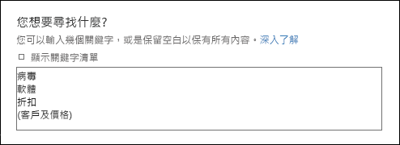
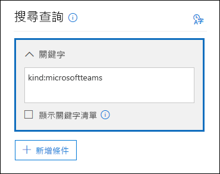

# <a name="content-search-in-office-365"></a>Office 365 中的內容搜尋

您可以使用 Office 365 或 Microsoft 365 合規性中心中的內容搜尋電子文件探索工具，來搜尋 Office 365 組織中的就地項目，例如電子郵件、文件和立即訊息交談。 使用此工具來搜尋這些 Office 365 服務中的項目：
  
- Exchange Online 信箱和公用資料夾
    
- SharePoint Online 網站和商務用 OneDrive 帳戶
    
- 商務用 Skype 交談
    
- Microsoft Teams 
    
- Office 365 群組
    
執行內容搜尋之後，內容位置數目及預估的搜尋結果數目會顯示在搜尋設定檔中。 您也可以快速檢視統計資料，例如多數項目符合搜尋查詢的內容位置。 執行搜尋後，您可以預覽結果或將結果匯出到本機電腦上。

## <a name="create-a-search"></a>建立搜尋

若要有權存取**內容搜尋**頁面以執行搜尋和預覽並匯出搜尋結果，系統管理員、法務人員或電子文件探索管理員必須是安全性與合規性中心中電子文件探索管理員角色群組的成員。 如需詳細資訊，請參閱[指派電子文件探索權限](assign-ediscovery-permissions.md)。
  
1. 移至 [https://protection.office.com](https://protection.office.com) 並使用您的 Office 365 電子郵件地址和密碼登入。
    
2. 按一下 [搜尋]**** \> [內容搜尋]****。
    
3. 在 [搜尋]**** 頁面上，按一下 [ 新增搜尋]**** 旁邊的箭號。 
    
    ![[新增搜尋] 下拉式清單](media/76b25861-55c5-4f50-9d48-9e2be2d0d078.png)
  
    您可以選擇下列其中一個選項：
    
    - **引導式搜尋：** 此選項會啟動精靈，引導您建立搜尋。 用來選取內容位置和建置搜尋查詢的使用者介面與 [新增搜尋]**** 選項完全相同。 
    
    - **新增搜尋：** 此選項會顯示更新的使用者介面以建立搜尋。 如果您按一下 [新增搜尋]****，這會是預設選項。
    
    - **依識別碼清單搜尋：** 此選項可讓您使用 Exchange 識別碼的清單來搜尋特定的電子郵件訊息和其他信箱項目。 若要建立識別碼清單搜尋 (正式名稱為目標搜尋)，您可以提交逗點分隔值 (CSV) 檔案，以識別要搜尋的特定信箱項目。 如需相關指示，請參閱[在 Office 365 中準備識別碼清單內容搜尋的 CSV 檔案](csv-file-for-an-id-list-content-search.md)。
    
    此程序中的其餘步驟會遵循預設的新增搜尋工作流程。
    
4. 在下拉式清單中按一下 [新增搜尋]****。 
    
5. 在 [搜尋查詢]**** 下，指定下列項目：
    
    
  
   - **要搜尋的關鍵字：** 在 [關鍵字]**** 方塊中輸入搜尋查詢。 您可以指定關鍵字、例如傳送和接收日期的郵件屬性，或者例如檔案名稱或文件上次變更的日期的文件屬性。 您可以使用內含布林運算子的更複雜的查詢，例如 **AND**、**OR**、**NOT** 和 **NEAR**。 您也可以搜尋文件中的機密資訊 (如身分證號碼) 或搜尋曾在外部共用的文件。 如果將關鍵字方塊保留空白，則位於指定內容位置的所有內容都會包含在搜尋結果中。
    
      或者，您可以按一下 [顯示關鍵字清單]**** 核取方塊，然後在每一列中輸入關鍵字。 如果您這麼做，每一列的關鍵字會以邏輯運算子 (**c:s**) 連接，其功能與建立的搜尋查詢中的 **OR** 運算子類似。 
    
      為什麼要使用關鍵字清單？ 您可以取得會顯示有多少個項目符合每個關鍵字的統計資料。 這可協助您快速找出哪些關鍵字最有效(和最不有效)。 您也可以在一列中使用關鍵字片語 (以括號括住)。 如需搜尋統計資料的詳細資訊，請參閱[檢視內容搜尋結果的關鍵字統計資料](view-keyword-statistics-for-content-search.md)。

     > [!NOTE]
     > 為了協助降低大量關鍵字清單造成的問題，現在關鍵字清單中最多只能有 20 列。
    
    - **條件：** 您可以新增搜尋條件來縮小搜尋範圍，並傳回更精簡的結果集。 每個條件會將一個子句新增至在啟動搜尋時便會建立並執行的搜尋查詢中。 條件會在邏輯上使用功能上與 **AND** 運算子類似的邏輯運算子 (**c:c**) 與關鍵字查詢連結 (在關鍵字方塊中指定)。 這表示結果中包含的項目必須同時滿足關鍵字查詢與一或多個條件。 這是條件協助縮小搜尋結果的方式。 如需您可以在搜尋查詢中使用的條件清單和描述，請參閱[內容搜尋的關鍵字查詢和搜尋條件](keyword-queries-and-search-conditions.md#search-conditions)中的「搜尋條件」一節。
    
       - **位置：** 選擇要搜尋的內容位置。
    
      - **所有位置：** 使用此選項來搜尋組織中的所有內容位置。 這包括所有 Exchange 信箱 (包括所有非作用中信箱、所有 Office 365 群組的信箱、所有的 Microsoft Teams 信箱) 中的電子郵件、所有商務用 Skype 交談、所有 SharePoint 和商務用 OneDrive 網站 (包括適用於所有 Office 365 群組和 Microsoft Teams 的網站)，以及所有 Exchange 公用資料夾中的項目。
    
      - **特定位置：** 使用此選項來搜尋特定內容位置。 您可以搜尋特定 Office 365 服務的所有內容位置 (例如搜尋所有 Exchange 信箱或搜尋所有 SharePoint 網站)，或者您可以搜尋所顯示的任何 Office 365 服務中的特定位置。 
    
        
  
         您也可以將通訊群組新增到要搜尋的 Exchange 信箱清單。 針對通訊群組，會搜尋群組成員的信箱。 不支援動態通訊群組。
    
       > [!NOTE]
       > 當您搜尋所有信箱位置或只是特定信箱時，匯出內容搜尋的結果時，會包含儲存在使用者信箱、來自其他 Office 365 應用程式的資料。 此資料不會包含在估計的搜尋結果中，並且無法提供預覽。 當您匯出並下載搜尋結果時會包含在內。 如需詳細資訊，請參閱[儲存在 Exchange Online 信箱中的內容](what-is-stored-in-exo-mailbox.md)。

    
6. 設定您的搜尋查詢之後，請按一下 [儲存並執行]****。
    
7. 在 [儲存搜尋]**** 頁面上，輸入搜尋的名稱，以及可協助識別搜尋的選擇性描述。 搜尋的名稱在組織中必須是唯一的。 
    
8. 按一下 [儲存]**** 開始搜尋。 
    
    儲存並執行搜尋之後，搜尋所傳回的任何結果會顯示在結果窗格中。 根據您設定預覽設定的方式，搜尋結果會顯示或者您可以按一下 [預覽結果]**** 來加以檢視。 如需詳細資料，請參閱下一節。 
    
若要再次存取此內容搜尋，或存取 [內容搜尋]**** 頁面上所列的其他內容搜尋，請選取搜尋，然後按一下 [開啟]****。 
  
若要清除結果，或建立另一個搜尋，請按一下 [ 新增搜尋]****。 

  
## <a name="preview-search-results"></a>預覽搜尋結果

預覽搜尋結果有兩個組態設定。 執行新搜尋或開啟現有的搜尋之後，請按一下 **個別結果** 來檢視下列預覽設定： 
  

  
1. **自動預覽結果：** 此設定會在您執行搜尋後顯示搜尋結果。
    
2. **手動預覽結果：** 此設定會在搜尋結果窗格中顯示預留位置，並顯示 [預覽結果]**** 按鈕，您必須按一下該按鈕才能顯示搜尋結果。 這是預設設定。 透過不要在開啟現有搜尋時自動顯示搜尋結果，這有助於增強搜尋效能。 
    
可供預覽的項目數有相關的限制。 如需詳細資訊，請參閱[內容搜尋的限制](limits-for-content-search.md)。 
  
如需可預覽的受支援檔案類型清單，請參閱「有關內容搜尋的詳細資訊」小節中的[預覽搜尋結果](#previewing-search-results)。 如果某個檔案類型不支援預覽，或者若要下載文件的副本，您可以按一下 [下載原始檔案]**** 來將它下載至本機電腦。 針對 .aspx 網頁，將會包含網頁的 URL，不過您可能沒有存取該頁面的權限。 
  
也請注意，未建立索引的項目無法提供預覽。
  
## <a name="view-information-and-statistics-about-a-search"></a>檢視有關搜尋的資訊和統計資料

建立並執行內容搜尋後，您可以檢視估計的搜尋結果的相關統計資料。 這包括搜尋結果的摘要、查詢統計資料，例如具有的項目符合搜尋查詢的內容位置數量，以及具有最符合項目的內容位置名稱。 您可以顯示一或多個內容搜尋的統計資料。 如此可讓您快速比較多個搜尋的結果，並對您的搜尋查詢的有效性進行相關決策。
  
您也可以將搜尋統計資料和關鍵字統計資料下載至 CSV 檔案。 如此可讓您使用 Excel 中的篩選和排序功能來比較結果，並為您的搜尋結果準備報告。
  
若要檢視搜尋統計資料：
  
1. 在 [內容搜尋]**** 頁面上，按一下 [開啟]****，然後按一下您想要檢視其統計資料的搜尋。 
    
2. 在飛出視窗頁面上，按一下 [開啟查詢]****。 
    
3. 在 [個別結果]**** 下拉式清單中，按一下 [搜尋設定檔]****。
    
4. 在 [類型]**** 下拉式清單中，視您想要檢視的搜尋統計資料而定，按一下下列其中一個選項。 
    
  - **摘要：** 針對所搜尋的每個內容位置類型，顯示其統計資料。 這包括包含的項目符合搜尋查詢的內容位置的數量，以及搜尋結果項目的總數量和大小。 這是預設設定。
    
  - **查詢：** 顯示搜尋查詢的相關統計資料。 這包括查詢統計資料所適用的內容位置類型、適用的搜尋查詢統計資料部分 (請注意，**主要**代表整個搜尋查詢)、包含符合搜尋查詢項目的內容位置的數量，以及所找到符合搜尋查詢項目的總數量和大小 (在指定的內容位置中)。 未編製索引項目的統計資料 (也稱為*部分編製索引的項目*) 也會顯示。 不過，統計資料中只會包含來自信箱的部分編製索引的項目。 統計資料中不會包括來自 SharePoint 和 OneDrive 的部分編製索引項目。
    
  - **熱門位置：** 顯示每個內容位置中符合搜尋查詢的項目數量的相關統計資料。 會顯示前 1,000 個位置。
    
如需搜尋統計資料的更詳細資訊，請參閱[檢視內容搜尋結果的關鍵字統計資料](view-keyword-statistics-for-content-search.md)。
  
  
## <a name="export-search-results"></a>匯出搜尋結果

搜尋執行成功之後，您可以將搜尋結果匯出到本機電腦。 當您匯出電子郵件結果時，其會以 PST 檔案或以個別郵件 (.msg files) 形式下載到您的電腦。 從 SharePoint 和 OneDrive 網站匯出內容時，會匯出原生 Office 文件的副本。 匯出的搜尋結果中還有其他文件和報告。 您也可以匯出搜尋結果報告，而非實際的項目。
  
若要匯出搜尋結果：
  
1. 在 [內容搜尋]**** 頁面上，按一下您想要匯出其結果的搜尋。 
    
2. 在飛出視窗頁面上，按一下 [ 其他]****，然後按一下 [匯出結果]****。 您也可以匯出搜尋結果報告。
    
3. 完成 [匯出結果]**** 飛出視窗頁面上的區段。 務必使用捲軸來檢視所有的匯出選項。 
    
如需詳細指示和疑難排解提示，請參閱：
  
- [匯出內容搜尋結果](export-search-results.md)
    
- [匯出內容搜尋報告](export-a-content-search-report.md)
    
  
## <a name="more-information-about-content-search"></a>有關內容搜尋的詳細資訊

如需有關內容搜尋的詳細資訊，請參閱以下小節。
  
[內容搜尋限制](#content-search-limits)
  
[建立搜尋查詢](#building-a-search-query)
  
[搜尋 OneDrive 帳戶](#searching-onedrive-accounts)
  
[搜尋 Microsoft Teams 和 Office 365 群組](#searching-microsoft-teams-and-office-365-groups)
  
[搜尋非作用中信箱](#searching-inactive-mailboxes)
  
[搜尋連線中斷或取消授權的信箱](#searching-disconnected-or-de-licensed-mailboxes)

[預覽搜尋結果](#previewing-search-results)
  
[部分編製索引的項目](#partially-indexed-items)

[在 SharePoint 多地理位置環境中搜尋內容](#searching-for-content-in-a-sharepoint-multi-geo-environment)
  
### <a name="content-search-limits"></a>內容搜尋限制

- 如需內容搜尋功能適用限制的說明，請參閱[內容搜尋的限制](limits-for-content-search.md)。
    
- Microsoft 會收集所有 Office 365 組織執行的內容搜尋的效能資訊。 雖然搜尋查詢的複雜性可能會影響搜尋時間，會影響搜尋所需時間的最大因素是搜尋的信箱數量。 雖然 Microsoft 不對搜尋時間提供服務等級協定，下表根據搜尋中包含的信箱數量列出內容搜尋的平均搜尋時間。
    
|**信箱數目**|**平均搜尋時間**|
|:-----|:-----|
|100  <br/> |30 秒  <br/> |
|1,000  <br/> |45 秒  <br/> |
|10,000  <br/> |4 分鐘  <br/> |
|25,000  <br/> |10 分鐘  <br/> |
|50,000  <br/> |20 分鐘  <br/> |
|100,000  <br/> |25 分鐘  <br/> |
  
### <a name="building-a-search-query"></a>建立搜尋查詢

如需建立搜尋查詢、使用布林搜尋運算子和搜尋條件，以及搜尋與組織外部使用者共用的機密資訊類型和內容的詳細資訊，請參閱[內容搜尋的關鍵字查詢和搜尋條件](keyword-queries-and-search-conditions.md)。
  
使用關鍵字清單建立搜尋查詢時，請記住下列事項。
  
- 您必須選取 [顯示關鍵字清單]**** 核取方塊，然後在不同的列輸入每個關鍵字來建立搜尋查詢，其中每個列的關鍵字 (或關鍵字字詞) 是用 **OR** 運算子連接。 如果您在輸入關鍵字之後，於關鍵字方塊中貼上關鍵字清單或按下 **Enter** 鍵，就不會使用 **OR** 運算子將其連接。 以下是如何新增關鍵字清單的不正確和正確範例。 
    
    **不正確**
    
    
  
    **正確**
    
    
  
- 您也可以在 Excel 檔案或純文字檔案中準備關鍵字或關鍵字片語的清單，然後將您的清單複製並貼入關鍵字清單中。 若要這麼做，您必須選取 [顯示關鍵字清單]**** 核取方塊。 然後在關鍵字清單的第一列按一下，並貼上您的清單。 來自 Excel 或文字檔案的每一行都會貼到關鍵字清單中的不同列。 
    
- 使用關鍵字清單建立查詢之後，最好先驗證搜尋查詢語法，以讓該搜尋查詢成為您想要的查詢。 在詳細資料窗格的 [查詢]**** 下顯示的搜尋查詢中，關鍵字使用文字 **(c:s)** 分隔。 這表示關鍵字是使用與 **OR** 運算子類似功能的邏輯運算子連接。 同樣地，如果您的搜尋查詢中包含條件，關鍵字與條件以文字 **(c:c)** 分隔。 這表示關鍵字是使用與 **AND** 運算子類似功能的邏輯運算子與條件連接。 以下是使用關鍵字清單與條件時產生的搜尋查詢的範例 (顯示在 [詳細資料] 窗格中)。 
    
    
  
- 執行內容搜尋時，Office 365 會自動檢查您的搜尋查詢中是否有不受支援的字元，以及可能未大寫的布林值運算子。 不支援的字元通常會隱藏起來，且通常會導致搜尋錯誤或傳回非預期的結果。 如需所檢查不受支援字元的詳細資訊，請參閱[檢查您的內容搜尋查詢是否有錯誤](check-your-content-search-query-for-errors.md)。
    
- 如果您有包含非英文字元 (例如中文字元) 關鍵字的搜尋查詢時，您可以按一下 [查詢語言-國家/地區]****![內容搜尋中的 [查詢語言-國家/地區] 圖示](media/8d4b60c8-e1f1-40f9-88ae-ee2a7eca0886.png)，然後選取搜尋的語言-國家/地區文化特性代碼值。 預設的語言-國家/地區為中性。 如何判斷您是否需要變更內容搜尋的語言設定？ 如果您確定您要搜尋的內容位置包含非英文字元，但搜尋卻未傳回任何結果，這可能是語言設定所造成。 
  
### <a name="searching-onedrive-accounts"></a>搜尋 OneDrive 帳戶

- 若要收集組織中 OneDrive 網站的 URL 清單，請參閱[建立組織中所有 OneDrive 位置的清單](https://support.office.com/article/8e200cb2-c768-49cb-88ec-53493e8ad80a)。 本文章中的這個指令碼會建立文字檔案，其中包含所有 OneDrive 網站的清單。 若要執行此指令碼，您必須安裝並使用 SharePoint Online 管理命令介面。 請務必將您組織 MySite 網域的 URL 附加至您要搜尋的每個 OneDrive 網站。 這是包含您所有 OneDrive 的網域；例如，`https://contoso-my.sharepoint.com`。 以下是使用者 OneDrive 網站的 URL 範例：`https://contoso-my.sharepoint.com/personal/sarad_contoso_onmicrosoft.com`。
    
    在人員的使用者主體名稱 (UPN) 變更的少數情況下，其 OneDrive 位置的 URL 將會變更以納入新的 UPN。 如果發生這種情況，您必須透過新增使用者的新 OneDrive URL 並移除舊 URL 來修改內容搜尋。
  
### <a name="searching-microsoft-teams-and-office-365-groups"></a>搜尋 Microsoft Teams 和 Office 365 群組

您可以搜尋與 Office 365 群組或 Microsoft Teams 相關聯的信箱。 因為 Office 365 群組上建置於 Microsoft Teams 上，搜尋它們的方式很類似。 在這兩個情況下，只會搜尋群組或團隊信箱。 不會搜尋群組或團隊成員的信箱。 若要進行搜尋，您必須特別將它們新增至搜尋。
  
搜尋 Microsoft Teams 和 Office 365 群組中的內容時，請記住下列事項。
  
- 若要搜尋位於 Teams 和 Office 365 群組中的內容，您必須指定與團隊或群組相關聯的信箱和 SharePoint 網站。
    
- 在 Exchange Online 中執行 **Get-UnifiedGroup** Cmdlet，以檢視團隊或 Office 365 群組的內容。 這是取得與團隊或群組相關聯的網站 URL 的絕佳方法。 例如，下列命令會顯示名為「資深領導團隊」的 Office 365 群組的所選屬性： 
    
  ```
  Get-UnifiedGroup "Senior Leadership Team" | FL DisplayName,Alias,PrimarySmtpAddress,SharePointSiteUrl
  DisplayName            : Senior Leadership Team
  Alias                  : seniorleadershipteam
  PrimarySmtpAddress     : seniorleadershipteam@contoso.onmicrosoft.com
  SharePointSiteUrl      : https://contoso.sharepoint.com/sites/seniorleadershipteam
  
  ```

    > [!NOTE]
    > 若要執行 **Get-UnifiedGroup** Cmdlet，您必須獲指派 Exchange Online 中的「僅檢視收件者」角色或者為獲指派「僅檢視收件者」角色之角色群組的成員。 
  
- 搜尋使用者的信箱時，不會搜尋使用者所隸屬的任何團隊或 Office 365 群組。 同樣地，當您搜尋團隊或 Office 365 群組時，只會搜尋您指定的群組信箱及群組網站。 不會搜尋群組成員的信箱和商務用 OneDrive 帳戶，除非您明確地將它們新增至搜尋。
    
- 若要取得團隊或 Office 365 群組的成員清單，您可以在 Microsoft 365 系統管理中心的 [常用] \> [群組]**** 頁面上檢視內容。 或者，您可以在 Exchange Online PowerShell 中執行下列命令： 
    
  ```
  Get-UnifiedGroupLinks <group or team name> -LinkType Members | FL DisplayName,PrimarySmtpAddress 
  ```

    > [!NOTE]
    > 若要執行 **Get-UnifiedGroupLinks** Cmdlet，您必須獲指派 Exchange Online 中的「僅檢視收件者」角色或者為獲指派「僅檢視收件者」角色之角色群組的成員。 
  
- 屬於 Teams 頻道一部分的交談會儲存在與團隊相關聯的信箱中。 同樣地，團隊成員在頻道中共用的檔案會儲存在團隊的 SharePoint 網站上。 因此，您必須將團隊信箱和 SharePoint 網站新增為內容位置，才能搜尋頻道中的交談和檔案。
    
- 或者，屬於 Teams 中聊天清單的交談會儲存在參與聊天的使用者的 Exchange Online 信箱中。 而使用者在聊天交談中共用的檔案會儲存在共用檔案的使用者的商務用 OneDrive 帳戶中。 因此，您必須將個別使用者信箱和商務用 OneDrive 帳戶新增為內容位置，才能搜尋聊天清單中的交談和檔案。
    
    > [!NOTE]
    > 在 Exchange 混合式部署中，具有內部部署信箱的使用者可能會參與屬於 Teams 中聊天清單的交談。 在此情況下，來自這些交談的內容也可供搜尋，因為針對具有內部部署信箱的使用者，這些內容會儲存到雲端式存放區域 (稱為*內部部署使用者的雲端式信箱*)。 如需詳細資訊，請參閱[在 Office 365 中搜尋內部部署使用者的雲端式信箱](search-cloud-based-mailboxes-for-on-premises-users.md)。
  
- 每個團隊或團隊頻道包含一個 Wiki，用於記筆記和進行共同作業。 Wiki 的內容會自動儲存至 .mht 格式的檔案中。 此檔案會儲存在團隊 SharePoint 網站上的 Teams Wiki 資料文件庫中。 您可以使用「內容搜尋」工具來搜尋 Wiki，方法是將團隊的 SharePoint 網站指定為要搜尋的內容位置。 
    
    > [!NOTE]
    > 搜尋團隊或頻道的 Wiki 功能 (搜尋團隊的 SharePoint 網站時) 是在 2017 年 6 月 22 日推出。 在該日期當日或之後儲存或更新的 Wiki 頁面可供搜尋。 在該日期之前儲存或更新的 Wiki 頁面無法供搜尋。 
 
- Teams 頻道中的會議及電話的摘要資訊也會儲存在撥入會議或電話使用者的信箱中。 這表示您可以使用內容搜尋來搜尋這些摘要記錄。 摘要資訊包含： 
  
  - 會議或通話的日期、開始時間、結束時間和持續期間

  - 每個參與者加入或離開會議或通話的日期及時間

  - 傳送到語音信箱的通話

  - 未接來電或無人接聽的來電

  - 來電轉接，以兩個不同通話的形式呈現

  可能需要最長達 8 小時的時間，會議和通話摘要記錄才可供搜尋。

  在搜尋結果中，會在 [類型]**** 欄位中將會議摘要識別為 [會議]****，以及將通話摘要識別為 [通話]****。 此外，屬於 Teams 頻道和 1xN 聊天的交談，會在 [類型]**** 欄位中識別為 **IM**。
  
  ![Teams 會議、通話和 1xN 聊天都可在 [類型] 欄位中識別](media/O365-ContentSearch-Teams-MessageKind.png)

- 您可以使用 **Kind** 電子郵件屬性或 [郵件類型]**** 搜尋條件來搜尋 Teams 中的專屬內容。 
  
  - 若要在關鍵字搜尋查詢中使用 **Kind** 屬性，請在搜尋查詢的 [關鍵字]**** 方塊中輸入 `kind:microsoftteams`。

    
  
  - 若要使用搜尋條件，請新增 [郵件類型]**** 條件，然後使用 `microsoftteams` 值。 

    

條件會使用 **AND** 運算子以邏輯方式連接至關鍵字查詢。 這表示項目必須同時符合關鍵字查詢和搜尋條件，才能在搜尋結果中傳回。 如需詳細資訊，請參閱[內容搜尋的關鍵字查詢和搜尋條件](keyword-queries-and-search-conditions.md#guidelines-for-using-conditions)中的「使用條件的指導方針」小節。
  
### <a name="searching-inactive-mailboxes"></a>搜尋非作用中信箱

您可以在內容搜尋中搜尋非作用中信箱。 若要取得組織中非作用中信箱的清單，請在 Exchange Online PowerShell 中執行命令 `Get-Mailbox -InactiveMailboxOnly`。 或者，您可以移至安全性與合規性中心中的 [資料控管]**** \> [保留]****，然後按一下 [更多****] \> [非作用中信箱]****。
  
搜尋非作用中信箱時，請注意以下幾點。

- 如果現有內容搜尋包含使用者信箱，且該信箱設定為非作用中，在信箱成為非作用中之後，當您重新執行搜尋時，內容搜尋會繼續搜尋非作用中信箱。
    
- 有時候，使用者的作用中信箱及非作用中信箱可能擁有相同的 SMTP 地址。 在此情況下，僅會搜尋您選取做為內容搜尋位置的特定信箱。 換句話說，如果您將使用者的信箱新增至搜尋，您無法假設會同時搜尋其作用中和非作用中信箱。 只會搜尋您明確地新增至搜尋的信箱。
    
- 您可以使用安全性與合規性中心 PowerShell 來建立內容搜尋，以搜尋非作用中信箱。 若要這麼做，您必須將一個句點 (. ) 附加至非作用中信箱的電子郵件地址前端。 例如，下列命令會建立內容搜尋，搜尋電子郵件地址為 pavelb@contoso.onmicrosoft.com 的非作用中信箱：

   ``` 
   New-ComplianceSearch -name InactiveMailboxSearch -ExchangeLocation .pavelb@contoso.onmicrosoft.com -AllowNotFoundExchangeLocationsEnabled $true
   ```

- 我們強烈建議您避免使用具有相同 SMTP 地址的作用中信箱及非作用中信箱。 如果您需要重複使用已指派給非作用中信箱的 SMTP 地址，建議您復原非作用中信箱，或將非作用中信箱的內容還原為作用中信箱 (或者作用中信箱的封存)，然後刪除非作用中信箱。 如需詳細資訊，請參閱下列其中一個主題：
    
  - [在 Office 365 中復原非作用中的信箱](recover-an-inactive-mailbox.md)
    
  - [在 Office 365 中還原非作用中的信箱](restore-an-inactive-mailbox.md)
    
  - [在 Office 365 中刪除非作用中的信箱](delete-an-inactive-mailbox.md)

### <a name="searching-disconnected-or-de-licensed-mailboxes"></a>搜尋連線中斷或取消授權的信箱

如果您從 Office 365 或 Azure Active Directory 中的使用者帳戶移除 Exchange Online 授權 (或整個 Office 365 授權)，該使用者的信箱就會變成「連線中斷」** 的信箱。 這表示信箱已不再與使用者帳戶相關聯。 搜尋中斷連線的信箱時，會發生以下狀況：

- 如果從信箱移除授權，信箱即不再可供搜尋。 

- 如果現有的內容搜尋包含已移除授權的信箱，如果您重新執行內容搜尋，則不會從已中斷連線的信箱傳回任何搜尋結果。

- 如果您使用 **New-ComplianceSearch** Cmdlet 來建立內容搜尋，並將中斷連線的信箱指定為要搜尋的 Exchange 內容位置，內容搜尋將不會從已中斷連線的信箱傳回任何搜尋結果。

如果您要保留已中斷連線信箱中的資料，使其可供搜尋，您必須在移除授權之前，先在信箱上放置保留。 這麼做會保留資料，並在移除保留之前讓中斷連線的信箱可供搜尋。 如需保留的詳細資訊，請參閱[如何找出位於 Exchange Online 信箱的保留類型](identify-a-hold-on-an-exchange-online-mailbox.md)。

### <a name="previewing-search-results"></a>預覽搜尋結果

您可以在預覽窗格中預覽支援的檔案類型。 如果某個檔案類型不受支援，您必須下載檔案的副本到您的本機電腦以便檢視。 支援下列檔案類型，並且可在搜尋結果窗格中預覽。
  
- .txt、.html、.mhtml
    
- .eml
    
- .doc、.docx、.docm
    
- .pptm、.pptx
    
- .pdf
    
還支援下列檔案容器類型。 您可以在預覽窗格的容器中檢視檔案的清單。
  
- .zip
    
- .gzip
    
### <a name="partially-indexed-items"></a>部分編製索引的項目

- 如先前所解說，估計的搜尋結果中會包含信箱中部分編製索引的項目。 估計的搜尋結果中不會包括來自 SharePoint 和 OneDrive 的部分編製索引項目。 
    
- 若部分編製索引的項目符合搜尋查詢 (因為其他郵件或文件屬性符合搜尋準則)，則不會將它包含在未編製索引項目的估計數量中。 若搜尋準則排除了部分編製索引的項目，則不會將它包含在未編製索引項目的估計數量中。 如需詳細資訊，請參閱 [Office 365 的內容搜尋中部分編製索引的項目](partially-indexed-items-in-content-search.md) (機器翻譯)。

### <a name="searching-for-content-in-a-sharepoint-multi-geo-environment"></a>在 SharePoint 多地理位置環境中搜尋內容

如果電子文件探索管理員需要在 [SharePoint 多地理位置環境](https://go.microsoft.com/fwlink/?linkid=860840)中的不同區域中搜尋 SharePoint 和 OneDrive 中的內容，則需要執行以下操作才能進行：
   
1. 為電子文件探索管理員需要搜尋的每個衛星地理位置建立個別的使用者帳戶。 若要在該地理位置中的網站搜尋內容，電子文件探索管理員必須登入您為該位置建立的帳戶，然後再執行內容搜尋。

2. 為電子文件探索管理員需要搜尋的每個衛星地理位置 (以及相應的使用者帳戶) 建立搜尋權限篩選條件。 當電子文件探索管理員登入與該位置關聯的使用者帳戶時，每一個搜尋權限篩選條件都會將內容搜尋的範圍限制為特定的地理位置。
 
> [!TIP]
> 在 [進階電子文件探索][](compliance20/overview-ediscovery-20.md) 中使用搜尋工具時，您不必使用此策略。 這是因為在進階電子文件探索中搜尋 SharePoint 網站和OneDrive 帳戶時，會搜尋所有資料中心。 只有在使用內容搜尋工具並執行與[電子文件探索案例](ediscovery-cases.md)相關聯的搜尋時，才必須使用這個特定區域使用者帳戶和搜尋權限篩選器的策略。 


例如，假設電子文件探索管理員需要在芝加哥、倫敦和東京的衛星位置搜尋 SharePoint 和 OneDrive 內容。 第一個步驟是建立三個使用者帳戶，每個位置一個。 下一步是建立三個搜尋權限篩選條件，每個位置及相應的使用者帳戶一個。 以下是此案例的三個搜尋權限篩選條件的範例。 在每個範例中，[區域]**** 指定該地理位置的 SharePoint 資料中心位置，[使用者]**** 參數指定相應的使用者帳戶。 

**北美**
```
New-ComplianceSecurityFilter -FilterName "SPMultiGeo-Chicago" -Users ediscovery-chicago@contoso.com -Region NAM -Action ALL
```

**歐洲**
```
New-ComplianceSecurityFilter -FilterName "SPMultiGeo-London" -Users ediscovery-london@contoso.com -Region GBR -Action ALL
```

**亞太地區**
```
New-ComplianceSecurityFilter -FilterName "SPMultiGeo-Toyko" -Users ediscovery-tokyo@contoso.com -Region JPN -Action ALL
```

使用搜尋權限篩選條件在多地理位置環境中搜尋內容時，請記住以下事項：

- [地區]**** 參數會指示搜尋特定的衛星位置。 如果電子文件探索管理員只搜尋搜尋權限篩選器指定之區域以外的 SharePoint 和 OneDrive 網站，則不會傳回搜尋結果。 

- [地區]**** 參數不會控制 Exchange 信箱的搜尋。 搜尋信箱時，也會搜尋所有資料中心。 
    
如需在多地理位置環境中使用搜尋權限篩選條件的詳細資訊，請參閱[設定 Office 365 中電子文件探索調查的合規性界限](set-up-compliance-boundaries.md#searching-and-exporting-content-in-multi-geo-environments)中的「搜尋和匯出在多地理位置環境中的內容」(機器翻譯) 這一節。
