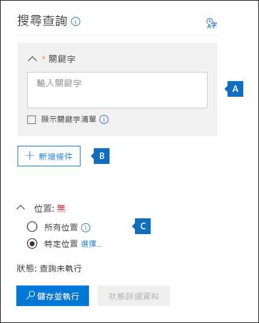
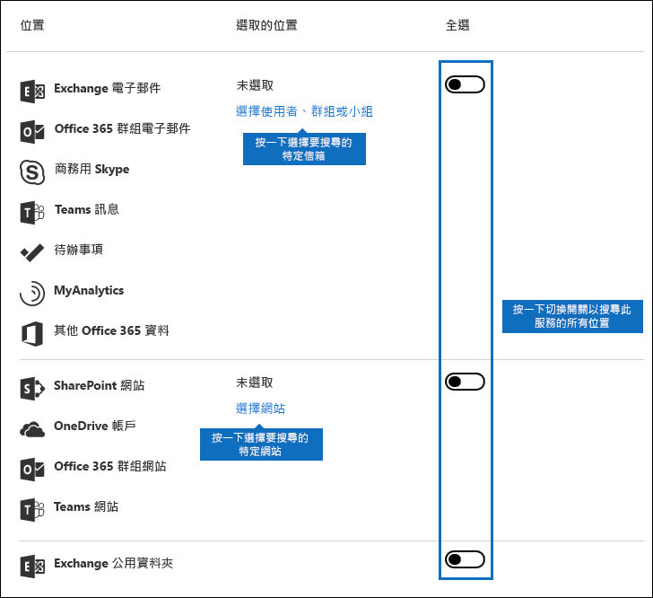
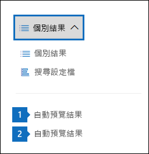
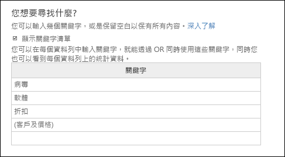
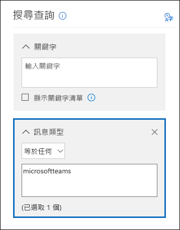

# <a name="content-search-in-office-365"></a><span data-ttu-id="285a9-106">Office 365 中的內容搜尋</span><span class="sxs-lookup"><span data-stu-id="285a9-106">Content Search in Office 365</span></span>

<span data-ttu-id="285a9-p102">您可以使用 「 內容搜尋 eDiscovery 工具在 Office 365 安全性&amp;規範中心來搜尋就地等電子郵件、 文件和立即訊息交談 Office 365 組織中的項目。使用此工具來搜尋這些 Office 365 服務中的項目：</span><span class="sxs-lookup"><span data-stu-id="285a9-p102">You can use the Content Search eDiscovery tool in the Office 365 Security &amp; Compliance Center to search for in-place items such as email, documents, and instant messaging conversations in your Office 365 organization. Use this tool to search for items in these Office 365 services:</span></span>
  
- <span data-ttu-id="285a9-109">Exchange Online 信箱及公用資料夾</span><span class="sxs-lookup"><span data-stu-id="285a9-109">Exchange Online mailboxes and public folders</span></span>
    
- <span data-ttu-id="285a9-110">SharePoint Online 網站和 OneDrive for Business 的帳戶</span><span class="sxs-lookup"><span data-stu-id="285a9-110">SharePoint Online sites and OneDrive for Business accounts</span></span>
    
- <span data-ttu-id="285a9-111">Skype 商務交談</span><span class="sxs-lookup"><span data-stu-id="285a9-111">Skype for Business conversations</span></span>
    
- <span data-ttu-id="285a9-112">Microsoft Teams</span><span class="sxs-lookup"><span data-stu-id="285a9-112">Microsoft Teams</span></span> 
    
- <span data-ttu-id="285a9-113">Office 365 群組</span><span class="sxs-lookup"><span data-stu-id="285a9-113">Office 365 Groups</span></span>
    
<span data-ttu-id="285a9-p103">之後執行內容搜尋] 的內容位置數目，並搜尋設定檔中顯示預估的搜尋結果數目。您可以也快速檢視統計資料，例如有最多個項目符合搜尋查詢的內容位置。執行搜尋之後，您可以預覽結果或將它們匯出到本機電腦。</span><span class="sxs-lookup"><span data-stu-id="285a9-p103">After you run a Content Search, the number of content locations and an estimated number of search results are displayed in the search profile. You can also quickly view statistics, such as the content locations that have the most items that match the search query. After you run a search, you can preview the results or export them to a local computer.</span></span>


## <a name="create-a-new-search"></a><span data-ttu-id="285a9-117">建立新的搜尋</span><span class="sxs-lookup"><span data-stu-id="285a9-117">Create a new search</span></span>

<span data-ttu-id="285a9-p104">若要讓**內容搜尋**] 頁面上執行的搜尋及預覽，並將搜尋結果匯出至 access，系統管理員、 法務或 eDiscovery 管理員必須是安全性 eDiscovery 管理員角色群組的成員&amp;規範中心。如需詳細資訊，請參閱[指派 Office 365 安全性 eDiscovery 權限&amp;規範中心](assign-ediscovery-permissions.md)。</span><span class="sxs-lookup"><span data-stu-id="285a9-p104">To have access to the **Content search** page to run searches and preview and export search results, an administrator, compliance officer, or eDiscovery manager must be a member of the eDiscovery Manager role group in the Security &amp; Compliance Center. For more information, see [Assign eDiscovery permissions in the Office‍ 365 Security &amp; Compliance Center](assign-ediscovery-permissions.md).</span></span>
  
1. <span data-ttu-id="285a9-120">請移至 [https://protection.office.com](https://protection.office.com)。</span><span class="sxs-lookup"><span data-stu-id="285a9-120">Go to [https://protection.office.com](https://protection.office.com).</span></span>
    
2. <span data-ttu-id="285a9-121">使用您的 Office 365 電子郵件地址和密碼登入。</span><span class="sxs-lookup"><span data-stu-id="285a9-121">Sign in using your Office 365 email address and password.</span></span> 
    
3. <span data-ttu-id="285a9-122">安全性&amp;規範中心，按一下 [**搜尋&amp;調查** \> **內容搜尋**。</span><span class="sxs-lookup"><span data-stu-id="285a9-122">In the Security &amp; Compliance Center, click **Search &amp; investigation** \> **Content search**.</span></span>
    
4. <span data-ttu-id="285a9-123">在 [**搜尋**] 頁面上按一下箭號旁**新的搜尋**。</span><span class="sxs-lookup"><span data-stu-id="285a9-123">On the **Search** page, click the arrow next to  **New search**.</span></span> 
    
    ![新的 [搜尋] 下拉式清單](media/76b25861-55c5-4f50-9d48-9e2be2d0d078.png)
  
    <span data-ttu-id="285a9-125">您可以選擇下列其中一個選項：</span><span class="sxs-lookup"><span data-stu-id="285a9-125">You can choose one of the following options:</span></span>
    
  - <span data-ttu-id="285a9-p105">**「 引導式搜尋**此選項啟動引導您完成建立搜尋] 精靈。選取的內容位置並建立搜尋查詢的使用者介面是**新的搜尋**選項相同。</span><span class="sxs-lookup"><span data-stu-id="285a9-p105">**Guided search** - This option starts a wizard that guides you through the creating the search. The user interface to select content locations and build the search query are the same as the **New search** option.</span></span> 
    
  - <span data-ttu-id="285a9-p106">**新的搜尋**此選項會顯示已更新的使用者介面來建立新的搜尋。如果您按一下 [**新增搜尋**，這是預設選項。</span><span class="sxs-lookup"><span data-stu-id="285a9-p106">**New search** - This option displays an updated user interface to create a new search. This is the default option if you click **New search**.</span></span>
    
  - <span data-ttu-id="285a9-p107">**識別碼清單來搜尋**此選項可讓您搜尋特定的電子郵件訊息及使用 Exchange 識別碼清單其他信箱項目。若要建立 （正式稱為 「 目標的搜尋 」） 的識別碼清單搜尋，您提交識別特定信箱的項目要搜尋的逗號分隔的值 (CSV) 檔案。指示，請參閱[Prepare 識別碼清單內容搜尋 Office 365 中的 CSV 檔案](csv-file-for-an-id-list-content-search.md)。</span><span class="sxs-lookup"><span data-stu-id="285a9-p107">**Search by ID List** - This option lets you search for specific email messages and other mailbox items using a list of Exchange IDs. To create an ID list search (formally called a targeted search), you submit a comma separated value (CSV) file that identifies the specific mailbox items to search for. For instructions, see [Prepare a CSV file for an ID list Content Search in Office 365](csv-file-for-an-id-list-content-search.md).</span></span>
    
    <span data-ttu-id="285a9-133">在此程序的步驟的其餘部分將會遵循預設新的搜尋工作流程。</span><span class="sxs-lookup"><span data-stu-id="285a9-133">The remainder of the steps in this procedure will follow the default new search workflow.</span></span>
    
5. <span data-ttu-id="285a9-134">下拉式清單中的 [**新的搜尋**。</span><span class="sxs-lookup"><span data-stu-id="285a9-134">Click **New search** in the drop-down list.</span></span> 
    
6. <span data-ttu-id="285a9-135">在 [**搜尋查詢**時，指定下列項目。</span><span class="sxs-lookup"><span data-stu-id="285a9-135">Under **Search query**, specify the following things.</span></span>
    
    
  
- <span data-ttu-id="285a9-p108">**要搜尋的關鍵字**-搜尋查詢**關鍵字**] 方塊中的類型。您可以指定關鍵字，訊息屬性例如傳送及接收日期或文件內容，例如檔案名稱或上次變更文件的日期。您可以使用較複雜的查詢使用布林運算子，例如**AND**、**或**、**不**及**NEAR**。您也可以搜尋文件或搜尋功能已從外部共用的文件中的機密資訊 （例如社會安全編號）。如果 [關鍵字] 方塊中保留空白，將會在搜尋結果中包含位於指定之內容的位置中的所有內容。</span><span class="sxs-lookup"><span data-stu-id="285a9-p108">**Keywords to search for** - Type a search query in **Keywords** box. You can specify keywords, message properties such as sent and received dates, or document properties such as file names or the date that a document was last changed. You can use a more complex queries that use a Boolean operator, such as **AND**, **OR**, **NOT**, and **NEAR**. You can also search for sensitive information (such as social security numbers) in documents, or search for documents that have been shared externally. If you leave the keyword box empty, all content located in the specified content locations will be included in the search results.</span></span>
    
    <span data-ttu-id="285a9-p109">或者，您可以按一下 [**顯示關鍵字清單**] 核取方塊和類型中的每一列的關鍵字。如果您這樣做，在每一列的關鍵字連接的作用與**OR**運算子會建立搜尋查詢中相似的邏輯運算子 ( **c:s**) 所連接。</span><span class="sxs-lookup"><span data-stu-id="285a9-p109">Alternatively, you can click the **Show keyword list** checkbox and the type a keyword in each row. If you do this, the keywords on each row are connected by a logical operator ( **c:s**) that is similar in functionality to the **OR** operator in the search query that's created.</span></span> 
    
    <span data-ttu-id="285a9-p110">為什麼要選擇使用 [關鍵字] 清單？您可以取得顯示多少個項目比對每個關鍵字的統計資料。這可協助您快速識別出哪些關鍵字是最 （且至少） 有效。您也可以使用 （以括弧括住） 的關鍵字文句] 列中。如需搜尋統計資料的詳細資訊，請參閱 ＜[檢視內容的搜尋結果的關鍵字統計資料](view-keyword-statistics-for-content-search.md)。</span><span class="sxs-lookup"><span data-stu-id="285a9-p110">Why use the keyword list? You can get statistics that show how many items match each keyword. This can help you quickly identify which keywords are the most (and least) effective. You can also use a keyword phrase (surrounded by parentheses) in a row. For more information about search statistics, see [View keyword statistics for Content Search results](view-keyword-statistics-for-content-search.md).</span></span>

    [!NOTE] <span data-ttu-id="285a9-149">若要協助減少大型關鍵字清單所導致的問題，現在是限制最大值為 20 列在 [關鍵字] 清單中。</span><span class="sxs-lookup"><span data-stu-id="285a9-149">To help reduce issues caused by large keyword lists, you're now limited to a maximum of 20 rows in the keyword list.</span></span>
    
- <span data-ttu-id="285a9-p111">**條件**-您可以新增要將搜尋縮小並傳回結果集更精簡的搜尋條件。每個條件將子句新增至搜尋查詢，建立及執行當您啟動搜尋。條件是以邏輯方式連線到 （在 [關鍵字] 方塊中指定） 的關鍵字查詢類似的作用**和**運算子的邏輯運算子 （**列**）。這表示項目必須滿足的關鍵字查詢與結果中包含的一或多個條件。這是條件，縮減結果協助的方式。清單和說明您可以在搜尋查詢中使用的條件，請參閱 「 搜尋條件 」 一節[關鍵字查詢和搜尋條件的內容搜尋](keyword-queries-and-search-conditions.md#search-conditions)。</span><span class="sxs-lookup"><span data-stu-id="285a9-p111">**Conditions** - You can add search conditions to narrow a search and return a more refined set of results. Each condition adds a clause to the search query that is created and run when you start the search. A condition is logically connected to the keyword query (specified in the keyword box) by a logical operator ( **c:c**) that is similar in functionality to the **AND** operator. That means that items have to satisfy both the keyword query and one or more conditions to be included in the results. This is how conditions help to narrow your results. For a list and description of conditions that you can use in a search query, see the "Search conditions" section in [Keyword queries and search conditions for Content Search](keyword-queries-and-search-conditions.md#search-conditions).</span></span>
    
- <span data-ttu-id="285a9-156">**位置**-選擇要搜尋的內容位置。</span><span class="sxs-lookup"><span data-stu-id="285a9-156">**Locations** - Choose the content locations to search.</span></span>
    
  - <span data-ttu-id="285a9-p112">**所有位置**-使用此選項可在組織中搜尋所有內容的位置。這包括電子郵件 （包括所有非使用中信箱、 Office 365 的所有群組的信箱、 信箱的所有的 Microsoft 小組） 的所有 Exchange 信箱中的商務交談，所有 SharePoint 和 OneDrive for Business 網站 （包括網站的所有 Skype為所有 Office 365 群組和 Microsoft 小組），並在所有 Exchange 公用資料夾中的項目。</span><span class="sxs-lookup"><span data-stu-id="285a9-p112">**All locations** - Use this option to search all content locations in your organization. This includes email in all Exchange mailboxes (including all inactive mailboxes, mailboxes for all Office 365 Groups, mailboxes for all Microsoft Teams), all Skype for Business conversations, all SharePoint and OneDrive for Business sites (including the sites for all Office 365 Groups and Microsoft Teams), and items in all Exchange public folders.</span></span>
    
  - <span data-ttu-id="285a9-p113">**特定位置**-使用此選項，以搜尋特定內容的位置。您可以搜尋特定 Office 365 服務的所有內容的位置 （例如搜尋所有 Exchange 信箱或搜尋所有 SharePoint 網站） 或您可以在任何顯示 Office 365 服務都搜尋特定的位置。</span><span class="sxs-lookup"><span data-stu-id="285a9-p113">**Specific locations** - Use this option to search specific content locations. You can search all content locations for a specific Office 365 service (such as searching all Exchange mailboxes or search all SharePoint sites) or you can search specific locations in any of the Office 365 services that are displayed.</span></span> 
    
    
  
    <span data-ttu-id="285a9-p114">請注意您也可以新增通訊群組來搜尋 Exchange 信箱的清單。通訊群組、 要搜尋的群組成員的信箱。請注意動態通訊群組不受支援。</span><span class="sxs-lookup"><span data-stu-id="285a9-p114">Note that you can also add distribution groups to the list of Exchange mailboxes to search. For distribution groups, the mailboxes of group members are searched. Note that dynamic distribution groups aren't supported.</span></span>
    
    <span data-ttu-id="285a9-p115">**重要：** 當您搜尋所有信箱位置或只是特定的信箱時，請從 MyAnalytics 和其他 Office 365 應用程式已儲存至使用者信箱的資料會包含匯出內容的都搜尋結果時。此資料不會包含在預估的搜尋結果，不適用於預覽。它只會包含當您匯出並下載搜尋結果;請參閱[MyAnalytics 匯出資料與其他 Office 365 應用程式](#exporting-data-from-myanalytics-and-other-office-365-applications)」 內容搜尋相關的詳細資訊 」 區段中。</span><span class="sxs-lookup"><span data-stu-id="285a9-p115">**Important:** When you search all mailbox locations or just specific mailboxes, data from MyAnalytics and other Office 365 applications that's saved to user mailboxes will be included when you export the results of a Content Search. This data will not be included in the estimated search results and it won't be available for preview. It will only be included when you export and download the search results; see [Exporting data from MyAnalytics and other Office 365 applications](#exporting-data-from-myanalytics-and-other-office-365-applications) in the "More information about content search" section.</span></span> 
    
7. <span data-ttu-id="285a9-168">您是否已設定您的搜尋查詢之後，按一下 [**儲存&amp;執行**。</span><span class="sxs-lookup"><span data-stu-id="285a9-168">After you've set up your search query, click **Save &amp; run**.</span></span>
    
8. <span data-ttu-id="285a9-p116">**儲存搜尋**] 頁面上輸入搜尋，並選擇性描述，有助於找出搜尋的名稱。請注意搜尋的名稱是您組織中唯一的。</span><span class="sxs-lookup"><span data-stu-id="285a9-p116">On the **Save search** page, type a name for the search, and an optional description that helps identify the search. Note that the name of the search has to be unique in your organization.</span></span> 
    
9. <span data-ttu-id="285a9-171">按一下 [**儲存**] 以啟動搜尋。</span><span class="sxs-lookup"><span data-stu-id="285a9-171">Click **Save** to start the search.</span></span> 
    
    <span data-ttu-id="285a9-p117">儲存並執行搜尋之後，在 [結果] 窗格中顯示搜尋傳回任何結果。根據方式有設定 [預覽] 設定，在搜尋結果會顯示或您已按一下 [檢視其**預覽結果**。請參閱 [下一步] 區段中的詳細資訊。</span><span class="sxs-lookup"><span data-stu-id="285a9-p117">After you save and run the search, any results returned by the search are displayed in the results pane. Depending on how you have the preview setting configured, the search results are display or you have to click **Preview results** to view them. See the next section for details.</span></span> 
    
<span data-ttu-id="285a9-175">若要重新存取此內容的搜尋或存取其他內容的搜尋列在 [**內容搜尋**] 頁面上，選取搜尋] 和 [**開啟**。</span><span class="sxs-lookup"><span data-stu-id="285a9-175">To access this content search again or access other content searches listed on the **Content search** page, select the search and then click **Open**.</span></span> 
  
<span data-ttu-id="285a9-176">若要清除結果或建立新的搜尋，請按一下 [**新的搜尋**。</span><span class="sxs-lookup"><span data-stu-id="285a9-176">To clear the results or create a new search, click  **New search**.</span></span> 

  
## <a name="preview-search-results"></a><span data-ttu-id="285a9-177">預覽搜尋結果</span><span class="sxs-lookup"><span data-stu-id="285a9-177">Preview search results</span></span>

<span data-ttu-id="285a9-p118">來預覽搜尋結果有兩種組態設定。在執行新的新搜尋或開啟現有的搜尋之後，按一下 [\* \* 個別結果 \* \* 以檢視下列預覽設定：</span><span class="sxs-lookup"><span data-stu-id="285a9-p118">There are two configuration settings for previewing search results. After you run a new a new search or open an existing search, click \*\* Individual results \*\* to view the following preview settings:</span></span> 
  

  
1. <span data-ttu-id="285a9-181">**自動預覽結果**-此設定會顯示在搜尋結果之後執行搜尋。</span><span class="sxs-lookup"><span data-stu-id="285a9-181">**Preview results automatically** - This setting displays the search results after you a run a search.</span></span>
    
2. <span data-ttu-id="285a9-p119">**手動預覽結果**-此設定會預留位置顯示在搜尋結果] 窗格中，並會顯示您必須按一下 [顯示搜尋結果的**預覽結果**] 按鈕。這是預設的設定 ；它可協助您開啟現有的搜尋時不會自動顯示搜尋結果，以提升搜尋效能。</span><span class="sxs-lookup"><span data-stu-id="285a9-p119">**Preview results manually** - This setting displays placeholders in the search results pane, and displays the **Preview results** button that you have to click to display the search results. This is the default setting; it helps enhance search performance by not automatically displaying the search results when you open an existing search.</span></span> 
    
<span data-ttu-id="285a9-p120">有多少個項目可用來預覽與相關的限制。如需詳細資訊，請參閱[Limits for Search in Office 365 安全性&amp;規範中心](limits-for-content-search.md)。</span><span class="sxs-lookup"><span data-stu-id="285a9-p120">There are limits related to how many items are available to be previewed. For more information, see [Limits for Search in the Office 365 Security &amp; Compliance Center](limits-for-content-search.md).</span></span> 
  
<span data-ttu-id="285a9-p121">如要預覽的支援的檔案類型清單，請參閱 「 內容搜尋的相關的詳細資訊 」 區段中的 [ [Previewing 搜尋結果](#previewing-search-results)。如果檔案類型不支援的預覽或下載文件的複本，您可以按一下 [**下載 [原始檔案**下載至您的本機電腦。針對.aspx 網頁，包含頁面的 URL 則但是您可能無法存取] 頁面上的權限。</span><span class="sxs-lookup"><span data-stu-id="285a9-p121">For a list of supported file types that can be previewed, see [Previewing search results](#previewing-search-results) in the "More information about content search" section. If a file type isn't supported for preview or to download a copy of a document, you can click **Download original file** to download it to your local computer. For .aspx Web pages, the URL for the page is included though you might not have permissions to access the page.</span></span> 
  
<span data-ttu-id="285a9-189">也請注意編製索引的項目不適用於預覽。</span><span class="sxs-lookup"><span data-stu-id="285a9-189">Also note that unindexed items aren't available for previewing.</span></span>
  
## <a name="view-information-and-statistics-about-a-search"></a><span data-ttu-id="285a9-190">檢視資訊與搜尋相關的統計資料</span><span class="sxs-lookup"><span data-stu-id="285a9-190">View information and statistics about a search</span></span>

<span data-ttu-id="285a9-p122">建立並執行內容的搜尋後，您可以檢視有關預估的搜尋結果的統計資料。這包括的搜尋結果，例如內容的位置與符合搜尋查詢的項目數目及內容的位置具有最符合的項目名稱的查詢統計資料摘要。您可以顯示一或多個內容搜尋統計的資料。這可讓您快速比較的多個搜尋結果，並進行搜尋查詢的效益的相關決策。</span><span class="sxs-lookup"><span data-stu-id="285a9-p122">After you create and run a content search, you can view statistics about the estimated search results. This includes a summary of the search results, the query statistics such as the number of content locations with items that match the search query, and the name of content locations that have the most matching items. You can display statistics for one or more content searches. This lets you to quickly compare the results for multiple searches and make decisions about the effectiveness of your search queries.</span></span>
  
<span data-ttu-id="285a9-p123">您也可以下載到 CSV 檔案的搜尋統計資料和關鍵字統計資料。這可讓您在 Excel 中使用的篩選和排序的功能比較結果，並準備您的搜尋結果中的報告。</span><span class="sxs-lookup"><span data-stu-id="285a9-p123">You can also download the search statistics and keyword statistics to a CSV file. This lets you use the filtering and sorting features in Excel to compare results, and prepare reports for your search results.</span></span>
  
<span data-ttu-id="285a9-197">若要檢視搜尋統計資料：</span><span class="sxs-lookup"><span data-stu-id="285a9-197">To view search statistics:</span></span>
  
1. <span data-ttu-id="285a9-198">在 [安全性]**內容搜尋**] 頁面上&amp;規範中心，按一下 [**開啟**] 和 [您要檢視的統計資料的搜尋。</span><span class="sxs-lookup"><span data-stu-id="285a9-198">On the **Content search** page in the Security &amp; Compliance Center, click **Open** and then click the search that you want to view the statistic for.</span></span> 
    
2. <span data-ttu-id="285a9-199">在飛入] 頁面上，按一下 [**開啟查詢**]。</span><span class="sxs-lookup"><span data-stu-id="285a9-199">On the fly out page, click **Open query**.</span></span> 
    
3. <span data-ttu-id="285a9-200">在**個別的結果**] 下拉式清單中，按一下 [**搜尋設定檔**。</span><span class="sxs-lookup"><span data-stu-id="285a9-200">In the **Individual results** drop down list, click **Search profile**.</span></span>
    
4. <span data-ttu-id="285a9-201">在 [**類型**] 下拉式清單中，按一下其中一個下列選項根據您要檢視的搜尋統計資料。</span><span class="sxs-lookup"><span data-stu-id="285a9-201">In the **Type** drop down list, click one of the following options depending on the search statistics you want to view.</span></span> 
    
  - <span data-ttu-id="285a9-p124">搜尋**摘要**會顯示每種類型的內容位置的統計資料。此內容的內容位置包含符合搜尋查詢的項目數目及總計的數目與大小搜尋結果項目。這是預設設定。</span><span class="sxs-lookup"><span data-stu-id="285a9-p124">**Summary** - Displays statistics for each type of content locations searched. This contents the number of content locations that contained items that matched the search query, and the total number and size of search result items. This is the default setting.</span></span>
    
  - <span data-ttu-id="285a9-p125">**查詢**-顯示搜尋查詢的相關的統計資料。這包含的內容位置查詢統計資料適用於類型、 搜尋查詢的統計資料的組件所適用 （注意**主要**指出整個搜尋查詢），包含的內容位置的項目數找出符合搜尋查詢，總數和大小及項目 （在指定的內容位置） 所找到的比對搜尋查詢。請注意編製索引的項目 （也稱為部分已編製索引的項目） 的統計資料也會顯示。不過，只有部分已編製索引的項目從信箱中隨附的統計資料。從 SharePoint 和 OneDrive 部分已編製索引項目並不包含統計資料。</span><span class="sxs-lookup"><span data-stu-id="285a9-p125">**Queries** - Displays statistics about the search query. This includes the type of content location the query statistics are applicable to, part of the search query the statistics are applicable to (note that **Primary** indicates the entire search query), the number of the content locations that contain items that match the search query, and the total number and size and items that were found (in the specified content location) that match the search query. Note that statistics for unindexed items (also called partially indexed items) are also displayed. However, only partially indexed items from mailboxes are included in the statistics. Partially indexed items from SharePoint and OneDrive are not included in the statistics.</span></span>
    
  - <span data-ttu-id="285a9-p126">**上方的位置**-顯示統計資料相關的符合搜尋查詢中每個所搜尋的內容位置的項目數。會顯示前 1000 個位置。</span><span class="sxs-lookup"><span data-stu-id="285a9-p126">**Top locations** - Displays statistics about the number of items that match the search query in each content location that was searched. The top 1,000 locations are displayed.</span></span>
    
<span data-ttu-id="285a9-212">如需搜尋統計資料的詳細資訊，請參閱[檢視內容的搜尋結果的關鍵字統計資料](view-keyword-statistics-for-content-search.md)。</span><span class="sxs-lookup"><span data-stu-id="285a9-212">For more detailed information about search statistics, see [View keyword statistics for Content Search results](view-keyword-statistics-for-content-search.md).</span></span>
  
  
## <a name="export-search-results"></a><span data-ttu-id="285a9-213">匯出搜尋結果</span><span class="sxs-lookup"><span data-stu-id="285a9-213">Export search results</span></span>

<span data-ttu-id="285a9-p127">成功執行搜尋之後，您可以將搜尋結果匯出到本機電腦。當您將電子郵件結果匯出時，他們可以下載到您的電腦為 PST 檔案或個別郵件 （.msg 檔）。當您從 SharePoint 和 OneDrive 網站匯出內容時，都要匯出的原生 Office 文件複本。也有其他文件和隨附匯出的搜尋結果的報告。您也只可以匯出搜尋結果報表並不實際的項目。</span><span class="sxs-lookup"><span data-stu-id="285a9-p127">After a search is successfully run, you can export the search results to a local computer. When you export email results, they can be downloaded to your computer as PST files or as individual messages (.msg files). When you export content from SharePoint and OneDrive sites, copies of native Office documents are exported. There are also additional documents and reports that are included with the exported search results. You can also just export the search results report and not the actual items.</span></span>
  
<span data-ttu-id="285a9-219">若要匯出搜尋結果：</span><span class="sxs-lookup"><span data-stu-id="285a9-219">To export search results:</span></span>
  
1. <span data-ttu-id="285a9-220">在 [安全性]**內容搜尋**] 頁面上&amp;規範中心，按一下 [**開啟**] 和 [您想要匯出的搜尋結果的搜尋。</span><span class="sxs-lookup"><span data-stu-id="285a9-220">On the **Content search** page in the Security &amp; Compliance Center, click **Open** and then click the search that you want to export the search results for.</span></span> 
    
2. <span data-ttu-id="285a9-p128">在飛入] 頁面上，按一下 [**多個**，然後按一下 [**匯出結果**。請注意您也可以匯出搜尋結果報表。</span><span class="sxs-lookup"><span data-stu-id="285a9-p128">On the fly out page, click  **More**, and then click **Export results**. Note that you can also export a search results report.</span></span>
    
3. <span data-ttu-id="285a9-p129">完成 [匯出結果]\*\*\*\* 彈出式頁面上的區段。請務必使用捲軸，以檢視所有匯出選項。</span><span class="sxs-lookup"><span data-stu-id="285a9-p129">Complete the sections on the **Export results** fly out page. Be sure to use the scroll bar to view all export options.</span></span> 
    
<span data-ttu-id="285a9-225">如需更詳細的指示和疑難排解秘訣，請參閱：</span><span class="sxs-lookup"><span data-stu-id="285a9-225">For more detailed instructions and troubleshooting tips, see:</span></span>
  
- [<span data-ttu-id="285a9-226">從 Office 365 安全性匯出搜尋結果&amp;規範中心</span><span class="sxs-lookup"><span data-stu-id="285a9-226">Export search results from the Office 365 Security &amp; Compliance Center</span></span>](export-search-results.md)
    
- [<span data-ttu-id="285a9-227">匯出內容搜尋報告</span><span class="sxs-lookup"><span data-stu-id="285a9-227">Export a Content Search report</span></span>](export-a-content-search-report.md)
    

  
## <a name="more-information-about-content-search"></a><span data-ttu-id="285a9-228">內容搜尋的詳細資訊</span><span class="sxs-lookup"><span data-stu-id="285a9-228">More information about content search</span></span>

<span data-ttu-id="285a9-229">請參閱下列各節的內容搜尋的詳細資訊。</span><span class="sxs-lookup"><span data-stu-id="285a9-229">See the following sections for more information about content searches.</span></span>
  
[<span data-ttu-id="285a9-230">內容的搜尋限制</span><span class="sxs-lookup"><span data-stu-id="285a9-230">Content search limits</span></span>](#content-search-limits)
  
[<span data-ttu-id="285a9-231">建立搜尋查詢</span><span class="sxs-lookup"><span data-stu-id="285a9-231">Building a search query</span></span>](#building-a-search-query)
  
[<span data-ttu-id="285a9-232">搜尋 OneDrive 帳戶</span><span class="sxs-lookup"><span data-stu-id="285a9-232">Searching OneDrive accounts</span></span>](#searching-onedrive-accounts)
  
[<span data-ttu-id="285a9-233">搜尋的 Microsoft 小組和 Office 365 群組</span><span class="sxs-lookup"><span data-stu-id="285a9-233">Searching Microsoft Teams and Office 365 Groups</span></span>](#searching-microsoft-teams-and-office-365-groups)
  
[<span data-ttu-id="285a9-234">搜尋非使用中信箱</span><span class="sxs-lookup"><span data-stu-id="285a9-234">Searching inactive mailboxes</span></span>](#searching-inactive-mailboxes)
  
[<span data-ttu-id="285a9-235">預覽搜尋結果</span><span class="sxs-lookup"><span data-stu-id="285a9-235">Previewing search results</span></span>](#previewing-search-results)
  
[<span data-ttu-id="285a9-236">部分已編製索引的項目</span><span class="sxs-lookup"><span data-stu-id="285a9-236">Partially indexed items</span></span>](#partially-indexed-items)
  
[<span data-ttu-id="285a9-237">將資料匯出從 MyAnalytics 和其他 Office 365 應用程式</span><span class="sxs-lookup"><span data-stu-id="285a9-237">Exporting data from MyAnalytics and other Office 365 applications</span></span>](#exporting-data-from-myanalytics-and-other-office-365-applications)
  
### <a name="content-search-limits"></a><span data-ttu-id="285a9-238">內容的搜尋限制</span><span class="sxs-lookup"><span data-stu-id="285a9-238">Content search limits</span></span>

- <span data-ttu-id="285a9-239">會套用至內容的搜尋功能的限制的說明，請參閱[Limits for Search in Office 365 安全性&amp;規範中心](limits-for-content-search.md)。</span><span class="sxs-lookup"><span data-stu-id="285a9-239">For a description of the limits that are applied to the Content Search feature, see [Limits for Search in the Office 365 Security &amp; Compliance Center](limits-for-content-search.md).</span></span>
    
- <span data-ttu-id="285a9-p130">Microsoft 收集所有 Office 365 組織所執行的內容搜尋的效能資訊。雖然搜尋查詢的複雜性可能會影響搜尋時間，搜尋會影響搜尋讓有的信箱數目多長的最大因素。雖然 Microsoft 不會提供搜尋時間服務層級協議下, 表列出根據包含在搜尋中的信箱數目內容搜尋平均搜尋時間。</span><span class="sxs-lookup"><span data-stu-id="285a9-p130">Microsoft collects performance information for Content Searches run by all Office 365 organizations. While the complexity of the search query can impact search times, the biggest factor that affects how long searches take is the number of mailboxes searched. Although Microsoft doesn't provide a Service Level Agreement for search times, the following table lists average search times for a Content Search based on the number of mailboxes included in the search.</span></span>
    
|<span data-ttu-id="285a9-243">**信箱數量**</span><span class="sxs-lookup"><span data-stu-id="285a9-243">**Number of mailboxes**</span></span>|<span data-ttu-id="285a9-244">**平均搜尋時間**</span><span class="sxs-lookup"><span data-stu-id="285a9-244">**Average search time**</span></span>|
|:-----|:-----|
|<span data-ttu-id="285a9-245">100</span><span class="sxs-lookup"><span data-stu-id="285a9-245">100</span></span>  <br/> |<span data-ttu-id="285a9-246">30 秒</span><span class="sxs-lookup"><span data-stu-id="285a9-246">30 seconds</span></span>  <br/> |
|<span data-ttu-id="285a9-247">1,000</span><span class="sxs-lookup"><span data-stu-id="285a9-247">1,000</span></span>  <br/> |<span data-ttu-id="285a9-248">45 秒</span><span class="sxs-lookup"><span data-stu-id="285a9-248">45 seconds</span></span>  <br/> |
|<span data-ttu-id="285a9-249">10,000</span><span class="sxs-lookup"><span data-stu-id="285a9-249">10,000</span></span>  <br/> |<span data-ttu-id="285a9-250">4 分鐘</span><span class="sxs-lookup"><span data-stu-id="285a9-250">4 minutes</span></span>  <br/> |
|<span data-ttu-id="285a9-251">25000</span><span class="sxs-lookup"><span data-stu-id="285a9-251">25,000</span></span>  <br/> |<span data-ttu-id="285a9-252">10 分鐘</span><span class="sxs-lookup"><span data-stu-id="285a9-252">10 minutes</span></span>  <br/> |
|<span data-ttu-id="285a9-253">各 50000 個</span><span class="sxs-lookup"><span data-stu-id="285a9-253">50,000</span></span>  <br/> |<span data-ttu-id="285a9-254">20 分鐘</span><span class="sxs-lookup"><span data-stu-id="285a9-254">20 minutes</span></span>  <br/> |
|<span data-ttu-id="285a9-255">100,000</span><span class="sxs-lookup"><span data-stu-id="285a9-255">100,000</span></span>  <br/> |<span data-ttu-id="285a9-256">25 分鐘</span><span class="sxs-lookup"><span data-stu-id="285a9-256">25 minutes</span></span>  <br/> |
  
### <a name="building-a-search-query"></a><span data-ttu-id="285a9-257">建立搜尋查詢</span><span class="sxs-lookup"><span data-stu-id="285a9-257">Building a search query</span></span>

<span data-ttu-id="285a9-258">如需建立搜尋查詢、 使用布林搜尋運算子和搜尋條件，以及搜尋的敏感資訊類型與組織外部的使用者與共用的內容的詳細資訊，請參閱[關鍵字查詢和搜尋條件內容搜尋](keyword-queries-and-search-conditions.md)。</span><span class="sxs-lookup"><span data-stu-id="285a9-258">For detailed information about creating a search query, using Boolean search operators and search conditions, and searching for sensitive information types and content shared with users outside your organization, see [Keyword queries and search conditions for Content Search ](keyword-queries-and-search-conditions.md).</span></span>
  
<span data-ttu-id="285a9-259">使用 [關鍵字] 清單來建立搜尋查詢時保持記住下列事項。</span><span class="sxs-lookup"><span data-stu-id="285a9-259">Keeping the following things in mind when using the keyword list to create a search query.</span></span>
  
- <span data-ttu-id="285a9-p131">您必須選取 [**顯示關鍵字清單**] 核取方塊，然後輸入來建立搜尋查詢的個別資料列中的 [每個關鍵字其中每一列中的關鍵字 （或關鍵字片語） 連接所連接的**OR**運算子。如果您只是在 [關鍵字] 方塊中貼上關鍵字的清單或按下**Enter**鍵後輸入關鍵字，他們將不會透過**OR**運算子連接。以下是不正確和正確範例新增關鍵字的清單。</span><span class="sxs-lookup"><span data-stu-id="285a9-p131">You have to select the **Show keyword list** checkbox and then type each keyword in a separate row to create a search query where the keywords (or keyword phrases) in each row are connected by the **OR** operator. If you just paste a list of keywords in the keyword box or press the **Enter** key after typing a keyword, they won't be connected by the **OR** operator. Here are incorrect and correct example of adding a list of keywords.</span></span> 
    
    <span data-ttu-id="285a9-263">**不正確**</span><span class="sxs-lookup"><span data-stu-id="285a9-263">**Incorrect**</span></span>
    
    ![不正確的方式來格式化關鍵字清單 （由貼入 [關鍵字] 方塊中的清單）](media/fb54e3df-232a-439a-b3d7-27a60ec76a4c.png)
  
    <span data-ttu-id="285a9-265">**更正**</span><span class="sxs-lookup"><span data-stu-id="285a9-265">**Correct**</span></span>
    
    
  
- <span data-ttu-id="285a9-p132">您可以也準備的關鍵字或 Excel 檔案或純文字檔案中的關鍵字詞清單然後複製並貼上您在關鍵字清單的清單。為達成此目的，您必須選取 [**顯示關鍵字清單**] 核取方塊。然後按一下 [關鍵字] 清單中的第一列並貼上您的清單。Excel 或文字檔案中的每一行會貼上中以 [關鍵字] 清單中的列分隔開。</span><span class="sxs-lookup"><span data-stu-id="285a9-p132">You can also prepare a list of keywords or keyword phrases in an Excel file or a plain text file, and then copy and paste your list in to the keyword list. To do this, you have to select the **Show keyword list** check box. Then, click the first row in the keyword list and paste your list. Each line from the Excel or text file will be pasted in to separate row in the keyword list.</span></span> 
    
- <span data-ttu-id="285a9-p133">建立查詢中使用 [關鍵字] 清單之後，它會是不錯的選項來確認搜尋查詢語法進行搜尋查詢是您對象。在詳細資料窗格中顯示 [**查詢**搜尋查詢，以文字 **(c:s)** 分隔的關鍵字。 這表示關鍵字會連接到由邏輯運算子**OR**運算子的作用如下。同樣地，如果您的搜尋查詢包含條件、 關鍵字及條件隔開文字 **（列）**。 這指出關鍵字可連線至及類似功能**及**邏輯運算子的條件運算子。以下是範例結果時使用 [關鍵字] 清單及條件的搜尋查詢 （顯示詳細資料窗格中）。</span><span class="sxs-lookup"><span data-stu-id="285a9-p133">After you create a query using the keyword list, it's a good idea to verify the search query syntax to make the search query is what you intended. In the search query that's displayed under **Query** in the details pane, the keywords are separated by the text **(c:s)**. This indicates that the keywords are connected by a logical operator similar in functionality to the **OR** operator. Similarly, if your search query includes conditions, the keywords and the conditions are separated by the text **(c:c)**. This indicates that the keywords are connected to the conditions with a logical operator similar in functionality to the **AND** operator. Here's an example of the search query (displayed in the Details pane) that results when using the keyword list and a condition.</span></span> 
    
    ![當使用關鍵字清單] 與 [條件時所建立的查詢的範例](media/b463750c-57fa-4602-9fed-0d5a420db3ad.png)
  
- <span data-ttu-id="285a9-p134">當您執行內容的搜尋時，Office 365 自動檢查您的搜尋查詢不受支援的字元與可能未接的布林運算子。不支援的字元通常隱藏與通常搜尋的錯誤或傳回非預期的結果。如需會檢查有不支援字元的詳細資訊，請參閱[檢查錯誤的內容搜尋查詢](check-your-content-search-query-for-errors.md)。</span><span class="sxs-lookup"><span data-stu-id="285a9-p134">When you run a content search, Office 365 automatically checks your search query for unsupported characters and for Boolean operators that might not be capitalized. Unsupported characters are often hidden and typically cause a search error or return unintended results. For more information about the unsupported characters that are checked, see [Check your Content Search query for errors](check-your-content-search-query-for-errors.md).</span></span>
    
- <span data-ttu-id="285a9-p135">如果您有包含非英文字元 （例如中文字元） 關鍵字搜尋查詢時，您可以按一下 [**查詢語言和國家/區域**![查詢語言和國家/區域中的內容搜尋] 圖示](media/8d4b60c8-e1f1-40f9-88ae-ee2a7eca0886.png)選取搜尋的語言和國家/區域文化特性代碼值。請注意預設語言/地區中性。您可以分清是否您需要變更內容的搜尋的語言設定？如果您是特定的內容位置包含非英文字元搜尋，但搜尋未傳回任何結果的語言設定可能原因。</span><span class="sxs-lookup"><span data-stu-id="285a9-p135">If you have a search query that contains keywords for non-English characters (such as Chinese characters), you can click **Query language-country/region** and select a language-country culture code value for the search. Note that the default language/region is neutral. How can you tell if you need to change the language setting for a content search? If you're certain content locations contain the non-English characters you're searching for, but the search returns no results, the language setting might be the cause.</span></span> 
  
### <a name="searching-onedrive-accounts"></a><span data-ttu-id="285a9-285">搜尋 OneDrive 帳戶</span><span class="sxs-lookup"><span data-stu-id="285a9-285">Searching OneDrive accounts</span></span>

- <span data-ttu-id="285a9-p136">若要收集您組織中的 OneDrive 網站的 Url 清單，請參閱[建立的組織中的所有 OneDrive 位置清單](https://support.office.com/article/8e200cb2-c768-49cb-88ec-53493e8ad80a)。本文中的此指令碼會建立包含的所有 OneDrive 網站清單的文字檔案。若要執行此指令碼，您必須安裝及使用 SharePoint Online 管理命令介面。請務必附加至每個想要搜尋的 OneDrive 網站的組織的我的網站網域的 URL。這是包含您 OneDrive; 的網域例如， `https://contoso-my.sharepoint.com`。以下是使用者的 OneDrive 網站的 URL 範例： `https://contoso-my.sharepoint.com/personal/sarad_contoso_onmicrosoft.com`。</span><span class="sxs-lookup"><span data-stu-id="285a9-p136">To collect a list of the URLs for the OneDrive sites in your organization, see [Create a list of all OneDrive locations in your organization](https://support.office.com/article/8e200cb2-c768-49cb-88ec-53493e8ad80a). This script in this article creates a text file that contains a list of all OneDrive sites. To run this script, you'll have to install and use the SharePoint Online Management Shell. Be sure to append the URL for your organization's MySite domain to each OneDrive site that you want to search. This is the domain that contains all your OneDrive; for example,  `https://contoso-my.sharepoint.com`. Here's an example of a URL for a user's OneDrive site:  `https://contoso-my.sharepoint.com/personal/sarad_contoso_onmicrosoft.com`.</span></span>
    
    <span data-ttu-id="285a9-p137">在極罕見的情況下變更人員的使用者主體名稱 (UPN) 時，其 OneDrive 位置的 URL 會變更要併入新的 UPN。如果發生這種情況，您必須新增使用者的新 OneDrive URL 並移除舊來修改內容的搜尋。</span><span class="sxs-lookup"><span data-stu-id="285a9-p137">In the rare case that a person's user principal name (UPN) is changed, the URL for their OneDrive location will also be changed to incorporate the new UPN. If this happens, you'll have to modify a content search by adding the user's new OneDrive URL and removing the old one.</span></span>
  
### <a name="searching-microsoft-teams-and-office-365-groups"></a><span data-ttu-id="285a9-294">搜尋的 Microsoft 小組和 Office 365 群組</span><span class="sxs-lookup"><span data-stu-id="285a9-294">Searching Microsoft Teams and Office 365 Groups</span></span>

<span data-ttu-id="285a9-p138">您可以搜尋與 Office 365 群組或 Microsoft 小組關聯的信箱。Office 365 群組之內建的 Microsoft 小組，因為這些搜尋是非常類似。在這兩種情況下，僅限的群組或小組信箱搜尋 ；群組或小組成員的信箱不搜尋。若要進行搜尋，您必須特別將它們新增至搜尋。</span><span class="sxs-lookup"><span data-stu-id="285a9-p138">You can search the mailbox that's associated with an Office 365 Group or a Microsoft Team. Because Microsoft Teams are built on Office 365 Groups, searching them is very similar. In both cases, only the group or team mailbox is searched; the mailboxes of the group or team members aren't searched. To search them, you have to specifically add them to the search.</span></span>
  
<span data-ttu-id="285a9-299">搜尋的 Microsoft 小組和 Office 365 群組中的內容時請記住下列事項。</span><span class="sxs-lookup"><span data-stu-id="285a9-299">Keep the following things in mind when searching for content in Microsoft Teams and Office 365 Groups.</span></span>
  
- <span data-ttu-id="285a9-300">若要搜尋的內容中的 Microsoft 小組與 Office 365 群組，您必須指定的信箱和相關聯的團隊或群組的 SharePoint 網站。</span><span class="sxs-lookup"><span data-stu-id="285a9-300">To search for content located in Microsoft Teams and Office 365 Groups, you have to specify the mailbox and SharePoint site that are associated with a team or group.</span></span>
    
- <span data-ttu-id="285a9-p139">執行**Get UnifiedGroup** cmdlet 在 Exchange Online 中的 Microsoft 小組或 Office 365 群組檢視屬性。這是一個好方法來取得與小組或群組具有相關聯的網站的 URL。例如，下列命令會顯示所選的屬性名為資深領導小組 Office 365 群組：</span><span class="sxs-lookup"><span data-stu-id="285a9-p139">Run the **Get-UnifiedGroup** cmdlet in Exchange Online to view properties for a Microsoft Team or an Office 365 Group. This is a good way to get the URL for the site that's associated with a team or a group. For example, the following command displays selected properties for an Office 365 Group named Senior Leadership Team:</span></span> 
    
  ```
  Get-UnifiedGroup "Senior Leadership Team" | FL DisplayName,Alias,PrimarySmtpAddress,SharePointSiteUrl
  DisplayName            : Senior Leadership Team
  Alias                  : seniorleadershipteam
  PrimarySmtpAddress     : seniorleadershipteam@contoso.onmicrosoft.com
  SharePointSiteUrl      : https://contoso.sharepoint.com/sites/seniorleadershipteam
  
  ```

    > [!NOTE]
    > <span data-ttu-id="285a9-304">若要執行**Get UnifiedGroup**指令程式，您必須指派 「 僅檢視收件者 」 角色在 Exchange Online 或角色群組的成員，已指派 「 僅檢視收件者 」 角色。</span><span class="sxs-lookup"><span data-stu-id="285a9-304">To run the **Get-UnifiedGroup** cmdlet, you have to be assigned the View-Only Recipients role in Exchange Online or be a member of a role group that's assigned the View-Only Recipients role.</span></span> 
  
- <span data-ttu-id="285a9-p140">當使用者的信箱搜尋時，將不會搜尋所有的 Microsoft 小組或使用者為其成員的 Office 365 群組。同樣地，當您搜尋 Microsoft 小組或 Office 365 群組中，只有群組信箱和群組網站您指定搜尋 ；除非您明確地將其新增搜尋，不會搜尋信箱與 OneDrive for Business 的群組成員的帳戶。</span><span class="sxs-lookup"><span data-stu-id="285a9-p140">When a user's mailbox is searched, any Microsoft Team or Office 365 Group that the user is a member of won't be searched. Similarly, when you search a Microsoft Team or an Office 365 Group, only the group mailbox and group site that you specify is searched; the mailboxes and OneDrive for Business accounts of group members aren't searched unless you explicitly add them to the search.</span></span>
    
- <span data-ttu-id="285a9-p141">若要取得的 Microsoft 小組或 Office 365 群組成員的清單，您可以檢視屬性**首頁\>群組**頁面上的 Office 365 系統管理中心。或者，您可以在 Exchange Online PowerShell 中執行下列命令：</span><span class="sxs-lookup"><span data-stu-id="285a9-p141">To get a list of the members of a Microsoft Team or an Office 365 Group, you can view the properties on the **Home \> Groups** page in the Office 365 admin center. Alternatively, you can run the following command in Exchange Online PowerShell:</span></span> 
    
  ```
  Get-UnifiedGroupLinks <group or team name> -LinkType Members | FL DisplayName,PrimarySmtpAddress 
  ```

    > [!NOTE]
    > <span data-ttu-id="285a9-309">若要執行**Get UnifiedGroupLinks**指令程式，您必須指派 「 僅檢視收件者 」 角色在 Exchange Online 或角色群組的成員，已指派 「 僅檢視收件者 」 角色。</span><span class="sxs-lookup"><span data-stu-id="285a9-309">To run the **Get-UnifiedGroupLinks** cmdlet, you have to be assigned the View-Only Recipients role in Exchange Online or be a member of a role group that's assigned the View-Only Recipients role.</span></span> 
  
- <span data-ttu-id="285a9-p142">屬於 Microsoft 小組通道的交談會儲存在具有 Microsoft 小組與相關聯的信箱。同樣地，小組成員共用通道中的檔案都會儲存在團隊的 SharePoint 網站上。因此，您必須將 Microsoft 小組信箱和 SharePoint 網站新增為通道中搜尋交談和檔案的內容位置。</span><span class="sxs-lookup"><span data-stu-id="285a9-p142">Conversations that are part of a Microsoft Teams channel are stored in the mailbox that's associated with the Microsoft Team. Similarly, files that team members share in a channel are stored on the team's SharePoint site. Therefore, you have to add the Microsoft Team mailbox and SharePoint site as a content location to search conversations and files in a channel.</span></span>
    
- <span data-ttu-id="285a9-p143">或者，是 [聊天室] 清單中的 Microsoft 小組的一部分的交談會儲存在 Exchange Online 信箱的使用者參與交談。與使用者共用聊天交談中的檔案都會儲存在 OneDrive for Business 共用檔案的使用者帳戶。因此，您必須新增個別使用者信箱和 OneDrive for Business 帳戶做為在 [聊天室] 清單中搜尋交談和檔案的內容位置。</span><span class="sxs-lookup"><span data-stu-id="285a9-p143">Alternatively, conversations that are part of the Chat list in Microsoft Teams are stored in the Exchange Online mailbox of the users who participate in the chat. And files that a user shares in Chat conversations are stored in the OneDrive for Business account of the user who shares the file. Therefore, you have to add the individual user mailboxes and OneDrive for Business accounts as content locations to search conversations and files in the Chat list.</span></span>
    
    > [!NOTE]
    > <span data-ttu-id="285a9-p144">在 Exchange 混合部署中與內部部署信箱的使用者可能會參與交談屬於 [聊天室] 清單中的 Microsoft 小組。在此例中，從這些交談內容也是可搜尋因為具有內部部署信箱的使用者將它儲存至雲端儲存區域 （稱為 「*雲端架構信箱的內部使用者*）。如需詳細資訊，請參閱 ＜[搜尋雲端架構信箱的內部部署 Office 365 中的使用者](search-cloud-based-mailboxes-for-on-premises-users.md)。</span><span class="sxs-lookup"><span data-stu-id="285a9-p144">In an Exchange hybrid deployment, users with an on-premises mailbox might participate in conversations that are part of the Chat list in Microsoft Teams. In this case, content from these conversations is also searchable because it's saved to a cloud-based storage area (called a *cloud-based mailbox for on-premises users*) for users who have an on-premises mailbox. For more information, see [Searching cloud-based mailboxes for on-premises users in Office 365](search-cloud-based-mailboxes-for-on-premises-users.md).</span></span>
  
- <span data-ttu-id="285a9-p145">每個 Microsoft 小組或小組通道包含 Wiki 筆記記錄與共同作業。Wiki 內容會自動儲存至含有.mht 格式的檔案。此檔案儲存在團隊的 SharePoint 網站上的小組 Wiki 資料文件庫。您可以使用 「 內容搜尋工具來搜尋 wiki （英文） 指定為要搜尋的內容位置的團隊的 SharePoint 網站。</span><span class="sxs-lookup"><span data-stu-id="285a9-p145">Every Microsoft Team or team channel contains a Wiki for note-taking and collaboration. The Wiki content is automatically saved to a file with a .mht format. This file is stored in the Teams Wiki Data document library on the team's SharePoint site. You can use the Content Search tool to search the Wiki by specifying the team's SharePoint site as the content location to search.</span></span> 
    
    > [!NOTE]
    > <span data-ttu-id="285a9-p146">搜尋 wiki （英文） 的 Microsoft 小組或通道 （如果您搜尋團隊的 SharePoint 網站） 的功能已於 2017 年 6 月 22 日發行。Wiki 頁面儲存或在更新的日期或之後可用來搜尋。上次儲存或更新的日期之前的 Wiki 頁面都可供搜尋。</span><span class="sxs-lookup"><span data-stu-id="285a9-p146">The capability to search the Wiki for a Microsoft Team or Channel (when you search the team's SharePoint site) was released on June 22, 2017. Wiki pages that were saved or updated on that date or after are available to be searched. Wiki pages last saved or updated before that date aren't available for search.</span></span> 
 
- <span data-ttu-id="285a9-p147">會議與通話中的 Microsoft 小組通道的摘要資訊也會儲存在之撥入會議或通話之使用者的信箱。這表示您可以使用內容搜尋來搜尋這些摘要的記錄。摘要資訊包括：</span><span class="sxs-lookup"><span data-stu-id="285a9-p147">Summary information for meetings and calls in a Microsoft Teams channel are also stored in the mailboxes of users who dialed into the meeting or call. This means you can use Content Search to search these summary records. Summary information includes:</span></span> 
  - <span data-ttu-id="285a9-329">日期、 開始時間、 結束時間以及的會議或通話持續時間</span><span class="sxs-lookup"><span data-stu-id="285a9-329">Date, start time, end time, and duration of a meeting or call</span></span>

  - <span data-ttu-id="285a9-330">日期和時間每位參與者加入或離開會議或通話時</span><span class="sxs-lookup"><span data-stu-id="285a9-330">The date and time when each participant joined or left the meeting or call</span></span>

  - <span data-ttu-id="285a9-331">通話傳送至語音信箱</span><span class="sxs-lookup"><span data-stu-id="285a9-331">Calls sent to voice mail</span></span>

  - <span data-ttu-id="285a9-332">未接或接聽電話</span><span class="sxs-lookup"><span data-stu-id="285a9-332">Missed or unanswered calls</span></span>

  - <span data-ttu-id="285a9-333">來電轉接、 表示為兩個不同的通話</span><span class="sxs-lookup"><span data-stu-id="285a9-333">Call transfers, which are represented as two separate calls</span></span>

  <span data-ttu-id="285a9-334">請注意可能很多達 8 小時會議和通話摘要記錄可供搜尋。</span><span class="sxs-lookup"><span data-stu-id="285a9-334">Note that it can take up to 8 hours for meeting and call summary records to be available to be searched.</span></span>

  <span data-ttu-id="285a9-p148">在搜尋結果中會議摘要會被識別為在**類型] 欄位**中，**會議**通話摘要會被識別為**呼叫**。此外，屬於小組通道及 1xN 聊天室的交談會被識別為**IM**的 [**類型**] 欄位。</span><span class="sxs-lookup"><span data-stu-id="285a9-p148">In the search results, meeting summaries are identified as **Meeting** in the **Type field**; call summaries are identified as **Call**. Additionally, conversations that are part of a Teams channel and 1xN chats are identified as **IM** in the **Type** field.</span></span>
  
  ![在 [類型] 欄位中識別小組會議、 通話及 1xN 聊天室](media/O365-ContentSearch-Teams-MessageKind.png)

- <span data-ttu-id="285a9-338">您可以使用**種類**email 屬性或**訊息類型**搜尋條件來搜尋特別的 Microsoft 小組中的內容。</span><span class="sxs-lookup"><span data-stu-id="285a9-338">You can use the **Kind** email property or the **Message kind** search condition to search specifically for content in Microsoft Teams.</span></span> 
  - <span data-ttu-id="285a9-339">若要使用的**類型**屬性的搜尋查詢時，[**關鍵字**] 方塊中的關鍵字搜尋查詢的一部分輸入`kind:microsoftteams`。</span><span class="sxs-lookup"><span data-stu-id="285a9-339">To use the **Kind** property as part of the keyword search query, in the **Keywords** box of a search query, type `kind:microsoftteams`.</span></span>

    ![在 [關鍵字] 方塊中使用種類： microsoftteams](media/O365-ContentSearch-Teams-Keywords.png)
  
  - <span data-ttu-id="285a9-341">若要使用的搜尋條件，新增**郵件類型**條件並使用的值`microsoftteams`。</span><span class="sxs-lookup"><span data-stu-id="285a9-341">To use a search condition, add the **Message kind** condition and use the value `microsoftteams`.</span></span> 

    

<span data-ttu-id="285a9-p149">請注意**和**接線生就必定關鍵字查詢連接條件。這表示項目必須符合關鍵字查詢和搜尋結果中要傳回的搜尋條件。如需詳細資訊，請參閱中的"的使用情況的指導方針 」 一節[關鍵字查詢和搜尋條件的內容搜尋。](keyword-queries-and-search-conditions.md#guidelines-for-using-conditions)</span><span class="sxs-lookup"><span data-stu-id="285a9-p149">Note that conditions are logically connected to the keyword query by the **AND** operator. That means an item must match both the keyword query and the search condition to be returned in the search results. For more information, see the "Guidelines for using conditions" section in [Keyword queries and search conditions for Content Search.](keyword-queries-and-search-conditions.md#guidelines-for-using-conditions)</span></span>

  
### <a name="searching-inactive-mailboxes"></a><span data-ttu-id="285a9-346">搜尋非使用中信箱</span><span class="sxs-lookup"><span data-stu-id="285a9-346">Searching inactive mailboxes</span></span>

<span data-ttu-id="285a9-p150">您可以在內容搜尋中搜尋非使用中信箱。若要取得組織中不在作用中信箱的清單，請執行命令`Get-Mailbox -InactiveMailboxOnly`在 Exchange Online PowerShell。或者，您可以移至**資料控管** \> **保留**安全性&amp;規範中心] 和 [**更多** \> **不在作用中的信箱**。</span><span class="sxs-lookup"><span data-stu-id="285a9-p150">You can search inactive mailboxes in a content search. To get a list of the inactive mailboxes in your organization, run the command  `Get-Mailbox -InactiveMailboxOnly` in Exchange Online PowerShell. Alternatively, you can go to **Data governance** \> **Retention** in the Security &amp; Compliance Center, and then click **More** \> **Inactive mailboxes**.</span></span>
  
<span data-ttu-id="285a9-350">以下是搜尋非使用中信箱時請牢記的一些事項。</span><span class="sxs-lookup"><span data-stu-id="285a9-350">Here are a few things to keep in mind when searching inactive mailboxes.</span></span>
  
- <span data-ttu-id="285a9-351">如果內容搜尋包含使用者信箱，該信箱再進行非使用中內容的搜尋會繼續搜尋不在作用中的信箱時變成非使用中之後重新執行搜尋。</span><span class="sxs-lookup"><span data-stu-id="285a9-351">If a content search includes a user mailbox and that mailbox is then made inactive, the content search will continue to search the inactive mailbox when you re-run the search after it becomes inactive.</span></span>
    
- <span data-ttu-id="285a9-p151">在某些情況下，使用者可能會有作用中的信箱，而非使用中的信箱具有相同的 SMTP 地址。在此例中，只選取作為內容的搜尋位置的特定信箱拼寫須符合。換句話說，如果您將使用者的信箱新增到搜尋，您不能假設其作用中且非使用中的信箱拼寫須符合;要搜尋的明確新增到搜尋的信箱。</span><span class="sxs-lookup"><span data-stu-id="285a9-p151">In some cases, a user may have an active mailbox and an inactive mailbox that have the same SMTP address. In this case, only the specific mailbox that you select as a location for a content search will be searched. In other words, if you add a user's mailbox to a search, you can't assume that both their active and inactive mailboxes will be searched; only the mailbox that you explicitly add to the search will be searched.</span></span>
    
- <span data-ttu-id="285a9-p152">我們強烈建議您避免擁有作用中信箱和非使用中的信箱使用相同的 SMTP 地址。如果您需要重複使用的目前指派給非使用中信箱的 SMTP 位址，我們建議您復原非使用中的信箱或非使用中信箱的內容還原至作用中的信箱 （或 [作用中信箱的封存），然後刪除非使用中的信箱。如需詳細資訊，請參閱下列主題：</span><span class="sxs-lookup"><span data-stu-id="285a9-p152">We strongly recommend that you avoid having an active mailbox and inactive mailbox with the same SMTP address. If you need to reuse the SMTP address that is currently assigned to an inactive mailbox, we recommend that you recover the inactive mailbox or restore the contents of an inactive mailbox to an active mailbox (or the archive of an active mailbox), and then delete the inactive mailbox. For more information, see one of the following topics:</span></span>
    
  - [<span data-ttu-id="285a9-358">復原 Office 365 中不在作用中信箱</span><span class="sxs-lookup"><span data-stu-id="285a9-358">Recover an inactive mailbox in Office 365</span></span>](recover-an-inactive-mailbox.md)
    
  - [<span data-ttu-id="285a9-359">還原 Office 365 中的非使用中信箱</span><span class="sxs-lookup"><span data-stu-id="285a9-359">Restore an inactive mailbox in Office 365</span></span>](restore-an-inactive-mailbox.md)
    
  - [<span data-ttu-id="285a9-360">刪除非作用中的信箱在 Office 365</span><span class="sxs-lookup"><span data-stu-id="285a9-360">Delete an inactive mailbox in Office 365</span></span>](delete-an-inactive-mailbox.md)

  
### <a name="previewing-search-results"></a><span data-ttu-id="285a9-361">預覽搜尋結果</span><span class="sxs-lookup"><span data-stu-id="285a9-361">Previewing search results</span></span>

<span data-ttu-id="285a9-p153">您可以預覽在 [預覽] 窗格中支援的檔案類型。如果不支援的檔案類型，您必須下載到您要檢視其的本機電腦的檔案。下列檔案類型支援與可以在搜尋結果] 窗格中預覽。</span><span class="sxs-lookup"><span data-stu-id="285a9-p153">You can preview supported file types in the preview pane. If a file type isn't supported, you'll have to download a copy of the file to your local computer to view it. The following file types are supported and can be previewed in the search results pane.</span></span>
  
- <span data-ttu-id="285a9-365">.txt、.html、.mhtml</span><span class="sxs-lookup"><span data-stu-id="285a9-365">.txt, .html, .mhtml</span></span>
    
- <span data-ttu-id="285a9-366">.eml</span><span class="sxs-lookup"><span data-stu-id="285a9-366">.eml</span></span>
    
- <span data-ttu-id="285a9-367">.doc、.docx、.docm</span><span class="sxs-lookup"><span data-stu-id="285a9-367">.doc, .docx, .docm</span></span>
    
- <span data-ttu-id="285a9-368">.pptm、.pptx</span><span class="sxs-lookup"><span data-stu-id="285a9-368">.pptm, .pptx</span></span>
    
- <span data-ttu-id="285a9-369">.pdf</span><span class="sxs-lookup"><span data-stu-id="285a9-369">.pdf</span></span>
    
<span data-ttu-id="285a9-p154">此外，支援下列檔案容器類型。您可以在 [預覽] 窗格容器中檢視檔案的清單。</span><span class="sxs-lookup"><span data-stu-id="285a9-p154">Additionally, the following file container types are supported. You can view the list of files in the container in the preview pane.</span></span>
  
- <span data-ttu-id="285a9-372">.zip</span><span class="sxs-lookup"><span data-stu-id="285a9-372">.zip</span></span>
    
- <span data-ttu-id="285a9-373">.gzip</span><span class="sxs-lookup"><span data-stu-id="285a9-373">.gzip</span></span>
    
### <a name="partially-indexed-items"></a><span data-ttu-id="285a9-374">部分已編製索引的項目</span><span class="sxs-lookup"><span data-stu-id="285a9-374">Partially indexed items</span></span>

- <span data-ttu-id="285a9-375">如先前所述、 部分已編製索引的信箱中的項目會包含在預估的搜尋結果;從 SharePoint 和 OneDrive 部分已編製索引項目並不包含在預估的搜尋結果中。</span><span class="sxs-lookup"><span data-stu-id="285a9-375">As previously explained, partially indexed items in mailboxes are included in the estimated search results; partially indexed items from SharePoint and OneDrive are not included in the estimated search results.</span></span> 
    
- <span data-ttu-id="285a9-p155">如果部分項目符合搜尋查詢 （因為其他訊息或文件屬性符合搜尋準則），它將不會包含在估計編製索引的項目數。如果部分項目排除的搜尋準則、 它也不會包含在估計部分已編製索引的項目數。如需詳細資訊，請參閱[部分編製索引中的 Office 365 中的內容搜尋的項目](partially-indexed-items-in-content-search.md)。</span><span class="sxs-lookup"><span data-stu-id="285a9-p155">If a partially item matches the search query (because other message or document properties meet the search criteria), it won't be included in the estimated number of unindexed items. If an partially item is excluded by the search criteria, it also won't be included in the estimated number of partially indexed items. For more information, see [Partially indexed items in Content Search in Office 365](partially-indexed-items-in-content-search.md).</span></span>
    
### <a name="exporting-data-from-myanalytics-and-other-office-365-applications"></a><span data-ttu-id="285a9-379">將資料匯出從 MyAnalytics 和其他 Office 365 應用程式</span><span class="sxs-lookup"><span data-stu-id="285a9-379">Exporting data from MyAnalytics and other Office 365 applications</span></span>

- <span data-ttu-id="285a9-p156">MyAnalytics （例如在使用者如何花費工時以根據他們的信箱中的郵件和行事曆資料的觀點） 和其他 Office 365 應用程式中的資料會儲存至 （在非 IPM 樹狀子目錄） 使用者的雲端架構信箱中隱藏的位置。執行內容的搜尋之後，此資料不包含預估的搜尋結果中的查詢統計資料並不是可供預覽。但此資料會匯出時匯出搜尋結果。</span><span class="sxs-lookup"><span data-stu-id="285a9-p156">Data from MyAnalytics (such as insights on how users spend their time based on mail and calendar data in their mailbox) and data from other Office 365 applications is a saved to a hidden location (in a non-IPM subtree) in user's cloud-based mailbox. After you run a Content Search, this data isn't included in the estimated search results, the query statistics, and it isn't available for preview. However this data will be exported when you export the results of a search.</span></span>
    
- <span data-ttu-id="285a9-p157">MyAnalytics 資料與其他 Office 365 應用程式中的資料匯出至名為 「 其他 Office 365 資料 」 的資料夾。這個資料夾包含每位使用者的子的資料夾。</span><span class="sxs-lookup"><span data-stu-id="285a9-p157">The MyAnalytics data and the data from other Office 365 applications is exported to a folder named "Other Office 365 data". This folder includes subfolders for each user.</span></span>
  
