# <a name="create-a-custom-sensitive-information-type-in-security--compliance-center-powershell"></a>在安全性與合規性中心 PowerShell 中建立自訂敏感性資訊類型

Office 365 中的資料外洩防護 (DLP) 包含許多內建[機密資訊類型](what-the-sensitive-information-types-look-for.md)，可讓您在 DLP 原則中使用。這些內件類型可以協助識別及保護信用卡號碼、銀行帳號、護照號碼等等。 
  
但如果您需要識別及保護不同類型的機密資訊 (像是採用組織專用格式的員工 ID) 呢？若要這麼做，您可以建立自訂的機密資訊類型，機密資訊類型是在稱為*規則套件*的 XML 檔案中定義。
  
本主題說明如何建立 XML 檔案，該檔案會定義您的自訂機密資訊類型。您必須知道如何建立規則運算式。例如，本主題會建立自訂機密資訊類型，該類型會識別員工識別碼。您可以使用這個範例 XML 作為專屬 XML 檔案的起點。
  
建立格式正確的 XML 檔案之後，您可以藉由使用 Office 365 PowerShell 將它上傳至 Office 365。然後您就可以在 DLP 原則中使用自訂機密資訊類型，並且測試它是否會如您所望地偵測機密資訊。

> [!NOTE]
> 您也可以在在安全性與合規性中心建立較不複雜的自訂機密資訊類型。如需詳細資訊，請參閱[建立自訂機密資訊類型](create-a-custom-sensitive-information-type.md)。

## <a name="important-disclaimer"></a>重要免責聲明

因為客戶環境及內容需求的差異，Microsoft 支援服務無法協助提供自訂內容比對定義。例如，定義自訂分類或規則運算式 (也稱為 RegEx)。針對自訂內容比對開發、測試及除錯，Office 365 客戶將會需要依賴內部 IT 資源，或使用外部諮詢資源如 Microsoft 諮詢服務 (MCS)。支援的工程師能為該功能提供有限的支援，但無法保證任何自訂內容比對開發能夠滿足客戶需求或義務。可提供支援類型的範例，像是提供範例規則運算模式進行測試，或者支援服務能夠以單一特定內容範例，協助疑難排解現有未如預期觸發的 RegEx 模式。

 如需用於處理文字之 Boost.RegEx (先前稱為 RegEx++) 引擎的詳細資訊，請參閱 [Boost.Regex 5.1.3](https://www.boost.org/doc/libs/1_68_0/libs/regex/doc/html/).。
    
## <a name="sample-xml-of-a-rule-package"></a>規則套件的範例 XML

以下是我們在本主題中建立的規則套件範例 XML。元素和屬性會在以下章節中說明。
  
```
<?xml version="1.0" encoding="UTF-16"?>
<RulePackage xmlns="http://schemas.microsoft.com/office/2011/mce">
<RulePack id="DAD86A92-AB18-43BB-AB35-96F7C594ADAA">
    <Version build="0" major="1" minor="0" revision="0"/>
    <Publisher id="619DD8C3-7B80-4998-A312-4DF0402BAC04"/>
    <Details defaultLangCode="en-us">
        <LocalizedDetails langcode="en-us">
            <PublisherName>Contoso</PublisherName>
            <Name>Employee ID Custom Rule Pack</Name>
            <Description>
            This rule package contains the custom Employee ID entity.
            </Description>
        </LocalizedDetails>
    </Details>
</RulePack>
<Rules>
<!-- Employee ID -->
    <Entity id="E1CC861E-3FE9-4A58-82DF-4BD259EAB378" patternsProximity="300" recommendedConfidence="70">
        <Pattern confidenceLevel="60">
            <IdMatch idRef="Regex_employee_id"/>
        </Pattern>
        <Pattern confidenceLevel="70">
            <IdMatch idRef="Regex_employee_id"/>
            <Match idRef="Func_us_date"/>
        </Pattern>
        <Pattern confidenceLevel="80">
            <IdMatch idRef="Regex_employee_id"/>
            <Match idRef="Func_us_date"/>
            <Any minMatches="1">
                <Match idRef="Keyword_badge" minCount="2"/>
                <Match idRef="Keyword_employee"/>
            </Any>
            <Any minMatches="0" maxMatches="0">
                <Match idRef="Keyword_false_positives_local"/>
                <Match idRef="Keyword_false_positives_intl"/>
            </Any>
        </Pattern>
    </Entity>
    <Regex id="Regex_employee_id">(\s)(\d{9})(\s)</Regex>
    <Keyword id="Keyword_employee">
        <Group matchStyle="word">
            <Term>Identification</Term>
            <Term>Contoso Employee</Term>
        </Group>
    </Keyword>
    <Keyword id="Keyword_badge">
        <Group matchStyle="string">
            <Term>card</Term>
            <Term>badge</Term>
            <Term caseSensitive="true">ID</Term>
        </Group>
    </Keyword>
    <Keyword id="Keyword_false_positives_local">
        <Group matchStyle="word">
            <Term>credit card</Term>
            <Term>national ID</Term>
        </Group>
    </Keyword>
    <Keyword id="Keyword_false_positives_intl">
        <Group matchStyle="word">
            <Term>identity card</Term>
            <Term>national ID</Term>
            <Term>EU debit card</Term>
        </Group>
    </Keyword>
    <LocalizedStrings>
        <Resource idRef="E1CC861E-3FE9-4A58-82DF-4BD259EAB378">
            <Name default="true" langcode="en-us">Employee ID</Name>
            <Description default="true" langcode="en-us">
            A custom classification for detecting Employee IDs.
            </Description>
            <Name default="true" langcode="de-de">Name for German locale</Name>
            <Description default="true" langcode="de-de">
            Description for German locale.
            </Description>
        </Resource>
    </LocalizedStrings>
</Rules>
</RulePackage>
```

## <a name="what-are-your-key-requirements-rule-entity-pattern-elements"></a>您的關鍵需求是什麼？[Rule、Entity、Pattern 元素]

在您開始之前，了解規則的 XML 結構描述基本結構，以及您可以如何使用這個結構來定義自訂機密資訊讓它識別正確內容，很有幫助。
  
規則會定義一或多個實體 (機密資訊類型)，每個實體會定義一或多個模式。模式是 DLP 在評估內容 (例如電子郵件和文件) 時尋找的項目。
  
(術語快速附註 - 如果您熟悉 DLP 原則，就會知道原則包含一或多個由條件和動作組成的規則。但是在本主題中，XML 標記使用規則來表示會定義實體的模式，也稱為機密資訊類型。因此在本主題中，當您看到規則時，請將它視為實體或機密資訊類型，而不是條件和動作。)
  
### <a name="simplest-scenario-entity-with-one-pattern"></a>最簡單的案例：具有一種模式的實體

以下是最簡單的案例。您想要您的 DLP 原則可以識別內容，其中包含貴組織的員工識別碼，該識別碼的格式為 9 位數數字。因此模式是指規則中所包含的規則運算式，可以識別 9 位數數字。任何包含 9 位數數字的內容都會滿足模式。
  
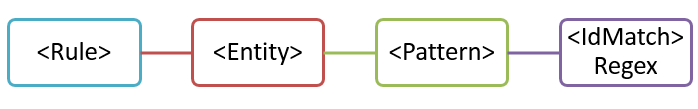
  
不過，這個模式雖然簡單，但是可以藉由將其中包含不一定是員工識別碼的任何 9 位數數字內容進行比對，識別許多誤判。
  
### <a name="more-common-scenario-entity-with-multiple-patterns"></a>更常見的案例：具有多種模式的實體

基於這個原因，使用一個以上的模式來定義實體更為常見，其中模式除了實體 (例如 9 位數數字) 之外，還會識別支援辨識項 (例如關鍵字或日期)。
  
例如，若要增加識別內容 (包含員工識別碼) 的可能性，除了 9 位數數字之外，您可以定義同時會識別雇用日期的另一個模式，並且再定義另一個模式，同時識別雇用日期和關鍵字 (例如「員工識別碼」)。
  
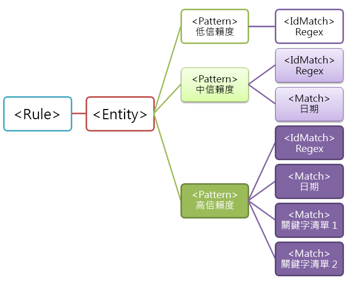
  
請注意此結構的幾個重要層面：
  
- 需要更多辨識項的模式具有較高的信賴等級。這相當有用，因為當您稍後在 DLP 原則中使用這個機密資訊類型時，可以只對較高信賴相符項目使用更嚴格限制的動作 (例如封鎖內容)，以及對較低信賴相符項目使用較不具限制性的動作 (例如傳送通知)。
    
- 支援 IdMatch 和 Match 元素會參考 regexes 與關鍵字，它們實際上是 Rule 元素的子項目，而不是 Pattern 元素的子項目。這些支援元素是由 Pattern 參考，但是包含在 Rule 中。這表示支援元素 (例如規則運算式或關鍵字清單) 的單一定義可以由多個實體和模式參考。
    
## <a name="what-entity-do-you-need-to-identify-entity-element-id-attribute"></a>您需要識別什麼實體？[Entity 元素、id 屬性]

實體是機密資訊類型 (例如信用卡號碼)，具有定義良好的模式。每個實體都有唯一的 GUID 作為其識別碼。
  
### <a name="name-the-entity-and-generate-its-guid"></a>為實體命名並產生其 GUID

新增 Rules 和 Entity 元素。然後新增註解，其中包含自訂實體的名稱 (在此範例中是員工識別碼)。稍後您會將實體名稱新增至當地語系化字串區段，該名稱就是當您建立 DLP 原則時出現在 UI 中的名稱。
  
接下來，為實體產生 GUID。有多種方法可以產生 GUID，但是您可以藉由在 PowerShell 中輸入 [guid]::NewGuid()，輕易地完成。稍後您也會將實體 GUID 新增至當地語系化字串區段。
  
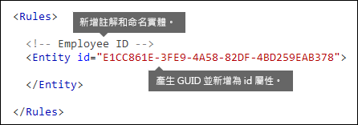
  
## <a name="what-pattern-do-you-want-to-match-pattern-element-idmatch-element-regex-element"></a>您要比對什麼模式？[Pattern 元素、IdMatch 元素、Regex 元素]

模式包含機密資訊類型所尋找項目的清單。這些項目包含 regexes、關鍵字及內建函式 (執行像是執行 regexes 以尋找日期或地址的工作)。機密資訊類型可以有多個具有唯一信賴的模式。
  
以下模式的共通點是都參考相同的規則運算式，該運算式會尋找 由空格 (\s) … (\s) 圍繞的 9 位數數字 (\d{9})。此規則運算式是由 IdMatch 元素參考，是所有模式 (尋找員工識別碼實體) 的通用需求。IdMatch 是模式嘗試比對的識別碼，例如員工識別碼或信用卡號碼或社會安全號碼。Pattern 元素必須確實只有一個 IdMatch 元素。
  
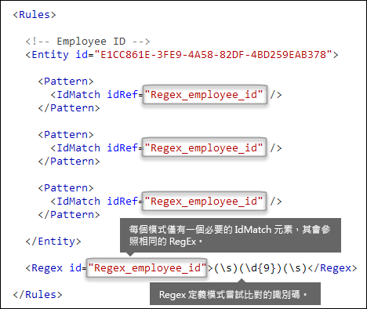
  
滿足條件時，模式會傳回計數和信賴等級，您可以在 DLP 原則的條件中使用。當您將會偵測機密資訊類型的條件新增至 DLP 原則時，可以編輯計數和信賴等級，如下所示。信賴等級 (也稱為比對正確性) 會在本主題稍後說明。
  
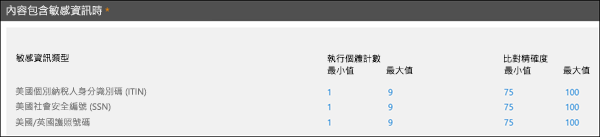
  
當您建立規則運算式時，請記住，要注意潛在問題。例如，如果您撰寫及上傳會識別太多內容的 regex，則會影響到效能。若要深入了解這些潛在問題，請參閱稍後的[要注意的潛在驗證問題](#potential-validation-issues-to-be-aware-of)一節。
  
## <a name="do-you-want-to-require-additional-evidence-match-element-mincount-attribute"></a>是否想要要求其他辨識項？[Match 元素、minCount 屬性]

除了 IdMatch 之外，模式可以使用 Match 元素來要求其他支援辨識項，例如關鍵字、regex，日期或地址。
  
模式可以包含多個 Match 元素；它們可以直接包含在 Pattern 元素中，或是使用 Any 元素來合併。Match 是由隱含的 AND 運算子來加入；所有 Match 元素必須滿足要比對的模式。您可以使用 Any 元素來引入 AND 或 OR 運算子 (稍後章節會詳加說明)。
  
您可以使用選擇性的 minCount 屬性，來指定針對每個 Match 元素必須找到多少個相符項目的執行個體。例如，您可以指定只有在找到關鍵字清單中的至少兩個關鍵字時，模式才會獲得滿足。
  
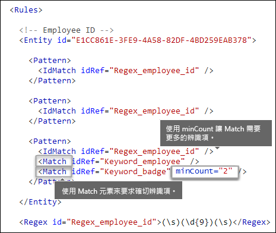
  
### <a name="keywords-keyword-group-and-term-elements-matchstyle-and-casesensitive-attributes"></a>關鍵字 [Keyword、Group 及 Term 元素、matchStyle 和 caseSensitive 屬性]

當您識別機密資訊 (例如員工識別碼) 時，通常想要要求關鍵字作為確切辨識項。例如，除了比對 9 位數數字之外，您可能想要尋找例如 "card"、"badge" 或 "ID" 的字詞。若要完成這項操作，您會使用 Keyword 元素。Keyword 元素具有 id 屬性，可以由多個模式或實體中的多個 Match 元素參考。
  
系統包含關鍵字作為 Group 元素中 Term 元素的清單。Group 元素具有 matchStyle 屬性，有兩個可能值：
  
- **matchStyle="word"** 字詞比對會識別空格或其他分隔符號圍繞的完整字詞。您應該永遠使用字詞，除非需要比對部分字詞或比對亞洲語言的字詞。 
    
- **matchStyle="string"** 字串比對會識別字串，無論有任何符號圍繞。例如，"id" 會比對 "bid" 和 "idea"。只有在您需要比對亞洲字詞，或者如果您的關鍵字可能包含作為其他字串的一部分時，才使用字串。 
    
最後，您可以使用 Term 元素的 caseSensitive 屬性，指定內容必須完全符合關鍵字，包括小寫和大寫字母。
  
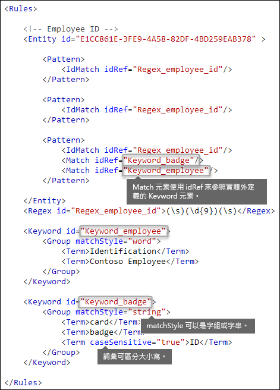
  
### <a name="regular-expressions-regex-element"></a>規則運算式 [Regex 元素]

在此範例中，員工識別碼實體已經使用 IdMatch 元素來參考 regex 的模式 - 空格圍繞的 9 位數數字。此外，模式可以使用 Match 元素來參考額外的 Regex 元素，以識別確切識別碼，例如 5 位數或 9 位數數字格式的美國郵遞區號。
  
### <a name="additional-patterns-such-as-dates-or-addresses-built-in-functions"></a>其他模式，例如日期或地址 [內建函式]

除了內建機密資訊類型之外，DLP 也包含內建函式，可以識別確切識別碼，例如美國日期、歐洲日期、到期日或美國地址。DLP 不支援上傳您自己的自訂函式，但是當您建立自訂機密資訊類型時，您的實體可以參考內建函式。
  
例如，員工識別碼識別證上面有雇用日期，因此這個自訂實體可以使用內建函式 `Func_us_date` 來識別以美國通用格式表示的日期。 
  
如需詳細資訊，請參閱 [DLP 功能所尋找的項目](what-the-dlp-functions-look-for.md)。
  

  
## <a name="different-combinations-of-evidence-any-element-minmatches-and-maxmatches-attributes"></a>不同的辨識項組合 [Any 元素、minMatches 和 maxMatches 屬性]

在 Pattern 元素中，所有 IdMatch 和 Match 元素是由隱含的 AND 運算子聯結 - 在滿足模式之前，必須滿足所有相符項目。但是，您可以藉由使用 Any 元素將 Match 元素群組在一起，建立更具彈性的比對邏輯。例如，您可以使用 Any 元素讓其子 Match 元素的子集完全相符、完全不相符或準確相符。
  
Any 元素具有選擇性的 minMatches 和 maxMatches 屬性，您可以用來定義在模式相符之前，必須滿足多少子 Match 元素。請注意，這些屬性會定義必須滿足的 Match 元素數目，而不是針對相符項目找到的辨識項執行個體數目。若要定義特定相符項目執行個體數目的下限 (例如清單中的關鍵字)，請針對 Match 元素使用 minCount 屬性 (如上所述)。
  
### <a name="match-at-least-one-child-match-element"></a>與至少一個子 Match 元素相符

如果您想要要求只需符合 Match 元素數目的下限，可以使用 minMatches 屬性，事實上，這些 Match 元素是由隱含的 OR 運算子聯結。如果找到美國格式日期或清單中的關鍵字時，這個 Any 元素會獲得滿足。

```
<Any minMatches="1" >
     <Match idRef="Func_us_date" />
     <Match idRef="Keyword_employee" />
     <Match idRef="Keyword_badge" />
</Any>
```
    
### <a name="match-an-exact-subset-of-any-children-match-elements"></a>比對任一子 Match 元素的精確子集

如果您想要要求必須符合 Match 元素的準確數目，可以將 minMatches 和 maxMatches 設為相同值。只有在確實找到一個日期或關鍵字時，這個 Any 元素才會獲得滿足，超過的話，模式就不會相符。

```
<Any minMatches="1" maxMatches="1" >
     <Match idRef="Func_us_date" />
     <Match idRef="Keyword_employee" />
     <Match idRef="Keyword_badge" />
</Any>
```
  
### <a name="match-none-of-children-match-elements"></a>與子 Match 元素完全不相符

如果您想要要求排除特定辨識項以讓模式獲得滿足，可以將 minMatches 和 maxMatches 都設為 0。如果您有很可能會誤判的關鍵字清單或辨識項時，這個方法很有用。
  
例如，員工識別碼實體會尋找關鍵字 "card"，因為它可能代表 "ID card"。但是，如果卡片只出現在片語 "credit card" 中，則該內容中的 "card" 不太可能是指 "ID card"。因此您可以將 "credit card" 作為關鍵字新增至術語清單，此清單是用來排除以免滿足模式。
  
```
<Any minMatches="0" maxMatches="0" >
    <Match idRef="Keyword_false_positives_local" />
    <Match idRef="Keyword_false_positives_intl" />
</Any>
```

### <a name="match-a-number-of-unique-terms"></a>比對數個唯一術語

如果您要比對數個唯一術語，請使用 *uniqueResults* 參數，設為 *true*，如下列範例所示：

```
<Pattern confidenceLevel="75">
    <IdMatch idRef="Salary_Revision_terms" />
    <Match idRef=" Salary_Revision_ID " minCount="3" uniqueResults="true" />
</Pattern>
```

在此範例中，使用至少三個唯一相符項目定義薪資修訂的模式。 
  
## <a name="how-close-to-the-entity-must-the-other-evidence-be-patternsproximity-attribute"></a>其他辨識項必須多接近實體？[patternsProximity 屬性]

您的機密資訊類型正在尋找代表員工識別碼的模式，該模式的一部分正在尋找像是關鍵字 (例如 "ID") 的確切辨識項。此辨識項越接近，模式就更有可能是真正的員工識別碼。您可以使用 Entity 元素的必要 patternsProximity 屬性，決定模式中的其他辨識項必須與實體有多接近。
  
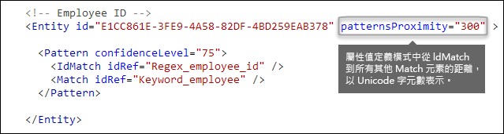
  
對實體中的每個模式來說，patternsProximity 屬性值可以定義所有其他針對該模式所指定的 Match 與 IdMatch 位置相隔的距離 (以 Unicode 字元形式)。近似值視窗會由 IdMatch 的位置來定位，且視窗會延展到 IdMatch 的左右兩側。
  
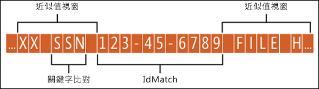
  
以下範例說明近似值視窗會如何影響模式比對，其中員工識別碼自訂實體的 IdMatch 元素需要至少一個確切相符的關鍵字或日期。只有 ID1 相符，因為對於 ID2 和 ID3，在近似值視窗中只找到部分確切辨識項，或完全找不到。
  

  
請注意，對於電子郵件，系統會將郵件內文和每個附件視為個別項目。這表示近似值視窗不會延伸超過每個項目結尾。對於每個項目 (附件或內文)，idMatch 和確切辨識項都必須位於該項目內。
  
## <a name="what-are-the-right-confidence-levels-for-different-patterns-confidencelevel-attribute-recommendedconfidence-attribute"></a>不同模式的正確信賴等級為何？[confidenceLevel 屬性、recommendedConfidence 屬性]

模式需要的辨識項越多，您就可以對於在模式相符時識別出真正實體 (例如員工識別碼) 更具信心。例如，相較於只需要 9 位數識別碼，您對於需要 9 位數數字、雇用日期、接近近似性的關鍵字的模式會更具信心。
  
Pattern 元素具有必要的 confidenceLevel 屬性。您可以將 confidenceLevel (介於 1 與 100 之間的整數) 的值視為實體中每個模式的唯一識別碼 - 實體中的模式必須具有與您所指派不同的信賴等級。準確的整數值無關緊要 - 只要挑選對於您的合規性小組有意義的數字即可。在您上傳自訂機密資訊類型然後建立 DLP 原則之後，可以在您建立的規則條件中參考這些信賴等級。
  
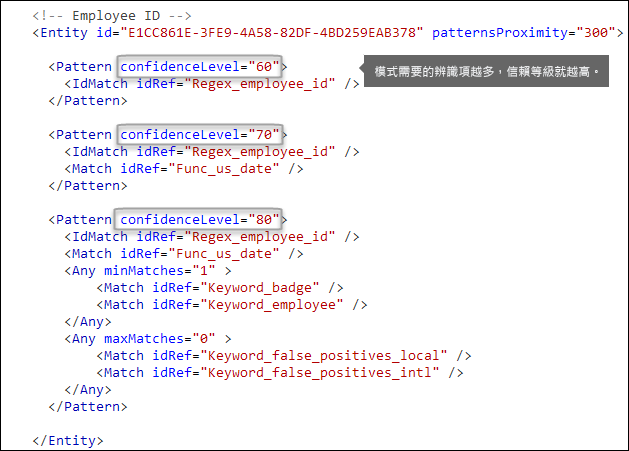
  
除了每個 Pattern 的 confidenceLevel 之外，Entity 具有 recommendedConfidence 屬性。可以將建議的 confidence 屬性視為規則的預設信賴等級。當您在 DLP 原則中建立規則時，如果您未指定要讓規則使用的信賴等級，該規則會根據實體的建議信賴等級進行比對。
  
## <a name="do-you-want-to-support-other-languages-in-the-ui-of-the-security-amp-compliance-center-localizedstrings-element"></a>您是否要在安全性與合規性中心的 UI 中支援其他語言？[LocalizedStrings 元素]

如果您的合規性小組使用 Office 365 安全性與合規性中心，以不同的地區設定和語言建立 DLP 原則，您可以提供當地語系化版本的自訂機密資訊類型名稱和描述。當您的合規性小組以您支援的語言使用 Office 365 時，他們會在 UI 中看到當地語系化名稱。
  

  
Rules 元素必須包含 LocalizedStrings 元素，後者包含 Resource 元素，它會參考您的自訂實體的 GUID。接下來，每個 Resource 元素包含一或多個 Name 和 Description 元素，每個元素會使用 langcode 屬性來提供特定語言的當地語系化字串。
  
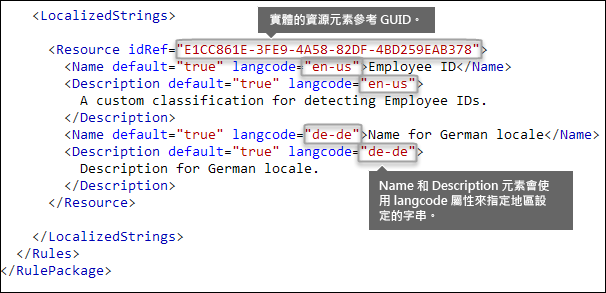
  
請注意，您只有針對自訂機密資訊類型在安全性與合規性中心 UI 中的外觀，才使用當地語系化字串。您無法使用當地語系化字串來提供不同當地語系化版本的關鍵字清單或規則運算式。
  
## <a name="other-rule-package-markup-rulepack-guid"></a>其他規則套件標記 [RulePack GUID]

最後，每個 RulePackage 的開頭都包含您必須填入的一些一般資訊。您可以使用下列標記作為範本，並且以您自己的資訊來取代 ". . ." 預留位置。
  
最重要的是，您必須為 RulePack 產生 GUID。前面您已經為實體產生 GUID；這是適用於 RulePack 的第二個 GUID。有數種方式可以產生 GUID，但是您可以藉由在 PowerShell 中輸入 [guid]::NewGuid()，輕易地完成。
  
Version 元素也很重要。當您第一次上傳規則套件時，Office 365 會記下版本號碼。稍後如果您更新規則套件並且上傳新版本，請務必更新版本號碼，否則 Office 365 不會部署規則套件。
  
```
<?xml version="1.0" encoding="utf-16"?>
<RulePackage xmlns="http://schemas.microsoft.com/office/2011/mce">
  <RulePack id=". . .">
    <Version major="1" minor="0" build="0" revision="0" />
    <Publisher id=". . ." /> 
    <Details defaultLangCode=". . .">
      <LocalizedDetails langcode=" . . . ">
         <PublisherName>. . .</PublisherName>
         <Name>. . .</Name>
         <Description>. . .</Description>
      </LocalizedDetails>
    </Details>
  </RulePack>
  
 <Rules>
    . . .
 </Rules>
</RulePackage>

```

完成後，您的 RulePack 元素看起來應該像這樣。
  
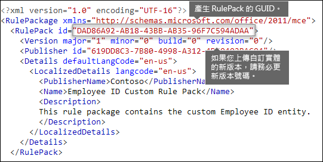
  
## <a name="changes-for-exchange-online"></a>針對 Exchange Online 變更

以前，您可能已使用 Exchange Online PowerShell，針對 DLP 匯入您的自訂機密資訊類型。現在您的自訂機密資訊類型可以在 Exchange 系統管理中心及安全性與合規性中心中使用。作為此改進的一部分，您應該使用安全性與合規性中心 PowerShell 來匯入您的自訂機密資訊類型 - 您無法再從 Exchange PowerShell 匯入。您的自訂機密資訊類型會繼續如同以往一般運作；但是，在安全性與合規性中心中對於自訂機密資訊類型所做的變更，可能需要最多一個小時才會在 Exchange 系統管理中心中顯示。
  
請注意，在安全性與合規性中心中，您使用的是 **[New-DlpSensitiveInformationTypeRulePackage](https://docs.microsoft.com/powershell/module/exchange/policy-and-compliance-dlp/new-dlpsensitiveinformationtyperulepackage?view=exchange-ps)** Cmdlet 來上傳規則套件。(以前，在 Exchange 系統管理中心中，您使用的是 **ClassificationRuleCollection** Cmdlet)。 
  
## <a name="upload-your-rule-package"></a>上傳您的規則套件

若要上傳您的規則套件，請執行下列步驟：
  
1. 使用 Unicode 編碼方式將它儲存為 .xml 檔。
    
2. [連線到安全性與合規性中心 PowerShell](http://go.microsoft.com/fwlink/p/?LinkID=799771)
    
3. 使用下列語法：

    ```
    New-DlpSensitiveInformationTypeRulePackage -FileData (Get-Content -Path "PathToUnicodeXMLFile" -Encoding Byte)
    ```

    此範例會從 C:\My Documents 上傳名為 MyNewRulePack.xml 的 Unicode XML 檔。

    ```
    New-DlpSensitiveInformationTypeRulePackage -FileData (Get-Content -Path "C:\My Documents\MyNewRulePack.xml" -Encoding Byte)
    ```

    如需詳細的語法和參數資訊，請參閱 [New-DlpSensitiveInformationTypeRulePackage](https://docs.microsoft.com/powershell/module/exchange/policy-and-compliance-dlp/new-dlpsensitiveinformationtyperulepackage)。

5. 若要確認您已成功建立新的機密資訊類型，請執行下列任一步驟：

  - 執行 [Get-DlpSensitiveInformationTypeRulePackage](https://docs.microsoft.com/powershell/module/exchange/policy-and-compliance-dlp/get-dlpsensitiveinformationtyperulepackage?view=exchange-ps) Cmdlet 來驗證新的規則套件，列於：

    ```
    Get-DlpSensitiveInformationTypeRulePackage
    ``` 

  - 執行 [Get-DlpSensitiveInformationType](https://docs.microsoft.com/powershell/module/exchange/policy-and-compliance-dlp/get-dlpsensitiveinformationtype?view=exchange-ps) Cmdlet 來驗證機密資訊類型，列於：

    ```
    Get-DlpSensitiveInformationType
    ``` 

    針對自訂機密資訊類型，Publisher 屬性值將為 Microsoft Corporation 以外的值。

  - 將 \<Name\> 取代為機密資訊類型的名稱值 (例如，員工識別碼)，然後執行 [Get-DlpSensitiveInformationType](https://docs.microsoft.com/powershell/module/exchange/policy-and-compliance-dlp/get-dlpsensitiveinformationtype?view=exchange-ps) Cmdlet：

    ```
    Get-DlpSensitiveInformationType -Identity "<Name>"
    ```
    
## <a name="potential-validation-issues-to-be-aware-of"></a>要注意的潛在驗證問題

當您上傳規則套件 XML 檔案時，系統會驗證 XML 並且檢查已知錯誤模式和明顯的效能問題。以下是驗證會針對規則運算式檢查的一些已知問題：
  
- 不得以垂直線 "|" 開頭或結尾，它會比對所有項目，因為系統會將它視為空白比對。
    
    例如，"|a" 或 "b|" 不會通過驗證。
    
- 不得以 ".{0,m}" 模式開頭或結尾，它沒有功能目的，只會妨礙效能。
    
    例如，".{0,50}ASDF" 或 "ASDF.{0,50}" 不會通過驗證。
    
- 在群組中不能有 ".{0,m}" 或 ".{1,m}"，以及在群組中不能有 ".\*" 或 ".+"。
    
    例如，"(.{0,50000})" 不會通過驗證。
    
- 在群組中不能有具有 "{0,m}" 或 "{1,m}" 中繼器的任何字元。
    
    例如，"(a\*)" 不會通過驗證。
    
- 不得以 ".{1,m}" 開頭或結尾；請改用 "."
    
    例如，".{1,m}asdf" 不會通過驗證。請改用 ".asdf"。
    
- 群組中不能有無限制的中繼器 (例如 "\*" 或 "+")。
    
    例如，"(xx)\*" 和 "(xx)+" 不會通過驗證。
    
如果自訂機密資訊類型包含可能會影響效能的問題，則無法上傳，您可能會看到下列其中一個錯誤訊息：
  
- **比預期符合更多內容的一般數量詞 (例如 '+'、'\*')**
    
- **查詢斷定**
    
- **與一般數量詞搭配使用的複雜群組**
    
## <a name="recrawl-your-content-to-identify-the-sensitive-information"></a>重新編目內容以識別機密資訊

DLP 會使用搜尋編目程式來識別及分類網站內容中的機密資訊。SharePoint Online 和商務用 OneDrive 中的內容會在每次更新時自動重新編目。但是若要識別所有現有內容中，您的新自訂類型機密資訊，該內容必須重新編目。
  
在 Office 365 中，您無法手動要求對整個租用戶重新編目，但是您可以為網站集合、清單或文件庫這麼做，請參閱[手動要求網站、文件庫或清單的編目和重新編製索引](https://docs.microsoft.com/sharepoint/crawl-site-content) (機器翻譯)。
  
## <a name="remove-a-custom-sensitive-information-type"></a>移除自訂機密資訊類型

> [!NOTE]
> 在您移除自訂機密資訊類型之前，請確認沒有 DLP 原則或 Exchange 郵件流程規則 (也稱為傳輸規則) 仍參照機密資訊類型。

在安全性與合規性中心 PowerShell 中，有兩種方法可以移除自訂機密資訊類型：

- **移除個別的自訂機密資訊類型**： 使用[修改自訂機密資訊類型](#modify-a-custom-sensitive-information-type)中所述的方法。您可以匯出包含自訂機密資訊類型的自訂規則套件、從 XML 檔中移除機密資訊類型，以及將已更新的 XML 檔匯入到現有的自訂規則套件。

- **移除自訂規則套件及其包含的所有自訂機密資訊類型**：本節會描述此方法。

1. [連線到安全性與合規性中心 PowerShell](http://go.microsoft.com/fwlink/p/?LinkID=799771)

2. 若要移除自訂規則套件，請使用 [Remove-DlpSensitiveInformationTypeRulePackage](https://docs.microsoft.com/powershell/module/exchange/policy-and-compliance-dlp/remove-dlpsensitiveinformationtyperulepackage?view=exchange-ps) Cmdlet：

    ```
    Remove-DlpSensitiveInformationTypeRulePackage -Identity "RulePackageIdentity"
    ```

    您可以使用名稱值 (適用於任何語言) 或 `RulePack id` (GUID) 值，來識別規則套件。

    此範例會移除名為 "Employee ID Custom Rule Pack" 的規則套件。

    ```
       Remove-DlpSensitiveInformationTypeRulePackage -Identity "Employee ID Custom Rule Pack"
    ```

    如需詳細的語法和參數資訊，請參閱 [Remove-DlpSensitiveInformationTypeRulePackage](https://docs.microsoft.com/powershell/module/exchange/policy-and-compliance-dlp/remove-dlpsensitiveinformationtyperulepackage)。

3. 若要確認您已成功移除自訂機密資訊類型，請執行下列任一步驟：

  - 執行 [Get-DlpSensitiveInformationTypeRulePackage](https://docs.microsoft.com/powershell/module/exchange/policy-and-compliance-dlp/get-dlpsensitiveinformationtyperulepackage?view=exchange-ps) Cmdlet，並驗證規則套件，不再列於：

    ```
    Get-DlpSensitiveInformationTypeRulePackage
    ``` 

  - 執行 [Get-DlpSensitiveInformationType](https://docs.microsoft.com/powershell/module/exchange/policy-and-compliance-dlp/get-dlpsensitiveinformationtype?view=exchange-ps) Cmdlet，並驗證不再列出已移除之規則套件中的機密資訊類型：

    ```
    Get-DlpSensitiveInformationType
    ``` 

    針對自訂機密資訊類型，Publisher 屬性值將為 Microsoft Corporation 以外的值。

  - 將 \<Name\> 取代為機密資訊類型的名稱值 (例如，員工識別碼)，然後執行 [Get-DlpSensitiveInformationType](https://docs.microsoft.com/powershell/module/exchange/policy-and-compliance-dlp/get-dlpsensitiveinformationtype?view=exchange-ps) Cmdlet，以驗證不再列出機密資訊類型：

    ```
    Get-DlpSensitiveInformationType -Identity "<Name>"
    ```

## <a name="modify-a-custom-sensitive-information-type"></a>修改自訂機密資訊類型

在安全性與合規性中心 PowerShell 中，修改自訂機密資訊類型，需要您：

1. 將包含自訂機密資訊類型的現有規則套件匯出至 XML 檔 (或使用現有的 XML 檔，若您有一個的話)。 

2. 修改已匯出之 XML 檔中的自訂機密資訊類型。

3. 將更新的 XML 檔匯入至現有的規則套件。

若要連線到安全性與合規性中心 PowerShell，請參閱[連線到安全性與合規性中心 PowerShell](http://go.microsoft.com/fwlink/p/?LinkID=799771)。

#### <a name="step-1-export-the-existing-rule-package-to-an-xml-file"></a>步驟 1：將現有規則套件匯出至 XML 檔

> [!NOTE]
> 如果您有 XML 檔的複本 (例如，您剛建立並匯入它)，則可以跳到下一個步驟來修改 XML 檔。

1. 如果您不清楚，請執行 [Get-DlpSensitiveInformationTypeRulePackage](https://docs.microsoft.com/powershell/module/exchange/policy-and-compliance-dlp/get-dlpsensitiveinformationtype?view=exchange-ps) Cmdlet 來尋找自訂規則套件的名稱：

    ```
    Get-DlpSensitiveInformationTypeRulePackage
    ```

    **附註**：包含內建機密資訊類型的內建規則套件稱為 Microsoft 規則套件。此規則套件名為 Microsoft.SCCManaged.CustomRulePack，其中包含您已在安全性與合規性中心 UI 中建立的自訂機密資訊類型。

2. 使用 [Get-DlpSensitiveInformationTypeRulePackage](https://docs.microsoft.com/powershell/module/exchange/policy-and-compliance-dlp/get-dlpsensitiveinformationtyperulepackage?view=exchange-ps) Cmdlet，將自訂規則套件儲存至變數：

    ```
    $rulepak = Get-DlpSensitiveInformationTypeRulePackage -Identity "RulePackageName"
    ```

   例如，如果規則套件的名稱為 "Employee ID Custom Rule Pack"，請執行下列 Cmdlet：

    ```
    $rulepak = Get-DlpSensitiveInformationTypeRulePackage -Identity "Employee ID Custom Rule Pack"
    ```

3. 請使用 [Set-Content](https://docs.microsoft.com/powershell/module/microsoft.powershell.management/set-content?view=powershell-6) Cmdlet 將自訂規則套件匯出至 XML 檔：

    ```
    Set-Content -Path "XMLFileAndPath" -Encoding Byte -Value $rulepak.SerializedClassificationRuleCollection
    ```

    此範例會將此規則套件匯出至 C:\My Documents 資料夾中名為 ExportedRulePackage.xml 的檔案。

    ```
    Set-Content -Path "C:\My Documents\ExportedRulePackage.xml" -Encoding Byte -Value $rulepak.SerializedClassificationRuleCollection
    ```

#### <a name="step-2-modify-the-sensitive-information-type-in-the-exported-xml-file"></a>步驟 2：修改已匯出之 XML 檔中的機密資訊類型。

稍早已在本主題中描述 XML 檔中的機密資訊類型和檔案中的其他元素。

#### <a name="step-3-import-the-updated-xml-file-back-into-the-existing-rule-package"></a>步驟 3：將更新的 XML 檔匯入至現有的規則套件。

若要更新的 XML 重新匯入現有規則套件，請使用 [Set-DlpSensitiveInformationTypeRulePackage](https://docs.microsoft.com/powershell/module/exchange/policy-and-compliance-dlp/set-dlpsensitiveinformationtyperulepackage?view=exchange-ps) Cmdlet：

```
Set-DlpSensitiveInformationTypeRulePackage -FileData ([Byte[]]$(Get-Content -Path "C:\My Documents\External Sensitive Info Type Rule Collection.xml" -Encoding Byte -ReadCount 0))
```

如需詳細的語法和參數資訊，請參閱 [Set-DlpSensitiveInformationTypeRulePackage](https://docs.microsoft.com/powershell/module/exchange/policy-and-compliance-dlp/set-dlpsensitiveinformationtyperulepackage)。

## <a name="reference-rule-package-xml-schema-definition"></a>參考：規則套件 XML 結構描述定義

您可以複製此標記、將它儲存為 XSD 檔，然後用它來驗證規則套件 XML 檔。
  
```
<?xml version="1.0" encoding="utf-8"?>
<xs:schema xmlns:mce="http://schemas.microsoft.com/office/2011/mce"
           targetNamespace="http://schemas.microsoft.com/office/2011/mce" 
           xmlns:xs="http://www.w3.org/2001/XMLSchema"
           elementFormDefault="qualified"
           attributeFormDefault="unqualified"
           id="RulePackageSchema">
  <!-- Use include if this schema has the same target namespace as the schema being referenced, otherwise use import -->
  <xs:element name="RulePackage" type="mce:RulePackageType"/>
  <xs:simpleType name="LangType">
    <xs:union memberTypes="xs:language">
      <xs:simpleType>
        <xs:restriction base="xs:string">
          <xs:enumeration value=""/>
        </xs:restriction>
      </xs:simpleType>
    </xs:union>
  </xs:simpleType>
  <xs:simpleType name="GuidType" final="#all">
    <xs:restriction base="xs:token">
      <xs:pattern value="[0-9a-fA-F]{8}\-([0-9a-fA-F]{4}\-){3}[0-9a-fA-F]{12}"/>
    </xs:restriction>
  </xs:simpleType>
  <xs:complexType name="RulePackageType">
    <xs:sequence>
      <xs:element name="RulePack" type="mce:RulePackType"/>
      <xs:element name="Rules" type="mce:RulesType">
        <xs:key name="UniqueRuleId">
          <xs:selector xpath="mce:Entity|mce:Affinity|mce:Version/mce:Entity|mce:Version/mce:Affinity"/>
          <xs:field xpath="@id"/>
        </xs:key>
        <xs:key name="UniqueProcessorId">
          <xs:selector xpath="mce:Regex|mce:Keyword|mce:Fingerprint"></xs:selector>
          <xs:field xpath="@id"/>
        </xs:key>
        <xs:key name="UniqueResourceIdRef">
          <xs:selector xpath="mce:LocalizedStrings/mce:Resource"/>
          <xs:field xpath="@idRef"/>
        </xs:key>        
        <xs:keyref name="ReferencedRuleMustExist" refer="mce:UniqueRuleId">
          <xs:selector xpath="mce:LocalizedStrings/mce:Resource"/>
          <xs:field xpath="@idRef"/>
        </xs:keyref>
        <xs:keyref name="RuleMustHaveResource" refer="mce:UniqueResourceIdRef">
          <xs:selector xpath="mce:Entity|mce:Affinity|mce:Version/mce:Entity|mce:Version/mce:Affinity"/>
          <xs:field xpath="@id"/>
        </xs:keyref>
      </xs:element>
    </xs:sequence>
  </xs:complexType>
  <xs:complexType name="RulePackType">
    <xs:sequence>
      <xs:element name="Version" type="mce:VersionType"/>
      <xs:element name="Publisher" type="mce:PublisherType"/>
      <xs:element name="Details" type="mce:DetailsType">
        <xs:key name="UniqueLangCodeInLocalizedDetails">
          <xs:selector xpath="mce:LocalizedDetails"/>
          <xs:field xpath="@langcode"/>
        </xs:key>
        <xs:keyref name="DefaultLangCodeMustExist" refer="mce:UniqueLangCodeInLocalizedDetails">
          <xs:selector xpath="."/>
          <xs:field xpath="@defaultLangCode"/>
        </xs:keyref>
      </xs:element>
      <xs:element name="Encryption" type="mce:EncryptionType" minOccurs="0" maxOccurs="1"/>
    </xs:sequence>
    <xs:attribute name="id" type="mce:GuidType" use="required"/>
  </xs:complexType>
  <xs:complexType name="VersionType">
    <xs:attribute name="major" type="xs:unsignedShort" use="required"/>
    <xs:attribute name="minor" type="xs:unsignedShort" use="required"/>
    <xs:attribute name="build" type="xs:unsignedShort" use="required"/>
    <xs:attribute name="revision" type="xs:unsignedShort" use="required"/>
  </xs:complexType>
  <xs:complexType name="PublisherType">
    <xs:attribute name="id" type="mce:GuidType" use="required"/>
  </xs:complexType>
  <xs:complexType name="LocalizedDetailsType">
    <xs:sequence>
      <xs:element name="PublisherName" type="mce:NameType"/>
      <xs:element name="Name" type="mce:RulePackNameType"/>
      <xs:element name="Description" type="mce:OptionalNameType"/>
    </xs:sequence>
    <xs:attribute name="langcode" type="mce:LangType" use="required"/>
  </xs:complexType>
  <xs:complexType name="DetailsType">
    <xs:sequence>
      <xs:element name="LocalizedDetails" type="mce:LocalizedDetailsType" maxOccurs="unbounded"/>
    </xs:sequence>
    <xs:attribute name="defaultLangCode" type="mce:LangType" use="required"/>
  </xs:complexType>
  <xs:complexType name="EncryptionType">
    <xs:sequence>
      <xs:element name="Key" type="xs:normalizedString"/>
      <xs:element name="IV" type="xs:normalizedString"/>
    </xs:sequence>
  </xs:complexType>
  <xs:simpleType name="RulePackNameType">
    <xs:restriction base="xs:token">
      <xs:minLength value="1"/>
      <xs:maxLength value="64"/>
    </xs:restriction>
  </xs:simpleType>
  <xs:simpleType name="NameType">
    <xs:restriction base="xs:normalizedString">
      <xs:minLength value="1"/>
      <xs:maxLength value="256"/>
    </xs:restriction>
  </xs:simpleType>
  <xs:simpleType name="OptionalNameType">
    <xs:restriction base="xs:normalizedString">
      <xs:minLength value="0"/>
      <xs:maxLength value="256"/>
    </xs:restriction>
  </xs:simpleType>
  <xs:simpleType name="RestrictedTermType">
    <xs:restriction base="xs:string">
      <xs:minLength value="1"/>
      <xs:maxLength value="100"/>
    </xs:restriction>
  </xs:simpleType>
  <xs:complexType name="RulesType">
    <xs:sequence>
      <xs:choice maxOccurs="unbounded">
        <xs:element name="Entity" type="mce:EntityType"/>
        <xs:element name="Affinity" type="mce:AffinityType"/>
        <xs:element name="Version" type="mce:VersionedRuleType"/>
      </xs:choice>
      <xs:choice minOccurs="0" maxOccurs="unbounded">
        <xs:element name="Regex" type="mce:RegexType"/>
        <xs:element name="Keyword" type="mce:KeywordType"/>
        <xs:element name="Fingerprint" type="mce:FingerprintType"/>
        <xs:element name="ExtendedKeyword" type="mce:ExtendedKeywordType"/>
      </xs:choice>
      <xs:element name="LocalizedStrings" type="mce:LocalizedStringsType"/>
    </xs:sequence>
  </xs:complexType>
  <xs:complexType name="EntityType">
    <xs:sequence>
      <xs:element name="Pattern" type="mce:PatternType" maxOccurs="unbounded"/>
      <xs:element name="Version" type="mce:VersionedPatternType" minOccurs="0" maxOccurs="unbounded" />
    </xs:sequence>
    <xs:attribute name="id" type="mce:GuidType" use="required"/>
    <xs:attribute name="patternsProximity" type="mce:ProximityType" use="required"/>
    <xs:attribute name="recommendedConfidence" type="mce:ProbabilityType"/>
    <xs:attribute name="workload" type="mce:WorkloadType"/>
  </xs:complexType>
  <xs:complexType name="PatternType">
    <xs:sequence>
      <xs:element name="IdMatch" type="mce:IdMatchType"/>
      <xs:choice minOccurs="0" maxOccurs="unbounded">
        <xs:element name="Match" type="mce:MatchType"/>
        <xs:element name="Any" type="mce:AnyType"/>
      </xs:choice>
    </xs:sequence>
    <xs:attribute name="confidenceLevel" type="mce:ProbabilityType" use="required"/>
  </xs:complexType>
  <xs:complexType name="AffinityType">
    <xs:sequence>
      <xs:element name="Evidence" type="mce:EvidenceType" maxOccurs="unbounded"/>
      <xs:element name="Version" type="mce:VersionedEvidenceType" minOccurs="0" maxOccurs="unbounded" />
    </xs:sequence>
    <xs:attribute name="id" type="mce:GuidType" use="required"/>
    <xs:attribute name="evidencesProximity" type="mce:ProximityType" use="required"/>
    <xs:attribute name="thresholdConfidenceLevel" type="mce:ProbabilityType" use="required"/>
    <xs:attribute name="workload" type="mce:WorkloadType"/>
  </xs:complexType>
  <xs:complexType name="EvidenceType">
    <xs:sequence>
      <xs:choice maxOccurs="unbounded">
        <xs:element name="Match" type="mce:MatchType"/>
        <xs:element name="Any" type="mce:AnyType"/>
      </xs:choice>
    </xs:sequence>
    <xs:attribute name="confidenceLevel" type="mce:ProbabilityType" use="required"/>
  </xs:complexType>
  <xs:complexType name="IdMatchType">
    <xs:attribute name="idRef" type="xs:string" use="required"/>
  </xs:complexType>
  <xs:complexType name="MatchType">
    <xs:attribute name="idRef" type="xs:string" use="required"/>
    <xs:attribute name="minCount" type="xs:positiveInteger" use="optional"/>
    <xs:attribute name="uniqueResults" type="xs:boolean" use="optional"/>
  </xs:complexType>
  <xs:complexType name="AnyType">
    <xs:sequence>
      <xs:choice maxOccurs="unbounded">
        <xs:element name="Match" type="mce:MatchType"/>
        <xs:element name="Any" type="mce:AnyType"/>
      </xs:choice>
    </xs:sequence>
    <xs:attribute name="minMatches" type="xs:nonNegativeInteger" default="1"/>
    <xs:attribute name="maxMatches" type="xs:nonNegativeInteger" use="optional"/>
  </xs:complexType>
  <xs:simpleType name="ProximityType">
    <xs:union>
      <xs:simpleType>
        <xs:restriction base='xs:string'>
          <xs:enumeration value="unlimited"/>
        </xs:restriction>
      </xs:simpleType>
      <xs:simpleType>
        <xs:restriction base="xs:positiveInteger">
          <xs:minInclusive value="1"/>
        </xs:restriction>
      </xs:simpleType>
    </xs:union>
  </xs:simpleType>
  <xs:simpleType name="ProbabilityType">
    <xs:restriction base="xs:integer">
      <xs:minInclusive value="1"/>
      <xs:maxInclusive value="100"/>
    </xs:restriction>
  </xs:simpleType>
  <xs:simpleType name="WorkloadType">
    <xs:restriction base="xs:string">
      <xs:enumeration value="Exchange"/>
      <xs:enumeration value="Outlook"/>
    </xs:restriction>
  </xs:simpleType>
  <xs:simpleType name="EngineVersionType">
    <xs:restriction base="xs:token">
      <xs:pattern value="^\d{2}\.01?\.\d{3,4}\.\d{1,3}$"/>
    </xs:restriction>
  </xs:simpleType>
  <xs:complexType name="VersionedRuleType">
    <xs:choice maxOccurs="unbounded">
      <xs:element name="Entity" type="mce:EntityType"/>
      <xs:element name="Affinity" type="mce:AffinityType"/>
    </xs:choice>
    <xs:attribute name="minEngineVersion" type="mce:EngineVersionType" use="required" />
  </xs:complexType>
  <xs:complexType name="VersionedPatternType">
    <xs:sequence>
      <xs:element name="Pattern" type="mce:PatternType" maxOccurs="unbounded"/>
    </xs:sequence>
    <xs:attribute name="minEngineVersion" type="mce:EngineVersionType" use="required" />
  </xs:complexType>
  <xs:complexType name="VersionedEvidenceType">
    <xs:sequence>
      <xs:element name="Evidence" type="mce:EvidenceType" maxOccurs="unbounded"/>
    </xs:sequence>
    <xs:attribute name="minEngineVersion" type="mce:EngineVersionType" use="required" />
  </xs:complexType>
  <xs:simpleType name="FingerprintValueType">
    <xs:restriction base="xs:string">
      <xs:minLength value="2732"/>
      <xs:maxLength value="2732"/>
    </xs:restriction>
  </xs:simpleType>
  <xs:complexType name="FingerprintType">
    <xs:simpleContent>
      <xs:extension base="mce:FingerprintValueType">
        <xs:attribute name="id" type="xs:token" use="required"/>
        <xs:attribute name="threshold" type="mce:ProbabilityType" use="required"/>
        <xs:attribute name="shingleCount" type="xs:positiveInteger" use="required"/>
        <xs:attribute name="description" type="xs:string" use="optional"/>
      </xs:extension>
    </xs:simpleContent>
  </xs:complexType>
  <xs:complexType name="RegexType">
    <xs:simpleContent>
      <xs:extension base="xs:string">
        <xs:attribute name="id" type="xs:token" use="required"/>
      </xs:extension>
    </xs:simpleContent>
  </xs:complexType>
  <xs:complexType name="KeywordType">
    <xs:sequence>
      <xs:element name="Group" type="mce:GroupType" maxOccurs="unbounded"/>
    </xs:sequence>
    <xs:attribute name="id" type="xs:token" use="required"/>
  </xs:complexType>
  <xs:complexType name="GroupType">
    <xs:sequence>
      <xs:choice>
        <xs:element name="Term" type="mce:TermType" maxOccurs="unbounded"/>
      </xs:choice>
    </xs:sequence>
    <xs:attribute name="matchStyle" default="word">
      <xs:simpleType>
        <xs:restriction base="xs:NMTOKEN">
          <xs:enumeration value="word"/>
          <xs:enumeration value="string"/>
        </xs:restriction>
      </xs:simpleType>
    </xs:attribute>
  </xs:complexType>
  <xs:complexType name="TermType">
    <xs:simpleContent>
      <xs:extension base="mce:RestrictedTermType">
        <xs:attribute name="caseSensitive" type="xs:boolean" default="false"/>
      </xs:extension>
    </xs:simpleContent>
  </xs:complexType>
  <xs:complexType name="ExtendedKeywordType">
    <xs:simpleContent>
      <xs:extension base="xs:string">
        <xs:attribute name="id" type="xs:token" use="required"/>
      </xs:extension>
    </xs:simpleContent>
  </xs:complexType>
  <xs:complexType name="LocalizedStringsType">
    <xs:sequence>
      <xs:element name="Resource" type="mce:ResourceType" maxOccurs="unbounded">
      <xs:key name="UniqueLangCodeUsedInNamePerResource">
        <xs:selector xpath="mce:Name"/>
        <xs:field xpath="@langcode"/>
      </xs:key>
      <xs:key name="UniqueLangCodeUsedInDescriptionPerResource">
        <xs:selector xpath="mce:Description"/>
        <xs:field xpath="@langcode"/>
      </xs:key>
    </xs:element>
    </xs:sequence>
  </xs:complexType>
  <xs:complexType name="ResourceType">
    <xs:sequence>
      <xs:element name="Name" type="mce:ResourceNameType" maxOccurs="unbounded"/>
      <xs:element name="Description" type="mce:DescriptionType" minOccurs="0" maxOccurs="unbounded"/>
    </xs:sequence>
    <xs:attribute name="idRef" type="mce:GuidType" use="required"/>
  </xs:complexType>
  <xs:complexType name="ResourceNameType">
    <xs:simpleContent>
      <xs:extension base="xs:string">
        <xs:attribute name="default" type="xs:boolean" default="false"/>
        <xs:attribute name="langcode" type="mce:LangType" use="required"/>
      </xs:extension>
    </xs:simpleContent>
  </xs:complexType>
  <xs:complexType name="DescriptionType">
    <xs:simpleContent>
      <xs:extension base="xs:string">
        <xs:attribute name="default" type="xs:boolean" default="false"/>
        <xs:attribute name="langcode" type="mce:LangType" use="required"/>
      </xs:extension>
    </xs:simpleContent>
  </xs:complexType>
</xs:schema>

```

## <a name="more-information"></a>詳細資訊

- [資料外洩防護原則概觀](data-loss-prevention-policies.md)
    
- [機密資訊類型在找什麼](what-the-sensitive-information-types-look-for.md)
    
- [DLP 功能所尋找的項目](what-the-dlp-functions-look-for.md)
    

