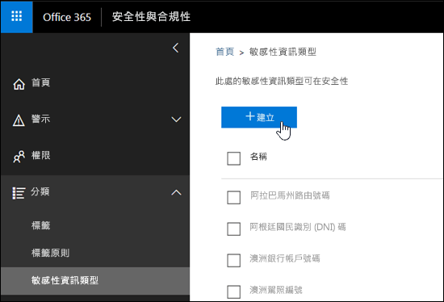
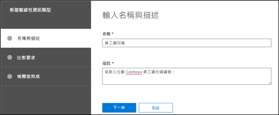
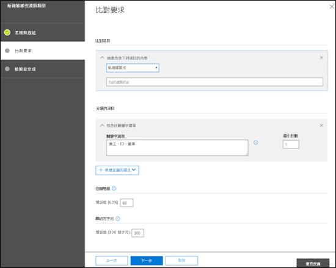
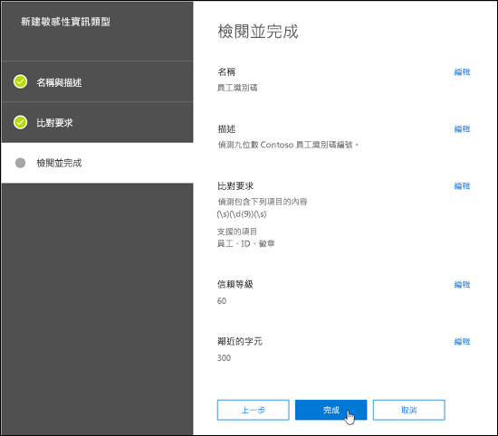
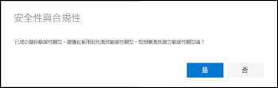
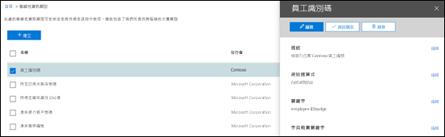
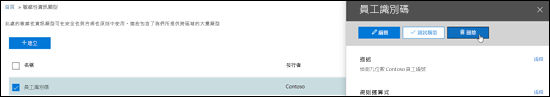
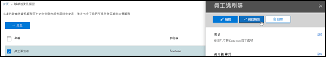
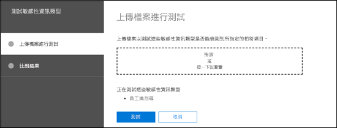
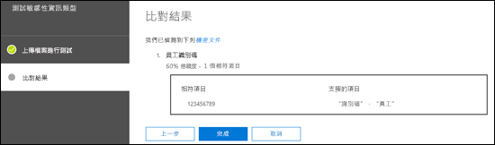

# 建立自訂機密資訊類型

Office 365 中的資料外洩防護 (DLP) 包含許多內建[機密資訊類型](what-the-sensitive-information-types-look-for.md)，可讓您在 DLP 原則中使用。這些內件類型可以協助識別及保護信用卡號碼、銀行帳號、護照號碼等等。 

但是，如果您需要識別及保護不同類型的機密資訊 (例如使用貴組織專屬格式的員工識別碼或專案編號)，則可以建立自訂機密資訊類型。

自訂機密資訊類型的基礎部分如下：

- **主要模式**：員工識別碼、專案編號等等。這通常由規則運算式 (RegEx) 識別，但它也可以是關鍵字清單。

- **其他辨識項**：假設您正在尋找九位數的員工識別碼。並非所有的九位數都是員工識別碼，因此您可以搜尋其他文字：像是 "employee"、"badge"、"ID" 這類的關鍵字，或其他以規則運算式為基礎的文字模式。此支援辨識項 (也稱為_支援_或_確切_辨識項)，可增加在內容中找到的九位數確實為員工識別碼的可能性。

- **字元近似值**：主要模式與支援辨識項彼此越接近，偵測到的內容越可能是您要尋找的內容，這是合理的。您可以指定主要模式與支援辨識項之間的字元距離 (也稱為_近似值視窗_)，如下圖所示：

    

- **信賴等級**：您具有的支援辨識項越多，相符項目包含您要尋找的機密資訊的可能性就越高。您可以針對使用更多辨識項偵測到的相符項目指派更高等級的信賴。

  滿足條件時，模式會傳回計數和信賴等級，您可以在 DLP 原則的條件中使用。當您將會偵測機密資訊類型的條件新增至 DLP 原則時，可以編輯計數和信賴等級，如下圖所示：

    

若要在安全性與合規性中心建立自訂敏感性資訊類型，您有下列選項：

- **使用 UI**：這種方法更輕鬆且更快，但您具有的設定選項比 PowerShell 少。本主題的其餘內容將說明這些程序。

- **使用 PowerShell**：這種方法需要您先建立 XML 檔案 (稱為_規則套件_)，其中包含一或多個敏感性資訊類型，然後使用 PowerShell 來匯入規則套件 (與建立規則套件相較，匯入規則套件更容易解決)。這種方法遠比 UI 複雜得多，但您有更多的設定選項。如需相關指示，請參閱[在安全性與合規性中心 PowerShell 中建立自訂敏感性資訊類型](create-a-custom-sensitive-information-type-in-scc-powershell.md)。

下表說明重要差異：

|**UI 中的自訂機密資訊類型**|**PowerShell 中的自訂機密資訊類型**|
|:-----|:-----|
|名稱與描述為同一種語言。|支援名稱與描述使用多種語言。|
|支援一種模式。|支援多種模式。|
|支援辨識項可以是：  • 規則運算式  • 關鍵字  • 關鍵字字典|支援辨識項可以是：  • 規則運算式  • 關鍵字  • 關鍵字字典  • [內建 DLP 函數](what-the-dlp-functions-look-for.md)|
|自訂機密資訊類型會新增到名為 Microsoft.SCCManaged.CustomRulePack 的規則套件|您最多可以建立 10 個包含自訂機密資訊類型的規則套件。|
|模式比對需要偵測主要模式及所有支援辨識項 (使用隱含的 AND 運算子)。|模式比對需要偵測主要模式及可設定數量的支援辨識項 (可以使用隱含的 AND 及 OR 運算子)。|

## 開始之前有哪些須知？

- 若要開啟安全性與合規性中心，請參閱[移至安全性與合規性中心](go-to-the-securitycompliance-center.md)。

- 自訂機密資訊類型需要熟悉規則運算式 (RegEx)。如需用於處理文字之 Boost.RegEx (先前稱為 RegEx++) 引擎的詳細資訊，請參閱 [Boost.Regex 5.1.3](https://www.boost.org/doc/libs/1_68_0/libs/regex/doc/html/)。

  Microsoft 客戶服務與支援中心無法協助提供自訂內容比對定義 (建立自訂分類或規則運算式模式)。支援工程師可以提供有限的功能支援 (例如，基於測試目的提供範例規則運算式模式，或協助對未如預期般觸發的現有規則運算式模式進行疑難排解)，但無法保證任何自訂內容比對開發作業將符合您的需求。

- DLP 會使用搜尋編目程式來識別並分類 SharePoint Online 和商務用 OneDrive 中的機密資訊。若要識別現有內容中的新自訂機密資訊類型，必須重新編目內容。內容是根據排程來重新編目，但您可以手動重新編目網站集合、清單或文件庫的內容。如需詳細資訊，請參閱[手動要求編目或重新檢索網站、文件庫或清單](https://docs.microsoft.com/sharepoint/crawl-site-content)。

## 在安全性與合規性中心建立自訂機密資訊類型

在安全性與合規性中心，移至 [**分類**] \> [**機密資訊類型**]，然後按一下 [**建立**]。

這些設定不言而喻，並會在精靈的關聯頁面上加以說明：

- **名稱**

- **描述**

- **近似值**

- **信賴等級**

- **主要模式元素** (關鍵字、規則運算式或字典)

- 選用的**支援模式元素** (關鍵字、規則運算式或字典) 及其對應**最低成本**值。

以下是案例：您想要一個自訂機密資訊類型，偵測內容中 9 位數的員工編號，以及關鍵字 "employee"、"ID" 及 "badge"。若要建立此自訂機密資訊類型，請執行下列步驟：

1. 在安全性與合規性中心，移至 [**分類**] \> [**機密資訊類型**]，然後按一下 [**建立**]。

    

2. 在開啟的 [選擇名稱和描述]**** 頁面中，輸入下列值：

  - **名稱**：員工識別碼。

  - **描述**：偵測九位數 Contoso 員工編號。

    

    完成後，按 [下一步]****。

3. 在 [比對需求]**** 頁面中，按一下 [新增元素]**** 來設定下列設定：

    - **偵測包含下列項目的內容**：
 
      a 按一下 [其中任一個]****，然後選取 [規則運算式]****。

      b. 在規則運算式方塊中，輸入 `(\s)(\d{9})(\s)` (以空格括住九位數的號碼)。
  
    - **支援項目**：按一下 [新增支援項目]****，然後選取 [包含此關鍵字清單]****。

    - 在出現的 [包含此關鍵字清單]**** 區域中，設定下列設定：

      - **關鍵字清單**：輸入下列值：員工、識別碼、徽章。

      - **最小計數**：保留預設值 1。

    - 保留預設**信賴等級**值 60。 

    - 保留預設**字元近似值** 300。

    

    完成後，按 [下一步]****。

4. 在開啟的 [檢閱並完成]**** 頁面上，檢閱設定並按一下 [完成]****。

    

5. 下一個頁面鼓勵您藉由按一下 [是]****，測試新的自訂機密資訊類型。如需詳細資訊，請參閱[在安全性與合規性中心測試自訂機密資訊類型](#test-custom-sensitive-information-types-in-the-security--compliance-center)。如需稍後再測試規則，請按一下 [否]****。

    

### 如何知道這是否正常運作？

若要確認您已成功建立新的機密資訊類型，請執行下列任一步驟：

  - 移至 [分類]**** \> [機密資訊類型]****，並確認已列出新的自訂機密資訊類型。

  - 測試新的自訂機密資訊類型。如需詳細資訊，請參閱[在安全性與合規性中心測試自訂機密資訊類型](#test-custom-sensitive-information-types-in-the-security--compliance-center)。

## 在安全性與合規性中心修改自訂機密資訊類型

**附註**：

- 您只能修改自訂機密資訊類型，不能修改內建的機密資訊類型。但您可以使用 PowerShell 來匯出內建的自訂機密資訊類型、自訂它們，並將其匯入為自訂機密資訊類型。如需詳細資訊，請參閱[自訂內建的機密資訊類型](customize-a-built-in-sensitive-information-type.md)。

- 您只能修改在 UI 中建立的自訂機密資訊類型。如果您使用 [PowerShell 程序](create-a-custom-sensitive-information-type-in-scc-powershell.md)匯入自訂的機密資訊類型規則套件，則會收到錯誤訊息。

在安全性與合規性中心，移至 [分類]**** \> [機密資訊類型]****，選取您想要修改的自訂機密資訊類型，然後按一下 [編輯]****。

  

這裡提供與您在安全性與合規性中心建立自訂機密資訊類型時相同的選項。如需詳細資訊，請參閱[在安全性與合規性中心建立自訂機密資訊類型](#create-custom-sensitive-information-types-in-the-security--compliance-center)。

### 如何知道這是否正常運作？

若要確認您已成功修改機密資訊類型，請執行下列任一步驟：

  - 移至 [分類]**** \> [機密資訊類型]****，以驗證已修改之自訂機密資訊類型的內容。 

  - 測試已修改的自訂機密資訊類型。如需詳細資訊，請參閱[在安全性與合規性中心測試自訂機密資訊類型](#test-custom-sensitive-information-types-in-the-security--compliance-center)。

## 移除安全性與合規性中心的自訂機密資訊類型 

**附註**：

- 您只能移除自訂機密資訊類型，不能移除內建的機密資訊類型。

- 在您移除自訂機密資訊類型之前，請確認沒有 DLP 原則或 Exchange 郵件流程規則 (也稱為傳輸規則) 仍參照機密資訊類型。

1. 在安全性與合規性中心，移至 [分類]**** \> [機密資訊類型]****，然後選取一或多個您想要移除的自訂機密資訊類型。

2. 在開啟的飛出視窗中，按一下 [刪除]**** (或 [刪除機密資訊類型]****，如果您已選取多個的話)。

    

3. 在出現的警告訊息中，按一下 [是]****。

### 如何知道這是否正常運作？

若要確認您已成功移除自訂機密資訊類型，請移至 [分類]**** \> [機密資訊類型]****，以確認不再列出自訂機密資訊類型。

## 在安全性與合規性中心測試自訂機密資訊類型

1. 在安全性與合規性中心，移至 [分類]**** \> [機密資訊類型]****。

2. 選取要測試的一或多個自訂機密資訊類型。在開啟的飛出視窗中，按一下 [測試類型]**** (或 [測試機密資訊類型]****，如果您已選取多個的話)。

    

3. 在開啟的 [上傳檔案進行測試]**** 頁面上，拖放檔案或按一下 [瀏覽]**** 並選取檔案，來上傳要測試的文件。

    

4. 按一下 [測試]**** 按鈕，來測試文件以在檔案中進行模式比對。

5. 在 [比對結果]**** 頁面上，按一下 [完成]****。

    