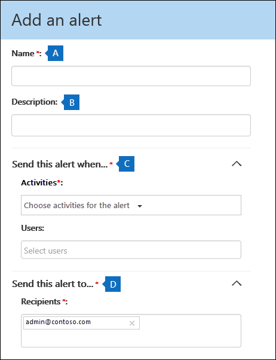

# 在 Office 365 中建立活動警示Create activity alerts in the Office 365

您可以建立會傳送給您的電子郵件通知當使用者在 Office 365 中執行特定活動活動警訊。You can create an activity alert that will send you an email notification when users perform specific activities in Office 365. 活動警訊類似於搜尋 Office 365 稽核記錄中的事件，不同之處在於您將會傳送電子郵件訊息已建立的提醒活動事件時，會發生情況。Activity alerts are similar to searching for events in the Office 365 audit log, except that you'll be sent an email message when an event for an activity that you've created an alert for happens. 
  
 **為什麼要使用活動提醒而不是搜尋稽核記錄？****Why use activity alerts instead of searching the audit log?** 可能會有特定類型的活動或真正想要了解特定使用者所執行的活動。There might be certain kinds of activity or activity performed by specific users that you really want to know about. 而不必搜尋這些活動的稽核記錄檔，請記得，您可以讓使用者在執行這些活動時，傳送電子郵件給您的 Office 365 使用活動警訊。Instead of having to remember to search the audit log for those activities, you can use activity alerts to have Office 365 send you an email message when users perform those activities. 例如，您可以建立活動警示來通知您，當使用者刪除 SharePoint 中的檔案，或您可以建立的提醒使用者永久刪除郵件從他們的信箱時通知您。For example, you can create an activity alert to notify you when a user deletes files in SharePoint or you can create an alert to notify you when a user permanently deletes messages from their mailbox. 電子郵件通知傳送給您包含執行哪些活動及執行它之使用者的相關資訊。The email notification sent to you includes information about which activity was performed and the user who performed it. 

> [!NOTE]
> 我們建議您開始使用中的安全性與合規性中心，而不是建立新的活動警訊的警示原則。We recommend that you start using alert policies in the security and compliance center instead of creating new activity alerts. 警示原則提供新增功能，例如建立任何使用者執行指定的活動，] 和 [安全性與合規性中心**檢視提醒**] 頁面上顯示提醒時，會觸發警示的警示原則的能力。Alert policies provide addition functionality such as the ability to create an alert policy that triggers an alert when any user performs a specified activity, and displaying alerts on the **View alerts** page in the security and compliance center. 如需詳細資訊，請參閱[警示原則](alert-policies.md)。For more information, see [Alert policies](alert-policies.md).
  
## 開始之前Before you begin

- 您必須獲指派安全性 & 管理活動警訊的合規性中心中的 [組織組態角色。You must be assigned the Organization Configuration role in the Security & Compliance Center to manage activity alerts. 根據預設，此角色被指派給 「 合規性管理員 」 和 「 組織管理的角色群組。By default, this role is assigned to the Compliance Administrator and Organization Management role groups. 如需新增成員至角色群組的詳細資訊，請參閱[讓使用者能夠存取至安全性 & 合規性中心](grant-access-to-the-security-and-compliance-center.md)。For more information about adding members to role groups, see [Give users access to the Security & Compliance Center](grant-access-to-the-security-and-compliance-center.md).
    
- 您 （或另一個系統管理員） 必須先開啟稽核記錄為您的組織之前便可以開始使用活動警訊。You (or another admin) must first turn on audit logging for your organization before you can start using activity alerts. 若要這麼做，剛**開始錄製使用者和系統管理員活動**頁面上按一下 [**活動警訊**。To do this, just click **Start recording user and admin activity** on the **Activity alerts** page. （如果您沒有看到此連結，稽核已開啟為您的組織。）您也可以開啟**稽核記錄搜尋**] 頁面的安全性 & 合規性中心中的稽核 (移至**搜尋** \> **稽核記錄搜尋**)。(If you don't see this link, auditing has already been turned on for your organization.) You can also turn on auditing on the **Audit log search** page in the Security & Compliance Center (go to **Search** \> **Audit log search**). 您只需要為組織執行一次。You only have to do this once for your organization.
  
- 您可以建立您可以在 Office 365 稽核記錄搜尋的相同活動警訊。You can create alerts for the same activities that you can search for in the Office 365 audit log. 請參閱 <<c0>的詳細資訊] 區段的常見案例 （和監視的特定活動） 的清單，您可以建立的提醒。See the [More information](#more-information) section for a list of common scenarios (and the specific activity to monitor) that you can create alerts for. 
    
- 您可以使用安全性 & 合規性中心中的**活動提醒**] 頁面上，若要建立提醒僅適用於貴組織的通訊錄中列出的使用者所執行的活動。You can use the **Activity alerts** page in the Security & Compliance Center to create alerts only for activity performed by users who are listed in your organization's address book. 您無法使用此頁面來建立未列在通訊錄中的外部使用者所執行的活動警訊。You can't use this page to create alerts for activity performed by external users who aren't listed in the address book. 
    
## 建立活動警示Create an activity alert

1. 移至 [https://protection.office.com/managealerts](https://protection.office.com/managealerts)。Go to [https://protection.office.com/managealerts](https://protection.office.com/managealerts).
    
2. 使用公司或學校帳戶登入 Office 365。Sign in to Office 365 using your work or school account.
    
3. 在 [**活動警訊**] 頁面上，按一下 [**新增**。On the **Activity alerts** page, click  **New**.

   若要建立的活動警訊彈出式頁面隨即顯示。The flyout page to create an activity alert is displayed.

    
    
  
4. 完成下列欄位，以建立活動警示：Complete the following fields to create an activity alert:
    
    a.a. **名稱**-輸入警示的名稱。**Name** - Type a name for the alert. 警示名稱必須是貴組織中唯一的。Alert names must be unique within your organization.
    
    b.b. **描述**（選用）-描述警示，例如活動和使用者正在追蹤，以及使用者的電子郵件通知傳送給。**Description** (Optional) - Describe the alert, such as the activities and users being tracked, and the users that email notifications are sent to. 描述提供快速又簡單的方式來描述用於其他系統管理員警示的用途。Descriptions provide a quick and easy way to describe the purpose of the alert to other admins.
    
    c.c. **警示類型**-請確定已選取 [**自訂**] 選項。**Alert type** - Make sure the **Custom** option is selected. 

    d.d. **傳送此警示時**按一下 [**傳送這時發出警示**，然後設定這兩個欄位：**Send this alert when** - Click **Send this alert when** and then configure these two fields:
    
    - **活動**-按一下下拉式清單，顯示您可以建立的提醒的活動。**Activities** - Click the drop-down list to display the activities that you can create an alert for. 這是您 Office 365 稽核記錄檔中搜尋時，會顯示相同活動清單。This is the same activities list that's displayed when you search the Office 365 audit log. 您可以選取一或多個特定活動，或您可以按一下 [活動群組名稱來選取] 群組中的所有活動。You can select one or more specific activities or you can click the activity group name to select all activities in the group. 如需這些活動的說明，請參閱 <<c0>搜尋稽核記錄檔的 「 稽核活動 」 一節。For a description of these activities, see the "Audited activities" section in [Search the audit log](search-the-audit-log-in-security-and-compliance.md#audited-activities). 當使用者執行任何您已新增至警示的活動時，會傳送電子郵件通知。When a user performs any of the activities that you've added to the alert, an email notification is sent. 
    
     - **使用者**-按一下此方塊，然後選取一或多個使用者。**Users** - Click this box and then select one or more users. 如果在此方塊中的使用者執行的活動，新增至 [**活動**] 方塊中，將會傳送警示。If the users in this box perform the activities that you added to the **Activities** box, an alert will be sent. 將 [**使用者**] 方塊保留空白時所要傳送提醒您組織中的任何使用者執行警示所指定的活動。Leave the **Users** box blank to send an alert when any user in your organization performs the activities specified by the alert. 

    e.e. **傳送到此警示**-按一下 [**傳送此警示**，然後按一下 [**收件者**] 方塊中，輸入要新增將會收到電子郵件通知時 （在 [**使用者**] 方塊中指定） 會在使用者執行活動, 的使用者名稱 (指定中**活動**方塊）。**Send this alert to** - Click **Send this alert**, and then click in the **Recipients** box and type a name to add a users who will receive an email notification when a user (specified in the **Users** box) performs an activity (specified in the **Activities** box). 請注意，您預設會加入至收件者的清單。Note that you are added to the list of recipients by default. 您可以從此清單移除您的名稱。You can remove your name from this list.
    
5. 按一下 [**儲存**] 以建立警示。Click **Save** to create the alert. 
    
    在 [**活動警訊**] 頁面上的清單中顯示新提醒。The new alert is displayed in the list on the **Activity alerts** page. 
    
    ![[活動提醒] 頁面上顯示提醒的清單](media/02b774f2-1719-41de-bbc9-5e5b7576f335.png)
  
    警示的狀態設為**上**。The status of the alert is set to **On**. 請注意，也會列出的收件者將收到的電子郵件通知時，會傳送警示。Note that the recipients who will received an email notification when an alert is sent are also listed. 
  
## 關閉活動警示Turn off an activity alert

您可以關閉活動警訊，因此不會傳送電子郵件通知。You can turn off an activity alert so that an email notification isn't sent. 關閉的活動警訊之後，仍會顯示組織的活動警訊的清單中，您仍然可以檢視其屬性。After you turn off the activity alert, it's still displayed in the list of activity alerts for your organization, and you can still view its properties.
  
1. 移至移至[https://protection.office.com/managealerts](https://protection.office.com/managealerts)。Go to Go to [https://protection.office.com/managealerts](https://protection.office.com/managealerts).
    
2. 使用公司或學校帳戶登入 Office 365。Sign in to Office 365 using your work or school account.
    
3. 在您組織的活動警訊的清單中，按一下您想要關閉提醒。In the list of activity alerts for your organization, click the alert that you want to turn off.
    
4. 在 [**編輯提醒**] 頁面上，按一下 [**上**切換切換狀態變更為 [**關閉**]，然後按一下 [**儲存**。On the **Edit alert** page, click the **On** toggle switch to change the status to **Off**, and then click **Save**.
    
    **活動警訊**頁面上的提醒的狀態設為**關閉**。The status of the alert on the **Activity alerts** pages is set to **Off**. 
    
若要將活動警訊重新開啟，只要重複這些步驟，然後按一下 [**關閉**切換開關狀態變更為**上**。To turn an activity alert back on, just repeat these steps and click the **Off** toggle switch to change the status to **On**.
  
## 詳細資訊More information

- 以下是範例電子郵件通知傳送給寄件備份此警示安全性 & 合規性中心中欄位 （和**活動警訊**] 頁面上列出下的**收件者**） 中所指定的使用者。Here's an example of the email notification that is sent to the users that are specified in the Sent this alert to field (and listed under **Recipients** on the **Activity alerts** page ) in the Security & Compliance Center. 
    
    
  
- 以下是一些常見文件和電子郵件的活動，您可以建立活動警示的。Here's are some common document and email activities that you can create an activity alerts for. 表格說明活動、 建立提醒的活動名稱以及活動**活動**下拉式清單中，會列在下方的 [活動] 群組的名稱。The tables describes the activity, the name of the activity to create an alert for, and the name of the activity group that the activity is listed under in the **Activities** drop-down list. 若要查看您可以建立的活動警訊的活動的完整清單，請參閱 <<c0>搜尋稽核記錄檔的 「 稽核活動 」 一節。To see a complete list of the activities that you can create activity alerts for, see the "Audited activities" section in [Search the audit log](search-the-audit-log-in-security-and-compliance.md#audited-activities).
    
    > [!TIP]
    > 您可能想要建立只有一個活動所執行的任何使用者活動警訊。You might want to create an activity alert for just one activity that's performed by any user. 您可能想要建立活動警示追蹤多個由一或完了執行的活動，或使用者。Or you might want to create an activity alert that track multiple activities performed by one or mores users. 
  
    下表列出一些常見的文件相關的活動 SharePoint 或商務用 OneDrive 中。The following table lists some common document-related activities in SharePoint or OneDrive for Business.
    
    |**當使用者執行此動作...]****When a user does this...**|**建立活動警示****Create an alert for this activity**|**活動群組****Activity group**|
    |:-----|:-----|:-----|
    |檢視網站的文件。Views a document on a site.    |存取的檔案Accessed file    |檔案及資料夾活動File and folder activities    |
    |編輯或變更文件。Edits or changes a document.    |修改的檔案Modified file    |檔案及資料夾活動File and folder activities    |
    |與組織外部使用者共用文件。Shares a document with a user outside of your organization.    |共用檔案、 資料夾或網站Share file, folder, or site    AndAnd    建立共用邀請Created sharing invitation    如需詳細資訊，請參閱 <<c0>使用 Office 365 稽核記錄檔中的共用稽核。For more information, see [Use sharing auditing in the Office 365 audit log](use-sharing-auditing.md).    |共用和存取要求活動Sharing and access request activities    |
    |上傳或下載的文件。Uploads or downloads a document.    |上傳的檔案Uploaded file    及 （或)And/or    下載的檔案Downloaded file    |檔案及資料夾活動File and folder activities    |
    |變更網站的存取權限。Changes the access permissions to a site.    |修改的網站權限Modified site permissions    |網站管理活動Site administration activities    |

    下表列出一些常見的電子郵件相關的活動 in Exchange Online。The following table lists some common email-related activities in Exchange Online.

    |**當使用者執行此動作...]****When a user does this...**|**建立活動警示****Create an alert for this activity**|**活動群組****Activity group**|
    |:-----|:-----|:-----|
    |永久刪除 （清除） 電子郵件從他們的信箱。Permanently deletes (purges) an email message from their mailbox.    |從信箱清除的郵件Purged messages from mailbox    | Exchange 信箱活動Exchange mailbox activities    |
    |從共用信箱傳送電子郵件訊息。Sends an email message from a shared mailbox.    |傳送訊息使用傳送為 」 權限Sent message using Send As permissions    AndAnd    傳送訊息使用傳送代理者權限Sent message using Send On Behalf permissions    | Exchange 信箱活動Exchange mailbox activities    |
   
- 您也可以使用安全性 & 合規性中心 PowerShell 中的**New-activityalert**和**Set-activityalert** cmdlet 來建立及編輯活動警訊。You can also use the **New-ActivityAlert** and **Set-ActivityAlert** cmdlets in Security & Compliance Center PowerShell to create and edit activity alerts. 如果您使用這些 cmdlet 來建立或編輯活動警訊，請謹記下列事項：Keep the following things in mind if you use these cmdlets to create or edit activity alerts: 
    
  - 如果您使用 cmdlet 來將活動新增至未列在 [**活動**] 下拉式清單中的警示時，會顯示訊息中會說: 「 此警示中有未列在選擇器中的自訂作業 」。 此警示的屬性頁面上If you use a cmdlet to add an activity to the alert that isn't listed in the **Activities** drop-down list, a message is displayed in on the property page for the alert that says, "This alert has custom operations not listed in the picker." 
    
  - 若要使用 cmdlet 來建立或編輯活動警訊良好原因，是為了將電子郵件通知傳送給組織外部人員。A good reason to use the cmdlets to create or edit an activity alert is to send email notifications to someone outside of your organization. 這個外部使用者將列中的警示的收件者清單。This external user will be listed in the list of recipients for the alert. 但是，如果您將這個外部使用者移除警示時，該使用者不能重新加入至警示藉由使用 [**編輯提醒**] 頁面。But if you remove this external user from the alert, that user can't be re-added to the alert by using the **Edit alert** page. 您將必須重新新增外部使用者使用**Set-activityalert** cmdlet 時，或使用**New-activityalert**指令程式來將同一個 （或不同） 的外部使用者新增至新的警示。You'll have to re-add the external user using the **Set-ActivityAlert** cmdlet, or use the **New-ActivityAlert** cmdlet to add the same (or different) external user to a new alert. 
