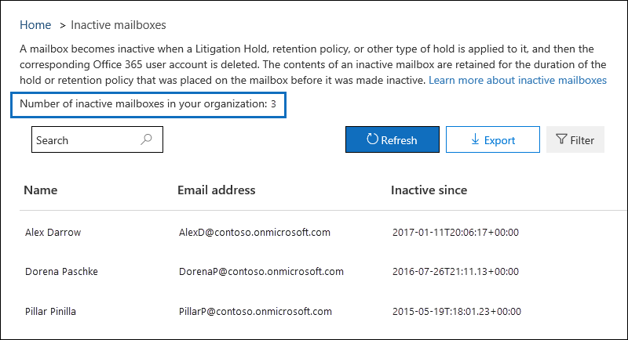

# <a name="create-and-manage-inactive-mailboxes-in-office-365"></a>建立及管理 Office 365 中的非使用中信箱

Office 365 可讓您保留已刪除信箱的內容。 這項功能稱為[非使用中信箱](inactive-mailboxes-in-office-365.md)。 非使用中信箱可讓您離開組織之後保留先前的員工電子郵件。 信箱成為非使用中的訴訟暫止狀態或者 （在 Office 365 或 Microsoft 365 安全性與合規性中心] 中建立） 的 Office 365 保留原則套用到信箱的對應的 Office 365 使用者帳戶會在刪除之前。 已進行非使用中之前，已處於信箱的保留期間內仍會保留不在作用中信箱的內容。 這可讓系統管理員、 法務人員，並記錄管理員使用內容搜尋來搜尋並匯出非使用中信箱的內容。 非作用中的信箱無法接收電子郵件，也不會顯示於貴組織的共用通訊錄或其他清單中。
  
> [!NOTE]
> 我們已將 2017 年 7 月 1 日的期限延後，以建立新的「就地保留」來建立非使用中的信箱。但到今年年底或明年年初，您將無法在 Exchange Online 中建立新的「就地保留」。到時，只有「訴訟資料暫留」和 Office 365 保留原則可以用來建立非使用中的信箱。不過，仍會支援「就地保留」上現有的非使用中信箱，並且您可以繼續管理非使用信箱上的「就地保留」。這包括變更「就地保留」期間，以及透過移除「就地保留」永久刪除非使用中的信箱。 
  
## <a name="before-you-begin"></a>開始之前

- 若要停用信箱，它必須指派 Exchange Online Plan 2 授權使訴訟暫止狀態或 Office 365 保留原則可以套用到信箱會在刪除之前。 Exchange Online Plan 2 授權是 Office 365 企業版 E3 和 E5 訂閱的一部分。 如果信箱指派 Exchange Online Plan 1 授權 （這是 Office 365 企業版 E1 訂閱的一部分），您必須將其指派不同的 Exchange Online Archiving 授權，這樣會在刪除之前，可以對信箱套用保留。 如需詳細資訊，請參閱[Exchange Online Archiving](https://go.microsoft.com/fwlink/p/?LinkId=286153)。
    
- 當您刪除對應的 Office 365 使用者帳戶之後則可使用 [刪除的 Exchange Online 信箱相關聯的授權。 然後您可以[將商務用 Office 365 中的使用者的授權指派](https://support.office.com/article/997596b5-4173-4627-b915-36abac6786dc)給另一個使用者。 
    
- 如果訴訟暫止狀態或 Office 365 保留原則不會套用到信箱會在刪除之前，信箱的內容不會被保留或提供搜索。 不過，刪除的 30 天內可復原已刪除的信箱，但信箱及其內容將被永久刪除超過 30 天後如果它不復原。
    
- 如需有關訴訟暫止狀態的詳細資訊，請參閱[就地保留與訴訟暫止](https://go.microsoft.com/fwlink/p/?LinkId=846124)。 如需 Office 365 保留原則的詳細資訊，請參閱 < <b0>Overview of Office 365 中的保留原則</b0>。
  
## <a name="create-an-inactive-mailbox"></a>建立非使用中信箱

讓信箱不在作用中包含兩個步驟： 1） 啟用信箱訴訟暫止狀態或 Office 365 保留原則套用到其中，和 2） 刪除的信箱或對應的 Office 365 使用者帳戶。 非使用中信箱後，其內容會保留直到移除保留或保留原則。
  
### <a name="step-1-place-a-mailbox-on-litigation-hold-or-apply-an-office-365-retention-policy"></a>步驟 1： 將信箱設為訴訟暫止或適用於 Office 365 保留原則

將信箱置於訴訟暫止狀態或套用 Office 365 保留原則會保留在信箱中的內容會在刪除之前。 這兩種類型的保留會保留所有信箱內容，包括已刪除的項目和已修改項目的原始版本。 在指定期間內，或直到您永久刪除非使用中信箱移除保留或保留原則套用至非使用中的信箱不在作用中信箱會保留已刪除及修改的項目。
  
如果已暫留時保留信箱，或 Office 365 保留原則已套用至信箱，您只需要是刪除對應的 Office 365 使用者帳戶，在步驟 2 中所述。
  
將信箱置於訴訟暫止狀態或將 Office 365 保留原則套用的逐步程序，請參閱：
  
- [將信箱設定為訴訟資料暫留狀態](https://go.microsoft.com/fwlink/?linkid=856286)
    
- [在 Office 365 中的保留原則概觀](retention-policies.md)
    
> [!NOTE]
> 訴訟保留與 Office 365 保留原則，您可以建立設為無限期保留，或在時間型保留。 在無限期保留，非使用中信箱的內容會保留不限次數，或直到移除保留，或直到變更保留持續時間。 保留或保留原則移除 （假設信箱已刪除超過 30 天） 後，在作用中的信箱會被標示為永久刪除信箱的內容將不再是保留或提供搜索。 在時間型保留或 Office 365 保留原則中，您可以指定保留的期限。 此持續時間視個別項目而定，會從接收或建立信箱項目的日期開始計算。 保留逾期的信箱項目，並表示項目移至或非使用中信箱中的 [可復原的項目] 資料夾位於之後，項目會永久刪除 （清除） 從非使用中的信箱已刪除的項目保留期間到期後。 
  
### <a name="step-2-delete-the-mailbox"></a>步驟 2：刪除信箱

信箱處於保留狀態或 Office 365 保留原則套用至它之後下, 一步是要刪除信箱。 若要刪除的信箱，最好是要刪除對應的 Office 365 使用者帳戶，在 Microsoft 365 系統管理中心。 如需刪除 Office 365 使用者帳戶的相關資訊，請參閱[刪除您的組織中的使用者](https://support.office.com/article/d5155593-3bac-4d8d-9d8b-f4513a81479e)。
  
> [!NOTE]
> 您也可以在 Exchange Online PowerShell 中使用**Remove-mailbox** cmdlet 刪除信箱。 如需詳細資訊，請參閱[刪除或還原使用者信箱在 Exchange Online](https://go.microsoft.com/fwlink/?linkid=856287)。 
  

## <a name="view-a-list-of-inactive-mailboxes"></a>檢視清單中的非使用中信箱

若要檢視您組織中的非使用中信箱的清單：
  
1. 移至 [[https://protection.office.com](https://protection.office.com)並登入 Office 365 組織中系統管理員帳戶使用的認證。 
    
2. 按一下 [**資料控管** > **保留**。
    
3. 在 [**保留**] 頁面上，按一下 [**更多**，然後按一下 [**非使用中信箱**。
    
    ![在 [保留] 頁面上，按一下 [更多，，然後按一下 [非使用中的信箱，以顯示不在作用中信箱的清單](media/761bd90c-3e37-48f9-b1b9-479e90fea267.png)
  
    會顯示 [**非使用中信箱**] 頁面。 請注意隨即出現在組織中的非使用中信箱總數。 
    
    
  
或者，您可以執行下列命令在 Exchange Online PowerShell 來顯示非使用中信箱的清單。

```
 Get-Mailbox -InactiveMailboxOnly | FT DisplayName,PrimarySMTPAddress,WhenSoftDeleted
```

您可以按一下 [**匯出**來檢視或下載 CSV 檔案包含您組織中的非使用中信箱的其他資訊。 
  
您也可以執行下列命令，以將非使用中信箱的清單和其他資訊匯出至 CSV 檔案。 在這個範例中，CSV 檔案被建立在目前的目錄。

```
Get-Mailbox -InactiveMailboxOnly | Select Displayname,PrimarySMTPAddress,DistinguishedName,ExchangeGuid,WhenSoftDeleted | Export-Csv InactiveMailboxes.csv -NoType
```
   
> [!NOTE]
> 很可能不在作用中信箱可能會有相同的 SMTP 地址為作用中使用者信箱。 在此情況下，[ **DistinguishedName** ] 或 [ **ExchangeGuid**屬性值可以用來唯一地識別非使用中的信箱。 
  
## <a name="search-and-export-the-contents-of-an-inactive-mailbox"></a>搜尋並匯出非使用中信箱的內容

您可以藉由使用安全性 & 合規性中心中的內容搜尋工具來存取非使用中信箱的內容。 在搜尋非使用中的信箱時，您可以建立關鍵字搜尋查詢以搜尋特定項目，也可以傳回非使用中信箱的完整內容。 您可以預覽搜尋結果，或匯出搜尋結果到 Outlook 資料 (PST) 檔案或以個別的電子郵件訊息。 搜尋信箱及匯出搜尋結果的逐步程序，請參閱下列主題：
  
- [Office 365 中的內容搜尋](content-search.md)
    
- [匯出內容搜尋結果](export-search-results.md)
    
以下是搜尋非使用中信箱時，請牢記的一些事項。
  
- 如果內容搜尋包含使用者信箱，而且該信箱接著就會成為非使用中，內容搜尋會繼續搜尋非使用中的信箱，當您重新執行搜尋後變成非使用中。
    
- 在某些情況下，使用者可能會有作用中信箱和擁有相同的 SMTP 地址不在作用中信箱。 在此情況下，只有您選取 [內容搜尋的位置為特定的信箱可供搜尋。 也就是說，如果您將使用者的信箱新增至搜尋時，您不能假定，其作用中且非使用中的信箱可供搜尋;將搜尋明確新增至搜尋的信箱。
    
- 我們強烈建議您避免有作用中信箱和非使用中信箱的相同的 SMTP 地址。 如果您要重複使用目前指派給非使用中信箱的 SMTP 地址，我們建議您復原非使用中信箱或非使用中信箱的內容還原至作用中信箱 （或 [作用中信箱的封存），然後刪除非使用中信箱。
    
## <a name="change-the-hold-duration-for-an-inactive-mailbox"></a>變更非作用中信箱的保留持續時間

信箱進行非使用中之後，您可以變更保留或 Office 365 保留原則套用至非使用中信箱的期間。 如需逐步程序，請參閱[變更 Office 365 中的非使用中信箱的保留期間](change-the-hold-duration-for-an-inactive-mailbox.md)。
  
## <a name="recover-an-inactive-mailbox"></a>復原非作用中的信箱

如果將離職員工返回您的組織，或是新進員工雇用採取承接已離開員工工作職責，您可以復原非使用中信箱的內容。 當您復原不在作用中的信箱時，信箱轉換成新的信箱、 保留的內容和非使用中的信箱資料夾結構，及信箱連結至新的使用者帳戶。 它會復原之後，非使用中的信箱不存在。 進行逐步程序與相關的詳細資訊後，當您復原非使用中的信箱，請參閱[復原非使用中信箱 Office 365 中](recover-an-inactive-mailbox.md)。
  
## <a name="restore-the-contents-of-an-inactive-mailbox-to-another-mailbox"></a>非使用中信箱的內容還原至另一個信箱

如果另一位員工承擔離職員工，工作職責或其他人員需要存取非使用中信箱的內容，您可以還原 （或合併） 到現有的信箱不在作用中信箱的內容。 當您還原非使用中信箱內容複製到另一個信箱。 非使用中的信箱，則會保留與會維持不在作用中的信箱。 非使用中信箱仍可搜尋使用 eDiscovery、 其內容可以還原至另一個信箱，或復原或刪除日後。 如需逐步程序，請參閱 <<c0>還原 Office 365 中的非使用中信箱。
  
## <a name="delete-an-inactive-mailbox"></a>刪除非作用中的信箱

如果您不再需要保留非使用中信箱的內容，您可以永久刪除非使用中信箱移除保留或移除 Office 365 保留原則套用至非使用中信箱。 如果信箱已刪除超過 30 天，信箱將會標示為永久刪除之後移除保留，以及信箱將會變成非可復原。 如果信箱已刪除在過去 30 天內，您仍然可以復原信箱後移除保留或保留原則。 移除保留或永久刪除非使用中信箱 Office 365 保留原則的逐步程序，請參閱[刪除非使用中信箱 Office 365 中](delete-an-inactive-mailbox.md)。