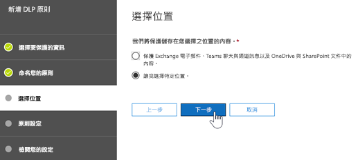
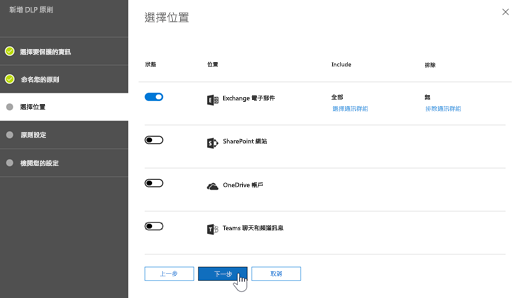
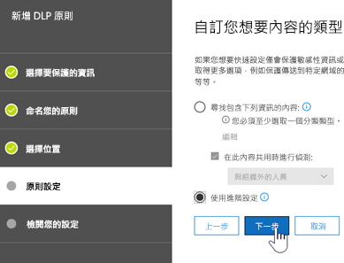
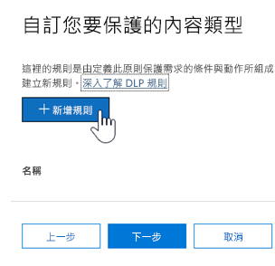
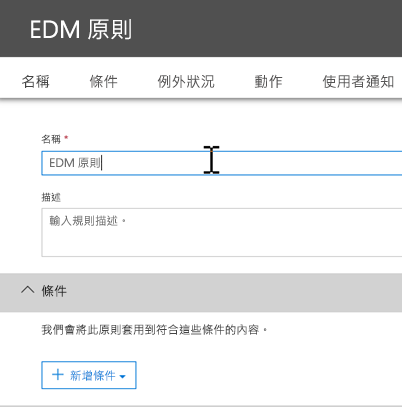
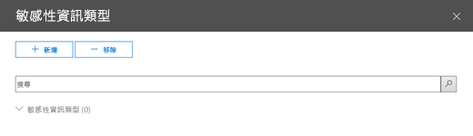

# <a name="create-custom-sensitive-information-types-with-exact-data-match-based-classification-preview"></a>使用以精確資料比對為基礎的分類建立自訂敏感性資訊類型 (預覽)

## <a name="overview"></a>概觀

[自訂敏感性資訊類型](custom-sensitive-info-types.md)用來協助防止意外或不當地共用敏感性資訊。 身為系統管理員，您可以使用[安全性與合規性中心](create-a-custom-sensitive-information-type.md)或 [PowerShell](create-a-custom-sensitive-information-type-in-scc-powershell.md) 來根據模式、辨識項 (關鍵字如*員工*、*徽章*、*識別碼*等)、鄰近字元 (辨識項與特定模式中字元的鄰近程度)，以及信賴等級，來定義自訂敏感性資訊類型。 這類的自訂敏感性資訊類型符合許多組織的業務需求。

不過，如果您想要使用確切資料值，而非使用模式和鄰近的自訂敏感性資訊類型，該怎麼做？ 使用以精確資料比對 (EDM) 為基礎的分類，您可以建立其設計目的為以下的自訂敏感性資訊類型：
- 動態且可更新；
- 更可調整；
- 造成較少的誤判；
- 使用結構化的敏感性資料；
- 更安全地處理敏感性資訊；以及
- 能與數個 Microsoft 雲端服務搭配使用。


以 EDM 為基礎的分類可讓您建立自訂敏感性資訊類型，其參考敏感性資訊資料庫中的確切值。 資料庫可以每日或每週重新整理，而且可以包含最多 1 千萬列資料。 因此，隨著員工、病患或客戶來來去去，以及記錄變更，您的自訂敏感性資訊類型會維持最新且適用。 同時，您可以對原則使用以 EDM 為基礎的分類，例如[資料外洩防護原則](data-loss-prevention-policies.md) (DLP) 或 [Microsoft Cloud App Security 檔案原則](https://docs.microsoft.com/cloud-app-security/data-protection-policies)。

## <a name="required-licenses-and-permissions"></a>必要的授權和權限

- 您必須是全域管理員、合規性系統管理員或 Exchange Online 系統管理員才能執行本文所述的工作。 若要進一步了解 DLP 權限，請參閱[權限](data-loss-prevention-policies.md#permissions)。

- 在正式推出時，以 EDM 為基礎的分類將包含在下列訂閱中：
    - Office 365 E5
    - Microsoft 365 E5
    - Microsoft 365 資訊保護和合規性
    - Office 365 進階合規性

> [!NOTE]
> **以 EDM 為基礎的分類**目前對 [Office 365 (包含 Exchange Online 和 Microsoft Teams) 中的 DLP](data-loss-prevention-policies.md) 與 [Cloud App Security](https://docs.microsoft.com/cloud-app-security) 處於預覽。 如果您的組織有 [DLP 功能](https://docs.microsoft.com/office365/servicedescriptions/exchange-online-protection-service-description/messaging-policy-and-compliance-servicedesc#data-loss-prevention-dlp)，您可以嘗試以 EDM 為基礎的分類。 如果您還未加入預覽，請[連絡 Microsoft](https://resources.office.com/us-landing-spe-contactus.html?LCID=EN-US) 來開始。 

## <a name="the-work-flow-at-a-glance"></a>工作流程概覽

|階段  |需要的項目  |
|---------|---------|
|[第 1 部分：設定以 EDM 為基礎的分類](#part-1-set-up-edm-based-classification)<br/><br/>(視需要)<br/>- [編輯資料庫結構描述](#editing-the-schema-for-edm-based-classification) <br/>- [移除結構描述](#removing-the-schema-for-edm-based-classification) |- 敏感性資料的讀取存取權<br/>- .xml 格式的資料庫結構描述 (提供範例)<br/>- .xml 格式的規則套件 (提供範例)<br/>- 安全性與合規性中心的系統管理員權限 (使用 PowerShell) |
|[第 2 部分：編製索引及上傳敏感性資料](#part-2-index-and-upload-the-sensitive-data)<br/><br/>(視需要)<br/>[重新整理資料](#refreshing-your-sensitive-information-database) |- 自訂安全性群組和使用者帳戶<br/>- 具有 EDM 上傳代理程式電腦的本機系統管理員存取權<br/>- 敏感性資料的讀取存取權<br/>- 重新整理資料的程序和排程|
|[第 3 部分：使用以 EDM 為基礎的分類搭配 Microsoft 雲端服務](#part-3-use-edm-based-classification-with-your-microsoft-cloud-services) |- 具有 DLP 的 Office 365 訂閱<br/>- 已啟用以 EDM 為基礎的分類功能 (預覽) |

## <a name="part-1-set-up-edm-based-classification"></a>第 1 部分：設定以 EDM 為基礎的分類

設定和配置以 EDM 為基礎的分類涉及將敏感性資料儲存為 .csv 格式、定義您的敏感性資訊的資料庫結構描述、建立規則套件，以及上傳結構描述和規則套件。

### <a name="define-the-schema-for-your-database-of-sensitive-information"></a>定義用於敏感性資訊的資料庫結構描述

1. 找出您要使用的敏感性資訊。 將資料匯出至應用程式，例如 Microsoft Excel，並將檔案以 .csv 格式儲存。 資料檔案可能包含：

    - 最多 1 千萬列敏感性資料
    - 每個資料來源最多 32 個資料欄 (欄位)

2. 以 .csv 檔案格式將敏感性資料結構化，使得第一列包含用於以 EDM 為基礎的分類的欄位名稱。 在您的 .csv 檔案中，您可能會有欄位名稱，例如 "ssn"、"birthdate"、"firstname"、"lastname"，依此類推。 舉例來說，我們的 .csv 檔案稱為 *PatientRecords.csv*，且其資料欄包括 *PatientID*、*MRN*、*lastname*、*FirstName*、*SSN* 等。

3. 以 .xml 格式定義用於敏感性資訊的資料庫結構描述 (類似以下的範例)。 將此結構描述檔案命名為 `edm.xml`，然後設定它，使得資料庫中的每一個資料欄，都會有使用語法 `<Field name="" unique="" searchable=""/>` 的行。 

    - 使用資料欄名稱作為*欄位名稱*值。
    - 對包含唯一值 (社會安全號碼、識別碼等) 的欄位使用 *unique="true"*；否則請使用 *unique="false"*。
    - 對您想讓它可供搜尋的欄位使用 *searchable="true"*。 請勿對每個資料庫指定超過五個可供搜尋的欄位。 其餘欄位都應該有 *searchable="false"*。  

    例如，下列 .xml 檔會為病患記錄資料庫定義結構描述，並將五個欄位指定為可供搜尋：*PatientID*、*MRN*、*SSN*、*電話*以及 *DOB*。 
    
    (您可以複製、修改及使用我們的範例。)
    
    ```<?xml version="1.0" encoding="utf-8"?> <EdmSchema xmlns="http://schemas.microsoft.com/office/2018/edm">
        <DataStore name="PatientRecords" description="病患記錄的結構描述" version="1">
            <Field name="PatientID" unique="false" searchable="true" /> <Field name="MRN" unique="false" searchable="true" />
            <Field name="FirstName" unique="false" searchable="false" />
            <Field name="LastName" unique="false" searchable="false" />
            <Field name="SSN" unique="false" searchable="true" />
            <Field name="Phone" unique="false" searchable="true" />
            <Field name="DOB" unique="false" searchable="true" />
            <Field name="Gender" unique="false" searchable="false" />
            <Field name="Address" unique="false" searchable="false" />
        </DataStore>
    </EdmSchema>
    ```

4. [Connect to Office 365 Security & Compliance Center PowerShell](https://docs.microsoft.com/powershell/exchange/office-365-scc/connect-to-scc-powershell/connect-to-scc-powershell?view=exchange-ps).

5. To upload the database schema, run the following cmdlets, one at a time:

    `$edmSchemaXml=Get-Content .\edm.xml -Encoding Byte -ReadCount 0`

    `New-DlpEdmSchema -FileData $edmSchemaXml -Confirm:$true`

    You will be prompted to confirm, as follows:

       Confirm
       Are you sure you want to perform this action?
       New EDM Schema for the data store 'patientrecords' will be imported.
       [Y] Yes  [A] Yes to All  [N] No  [L] No to All  [?] Help (default is "Y"):

    > [!TIP]
    > If you want your changes to occur without confirmation, in Step 5, use this cmdlet instead: `New-DlpEdmSchema -FileData $edmSchemaXml`
    
Now that the schema for your database of sensitive information is defined, the next step is to set up a rule package. Proceed to the section [Set up a rule package](#set-up-a-rule-package).

#### Editing the schema for EDM-based classification 

(As needed) If you want to make changes to your edm.xml file, such as changing which fields are used for EDM-based classification, follow these steps:

1. Edit your edm.mxl file (this is the file discussed in the [Define the schema](#define-the-schema-for-your-database-of-sensitive-information) section of this article).

2. [Connect to Office 365 Security & Compliance Center PowerShell](https://docs.microsoft.com/powershell/exchange/office-365-scc/connect-to-scc-powershell/connect-to-scc-powershell?view=exchange-ps).

3. To update your database schema, run the following cmdlets, one at a time:

    `$edmSchemaXml=Get-Content .\edm.xml -Encoding Byte -ReadCount 0`

    `Set-DlpEdmSchema -FileData $edmSchemaXml -Confirm:$true`

    You will be prompted to confirm, as follows:

       Confirm
       Are you sure you want to perform this action?
       EDM Schema for the data store 'patientrecords' will be updated.
       [Y] Yes  [A] Yes to All  [N] No  [L] No to All  [?] Help (default is "Y"):

    > [!TIP]
    > If you want your changes to occur without confirmation, in Step 3, use this cmdlet instead: `Set-DlpEdmSchema -FileData $edmSchemaXml`

#### Removing the schema for EDM-based classification

(As needed) If you want to remove the schema you're using for EDM-based classification, follow these steps:

1. [Connect to Office 365 Security & Compliance Center PowerShell](https://docs.microsoft.com/powershell/exchange/office-365-scc/connect-to-scc-powershell/connect-to-scc-powershell?view=exchange-ps).

2. Run the following PowerShell cmdlet, substituting the data store name of "patientrecords" with the one you want to remove:

    `Remove-DlpEdmSchema -Identity patientrecords`

     You will be prompted to confirm, as follows:
    
       Confirm
       Are you sure you want to perform this action?
       EDM Schema for the data store 'patientrecords' will be removed.
       [Y] Yes  [A] Yes to All  [N] No  [L] No to All  [?] Help (default is "Y"):
    
    > [!TIP]
    > If you want your changes to occur without confirmation, in Step 2, use this cmdlet instead: `Remove-DlpEdmSchema -Identity patientrecords -Confirm:$false`

### Set up a rule package

1. Create a rule package in .xml format (with Unicode encoding), similar to the following example. (You can copy, modify, and use our example.) 

   Recall from the previous procedure that our PatientRecords schema defines five fields as searchable: *PatientID*, *MRN*, *SSN*, *Phone*, and *DOB*. Our example rule package includes those fields and references the database schema file (edm.xml), with one *ExactMatch* items per searchable field. Consider the following ExactMatch item:

   ```
    <ExactMatch id = "E1CC861E-3FE9-4A58-82DF-4BD259EAB371" patternsProximity = "300" dataStore ="PatientRecords" recommendedConfidence = "65" > <Pattern confidenceLevel="65"> <idMatch matches = "SSN" classification = "U.S. Social Security Number (SSN)" /> </Pattern> </ExactMatch>
   ```

    In this example, note the following:

    - The dataStore name references the .csv file we created earlier: **dataStore = "PatientRecords"**.
    - The idMatch value references a searchable field that is listed in the database schema file: **idMatch matches = "SSN"**.
    - The classification value references an existing or custom sensitive information type: **classification = "U.S. Social Security Number (SSN)"**. (In this case, we use the existing sensitive information type of U.S. Social Security Number.)

    When you set up your rule package, make sure to correctly reference your .csv file and edm.xml file. (You can copy, modify, and use our example.) 

    ```<?xml version="1.0" encoding="utf-8"?>
    <RulePackage xmlns="http://schemas.microsoft.com/office/2018/edm">
      <RulePack id="fd098e03-1796-41a5-8ab6-198c93c62b11">
        <Version build="0" major="2" minor="0" revision="0" />
        <Publisher id="eb553734-8306-44b4-9ad5-c388ad970528" />
        <Details defaultLangCode="en-us">
          <LocalizedDetails langcode="en-us">
            <PublisherName>IP DLP</PublisherName>
            <Name>Health Care EDM Rulepack</Name>
            <Description>This rule package contains the EDM sensitive type for health care sensitive types.</Description>
          </LocalizedDetails>
        </Details>
      </RulePack>
      <Rules>
        <ExactMatch id = "E1CC861E-3FE9-4A58-82DF-4BD259EAB371" patternsProximity = "300" dataStore ="PatientRecords" recommendedConfidence = "65" >
          <Pattern confidenceLevel="65">
            <idMatch matches = "SSN" classification = "U.S. Social Security Number (SSN)" />
          </Pattern>
          <Pattern confidenceLevel="75">
            <idMatch matches = "SSN" classification = "U.S. Social Security Number (SSN)" />
            <Any minMatches ="3" maxMatches ="100">
              <match matches="PatientID" />
              <match matches="MRN"/>
              <match matches="FirstName"/>
              <match matches="LastName"/>
              <match matches="Phone"/>
              <match matches="DOB"/>
            </Any>
          </Pattern>
        </ExactMatch>
        <LocalizedStrings>
          <Resource idRef="E1CC861E-3FE9-4A58-82DF-4BD259EAB371">
            <Name default="true" langcode="en-us">Patient SSN Exact Match.</Name>
            <Description default="true" langcode="en-us">EDM Sensitive type for detecting Patient SSN.</Description>
          </Resource>
        </LocalizedStrings>
      </Rules>
    </RulePackage>
    ```
    
2. 執行下列 PowerShell Cmdlet，一次上傳一個規則套件：

    `$rulepack=Get-Content .\rulepack.xml -Encoding Byte -ReadCount 0`

    `New-DlpSensitiveInformationTypeRulePackage -FileData $rulepack`

此時，您已設定以 EDM 為基礎的分類。 下一個步驟是要對敏感性資料編製索引及上傳已編製索引的資料。 

## <a name="part-2-index-and-upload-the-sensitive-data"></a>第 2 部分：編製索引及上傳敏感性資料

在此階段，您會設定自訂安全性群組和使用者帳戶，並設定 EDM 上傳代理程式工具。 然後，您會使用工具來為敏感性資料編製索引，並上傳已編製索引的資料。

### <a name="set-up-the-security-group-and-user-account"></a>設定安全群組和使用者帳戶

1. 以全域系統管理員身分，移至系統管理中心 ([https://admin.microsoft.com](https://admin.microsoft.com)) 並建立名為 `EDM_DataUploaders` 的[安全性群組](https://docs.microsoft.com/office365/admin/email/create-edit-or-delete-a-security-group?view=o365-worldwide)。 

2. 將一或多個使用者新增至 *EDM_DataUploaders* 安全性群組。 (這些使用者將管理敏感性資訊的資料庫。)

3. 請確定管理敏感性資料的每個使用者，為用於 EDM 上傳代理程式之電腦上的本機系統管理員。

### <a name="set-up-the-edm-upload-agent"></a>設定 EDM 上傳代理程式

> [!NOTE]
> 在開始此程序之前，請確定您為 *EDM_DataUploaders* 安全性群組的成員和您的電腦上的本機系統管理員。

1. 在 [https://go.microsoft.com/fwlink/?linkid=2088639](https://go.microsoft.com/fwlink/?linkid=2088639) 下載並安裝 EDM 上傳代理程式。 根據預設，安裝位置應該為 `C:\Program Files\Microsoft\EdmUploadAgent`。 

2. 若要授權 EDM 上傳代理程式，請開啟 Windows 命令提示字元 (以系統管理員身分)，然後執行下列命令：

    `EdmUploadAgent.exe /Authorize`

3. 使用公司或學校帳戶登入 Office 365。

下一個步驟是使用 EDM 上傳代理程式來為敏感性資料編製索引，然後上傳已編製索引的資料。

### <a name="index-and-upload-the-sensitive-data"></a>編製索引及上傳敏感性資料

1. 將敏感性資料檔案 (回想我們的範例是 *PatientRecords.csv*) 儲存至電腦上的本機磁碟機。 (我們將範例 *PatientRecords.csv* 檔案儲存至 `C:\Edm\Data`。)

2. 若要為敏感性資料編製索引，請在 Windows 命令提示字元中執行下列命令：

    `EdmUploadAgent.exe /CreateHash /DataStoreName <DataStoreName> /DataFile <DataFilePath> /HashLocation <HashedFileLocation>`

    範例：**EdmUploadAgent.exe /CreateHash /DataStoreName PatientRecords /DataFile C:\Edm\Data\PatientRecords.csv /HashLocation C:\Edm\Hash** 

3. 若要上傳已編製索引的資料，請在 Windows 命令提示字元中執行下列命令：

    `EdmUploadAgent.exe /UploadHash /DataStoreName <DataStoreName> /HashFile <HashedSourceFilePath>`

    範例：**EdmUploadAgent.exe /UploadHash /DataStoreName PatientRecords /HashFile C:\Edm\Hash\PatientRecords.EdmHash** 

4. 若要確認您的敏感性資料已上傳，請在 Windows 命令提示字元執行下列命令：

    `EdmUploadAgent.exe /GetDataStore`

    您會看到資料儲存區的清單，以及上次更新時間，如下所示： <br/>

5. 針對[重新整理您的敏感性資訊資料庫](#refreshing-your-sensitive-information-database)，繼續設定程序和排程。

此時，您已準備好使用以 EDM 為基礎的分類搭配 Microsoft 雲端服務。 例如，您可以[使用以 EDM 為基礎的分類來設定 DLP 原則](#to-create-a-dlp-policy-with-edm)。 

### <a name="refreshing-your-sensitive-information-database"></a>重新整理您的敏感性資訊資料庫

您可以每日或每週重新整理您的敏感性資訊資料庫，而 EDM 上傳工具可以重新為敏感性資料編製索引，然後重新上傳已編製索引的資料。 

1. 決定您重新整理敏感性資訊資料庫的程序和頻率 (每日或每週)。

2. 將敏感性資料重新匯出至應用程式，例如 Microsoft Excel，並將檔案儲存為 .csv 格式。 當您遵循[編製索引及上傳敏感性資料](#index-and-upload-the-sensitive-data)中所述的步驟時，請保持使用相同的檔案名稱和位置。

    > [!NOTE]
    > 如果 .csv 檔案的結構 (欄位名稱) 沒有任何變更，重新整理資料時，您不需要對資料庫結構描述檔案進行任何變更。 但如果您必須進行變更，請務必相應地編輯[資料庫結構描述](#editing-the-schema-for-edm-based-classification)和[規則套件](#set-up-a-rule-package)。        

3. 使用[工作排程器](https://docs.microsoft.com/windows/desktop/TaskSchd/task-scheduler-start-page)來將[編製索引及上傳敏感性資料](#index-and-upload-the-sensitive-data)程序中的步驟 2 和 3 自動化。 您可以使用數個方法來排程工作：
    
    |方法  |處理方式  |
    |---------|---------|
    |Windows PowerShell     |請參閱 [ScheduledTasks](https://docs.microsoft.com/powershell/module/scheduledtasks/?view=win10-ps) 文件，以及本文中的[範例 PowerShell 指令碼](#example-powershell-script-for-task-scheduler)|
    |工作排程器 API |請參閱[工作排程器](https://docs.microsoft.com/windows/desktop/TaskSchd/using-the-task-scheduler)文件 |
    |Windows 使用者介面     |在 Windows 中，按一下 [開始]****，然後輸入 `Task Scheduler`。 然後在結果清單中，以滑鼠右鍵按一下 [工作排程器]****，然後選擇 [以系統管理員身分執行]****。          |

#### <a name="example-powershell-script-for-task-scheduler"></a>工作排程器的 PowerShell 指令碼

本節包含的範例 PowerShell 指令碼，可供您用來對編製資料索引及上傳已編製索引的資料工作進行排程：

```powershell
param([string]$dataStoreName,[string]$fileLocation)
# Assuming current user is also the user context to run the task
$user = "$env:USERDOMAIN\$env:USERNAME"
$edminstallpath = 'C:\Program Files\Microsoft\EdmUploadAgent\'
$edmuploader = $edminstallpath + 'EdmUploadAgent.exe'
$csvext = '.csv'
$edmext = '.EdmHash'
# Assuming CSV file name is same as data store name
$dataFile = "$fileLocation\$dataStoreName$csvext"
$hashFile = "$fileLocation\$dataStoreName$edmext"
# Assuming location to store hash file is same as the location of csv file
$hashLocation = $fileLocation
$createHashArgs = '/CreateHash /DataStoreName ' + $dataStoreName + ' /DataFile ' + $dataFile + ' /HashLocation ' + $hashLocation
$uploadHashArgs = '/UploadHash /DataStoreName ' + $dataStoreName + ' /HashFile ' + $hashFile
# Set up actions associated with the task
$actions = @()
$actions += New-ScheduledTaskAction -Execute $edmuploader -Argument $createHashArgs -WorkingDirectory $edminstallpath
$actions += New-ScheduledTaskAction -Execute $edmuploader -Argument $uploadHashArgs -WorkingDirectory $edminstallpath
# Set up trigger for the task
$trigger = New-ScheduledTaskTrigger -Weekly -DaysOfWeek Sunday -At 2am
# Set up task settings
$principal = New-ScheduledTaskPrincipal -UserId $user -LogonType S4U -RunLevel Highest
$settings = New-ScheduledTaskSettingsSet -RunOnlyIfNetworkAvailable -StartWhenAvailable -WakeToRun
# Create the scheduled task
$scheduledTask = New-ScheduledTask -Action $actions -Principal $principal -Trigger $trigger -Settings $settings
# Get credentials to run the task
$creds = Get-Credential -UserName $user -Message "Enter credentials to run the task"
$password=[Runtime.InteropServices.Marshal]::PtrToStringAuto([Runtime.InteropServices.Marshal]::SecureStringToBSTR($creds.Password))
# Register the scheduled task
$taskName = 'EDMUpload_' + $dataStoreName
Register-ScheduledTask -TaskName $taskName -InputObject $scheduledTask -User $user -Password $password
```
## <a name="part-3-use-edm-based-classification-with-your-microsoft-cloud-services"></a>第 3 部分：使用以 EDM 為基礎的分類搭配 Microsoft 雲端服務

您可以使用以 EDM 為基礎的分類搭配資訊保護功能，例如 [Office 365 DLP 原則](data-loss-prevention-policies.md)與 [Microsoft Cloud App Security 檔案原則](https://docs.microsoft.com/cloud-app-security/data-protection-policies)。 下列程序說明如何使用 EDM 搭配在 Office 365 安全性與合規性中心建立的 DLP 原則。

### <a name="to-create-a-dlp-policy-with-edm"></a>建立 DLP 原則來搭配 EDM

1. 前往安全性與合規性中心 ([https://protection.office.com](https://protection.office.com))。

2. 按一下 [資料外洩防護]****  >  [原則]****。

3. 選擇 [建立原則]****  >  [自訂]****  >  [下一步]****。

4. 在 [為您的原則命名]**** 索引標籤下，指定名稱和描述，然後選擇 [下一步]****。

5. 在 [選擇位置]**** 索引標籤上，按一下 [讓我選擇特定位置]****，然後按 [下一步]****。<br/><br/>

6. 在 [狀態]**** 資料欄中，選取 [Exchange 電子郵件]****，然後選擇 [下一步]****。 <br/><br/>

7. 在 [原則設定]**** 索引標籤上，選擇 [使用進階設定]****，然後選擇 [下一步]****。<br/><br/>

8. 選擇 [+ 新增規則]****。<br/><br/>

9. 在 [名稱]**** 區段中，指定規則的名稱和描述。<br/><br/>

10. 在 [條件]**** 區段中，於 [+ 新增條件]**** 清單中，選擇 [內容包含敏感性類型]****。<br/><br/>

11. 搜尋您設定規則套件時建立的敏感性資訊類型，然後選擇 [+ 新增]****。<br/><br/>然後選擇 [完成]****。

12. 完成選取規則的選項，例如**使用者通知**、**使用者覆寫**、**事件報告**，依此類推，然後選擇 [儲存]****。

13. 在 [原則設定]**** 索引標籤上，檢閱您的規則，然後選擇 [下一步]****。

14. 指定是否立即開啟原則、測試它，或是保持關閉。 接著選擇 [下一步]****。

15. 在 [檢閱您的設定]**** 索引標籤上，檢閱您的原則。 視需要進行變更。 完成後，選擇 [建立]****。

    > [!NOTE]
    > 允許大約一小時的時間，讓您的新 DLP 原則在您的整個資料中心生效。

## <a name="related-articles"></a>相關文章

[內建的敏感性資訊類型以及其尋求的目標](what-the-sensitive-information-types-look-for.md)

[自訂敏感性資訊類型](custom-sensitive-info-types.md)

[DLP 原則的概觀](data-loss-prevention-policies.md)

[Microsoft Cloud App Security](https://docs.microsoft.com/cloud-app-security)
