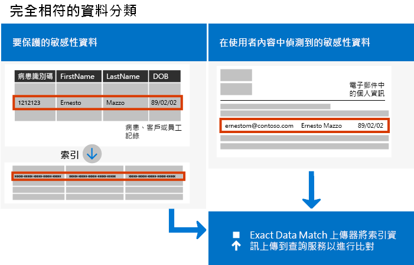
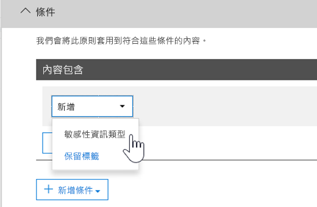

# <a name="create-custom-sensitive-information-types-with-exact-data-match-based-classification"></a>使用以精確資料比對為基礎的分類建立自訂敏感性資訊類型

## <a name="overview"></a>概觀


  [自訂敏感性資訊類型](https://docs.microsoft.com/zh-TW/office365/securitycompliance/custom-sensitive-info-types) 用來協助防止意外或不當地共用敏感性資訊。 身為系統管理員，您可以使用 [安全性與合規性中心](https://docs.microsoft.com/zh-TW/office365/securitycompliance/create-a-custom-sensitive-information-type) 或 [PowerShell](https://docs.microsoft.com/zh-TW/office365/securitycompliance/create-a-custom-sensitive-information-type-in-scc-powershell) 來根據模式、辨識項 (關鍵字如 *員工*、 *徽章*、 *識別碼*等)、鄰近字元 (辨識項與特定模式中字元的鄰近程度)，以及信賴等級，來定義自訂敏感性資訊類型。 這類自訂敏感性資訊類型符合許多組織的業務需求。

但是，如果您想要使用確切資料值，而非僅比對泛型模式的自訂敏感性資訊類型，該怎麼做？ 使用以精確資料比對 (EDM) 為基礎的分類，您可以建立其設計目的為以下的自訂敏感性資訊類型：

- 動態且可更新；
- 更可調整；
- 造成較少的誤判；
- 使用結構化的敏感性資料；
- 更安全地處理敏感性資訊；以及
- 能與數個 Microsoft 雲端服務搭配使用。



以 EDM 為基礎的分類可讓您建立自訂敏感性資訊類型，其參考敏感性資訊資料庫中的確切值。 資料庫可以每日或每週重新整理，而且可以包含最多 1 千萬列資料。 因此，隨著員工、病患或客戶來來去去，以及記錄變更，您的自訂敏感性資訊類型會維持最新且適用。 同時，您可以對原則使用以 EDM 為基礎的分類，例如 [資料外洩防護原則](https://docs.microsoft.com/zh-TW/office365/securitycompliance/data-loss-prevention-policies) (DLP) 或  [Microsoft Cloud App Security 檔案原則](https://docs.microsoft.com/cloud-app-security/data-protection-policies)。

## <a name="required-licenses-and-permissions"></a>必要的授權和權限

您必須是全域系統管理員、合規性系統管理員或 Exchange Online 系統管理員，才能執行本文所述的工作。 若要深入了解 DLP 權限，請參閱 [權限](https://docs.microsoft.com/zh-TW/office365/securitycompliance/data-loss-prevention-policies#permissions)。

在正式推出時，以 EDM 為基礎的分類將包含在下列訂閱中

- Office 365 E5
- Microsoft 365 E5
- Microsoft 365 資訊保護和合規性
- Office 365 進階合規性

## <a name="the-work-flow-at-a-glance"></a>工作流程概覽

|階段  |需要的項目  |
|---------|---------|
|[第 1 部分：設定以 EDM 為基礎的分類](#part-1-set-up-edm-based-classification)<br/><br/>(視需要)<br/>- [編輯資料庫結構描述](#editing-the-schema-for-edm-based-classification) <br/>- [移除結構描述](#removing-the-schema-for-edm-based-classification) |- 敏感性資料的讀取存取權<br/>- .xml 格式的資料庫結構描述 (提供範例)<br/>- .xml 格式的規則套件 (提供範例)<br/>- 安全性與合規性中心的系統管理員權限 (使用 PowerShell) |
|[第 2 部分：編製索引及上傳敏感性資料](#part-2-index-and-upload-the-sensitive-data)<br/><br/>(視需要)<br/>[重新整理資料](#refreshing-your-sensitive-information-database) |- 自訂安全性群組和使用者帳戶<br/>- 具有 EDM 上傳代理程式電腦的本機系統管理員存取權<br/>- 敏感性資料的讀取存取權<br/>- 重新整理資料的程序和排程|
|[第 3 部分：使用以 EDM 為基礎的分類搭配 Microsoft 雲端服務](#part-3-use-edm-based-classification-with-your-microsoft-cloud-services) |- 具有 DLP 的 Office 365 訂閱<br/>- 已啟用以 EDM 為基礎的分類功能 |

### <a name="part-1-set-up-edm-based-classification"></a>第 1 部分：設定以 EDM 為基礎的分類

設定和配置以 EDM 為基礎的分類涉及將敏感性資料儲存為 .csv 格式、定義您的敏感性資訊的資料庫結構描述、建立規則套件，以及上傳結構描述和規則套件。

#### <a name="define-the-schema-for-your-database-of-sensitive-information"></a>定義用於敏感性資訊的資料庫結構描述

1. 找出您要使用的敏感性資訊。 將資料匯出至應用程式，例如 Microsoft Excel，並將檔案以 .csv 格式儲存。 資料檔案可能包含：
      - 最多 1 千萬列敏感性資料
      - 每個資料來源最多 32 個資料行 (欄位)
      - 最多 5 個資料行 (欄位) 標示為可搜尋

2. 以 .csv 檔案格式將敏感性資料結構化，使得第一列包含用於以 EDM 為基礎的分類的欄位名稱。 在您的 .csv 檔案中，您可能會有欄位名稱，例如 "ssn"、"birthdate"、"firstname"、"lastname" 等等。 舉例來說，我們的 .csv 檔案稱為 *PatientRecords.csv*，且其資料行包括 *PatientID*、 *MRN*、 *LastName*、 *FirstName*、 *SSN* 等。

3. 以 .xml 格式定義用於敏感性資訊資料庫的結構描述 (類似以下的範例)。 將此結構描述檔案命名為 edm.xml，然後設定它，使得資料庫中的每一個資料行都會有使用語法 \<Field name="" searchable=""/\> 的行。

      - 使用資料行名稱作為 *欄位名稱* 值。
      - 對您想讓它可供搜尋最多 5 個欄位的欄位，使用 *searchable="true"* 。 您必須至少將一個欄位指定為可搜尋。

例如，下列 .xml 檔會為病患記錄資料庫定義結構描述，並將五個欄位指定為可搜尋： *PatientID*、 *MRN*、 *SSN*、 *Phone* 以及  *DOB* 

(您可以複製、修改及使用我們的範例)。

 ```xml
<EdmSchema xmlns="http://schemas.microsoft.com/office/2018/edm">
      <DataStore name="PatientRecords" description="Schema for patient records" version="1">
            <Field name="PatientID" searchable="true" />
            <Field name="MRN" searchable="true" />
            <Field name="FirstName" />
            <Field name="LastName" />
            <Field name="SSN" searchable="true" />
            <Field name="Phone" searchable="true" />
            <Field name="DOB" searchable="true" />
            <Field name="Gender" />
            <Field name="Address" />
      </DataStore>
</EdmSchema>
```

4. [連線至 Office 365 安全性與合規性中心 PowerShell](https://docs.microsoft.com/powershell/exchange/office-365-scc/connect-to-scc-powershell/connect-to-scc-powershell?view=exchange-ps)。

5. 若要上傳資料庫結構描述，請執行下列 Cmdlet，一次一個：

```powershell
$edmSchemaXml=Get-Content .\\edm.xml -Encoding Byte -ReadCount 0
New-DlpEdmSchema -FileData $edmSchemaXml -Confirm:$true
```

系統會提示您確認，如下所示：

> 確認
>
> 是否確定要執行此動作？
>
> 將匯入資料存放區 'patientrecords' 的新 EDM 結構描述。
>
> \[Y\] 是 \[A\] 全部皆是 \[N\] 否 \[L\] 全部皆否 \[?\] 說明 (預設值為 "Y")：

> [!TIP]
> 若要不確認即變更，請在步驟 5 中改用此 Cmdlet：New-DlpEdmSchema -FileData $edmSchemaXml

> [!NOTE]
> 這可能要花 10 到 60 分鐘的時間，才能將 EDMSchema 更新為新增項目。 在您執行使用新增項目的步驟之前，必須先完成更新。

既然已定義您敏感性資訊資料庫的結構描述，下一個步驟是設定規則套件。 繼續前往 [設定規則套件](#set-up-a-rule-package)這一節。

#### <a name="editing-the-schema-for-edm-based-classification"></a>編輯以 EDM 為基礎的分類的結構描述

如果您想要變更 edm.xml 檔案，例如變更哪些欄位用於以 EDM 為基礎的分類，請遵循下列步驟進行：

1. 編輯您的 edm.xml 檔案 (這是本文 [定義結構描述](#define-the-schema-for-your-database-of-sensitive-information) 一節所討論的檔案)。

2. [連線至 Office 365 安全性與合規性中心 PowerShell](https://docs.microsoft.com/powershell/exchange/office-365-scc/connect-to-scc-powershell/connect-to-scc-powershell?view=exchange-ps)。

3. 若要更新資料庫結構描述，請執行下列 Cmdlet，一次一個：

```powershell
$edmSchemaXml=Get-Content .\\edm.xml -Encoding Byte -ReadCount 0
Set-DlpEdmSchema -FileData $edmSchemaXml -Confirm:$true
```

系統會提示您確認，如下所示：

> 確認
>
> 是否確定要執行此動作？
>
> 將更新資料存放區 'patientrecords' 的 EDM 結構描述。
>
> \[Y\] 是 \[A\] 全部皆是 \[N\] 否 \[L\] 全部皆否 \[?\] 說明 (預設值為 "Y")：

> [!TIP]
> 若要不確認即變更，請在步驟 3 中改用此 Cmdlet：Set-DlpEdmSchema -FileData $edmSchemaXml

> [!NOTE]
> 這可能要花 10 到 60 分鐘的時間，才能將 EDMSchema 更新為新增項目。 在您執行使用新增項目的步驟之前，必須先完成更新。

## <a name="removing-the-schema-for-edm-based-classification"></a>移除以 EDM 為基礎的分類的結構描述

(如有需要) 如果您想要移除 EDM 型分類使用的結構描述，請遵循下列步驟：

1. [連線至 Office 365 安全性與合規性中心 PowerShell](https://docs.microsoft.com/powershell/exchange/office-365-scc/connect-to-scc-powershell/connect-to-scc-powershell?view=exchange-ps)。

2. 執行下列 PowerShell Cmdlet，將 "patientrecords" 的資料存放區名稱取代為您要移除的資料存放區名稱：

```powershell
Remove-DlpEdmSchema -Identity patientrecords
```

系統會提示您確認，如下所示：

> 確認
>
> 是否確定要執行此動作？
>
> 將移除資料存放區 'patientrecords' 的 EDM 結構描述。
>
> \[Y\] 是 \[A\] 全部皆是 \[N\] 否 \[L\] 全部皆否 \[?\] 說明 (預設值為 "Y")：

> [!TIP]
>  若要不確認即變更，請在步驟 2 中改用此 Cmdlet：Remove-DlpEdmSchema -Identity patientrecords -Confirm:$false

### <a name="set-up-a-rule-package"></a>設定規則套件

1. 以 .xml 格式建立規則套件 (使用 Unicode 編碼方式)，類似下列範例。 (您可以複製、修改及使用我們的範例)。

當您設定規則套件時，請務必正確地參照您的 .csv 檔案和 edm.xml 檔案。 您可以複製、修改及使用我們的範例。 在此範例 xml 中，必須自訂下列欄位，才能建立您的 EDM 敏感性類型：

- 
  **RulePack id 與 ExactMatch id**：使用 [New-GUID](https://docs.microsoft.com/zh-TW/powershell/module/microsoft.powershell.utility/new-guid?view=powershell-6) 產生 GUID。

- **資料存放區**：此欄位會指定要使用的 EDM 查閱資料存放區。 您要提供已設定之 EDM 結構描述的資料來源名稱。

- **idMatch**：此欄位會指向 EDM 的主要元素。
  - 相符項目：指定要在完全查閱中使用的欄位。 您要在資料存放區的 EDM 結構描述中，提供可搜尋的欄位名稱。
  - 分類：此欄位會指定可觸發 EDM 查閱的敏感性類型符合項目。 您可以提供現有內建或自訂分類的名稱或 GUID。

- **相符項目：** 此欄位會指向 idMatch 鄰近位置的其他辨識項。
  - 相符項目：您要在資料存放區的 EDM 結構描述中，提供任何欄位名稱。
- **資源：** 此區段會在多個地區設定中，指定敏感性類型的名稱和描述。
  - idRef：您要提供 ExactMatch id 的 GUID。
  - 編輯結構描述名稱與描述：視需要自訂。

```xml
<RulePackage xmlns="http://schemas.microsoft.com/office/2018/edm">
  <RulePack id="fd098e03-1796-41a5-8ab6-198c93c62b11">
    <Version build="0" major="2" minor="0" revision="0" />
    <Publisher id="eb553734-8306-44b4-9ad5-c388ad970528" />
    <Details defaultLangCode="en-us">
      <LocalizedDetails langcode="en-us">
        <PublisherName>IP DLP</PublisherName>
        <Name>Health Care EDM Rulepack</Name>
        <Description>This rule package contains the EDM sensitive type for health care sensitive types.</Description>
      </LocalizedDetails>
    </Details>
  </RulePack>
  <Rules>
    <ExactMatch id = "E1CC861E-3FE9-4A58-82DF-4BD259EAB371" patternsProximity = "300" dataStore ="PatientRecords" recommendedConfidence = "65" >
      <Pattern confidenceLevel="65">
        <idMatch matches = "SSN" classification = "U.S. Social Security Number (SSN)" />
      </Pattern>
      <Pattern confidenceLevel="75">
        <idMatch matches = "SSN" classification = "U.S. Social Security Number (SSN)" />
        <Any minMatches ="3" maxMatches ="100">
          <match matches="PatientID" />
          <match matches="MRN"/>
          <match matches="FirstName"/>
          <match matches="LastName"/>
          <match matches="Phone"/>
          <match matches="DOB"/>
        </Any>
      </Pattern>
    </ExactMatch>
    <LocalizedStrings>
      <Resource idRef="E1CC861E-3FE9-4A58-82DF-4BD259EAB371">
        <Name default="true" langcode="en-us">Patient SSN Exact Match.</Name>
        <Description default="true" langcode="en-us">EDM Sensitive type for detecting Patient SSN.</Description>
      </Resource>
    </LocalizedStrings>
  </Rules>
</RulePackage>
```

1. 執行下列 PowerShell Cmdlet 以上傳規則套件，一次一個：

```powershell
$rulepack=Get-Content .\\rulepack.xml -Encoding Byte -ReadCount 0
New-DlpSensitiveInformationTypeRulePackage -FileData $rulepack
```

此時，您已設定以 EDM 為基礎的分類。 下一個步驟是要對敏感性資料編製索引，然後上傳已編製索引的資料。

回想一下前面的程序，我們的 PatientRecords 結構描述將五個欄位定義為可搜尋： *PatientID*、 *MRN*、 *SSN*、 *Phone* 和  *DOB*。 我們的範例規則套件包含這些欄位，並會參照資料庫結構描述檔案 (edm.xml)，一個 *ExactMatch* 項目會有一個可搜尋欄位。 請考慮下列 ExactMatch 項目：

```xml
<ExactMatch id = "E1CC861E-3FE9-4A58-82DF-4BD259EAB371" patternsProximity = "300" dataStore ="PatientRecords" recommendedConfidence = "65" >
      <Pattern confidenceLevel="65">
        <idMatch matches = "SSN" classification = "U.S. Social Security Number (SSN)" />
      </Pattern>
      <Pattern confidenceLevel="75">
        <idMatch matches = "SSN" classification = "U.S. Social Security Number (SSN)" />
        <Any minMatches ="3" maxMatches ="100">
          <match matches="PatientID" />
          <match matches="MRN"/>
          <match matches="FirstName"/>
          <match matches="LastName"/>
          <match matches="Phone"/>
          <match matches="DOB"/>
        </Any>
      </Pattern>
    </ExactMatch>
```

請注意本範例中的下列重點：

- 資料存放區名稱會參照稍早建立的 .csv 檔案： **dataStore = "PatientRecords"**。

- idMatch 值會參照可搜尋的欄位，其列於資料庫結構描述檔案： **idMatch matches = "SSN"**。

- 分類值會參照現有或自訂敏感性資訊類型： **classification = "U.S. Social Security Number (SSN)"**  (在此案例中，我們使用美國社會安全號碼作為現有的敏感性資訊類型)。

> [!NOTE]
> 這可能要花 10 到 60 分鐘的時間，才能將 EDMSchema 更新為新增項目。 在您執行使用新增項目的步驟之前，必須先完成更新。

### <a name="part-2-index-and-upload-the-sensitive-data"></a>第 2 部分：編製索引及上傳敏感性資料

在此階段，您會設定自訂安全性群組和使用者帳戶，並設定 EDM 上傳代理程式工具。 然後，您會使用工具來為敏感性資料編製索引，並上傳已編製索引的資料。

#### <a name="set-up-the-security-group-and-user-account"></a>設定安全性群組和使用者帳戶

1. 以全域系統管理員身分，前往系統管理中心 ([https://admin.microsoft.com](https://admin.microsoft.com/))，並 [建立名為 EDM\_DataUploaders 的安全性群組](https://docs.microsoft.com/office365/admin/email/create-edit-or-delete-a-security-group?view=o365-worldwide) 。

2. 將一或多個使用者新增至 *EDM\_DataUploaders* 安全性群組  (這些使用者將管理敏感性資訊的資料庫)。

3. 請確定管理敏感性資料的每個使用者，為用於 EDM 上傳代理程式之電腦上的本機系統管理員。

#### <a name="set-up-the-edm-upload-agent"></a>設定 EDM 上傳代理程式

>[!NOTE]
> 在開始此程序之前，請確定您是  *EDM\_DataUploaders*  安全性群組的成員，以及您電腦上的本機系統管理員。

1. 下載並安裝 [EDM 上傳代理程式](https://go.microsoft.com/fwlink/?linkid=2088639)。 根據預設，安裝位置應該是 C:\\Program Files\\Microsoft\\EdmUploadAgent。

2. 若要授權 EDM 上傳代理程式，請開啟 Windows 命令提示字元 (以系統管理員身分)，然後執行下列命令：

    `EdmUploadAgent.exe /Authorize`

3. 使用公司或學校帳戶登入 Office 365。

下一個步驟是使用 EDM 上傳代理程式來為敏感性資料編製索引，然後上傳已編製索引的資料。

#### <a name="index-and-upload-the-sensitive-data"></a>編製索引及上傳敏感性資料

將敏感性資料檔案 (回想我們的範例是 *PatientRecords.csv*) 儲存至電腦上的本機磁碟機  (我們將範例 *PatientRecords.csv* 檔案儲存至 C:\\Edm\\Data)。

若要為敏感性資料編製索引並上傳，請在 Windows 命令提示字元中執行下列命令：

`EdmUploadAgent.exe /UploadData /DataStoreName \<DataStoreName\> /DataFile \<DataFilePath\> /HashLocation \<HashedFileLocation\>`

範例：**EdmUploadAgent.exe /UploadData /DataStoreName PatientRecords /DataFile C:\\Edm\\Hash\\PatientRecords.csv /HashLocation C:\\Edm\\Hash**

若要在隔離的環境中區隔並執行敏感性資料的索引，請分別執行索引和上傳步驟。

若要為敏感性資料編製索引，請在 Windows 命令提示字元中執行下列命令：

`EdmUploadAgent.exe /CreateHash /DataFile \<DataFilePath\> /HashLocation \<HashedFileLocation\>`

範例：**EdmUploadAgent.exe /CreateHash /DataFile C:\\Edm\\Data\\PatientRecords.csv /HashLocation C:\\Edm\\Hash**

若要上傳已編製索引的資料，請在 Windows 命令提示字元中執行下列命令：

`EdmUploadAgent.exe /UploadHash /DataStoreName \<DataStoreName\> /HashFile \<HashedSourceFilePath\>`

範例：**EdmUploadAgent.exe /UploadHash /DataStoreName PatientRecords /HashFile C:\\Edm\\Hash\\PatientRecords.EdmHash**

若要確認您的敏感性資料已上傳，請在 Windows 命令提示字元中執行下列命令：

`EdmUploadAgent.exe /GetDataStore`

您會看到資料存放區的清單，以及上次更新時間，如下所示：

針對 [重新整理您的敏感性資訊資料庫](#refreshing-your-sensitive-information-database)，繼續設定程序和排程。

此時，您已準備好使用以 EDM 為基礎的分類搭配 Microsoft 雲端服務。 例如，您可以 [使用以 EDM 為基礎的分類來設定 DLP 原則](#to-create-a-dlp-policy-with-edm)。

#### <a name="refreshing-your-sensitive-information-database"></a>重新整理您的敏感性資訊資料庫

您可以每日或每週重新整理您的敏感性資訊資料庫，而 EDM 上傳工具可以重新為敏感性資料編製索引，然後重新上傳已編製索引的資料。

1. 決定您重新整理敏感性資訊資料庫的程序和頻率 (每日或每週)。

2. 將敏感性資料重新匯出至應用程式，例如 Microsoft Excel，並將檔案儲存為 .csv 格式。 當您遵循 [編製索引及上傳敏感性資料](#index-and-upload-the-sensitive-data)中所述的步驟時，請保留所使用的相同檔案名稱和位置。

> [!NOTE]
> 如果 .csv 檔案的結構 (欄位名稱) 沒有任何變更，重新整理資料時，您不需要對資料庫結構描述檔案進行任何變更。 但如果您必須進行變更，請務必相應地編輯資料庫結構描述和規則套件。

3. 使用 [工作排程器](https://docs.microsoft.com/windows/desktop/TaskSchd/task-scheduler-start-page) 將 [編製索引及上傳敏感性資料](#index-and-upload-the-sensitive-data) 程序中的步驟 2 和 3 自動化。 您可以使用數個方法來排程工作：

| **方法**             | **處理方式**                                                                                                                                                                                                                                                                                                                                                                                                                     |
| ---------------------- | ---------------------------------------------------------------------------------------------------------------------------------------------------------------------------------------------------------------------------------------------------------------------------------------------------------------------------------------------------------------------------------------------------------------------------------- |
| Windows PowerShell     | 請參閱 [ScheduledTasks](https://docs.microsoft.com/powershell/module/scheduledtasks/?view=win10-ps) 文件，以及本文中的 [範例 PowerShell 指令碼](#example-powershell-script-for-task-scheduler)  |
| 工作排程器 API     | 請參閱 [工作排程器](https://docs.microsoft.com/windows/desktop/TaskSchd/using-the-task-scheduler) 文件                                                                                                                                                                                                                                                                                |
| Windows 使用者介面 | 在 Windows 中，按一下 [開始] ****，然後輸入工作排程器。 接著，在結果清單中，以滑鼠右鍵按一下 [工作排程器] ****，然後選擇 [以系統管理員身分執行] ****。                                                                                                                                                                                                                                                                           |

#### <a name="example-powershell-script-for-task-scheduler"></a>工作排程器的範例 PowerShell 指令碼

本節包含的範例 PowerShell 指令碼，可供您用來對編製資料索引及上傳已編製索引的資料工作進行排程：

##### <a name="to-schedule-index-and-upload-in-a-combined-step"></a>在相同的步驟中排程索引並上傳

```powershell
param(\[string\]$dataStoreName,\[string\]$fileLocation)
\# Assuming current user is also the user context to run the task
$user = "$env:USERDOMAIN\\$env:USERNAME"
$edminstallpath = 'C:\\Program Files\\Microsoft\\EdmUploadAgent\\'
$edmuploader = $edminstallpath + 'EdmUploadAgent.exe'
$csvext = '.csv'
\# Assuming CSV file name is same as data store name
$dataFile = "$fileLocation\\$dataStoreName$csvext"
\# Assuming location to store hash file is same as the location of csv file
$hashLocation = $fileLocation
$uploadDataArgs = '/UploadData /DataStoreName ' + $dataStoreName + ' /DataFile ' + $dataFile + ‘ /HashLocation’ + $hashLocation
\# Set up actions associated with the task
$actions = @()
$actions += New-ScheduledTaskAction -Execute $edmuploader -Argument $uploadDataArgs -WorkingDirectory $edminstallpath
\# Set up trigger for the task
$trigger = New-ScheduledTaskTrigger -Weekly -DaysOfWeek Sunday -At 2am
\# Set up task settings
$principal = New-ScheduledTaskPrincipal -UserId $user -LogonType S4U -RunLevel Highest
$settings = New-ScheduledTaskSettingsSet -RunOnlyIfNetworkAvailable -StartWhenAvailable -WakeToRun
\# Create the scheduled task
$scheduledTask = New-ScheduledTask -Action $actions -Principal $principal -Trigger $trigger -Settings $settings
\# Get credentials to run the task
$creds = Get-Credential -UserName $user -Message "Enter credentials to run the task"
$password=\[Runtime.InteropServices.Marshal\]::PtrToStringAuto(\[Runtime.InteropServices.Marshal\]::SecureStringToBSTR($creds.Password))
\# Register the scheduled task
$taskName = 'EDMUpload\_' + $dataStoreName
Register-ScheduledTask -TaskName $taskName -InputObject $scheduledTask -User $user -Password $password
```

#### <a name="to-schedule-index-and-upload-as-separate-steps"></a>在個別的步驟中排程索引和上傳

```powershell
param(\[string\]$dataStoreName,\[string\]$fileLocation)
\# Assuming current user is also the user context to run the task
$user = "$env:USERDOMAIN\\$env:USERNAME"
$edminstallpath = 'C:\\Program Files\\Microsoft\\EdmUploadAgent\\'
$edmuploader = $edminstallpath + 'EdmUploadAgent.exe'
$csvext = '.csv'
$edmext = '.EdmHash'
\# Assuming CSV file name is same as data store name
$dataFile = "$fileLocation\\$dataStoreName$csvext"
$hashFile = "$fileLocation\\$dataStoreName$edmext"
\# Assuming location to store hash file is same as the location of csv file
$hashLocation = $fileLocation
$createHashArgs = '/CreateHash' + ' /DataFile ' + $dataFile + ' /HashLocation ' + $hashLocation
$uploadHashArgs = '/UploadHash /DataStoreName ' + $dataStoreName + ' /HashFile ' + $hashFile
\# Set up actions associated with the task
$actions = @()
$actions += New-ScheduledTaskAction -Execute $edmuploader -Argument $createHashArgs -WorkingDirectory $edminstallpath
$actions += New-ScheduledTaskAction -Execute $edmuploader -Argument $uploadHashArgs -WorkingDirectory $edminstallpath
\# Set up trigger for the task
$trigger = New-ScheduledTaskTrigger -Weekly -DaysOfWeek Sunday -At 2am
\# Set up task settings
$principal = New-ScheduledTaskPrincipal -UserId $user -LogonType S4U -RunLevel Highest
$settings = New-ScheduledTaskSettingsSet -RunOnlyIfNetworkAvailable -StartWhenAvailable -WakeToRun
\# Create the scheduled task
$scheduledTask = New-ScheduledTask -Action $actions -Principal $principal -Trigger $trigger -Settings $settings
\# Get credentials to run the task
$creds = Get-Credential -UserName $user -Message "Enter credentials to run the task"
$password=\[Runtime.InteropServices.Marshal\]::PtrToStringAuto(\[Runtime.InteropServices.Marshal\]::SecureStringToBSTR($creds.Password))
\# Register the scheduled task
$taskName = 'EDMUpload\_' + $dataStoreName
Register-ScheduledTask -TaskName $taskName -InputObject $scheduledTask -User $user -Password $password
```

### <a name="part-3-use-edm-based-classification-with-your-microsoft-cloud-services"></a>第 3 部分：使用以 EDM 為基礎的分類搭配 Microsoft 雲端服務

Exchange Online 用 Office 365 DLP (電子郵件)、商務用 OneDrive (檔案)、Microsoft Teams (交談) 和 Microsoft Cloud App Security DLP 原則將支援 EDM 敏感性資訊類型。

下列案例的 EDM 敏感性資訊類型目前正在開發中，但尚未提供：

- SharePoint 用 Office 365 DLP (檔案)
- 自動分類敏感度標籤和保留標籤

#### <a name="to-create-a-dlp-policy-with-edm"></a>使用 EDM 建立 DLP 原則

1. 前往安全性與合規性中心 ([https://protection.office.com](https://protection.office.com/))。

2. 按一下 [資料外洩防護] **** \>[原則] ****。

3. 選擇 [建立原則] **** \>[自訂] **** \>[下一步] ****。

4. 在 [為您的原則命名] **** 索引標籤上，指定名稱和描述，然後選擇 [下一步] ****。

5. 在 [選擇位置] **** 索引標籤上，選取 [讓我選擇特定位置] ****，然後選擇 [下一步] ****。

6. 在 [狀態] **** 資料行中，選取 [Exchange 電子郵件、OneDrive 帳戶、Teams 交談和頻道訊息] **** ，然後選擇 [下一步] ****  (注意：SharePoint 網站目前不支援 EDM，因此 DLP 原則將不會在 EDM 的 Sharepoint 中偵測檔案)

7. 在 [原則設定] **** 索引標籤上，選擇 [使用進階設定] ****，然後選擇 [下一步] ****。

8. 選擇 [+ 新增規則] ****。

9. 在 [名稱] **** 區段中，指定規則的名稱和描述。

10. 在 [條件] **** 區段的 [+ 新增條件] **** 清單中，選擇 [內容包含敏感性類型] ****。<br/><br/>

11. 搜尋您設定規則套件時建立的敏感性資訊類型，然後選擇 [+ 新增] ****。  
    接著，選擇 [完成] ****。

12. 完成選取規則的選項，例如 **使用者通知**、 **使用者覆寫**、 **事件報告**等等，然後選擇 [儲存] ****。

13. 在 [原則設定] **** 索引標籤上，檢閱您的規則，然後選擇 [下一步] ****。

14. 指定是否立即開啟原則、測試它，或是保持關閉。 接著，選擇 [下一步] ****。

15. 在 [檢閱您的設定] **** 索引標籤上，檢閱您的原則。 視需要進行變更。 準備就緒時，選擇 [建立] ****。

> [!NOTE]
> 允許大約一小時的時間，讓您的新 DLP 原則在您的整個資料中心生效。

## <a name="related-articles"></a>相關文章


  [內建的敏感性資訊類型以及其尋求的目標](https://docs.microsoft.com/zh-TW/office365/securitycompliance/what-the-sensitive-information-types-look-for)


  [自訂敏感性資訊類型](https://docs.microsoft.com/zh-TW/office365/securitycompliance/custom-sensitive-info-types)


  [DLP 原則的概觀](https://docs.microsoft.com/zh-TW/office365/securitycompliance/data-loss-prevention-policies)

[Microsoft Cloud App Security](https://docs.microsoft.com/cloud-app-security)


  [New-DlpEdmSchema](https://docs.microsoft.com/zh-TW/powershell/module/exchange/policy-and-compliance-dlp/new-dlpedmschema?view=exchange-ps)

## <a name="feedback"></a>意見反應
已啟用 GitHub 意見反應，但只能在公用網站上新增問題。
