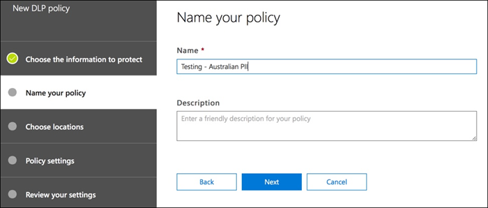
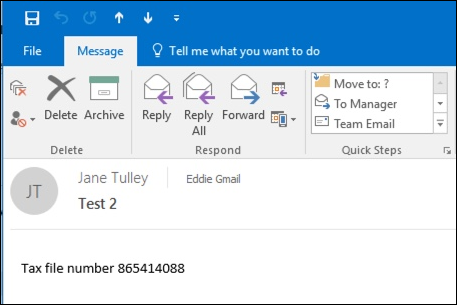
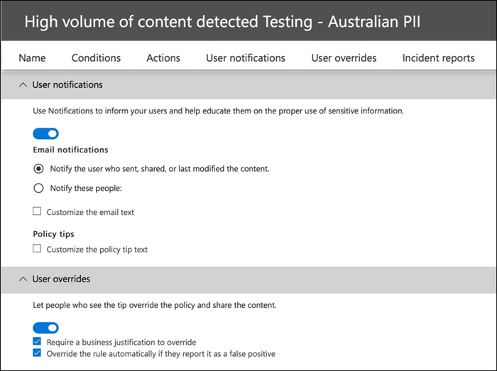
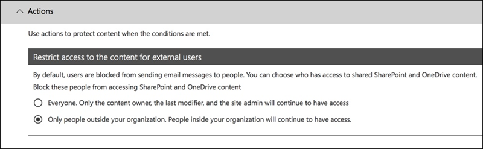
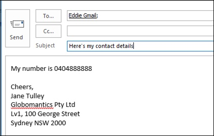

# 建立、測試及調整 DLP 原則

**主體作者**  
Paul Cunningham，Microsoft 的 MVP  
[實用 365](https://practical365.com/)  
[@Practical365](https://twitter.com/practical365) 
__________________________________________________

資料外洩防護是設計來協助您防止敏感資訊給不想要的對象 」 刻意或意外曝光的組織的 Office 365 的合規性功能。 DLP 已在 Exchange 伺服器] 及 [Exchange Online 中，其根物件，而且也適用於 SharePoint Online 和商務用 OneDrive 中。

DLP 會使用若要檢查的內容，電子郵件和檔案，例如信用卡號碼敏感資訊和個人識別資訊 (PII) 要尋找的內容分析引擎。 敏感資訊通常不應該傳送電子郵件，或包含在文件，而不採取額外的步驟，例如加密的電子郵件訊息或檔案。 您可以使用 DLP 偵測敏感資訊，並採取動作，例如：

- 記錄的事件稽核用途
- 顯示警告訊息至使用者傳送電子郵件或共用檔案
- 主動封鎖的電子郵件或檔案共用從發生

客戶有時會關閉 DLP 因為它們不視為具有需要保護的資料類型。 假設是： 的機密資料，例如醫療記錄或財務資訊，請僅存在於像醫療保健產業或執行線上商店的公司。 但是任何商業可以處理定期上的敏感資訊，即使他們不知道它。 試算表的員工名稱及日期是出生的為客戶的名稱和信用卡的詳細資訊的試算表為敏感。 這種類型的資訊會浮動周圍超過您所預期，如員工安靜模式前往關於其日常工作，以為 nothing 匯出從系統的 CSV 檔案並以電子郵件傳送給其他人。 您可能也會有大吃一驚頻率員工傳送電子郵件包含信用卡或銀行詳細資料，而不考慮方法的結果。

## 如何所 DLP 偵測到機密資訊

識別敏感資訊規則運算式 (RegEx) 模式比對，組合與其他的指標，例如近似值與特定關鍵字]，以比對的模式。 例如，這是信用卡號碼。 VISA 信用卡卡號有 16 位數。 不過，這些數字可以寫成不同的方式，例如 1111年-1111年-1111年-1111，1111年 1111年 1111年 1111，或 1111111111111111。

任何 16 位數字串不一定是信用卡號，它可能是從說明 desk 系統或硬體序號的票證數字。 若要告訴信用卡卡號和無害的 16 位數字串之間的差異，計算會是執行 （總和檢查碼） 以確認號碼符合各種信用卡品牌來自已知的模式。

此外，例如 「 VISA 」 或 「 AMEX 」，以及近似值 [關鍵字]，以可能是信用卡到期日期的日期值的近似值也會被視為進行決策的資料是否是信用卡號。

換句話說，DLP 是通常是足夠的智慧辨識電子郵件中的下列兩個敘述性文字之間的差異：

- 「 您訂購我新的膝上型電腦。 使用我 VISA 號碼 1111年-1111年-1111年-1111，到期 11/22，和傳送給我有時的估計的傳遞日期 」。
- 「 我的膝上型電腦序號是 2222年 2222年-2222年 2222年和它已購買 11/2010年上。 順便一提，我旅行 visa 核准尚未？ 」

保留書籤的良好參照會說明如何每一種資訊類型會偵測到此[敏感資訊類型的主題](what-the-sensitive-information-types-look-for.md)。

## 要從何處開始與資料外洩防護

當資料外洩的風險不完全明顯時，很難找出其中完全您應該從開始實作 DLP。 幸好，DLP 原則可以在執行 「 測試模式 」，可讓您評估其效率和準確度之前您將其開啟。

管理 Exchange Online 的 DLP 原則時，可以透過 Exchange 系統管理中心。 但是，您可以設定適用於透過安全性 & 規範中心] 內的所有工作負載的 DLP 原則，因此我將使用的本文中的示範。 在安全性 & 合規性中心中，您會發現 [**資料外洩防護**] 下的 DLP 原則 > **原則**。 按一下 [**建立原則**]，以啟動]。

Office 365 提供的[DLP 原則範本](what-the-dlp-policy-templates-include.md)可用於建立 DLP 原則的範圍。 例如，假設您是澳洲商務。 您可以篩選以顯示只與澳洲，相關的那些原則範本可分為金融、 醫療和健康情況及隱私權一般類別。

此示範而言我將會選擇澳洲個人識別資訊 (PII) 資料，包括澳洲稅務檔案號碼 (TFN) 和駕駛執照號碼資訊類型。

提供您的新 DLP 原則的名稱。 預設的名稱會比對的 DLP 原則範本，但因為可以從相同的範本建立多個原則，您應選擇您自己，更具描述性名稱。

選擇原則會套用到的位置。 DLP 原則可以套用至 Exchange Online、 SharePoint Online 和商務用 OneDrive。 我要保留此原則的設定將套用至所有位置。

在第一個**原則設定**步驟只接受立即的預設值。 有很多您可以在 DLP 原則] 中的自訂，但預設值會是不錯的起點。

按一下 [**下一步**] 之後就會看到與其他的**原則設定**] 頁面上具有更多自訂選項。 您只測試原則，以下是您可以開始進行某些調整。

- 我已關閉的現在，這是合理的步驟，如果您只要測試內容，而且不想要尚未對使用者顯示的任何項目採取的原則提示。 原則提示對它們即將違反 DLP 原則的使用者顯示警告。 例如，Outlook 使用者會看到警告他們已附加的檔案包含信用卡號碼，且會導致他們的電子郵件遭到拒絕。 原則提示的目標是要前些什麼停止不相容行為。
- 我也已降低為 1，10 的執行個體數目，因此這項原則會偵測任何共用澳洲 PII 資料，不只是大量資料的共用。
- 我也已新增其他收件者的附隨報告電子郵件。

最後，已在測試模式中執行的初始此原則。 請注意有也是用來停用在測試模式中的原則提示以下的選項。 這可以讓您已在原則中啟用的原則提示，但然後決定是否要顯示或隱藏他們您在測試期間的彈性。

在最後檢閱畫面，請按一下 [**建立**] 以完成建立原則]。

## 測試 DLP 原則

您的新 DLP 原則會開始於大約 1 小時才會生效。 您可以 sit 這個並等待其觸發的一般使用者活動，或您可以嘗試觸發它自己。 稍早我連結到此[敏感資訊類型的主題](what-the-sensitive-information-types-look-for.md)，可提供讓您如何觸發 DLP 相符項目資訊。

做為範例，我的這篇文章所建立的 DLP 原則會偵測澳洲稅務檔案號碼 (TFN)。 根據文件中，相符項目根據下列準則。

 
若要示範 TFN 偵測而鈍的方式，與文字 「 稅務檔案號碼 」 電子郵件和接近 9 的數字字串會帶到處透過沒有任何問題。 它不會觸發 DLP 原則的原因是 9 位數字串必須通過總和檢查碼表示它是有效的 TFN 而不只是無害的數字字串。

相較之下，含有文字"稅務檔案編號 」 的電子郵件和傳遞總和檢查碼有效 TFN 會觸發該原則。 對於資料錄，我使用 TFN 來自中的網站，就會產生有效，但不是正版，TFNs。 有類似產生[正確的但假信用卡號碼](http://www.fakecreditcardgenerator.net/)的網站。 這類網站是很有用，因為下列其中一個最常見的錯誤測試 DLP 原則時使用的假的數字不是有效，並不會通過總和檢查碼 （也就不會觸發原則）。

附隨報告電子郵件包含偵測到的敏感資訊類型、 偵測到多少個執行個體，並偵測信賴等級。

如果您在測試模式中離開您的 DLP 原則，並分析附隨報告電子郵件，您可以開始取得風格的 DLP 原則和如何有效它將會強制使用時的精確度。 除了附隨報告，您還可以[使用 DLP 報告](view-the-dlp-reports.md)以查看您的租用戶原則相符項目彙總的檢視。

## 調整 DLP 原則

當您分析您的原則拜訪人次您可能想要進行某些調整，以原則的行為方式。 簡單的範例中，您可能會決定電子郵件中的一個 TFN 不是 （我會認為它仍是，但這是因為示範與它讓我們移） 時發生問題，但兩個或多個執行個體是問題。 多個執行個體可能風險的案例，例如員工 HR 資料庫從 CSV 匯出至外部廠商，例如外部會計服務以電子郵件傳送。 必定為某些動作，您偏好偵測並封鎖。

在安全性 & 合規性中心中，您可以編輯現有的原則來調整行為。

 
因此，只有特定的工作負載，或特定網站及帳戶，已套用原則，您可以調整的位置設定。

您也可以調整的原則設定，並編輯規則，以符合您的需求。

編輯 DLP 原則內的規則時，您可以變更：

- 條件，包括機密資料，就會觸發規則的執行個體數目與類型。
- 動作所採取的例如限制內容的存取。
- 使用者通知，也就是在他們的電子郵件用戶端或 web 瀏覽器中對使用者顯示原則提示。
- 使用者會覆寫，會決定使用者是否可以選擇要繼續進行其電子郵件或繼續共用的檔案。
- 附隨報告，通知系統管理員。

此示範而言我已新增使用者通知 （小心這麼做不適當的使用者認知訓練） 的原則，並允許使用者覆寫原則與業務理由，或藉由標幟為誤判。 請注意，您也可以自訂的電子郵件和原則提示文字，是否您想要併入任何其他您的組織原則的相關資訊或提示使用者在他們有疑問，請連絡客戶支援。

原則包含兩個規則，而出現大量和低量的處理，因此請務必編輯兩者都具有您想要的動作。 這是將視為方式有所不同其特性的情況下的機會。 例如，您可能會允許低量違規的覆寫，但不是允許覆寫的大量違規。

此外，如果您想要實際封鎖或限制存取內容的原則違規情形中，您需要在要執行這項操作的規則上設定巨集指令。

之後將這些變更儲存至原則設定，我還需要回到原則主要設定] 頁面上，啟用選項，雖然原則是在測試模式中，向使用者顯示原則提示。 這是您的使用者，採用 DLP 原則，然後執行使用者認知訓練，不必擔心會影響其產能的太多誤判的有效方法。

在伺服器端 （或雲端戶端如果您想要的話），變更可能不會立即生效，由於各種處理間隔。 如果您發出會對使用者顯示新的原則提示的 DLP 原則變更，使用者可能不會看到所做的變更立即生效，原則變更每隔 24 小時會檢查其 Outlook 用戶端中。 如果您想要加快以為測試，您可以使用此登錄修正，以[清除從 PolicyNudges 機碼的最後一個下載時間戳記](https://support.microsoft.com/en-au/help/2823261/changes-to-a-data-loss-prevention-policy-don-t-take-effect-in-outlook?__hstc=18650278.46377037dc0a82baa8a30f0ef07a7b2f.1538687978676.1538693509953.1540315763430.3&__hssc=18650278.1.1540315763430&__hsfp=3446956451)。 Outlook 會下載最新的原則資訊下次您重新啟動它，然後開始撰寫電子郵件訊息。

如果您有已啟用的原則提示，使用者會開始看到在 Outlook 中的提示，並在發生時，可以報告誤判給您。

![使用以報告誤判] 選項的原則提示](media/DLP-create-test-tune-policy-tip-in-outlook.png)

## 調查誤判

DLP 原則範本不是完美直線現成可用的。 很有可能，您會發現發生在環境中，這是很來簡化雜亂到 DLP 部署如此重要的原因，部分誤判花時間適當地測試及調整您的原則。

以下是誤判的範例。 這封電子郵件是相當無害。 使用者是提供給某人，其行動電話號碼，並包括其電子郵件簽章。

 
使用者會看到警告電子郵件包含敏感資訊，原則提示，但明確地說，澳洲駕照編號。

使用者可以報告誤判，和系統管理員可以查看它已發生的原因。 附隨報告電子郵件中的電子郵件被標示為誤判。

此驅動程式的授權案例是很好的範例，若要深入探究。 此誤判發生 「 澳洲駕照 」 類型將會觸發的任何 9 位數字的字串 （甚至是一個屬於 10 位數字的字串），就是 300 個字元鄰近的關鍵字"雪梨 nsw 」 內的原因 （不區分大小寫）。 這樣它就會觸發的電話號碼和電子郵件簽章，只有因為使用者位於雪梨的情況。

有趣的是，如果 「 雪梨、 NSW 」 有逗號，並不會觸發 DLP 原則。 我已經不知道原因逗號差別任何在這裡，也不為何澳洲驅動程式的授權資訊類型，關鍵字中並未包含其他城市和澳洲的狀態，但就可以了。 因此，什麼呢？ 其相關資訊 沒有兩個選項。

其中一個選項是從原則移除澳洲驅動程式的授權資訊類型。 它是在該處因為它是一部分的 DLP 原則範本，但我們不強制使用它。 如果您僅有興趣稅務檔案號碼和不驅動程式的授權，您只可以將其移除。 例如，您可以移除低量規則在原則中，但保留大量規則中，如此仍然會偵測到多個驅動程式授權的清單。

 
另一個選項是只要增加的執行個體計數，以便驅動程式的授權低量只偵測到當有多個執行個體。

除了變更的執行個體計數，您也可以調整的比對正確性 （或信賴等級）。 如果您的機密資訊類型具有多種模式，您可以調整的比對正確性，在您的規則，使您的規則比對特定的模式即可。 例如，若要協助減少誤判，您可以設定您的規則的比對正確性，使其符合最高的信賴等級的圖樣。 了解如何計算信賴等級是有點難以 （及過後的這篇文章的範圍），但以下是如何[使用以調整您的規則信賴等級](https://docs.microsoft.com/en-us/office365/securitycompliance/data-loss-prevention-policies#match-accuracy)的理想說明。

最後，如果您想要取得更多進階，您可以自訂任何敏感資訊類型--例如，您可以 「 雪梨 NSW 」 從清單中移除之關鍵字[澳洲駕照](https://docs.microsoft.com/en-us/office365/securitycompliance/what-the-sensitive-information-types-look-for#australia-drivers-license-number)，以避免誤判觸發上方。 若要了解如何藉由使用 XML 和 PowerShell 執行這項操作，請參閱在[自訂內建的敏感資訊類型](customize-a-built-in-sensitive-information-type.md)的本主題。

## 關閉 DLP 原則

當您滿意，DLP 原則很精確，且有效率地偵測敏感資訊類型，以及您的使用者準備好要處理正在進行中的原則，然後您可以啟用此原則。

 
如果您正在等待原則會生效，[連線到 Office 365 安全性 & 合規性中心 PowerShell](https://docs.microsoft.com/en-us/powershell/exchange/office-365-scc/connect-to-scc-powershell/connect-to-scc-powershell?view=exchange-ps)並執行[Get-dlpcompliancepolicy 指令程式](https://docs.microsoft.com/en-us/powershell/module/exchange/policy-and-compliance-dlp/get-dlpcompliancepolicy?view=exchange-ps)，請參閱 DistributionStatus 時，請參閱。

後忘記的 DLP 原則，您應該執行某些最終您自己的測試要確定預期的原則動作會發生。 如果您想要測試之類的信用卡資料，有一些網站，online 提供的資訊來產生範例信用卡或其他個人資訊，會傳遞總和檢查碼及您的原則會觸發。

允許使用者覆寫的原則會顯示該選項給使用者的原則提示的一部分。

限制內容的原則會一部分的原則提示，向使用者顯示警告，並且阻止傳送電子郵件。

## 摘要

資料外洩防護原則是適合各種類型的組織。 測試 DLP 原則是低風險練習，因為您已透過之類的原則提示，使用者覆寫及附隨報告的控制項。 安靜模式，您就可以測試若要查看您組織中已發生何種類型的違規的一些 DLP 原則並再使用特殊功能原則低，則為 false 的誤判率、 教育使用者需要允許及不允許，然後推出 DLP 原則，以組織。
