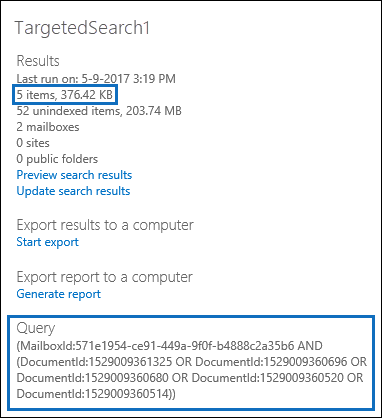

# 準備識別碼清單在 Office 365 中的內容搜尋的 CSV 檔案Prepare a CSV file for an ID list Content Search in Office 365

您可以搜尋特定的信箱電子郵件訊息和使用 Exchange 識別碼清單的其他信箱項目。You can search for specific mailbox email messages and other mailbox items using a list of Exchange IDs. 若要建立 （正式稱為的目標式的搜尋） 的識別碼清單搜尋，您提交識別特定信箱的項目若要搜尋的逗號分隔的值 (CSV) 檔案。To create an ID list search (formally called a targeted search), you submit a comma separated value (CSV) file that identifies the specific mailbox items to search for. 此 CSV 檔案中使用**Results.csv**檔案或都包含在內，當您匯出內容搜尋結果，或從內容搜尋報表] 和 [現有的內容搜尋匯出**未編製索引的 Items.csv**檔案。For this CSV file you use the **Results.csv** file or the **Unindexed Items.csv** file that are included when you export the Content Search results or export a Content Search report from and existing Content Search. 然後您編輯下列其中一個這些檔案，以指出搜尋，然後建立新的識別碼清單中搜尋並提交 CSV 檔案的特定項目。Then you edit one of these files to indicate the specific items to search for, and then create a new ID list search and submit the CSV file. 
  
以下是建立識別碼清單中搜尋的程序的簡要概觀。Here's a quick overview of the process for creating an ID list search.
  
1. 建立並執行新的或引導式的內容搜尋中安全性 & 合規性中心。Create and run a new or guided Content Search in the Security & Compliance Center.
    
2. 匯出內容搜尋結果，或匯出內容搜尋報告。Export the content search results or export the content search report. 如需詳細資訊，請參閱：For more information, see:
    
    - [匯出內容搜尋結果Export Content Search results](export-search-results.md)
    
    - [匯出內容搜尋報告Export a Content Search report](export-a-content-search-report.md)
    
3. 編輯**Results.csv**檔案或**未編製索引的 Items.csv**並找出您想要併入識別碼清單中搜尋特定的信箱項目。Edit the **Results.csv** file or the **Unindexed Items.csv** and identify the specific mailbox items that you want to include in the ID list search. 請參閱準備識別碼清單中搜尋的 CSV 檔案的[指示](#prepare-the-csv-file-for-an-id-list-search)。See the [instructions](#prepare-the-csv-file-for-an-id-list-search) for preparing a CSV file for an ID list search. 
    
4. 建立新的識別碼清單搜尋 （請參閱[指示](#create-an-id-list-search)），並提交您備妥的 CSV 檔案。Create a new ID list search (see the [instructions](#create-an-id-list-search)) and submit the CSV file that you prepared. 選取 CSV 檔案中的項目只會搜尋建立搜尋查詢。The search query that's created will only search for the items selected in the CSV file.
    
> [!NOTE]
> 識別碼清單搜尋只支援的信箱項目。ID list searches are only supported for mailbox items. 您無法搜尋的 SharePoint 和 OneDrive 文件識別碼在列出搜尋。You can't search for SharePoint and OneDrive documents in an ID list search. 
  
 **為什麼要建立識別碼清單搜尋？****Why create an ID list search?** 如果您無法判斷**Results.csv**或**未編製索引的 Items.csv**檔案中的中繼資料為基礎的 eDiscovery 要求回應項目時，您可以使用識別碼清單搜尋來尋找，預覽，，然後將匯出至判斷它是否表示項目回應正在調查的案例。If you're unable to determine if an item is responsive to an eDiscovery request based on the metadata in the **Results.csv** or **Unindexed Items.csv** files, you can use an ID list search to find, preview, and then export that item to determine if it's responsive to the case you're investigating. 識別碼清單搜尋通常用來搜尋並傳回一組特定的未編製索引的項目。ID list searches are typically used to search for and return a specific set of unindexed items. 
  
## 準備識別碼清單中搜尋的 CSV 檔案Prepare the CSV file for an ID list search

匯出的搜尋結果或報表的內容搜尋之後，您可以執行下列步驟來準備識別碼清單中搜尋的 CSV 檔案。After you export the search results or report for a content search, you can perform the following steps to prepare the CSV file for an ID list search. 此 CSV 檔案會識別每個項目識別碼清單搜尋中。This CSV file will identify every item in the ID list search.
  
請注意，您可以使用 CSV 檔案從搜尋中包含 SharePoint 網站與 OneDrive 帳戶，但您可以選取*只*識別碼清單中搜尋的信箱項目。Note that you can use a CSV file from a search that included SharePoint sites and OneDrive accounts, but you can select  *only*  mailbox items for an ID list search. 如果您在 SharePoint 或 OneDrive 中選取文件，CSV 檔案將會失敗驗證，當您建立的識別碼清單搜尋。If you select a document in SharePoint or OneDrive, the CSV file will fail validation when you create an ID list search. 
  
1. 在 Excel 中開啟 [ **Results.csv** ] 或 [**未編製索引的 Items.csv**檔案。Open the **Results.csv** or **Unindexed Items.csv** file in Excel. 
    
2. 插入新欄並將其命名為 [**已選取**。Insert a new column and name it **Selected**. 您可以在該處插入欄沒關係。It doesn't matter where you insert the column. 為了方便，請考慮插入左邊的第一欄。For convenience, consider inserting it to the left of the first column.
    
3. 在 [**選取**] 欄中，輸入 **[是]** 中的儲存格，會對應至您想要搜尋的項目。In the **Selected** column, type **Yes** in the cell that corresponds to the item that you want to search for. 針對每個您想要搜尋的項目重複此步驟。Repeat this step for every item that you want to search for. 
    
    > [!IMPORTANT]
    > 當您在 Excel 中開啟 CSV 檔案時，**文件識別碼**] 欄中的資料格式會變更為**一般**。When you open the CSV file in Excel, the data format for the **Document ID** column is changed to **General**. 這會導致科學記號中顯示項目的文件識別碼。This results in displaying the document ID for an item in scientific notation. 例如，「 481037338205 」 的 ID 會顯示為 「 4.81037E + 11"的文件必須執行接下來的步驟來變更**文件識別碼**] 欄中的資料格式**號碼**若要還原的正確格式的文件識別碼。For example, the document ID of "481037338205" is displayed as "4.81037E+11" You have to perform the next steps to change the data format of the **Document ID** column to **Number** to restore the correct format for the document ID. 如果您不這樣做，使用 CSV 檔案的識別碼清單搜尋將會失敗。If you don't do this, the ID list search that uses the CSV file will fail. 
  
4. 以滑鼠右鍵按一下 [整個**文件識別碼**] 欄，然後選取 [**儲存格格式**。Right-click the entire **Document ID** column and select **Format Cells**.
    
5. 在 [**類別**] 方塊中，按一下 [**數字**。In the **Category** box, click **Number**.
    
6. 變更的小數位數設為**0**，，，然後按一下 **[確定]** 以儲存變更。Change the number of decimal places to **0**, and then click **OK** to save your changes. 請注意 [文件識別碼] 欄中的值會變更為數字。Notice that the values in the Document ID column are changed to numbers. 
    
    以下是範例已準備好要送出識別碼清單內容搜尋的 CSV 檔案。Here's an example of the a CSV file that's ready to be submitted for a ID list content search.
    
    
  
7. 儲存該 CSV 檔案，或使用**另存新檔**儲存具有不同的檔案名稱的檔案。Save the CSV file or use **Save As** to the save the file with different file name. 在這兩種情況下，務必將檔案儲存與 CSV 格式。In both cases, be sure to save the file with the CSV format. 
  
## 建立識別碼清單搜尋Create an ID list search

下一步是建立新的識別碼清單內容搜尋並提交您在先前步驟中備妥的 CSV 檔案。The next step is to create a new ID list Content Search and submit the CSV file that you prepared in the previous step.
  
> [!IMPORTANT]
> 您應該建立識別碼清單搜尋不超過 2 天後匯出內容搜尋的結果或報表。You should create an ID list search no more than 2 days after exporting the results or report from a Content Search. 如果搜尋結果，或報表其中匯出 2 天以上，您應該重新匯出搜尋結果或報告，以產生更新的 CSV 檔案。If the search results or report where exported more than 2 days ago, you should re-export the search results or report to generate updated CSV files. 然後您可以準備下列其中一個更新的 CSV 檔案，並使用它來建立識別碼清單搜尋。Then you can prepare one of the updated CSV files and use it to create an ID list search. 
  
1. 在 [安全性 & 合規性中心，移至**搜尋** \> **內容搜尋**。In the Security & Compliance Center, go to **Search** \> **Content search**.
    
2. 在 [**搜尋**] 頁面上，按一下箭號下一步]**新搜尋**]，然後按一下 [**搜尋依識別碼清單**。On the **Search** page, click the arrow next to  **New search**, and then click **Search by ID List**.
    
    ![按一下 [搜尋]，依識別碼清單，從新的 [搜尋] 下拉式清單](media/e65f9942-09b2-4127-865e-e64029a590df.png)
  
3. **識別碼清單來搜尋**彈出式視窗中，在名稱搜尋 （及選擇性描述），然後按一下 [**瀏覽]** 並在先前步驟中選取您備妥的 CSV 檔案。On the **Search by ID List** flyout, name the search (and optionally describe it) and then click **Browse** and select the CSV file that you prepared in the previous step. 
    
    Office 365 會嘗試驗證 CSV 檔案。Office 365 attempts to validate the CSV file. 如果驗證失敗，會顯示錯誤訊息，可能會協助您進行疑難排解的驗證錯誤。If the validation is unsuccessful, an error message is displayed that might help you troubleshoot the validation errors. CSV 檔案已成功驗證，以建立識別碼清單搜尋。The CSV file has to be successfully validated to create an ID list search.
    
4. 之後將 CSV 檔案驗證成功時，請按一下 [**搜尋**] 以建立識別碼清單搜尋。After the CSV file is successfully validated, click **Search** to create the ID list search. 
    
    以下是預估的搜尋結果並產生識別碼清單搜尋查詢的範例。Here's an example of the estimated search results and the query that's generated for an ID list search.
    
    
  
    請注意，[識別碼] 搜尋統計資料中顯示的估計項的目數應該符合您在 CSV 檔案中選取的項目數。Note that the number of estimated items displayed in statistics for the ID search should match the number of items that you selected in the CSV file.
    
5. 預覽或匯出識別碼清單搜尋所傳回的項目。Preview or export the items returned by the ID list search.
    
> [!NOTE]
> 如果您將信箱移動後建立識別碼清單搜尋時，搜尋查詢將不會傳回指定的項目。If you move a mailbox after creating an ID list search, the query for the search won't return the specified items. 這是因為移動信箱時，會變更**DocumentId**屬性的信箱項目。That's because the **DocumentId** property for mailbox items are changed when a mailbox is moved. 在極罕見的執行個體中移動信箱時建立的識別碼清單搜尋之後，您應該建立新的內容搜尋 （或更新現有的內容搜尋的搜尋結果），然後匯出搜尋結果或報告產生更新可用的 CSV 檔案 若要建立新的識別碼清單搜尋。In the rare instance when a mailbox is moved after you create an ID list search, you should create a new content search (or update the search results for the existing content search) and then export the search results or report to generate updated CSV files that can be used to create a new ID list search. 
