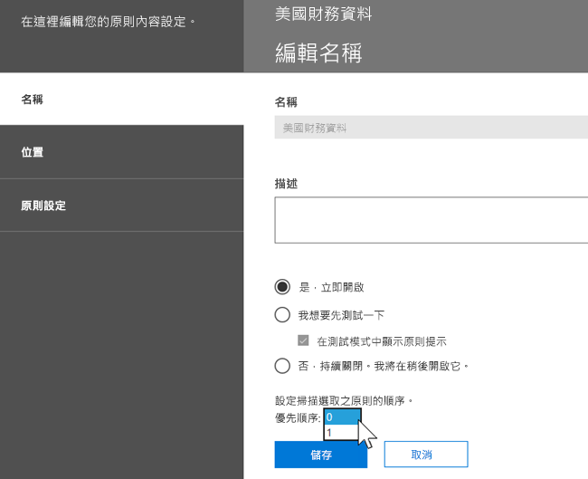
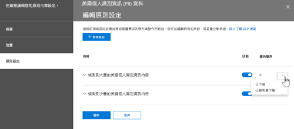

# 資料遺失防護概述Overview of data loss prevention

> [!NOTE]
> 最近將資料遺失防護功能新增至 Microsoft 小組的 Office 365 E5 和 Office 365 高級規範。Data loss prevention capabilities were recently added to Microsoft Teams in Office 365 E5 and Office 365 Advanced Compliance. 若要深入瞭解功能可用性, 請參閱[office 365 服務說明: office 365 安全性 & 合規性中心](https://docs.microsoft.com/office365/servicedescriptions/office-365-platform-service-description/office-365-securitycompliance-center)。To learn more about feature availability, see [Office 365 Service Descriptions: Office 365 Security & Compliance Center](https://docs.microsoft.com/office365/servicedescriptions/office-365-platform-service-description/office-365-securitycompliance-center).

若要遵守商務標準和行業規定, 組織必須保護機密資訊, 並防止不慎洩漏。To comply with business standards and industry regulations, organizations must protect sensitive information and prevent its inadvertent disclosure. 機密資訊可以包含財務資料或個人身分識別資訊 (PII), 例如信用卡號碼、社會保險號碼或健康情況記錄。Sensitive information can include financial data or personally identifiable information (PII) such as credit card numbers, social security numbers, or health records. 使用 Office 365 安全性&amp;與合規性中心中的資料遺失防護 (DLP) 原則, 您可以識別、監視和自動保護 office 365 中的敏感資訊。With a data loss prevention (DLP) policy in the Office 365 Security &amp; Compliance Center, you can identify, monitor, and automatically protect sensitive information across Office 365.
  
採用 DLP 原則，您可以：With a DLP policy, you can:
  
- **在多個位置識別敏感性資訊，例如 Exchange Online、SharePoint Online、商務用 OneDrive 及 Microsoft Teams。****Identify sensitive information across many locations, such as Exchange Online, SharePoint Online, OneDrive for Business, and Microsoft Teams.**
    
    例如, 您可以識別任何包含儲存在任何商務用 OneDrive 網站中的信用卡號碼的檔, 也可以只監視特定人員的 OneDrive 網站。For example, you can identify any document containing a credit card number that's stored in any OneDrive for Business site, or you can monitor just the OneDrive sites of specific people.
    
- **防止意外共用敏感資訊**。**Prevent the accidental sharing of sensitive information**. 
    
    例如, 您可以識別任何包含與組織外部人員共用的健康記錄的檔或電子郵件, 然後自動封鎖該檔的存取權, 或禁止傳送電子郵件。For example, you can identify any document or email containing a health record that's shared with people outside your organization, and then automatically block access to that document or block the email from being sent.
    
- **監視和保護 Excel、PowerPoint 和 Word 桌面版中的敏感性資訊。****Monitor and protect sensitive information in the desktop versions of Excel, PowerPoint, and Word.**
    
    就像在 Exchange Online、SharePoint Online 和商務用 OneDrive 中一樣, 這些 Office 桌面程式都包含識別敏感資訊和套用 DLP 原則的相同功能。Just like in Exchange Online, SharePoint Online, and OneDrive for Business, these Office desktop programs include the same capabilities to identify sensitive information and apply DLP policies. 當使用者在這些 Office 程式中共用內容時, DLP 會提供持續的監視。DLP provides continuous monitoring when people share content in these Office programs.
    
- **協助使用者了解如何符合規範，而不中斷其工作流程。****Help users learn how to stay compliant without interrupting their workflow.**
    
    您可以讓使用者了解 DLP 原則，協助他們符合規範，而不會封鎖其工作。You can educate your users about DLP policies and help them remain compliant without blocking their work. 例如，如果某個使用者嘗試共用含有敏感資訊的文件，DLP 原則可以傳送電子郵件通知給他們，同時在文件庫的內容中顯示原則提示，允許他們因為正當商務理由而覆寫原則。For example, if a user tries to share a document containing sensitive information, a DLP policy can both send them an email notification and show them a policy tip in the context of the document library that allows them to override the policy if they have a business justification. 相同的原則提示也會出現在網頁、Outlook、Excel、PowerPoint 及 Word 的 Outlook 中。The same policy tips also appear in Outlook on the web, Outlook, Excel, PowerPoint, and Word.
    
- **檢視 DLP 報告以了解有哪些內容符合您的組織的 DLP 原則。****View DLP reports showing content that matches your organization's DLP policies.**
    
    若要評估您的組織遵守 DLP 原則的程度，您可以查看每一個原則和規則在一段時間內有多少個相符項目。To assess how your organization is complying with a DLP policy, you can see how many matches each policy and rule has over time. 如果 DLP 原則允許使用者覆寫原則提示並報告 false 肯定, 您也可以查看使用者所報告的內容。If a DLP policy allows users to override a policy tip and report a false positive, you can also view what users have reported.
    
您可以在 Office 365 安全性&amp;與合規性中心的 [資料遺失防護] 頁面上建立及管理 DLP 原則。You create and manage DLP policies on the Data loss prevention page in the Office 365 Security &amp; Compliance Center.
  

  
## DLP 原則的內容What a DLP policy contains

DLP 原則包含一些基本事項：A DLP policy contains a few basic things:
  
- 內容的保護位置: Exchange Online、SharePoint Online 和商務用 OneDrive 網站等**位置**, 以及 Microsoft 團隊聊天和管道。Where to protect the content: **locations** such as Exchange Online, SharePoint Online, and OneDrive for Business sites, as well as Microsoft Teams chats and channels. 
    
- 何時及如何藉由執行強制包含下列要素的**規則**來保護內容：When and how to protect the content by enforcing **rules** comprised of: 
    
  - **條件**在強制執行規則之前, 內容必須符合的條件。**Conditions** the content must match before the rule is enforced. 例如, 規則可能會設定為僅查看包含與組織外部人員共用之社交安全性號碼的內容。For example, a rule might be configured to look only for content containing Social Security numbers that's been shared with people outside your organization. 
    
  - 當找到符合條件的內容時, 您希望規則自動採取的**動作**。**Actions** that you want the rule to take automatically when content matching the conditions is found. 例如, 規則可能會設定為封鎖對檔的存取, 並將電子郵件通知傳送給使用者和合規性監察者。For example, a rule might be configured to block access to a document and send both the user and compliance officer an email notification. 
    
您可以使用規則來達到特定的保護需求，然後使用 DLP 原則將常見保護需求分組在一起，例如所有需要遵守特定法規的規則。You can use a rule to meet a specific protection requirement, and then use a DLP policy to group together common protection requirements, such as all of the rules needed to comply with a specific regulation.
  
例如，您的 DLP 原則可能協助您偵測是否存在受到健康保險流通與責任法案 (HIPAA) 的資訊。For example, you might have a DLP policy that helps you detect the presence of information subject to the Health Insurance Portability and Accountability Act (HIPAA). 此 DLP 原則可在所有 SharePoint Online 網站和所有商務用 OneDrive 網站 (where) 上尋找任何包含與組織外部人員共用之敏感資訊的檔, 以協助保護 HIPAA 資料 (內容)。條件), 然後封鎖對檔的存取, 並傳送通知 (動作)。This DLP policy could help protect HIPAA data (the what) across all SharePoint Online sites and all OneDrive for Business sites (the where) by finding any document containing this sensitive information that's shared with people outside your organization (the conditions) and then blocking access to the document and sending a notification (the actions). 這些需求會儲存為個別規則並一起分組為 DLP 原則，以簡化管理和報告。These requirements are stored as individual rules and grouped together as a DLP policy to simplify management and reporting.
  

  
### 位置Locations

DLP 原則可跨 Office 365 尋找和保護機密資訊, 不論該資訊位於 Exchange Online、SharePoint Online、商務用 OneDrive 或 Microsoft 團隊中。A DLP policy can find and protect sensitive information across Office 365, whether that information is located in Exchange Online, SharePoint Online, OneDrive for Business, or Microsoft Teams. 您可以選擇保護 Exchange 電子郵件、Microsoft 團隊聊天和通道, 以及所有 SharePoint 或 OneDrive 文件庫中的內容, 或選取原則的特定位置。You can choose to protect content in Exchange email, Microsoft Teams chats and channels, and all SharePoint or OneDrive libraries, or select specific locations for a policy.
  

  
如果您選擇包含或排除特定的 SharePoint 網站或 OneDrive 帳戶, 則 DLP 原則最多可以包含100個以上包含和排除專案。If you choose to include or exclude specific SharePoint sites or OneDrive accounts, a DLP policy can contain no more than 100 such inclusions and exclusions. 雖然此限制存在, 但是您可以套用全組織原則或套用至整個位置的原則, 以超過此限制。Although this limit exists, you can exceed this limit by applying either an org-wide policy or a policy that applies to entire locations.
  
### 規則Rules

規則是針對貴組織的內容強制執行您的業務需求。Rules are what enforce your business requirements on your organization's content. 一項原則包含一或多個規則，而每個規則是由條件和動作所組成。A policy contains one or more rules, and each rule consists of conditions and actions. 對每個規則而言，條件符合時，就會自動採取動作。For each rule, when the conditions are met, the actions are taken automatically. 規則的執行順序為每個原則中的最高優先順序規則。Rules are executed sequentially, starting with the highest-priority rule in each policy.
  
規則也提供通知使用者 (使用原則提示和電子郵件通知) 和系統管理員 (電子郵件附隨報告) 內容符合規則的選項。A rule also provides options to notify users (with policy tips and email notifications) and admins (with email incident reports) that content has matched the rule.
  
以下是規則的元件, 每個都有說明。Here are the components of a rule, each explained below.
  

  
#### 條件Conditions

條件很重要, 因為它們決定您所要尋找的資訊類型, 以及何時採取動作。Conditions are important because they determine what types of information you're looking for, and when to take an action. 例如, 您可以選擇忽略包含護照號碼的內容, 除非內容包含10個以上的號碼, 且與組織外部的人員共用。For example, you might choose to ignore content containing passport numbers unless the content contains more than 10 such numbers and is shared with people outside your organization.
  
條件側重于內容, 例如您所要尋找的機密資訊類型, 以及**內容**, 例如檔的共用\*\*\*\* 人員。Conditions focus on the **content**, such as what types of sensitive information you're looking for, and also on the **context**, such as who the document is shared with. 您可以使用條件將不同的動作指派給不同的風險等級。You can use conditions to assign different actions to different risk levels. 例如, 內部共用的敏感內容可能較低的風險, 而且比組織外部人員共用的敏感內容所需的動作少。For example, sensitive content shared internally might be lower risk and require fewer actions than sensitive content shared with people outside the organization. 
  

  
目前可用的條件可以判斷：The conditions now available can determine if:
  
- 內容包含機密資訊的類型。Content contains a type of sensitive information.
    
- 內容包含標籤。Content contains a label. 如需詳細資訊, 請參閱下一節[使用標籤做為 DLP 原則中的條件](#using-a-label-as-a-condition-in-a-dlp-policy)。For more information, see the below section [Using a label as a condition in a DLP policy](#using-a-label-as-a-condition-in-a-dlp-policy).
    
- 內容是否與組織外部或內部人員共用。Content is shared with people outside or inside your organization.
    
#### 敏感資訊類型Types of sensitive information

DLP 原則可協助保護機密資訊類型, 而這些資訊會定義為**敏感資訊類型**。A DLP policy can help protect sensitive information, which is defined as a **sensitive information type**. Office 365 包含許多不同區域多種常見敏感資訊類型可供您使用，例如信用卡號碼、銀行帳戶號碼、身分證號碼和護照號碼。Office 365 includes definitions for many common sensitive information types across many different regions that are ready for you to use, such as a credit card number, bank account numbers, national ID numbers, and passport numbers. 
  

  
當 DLP 原則尋找機密資訊類型 (例如信用卡號碼) 時, 它並不只是尋找16位數的數位。When a DLP policy looks for a sensitive information type such as a credit card number, it doesn't simply look for a 16-digit number. 使用下列各項的組合可定義和偵測每種敏感資訊類型：Each sensitive information type is defined and detected by using a combination of:
  
- 關鍵字Keywords
    
- 驗證總和檢查碼或結構的內部函數Internal functions to validate checksums or composition
    
- 用以尋找模式相符項目的規則運算式評估Evaluation of regular expressions to find pattern matches
    
- 其他內容檢查Other content examination
    
這可協助 DLP 偵測達到高精確度, 同時減少可能中斷工作的誤報數目。This helps DLP detection achieve a high degree of accuracy while reducing the number of false positives that can interrupt peoples' work.
  
#### 動作Actions

當內容符合規則中的條件時, 您可以套用動作以自動保護內容。When content matches a condition in a rule, you can apply actions to automatically protect the content.
  

  
使用現在可用的動作, 您可以:With the actions now available, you can:
  
- **限制存取內容**對於網站內容, 這表示檔的許可權會受到限制, 但主要網站集合管理員、檔擁有者, 以及上次修改檔的人員除外。**Restrict access to the content** For site content, this means that permissions for the document are restricted for everyone except the primary site collection administrator, document owner, and person who last modified the document. 這些人員可以從文件中移除敏感資訊，或採取其他補救措施。These people can remove the sensitive information from the document or take other remedial action. 當檔符合規範時, 會自動還原原始許可權。When the document is in compliance, the original permissions are automatically restored. 當文件的存取遭到封鎖時，文件在網站上的文件庫中會顯示一個特殊原則提示圖示。When access to a document is blocked, the document appears with a special policy tip icon in the library on the site. 
    
    
  
    針對電子郵件內容, 此動作會封鎖郵件的傳送。For email content, this action blocks the message from being sent. 視 DLP 規則的設定方式而定, 寄件者會看到 NDR 或 (如果規則使用通知) 原則提示和 (或) 電子郵件通知。Depending on how the DLP rule is configured, the sender sees an NDR or (if the rule uses a notification) a policy tip and/or email notification.
    
    
  
#### 使用者通知和使用者覆寫User notifications and user overrides

您可以使用通知和覆寫來教育使用者有關 DLP 原則的相關資訊, 並協助他們保持相容而不會封鎖其工作。You can use notifications and overrides to educate your users about DLP policies and help them remain compliant without blocking their work. 例如，如果某個使用者嘗試共用含有敏感資訊的文件，DLP 原則可以傳送電子郵件通知給他們，同時在文件庫的內容中顯示原則提示，允許他們因為正當商務理由而覆寫原則。For example, if a user tries to share a document containing sensitive information, a DLP policy can both send them an email notification and show them a policy tip in the context of the document library that allows them to override the policy if they have a business justification.
  

  
電子郵件可通知寄件者、共用或上次修改內容, 以及網站內容、主要網站集合管理員和檔擁有者。The email can notify the person who sent, shared, or last modified the content and, for site content, the primary site collection administrator and document owner. 此外, 您也可以在電子郵件通知中新增或移除您選擇的人。In addition, you can add or remove whomever you choose from the email notification.
  
除了傳送電子郵件通知之外, 使用者通知還會顯示原則提示:In addition to sending an email notification, a user notification displays a policy tip:
  
- 在 Outlook 和 Outlook 網頁版中。In Outlook and Outlook on the web.
    
- 適用于 SharePoint Online 或商務用 OneDrive 網站上的檔。For the document on a SharePoint Online or OneDrive for Business site.
    
- 在 Excel、PowerPoint 和 Word 中, 當檔儲存在 DLP 原則所包含的網站時。In Excel, PowerPoint, and Word, when the document is stored on a site included in a DLP policy.
    
電子郵件通知和原則提示會說明內容與 DLP 原則衝突的原因。The email notification and policy tip explain why content conflicts with a DLP policy. 經選擇後，電子郵件通知和原則提示將可讓使用者藉由回報為誤判或提供正當業務理由來覆寫規則。If you choose, the email notification and policy tip can allow users to override a rule by reporting a false positive or providing a business justification. 這可協助您將 DLP 原則正確的相關資訊傳達給使用者，並強制執行這些原則而不會妨礙到其正常工作。This can help you educate users about your DLP policies and enforce them without preventing people from doing their work. 覆寫及誤判的相關資訊也會記錄並回報 (請參閱以下關於 DLP 報告的資訊)，並納入事件報告中 (下一節)，以便法務人員可以定期檢閱此資訊。Information about overrides and false positives is also logged for reporting (see below about the DLP reports) and included in the incident reports (next section), so that the compliance officer can regularly review this information.
  
以下是在商務用 OneDrive 帳戶中原則提示的外觀。Here's what a policy tip looks like in a OneDrive for Business account.
  

  
#### 事件報告Incident reports

當符合規則時, 您可以使用事件的詳細資料, 將附隨報告傳送給您的規範專員 (或您選擇的任何人)。When a rule is matched, you can send an incident report to your compliance officer (or any people you choose) with details of the event. 此報告包含符合專案的相關資訊、符合規則的實際內容, 以及上次修改內容的人員名稱。This report includes information about the item that was matched, the actual content that matched the rule, and the name of the person who last modified the content. 針對電子郵件, 報告也會包含原始郵件與 DLP 原則相符的附件。For email messages, the report also includes as an attachment the original message that matches a DLP policy.
  

  
## 群組和邏輯運算子Grouping and logical operators

通常您的 DLP 原則有直接的需求, 例如識別所有包含 U.S. 社會保險號碼的內容。Often your DLP policy has a straightforward requirement, such as to identify all content that contains a U.S. Social Security Number. 不過, 在其他案例中, 您的 DLP 原則可能需要識別更鬆散定義的資料。However, in other scenarios, your DLP policy might need to identify more loosely defined data.
  
例如, 若要識別受美國衛生保險業法案 (HIPAA) 的內容, 您必須尋找:For example, to identify content subject to the U.S. Health Insurance Act (HIPAA), you need to look for:
  
- 包含特定類型機密資訊的內容, 例如 U.S. 社會保險號碼或藥品機關 (DEA) 號碼。Content that contains specific types of sensitive information, such as a U.S. Social Security Number or Drug Enforcement Agency (DEA) Number.
    
    ANDAND
    
- 更難識別的內容, 例如有關患者的護理或提供的醫療服務說明的通訊。Content that's more difficult to identify, such as communications about a patient's care or descriptions of medical services provided. 識別此內容需要比對非常大型關鍵字清單的關鍵字, 例如疾病的國際分類 (ICD-9 CM 或 ICD-10 釐米)。Identifying this content requires matching keywords from very large keyword lists, such as the International Classification of Diseases (ICD-9-CM or ICD-10-CM).
    
您可以使用分組和邏輯運算子 (AND, OR) 輕鬆識別這類鬆散定義的資料。You can easily identify such loosely defined data by using grouping and logical operators (AND, OR). 當您建立 DLP 原則時, 您可以:When you create a DLP policy, you can:
  
- 群組敏感資訊類型。Group sensitive information types.
    
- 選擇群組內的機密資訊類型與群組本身之間的邏輯運算子。Choose the logical operator between the sensitive information types within a group and between the groups themselves.
    
### 選擇群組中的運算子Choosing the operator within a group

在群組內, 您可以選擇是否必須符合該群組中的任何條件或所有條件, 才能符合該規則。Within a group, you can choose whether any or all of the conditions in that group must be satisfied for the content to match the rule.
  

  
### 新增群組Adding a group

您可以快速新增群組, 其在該群組中有自己的條件和運算子。You can quickly add a group, which can have its own conditions and operator within that group.
  
![[新增群組] 按鈕](media/5f72f292-d1f3-4f11-a911-a9f71e10abf6.png)
  
### 選擇群組之間的運算子Choosing the operator between groups

在群組之間, 您可以選擇是否要讓內容符合規則, 而只是一組或所有群組中的條件。Between groups, you can choose whether the conditions in just one group or all of the groups must be satisfied for the content to match the rule.
  
例如, 內建的**美國 HIPAA**原則有一個規則, 會在群組之間使用**AND**運算子, 讓它識別包含下列內容的內容:For example, the built-in **U.S. HIPAA** policy has a rule that uses an **AND** operator between the groups so that it identifies content that contains: 
  
- 從群組**PII 識別碼**(至少一個 SSN 號碼**或**DEA 號碼)from the group **PII Identifiers** (at least one SSN number **OR** DEA number) 
    
    **AND****AND**
    
- 從群組**醫療條款**(至少有一個 ICD-9-Cm 關鍵字**或**ICD-10 cm 關鍵字)from the group **Medical Terms** (at least one ICD-9-CM keyword **OR** ICD-10-CM keyword) 
    

  
## 處理規則的優先順序The priority by which rules are processed

當您在原則中建立規則時, 會以建立的順序指派每個規則的優先順序, 也就是說, 先建立的規則會優先。第二個會有第二個優先順序, 依此類推。When you create rules in a policy, each rule is assigned a priority in the order in which it's created — meaning, the rule created first has first priority, the rule created second has second priority, and so on. 
  

  
在您設定多個 DLP 原則之後, 您可以變更一或多個原則的優先順序。After you have set up more than one DLP policy, you can change the priority of one or more policies. 若要這麼做, 請選取原則, 選擇 [**編輯原則**], 然後使用 [**優先順序**] 清單來指定其優先順序。To do that, select a policy, choose **Edit policy**, and use the **Priority** list to specify its priority.

根據規則評估內容時, 會以優先順序連續處理規則。When content is evaluated against rules, the rules are processed in priority order. 如果內容符合多個規則, 則會以優先順序連續處理規則, 並強制執行最嚴格的動作。If content matches multiple rules, the rules are processed in priority order and the most restrictive action is enforced. 例如, 如果內容符合下列所有規則, 則會強制執行規則 3, 因為這是最高的優先順序, 最具限制性的規則:For example, if content matches all of the following rules, Rule 3 is enforced because it's the highest priority, most restrictive rule:
  
- 規則 1: 只通知使用者Rule 1: only notifies users
    
- 規則 2: 通知使用者、限制存取, 並允許使用者覆寫Rule 2: notifies users, restricts access, and allows user overrides
    
- 規則 3: 通知使用者、限制存取, 且不允許使用者覆寫Rule 3: notifies users, restricts access, and does not allow user overrides
    
- 規則 4: 只通知使用者Rule 4: only notifies users
    
- 規則 5: 限制存取Rule 5: restricts access
    
- 規則 6: 通知使用者、限制存取, 且不允許使用者覆寫Rule 6: notifies users, restricts access, and does not allow user overrides
    
在此範例中, 請注意, 所有規則的相符專案都會記錄在審核記錄檔中, 並顯示在 DLP 報告中, 即使只會強制執行最具限制性的規則。In this example, note that matches for all of the rules are recorded in the audit logs and shown in the DLP reports, even though only the most restrictive rule is enforced.
  
關於原則提示, 請注意:Regarding policy tips, note that:
  
- 只有最高優先順序的原則提示, 才會顯示最具限制性的規則。Only the policy tip from the highest priority, most restrictive rule will be shown. 例如, 從規則來封鎖內容存取的原則提示, 會從只傳送通知的規則的原則提示中顯示。For example, a policy tip from a rule that blocks access to content will be shown over a policy tip from a rule that simply sends a notification. 這可防止人們看到層疊的原則提示。This prevents people from seeing a cascade of policy tips.
    
- 如果最嚴格規則中的原則提示允許使用者覆寫規則, 則覆寫此規則也會覆寫內容符合的任何其他規則。If the policy tips in the most restrictive rule allow people to override the rule, then overriding this rule also overrides any other rules that the content matched.
    
## 調整規則以讓它們更容易或更難匹配Tuning rules to make them easier or harder to match

當使用者建立並開啟其 DLP 原則之後, 有時候會遇到下列問題:After people create and turn on their DLP policies, they sometimes run into these issues:
  
- 太多不是敏感資訊的內容比規則還相符, 換句話說,**就是**太多的誤報。Too much content that **is not** sensitive information matches the rules — in other words, too many false positives. 
    
- 太少敏感資訊\*\*\*\* 與規則相符的內容。Too little content that **is** sensitive information matches the rules. 換句話說, 保護性動作不會在機密資訊上強制執行。In other words, the protective actions aren't being enforced on the sensitive information. 
    
若要解決這些問題, 您可以調整實例數目並符合精確度, 讓內容更難或更容易, 以符合規則。To address these issues, you can tune your rules by adjusting the instance count and match accuracy to make it harder or easier for content to match the rules. 規則中使用的每個敏感資訊類型都有實例計數和符合精確度。Each sensitive information type used in a rule has both an instance count and match accuracy.
  
### 實例計數Instance count

實例計數表示內容必須存在的特定類型機密資訊的發生次數, 以符合規則。Instance count means simply how many occurrences of a specific type of sensitive information must be present for content to match the rule. 例如, 如果在1到9個唯一的美國或英國之間, 內容就會符合下面所示的規則For example, content matches the rule shown below if between 1 and 9 unique U.S. or U.K. 會識別護照號碼。passport numbers are identified.
  
請注意, 實例計數只包含機密資訊類型和關鍵字的**唯一**相符專案。Note that the instance count includes only **unique** matches for sensitive information types and keywords. 例如, 如果電子郵件包含相同信用卡號碼的10次, 則這10個發生次數會算作一個信用卡號碼的單一實例。For example, if an email contains 10 occurrences of the same credit card number, those 10 occurrences count as a single instance of a credit card number. 
  
若要使用實例計數來調整規則, 指導方針很簡單:To use instance count to tune rules, the guidance is straightforward:
  
- 若要讓規則更容易比對, 請減少**最小**計數和/或增加**最大**計數。To make the rule easier to match, decrease the **min** count and/or increase the **max** count. 您也可以刪除數值, \*\*\*\* 以將**max**設定為 [否]。You can also set **max** to **any** by deleting the numerical value. 
    
- 若要讓規則更難以相符, 請增加**最小**計數。To make the rule harder to match, increase the **min** count. 
    
一般來說, 您可以在實例計數較低的規則 (例如, 1-9) 中使用限制較少的動作 (例如, 傳送使用者通知)。Typically, you use less restrictive actions, such as sending user notifications, in a rule with a lower instance count (for example, 1-9). 您可以使用更嚴格的動作, 例如限制存取內容, 但不允許使用者覆寫, 在具有較高實例計數的規則中 (例如, 10-any)。And you use more restrictive actions, such as restricting access to content without allowing user overrides, in a rule with a higher instance count (for example, 10-any).
  

  
### 符合精確度Match accuracy

如上述所述, 機密資訊類型是使用不同類型的證據組合來定義及偵測到的。As described above, a sensitive information type is defined and detected by using a combination of different types of evidence. 通常, 機密資訊類型是由多個此類組合 (稱為模式) 所定義。Commonly, a sensitive information type is defined by multiple such combinations, called patterns. 需要較少之證據的模式具有較低的精確度 (或信賴等級), 而需要更多證據的模式具有較高的相符準確度 (或信賴等級)。A pattern that requires less evidence has a lower match accuracy (or confidence level), while a pattern that requires more evidence has a higher match accuracy (or confidence level). 若要深入瞭解每個敏感資訊類型所使用的實際模式和信賴等級, 請參閱[敏感資訊類型的外觀](what-the-sensitive-information-types-look-for.md)。To learn more about the actual patterns and confidence levels used by every sensitive information type, see [What the sensitive information types look for](what-the-sensitive-information-types-look-for.md).
  
例如, 名為「信用卡號碼」的機密資訊類型是由兩種模式所定義:For example, the sensitive information type named Credit Card Number is defined by two patterns:
  
- 具有 65% 置信度的模式, 需要:A pattern with 65% confidence that requires:
    
  - 信用卡號碼格式的數位。A number in the format of a credit card number.
    
  - 傳遞校驗和的數位。A number that passes the checksum.
    
- 具有 85% 置信度的模式, 需要:A pattern with 85% confidence that requires:
    
  - 信用卡號碼格式的數位。A number in the format of a credit card number.
    
  - 傳遞校驗和的數位。A number that passes the checksum.
    
  - 使用正確格式的關鍵字或到期日。A keyword or an expiration date in the right format.
    
您可以在規則中使用這些信賴等級 (或符合精確度)。You can use these confidence levels (or match accuracy) in your rules. 一般來說, 您可以使用較少的限制動作, 例如以較低的相符精確度, 在規則中傳送使用者通知。Typically, you use less restrictive actions, such as sending user notifications, in a rule with lower match accuracy. 而且, 您可以使用更嚴格的動作, 例如在不允許使用者覆寫的情況下限制存取內容, 在具有較高相符的規則中。And you use more restrictive actions, such as restricting access to content without allowing user overrides, in a rule with higher match accuracy.
  
請務必瞭解, 在內容中識別特定類型的機密資訊 (例如, 信用卡號碼) 時, 只會傳回一個信賴等級:It's important to understand that when a specific type of sensitive information, such as a credit card number, is identified in content, only a single confidence level is returned:
  
- 如果所有的相符專案都是單一模式, 則會傳回該模式的信賴等級。If all of the matches are for a single pattern, the confidence level for that pattern is returned.
    
- 如果有多個模式的相符專案 (亦即, 有兩個不同的信賴等級會符合), 則會傳回高於單一模式的信賴等級。If there are matches for more than one pattern (that is, there are matches with two different confidence levels), a confidence level higher than any of the single patterns alone is returned. 這是棘手的部分。This is the tricky part. 例如, 對於信用卡, 如果 65% 和 85% 模式皆符合, 則此機密資訊類型傳回的信賴等級就大於 90%, 因為更多的證據表示更自信。For example, for a credit card, if both the 65% and 85% patterns are matched, the confidence level returned for that sensitive information type is greater than 90% because more evidence means more confidence.
    
因此, 如果您想要為信用卡建立兩個互相排斥的規則, 一個適用于 65% 相符的準確度, 另一個則為 85% 相符精確度, 符合精確度的範圍就會如下所示。So if you want to create two mutually exclusive rules for credit cards, one for the 65% match accuracy and one for the 85% match accuracy, the ranges for match accuracy would look like this. 第一個規則只會挑選 65% 模式的相符專案。The first rule picks up only matches of the 65% pattern. 第二個規則會挑選**至少一個**85% 比對的相符專案, 而且**可能會有**其他較低的信賴比對。The second rule picks up matches with **at least one** 85% match and **can potentially have** other lower-confidence matches. 
  

  
基於這些原因, 使用不同的相符準確性來建立規則的指引如下:For these reasons, the guidance for creating rules with different match accuracies is:
  
- 最低信賴等級通常會對**min**和**max** (不是範圍) 使用相同的值。The lowest confidence level typically uses the same value for **min** and **max** (not a range). 
    
- 最高信賴等級通常是從較低信賴度層級到100的範圍。The highest confidence level is typically a range from just above the lower confidence level to 100.
    
- 任何信賴層級的範圍通常都是從較低信賴層級的上方算起, 而不是較高的信賴等級。Any in-between confidence levels typically range from just above the lower confidence level to just below the higher confidence level.
    
## 使用標籤做為 DLP 原則中的條件Using a label as a condition in a DLP policy

您可以建立標籤, 然後執行下列動作:You can create a label and then:
  
- **發佈**它, 如此一來, 使用者就可以查看並手動將標籤套用至內容。**Publish** it, so that end users can see and manually apply the label to content. 
    
- **自動將它套用**至符合您選擇之條件的內容。**Auto-apply** it to content that matches the conditions that you choose. 
    
如需標籤的詳細資訊, 請參閱[保留標籤](labels.md)。For more information about labels, see [Overview of retention labels](labels.md).
  
在您建立標籤之後, 您可以使用該標籤作為 DLP 原則中的條件。After you create a label, you can then use that label as a condition in your DLP policies. 例如, 您可能會想要這麼做, 因為:For example, you might want to do this because:
  
- 您已發佈名為 [**機密**] 的標籤, 讓組織中的人員可以手動將標籤套用至機密電子郵件和檔。You published a label named **Confidential**, so that people in your organization can manually apply the label to confidential email and documents. 使用此標籤做為 DLP 原則中的條件, 您可以限制與組織外部人員共用標示為 [**機密**] 的內容。By using this label as a condition in your DLP policy, you can restrict content labeled **Confidential** from being shared with people outside your organization. 
    
- 您已為該名稱的專案建立名為**高山房子**的標籤, 然後自動將該標籤套用至包含關鍵字 "高山房屋" 的內容。You created a label named **Alpine House** for a project of that name, and then applied that label automatically to content containing the keywords "Alpine House". 使用此標籤做為 DLP 原則中的條件, 當使用者即將與組織外部的人員共用此內容時, 您可以向該使用者顯示原則提示。By using this label as a condition in your DLP policy, you can show a policy tip to end users when they're about to share this content with someone outside your organization. 
    
- 您已發佈名為**稅收 record**的標籤, 讓您的記錄管理員可以手動將標籤套用至需要分類為記錄的內容。You published a label named **Tax record**, so that your records manager can manually apply the label to content that needs to be classified as a record. 您可以使用此標籤作為 DLP 原則中的條件, 以及其他類型的機密資訊 (例如 ITINs 或主旨 ssn) 來尋找內容。將保護動作套用至標示為**稅收記錄**的內容;並取得有關 dlp 原則從 DLP 報告和審核記錄資料的詳細活動報告。By using this label as a condition in your DLP policy, you can look for content with this label along with other types of sensitive information such as ITINs or SSNs; apply protection actions to content labeled **Tax record**; and get detailed activity reports about the DLP policy from the DLP reports and audit log data. 
    
- 您發佈一個名為「**管理層領導**」的標籤, 小組對一組主管的 Exchange 信箱和 OneDrive 帳戶是敏感的。You published a label named **Executive Leadership Team - Sensitive** to the Exchange mailboxes and OneDrive accounts of a group of executives. 將此標籤當做 DLP 原則中的條件, 您可以在相同的內容和使用者子集上同時執行保留和保護動作。By using this label as a condition in your DLP policy, you can enforce both retention and protection actions on the same subset of content and users. 
    
使用標籤作為 DLP 規則中的條件, 您可以選擇性地對一組特定的內容、位置或使用者強制執行保護動作。By using labels as a condition in your DLP rules, can you selectively enforce protection actions on a specific set of content, locations, or users.
  

### 對敏感度標籤的支援即將推出Support for sensitivity labels is coming

您目前可以使用保留標籤做為條件, 而不是[敏感度標籤](sensitivity-labels.md)。You can currently use only a retention label as a condition, not a [sensitivity label](sensitivity-labels.md). 我們目前正在處理支援在此條件中使用敏感度標籤。We're currently working on support for using a sensitivity label in this condition.
  
### 此功能與其他功能的關聯方式How this feature relates to other features

有幾項功能可套用至包含機密資訊的內容:Several features can be applied to content containing sensitive information:
  
- [保留標籤](labels.md#applying-a-retention-label-automatically-based-on-conditions)和[保留原則](retention-policies.md)都可以對此內容強制執行**保留**動作。A [retention label](labels.md#applying-a-retention-label-automatically-based-on-conditions) and a [retention policy](retention-policies.md) can both enforce **retention** actions on this content. 
    
- DLP 原則可對此內容強制執行**保護**動作。A DLP policy can enforce **protection** actions on this content. 在強制執行這些動作之前, DLP 原則除了包含標籤的內容之外, 還需要符合其他條件。And before enforcing these actions, a DLP policy can require other conditions to be met in addition to the content containing a label. 
    

  
請注意, DLP 原則具有更豐富的偵測功能, 而不是套用至敏感資訊的標籤或保留原則。Note that a DLP policy has a richer detection capability than a label or retention policy applied to sensitive information. DLP 原則可在包含機密資訊的內容上強制執行保護動作, 如果從內容移除敏感資訊, 這些保護動作會在下次掃描內容時復原。A DLP policy can enforce protective actions on content containing sensitive information, and if the sensitive information is removed from the content, those protective actions are undone the next time the content's scanned. 但是, 如果保留原則或標籤套用至包含機密資訊的內容, 則即使移除敏感資訊, 也不會復原的一次性動作。But if a retention policy or label is applied to content containing sensitive information, that's a one-time action that won't be undone even if the sensitive information is removed.
  
使用標籤做為 DLP 原則中的條件時, 您可以對具有該標籤的內容強制執行保留和保護動作。By using a label as a condition in a DLP policy, you can enforce both retention and protection actions on content with that label. 您可以將包含標籤的內容視為與包含機密資訊的內容完全相同-標籤和敏感資訊類型都是用來分類內容的屬性, 因此您可以強制執行該內容的動作。You can think of content containing a label exactly like content containing sensitive information - both a label and a sensitive information type are properties used to classify content, so that you can enforce actions on that content.
  

  
## 簡單設定與高級設定Simple settings vs. advanced settings

當您建立 DLP 原則時, 您會選擇 [簡單] 或 [高級] 設定:When you create a DLP policy, you'll choose between simple or advanced settings:
  
- **簡單設定**可讓您輕鬆建立最常見的 DLP 原則類型, 而不需使用規則編輯器來建立或修改規則。**Simple settings** make it easy to create the most common type of DLP policy without using the rule editor to create or modify rules. 
    
- [**高級設定**] 使用規則編輯器, 讓您能完全控制 DLP 原則的每個設定。**Advanced settings** use the rule editor to give you complete control over every setting for your DLP policy. 
    
別擔心, 在 [封面]、[簡單設定] 和 [高級] 設定的運作方式完全相同, 只會強制執行包含條件和動作的規則 (只使用簡單的設定), 您就不會看到規則編輯器。Don't worry, under the covers, simple settings and advanced settings work exactly the same, by enforcing rules comprised of conditions and actions -- only with simple settings, you don't see the rule editor. 這是建立 DLP 原則的快速方法。It's a quick way to create a DLP policy.
  
### 簡單設定Simple settings

迄今為止, 最常見的 DLP 案例是建立原則, 以協助保護包含機密資訊的內容與組織外部人員共用, 並採取自動補救動作, 例如限制可存取內容的人員)。傳送使用者或系統管理員通知, 並審核事件以供日後調查。By far, the most common DLP scenario is creating a policy to help protect content containing sensitive information from being shared with people outside your organization, and taking an automatic remedial action such as restricting who can access the content, sending end-user or admin notifications, and auditing the event for later investigation. 人員使用 DLP 來協助防止無意間洩漏敏感資訊。People use DLP to help prevent the inadvertent disclosure of sensitive information.
  
若要簡化這個目標, 您可以選擇 [**使用簡單設定**]。To simplify achieving this goal, when you create a DLP policy, you can choose **Use simple settings**. 這些設定提供您在執行最常用 DLP 原則時所需的一切, 而不需要進入規則編輯器。These settings provide everything you need to implement the most common DLP policy, without having to go into the rule editor.
  

  
### 進階設定Advanced settings

如果您需要建立更多自訂的 DLP 原則, 您可以選擇 [**使用高級設定**]。If you need to create more customized DLP policies, you can choose **Use advanced settings**.
  
「高級設定」會使用規則編輯器, 讓您可以完全控制每個可能的選項, 包括每個規則的實例計數和符合精確度 (信賴等級)。The advanced settings present you with the rule editor, where you have full control over every possible option, including the instance count and match accuracy (confidence level) for each rule.
  
若要快速跳至某個區段, 請按一下規則編輯器上方導覽中的專案, 移至下方的那一節。To jump to a section quickly, click an item in the top navigation of the rule editor to go to that section below.
  

  
## DLP 原則範本DLP policy templates

建立 DLP 原則的第一個步驟是選擇要保護的資訊。The first step in creating a DLP policy is choosing what information to protect. 從 DLP 範本開始, 您可以儲存從頭開始建立一組新規則的工作, 並找出預設應包含的資訊類型。By starting with a DLP template, you save the work of building a new set of rules from scratch, and figuring out which types of information should be included by default. 然後, 您可以新增或修改這些需求, 以微調規則, 以符合組織的特定需求。You can then add to or modify these requirements to fine tune the rule to meet your organization's specific requirements.
  
預先設定的 DLP 原則範本可協助您偵測特定類型的敏感資訊, 例如 HIPAA 資料、PCI-DSS 資料、Gramm-leach-bliley-Gramm-leach-bliley 現代化法案資料, 或甚至地區設定特定的個人身分識別資訊 (P.I.)。A preconfigured DLP policy template can help you detect specific types of sensitive information, such as HIPAA data, PCI-DSS data, Gramm-Leach-Bliley Act data, or even locale-specific personally identifiable information (P.I.). 為了讓您能輕鬆地尋找並保護常見的敏感資訊類型，Office 365 中包含的原則範本納入了最常見的敏感資訊類型，讓您快速著手使用。To make it easy for you to find and protect common types of sensitive information, the policy templates included in Office 365 already contain the most common sensitive information types necessary for you to get started.
  

  
您的組織可能也有自己的特定需求, 在這種情況下, 您可以選擇 [**自訂原則**] 選項, 從頭開始建立 DLP 原則。Your organization may also have its own specific requirements, in which case you can create a DLP policy from scratch by choosing the **Custom policy** option. 自訂原則是空的, 且不包含任何 premade 規則。A custom policy is empty and contains no premade rules. 
  
## 以測試模式逐漸推出 DLP 原則Roll out DLP policies gradually with test mode

建立 DLP 原則時，您應考慮逐漸推出這些原則，以便在完全強制執行之前評估其影響及測試其效果。When you create your DLP policies, you should consider rolling them out gradually to assess their impact and test their effectiveness before fully enforcing them. 例如, 您不想讓新的 DLP 原則無意間封鎖對數千個檔的存取權, 讓使用者必須存取該檔, 才能完成工作。For example, you don't want a new DLP policy to unintentionally block access to thousands of documents that people require access to in order to get their work done.
  
如果您要建立的 DLP 原則有較大的潛在影響, 建議遵循下列順序:If you're creating DLP policies with a large potential impact, we recommend following this sequence:
  
1. **在測試模式中啟動但不使用原則提示**, 然後使用 DLP 報告和任何附隨報告來評估影響。**Start in test mode without Policy Tips** and then use the DLP reports and any incident reports to assess the impact. 您可以使用 DLP 報告來檢視原則相符項目的號碼、位置、類型和嚴重性。You can use DLP reports to view the number, location, type, and severity of policy matches. 根據結果，您可以視需要微調規則。Based on the results, you can fine tune the rules as needed. 在測試模式中，DLP 原則不會影響您的組織中工作人員的生產力。In test mode, DLP policies will not impact the productivity of people working in your organization. 
    
2. **移至測試模式並顯示通知和原則提示**，以便您開始教導使用者相關規範原則及熟悉即將套用的規則。在這個階段，您也可以要求使用者回報誤判，以便您進一步調整規則。**Move to Test mode with notifications and Policy Tips** so that you can begin to teach users about your compliance policies and prepare them for the rules that are going to be applied. At this stage, you can also ask users to report false positives so that you can further refine the rules. 
    
3. **在原則上啟動完整的強制執行**, 以套用規則中的動作和內容受保護。**Start full enforcement on the policies** so that the actions in the rules are applied and the content's protected. 繼續監視 DLP 報告以及任何事件報告或通知，確保得到您想要的結果。Continue to monitor the DLP reports and any incident reports or notifications to make sure that the results are what you intend. 
    

  
您可以隨時關 DLP 原則，這會影響原則中的所有規則。You can turn off a DLP policy at any time, which affects all rules in the policy. 不過, 您也可以在規則編輯器中切換每個規則的狀態來個別關閉每個規則。However, each rule can also be turned off individually by toggling its status in the rule editor.
  

您也可以變更原則中的多個規則的優先順序。You can also change the priority of multiple rules in a policy. 若要這麼做, 請開啟要編輯的原則。To do that, open a policy for editing. 在規則的資料列中, 選擇省略號 (**...**), 然後選擇一個選項, 例如 [下移] 或 [ \*\*\*\* 移**至最後一**項]。In a row for a rule, choose the ellipses (**...**), and then choose an option, such as **Move down** or **Bring to last**.

  
## DLP 報告DLP reports

在您建立及開啟 DLP 原則之後, 您會想要驗證他們是否如預期般運作, 並協助您保持合規性。After you create and turn on your DLP policies, you'll want to verify that they're working as you intended and helping you stay compliant. 透過 DLP 報告，您可以快速檢視一段時間內的 DLP 原則和規則相符項目的數目，以及誤判和覆寫的數目。With DLP reports, you can quickly view the number of DLP policy and rule matches over time, and the number of false positives and overrides. 針對每份報告，您可以依據位置、時間範圍篩選這些相符項目，甚至將其範圍縮小到特定原則、規則或動作。For each report, you can filter those matches by location, time frame, and even narrow it down to a specific policy, rule, or action.
  
透過 DLP 報告，您將可取得深入的商業資訊，並且：With the DLP reports, you can get business insights and:
  
- 將重點放在特定時段，以了解尖峰和趨勢的原因。Focus on specific time periods and understand the reasons for spikes and trends.
    
- 探索違反貴組織符合性原則的商務程式。Discover business processes that violate your organization's compliance policies.
    
- 了解 DLP 原則帶來的任何業務影響。Understand any business impact of the DLP policies.
    
此外，您可以使用 DLP 報告來微調您所執行的 DLP 原則。In addition, you can use the DLP reports to fine tune your DLP policies as you run them.
  

  
## DLP 原則的運作方式How DLP policies work

DLP 會使用深度內容分析 (不只是簡單的文字掃描) 來偵測敏感資訊。此深度內容分析會使用關鍵字比對、字典比對、規則運算式評估、內部函數和其他方法來偵測符合 DLP 原則的內容。可能只有一小部分的資料會被視為敏感資訊。DLP 原則可識別、監視和自動保護該項資料，而不會妨礙或影響到使用其餘內容的人員。DLP detects sensitive information by using deep content analysis (not just a simple text scan). This deep content analysis uses keyword matches, dictionary matches, the evaluation of regular expressions, internal functions, and other methods to detect content that matches your DLP policies. Potentially only a small percentage of your data is considered sensitive. A DLP policy can identify, monitor, and automatically protect just that data, without impeding or affecting people who work with the rest of your content.
  
### 原則會同步處理Policies are synced

在安全性&amp;與合規性中心建立 DLP 原則之後, 它會儲存在中央原則存放區中, 然後再同步處理至各種內容來源, 包括:After you create a DLP policy in the Security &amp; Compliance Center, it's stored in a central policy store, and then synced to the various content sources, including:
  
- Exchange Online, 以及從網路上的 Outlook 和 Outlook 到 OutlookExchange Online, and from there to Outlook on the web and Outlook
    
- 商務用 OneDrive 網站OneDrive for Business sites
    
- SharePoint Online 網站SharePoint Online sites
    
- Office 桌面程式 (Excel、PowerPoint 及 Word)Office desktop programs (Excel, PowerPoint, and Word)

- Microsoft 小組通道和聊天Microsoft Teams channels and chats
    
將原則同步處理至正確的位置後, 它就會開始評估內容並強制執行動作。After the policy's synced to the right locations, it starts to evaluate content and enforce actions.
  
### 商務用 OneDrive 和 SharePoint Online 網站中的原則評估Policy evaluation in OneDrive for Business and SharePoint Online sites

在所有 SharePoint Online 網站和商務用 OneDrive 網站中, 檔會不斷變更, 而這些檔會持續地進行建立、編輯、共用, 等等。Across all of your SharePoint Online sites and OneDrive for Business sites, documents are constantly changing — they're continually being created, edited, shared, and so on. 這表示文件可能會隨時違反或符合 DLP 原則。This means documents can conflict or become compliant with a DLP policy at any time. 例如，人員可以將不含敏感資訊文件上傳到小組網站，而後另一個人可以編輯同一份文件並在其中加入敏感資訊。For example, a person can upload a document that contains no sensitive information to their team site, but later, a different person can edit the same document and add sensitive information to it.
  
因此，DLP 原則會頻繁地在背景中檢查文件是否有原則相符項目。For this reason, DLP policies check documents for policy matches frequently in the background. 您可以將此視為非同步原則評估。You can think of this as asynchronous policy evaluation.
  
#### 運作方式How it works
 
當使用者在其網站中新增或變更檔時, 搜尋引擎會掃描內容, 讓您稍後進行搜尋。As people add or change documents in their sites, the search engine scans the content, so that you can search for it later. 發生這種情況時, 內容也會掃描機密資訊, 並檢查是否共用。While this is happening, the content's also scanned for sensitive information and to check if it's shared. 找到的任何機密資訊都會安全地儲存在搜尋索引中, 因此只有規範小組才能存取它, 但不是一般使用者。Any sensitive information that's found is stored securely in the search index, so that only the compliance team can access it, but not typical users. 您已開啟的每個 DLP 原則都會在背景中執行 (以非同步方式), 並針對符合原則的內容經常檢查搜尋, 並套用動作以防止意外洩漏。Each DLP policy that you've turned on runs in the background (asynchronously), checking search frequently for any content that matches a policy, and applying actions to protect it from inadvertent leaks.
  

  
最後，文件可能會違反 DLP 原則，但也可能會符合 DLP 原則。例如，如果人員在文件中加入信用卡號碼，有可能會導致 DLP 原則自動封鎖文件的存取。但如果人員稍後移除敏感資訊，則會在下次依據原則進行評估時自動復原動作 (在此案例中為封鎖)。Finally, documents can conflict with a DLP policy, but they can also become compliant with a DLP policy. For example, if a person adds credit card numbers to a document, it might cause a DLP policy to block access to the document automatically. But if the person later removes the sensitive information, the action (in this case, blocking) is automatically undone the next time the document is evaluated against the policy.
  
DLP 會評估任何可編製索引的內容。DLP evaluates any content that can be indexed. 如需依預設編目的檔案類型的詳細資訊, 請參閱[SharePoint Server 中的預設編目副檔名和分析的檔案類型](https://docs.microsoft.com/SharePoint/technical-reference/default-crawled-file-name-extensions-and-parsed-file-types)。For more information on what file types are crawled by default, see [Default crawled file name extensions and parsed file types in SharePoint Server](https://docs.microsoft.com/SharePoint/technical-reference/default-crawled-file-name-extensions-and-parsed-file-types).
  
### Exchange Online、Outlook 和 Outlook 網頁版中的原則評估Policy evaluation in Exchange Online, Outlook, and Outlook on the web

當您建立包含 Exchange Online 作為位置的 DLP 原則時, 會將該原則從 Office 365 安全性&amp;與合規性中心同步處理至 exchange online, 然後從 exchange Online 同步處理至網頁和 outlook 上的 outlook。When you create a DLP policy that includes Exchange Online as a location, the policy's synced from the Office 365 Security &amp; Compliance Center to Exchange Online, and then from Exchange Online to Outlook on the web and Outlook.
  
在 Outlook 中撰寫郵件時, 使用者可以查看原則提示, 因為所建立的內容是依據 DLP 原則來評估。When a message is being composed in Outlook, the user can see policy tips as the content being created is evaluated against DLP policies. 在傳送郵件之後, 會以 DLP 原則評估郵件流程的一般部分, 以及 exchange 郵件流程規則 (也稱為傳輸規則) 和在 Exchange 系統管理中心中建立的 DLP 原則。And after a message is sent, it's evaluated against DLP policies as a normal part of mail flow, along with Exchange mail flow rules (also known as transport rules) and DLP policies created in the Exchange admin center. DLP 原則會掃描郵件和任何附件。DLP policies scan both the message and any attachments.
  
### Office 桌面程式中的原則評估Policy evaluation in the Office desktop programs

Excel、PowerPoint 和 Word 包含的相同功能可以識別敏感資訊, 並將 DLP 原則套用為 SharePoint Online 和商務用 OneDrive。Excel, PowerPoint, and Word include the same capability to identify sensitive information and apply DLP policies as SharePoint Online and OneDrive for Business. 這些 Office 程式會直接從中央原則存放區同步處理其 DLP 原則, 然後在人員使用 DLP 原則中所包含的網站的檔時, 持續評估 DLP 原則的內容。These Office programs sync their DLP policies directly from the central policy store, and then continuously evaluate the content against the DLP policies when people work with documents opened from a site that's included in a DLP policy.
  
Office 中的 DLP 原則評估是設計來不影響程式的效能, 或使用內容的人員的生產力。DLP policy evaluation in Office is designed not to affect the performance of the programs or the productivity of people working on content. 如果他們使用的是大型檔, 或使用者的電腦繁忙, 可能需要幾秒的時間, 才會顯示原則提示。If they're working on a large document, or the user's computer is busy, it might take a few seconds for a policy tip to appear.

### Microsoft 小組中的原則評估Policy evaluation in Microsoft Teams
 
當您建立包含 Microsoft 團隊作為位置的 DLP 原則時, 會將該原則從 Office 365 安全性&amp;與合規性中心同步處理至使用者帳戶和 Microsoft 小組通道和交談。When you create a DLP policy that includes Microsoft Teams as a location, the policy's synced from the Office 365 Security &amp; Compliance Center to user accounts and Microsoft Teams channels and chats. 視 DLP 原則的設定方式而定, 當有人嘗試在 Microsoft 小組聊天或通道中共用機密資訊時, 可能會封鎖或撤銷郵件。Depending on how DLP policies are configured, when someone attempts to share sensitive information in a Microsoft Teams chat or channel, the message can be blocked or revoked. 而且, 包含機密資訊且與來賓共用的檔 (外部使用者) 將不會針對這些使用者開啟。And, documents that contain sensitive information and that are shared with guests (external users) won't open for those users. 若要深入瞭解, 請參閱[資料遺失防護和 Microsoft 團隊](dlp-microsoft-teams.md)。To learn more, see [Data loss prevention and Microsoft Teams](dlp-microsoft-teams.md).
 
## 權限Permissions

您要建立 DLP 原則的規範小組成員需要有安全性&amp;合規性中心的許可權。Members of your compliance team who will create DLP policies need permissions to the Security &amp; Compliance Center. 根據預設, 您的租使用者系統管理員將可以存取此位置, 並可讓合規性官員和其他人員&amp;存取安全性合規性中心, 而不需讓他們擁有租使用者管理員的擁有權限。若要這麼做, 建議您:By default, your tenant admin will have access to this location and can give compliance officers and other people access to the Security &amp; Compliance Center, without giving them all of the permissions of a tenant admin. To do this, we recommend that you:
  
1. 在 Office 365 中建立一個群組，並將法務人員新增至此群組。Create a group in Office 365 and add compliance officers to it.
    
2. 在安全性&amp;與合規性中心的 [**許可權**] 頁面上建立角色群組。Create a role group on the **Permissions** page of the Security &amp; Compliance Center. 
    
3. 將 Office 365 群組新增至此角色群組。Add the Office 365 group to the role group.
    
如需詳細資訊，請參閱[Give users access to the Office 365 Compliance Center](grant-access-to-the-security-and-compliance-center.md)。For more information, see [Give users access to the Office 365 Compliance Center](grant-access-to-the-security-and-compliance-center.md).
  
需要這些權限才能建立及套用 DLP 原則。These permissions are required only to create and apply a DLP policy. 原則強制執行不需要內容的存取權。Policy enforcement does not require access to the content.
  
## 尋找 DLP CmdletFind the DLP cmdlets

若要使用大部分的安全性&amp;規範中心 Cmdlet, 您需要:To use most of the cmdlets for the Security &amp; Compliance Center, you need to:
  
1. [使用遠端 PowerShell 連線到 Office 365 安全性與合規性中心Connect to the Office 365 Security &amp; Compliance Center using remote PowerShell](https://docs.microsoft.com/powershell/exchange/office-365-scc/connect-to-scc-powershell/connect-to-scc-powershell?view=exchange-ps)
    
2. 使用這些[原則和合規性-dlp Cmdlet](https://docs.microsoft.com/powershell/module/exchange/policy-and-compliance-dlp/export-dlppolicycollection?view=exchange-ps)中的任何一項Use any of these [policy-and-compliance-dlp cmdlets](https://docs.microsoft.com/powershell/module/exchange/policy-and-compliance-dlp/export-dlppolicycollection?view=exchange-ps)
    
不過, DLP 報表需要從 Office 365 的提取資料, 包括 Exchange Online。However, DLP reports need pull data from across Office 365, including Exchange Online. 基於此原因, 在**Exchange Online powershell 中提供 DLP 報告的 Cmdlet--不在安全性&amp;與合規性中心 powershell 中**。For this reason, **the cmdlets for the DLP reports are available in Exchange Online Powershell -- not in Security &amp; Compliance Center Powershell**. 因此, 若要使用 DLP 報告的 Cmdlet, 您需要:Therefore, to use the cmdlets for the DLP reports, you need to:
  
1. [使用遠端 PowerShell 連線到 Exchange OnlineConnect to Exchange Online using remote PowerShell](https://docs.microsoft.com/powershell/exchange/exchange-online/connect-to-exchange-online-powershell/connect-to-exchange-online-powershell?view=exchange-ps)
    
2. 使用下列任何一種 Cmdlet 來進行 DLP 報告:Use any of these cmdlets for the DLP reports:
    
  - [Get-dlpdetectionsreportGet-DlpDetectionsReport](https://docs.microsoft.com/powershell/module/exchange/policy-and-compliance-dlp/Get-DlpDetectionsReport?view=exchange-ps)
    
  - [Get-dlpdetailreportGet-DlpDetailReport](https://docs.microsoft.com/powershell/module/exchange/policy-and-compliance-dlp/Get-DlpDetailReport?view=exchange-ps)
    
## 詳細資訊More information

- [從範本建立 DLP 原則Create a DLP policy from a template](create-a-dlp-policy-from-a-template.md)
    
- [傳送通知並顯示 DLP 原則的原則提示Send notifications and show policy tips for DLP policies](use-notifications-and-policy-tips.md)
    
- [建立 DLP 原則來保護具有 FCI 或其他屬性的文件Create a DLP policy to protect documents with FCI or other properties](protect-documents-that-have-fci-or-other-properties.md)
    
- [DLP 原則範本包含哪些內容What the DLP policy templates include](what-the-dlp-policy-templates-include.md)
    
- [敏感性資訊類型在找什麼What the sensitive information types look for](what-the-sensitive-information-types-look-for.md)
    
- [DLP 功能所尋找的項目What the DLP functions look for](what-the-dlp-functions-look-for.md)
    
- [建立自訂的敏感性資訊類型Create a custom sensitive information type](create-a-custom-sensitive-information-type.md)
    

