# 資料外洩防護原則概觀

為了符合企業標準和產業規定，組織必須保護敏感資訊並防止意外洩漏。您可能想要避免從組織外部洩漏的敏感資訊的範例包括財務資料或個人識別資訊 (PII)，例如信用卡號碼、 社會安全號碼或健康記錄。使用 Office 365 安全性中的資料外洩防護 (DLP) 原則&amp;合規性中心，您可以識別、 監視和自動保護 Office 365 中的敏感資訊。
  
採用 DLP 原則，您可以：
  
- **識別許多不同的位置，例如 Exchange Online、 SharePoint Online 和商務用 OneDrive 的敏感資訊。**
    
    例如，您可以識別任何含有任何 OneDrive for Business 網站中儲存的信用卡卡號的文件，或您可以監視 OneDrive 網站的特定對象。
    
- **防止意外共用敏感資訊**。 
    
    例如，您可以識別任何文件或電子郵件包含與組織外部人員共用的健康記錄並再自動封鎖存取該文件或封鎖傳送的電子郵件。
    
- **監視和保護 Excel 2016、PowerPoint 2016 和 Word 2016 桌面版中的敏感資訊。**
    
    就像在 Exchange Online、 SharePoint Online 和商務用 OneDrive，這些 Office 2016 桌面程式包含的相同功能，以識別機密資訊，並套用 DLP 原則。DLP 提供持續監視人員共用這些 Office 2016 應用程式中的內容時。
    
- **協助使用者了解如何符合規範，而不中斷其工作流程。**
    
    您可以教育使用者有關 DLP 原則，並協助他們持續相容，而不封鎖他們的工作。例如，如果使用者嘗試共用包含敏感資訊的文件，DLP 原則可以同時將電子郵件通知傳送給他們和，讓他們能覆寫原則，如果他們有業務上的文件庫的內容中顯示原則提示理由。相同的原則提示也會出現在 Outlook web、 Outlook 2013 和更新版本，Excel 2016、 PowerPoint 2016 和 Word 2016。
    
- **檢視 DLP 報告以瞭解有哪些內容符合貴組織的 DLP 原則。**
    
    若要評估您的組織遵守 DLP 原則的方式，您可以查看多少會比對每一個原則和規則一段時間內有。如果 DLP 原則允許覆寫原則提示，並報告為誤判的使用者，您也可以檢視使用者已回報。
    
您建立及管理 Office 365 安全性資料遺失防護] 頁面上的 DLP 原則&amp;合規性中心。
  
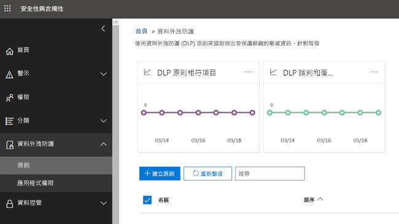
  
## DLP 原則的內容

DLP 原則包含一些基本事項：
  
- 若要保護的內容-**位置**例如 Exchange Online、 SharePoint Online 和 OneDrive for Business 網站的位置。 
    
- 何時及如何藉由執行強制包含下列要素的**規則**來保護內容： 
    
  - **條件**會強制執行規則-之前，必須符合的內容，例如尋找僅適用於包含身分證號碼指與組織外部人員共用的內容。 
    
  - 您要規則在找到符合條件的內容時自動採取的**動作** -- 例如封鎖文件的存取，以及傳送電子郵件通知給使用者和法務人員。 
    
您可以使用規則來符合特定保護需求，並再使用 DLP 原則來群組在一起常見保護需求，例如所有遵守特定法規所需的規則。
  
例如，您可能必須可協助您偵測的資訊受限於健康保險流通與責任法案 (HIPAA) 管制的 DLP 原則。此 DLP 原則可以幫助保護所有 SharePoint Online 網站和所有 OneDrive for Business 網站 （位置） 的 HIPAA 資料 （什麼） 所尋找的任何含有與組織外部人員 (共用此敏感資訊的文件條件） 然後封鎖文件的存取，並傳送通知 （動作）。這些需求會儲存為個別的規則，並分組，以簡化管理和報告的 DLP 原則。
  
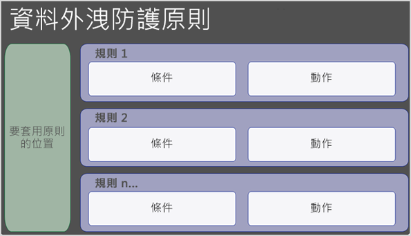
  
### 位置

DLP 原則可以尋找和 Office 365 敏感資訊保護，是否該資訊位於 Exchange Online、 SharePoint Online 或商務用 OneDrive。您可以輕鬆選擇保護所有 SharePoint 網站或 OneDrive 帳戶，只是特定網站或帳戶或所有的信箱。請注意，它還不能以選取特定使用者的信箱。
  
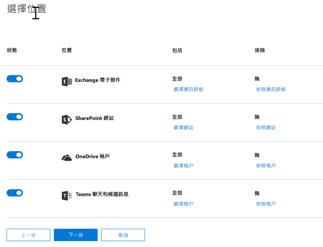
  
注意： 如果您選擇要包含或排除特定的 SharePoint 網站或 OneDrive 帳戶，DLP 原則可以包含超過 100 這類包含與排除。雖然這項限制存在，了解您可以套用全組織原則或套用到整個組織的原則來超過此限制。
  
### 規則

規則是什麼強制執行您的業務需求，在您的組織內容。原則都包含一或多個規則，以及每個規則包含的條件和動作。如需每個規則，條件符合時，不採取動作自動。規則會依序執行，開頭中每個原則的最高優先順序規則。
  
規則也提供選項，以通知 （搭配原則提示和電子郵件通知） 的使用者和系統管理員 （處理電子郵件附隨報告） 的內容符合規則。
  
在此規則的元件，每個說明如下。
  
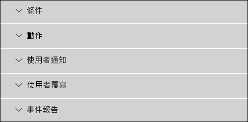
  
#### 條件

條件很重要，因為它們決定何種類型的資訊您正在尋找，以及何時採取動作。例如，您可能會選擇要忽略內容包含護照號碼，除非內容包含此類十個以上的數字，並與組織外部人員共用。
  
條件焦點上**的內容**，例如您要尋找的敏感資訊類型，以及**內容**，例如文件共用與人員。您可以將不同的動作指派給不同的風險層級使用條件--例如，內部共用的敏感內容可降低風險並時，可能需要較少的動作，比與組織外部人員共用的敏感內容。 
  
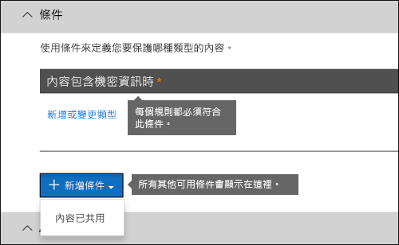
  
目前可用的條件可以判斷：
  
- 內容包含敏感資訊類型。
    
- 內容包含標籤。如需詳細資訊，請參閱以下區段 [[使用標籤作為 DLP 原則的條件](data-loss-prevention-policies.md#label)。
    
- 內容是否與組織外部或內部人員共用。
    
#### 敏感資訊類型

DLP 原則可協助保護敏感資訊，指**敏感資訊類型**。Office 365] 跨許多不同的區域，可供您使用，例如信用卡號碼、 銀行帳戶號碼、 國家識別碼號碼和護照號碼包含許多常見的敏感資訊類型的定義。 
  
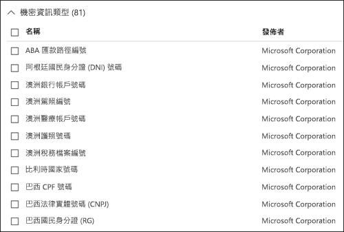
  
例如信用卡號碼敏感資訊類型尋找 DLP 原則，它不會只尋找 16 位數的數字。每個敏感資訊類型是定義，以及偵測到所使用的組合：
  
- 關鍵字
    
- 驗證總和檢查碼或結構的內部函數
    
- 用以尋找模式相符項目的規則運算式評估
    
- 其他內容檢查
    
這有助於 DLP 偵測達到高度準確性同時減少誤判能夠中斷 peoples 的工作數目。
  
#### 動作

當內容符合規則的條件時，您可以套用動作以自動保護內容。
  

  
目前可用的動作，您可以進行下列作業：
  
- **限制內容的存取權**對於網站內容，這表示文件的權限受到限制的所有人，主要網站集合管理員、 文件擁有者和上次修改文件的人員除外。這些人員可以從文件移除機密資訊，或採取其他補救措施。在 [合規性文件時，將會自動還原原始的權限。當封鎖存取文件時，文件會出現在網站上的程式庫中特殊的原則提示的圖示。 
    
    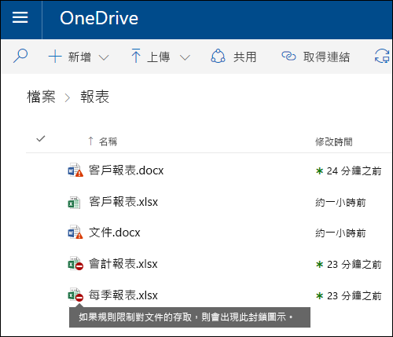
  
    電子郵件內容，此巨集指令會封鎖傳送郵件。根據 DLP 規則的設定方式，寄件者將會看到 NDR 或 （如果此規則使用通知） 的原則提示及/或電子郵件通知。
    
    
  
#### 使用者通知與使用者覆寫

您可以使用通知，並且會覆寫教育使用者有關 DLP 原則，並協助他們持續相容，而不封鎖他們的工作。例如，如果使用者嘗試共用包含敏感資訊的文件，DLP 原則可以同時將電子郵件通知傳送給他們和，讓他們能覆寫原則，如果他們有業務上的文件庫的內容中顯示原則提示理由。
  
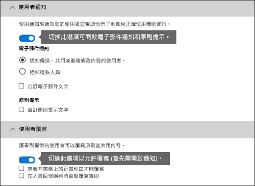
  
電子郵件可以通知傳送、 共用，或上次修改的內容和，網站內容、 主要網站集合管理員及文件擁有者的人員。此外，您可以新增或移除任何一個您選擇從電子郵件通知。
  
除了傳送電子郵件通知，使用者所顯示的通知原則提示：
  
- 在 Outlook 2013 和更新版本及 outlook 網頁版。
    
- 文件上的 SharePoint Online 或 OneDrive for Business 網站。
    
- 在 Excel 2016、 PowerPoint 2016 和 Word 2016 中，當文件儲存在網站上包含在 DLP 原則。
    
電子郵件通知和原則提示說明內容與 DLP 原則的衝突的原因。如果您選擇的電子郵件通知和原則提示可以讓使用者報告為誤判或提供業務上理由覆寫規則。這可協助您教育使用者有關 DLP 原則，並強制他們不防止人員執行其工作。覆寫及誤判的相關資訊也會在記錄的報告 （請參閱以下 DLP 報告的詳細），並且包含於附隨報告 （下一節），以便法務人員可以定期檢閱這項資訊。
  
以下是什麼原則提示看起來像在 OneDrive 商務帳戶。
  
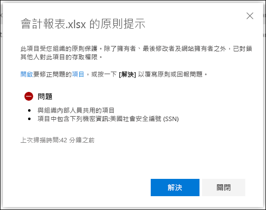
  
#### 事件報告

時於符合規則，您可以傳送給您的法務 （或任何您選擇的人員） 附隨報告與事件的詳細資料。此報告中包含的項目相符，實際內容符合規則，以及上次修改內容的人員名稱的相關資訊。對於電子郵件，報告也包括附件形式原始郵件符合 DLP 原則。
  
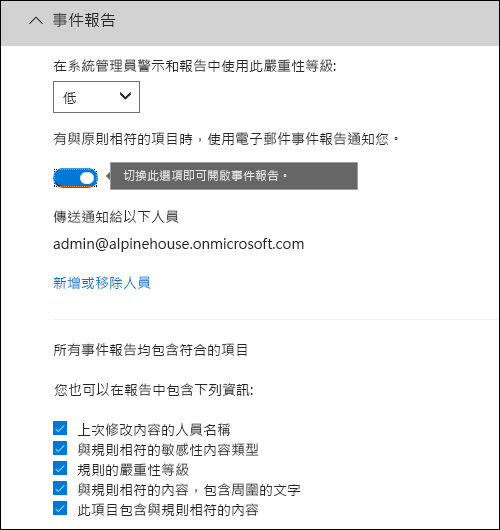
  
## 分組和邏輯運算子

通常您的 DLP 原則具有簡單的需求，例如找出包含美國社會安全號碼的所有內容。不過，在其他情況下，您的 DLP 原則可能需要以識別定義多鬆散資料。
  
例如，若要識別內容受到美國健康保險法案 (HIPAA)，您需要尋找：
  
- 包含特定類型的敏感資訊，例如美國社會安全號碼或藥物執法機構 (DEA) 編號的內容。
    
    AND
    
- 內容是更容易識別，例如溝通關於病患照護或醫療服務提供的說明。用於識別此內容需要比對關鍵字非常大型的關鍵字清單，例如國際分類的治療法 （ICD-9-CM 或 ICD-10-CM）。
    
您輕鬆地可以使用群組及邏輯運算子 (AND、 OR) 來識別此類鬆散已定義的資料。當您建立的 DLP 原則時，您可以：
  
- 群組敏感資訊類型。
    
- 選擇 [自己的群組和群組內的機密資訊類型之間的邏輯運算子。
    
### 選擇群組內的運算子

在群組中，您可以選擇是否任一或所有該群組中的條件必須滿足符合規則的內容。
  
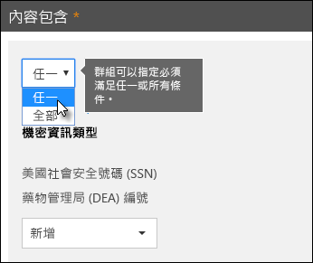
  
### 新增群組

您可以快速地加入群組，其中可以有自己的條件與該群組內的運算子。
  
![新增群組] 按鈕](media/5f72f292-d1f3-4f11-a911-a9f71e10abf6.png)
  
### 選擇群組之間的運算子

之間群組，您可以選擇是否必須符合規則的內容符合中只有一個群組或群組的所有條件。
  
例如，內建的**美國 HIPAA**原則已使用**AND**運算子群組之間，使它會識別包含內容的規則： 
  
- 從群組**PII 識別碼**（至少一個 SSN 號碼**或**DEA 號碼） 
    
    **AND**
    
- 從群組**醫療字詞**（至少一個 ICD-9-CM 關鍵字**或**的 ICD-10-CM 關鍵字） 
    

  
## 依據處理規則優先順序

當您在原則建立規則時，每個規則被指派優先順序，它會建立的順序-也就是說，建立的規則首先有第一優先，第二個建立的規則有第二個優先順序，依此類推。建立規則之後，就無法變更其優先順序，除非藉由刪除並重新建立它。
  

  
根據規則評估內容時，這些規則會處理依優先順序。如果內容符合多個規則，這些規則會處理依優先順序，並強制執行的最嚴格的巨集指令。例如，如果內容符合所有下列規則，規則 3 已強制執行因為它是最高優先順序、 最嚴格規則：
  
- 規則 1： 僅通知使用者
    
- 規則 2： 通知使用者，限制存取權，並允許使用者覆寫
    
- 規則 3： 通知使用者，限制存取權，並不允許使用者覆寫
    
- 規則 4： 僅通知使用者
    
- 規則 5： 限制存取
    
- 規則 6： 通知使用者，限制存取權，並不允許使用者覆寫
    
在這個範例中，請注意，針對所有規則相符項目會記錄在稽核記錄中 DLP 報告，顯示即使最嚴格規則會強制執行。
  
關於原則提示，請注意:
  
- 僅限的原則提示從最高的優先順序，將會顯示最嚴格規則。例如，原則提示從一個規則，透過從一個規則，只會傳送通知原則提示也會顯示封鎖內容的存取權。這可防止人員看到 cascade 的原則提示。
    
- 如果最嚴格規則中的原則提示允許人員覆寫規則，則覆寫此規則也將會覆寫內容符合的任何其他規則。
    
## 調整規則，以使其更容易或難符合

人員建立並開啟其 DLP 原則之後，他們有時遇到下列問題：
  
- **不是**敏感資訊比對規則-換句話說，太多誤判太多內容。 
    
- **敏感資訊**比對規則-換句話說，而不被強制執行動作的敏感資訊為基礎的太少內容。 
    
若要解決這些問題，您可以藉由調整的執行個體計數調整您的規則，並比對正確性，使其更困難或更容易以符合規則的內容。規則中使用每個敏感資訊類型都有兩個執行個體計數和比對正確性。
  
### 執行個體計數

執行個體計數只表示的特定類型的敏感資訊的多少項目必須要有符合規則的內容。例如，內容會比對是否介於 1 到 9 唯一美國或英國護照號碼識別如下所示的規則。
  
請注意執行個體計數包含只敏感資訊類型和關鍵字**唯一**相符項目。例如，如果電子郵件包含相同的信用卡號碼的 10 個項目，這些 10 個項目就會視為信用卡號碼的單一執行個體。 
  
若要使用執行個體計數調整規則，本指南很簡單：
  
- 若要讓規則來比對更容易，減少**最小**計數和/或增加的**最大**計數。您也可以設定**最大****任何**要刪除的數值。 
    
- 若要更難符合規則，請增加 [**最小**計數。 
    
一般而言，您可以使用限制較少的動作，例如將使用者通知傳送中具有較低的執行個體計數 (例如，1-9) 的規則。並使用更嚴格的動作，例如限制內容的存取，而不讓使用者覆寫，在具有較高的執行個體計數 （例如 10 任何） 的規則。
  
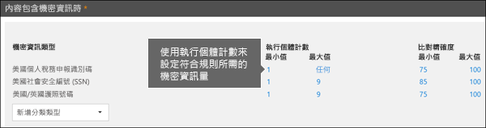
  
### 比對正確性

如前所述，敏感資訊類型定義，及使用不同類型的辨識項的組合來偵測。通常，敏感資訊類型被定義多個這類組合，稱為模式。需要較少證據的模式具有較低的比對正確性 （或 [信賴等級） 時需要更多辨識來具有較高的比對正確性 （或信賴等級） 的模式。若要深入了解每個敏感資訊類型所使用的信賴等級與實際的模式，請參閱[敏感資訊類型在找什麼](what-the-sensitive-information-types-look-for.md)。
  
例如，名為信用卡號碼敏感資訊類型會定義兩種模式：
  
- 需要的 65%信賴模式：
    
  - 信用卡號碼的號碼格式。
    
  - 通過總和檢查碼數目。
    
- 需要的 85%信賴模式：
    
  - 信用卡號碼的號碼格式。
    
  - 通過總和檢查碼數目。
    
  - 關鍵字或到期日的正確格式。
    
您可以使用這些信賴等級 （或比對正確性） 中您的規則。一般而言，您可以使用限制較少的動作，例如將使用者通知傳送中具有較低的比對正確性的規則。並使用更嚴格的動作，例如限制內容的存取，而不讓使用者覆寫，在具有較高的比對正確性的規則。
  
請務必了解當特定類型的敏感資訊，例如信用卡號碼，且識別內容中，會傳回只有單一信賴等級：
  
- 如果所有的相符項目都是單一的模式，則會傳回該模式的信賴等級。
    
- 如果有多個模式比對的比對 （亦即，有兩個不同的信賴等級的相符項目），則會傳回高於任何單獨的單一模式的信賴等級。這是麻煩的部分。例如，如信用卡、 65%和 85%模式都符合，如果信賴等級傳回敏感資訊類型是大於 90%，因為更多辨識來表示更多的信賴度。
    
因此如果您想要建立這兩個是互斥的規則，如信用卡、 一個用於 65%比對正確性，一個用於 85%比對正確性，比對正確性的範圍看起來像這樣。第一個規則挑選只比對的 65%圖樣。第二個規則可以挑選符合與**至少一個**85%相符項目**可能有**其他較低信賴相符項目。 
  
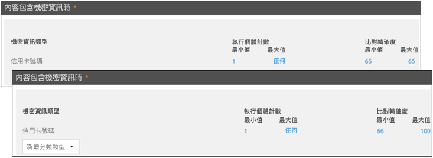
  
基於這些理由，是使用不同的相符項目精確度建立規則的指引：
  
- 最低信賴等級通常會使用**min**和**max** （不提供範圍） 的相同的值。 
    
- 最高的信賴等級通常是，範圍從較低的信賴等級的正上方到 100。
    
- 任何中間的信賴等級通常介於正上方低信賴等級來剛下方的較高的信賴等級。
    
## 使用標籤做為 DLP 原則的條件

您可以建立標籤，然後：
  
- **發佈**，以便使用者可看見並以手動方式將標籤套用到內容。 
    
- 它的內容符合您選擇的條件時**自動套用**。 
    
如需標籤的詳細資訊，請參閱 < <b0>Overview of 保留標籤</b0>。
  
建立標籤之後，然後在您的 DLP 原則中使用該標籤做為條件。例如，您可能想要這麼做，因為：
  
- 您發佈標籤名為 2 私人 3**機密文件**，以便您組織中的人員可以手動將標籤套用至機密電子郵件和文件。使用此標籤作為 DLP 原則的條件，您可以限制標示**2 私人 3 機密**與組織外部人員共用的內容。 
    
- 您建立名為**高山屋**該名稱的專案的標籤，且然後此標籤自動套用到包含關鍵字"高山 House"的內容。藉由使用此標籤作為 DLP 原則中的條件，您可以顯示原則提示使用者即將要與組織外部人員共用此內容時，可。 
    
- 您發佈標籤名為**稅務記錄**，以便記錄管理員可以手動將標籤套用至需要分類為記錄的內容。使用此標籤作為 DLP 原則的條件，您可以查看有搭配其他類型的敏感資訊，例如 ITINs 或 Ssn; 此標籤的內容將保護動作套用到內容標示為**稅務記錄**;取得關於 DLP 原則的詳細的活動報告中的 DLP 報告並稽核記錄資料。 
    
- 您發佈至 Exchange 信箱和主管群組中的 OneDrive 帳戶名為**高階主管的領導團隊-機密**的標籤。使用此標籤作為 DLP 原則的條件，您可以強制保留和保護動作在相同的子集合的內容和使用者。 
    
使用標籤做為在您的 DLP 規則條件，可以您選擇性地強制執行一組特定的內容、 位置或使用者保護動作。
  
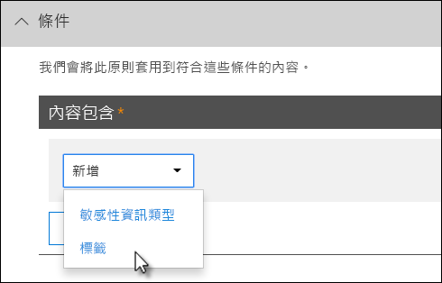

### 即將敏感度標籤的支援

請注意，您可以做為條件，而不是[敏感度標籤](sensitivity-labels.md)，目前使用只保留標籤。我們目前正在使用敏感度標籤在這種情況的支援。
  
### 這項功能與其他功能關聯的方式

許多功能可以套用至包含敏感資訊的內容：
  
- [保留標籤](labels.md#applying-a-retention-label-automatically-based-on-conditions)和[保留原則](retention-policies.md)兩者都可以強制執行此內容的**保留**動作。 
    
- DLP 原則可以強制執行此內容的**保護**動作。且之前強制執行這些動作，DLP 原則可能需要其他條件以符合除了包含標籤的內容。 
    
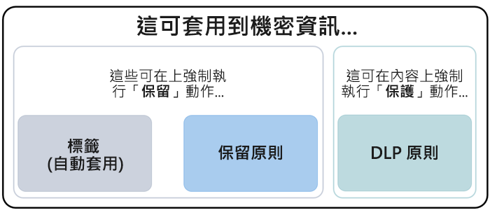
  
請注意，DLP 原則比標籤或保留原則套用至敏感資訊的更豐富偵測功能。DLP 原則可以強制執行內容包含敏感資訊的保護措施，以及如果敏感資訊會移除內容，這些防護動作都復原的內容掃描下一次。但如果保留原則或標籤套用至包含敏感資訊的內容，即使移除機密資訊的無法復原一次性巨集指令。
  
使用標籤作為 DLP 原則的條件，您可以強制保留和保護的動作，以該標籤的內容。您可以將內容包含包含敏感資訊的內容完全一樣的標籤-標籤和敏感資訊類型是用來分類內容，以便您可以強制執行動作會在內容上的內容。
  
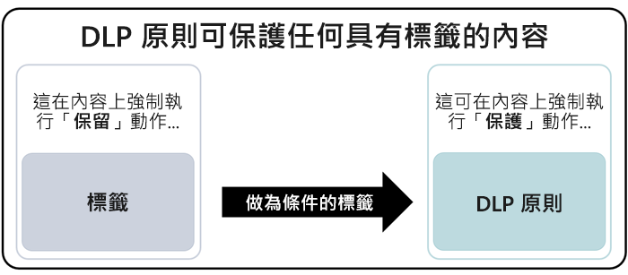
  
## 簡單的設定與進階設定

當您建立的 DLP 原則時，您將會選擇之間簡單] 或 [進階] 設定：
  
- **簡單的設定**可以輕鬆建立 DLP 原則的最常見的類型，而不使用規則編輯器來建立或修改的規則。 
    
- **進階設定**可用於在規則編輯器讓您每項設定 DLP 原則的完整控制權。 
    
別擔心，實際上，簡單的設定和進階的設定的運作方式完全相同，藉由執行強制以下組成的條件和動作-僅使用簡單的設定規則，您沒有看到規則編輯器。它是建立 DLP 原則快速方法。
  
### 簡單的設定

到目前為止，最常見的 DLP 案例建立原則以協助保護與外部組織，並採取自動的補救動作，例如限制可以存取內容的人員共用的內容包含敏感資訊傳送使用者或系統管理員通知及稽核更新調查的事件。人員使用 DLP 以防止意外洩漏的敏感資訊。
  
為了簡化達成此目的，當您建立的 DLP 原則時，您可以選擇**使用簡單的設定**。這些設定可提供您需要實作最常見的 DLP 原則，而不必在規則編輯器而進入的所有項目。
  
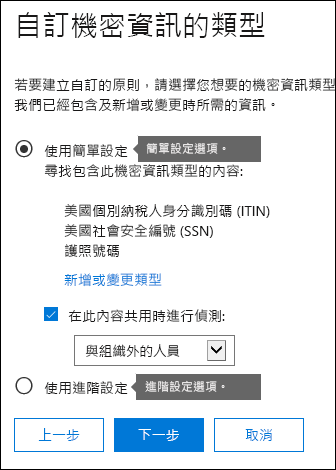
  
### 進階設定

如果您需要建立更多自訂的 DLP 原則，您可以選擇**使用進階設定]**。
  
進階的設定為您提供規則編輯器，其中具有完整控制權每個可能的選項，包括執行個體計數和比對正確性 （信賴等級） 為每個規則。
  
若要快速跳至] 區段中，按一下上方導覽列中的規則編輯器]，以移至下該區段中的項目。
  
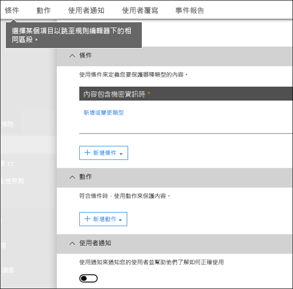
  
## DLP 原則範本

建立 DLP 原則的第一個步驟選擇要保護的資訊。開始使用 DLP 範本，您可以儲存建置一組新的規則從頭，並找出哪些類型的資訊應該包含預設的工作。然後，您可以新增至，或修改這些需求來微調規則，以符合貴組織的特定需求。
  
預先設定的 DLP 原則範本可協助您偵測特定類型的敏感資訊，例如 HIPAA 資料、 PCI-DSS 資料、 Gramm-leach-bliley 金融服務業現代化法案資料或甚至是特定地區設定個人識別資訊 (P.I.)。若要讓您輕鬆地尋找和保護常見的敏感資訊類型，已包含在 Office 365 中的原則範本包含最常見的敏感資訊類型所需的您開始。
  
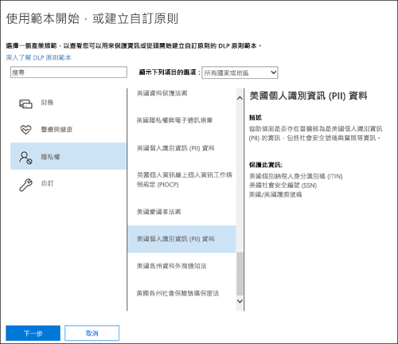
  
您的組織可能也有它自己的特定需求，這時您可以從頭開始建立 DLP 原則藉由選擇 [**自訂原則**] 選項。自訂原則是空的而且包含任何預設的規則。 
  
## 以測試模式逐漸推出 DLP 原則

當您建立 DLP 原則時，您應該考慮推行這些逐漸評估其影響，並完全強制執行前測試其有效性。例如，您不想要不小心封鎖存取數千名人員需要存取權，才能完成其工作的文件的新 DLP 原則。
  
如果您正在建立 DLP 原則與重大影響，建議下列順序：
  
1. **在不搭配原則提示就測試模式中的啟動**，然後使用 DLP 報告，以及任何附隨報告來評估影響。您可以使用 DLP 報告以檢視數目、 位置、 類型及嚴重性原則相符項目。根據結果，您可以微調規則視。在測試模式中，DLP 原則不會影響組織中工作人員的生產力。 
    
2. **移至與通知和原則提示的測試模式**，讓您可以開始教導您合規性原則的相關的使用者，並準備要套用的規則。在這個階段，您也可以要求使用者報告誤判，以便您可以進一步縮小規則。 
    
3. **開始完整強制執行原則**，使套用規則中的動作和內容的保護。持續監視 DLP 報告，以及任何附隨報告或通知] 以確認是您想要的結果。 
    
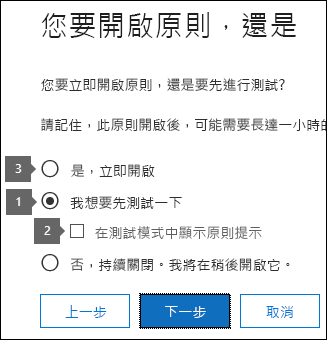
  
您可以關閉 DLP 原則，不論任何時候，而這會影響在原則中的所有規則。不過，每個規則可以也會關閉個別切換在規則編輯器中的其狀態。
  
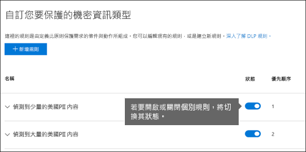
  
## DLP 報告

在建立並開啟您的 DLP 原則之後，您會想要確認他們正在如您預期運作，並協助您符合規範。透過 DLP 報告，您可以快速檢視 DLP 原則的數目和規則相符超越時間和誤判的數目，並覆寫。針對每個報告，您可以篩選的位置、 時段，這些相符項目和即使縮小至特定的原則、 規則或巨集指令。
  
透過 DLP 報告，您將可取得深入的商業資訊，並且：
  
- 將重點放在特定時段，以了解尖峰和趨勢的原因。
    
- 探索違反貴組織的符合性原則的商務程序。
    
- 了解 DLP 原則帶來的任何業務影響。
    
此外，您可以使用 DLP 報告來微調您所執行的 DLP 原則。
  

  
## DLP 原則的運作方式

DLP 會使用深度內容分析 (不只是簡單的文字掃描) 來偵測敏感資訊。此深度內容分析會使用關鍵字比對、字典比對、規則運算式評估、內部函數和其他方法來偵測符合 DLP 原則的內容。可能只有一小部分的資料會被視為敏感資訊。DLP 原則可識別、監視和自動保護該項資料，而不會妨礙或影響到使用其餘內容的人員。
  
### 原則會同步處理

安全性建立 DLP 原則之後&amp;合規性中心，已儲存在中央原則存放區，並再同步處理至各種內容來源，包括：
  
- Exchange Online，並從有網頁型 Outlook 和 Outlook 2013 和更新版本
    
- 商務用 OneDrive 網站
    
- SharePoint Online 網站
    
- Office 2016 桌面程式 (Excel 2016、PowerPoint 2016 和 Word 2016)
    
原則同步處理至正確的位置之後，它會開始評估內容並強制執行動作。
  
### 商務用 OneDrive 和 SharePoint Online 網站中的原則評估

跨所有的 SharePoint Online 網站和商務用 OneDrive 網站，經常變更文件-他們正在不斷建立、 編輯、 共用及等等。這表示文件可以發生衝突，或任何時候使其符合 DLP 原則。例如，某個人可以上傳包含其小組網站] 中，沒有敏感資訊的文件，但另一個人可以編輯同一份文件並將機密資訊新增至其更新版本中。
  
因此，DLP 原則會頻繁地在背景中檢查文件是否有原則相符項目。您可以將此視為非同步原則評估。
  
以下是其運作方式。為人員新增或變更其網站中的文件，搜尋引擎會掃描內容，以便您稍後再搜尋的方式。當發生此問題時，內容也掃描的敏感資訊，並檢查是否它共用。找不到任何敏感資訊儲存安全地在搜尋索引，以便只有 「 規範小組可以存取它，但不是一般使用者。您已開啟的每個 DLP 原則在背景中執行 （非同步），檢查經常符合原則之內容的搜尋及套用動作，以防止不慎外洩。
  
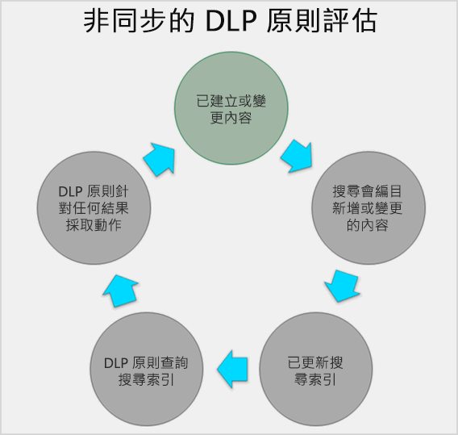
  
最後，文件可能會違反 DLP 原則，但也可能會符合 DLP 原則。例如，如果人員在文件中加入信用卡號碼，有可能會導致 DLP 原則自動封鎖文件的存取。但如果人員稍後移除敏感資訊，則會在下次依據原則進行評估時自動復原動作 (在此案例中為封鎖)。
  
DLP 會評估可以編製索引的任何內容。如需有關預設會編目哪些檔案類型的詳細資訊，請參閱[預設編目檔案副檔名及剖析的 SharePoint Server 2013 中的檔案類型](https://go.microsoft.com/fwlink/p/?LinkID=627430)。
  
### Exchange Online、 Outlook 2013 和更新版本和 outlook 網頁版中的原則評估

當您建立包含 Exchange Online 做為位置的 DLP 原則時，此原則的同步處理從 Office 365 安全性&amp;合規性中心至 Exchange Online 中，然後再從 Exchange Online，以在網頁型 Outlook 和 Outlook 2013 和更新版本。
  
在 Outlook 中正在撰寫郵件，使用者即可看到原則提示時所建立的內容會根據 DLP 原則評估。與郵件傳送後，它會根據 DLP 原則評估作為一般郵件流程，以及 Exchange 郵件流程規則 （也稱為傳輸規則） 和在 Exchange 系統管理中心中建立的 DLP 原則的一部分 （請參閱下一節以取得更多資訊）。DLP 原則會掃描郵件和任何附件。
  
### Office 2016 桌面程式中的原則評估

Excel 2016、 PowerPoint 2016 和 Word 2016 包含相同的功能，以識別機密資訊，並套用 DLP 原則做為 SharePoint Online 和商務用 OneDrive。這些 Office 2016 程式同步處理其直接從中央原則存放區的 DLP 原則，然後再根據 DLP 原則的內容持續評估，當人員搭配開啟從網站中的 DLP 原則所包含的文件。
  
在 Office 2016 中的 DLP 原則評估的設計目的不會影響效能的程式或內容上工作人員的生產力。如果他們正在處理大型文件，或使用者的電腦為忙碌，可能需要幾秒顯示原則提示。
  
## 權限

會建立 DLP 原則的規範小組成員需要權限給安全性群組&amp;合規性中心。根據預設，您的租用戶系統管理員將能夠存取此位置並可授與法務人員及其他人員存取安全性&amp;合規性中心，而不提供他們取得所有租用戶管理員的權限若要這麼做，我們建議您：
  
1. 在 Office 365 中建立一個群組，並將法務人員新增至此群組。
    
2. 建立角色群組的安全性**權限**] 頁面上&amp;合規性中心。 
    
3. 將 Office 365 群組新增至此角色群組。
    
如需詳細資訊，請參閱[Give users access to the Office 365 Compliance Center](grant-access-to-the-security-and-compliance-center.md)。
  
需要這些權限才能建立及套用 DLP 原則。原則強制執行不需要內容的存取權。
  
## 尋找 DLP 指令程式

若要使用之 cmdlet 的大部分 security&amp;合規性中心，您需要：
  
1. [使用遠端 PowerShell 連線到 Office 365 安全性與合規性中心](http://go.microsoft.com/fwlink/?LinkID=799771&amp;clcid=0x409)
    
2. 使用下列任何一這些[Office 365 安全性&amp;合規性中心 cmdlet](http://go.microsoft.com/fwlink/?LinkID=799772&amp;clcid=0x409)
    
不過，DLP 報告需要提取資料從 Office 365，包括 Exchange Online。基於這個理由，DLP 報告指令程式可供在 Exchange Online Powershell-而不是以安全性&amp;合規性中心 Powershell。因此，若要使用 cmdlet 的 DLP 報告，您必須：
  
1. [使用遠端 PowerShell 連線到 Exchange Online](http://go.microsoft.com/fwlink/?LinkID=799773&amp;clcid=0x409)
    
2. 使用這些 cmdlet 的任何 DLP 報告：
    
  - [Get-DlpDetectionsReport](http://go.microsoft.com/fwlink/?LinkID=799774&amp;clcid=0x409)
    
  - [Get-DlpDetailReport](http://go.microsoft.com/fwlink/?LinkID=799775&amp;clcid=0x409)
    
## 詳細資訊

- [從範本建立 DLP 原則](create-a-dlp-policy-from-a-template.md)
    
- [針對 DLP 原則傳送通知並顯示原則提示](use-notifications-and-policy-tips.md)
    
- [建立 DLP 原則來保護具有 FCI 或其他屬性的文件](protect-documents-that-have-fci-or-other-properties.md)
    
- [DLP 原則範本包含哪些內容](what-the-dlp-policy-templates-include.md)
    
- [敏感性資訊類型在找什麼](what-the-sensitive-information-types-look-for.md)
    
- [DLP 功能所尋找的項目](what-the-dlp-functions-look-for.md)
    
- [建立自訂的敏感性資訊類型](create-a-custom-sensitive-information-type.md)
    

