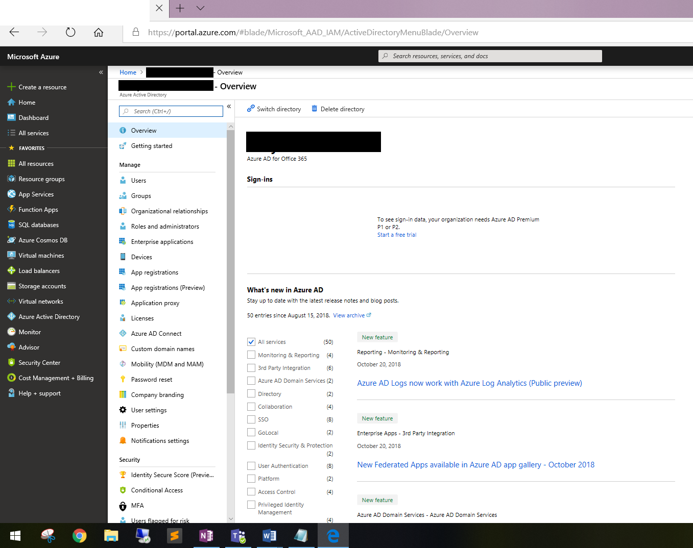
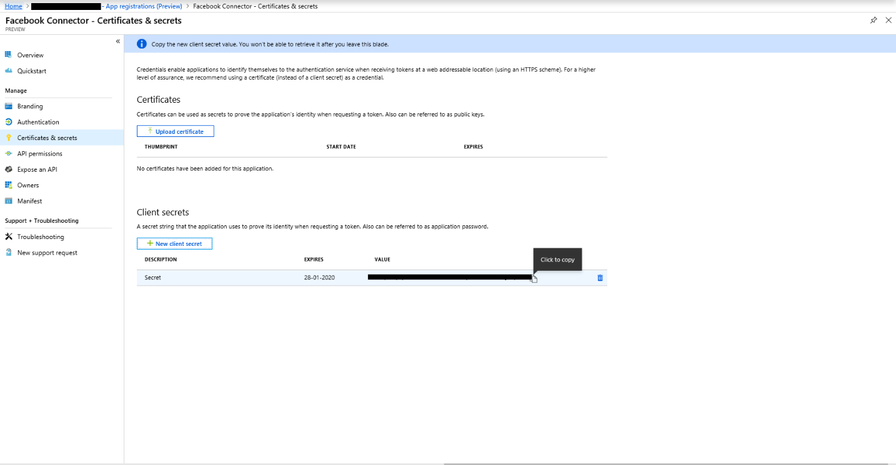

# 在 Office 365 中部署連接器以封存 Facebook 資料

本文包含以部署使用 Office 365 匯入服務將資料從 Facebook 商務頁面匯入至 Office 365 的逐步程式。 如需此程式的高階概述以及部署 Facebook 連接器所需的必要條件清單, 請參閱[在 Office 365 中使用範例連接器封存 Facebook 資料 (預覽)](archive-facebook-data-with-sample-connector.md)。 

## 步驟 1: 下載套件

從 GitHub 存放庫的版本章節下載預建套件, 網址<https://github.com/Microsoft/m365-sample-connector-csharp-aspnet/releases>為。 在最新的版本下, 下載名為**SampleConnector**的 zip 檔案。 在步驟4中, 您將此 zip 檔案上傳至 Azure。

## 步驟 2: 在 Azure Active Directory 中建立應用程式

1. 移至<https://portal.azure.com> , 並使用 Office 365 全域系統管理員帳戶的認證登入。

    

2. 在左功能窗格中, 按一下 [ **Azure Active Directory**]。

    

3. 在左功能窗格中, 按一下 **[應用程式註冊] ([預覽])** , 然後按一下 [**新增註冊**]。

    

4. 註冊應用程式。 在 [重新導向 URI] 下, 選取 [應用程式類型] 下拉式<https://portal.azure.com>清單中的 [Web], 然後輸入 URI 的方塊。

   

5. 複製**應用程式 (用戶端) 識別碼**和**目錄 (租**使用者) 識別碼, 並將它們儲存到文字檔或其他安全的位置。 您可以在稍後的步驟中使用這些識別碼。

   

6. 移至 **[憑證] & 新應用程式的機密。**

   

7. 按一下 [**新增用戶端密碼**]

   

8. 建立新的密碼。 在 [描述] 方塊中, 輸入密碼, 然後選擇到期時間。 

    

9. 複製機密的值, 並將它儲存到文字檔或其他儲存位置。 這是您在稍後步驟中使用的 AAD 應用程式密碼。

   

10. 請移至**資訊清單**, 並複製 identifierUris (也稱為 AAD 應用程式 Uri), 如下列螢幕擷取畫面所示。 將 AAD 應用程式 Uri 複製到文字檔或其他儲存位置。 您可以在步驟6中使用。

   

## 步驟 3: 建立 Azure 儲存體帳戶

1. 移至您組織的 Azure 首頁。

    

2. 按一下 [**建立資源**], 然後在 [搜尋] 方塊中輸入 [**儲存帳戶**]。

    

3. 按一下 [**儲存**], 然後按一下 [**儲存帳戶**]。

    

4. 在 [**建立儲存帳戶**] 頁面上的 [訂閱] 方塊中, 根據您擁有的 Azure 訂閱類型, 選取 [**隨**選即用] 或 [**免費試用**]。 然後選取或建立資源群組。

    

5. 輸入儲存帳戶的名稱。

    

6. 檢查, 然後按一下 [**建立**] 以建立儲存體帳戶。

    

7. 幾分鐘後, 按一下 [ **** 重新整理], 然後按一下 [**移至資源**] 以流覽至儲存體帳戶。

    

8. 按一下左功能窗格中的 [**訪問金鑰**]。

    

9. 複製**連接字串**, 並將它儲存到文字檔或其他儲存位置。 您可以在建立 web 應用程式資源時使用此程式。

    

## 步驟 4: 在 Azure 中建立新的 web 應用程式資源

1. 在 Azure 入口網站的**首頁**上, 按一下 [**建立所有\> Web \>應用程式的資源**]。 在 [ **Web 應用程式**] 頁面上, 按一下 [**建立**]。 

   

2. 填寫詳細資料 (如下所示), 然後再建立 Web 應用程式。 請注意, 您在 [**應用程式名稱**] 方塊中輸入的名稱會用來建立 Azure 應用程式服務 URL;例如, fbconnector.azurewebsites.net。

   

3. 移至新建立的 web 應用程式資源, 按一下左功能窗格中的 [**應用程式設定**]。 在 [應用程式設定] 下, 按一下 [新增設定], 然後新增下列三個設定: 使用值 (您從先前的步驟複製到文字檔): 

    – **APISecretKey** –您可以輸入任何值作為機密。 這是用來存取步驟7中的連接器 web 應用程式。

    – * * StorageAccountConnectionString-您在步驟3中建立 Azure 儲存體帳戶之後複製的連接字串 Uri。

    – **tenantId** –您在步驟2中建立 Azure Active Directory 中的 Facebook 連接器應用程式後所複製之 Office 365 組織的租使用者識別碼。

    

4. 在 **[一般設定**] **** 下, 按一下 [ **Always on**] 旁的 [下一步]。 按一下頁面頂端的 [**儲存**] 以儲存應用程式設定。

   

5. 最後一個步驟是將連接器應用程式原始程式碼上傳至您在步驟1下載的 Azure。 在網頁瀏覽器中, 移至<AzureAppResourceName>HTTPs://。 例如, 如果您的 Azure 應用程式資源名稱 (在本節步驟2中命名為**fbconnector**), 則您會前往https://fbconnector.scm.azurewebsites.net/ZipDeployUi。 

6. 將 SampleConnector 的 .zip (您在步驟1下載) 拖放至此頁面。 上載檔案並成功部署後, 頁面看起來會類似下列螢幕擷取畫面:

   

## 步驟 5: 註冊 Facebook 應用程式

1. 請移<https://developers.facebook.com>至, 使用組織的 Facebook 商務頁帳戶登入, 然後按一下 [新增**應用程式**]。

   

2. 建立新的應用程式識別碼。

   

3. 在左功能窗格中, 按一下 [**新增產品**], 然後按一下 [ **Facebook 登**入] 磚中的 [**設定**]。

   

4. 在 [整合 Facebook 登入] 頁面上, 按一下 [ **Web**]。

   

5. 新增 Azure 應用程式服務 URL;例如https://fbconnector.azurewebsites.net。

   

6. 完成 Facebook 登入設定的快速入門一節。

   

7. 在 [ **Facebook 登**入] 底下的左功能窗格中, 按一下 [**設定**], 然後在 [**有效的 OAuth 重新導向 Uri** ] 方塊中新增 OAuth 重新導向 URI。 使用格式** \<connectorserviceuri>/views/facebookoauth**, 其中 connectorserviceuri 的值是您組織的 Azure 應用程式服務 URL;例如, https://fbconnector.azurewebsites.net。

   

8. 在左功能窗格中, 按一下 [**新增產品**], 然後按一下 [ **Webhooks]。** 在 [**頁面**] 下拉式功能表中, 按一下 [**頁面**]。 

   

9. 新增 Webhooks 回呼 URL 並新增 verify token。 回呼 URL 的格式, 請使用格式** <connectorserviceuri>/api/FbPageWebhook**, 其中 connectorserviceuri 的值是貴組織的 Azure 應用程式服務 URL;例如https://fbconnector.azurewebsites.net。 

    Verify token 應該類似強式密碼。 將 verify token 複製到文字檔或其他儲存位置。

     

10. 測試並訂閱提要的端點。

    

11. 新增隱私權 URL、應用程式圖示及商務用。 此外, 請將應用程式識別碼和應用程式密碼複製到文字檔或其他儲存位置。

    

12. 將應用程式設為公用。

    

13. 將使用者新增至 [管理員] 或 [測試人員] 角色。

    

14. 新增**頁面公開內容訪問**許可權。

    

15. [新增管理頁面] 許可權。

    

16. 取得 Facebook 所審查的應用程式。

    

## 步驟 6: 設定連接器 web 應用程式

1. 移至 HTTPs://\<AzureAppResourceName> azurewebsites.net (其中 AzureAppResourceName 是您在步驟4中命名的 Azure 應用程式資源名稱), 例如, 如果名稱是**fbconnector**, 請移至https://fbconnector.azurewebsites.net。 應用程式的首頁看起來將如下列螢幕擷取畫面所示:

   

2. 按一下 [**設定**] 以顯示登入頁面。
 
   

3. 在 [租使用者識別碼] 方塊中, 輸入或貼上您在步驟2中取得的租使用者識別碼。 在 [密碼] 方塊中, 輸入或貼上 APISecretKey (您在步驟2中取得的), 然後按一下 [**設定設定設定**] 以顯示 [設定**詳細資料**] 頁面。

    

4. 在 [設定**詳細資料**] 下, 輸入下列設定 

   – **Facebook 應用程式識別碼**–您在步驟5中取得之 Facebook 應用程式的應用程式識別碼。
   – **Facebook 應用程式機密**–您在步驟5中取得的 Facebook 應用程式的應用程式密碼。
   – **Facebook webhooks verify token** –您在步驟5中建立的 verify token。
   – **AAD 應用程式識別碼**–您在步驟2中建立之 Azure Active Directory 應用程式的應用程式識別碼。
   – **AAD 應用程式機密**–您在步驟4中建立之 APISecretKey 密碼的值。
   – **Aad 應用程式 uri** –在步驟2取得的 aad 應用程式 uri;例如, https://microsoft.onmicrosoft.com/2688yu6n-12q3-23we-e3ee-121111123213。
   – **App insights 工具金鑰**–將此方塊保留空白。

5. 按一下 [**儲存**] 以儲存連接器設定。

## 步驟 7: 在安全性 & 規範中心內設定自訂連接器

1. 移至<https://protection.office.com> , 然後按一下 [**資料\>控制\>匯入封存協力廠商資料**]。

   

2.  按一下 [**新增連接器**], 然後按一下 [ **Facebook 頁面**]。

    

3.  在 [**新增連接器應用程式**] 頁面上, 輸入下列資訊, 然後按一下 [**驗證連接器**]。

    -在第一個方塊中, 輸入連接器的名稱, 例如**Facebook**。
    -在第二個方塊中, 輸入或貼上您在步驟4中新增之 APISecretKey 的值。
    -在第三個方塊中, 輸入或貼上 Azure 應用程式服務 URL;例如**https://fbconnector.azurewebsites.net**。
 
    成功驗證連接器之後, 按 **[下一步]**。
    
    

4.  按一下 **[使用連接器應用程式登**入]。

    

5. 再次輸入或貼上 APISecretKey, 然後按一下 **[登入連接器服務**]。

   

6. 按一下 **[以 Facebook 登**入]。

   

7. 在 [**登入 Facebook** ] 頁面上, 使用組織的 Facebook 商務版頁面的帳戶登入。 請確定您登入的 Facebook 帳戶已指派給組織的 Facebook 商務頁面的系統管理員角色

   

8. 按一下 [**選取頁面**], 選擇您要在 Office 365 中封存的組織商務頁面。

   

9. 您所登入的 Facebook 帳戶所管理的商務頁面清單會隨即顯示。 選取要封存的頁面, 然後按一下 [**儲存**]。

    

10. 按一下 [**準備**], 結束連接器服務應用程式的設定。

    

11. 在 [**設定篩選**] 頁面上, 您可以套用篩選, 以匯入 (封存) 特定時期的專案。 按 [下一步]****。

    

12. 在 [**設定儲存帳戶**] 頁面上, 選取您先前所選取之 Facebook 商務頁中的專案要匯入的 Office 365 信箱。

    

13. 檢查您的設定, 然後按一下 **[完成]** , 以完成安全性 & 規範中心內的連接器設定。

    

14. 移至「封存**協力廠商資料**」頁面, 以查看匯入程式的進度。

    
