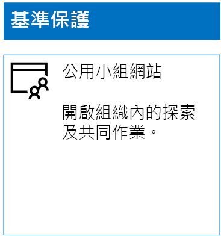
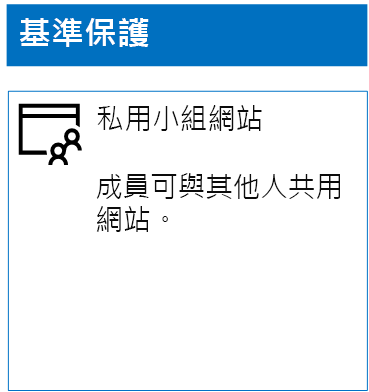
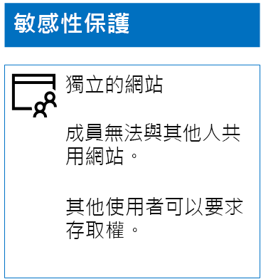
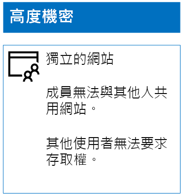

# 部署三種保護層級的 SharePoint Online 網站

 **摘要：** 建立及設定各種資訊保護等級的 SharePoint Online 小組網站。
  
您可以使用本文中的步驟，來設計及部署基準、機密和高度機密 SharePoint Online 小組網站。 如需這三種保護層級的詳細資訊，請參閱[保護 SharePoint Online 網站與檔案](secure-sharepoint-online-sites-and-files.md)。
  
## 基準 SharePoint Online 小組網站

基準保護包含公用和私人小組網站。 公用小組網站可供組織中的任何人探索及存取。 私人網站只能供與小組網站關聯的 Office 365 群組成員探索及存取。 這兩種小組網站類型都可讓成員與其他人共用網站。
  
### 公用

若要建立具有公用存取和權限的基準 SharePoint Online 小組網站，請執行下列作業：
  
1. 使用也可用來管理 SharePoint Online 小組網站的帳戶 (SharePoint Online 系統管理員) 登入系統管理中心。 如需說明，請參閱[在何處登入 Office 365](https://support.office.com/Article/Where-to-sign-in-to-Office-365-e9eb7d51-5430-4929-91ab-6157c5a050b4)。
    
2. 在磚清單中，按一下 [SharePoint]****。
    
3. 在瀏覽器的新 [SharePoint]**** 索引標籤上，按一下 [+ 建立網站]****。
    
4. 在 [建立網站]**** 頁面上，按一下 [小組網站]****。
    
5. 在 [網站名稱]**** 中，鍵入公用小組網站的名稱。 
    
6. 在 [小組網站描述]**** 中，鍵入網站用途的描述。
    
7. 在 [隱私權設定]**** 中，選取 [公用 - 組織中的任何人都可以存取此網站]****，然後按一下 [下一步]****。
    
8. 在 [您想要新增誰?]**** 窗格上，按一下 [完成]****。
    
以下是您產生的組態。
  

  
### Private

若要建立具有私人存取和權限的基準 SharePoint Online 小組網站，請執行下列作業：
  
1. 使用也可用來管理 SharePoint Online 小組網站的帳戶 (SharePoint Online 系統管理員) 登入系統管理中心。 如需說明，請參閱[在何處登入 Office 365](https://support.office.com/Article/Where-to-sign-in-to-Office-365-e9eb7d51-5430-4929-91ab-6157c5a050b4)。
    
2. 在磚清單中，按一下 [SharePoint]****。
    
3. 在瀏覽器的新 [SharePoint]**** 索引標籤上，按一下 [+ 建立網站]****。
    
4. 在 [建立網站]**** 頁面上，按一下 [小組網站]****。
    
5. 在 [網站名稱]**** 中，鍵入私人小組網站的名稱。 
    
6. 在 [小組網站描述]**** 中，鍵入網站用途的描述。
    
7. 在 [隱私權設定]**** 中，選取 [私人 - 只有成員可以存取此網站]****，然後按一下 [下一步]****。
    
8. 在 [您想要新增誰?]**** 窗格的 [新增成員]**** 中，鍵入有權存取此私人小組網站之使用者帳戶的名稱。
    
9. 當您完成將初始成員集新增至網站之後，按一下 [完成] ****。
    
以下是您產生的組態。
  

  
## 機密 SharePoint Online 小組網站

機密 SharePoint Online 小組網站是隔離的小組網站，這表示權限是透過 SharePoint 群組成員資格來控制，而不是透過與小組網站關聯的 Office 365 群組成員資格來控制。
  
建立隔離的小組網站有兩個主要步驟。
  
### 步驟 1：設計隔離的網站

若要設計隔離的小組網站，您需要決定：
  
- SharePoint 群組和權限等級。
    
- 屬於 SharePoint 群組的一組存取群組。
    
     這組建議的存取群組包含網站成員存取群組、網站檢視者存取群組及網站管理員存取群組。
    
- 是否要在存取群組中使用巢狀群組。
    
例如，建議的群組結構和權限等級如下所示：
  
|**SharePoint 群組**|**權限等級**|**存取群組 (範例)**|
|:-----|:-----|:-----|
|[網站名稱] 成員    |編輯    |[網站名稱] 成員    |
|[網站名稱] 訪客    |讀取    |[網站名稱] 檢視者    |
|[網站名稱] 擁有者    |完全控制    |[網站名稱] 管理員    |
   
預設會為小組網站建立 SharePoint 群組和權限等級。 您需要決定存取群組的名稱。
  
如需設計程序的詳細資訊，請參閱 [Design an isolated SharePoint Online team site](design-an-isolated-sharepoint-online-team-site.md) (設計隔離的 SharePoint Online 小組網站)。
  
### 步驟 2：部署隔離的網站

若要部署隔離的網站，您必須先：
  
- 決定要新增至每個存取群組的使用者帳戶和群組。
    
- 建立存取群組並新增使用者和群組成員。
    
如需詳細步驟，請參閱[部署隔離的 SharePoint Online 小組網站](deploy-an-isolated-sharepoint-online-team-site.md)的**階段 1**。
  
接下來，使用下列步驟建立 SharePoint Online 小組網站。
  
1. 使用也可用來管理 SharePoint Online 小組網站的帳戶 (SharePoint Online 系統管理員) 登入系統管理中心。 如需說明，請參閱[在何處登入 Office 365](https://support.office.com/Article/Where-to-sign-in-to-Office-365-e9eb7d51-5430-4929-91ab-6157c5a050b4)。
    
2. 在磚清單中，按一下 [SharePoint]****。
    
3. 在新的 [SharePoint] **** 瀏覽器索引標籤中，按一下 [+ 建立網站]****。
    
4. 在 [建立網站]**** 頁面上，按一下 [小組網站]****。
    
5. 在 [網站名稱]**** 中，鍵入私人小組網站的名稱。
    
6. 在 [小組網站描述]**** 中，鍵入選擇性描述。
    
7. 在 [隱私權設定]**** 中，選取 [私人 - 只有成員可以存取此網站]****，然後按一下 [下一步]****。
    
8. 在 [您想要新增誰?]**** 窗格上，按一下 [完成]****。
    
接下來，從新的 SharePoint Online 小組網站，使用下列步驟設定權限。
  
1. 決定 IT 系統管理員或其他將負責回應網站及向網站提出存取要求之人員的使用者主體名稱 (UPN) (belindan@contoso.com 為 UPN 範例)。 
    
2. 在工具列中，按一下設定圖示，然後按一下 [網站權限]****。
    
3. 在 [網站權限]**** 窗格中，按一下 [進階權限設定]****。
    
4. 在新的 [權限]**** 瀏覽器索引標籤中，按一下 [存取要求設定]****。
    
5. 在 [存取要求設定]**** 對話方塊中：
    
  - 清除 [允許成員共用網站以及個別檔案和資料夾]**** 和 [允許成員邀請其他人加入網站成員群組]**** 核取方塊。
    
  - 在 [傳送存取下列電子郵件地址的所有要求]**** 中，鍵入步驟 1 中的 IT 系統管理員 UPN。
    
  - 按一下 [確定]****。
    
6. 在 [權限]**** 瀏覽器索引標籤中，按一下清單中的 [[網站名稱] 成員]****。
    
7. 在 [人員與群組]**** 中，按一下 [新增]****。
    
8. 在 [共用]**** 對話方塊中，鍵入此網站的網站成員存取群組名稱並加以選取，然後按一下 [共用]****。
    
9. 按一下瀏覽器上的 [上一頁] 按鈕。
    
10. 按一下清單中 [[網站名稱] 擁有者]****。
    
11. 在 [人員與群組]**** 中，按一下 [新增]****。
    
12. 在 [共用]**** 對話方塊中，鍵入此網站的網站管理員存取群組名稱並加以選取，然後按一下 [共用]****。
    
13. 按一下瀏覽器上的 [上一頁] 按鈕。
    
14. 按一下清單中 [[網站名稱] 訪客]****。
    
15. 在 [人員與群組]**** 中，按一下 [新增]****。
    
16. 在 [共用]**** 對話方塊中，鍵入此網站的網站檢視者存取群組名稱並加以選取，然後按一下 [共用]****。
    
17. 關閉 [權限]**** 瀏覽器索引標籤。
    
這些權限設定的結果是：
  
- [[網站名稱] 擁有者]**** SharePoint 群組包含網站管理員存取群組，其中的所有成員都具有 [完全控制]**** 權限等級。
    
- [[網站名稱] 成員]**** SharePoint 群組包含網站成員存取群組，其中的所有成員都具有 [編輯]**** 權限等級。
    
- [[網站名稱] 訪客]**** SharePoint 群組包含網站檢視者存取群組，其中的所有成員都具有 [讀取]**** 權限等級。
    
- 成員邀請其他成員的功能已停用。
    
- 非成員要求存取的功能已啟用。
    
以下是您產生的組態。
  

  
網站成員現在可以透過其中一個存取群組的群組成員資格，安全地在網站的資源上共同作業。
  
## 高度機密 SharePoint Online 小組網站

高度機密 SharePoint Online 小組網站是隔離的小組網站，這表示權限是透過 SharePoint 群組成員資格來控制，而不是透過與小組網站關聯的 Office 365 群組成員資格來控制。
  
若要建立適用於高度機密資訊和共同作業的隔離小組網站，有兩個主要步驟。
  
### 步驟 1：設計隔離的網站

若要設計隔離的小組網站，您需要決定：
  
- SharePoint 群組和權限等級。
    
- 屬於 SharePoint 群組的一組存取群組。
    
     這組建議的存取群組包含網站成員存取群組、網站檢視者存取群組及網站管理員存取群組。
    
- 是否要在存取群組中使用巢狀群組。
    
例如，建議的群組結構和權限等級如下所示：
  
|**SharePoint 群組**|**權限等級**|**存取群組 (範例)**|
|:-----|:-----|:-----|
|[網站名稱] 成員    |編輯    |[網站名稱] 成員    |
|[網站名稱] 訪客    |讀取    |[網站名稱] 檢視者    |
|[網站名稱] 擁有者    |完全控制    |[網站名稱] 管理員    |
   
預設會為小組網站建立 SharePoint 群組和權限等級。 您需要決定存取群組的名稱。
  
如需設計程序的詳細資訊，請參閱 [Design an isolated SharePoint Online team site](design-an-isolated-sharepoint-online-team-site.md) (設計隔離的 SharePoint Online 小組網站)。
  
### 步驟 2：部署隔離的網站

若要部署隔離的網站，您必須先：
  
- 決定每個存取群組的使用者和群組成員
    
- 建立存取群組並新增使用者和群組成員
    
- 建立使用存取群組的隔離小組網站。
    
如需詳細步驟，請參閱[部署隔離的 SharePoint Online 小組網站](deploy-an-isolated-sharepoint-online-team-site.md)。
  
權限設定的結果是：
  
- [[網站名稱] 擁有者]**** SharePoint 群組包含網站管理員存取群組，其中的所有成員都具有 [完全控制]**** 權限等級。
    
- [[網站名稱] 成員]**** SharePoint 群組包含網站成員存取群組，其中的所有成員都具有 [編輯]**** 權限等級。
    
- [[網站名稱] 訪客]**** SharePoint 群組包含網站檢視者存取群組，其中的所有成員都具有 [讀取]**** 權限等級。
    
- 成員邀請其他成員的功能已停用。
    
- 非成員要求存取的功能已停用。
    
以下是您產生的組態。
  

  
網站成員現在可以透過其中一個存取群組的群組成員資格，安全地在網站的資源上共同作業。
  
## 下一步

[使用 Office 365 標籤與 DLP 來保護 SharePoint Online 檔案](protect-sharepoint-online-files-with-office-365-labels-and-dlp.md)

## 另請參閱

[保護 SharePoint Online 網站與檔案](secure-sharepoint-online-sites-and-files.md)
  
[適用於政治活動、非營利組織和其他彈性組織的 Microsoft 安全性指南](microsoft-security-guidance-for-political-campaigns-nonprofits-and-other-agile-o.md)
  
[雲端採用和混合式解決方案](https://docs.microsoft.com/office365/enterprise/cloud-adoption-and-hybrid-solutions)
