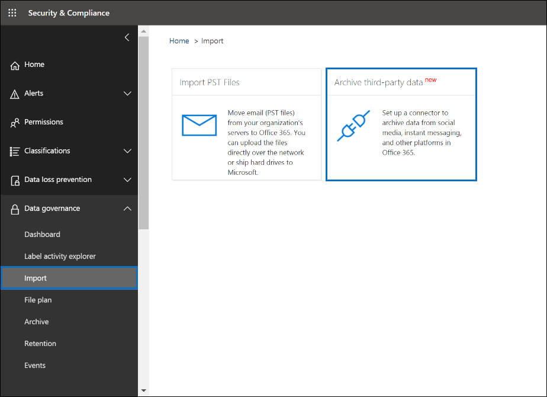

# 部署封存 Twitter 資料 Office 365 中的連接器

本文包含的逐步程序來部署您的組織 Twitter 帳戶的資料匯入至 Office 365 會使用 Office 365 匯入服務的連接器。 此程序的高階概觀與部署 Twitter 連接器所需的必要條件清單，請參閱[使用封存 Twitter 資料 Office 365 （預覽） 中的範例連接器](archive-twitter-data-with-sample-connector.md)。 

## 步驟 1： 下載套件

從 [版本] 區段中，GitHub 儲存機制中下載預先建立的套件[https://github.com/microsoft/m365-sample-twitter-connector-csharp-aspnet/releases](https://github.com/microsoft/m365-sample-twitter-connector-csharp-aspnet/releases)。 在 [最新版本中，下載 zip 檔名為**SampleConnector.zip**。 您將此 zip 檔案上傳到步驟 4 中的 Azure 中。

## 步驟 2： 在 Azure Active Directory 中建立的應用程式

1. 移至 [<https://portal.azure.com>並使用 Office 365 全域系統管理員帳戶的認證登入。

   

2. 在左側的導覽窗格中，按一下 [ **Azure Active Directory**]。

   

3. 在左側的導覽窗格中，按一下 [**應用程式註冊 （預覽）** ，然後按一下 [**新增註冊**。

   

4. 註冊應用程式。 **（選用） 的 [重新導向 URI**，選取 Web 應用程式類型] 下拉式清單中，然後輸入<https://portal.azure.com>URI] 方塊中。

   

5. 複製 **（用戶端） 的應用程式識別碼**] 及 [**目錄 （承租人） 識別碼**，並將它們儲存到文字檔或其他安全的位置。 您將在稍後步驟使用這些識別碼。

    

6. 移至**新的應用程式的憑證 & 機密資料**，並在 [**用戶端密碼**] 下按一下 [**新的用戶端密碼**。

   

7. 建立新的密碼。 在 [描述] 方塊中，輸入密碼，然後選擇的到期時間。 

   

8. 複製密碼的值，並將它儲存到文字檔或其他儲存位置。 這是您將在稍後步驟使用的 AAD 應用程式密碼。

   

9. 移至**資訊清單**，然後複製 identifierUris （這也稱為 AAD 應用程式的 Uri） 以反白顯示下列螢幕擷取畫面。 複製到文字檔或其他儲存位置的 AAD 應用程式的 Uri。 您將在步驟 6 中使用它。

    

## 步驟 3： 建立 Azure 儲存體帳戶

1.  移至 Azure 的首頁上，為您的組織。

    

2. 按一下 [**建立資源**及它們在 [搜尋] 方塊中輸入**儲存體帳戶**。

   

3. 按一下 [**儲存**]，然後按一下 [**儲存體帳戶**。

   

4. 在 [**建立儲存體帳戶**] 頁面上，在 [訂閱] 方塊中，選取**Pay-As-You-Go**或取決於哪些類型的 Azure 訂用帳戶必須**免費試用版**。 

   

5. 選取或建立資源群組。

   

6. 輸入儲存體帳戶的名稱。

   

7. 檢閱，然後按一下 [**建立**]，以建立儲存體帳戶。

   

8. 在一段時間後按一下 [**重新整理**，然後按一下 [瀏覽至儲存體帳戶的 [**移至資源**。

   

9. 在左側的導覽窗格中，按一下 [**便捷鍵**。

   

10. 複製**連接字串**，並將它儲存到文字檔或其他儲存位置。 在步驟 4 中建立 web 應用程式資源時，您將使用此。

    

## 步驟 4： 在 Azure 中建立新的 web 應用程式資源

1. 在 [**首頁**] 頁面在 Azure 入口網站中，按一下 [**建立資源\>每個項目\>Web 應用程式**。 在 [ **Web 應用程式**] 頁面上，按一下 [**建立**]。

   

2. 填入詳細資料 （如下所示），然後再建立 Web 應用程式。 請注意，您在 [**應用程式名稱**] 方塊中輸入的名稱將用於建立 Azure 應用程式服務的 URL;例如 twitterconnector.azurewebsites.net。

   

3. 移至新建立的 web 應用程式資源，按一下 [**應用程式設定**]，請在左側的導覽窗格中。 **應用程式設定**] 下按一下 [**新增新的設定**，並新增下列三項設定。 使用複製的值 （您到文字檔先前的步驟）： 

    - **APISecretKey** – 您可以為密碼輸入任何值。 這將會用來存取在步驟 7 中的連接器 web 應用程式。

    - **StorageAccountConnectionString** – 您在步驟 3 中建立 Azure 儲存體帳戶之後所複製的 Uri 的連接字串。

    - **tenantId** – 您在步驟 2 中的 Azure Active Directory 中建立 Twitter 連接器應用程式之後複製您 Office 365 組織租用戶識別碼。

    

4. **一般設定**] 下按一下 [**上**旁**Always On**。 按一下 [**儲存**] 頁面的頂端儲存應用程式的設定。

   

5. 最後一個步驟是將連接器 app 原始程式碼上傳至 Azure 中您在步驟 1 中下載。 在網頁瀏覽器中，移至 https://<AzureAppResourceName>.scm.azurewebsites.net/ZipDeployUi。 例如，如果您的 Azure 應用程式資源 （這在本節中的步驟 2 中所命名） 的名稱是**twitterconnector**，然後您會移至https://twitterconnector.scm.azurewebsites.net/ZipDeployUi。

6. 拖放到此頁面 SampleConnector.zip （，您在步驟 1 中下載）。 上傳的檔案，並部署成功後，頁面看起來類似下列的螢幕擷取畫面。

   

## 步驟 5： 建立 Twitter 應用程式

1. 移至 [ https://developer.twitter.com，登入您的組織，開發人員帳戶使用的認證，然後按一下 [**應用程式**。

   
2. 按一下 [**建立應用程式**]。
   
   

3. 在 [**應用程式詳細資料**，新增應用程式的相關資訊。

   

4. Twitter 開發人員儀表板上選取您剛建立的應用程式複製應用程式 ID 會顯示，並將它儲存到文字檔或其他儲存位置。 然後按一下 [**詳細資料**。
   
   

5. **索引鍵和權杖**索引標籤上，在**消費者 API 機碼**下複製 API 祕密金鑰並將它儲存到文字檔或其他儲存位置。 然後按一下 [**建立**]，以產生的存取權杖及存取權杖的密碼，並複製這些文字檔案或其他儲存位置。
   
   

   然後按一下 [**建立**]，以產生的存取權杖及存取權杖的密碼，並複製這些文字檔案或其他儲存位置。

6. 按一下 [**權限**] 索引標籤，並設定權限，如下列螢幕擷取畫面所示：

   

7. 儲存的權限設定之後，按一下 [**應用程式詳細資料**] 索引標籤，然後按一下 [**編輯 > 編輯詳細資料]**。

   

8. 執行下列工作：

   - 選取核取方塊可允許登入 Twitter 連接器應用程式。
   
   - 新增的 OAuth 重新導向 Uri 使用下列格式： ** \<connectorserviceuri>/檢視/TwitterOAuth**、 其中*connectorserviceuri*的值是為您的組織; Azure 應用程式服務 URL例如https://twitterconnector.azurewebsites.net/Views/TwitterOAuth。

   

在 Twitter 開發人員 app 現已可使用。

## 步驟 6： 設定連接器的 web 應用程式 

1. 移至 https://\<AzureAppResourceName>.azurewebsites.net （其中**AzureAppResourceName**是您在步驟 4 中名為您 Azure 應用程式資源的名稱），例如，如果名稱為**twitterconnector**，請移至https://twitterconnector.azurewebsites.net。 應用程式的 [首頁] 頁面上看起來像下列螢幕擷取畫面。

   

2. 按一下 [**設定**] 頁面中，會顯示號。

   

3. 在租用戶識別碼] 方塊中，輸入或貼上您的租用戶識別碼 （您在步驟 2 中所取得）。 在 [密碼] 方塊中，輸入或貼上 APISecretKey （，您在步驟 2 中所取得），，然後按一下要顯示 [**設定詳細資料**] 頁面上**設定的組態設定**。

   

4. [**設定的詳細資訊**，請輸入下列組態設定 

   - **Twitter 應用程式識別碼**-您在步驟 5 中建立的 Twitter 應用程式的應用程式識別碼。
   - **Twitter 應用程式密碼**-Twitter 應用程式，您在步驟 5 中建立的 API 祕密金鑰。
   - **Twitter 用戶端權杖**-您在步驟 5 中建立的存取權杖。
   - **Twitter 語彙基元的用戶端密碼**-您在步驟 5 中建立的存取權杖密碼。
   - **AAD 應用程式識別碼**的 Azure Active Directory 應用程式，您在步驟 2 中建立的應用程式識別碼
   - **AAD 應用程式密碼**-您在步驟 4 中建立的 APISecretKey 密碼的值。
   - **AAD 應用程式的 Uri** -AAD 應用程式在步驟 2; 中所取得的 Uri例如， https://microsoft.onmicrosoft.com/2688yu6n-12q3-23we-e3ee-121111123213。
   - **App 觀點檢測機碼**-保留此方塊空白。

5. 按一下 [**儲存**] 以儲存連接器設定。

## 步驟 7： 設立安全性與合規性中心中的自訂連接器

1.  移至 [ <https://protection.office.com> ，然後按一下 [**資料控管\>匯入\>封存協力廠商資料**。

    

2. 按一下 [**新增連接器**]，然後按一下 [ **Twitter**。

   

3. 在 [**新增連接器應用程式**] 頁面中，輸入下列資訊，然後按一下 [**驗證連接器**。

    - 在第一個方塊中，輸入連接器名稱，例如**Twitter**。
    - 在第二個方塊中，輸入或貼上您在步驟 4 中新增 APISecretKey 的值。
    - 在第三個方塊中，輸入或貼上的 Azure 應用程式服務 URL;例如**https://twitterconnector.azurewebsites.net**。

   成功驗證連接器之後，按一下 [**下一步**]。

   

4. 按一下 [**登入與連接器應用程式**。

   

5. 輸入或貼上 APISecretKey 一次，然後按一下 [**連接器服務的登入**。

   

6. 按一下 [**繼續 Twitter**。

7. 在 Twitter 登入] 頁面上，登入您的組織 Twitter 帳戶的帳戶使用的認證。

   

   登入後，[Twitter] 頁面上會顯示下列訊息、 「 Twitter 連接器工作成功設定。 」

8. 按一下 [**完成**] 以完成 Twitter 連接器設定。

9. 在 [**設定篩選器**] 頁面中，您可以套用篩選器來匯入 （和封存） 特定天數的項目。 按 [下一步]****。

   

10. 在 [**設定儲存體帳戶**] 頁面上，選取 Twitter 項目將會匯入至 Office 365 信箱。

    

11. 檢閱您的設定，然後按一下 [**完成**] 以完成安全性 & 合規性中心中的連接器設定。

    

    

12. 移至**封存協力廠商資料**頁面才能看見匯入程序的進度。

    
