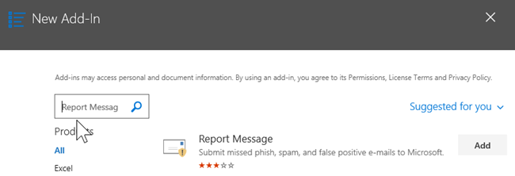
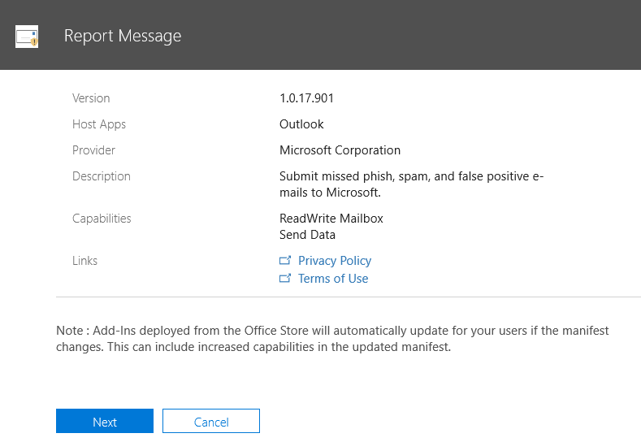
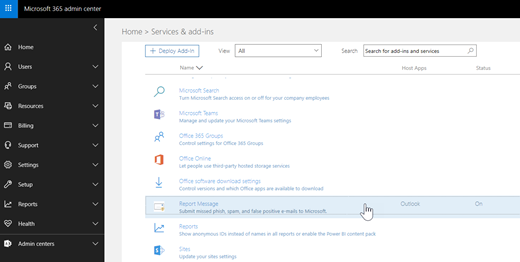
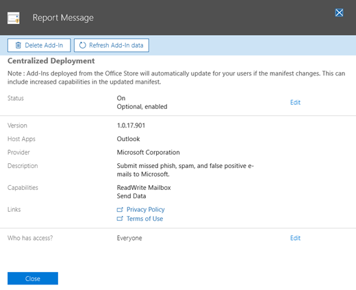

# 啟用報告訊息增益集Enable the Report Message add-in

> [!NOTE]
> Outlook 和 outlook 網頁版的報告郵件增益集與[Outlook 垃圾郵件篩選器](https://support.office.com/article/Overview-of-the-Junk-Email-Filter-5ae3ea8e-cf41-4fa0-b02a-3b96e21de089)並不完全相同, 不過這兩者都可以用來將電子郵件標示為垃圾郵件, 而非垃圾郵件或網路釣魚企圖。The Report Message add-in for Outlook and Outlook on the web is not exactly the same thing as the [Outlook Junk Email Filter](https://support.office.com/article/Overview-of-the-Junk-Email-Filter-5ae3ea8e-cf41-4fa0-b02a-3b96e21de089), although both can be used to mark email as junk, not junk, or a phishing attempt. 不同之處在于 Outlook 和 outlook 網頁版的報告訊息增益集會通知 Microsoft 有關 misclassified 電子郵件, 而 Outlook 垃圾郵件篩選器則是用來組織使用者信箱中的電子郵件訊息。The difference is, the Report Message add-in for Outlook and Outlook on the web notifies Microsoft about misclassified email, whereas the Outlook Junk Email Filter is used to organize email messages in a user's mailbox. 

## 概觀Overview

Outlook 和 Outlook 網頁版的報告訊息增益集可讓使用者輕鬆地向 Microsoft 及其子公司報告 misclassified 電子郵件, 以進行分析。The Report Message add-in for Outlook and Outlook on the web enables people to easily report misclassified email, whether safe or malicious, to Microsoft and its affiliates for analysis. Microsoft 會使用這些提交來改善電子郵件保護技術的效能。Microsoft uses these submissions to improve the effectiveness of email protection technologies. 此外, 如果您的組織使用的是[Office 365 高級威脅防護計畫 1](office-365-atp.md)或[計畫 2](office-365-ti.md), 則報告郵件增益集會為貴組織的安全小組提供有用的資訊, 供您用來檢查及更新安全性原則。In addition, if your organization is using [Office 365 Advanced Threat Protection Plan 1](office-365-atp.md) or [Plan 2](office-365-ti.md), the Report Message add-in provides your organization's security team with useful information they can use to review and update security policies. 

例如, 假設使用者將大量的郵件報告為網路釣魚。For example, suppose that people are reporting a lot of messages as phishing. [[安全性] 儀表板](security-dashboard.md)和其他報表中的此資訊。This information surfaces in the [Security Dashboard](security-dashboard.md) and other reports. 您組織的安全小組可以使用此資訊, 表示可能需要更新反網路釣魚原則。Your organization's security team can use this information as an indication that anti-phishing policies might need to be updated. 或者, 如果人員使用報告郵件增益集來報告大量以垃圾郵件表示為非垃圾郵件的郵件, 您組織的安全小組可能需要調整[反垃圾郵件原則](configure-the-anti-spam-policies.md)。Or, if people are reporting a lot of messages that were flagged as junk mail as Not Junk by using the Report Message add-in, your organization's security team might need to adjust [anti-spam policies](configure-the-anti-spam-policies.md). 

報告郵件增益集可與您的 Office 365 訂閱及下列產品搭配使用:The Report Message add-in works with your Office 365 subscription and the following products:
 - Outlook 網頁版Outlook on the web
 - Outlook 2013 SP1Outlook 2013 SP1
 - Outlook 2016Outlook 2016
 - Mac 版 Outlook 2016Outlook 2016 for Mac
 - Office 365 專業增強版隨附的 OutlookOutlook included with Office 365 ProPlus

您現有的網頁瀏覽器應該足以讓報告訊息增益集正常運作;不過, 如果您注意到增益集無法使用或無法如預期般運作, 請嘗試使用不同的瀏覽器。Your existing web browser should suffice for the Report Message add-in to work; however, if you notice the add-in is not available or not working as expected, try a different browser.
  
如果您是個人使用者, 您可以[為自己啟用報告訊息增益集](#get-the-report-message-add-in-for-yourself)。If you're an individual user, you can [enable the Report Message add-in for yourself](#get-the-report-message-add-in-for-yourself). 
  
如果您是 Office 365 全域系統管理員或 Exchange Online 系統管理員, 而且已將 Exchange 設定為使用 OAuth 驗證, 您可以[為您的組織啟用報告訊息增益集](#get-and-enable-the-report-message-add-in-for-your-organization)。If you're an Office 365 global administrator or an Exchange Online administrator, and Exchange is configured to use OAuth authentication, you can [enable the Report Message add-in for your organization](#get-and-enable-the-report-message-add-in-for-your-organization). 您現在可以透過[集中式部署](https://docs.microsoft.com/office365/admin/manage/centralized-deployment-of-add-ins)來使用報告訊息增益集。The Report Message Add-In is now available through [Centralized Deployment](https://docs.microsoft.com/office365/admin/manage/centralized-deployment-of-add-ins).
    
## 取得自己的報告訊息增益集Get the Report Message add-in for yourself

1. 在[Microsoft AppSource](https://appsource.microsoft.com/marketplace/apps)中, 搜尋[報告訊息增益集](https://appsource.microsoft.com/product/office/wa104381180)。In [Microsoft AppSource](https://appsource.microsoft.com/marketplace/apps), search for the [Report Message add-in](https://appsource.microsoft.com/product/office/wa104381180).
    
2. 選擇 [**立即取得**]。Choose **GET IT NOW**.   
    
3. 回顧使用條款和隱私權原則。Review the terms of use and privacy policy. 然後選擇 [**繼續**]。Then choose **Continue**. 
    
4. 使用您的工作或學校帳戶 (供商務用) 或您的 Microsoft 帳戶 (供個人使用) 登入 Office 365。Sign in to Office 365 using your work or school account (for business use) or your Microsoft account (for personal use).
    
安裝並啟用增益集之後, 您會看到下列圖示:After the add-in is installed and enabled, you'll see the following icons: 

- 在 Outlook 中, 圖示如下所示:In Outlook, the icon looks like this:    
- 在網頁版 Outlook (先前稱為 Outlook Web App) 中, 圖示看起來像這樣:In Outlook on the web (formerly known as Outlook Web App), the icon looks like this:  

> [!TIP]
> 下一步, 瞭解如何[使用報告訊息增益集](https://support.office.com/article/b5caa9f1-cdf3-4443-af8c-ff724ea719d2)。As a next step, learn how to [Use the Report Message add-in](https://support.office.com/article/b5caa9f1-cdf3-4443-af8c-ff724ea719d2).
  
## 取得並啟用組織的報告訊息增益集Get and enable the Report Message add-in for your organization

> [!IMPORTANT]
> 您必須是 Office 365 全域管理員或 Exchange Online 系統管理員, 才可完成此工作。You must be an Office 365 global administrator or an Exchange Online Administrator to complete this task. 此外, 必須將 Exchange 設定為使用 OAuth 驗證來深入瞭解, 請參閱[exchange 需求 (增益集的集中式部署)](https://docs.microsoft.com/office365/admin/manage/centralized-deployment-of-add-ins)。In addition, Exchange must be configured to use OAuth authentication To learn more, see [Exchange requirements (Centralized Deployment of add-ins)](https://docs.microsoft.com/office365/admin/manage/centralized-deployment-of-add-ins). 

1. 移至 Microsoft 365 系統管理中心的 [服務] [ [& 增益集] 頁面](https://admin.microsoft.com/AdminPortal/Home#/Settings/ServicesAndAddIns)。Go to the [Services & add-ins page](https://admin.microsoft.com/AdminPortal/Home#/Settings/ServicesAndAddIns) in the Microsoft 365 admin center. ![新 Microsoft 365 系統管理中心的 [服務和增益集] 頁面](media/ServicesAddInsPageNewM365AdminCenter.png)  
    
2. 選擇 [ **+ 部署增益集**]。Choose **+ Deploy Add-in**. ![選擇 [部署增益集]](media/ServicesAddIns-ChooseDeployAddIn.png)  
    
3. 在 [**新增增益集**] 畫面中, 查看資訊, 然後選擇 [**下一步]**。In the **New Add-In** screen, review the information, and then choose **Next**.  
    
4. 選取 **[我想要從 Office 存放區新增增益集**], 然後選擇 [**下一步]**。Select **I want to add an Add-In from the Office Store**, and then choose **Next**.   
    
5. 搜尋**報告訊息**, 並在結果清單中的**報告訊息增益集**旁, 選擇 [**新增**]。Search for **Report Message**, and in the list of results, next to the **Report Message Add-In**, choose **Add**. ![搜尋報告訊息, 然後選擇 [新增]](media/NewAddInScreen3.png) 
    
6. 在 [**報告訊息**] 畫面上, 查看資訊, 然後選擇 [**下一步]**。On the **Report Message** screen, review the information, and then choose **Next**.  

7. 指定 Outlook 的使用者預設設定, 然後選擇 [**下一步]**。Specify the user default settings for Outlook, and  then choose **Next**.  

8. 指定誰可以取得報表郵件增益集, 然後選擇 [**儲存**]。Specify who gets the Report Message Add-in, and then choose **Save**.   

> [!TIP]
> 建議[您設定規則, 以取得使用者所報告之電子](#set-up-a-rule-to-get-a-copy-of-email-messages-reported-by-your-users)郵件的副本。We recommend [setting up a rule to get a copy of email messages reported by your users](#set-up-a-rule-to-get-a-copy-of-email-messages-reported-by-your-users).

根據您在設定增益集時所選取的專案 (上述步驟 7-8), 您組織中的人員將會有可用的[報告訊息增益集](https://support.office.com/article/b5caa9f1-cdf3-4443-af8c-ff724ea719d2)。Depending on what you selected when you set up the add-in (steps 7-8 above), people in your organization will have the [Report Message add-in](https://support.office.com/article/b5caa9f1-cdf3-4443-af8c-ff724ea719d2) available. 您組織中的人員會看到下列圖示:People in your organization will see the following icons: 

- 在 Outlook 中, 圖示如下所示:In Outlook, the icon looks like this:    
- 在網頁版 Outlook 中, 圖示看起來像這樣:In Outlook on the web, the icon looks like this:  

> [!TIP]
> 當您通知使用者有關報告訊息增益集時, 請包含[使用報告訊息增益集](https://support.office.com/article/b5caa9f1-cdf3-4443-af8c-ff724ea719d2)的連結。When you notify users about the Report Message add-in, include a link to [Use the Report Message add-in](https://support.office.com/article/b5caa9f1-cdf3-4443-af8c-ff724ea719d2).

## 設定規則以取得使用者所報告的電子郵件的副本Set up a rule to get a copy of email messages reported by your users

> [!IMPORTANT]
> 您必須是 Exchange Online 系統管理員, 才可執行此工作。You must be an Exchange Online Administrator to perform this task.
  
您可以設定規則, 以取得組織中使用者所報告之電子郵件的副本。You can set up a rule to get a copy of email messages reported by users in your organization. 您可以在下載並啟用組織的報告訊息增益集之後執行此動作。You do this after you have downloaded and enabled the Report Message add-in for your organization.
  
1. 在 Exchange 系統管理中心中, 選擇 [**郵件流程** \> **規則**]。In the Exchange admin center, choose **mail flow** \> **rules**. 
    
2. 選擇**+** \> [**建立新規則**]。Choose **+** \> **Create a new rule**. 
    
3. 在 [**名稱**] 方塊中, 輸入名稱, 例如 [送出]。In the **Name** box, type a name, such as Submissions.
    
4. 在 [**將此規則**套用至] 清單中, 選擇 [**收件者位址包含 ...**]。In the **Apply this rule if** list, choose **The recipient address includes...**. 
    
5. 在 [**指定字詞或片語**] 畫面中`junk@office365.microsoft.com` , `phish@office365.microsoft.com`新增和, 然後選擇 **[確定]**。In the **specify words or phrases** screen, add `junk@office365.microsoft.com` and `phish@office365.microsoft.com`, and then choose **OK**.  
  
6. 在 [**執行下列**動作 ...] 清單中, 選擇 [**密件副本郵件為 ...**]。In the **Do the following...** list, choose **Bcc the message to...**. 
    
7. 新增全域管理員、安全性系統管理員和/或安全性讀者, 其應該會收到每個人員向 Microsoft 報告的電子郵件的副本, 然後選擇 **[確定]**。Add a global administrator, security administrator, and/or security reader who should receive a copy of each email message that people report to Microsoft, and then choose **OK**.  
  
8. 選取 [**使用嚴重性層級來審核這個規則**], 然後選擇 [**中**]。Select **Audit this rule with severity level**, and choose **Medium**. 
    
9. 在 **[選擇此規則的模式]** 下, 選擇 [**強制**]。Under **Choose a mode for this rule**, choose **Enforce**.  
  
10. 選擇 [**儲存**]。Choose **Save**. 
    
使用此規則時, 每當組織中的人員使用報告訊息增益集來報告電子郵件訊息時, 您的全域系統管理員、安全性管理員和/或安全性讀取者都會收到該郵件的複本。With this rule in place, whenever someone in your organization reports an email message using the Report Message add-in, your global administrator, security administrator, and/or security reader will receive a copy of that message. 此資訊可讓您設定或調整原則, 例如[Office 365 ATP 安全連結](atp-safe-links.md)原則或[反垃圾郵件](anti-spam-protection.md)設定。This information can enable you to set up or adjust policies, such as [Office 365 ATP Safe Links](atp-safe-links.md) policies, or your [anti-spam](anti-spam-protection.md) settings. 

## 瞭解如何使用報告訊息增益集Learn how to use the Report Message add-in

請參閱[使用報告訊息增益集](https://support.office.com/article/b5caa9f1-cdf3-4443-af8c-ff724ea719d2)。See [Use the Report Message add-in](https://support.office.com/article/b5caa9f1-cdf3-4443-af8c-ff724ea719d2).

## 檢查或編輯報告郵件增益集的設定Review or edit settings for the Report Message add-in

您可以在 [[服務 & 增益集] 頁面](https://admin.microsoft.com/AdminPortal/Home#/Settings/ServicesAndAddIns)上, 查看及編輯 [報告郵件] 增益集的預設設定。You can review and edit the default settings for the Report Message add-in on the [Services & Add-Ins page](https://admin.microsoft.com/AdminPortal/Home#/Settings/ServicesAndAddIns). 

> [!IMPORTANT]
> 您必須是 Office 365 全域管理員或 Exchange Online 系統管理員, 才可完成此工作。You must be an Office 365 global administrator or an Exchange Online Administrator to complete this task.
    
1. 移至 Microsoft 365 系統管理中心的 [服務] [ [& 增益集] 頁面](https://admin.microsoft.com/AdminPortal/Home#/Settings/ServicesAndAddIns)。Go to the [Services & add-ins page](https://admin.microsoft.com/AdminPortal/Home#/Settings/ServicesAndAddIns) in the Microsoft 365 admin center. ![新 Microsoft 365 系統管理中心的 [服務和增益集] 頁面](media/ServicesAddInsPageNewM365AdminCenter.png) 

2. 尋找並選取 [報告訊息] 增益集。Find and select the Report Message add-in.   
    
3. 在 [報告訊息] 畫面上, 視需要查看和編輯您組織的設定。On the Report Message screen, review and edit settings as appropriate for your organization.   

## 相關主題Related topics

[使用報告訊息增益集Use the Report Message add-in](https://support.office.com/article/b5caa9f1-cdf3-4443-af8c-ff724ea719d2)
  
[在安全性&amp;與合規性中心中查看電子郵件安全性報告View email security reports in the Security &amp; Compliance Center](view-email-security-reports.md)

[查看 Office 365 的報告高級威脅防護View reports for Office 365 Advanced Threat Protection](view-reports-for-atp.md)

[在安全性&amp;與合規性中心使用 ExplorerUse Explorer in the Security &amp; Compliance Center](use-explorer-in-security-and-compliance.md)
  

