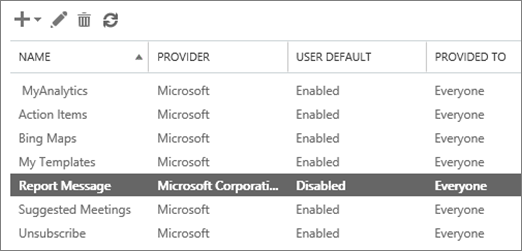

# 啟用報告訊息增益集

報告訊息的增益集 Outlook 讓人員輕鬆地回報被歸類電子郵件是否安全或惡意、 Microsoft 及分析及其子公司。Microsoft 使用這些送出改善電子郵件保護技術的有效性。
  
如果您是個別使用者，您可以啟用報表訊息的增益集自己。 
  
如果您是 Exchange Online 管理員，您可以啟用報表訊息增益集您的組織。
    
## 您要報告郵件取得增益集

1. 移至 [ [https://store.office.com](https://store.office.com)、 和搜尋報告郵件增益集。
    
2. 選擇**要取得其現在**（或**新增**）。 
    
3. 檢閱使用及隱私權原則的字詞。然後選擇 [**繼續]**。 
    
4. 登入 Office 365 電子郵件使用您的工作或學校帳戶 （供商務使用） 或您的 Microsoft 帳戶 （適用於個人使用）。
    
增益集已安裝並啟用之後，您會看到下列圖示： 

- 在 Outlook 中圖示外觀類似如下：    
- 在 Outlook Web App 圖示外觀類似如下： ![在 [網頁報表訊息增益集] 圖示上的 outlook](media/d9326d0b-1769-4bc2-ae58-51f0ebc69a17.png) 

  
下一個步驟中，以了解如何[使用報告郵件增益集](https://support.office.com/article/b5caa9f1-cdf3-4443-af8c-ff724ea719d2)。
  
## 取得並啟用報表訊息增益集的組織

> [!IMPORTANT]
> 您必須是 Exchange Online 管理員，才能執行這項工作。
  
1. 移至 [[https://portal.office.com](https://portal.office.com)並使用您工作或學校的帳戶登入。 
    
2. 選擇 [移至 [系統管理中心的**管理**。 
    
3. 選擇 [ **Admin 中心** \> **Exchange**移至 Exchange 系統管理中心 (EAC)。 
    
4. 選擇**組織** \> **增益集**。 
    
5. 選擇 [ **+** \> **新增來自 Office 市集**。 
    
6. 搜尋報告的郵件。
    
7. **應用程式結果**清單中，找到**報表訊息**，然後選擇**要取得其現在**（或**新增**）。 
    
8. 檢閱使用及隱私權原則的字詞。然後選擇 [**繼續]**。 
    
    ![按一下 [繼續] 以接受條款和隱私權原則](media/3c813cd6-1601-4791-97dc-f8edbbd3fb6b.png)
  
9. 在 [確認] 畫面中，選擇 [**是**]。 
    
10. 安裝報告郵件增益集之後，您必須啟用它。若要這樣做，請遵循下列步驟：
    
1. EAC 中，會傳回與重新整理瀏覽器視窗。
    
2. 選擇**組織** \> **增益集**。 
    
3. 在 [增益集] 清單選取 [**報告訊息**。 
    
    
  
4. 選擇 [**編輯**，然後選取 [選項可讓增益集。 
    
    
  
5. 選擇 [**儲存**]。 
    
> [!TIP]
> 增益集已安裝並啟用之後，您的組織中的人員會看到下列圖示： 
  
接下來，了解如何[使用報告郵件增益集](https://support.office.com/article/b5caa9f1-cdf3-4443-af8c-ff724ea719d2)，以及設定規則查看報告電子郵件訊息。
  
### 若要取得一份報告的使用者的電子郵件設定的規則

> [!IMPORTANT]
> 您必須是 Exchange Online 管理員，才能執行這項工作。
  
您可以設定以取得一份報告的組織中使用者的電子郵件的規則。下載並啟用的報告訊息增益集組織之後，您可以這麼做。
  
1. 在 EAC 中，選擇 [**郵件流程** \> **規則**。 
    
2. 選擇 [ **+** \> **建立新的規則**。 
    
3. 在 [**名稱**] 方塊中輸入名稱，例如送出。
    
4. **如果套用此規則**] 清單中選擇 [**收件者的地址包含...**]。 
    
5. 在 [**指定單字或片語**] 畫面中，新增 junk@office365.microsoft.com 和 phish@office365.microsoft.com，並再選擇 **[確定]**。 
    
    ![指定之規則的垃圾郵件] 及 [phish 電子郵件地址](media/018c1833-f336-4333-a45c-f2e8b75cd698.png)
  
6. 在**執行下列動作...** ] 清單中，選擇 [ **[密件副本郵件到...**。 
    
7. 新增全域管理員、 安全性管理員及/或安全性讀者應該接收人員向 Microsoft 報告每個電子郵件訊息的複本並再選擇 **[確定]**。 
    
    
  
8. 選取 [**此規則使用嚴重性層級的稽核**，然後選擇 [**中等**。 
    
9. [**選擇此規則模式**] 下選擇 [**強制執行**。 
    
    
  
10. 選擇 [**儲存**]。 
    
與備妥此規則，每當您組織中某人報告電子郵件訊息的報告訊息 」 增益集，使用您全域管理員、 安全性管理員及/或安全性讀取者會收到該郵件的複本。這項資訊可讓您設定或調整原則，例如[Office 365 ATP 安全連結](atp-safe-links.md)原則。 
  
## 相關主題

[使用報告郵件增益集](https://support.office.com/article/b5caa9f1-cdf3-4443-af8c-ff724ea719d2)
  
[Office 365 進階威脅防護](office-365-atp.md)
  

