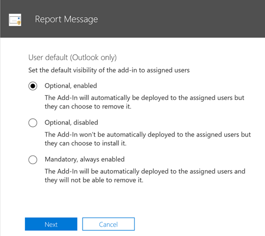
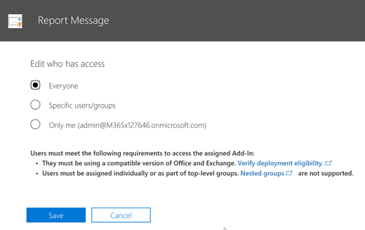

# 啟用報告訊息增益集

報告訊息的增益集 Outlook 讓人員輕鬆地回報被歸類電子郵件是否安全或惡意、 Microsoft 及分析及其子公司。Microsoft 使用這些送出改善電子郵件保護技術的有效性。此外，如果您的組織會使用包含[Office 365 進階威脅保護](office-365-atp.md)或[威脅智慧](office-365-ti.md)Microsoft 雲端服務、 報告郵件增益集提供貴組織的安全性小組與有用的資訊它們可用於檢閱及更新安全性原則。 

例如，假設人員會報告為網路釣魚許多的郵件。此資訊以循[安全性儀表板](security-dashboard.md)和其他報表中。貴組織的安全性小組可以使用這項資訊以反網路釣魚原則可能需要更新的指示。或者，如果人員所報告的郵件已標示為垃圾郵件郵件不是垃圾郵件報告增益集使用許多組織的安全性小組可能需要調整[反垃圾郵件原則](configure-the-anti-spam-policies.md)。  
  
如果您是個別使用者，您還可以[讓報表訊息的增益集自己](#get-the-report-message-add-in-for-yourself)。 
  
如果您是 Exchange Online 管理員，您可以[啟用報表訊息增益集的組織](#get-and-enable-the-report-message-add-in-for-your-organization)。
    
## 您要報告郵件取得增益集

1. 在[Office 存放區](https://appsource.microsoft.com/product/office/WA104381180?src=office)，請取得報告郵件增益集。
    
2. 選擇 [**取得 IT 現在**。   
    
3. 檢閱使用及隱私權原則的字詞。然後選擇 [**繼續]**。 
    
4. 登入 Office 365 電子郵件使用您的工作或學校帳戶 （供商務使用） 或您的 Microsoft 帳戶 （適用於個人使用）。
    

增益集已安裝並啟用之後，您會看到下列圖示： 

- 在 Outlook 中圖示外觀類似如下：    
- 在 Outlook Web App 圖示外觀類似如下： ![在 [網頁報表訊息增益集] 圖示上的 outlook](media/d9326d0b-1769-4bc2-ae58-51f0ebc69a17.png) 

下一個步驟中，以了解如何[使用報告郵件增益集](https://support.office.com/article/b5caa9f1-cdf3-4443-af8c-ff724ea719d2)。
  
## 取得並啟用報表訊息增益集的組織

> [!IMPORTANT]
> 您必須是 Office 365 全域管理員或 Exchange Online 管理員，才可完成此工作。

1. 移至 [[https://portal.office.com](https://portal.office.com)並使用您工作或學校的帳戶登入。 
    
2. 選擇 [移至 [系統管理中心的**管理**。 
    
3. 選擇 [ **Admin 中心** \> **Exchange**移至 Exchange 系統管理中心 (EAC)。 
    
4. 選擇**組織** \> **增益集**。 
    
5. 選擇 [ **+**  > **新增來自 Office 市集**。  這會在網頁瀏覽器中開啟 Office 市集。
    
6. 搜尋報告的郵件。  
    
7. 在 [**應用程式**] 清單中，選取**報表訊息**，然後選擇**現在取得 IT**。   
    
8. 檢閱使用及隱私權原則的字詞。然後選擇 [**繼續]**。 
    
    ![按一下 [繼續] 以接受條款和隱私權原則](media/ReportMessageTermsAndConditions.png)
  
9. 精靈隨即開啟以協助您設定報表訊息增益集檢閱資訊，並選擇 [**下一步]** 繼續。 ![報表訊息增益集精靈] 的 Office 365](media/ReportMessageAdminInstallUI.png)  

10. 指定您要使用者具有報表訊息增益集的預設設定。  
    
11. 指定誰取得報表訊息增益集。   

12. 選擇 [**儲存**]。

為何您選取 [使用精靈，視您組織中的人員必須報告訊息可用增益集。在組織中的人員會看到下列圖示： 

- 在 Outlook 中圖示外觀類似如下：    
- 在 Outlook Web App 圖示外觀類似如下： ![在 [網頁報表訊息增益集] 圖示上的 outlook](media/d9326d0b-1769-4bc2-ae58-51f0ebc69a17.png) 

接下來，了解如何[使用報告郵件增益集](https://support.office.com/article/b5caa9f1-cdf3-4443-af8c-ff724ea719d2)，以及設定規則查看報告電子郵件訊息。

## 檢閱或編輯報表訊息增益集的預設設定

您可以檢閱並編輯使用系統管理中心報告郵件增益集的預設設定。 

> [!IMPORTANT]
> 您必須是 Office 365 全域管理員或 Exchange Online 管理員，才可完成此工作。
    
1. 如果您剛已安裝您的組織報告郵件增益集、 您已經將會在 [服務與增益集] 頁面。否則移[此處](https://portal.office.com/adminportal/home#/Settings/ServicesAndAddIns)及登入 Office 365 中使用工作或學校帳戶。

2. 搜尋**報表訊息**，並加以選取。   
    
3. 開啟一個窗格會顯示已在部署期間選取報表訊息增益集的設定。   

4. 檢閱並必要時，編輯設定的報告訊息 」 增益集，並儲存變更。
    
  
## 若要取得一份報告的使用者的電子郵件設定的規則

> [!IMPORTANT]
> 您必須是 Exchange Online 管理員，才能執行這項工作。
  
您可以設定以取得一份報告的組織中使用者的電子郵件的規則。下載並啟用的報告訊息增益集組織之後，您可以這麼做。
  
1. 在 EAC 中，選擇 [**郵件流程** \> **規則**。 
    
2. 選擇 [ **+** \> **建立新的規則**。 
    
3. 在 [**名稱**] 方塊中輸入名稱，例如送出。
    
4. **如果套用此規則**] 清單中選擇 [**收件者的地址包含...**]。 
    
5. 在 [**指定單字或片語**] 畫面中，新增 junk@office365.microsoft.com 和 phish@office365.microsoft.com，並再選擇 **[確定]**。 
    
    ![指定之規則的垃圾郵件] 及 [phish 電子郵件地址](media/018c1833-f336-4333-a45c-f2e8b75cd698.png)
  
6. 在**執行下列動作...** ] 清單中，選擇 [ **[密件副本郵件到...**。 
    
7. 新增全域管理員、 安全性管理員及/或安全性讀者應該接收人員向 Microsoft 報告每個電子郵件訊息的複本並再選擇 **[確定]**。 
    
    
  
8. 選取 [**此規則使用嚴重性層級的稽核**，然後選擇 [**中等**。 
    
9. [**選擇此規則模式**] 下選擇 [**強制執行**。 
    
    
  
10. 選擇 [**儲存**]。 
    
與備妥此規則，每當您組織中某人報告電子郵件訊息的報告訊息 」 增益集，使用您全域管理員、 安全性管理員及/或安全性讀取者會收到該郵件的複本。這項資訊可讓您設定或調整原則，例如[Office 365 ATP 安全連結](atp-safe-links.md)原則。 
  
## 相關主題

[使用報告郵件增益集](https://support.office.com/article/b5caa9f1-cdf3-4443-af8c-ff724ea719d2)
  
[在 [安全性] 中檢視電子郵件安全性報表&amp;規範中心](view-email-security-reports.md)

[Office 365 進階威脅保護的檢視報告](view-reports-for-atp.md)

[使用瀏覽器安全性&amp;規範中心](use-explorer-in-security-and-compliance.md)
  

