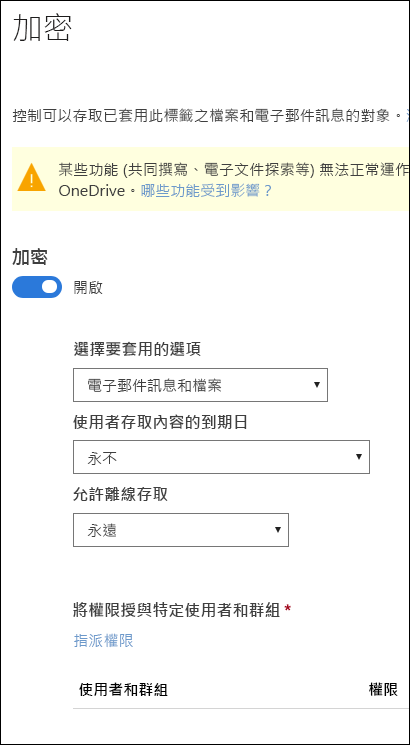
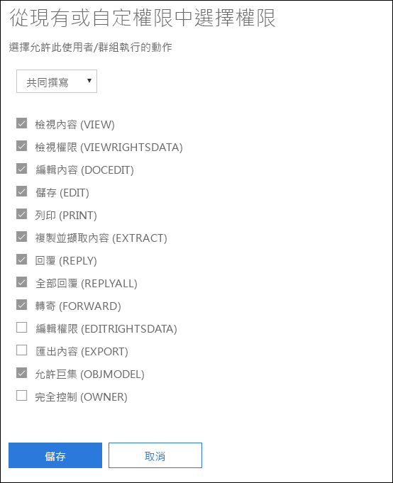
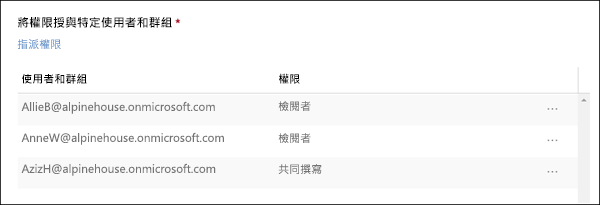

# 使用敏感度標籤中的加密來限制內容的存取

當建立敏感度標籤時，您可以限制標籤將套用至其中之內容的存取。例如，使用敏感度標籤的加密設定，您可以保護內容，以便：

- 僅您組織內的使用者才能開啟機密文件或電子郵件。
- 僅行銷部門中的使用者才能編輯和列印促銷公告文件或電子郵件，而您組織中的所有其他使用者則只能讀取它。
- 使用者無法轉寄電子郵件，或從中複製包含內部組織相關消息的資訊。
- 在指定日期之後，無法開啟傳送給商業夥伴的目前價格清單。

加密文件或電子郵件時，內容的存取會受到限制，以便：

- 只有標籤加密設定授權的使用者才能將其解密。
- 即使檔案重新命名，無論其位於您組織內部或外部，仍保持加密狀態。
- 同時進行靜態加密 (例如，在 OneDrive 帳戶中) 及傳輸中加密 (例如，已傳送的電子郵件)。

當您在 Microsoft 365 合規性中心、Microsoft 365 安全性中心或是 Office 365 安全性與合規性中心中建立敏感性標籤時，可以使用加密設定。

## 加密的運作方式

加密會使用 Azure Rights Management (Azure RMS)。Azure RMS 會使用加密、身分識別和授權原則。若要深入了解，請參閱[什麼是 Azure Rights Management？](https://docs.microsoft.com/zh-TW/azure/information-protection/what-is-azure-rms)

## 如何開啟敏感度標籤的加密

若要開始，只需將 [加密] **** 切換為 [開啟]****，然後使用下列選項來控制誰可以存取套用此標籤的電子郵件或文件。您可以：

1. **將加密同時套用至電子郵件和文件，或只套用至電子郵件。** 如果您選擇只套用至電子郵件，則將在 Outlook 中加密具有此標籤的郵件，但不會在其他應用程式 (例如 Word 或 PowerPoint) 中加密具有此標籤的文件。 
2. **允許加標籤的內容到期**，可在特定日期，或是在套用標籤之後的特定天數之後。在此時間後，使用者將無法開啟加標籤的項目。如果您指定日期，則有效時間直到您的目前時區中該日期的午夜。(請注意，某些電子郵件用戶端可能因為其快取機制而無法強制執行到期，並顯示超過期限的電子郵件。)
3. 在套用標籤之後**允許離線存取**可為從不、一律或特定天數。如果您將離線存取限制為從不或天數，則達到該閾值時，必須重新驗證使用者，並記錄其存取。如需詳細資訊，請參閱關於 Rights Management 使用授權的下一節。

### 用於離線存取的 Rights Management 使用授權

當使用者離線開啟受到敏感度標籤保護的文件或電子郵件時，該內容的 Azure Rights Management 使用授權會授與使用者。此使用授權是一種憑證，其中包含使用者對文件或電子郵件的使用權，以及用來加密內容的加密金鑰。使用授權也會包含到期日 (若已設定的話)，以及使用授權的有效期限。

如果未設定到期日，則租用戶的預設使用授權有效期間為 30 天。在這段期間，不會針對內容重新驗證或重新授權使用者。這可讓使用者在沒有網際網路連線的情況下繼續開啟受保護文件或電子郵件。使用授權有效期間到期時，下次使用者存取受保護文件或電子郵件時，必須重新驗證和重新授權使用者。

除了重新驗證外，還會重新評估原則和使用者群組成員資格。這表示，如果上次使用者存取內容後，原則或群組成員資格發生變更，則這些使用者可能遇到相同的文件或電子郵件，卻有不同的存取結果。

若要了解如何變更預設的 30 天設定，請參閱 [Rights Management 使用授權](https://docs.microsoft.com/zh-TW/azure/information-protection/configure-usage-rights#rights-management-use-license)。

## 將權限指派給特定使用者或群組

您可以將權限授與特定人員，以便只有他們可與標籤內容互動。

作法是簡單的兩步驟程序：

1. 首先，新增將獲指派標籤內容之權限的使用者或群組。
2. 接著，選擇那些使用者對標籤內容具有的權限。

### 新增使用者或群組

指派權限時，您可以選擇：

- 組織中的所有人 (所有租用戶成員)。此設定會排除來賓帳戶。
- 任何特定使用者或啟用電子郵件功能的安全性群組、通訊群組、Office 365 群組或動態通訊群組。 
- 組織外的任何電子郵件地址或網域，例如 gmail.com、hotmail.com 或 outlook.com。

當您選擇所有租用戶成員或瀏覽目錄時，使用者或群組必須具有電子郵件地址。

最佳做法是使用群組，而非使用者。此策略可讓您保持更簡單的組態。

### 選擇權限

當您選擇要對那些使用者或群組允許的權限時，您可以選取下列任一項：

- [預先定義的權限層級](https://docs.microsoft.com/zh-TW/azure/information-protection/configure-usage-rights#rights-included-in-permissions-levels)，其中有一組預設的權限，例如共同作者或檢閱者。
- 一組自訂的權限，您可在其中選擇任何您想要的權限。

如需每一個特定權限的詳細資訊，請參閱[使用權限和描述](https://docs.microsoft.com/zh-TW/azure/information-protection/configure-usage-rights#usage-rights-and-descriptions)。  

請注意，相同標籤可將不同的權限授與不同的使用者。例如，單一標籤可將某些使用者指派為檢閱者，並將不同的使用者指派為共同作者，如下所示。

若要這麼做，請新增使用者或群組、將權限指派給他們，並儲存這些設定。然後，重複這些步驟，新增使用者並將權限指派給他們，每次儲存設定。您可以視需要經常執行此動作，為不同的使用者定義不同的權限。

### Rights Management 簽發者 (套用敏感度標籤的使用者) 一律具有完全控制權

敏感度標籤的加密會使用 Azure RMS。當使用者套用敏感度標籤以使用 Azure RMS 保護文件或電子郵件時，該使用者就會變成該內容的 Rights Management 簽發者。

Rights Management 簽發者一律會被授與文件或電子郵件的完全控制權限，此外：

- 如果保護設定包括到期日，則 Rights Management 簽發者仍然可在該日期之後開啟和編輯文件或電子郵件。
- Rights Management 簽發者一律可以離線存取文件或電子郵件。
- Rights Management 簽發者仍可以開啟撤銷後的文件。

如需詳細資訊，請參閱 [Rights Management 簽發者和 Rights Management 擁有者](https://docs.microsoft.com/zh-TW/azure/information-protection/configure-usage-rights#rights-management-issuer-and-rights-management-owner)。

## 將加密內容儲存在 OneDrive 和 SharePoint 中

請注意，當加密套用至 OneDrive 和 SharePoint 中儲存的檔案時，服務無法處理這些檔案的內容。這表示共同撰寫、電子文件探索、搜尋、Delve 和其他共同作業功能等這類功能無法運作。此外，資料外洩防護 (DLP) 原則只可使用中繼資料 (包括 Office 365 標籤)，但無法使用加密檔案的內容 (例如檔案內的信用卡號碼)。

這僅適用於 OneDrive 和 SharePoint 中儲存的內容。在 Exchange Online 中，郵件流程規則 (也稱為傳輸規則) 會使用[進階使用者帳戶](https://docs.microsoft.com/zh-TW/azure/information-protection/configure-super-users)，讓他們可以掃描加密內容，並強制執行 DLP 原則。

## 重要的先決條件

在可以使用加密之前，您可能需要執行這些工作。

### 啟動 Azure Rights Management

若要使用敏感度標籤中的加密，需要在您的租用戶中啟動 Azure Rights Management 服務。在較新的租用戶中，此服務預設為開啟，但您可能需要手動啟動此服務。如需詳細資訊，請參閱[啟用 Azure Rights Management](https://docs.microsoft.com/zh-TW/azure/information-protection/activate-service)。

### 設定 Exchange 進行 Azure 資訊保護

在使用者可在 Outlook 中套用標籤以保護其電子郵件之前，不必設定 Exchange 進行 Azure 資訊保護。不過，直到設定 Exchange 進行 Azure 資訊保護前，您都無法取得使用 Azure Rights Management 保護與 Exchange 搭配的完整功能。
 
例如，使用者無法在行動電話或 Outlook 網頁版上檢視受保護的電子郵件，無法為受保護的電子郵件編製索引進行搜尋，而且您無法設定 Exchange Online DLP 進行 Rights Management 保護。 

若要確保 Exchange 可以支援這些額外情節，請參閱下列內容：

- 針對 Exchange Online，請參閱 [Exchange Online：IRM 設定](https://docs.microsoft.com/zh-TW/azure/information-protection/configure-office365#exchange-online-irm-configuration)的指示。
- 針對 Exchange 內部部署，您必須部署 [RMS 連接器和設定您的 Exchange Server](https://docs.microsoft.com/zh-TW/azure/information-protection/deploy-rms-connector)。 
