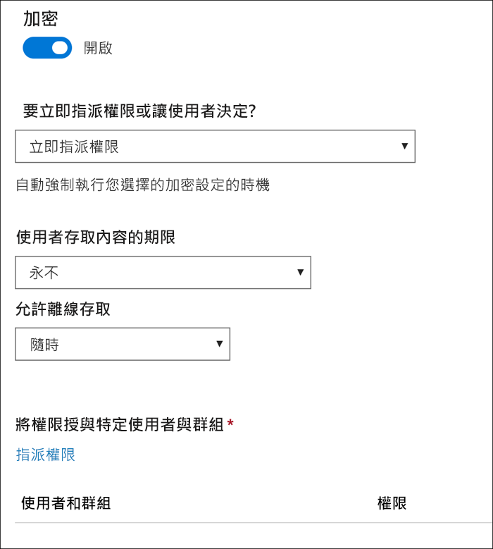
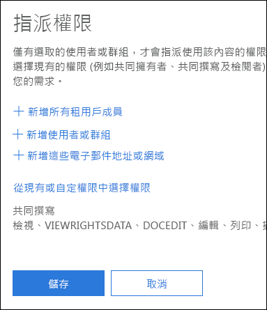
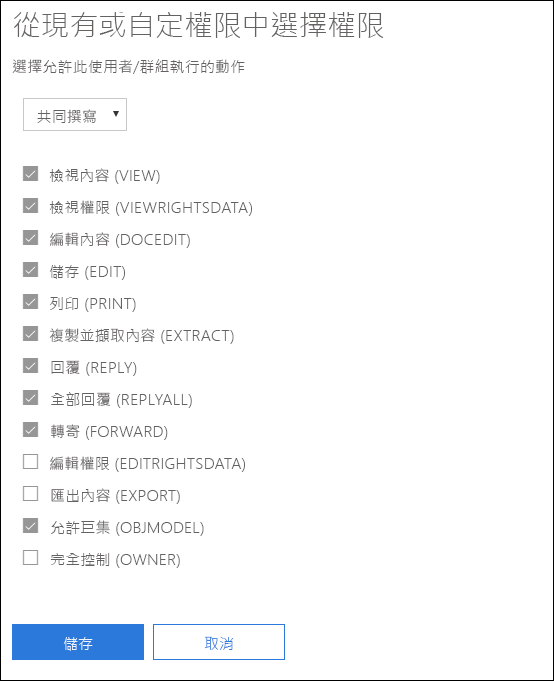
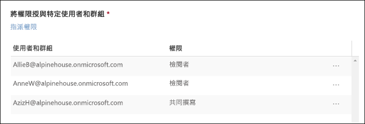
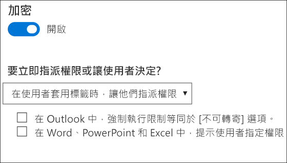
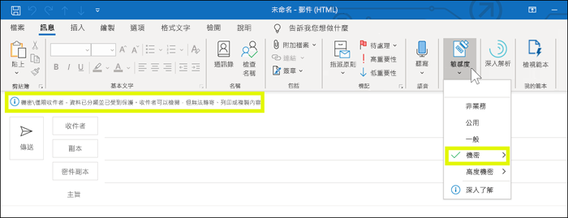
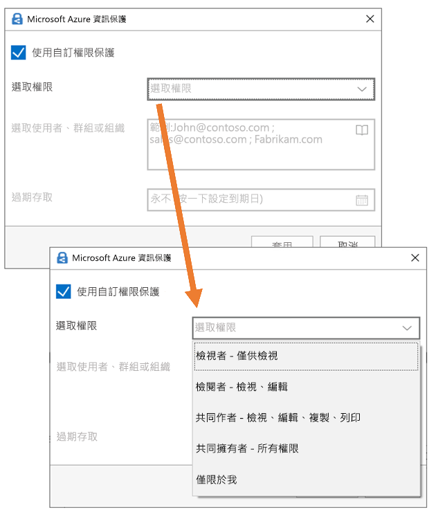

# 使用敏感度標籤中的加密來限制內容的存取Restrict access to content by using encryption in sensitivity labels

當建立敏感度標籤時，您可以限制標籤將套用至其中之內容的存取。例如，使用敏感度標籤的加密設定，您可以保護內容，以便：When you create a sensitivity label, you can restrict access to content that the label will be applied to. For example, with the encryption settings for a sensitivity label, you can protect content so that:

- 僅您組織內的使用者才能開啟機密文件或電子郵件。Only users within your organization can open a confidential document or email.
- 僅行銷部門中的使用者才能編輯和列印促銷公告文件或電子郵件，而您組織中的所有其他使用者則只能讀取它。Only users in the marketing department can edit and print the promotion announcement document or email, while all other users in your organization can only read it.
- 使用者無法轉寄電子郵件，或從中複製包含內部組織相關消息的資訊。Users cannot forward an email or copy information from it that contains news about an internal reorganization.
- 在指定日期之後，無法開啟傳送給商業夥伴的目前價格清單。The current price list that is sent to business partners cannot be opened after a specified date.

加密文件或電子郵件時，內容的存取會受到限制，以便：When a document or email is encrypted, access to the content is restricted, so that it:

- 只有標籤加密設定授權的使用者才能將其解密。Can be decrypted only by users authorized by the label’s encryption settings.
- 即使檔案重新命名，無論其位於您組織內部或外部，仍保持加密狀態。Remains encrypted no matter where it resides, inside or outside your organization, even if the file’s renamed.
- 同時進行靜態加密 (例如，在 OneDrive 帳戶中) 及傳輸中加密 (例如，已傳送的電子郵件)。Is encrypted both at rest (for example, in a OneDrive account) and in transit (for example, a sent email).

最後，身為系統管理員，當您建立敏感度標籤時，可以選擇以下任一動作：Finally, as an admin, when you create a sensitivity label, you can choose either to:

- **立即指派權限**，這樣您就能確實決定哪個使用者能夠存取該標籤的內容。**Assign permissions now**, so that you determine exactly which users get which permissions to content with that label.
- 當使用者將標籤套用到內容時，**讓使用者指派權限**。**Let users assign permissions** when they apply the label to content. 如此一來，您就可以讓組織中的人員靈活地共同作業並完成工作。This way, you can allow people in your organization some flexibility that they might need to collaborate and get their work done.

當您在 Microsoft 365 合規性中心、Microsoft 365 安全性中心或是 Office 365 安全性與合規性中心中建立敏感性標籤時，可以使用加密設定。The encryption settings are available when you create a sensitivity label in the Microsoft 365 compliance center, Microsoft 365 security center, or Office 365 Security & Compliance Center. 在左側導覽中，選擇[分類] \*\*\*\* >  [敏感度標籤] \*\*\*\* >  [建立標籤]\*\*\*\*。In the left nav, choose **Classification** > **Sensitivity label** > **Create a label**.

## 加密的運作方式How encryption works

加密會使用 Azure Rights Management (Azure RMS)。Azure RMS 會使用加密、身分識別和授權原則。若要深入了解，請參閱[什麼是 Azure Rights Management？](https://docs.microsoft.com/zh-TW/azure/information-protection/what-is-azure-rms)Encryption uses Azure Rights Management (Azure RMS). Azure RMS uses encryption, identity, and authorization policies. To learn more, see [What is Azure Rights Management?](https://docs.microsoft.com/zh-TW/azure/information-protection/what-is-azure-rms)

## 如何開啟敏感度標籤的加密How to turn on encryption for a sensitivity label

若要開始，只要將 [加密]\*\*\*\* 切換為 [開啟]\*\*\*\*，然後選擇以下任一動作：To begin, simply toggle **Encryption** to **On**, and then choose whether to:

- **立即指派權限**，這樣您就能確實決定哪個使用者能夠存取該標籤的內容。**Assign permissions now**, so that you can determine exactly which users get which permissions to content with that label. 如需詳細資訊，請參閱下一節的[立即指派權限](#assign-permissions-now)。For more information, see the next section [Assign permissions now](#assign-permissions-now).
- 當使用者將標籤套用到內容時，**讓使用者指派權限**。**Let users assign permissions** when they apply the label to content. 如此一來，您就可以讓組織中的人員靈活地共同作業並完成工作。This way, you can allow people in your organization some flexibility that they might need to collaborate and get their work done. 如需詳細資訊，請參閱下一節的[讓使用者指派權限](#let-users-assign-permissions)。For more information, see the below section [Let users assign permissions](#let-users-assign-permissions).

例如，如果您有一個名為 [高度機密] \*\*\*\* 的敏感度標籤，該標籤將套用至最敏感的內容，則您可能會希望立即決定可以存取該內容。For example, if you have a sensitivity label named **Highly Confidential** that will be applied to your most sensitive content, you may want to decide now who gets what type of permissions to that content.

或者，如果您有一個名為 [商業合約]\*\*\*\* 的敏感度標籤，並且貴組織的工作流程要求人員隨機與不同人員就此內容共同作業，則您可能會希望讓使用者在指派標籤時決定可存取的人員。Alternatively, if you have a sensitivity label named **Business Contracts**, and your organization's workflow requires that your people collaborate on this content with different people on an ad hoc basis, you may want to allow your users to decide who gets permissions when they assign the label. 這種靈活性既可以幫助您提高使用者的工作效率，又可以減少管理員更新或建立新敏感度標籤以滿足特定案例的要求。This flexibility both helps your users' productivity and reduces the requests for your admins to update or create new sensitivity labels to address specific scenarios.

## 立即指派權限Assign permissions now

使用下列選項來控制誰可以存取套用此標籤的電子郵件或文件。To begin, simply toggle Encryption to On, and then use the options below to control who can access email or documents to which this label is applied. You can: 您可以：You can:

1. **將加密同時套用至電子郵件和文件，或只套用至電子郵件。** 如果您選擇只套用至電子郵件，則將在 Outlook 中加密具有此標籤的郵件，但不會在其他應用程式 (例如 Word 或 PowerPoint) 中加密具有此標籤的文件。**Apply encryption to both email and documents, or just email.** If you choose just email, messages with this label will be encrypted in Outlook, but documents with this label won't be encrypted in other apps, such as Word or PowerPoint. 
2. **允許加標籤的內容到期**，可在特定日期，或是在套用標籤之後的特定天數之後。在此時間後，使用者將無法開啟加標籤的項目。如果您指定日期，則有效時間直到您的目前時區中該日期的午夜。(請注意，某些電子郵件用戶端可能因為其快取機制而無法強制執行到期，並顯示超過期限的電子郵件。)**Allow access to labeled content to expire**, either on a specific date or after a specific number of days after the label is applied. After this time, users won’t be able to open the labeled item. If you specify a date, it is effective midnight on that date in your current time zone. (Note that some email clients may not enforce expiration and show emails past their expiration date, due to their caching mechanisms.)
3. 在套用標籤之後**允許離線存取**可為從不、一律或特定天數。如果您將離線存取限制為從不或天數，則達到該閾值時，必須重新驗證使用者，並記錄其存取。如需詳細資訊，請參閱關於 Rights Management 使用授權的下一節。**Allow offline access** never, always, or for a specific number of days after the label is applied. If you restrict offline access to never or a number of days, when that threshold is reached, users must be reauthenticated and their access is logged. For more information, see the next section on the Rights Management use license.

### 用於離線存取的 Rights Management 使用授權Rights Management use license for offline access

當使用者離線開啟受到敏感度標籤保護的文件或電子郵件時，該內容的 Azure Rights Management 使用授權會授與使用者。此使用授權是一種憑證，其中包含使用者對文件或電子郵件的使用權，以及用來加密內容的加密金鑰。使用授權也會包含到期日 (若已設定的話)，以及使用授權的有效期限。When a user opens a document or email offline that’s been protected by a sensitivity label, an Azure Rights Management use license for that content is granted to the user. This use license is a certificate that contains the user's usage rights for the document or email, and the encryption key that was used to encrypt the content. The use license also contains an expiration date if this has been set, and how long the use license is valid.

如果未設定到期日，則租用戶的預設使用授權有效期間為 30 天。在這段期間，不會針對內容重新驗證或重新授權使用者。這可讓使用者在沒有網際網路連線的情況下繼續開啟受保護文件或電子郵件。使用授權有效期間到期時，下次使用者存取受保護文件或電子郵件時，必須重新驗證和重新授權使用者。If no expiration date has been set, the default use license validity period for a tenant is 30 days. For the duration of the use license, the user is not reauthenticated or reauthorized for the content. This lets the user continue to open the protected document or email without an Internet connection. When the use license validity period expires, the next time the user accesses the protected document or email, the user must be reauthenticated and reauthorized.

除了重新驗證外，還會重新評估原則和使用者群組成員資格。這表示，如果上次使用者存取內容後，原則或群組成員資格發生變更，則這些使用者可能遇到相同的文件或電子郵件，卻有不同的存取結果。In addition to reauthentication, the policy and user group membership is reevaluated. This means that users could experience different access results for the same document or email if there are changes in the policy or group membership from when they last accessed the content.

若要了解如何變更預設的 30 天設定，請參閱 [Rights Management 使用授權](https://docs.microsoft.com/zh-TW/azure/information-protection/configure-usage-rights#rights-management-use-license)。To learn how to change the default 30-day setting, see [Rights Management use license](https://docs.microsoft.com/zh-TW/azure/information-protection/configure-usage-rights#rights-management-use-license).

### 將權限指派給特定使用者或群組Assign permissions to specific users or groups

您可以將權限授與特定人員，以便只有他們可與標籤內容互動。You can grant permissions to specific people so that only they can interact with the labeled content.

作法是簡單的兩步驟程序：Doing so is a straightforward two-step process:

1. 首先，新增將獲指派標籤內容之權限的使用者或群組。First you add users or groups that will be assigned permissions to the labeled content.
2. 接著，選擇那些使用者對標籤內容具有的權限。Then you choose which permissions those users have for the labeled content.

#### 新增使用者或群組Add users or groups

指派權限時，您可以選擇：When you assign permissions, you can choose:

- 組織中的所有人 (所有租用戶成員)。此設定會排除來賓帳戶。Everyone in your organization (all tenant members). This setting excludes guest accounts.
- 任何特定使用者或啟用電子郵件功能的安全性群組、通訊群組、Office 365 群組或動態通訊群組。Any specific user or email-enabled security group, distribution group, Office 365 group, or dynamic distribution group. 
- 組織外的任何電子郵件地址或網域，例如 gmail.com、hotmail.com 或 outlook.com。Any email address or domain outside your organization, such as gmail.com, hotmail.com, or outlook.com.

當您選擇所有租用戶成員或瀏覽目錄時，使用者或群組必須具有電子郵件地址。When you choose all tenant members or browse the directory, the users or groups must have an email address.

最佳做法是使用群組，而非使用者。此策略可讓您保持更簡單的組態。As a best practice, use groups rather than users. This strategy keeps your configuration simpler.

#### 選擇權限Choose permissions

當您選擇要對那些使用者或群組允許的權限時，您可以選取下列任一項：When you choose which permissions to allow for those users or groups, you can select either:

- [預先定義的權限層級](https://docs.microsoft.com/zh-TW/azure/information-protection/configure-usage-rights#rights-included-in-permissions-levels)，其中有一組預設的權限，例如共同作者或檢閱者。A [predefined permissions level](https://docs.microsoft.com/zh-TW/azure/information-protection/configure-usage-rights#rights-included-in-permissions-levels) with a preset group of rights, such as Co-Author or Reviewer.
- 一組自訂的權限，您可在其中選擇任何您想要的權限。A Custom group of rights, where you choose whichever permissions you want.

如需每一個特定權限的詳細資訊，請參閱[使用權限和描述](https://docs.microsoft.com/zh-TW/azure/information-protection/configure-usage-rights#usage-rights-and-descriptions)。For more information on each specific permission, see [Usage rights and descriptions](https://docs.microsoft.com/zh-TW/azure/information-protection/configure-usage-rights#usage-rights-and-descriptions).  

請注意，相同標籤可將不同的權限授與不同的使用者。例如，單一標籤可將某些使用者指派為檢閱者，並將不同的使用者指派為共同作者，如下所示。Note that the same label can grant different permissions to different users. For example, a single label can assign some users as Reviewer and a different user as Co-author, as shown below.

若要這麼做，請新增使用者或群組、將權限指派給他們，並儲存這些設定。然後，重複這些步驟，新增使用者並將權限指派給他們，每次儲存設定。您可以視需要經常執行此動作，為不同的使用者定義不同的權限。To do this, add users or groups, assign them permissions, and save those settings. Then repeat these steps, adding users and assigning them permissions, saving the settings each time. You can do this as often as necessary, to define different permissions for different users.

#### Rights Management 簽發者 (套用敏感度標籤的使用者) 一律具有完全控制權Rights Management issuer (user applying the sensitivity label) always has Full Control

敏感度標籤的加密會使用 Azure RMS。當使用者套用敏感度標籤以使用 Azure RMS 保護文件或電子郵件時，該使用者就會變成該內容的 Rights Management 簽發者。Encryption for a sensitivity label uses Azure RMS. When a user applies a sensitivity label to protect a document or email by using Azure RMS, that user becomes the Rights Management issuers for that content.

Rights Management 簽發者一律會被授與文件或電子郵件的完全控制權限，此外：The Rights Management issuer is always granted Full Control permissions for the document or email, and in addition:

- 如果保護設定包括到期日，則 Rights Management 簽發者仍然可在該日期之後開啟和編輯文件或電子郵件。If the protection settings include an expiration date, the Rights Management issuer can still open and edit the document or email after that date.
- Rights Management 簽發者一律可以離線存取文件或電子郵件。The Rights Management issuer can always access the document or email offline.
- Rights Management 簽發者仍可以開啟撤銷後的文件。The Rights Management issuer can still open a document after it is revoked.

如需詳細資訊，請參閱 [Rights Management 簽發者和 Rights Management 擁有者](https://docs.microsoft.com/zh-TW/azure/information-protection/configure-usage-rights#rights-management-issuer-and-rights-management-owner)。For more information, see [Rights Management issuer and Rights Management owner](https://docs.microsoft.com/zh-TW/azure/information-protection/configure-usage-rights#rights-management-issuer-and-rights-management-owner).

## 讓使用者指派權限Let users assign permissions

您可以使用這些選項讓使用者在手動將敏感度標籤套用至內容時指派權限：You can use these options to let users assign permissions when they manually apply a sensitivity label to content:

- 在 Outlook 中，使用者可以強制執行與 [不可轉寄]\*\*\*\* 選項同等的限制。In Outlook, a user can enforce restrictions equivalent to the **Do Not Forward** option. Windows 上的 Outlook 原本就支援這個選項，並且不會要求您安裝 Azure 資訊保護統一標籤用戶端。This option is supported natively in Outlook on Windows, and does not require you to install the Azure Information Protection unified labeling client.
- 在 Word、PowerPoint 和 Excel 中，系統會提示使用者為特定使用者、群組或組織選取權限等級。In Word, PowerPoint, and Excel, a user is prompted to select a permission level for specific users, groups, or organizations. 這些 Office 應用程式原本就不支援這個選項，因此您的使用者必須安裝 Azure 資訊保護統一標籤用戶端。This option is not supported natively in these Office apps, so your users must install the Azure Information Protection unified labeling client.

這些選項可決定敏感標籤將出現在哪些應用程式中：These options determine in which apps the sensitivity label will appear:

- 如果敏感度標籤僅啟用了 Outlook 選項，則標籤只會顯示給 Outlook 中的使用者。If the sensitivity label has only the Outlook option enabled, the label will appear to users only in Outlook.
- 如果敏感度標籤僅啟用了 Word、PowerPoint 和 Excel 選項，則標籤只會顯示給這些應用程式中的使用者。If the sensitivity label has only the Word, PowerPoint, and Excel option enabled, the label will appear to users only in those apps.
- 如果敏感度標籤同時啟用了這兩個選項，則標籤將顯示給所有可用應用程式中的使用者：Outlook、Word、PowerPoint 和 Excel。If the sensitivity label has both options enabled, the label will appear to users in all of the available apps: Outlook, Word, PowerPoint, and Excel.

可讓使用者指派權限的敏感度標籤只能透過使用者手動來套用至內容；它不能自動套用，也不能作為推薦標籤。A sensitivity label that lets users assign permissions can be applied to content only manually by users; it can't be auto-applied or used as a recommended label.

> [!NOTE]
> 讓使用者指派權限需要訂閱 Azure 資訊保護。Letting users assign permissions requires an Azure Information Protection subscription. 若要在 Word、PowerPoint 和 Excel 中使用此功能，您必須下載並安裝 [Azure 資訊保護統一標籤用戶端](https://docs.microsoft.com/azure/information-protection/rms-client/install-unifiedlabelingclient-app)。To use this feature in Word, PowerPoint, and Excel, you must download and install the [Azure Information Protection unified labeling client](https://docs.microsoft.com/azure/information-protection/rms-client/install-unifiedlabelingclient-app). 我們正努力在這些 Office 應用程式中對此功能提供原生支援，這樣它們就不需要安裝 Azure 資訊保護用戶端。We're working on native support for this feature in these Office apps, so that they won't require the Azure Information Protection client. 此外，用戶端僅能在 Windows 上執行，因此 Mac、iOS、Android 或網頁版 Office 尚不支援此功能。Also, the client runs only on Windows, so this feature is not yet supported on Mac, iOS, Android, or Office for the web.

### Outlook 限制Outlook restrictions

在 Outlook 中，當使用者套用的敏感標籤可允許他們指派郵件的權限時，限制與 [不可轉寄] 選項相同。In Outlook, when a user applies a sensitivity label that lets them assign permissions to a message, the restrictions are the same as the Do Not Forward option. 使用者會在郵件頂端看到標籤名稱和描述，指出內容已受到保護。The user will see the label name and description at the top of the message, which indicates the content's being protected. 與 Word、PowerPoint 和 Excel 不同的是 (請參閱[下一節](#word-powerpoint-and-excel-permissions))，使用者不會收到選取特定權限的提示。Unlike Word, PowerPoint, and Excel (see the [next section](#word-powerpoint-and-excel-permissions)), users aren't prompted to select specific permissions.

將 [不可轉寄] 選項套用到電子郵件時，電子郵件會加密而且收件者必須經過驗證。When the Do Not Forward option is applied to an email, the email is encrypted and recipients must be authenticated. 收件者無法轉寄、列印或複製該電子郵件。Then, the recipients cannot forward it, print it, or copy from it. 例如，在 Outlook 用戶端中，無法使用 [轉寄] 按鈕、[另存新檔] 和 [列印] 功能表選項，且您無法在 [收件人]、[副本] 或 [密件副本] 方塊中新增或變更收件者。For example, in the Outlook client, the Forward button is not available, the Save As and Print menu options are not available, and you cannot add or change recipients in the To, Cc, or Bcc boxes.

附加到電子郵件的未受保護的 Office 文件會自動繼承相同的限制。Unprotected Office documents that are attached to the email automatically inherit the same restrictions. 套用至這些文件的使用權限是 [編輯內容]、[編輯]；[儲存]；[檢視]、[開啟]、[讀取]；和 [允許巨集]。The usage rights applied to these documents are Edit Content, Edit; Save; View, Open, Read; and Allow Macros. 如果使用者想要不同的附件使用權限，或者附件不是支援此繼承保護的 Office 文件，則使用者需要在將文件附加到電子郵件之前保護該檔案。If the user wants different usage rights for an attachment, or the attachment is not an Office document that supports this inherited protection, the user needs to protect the file before attaching it to the email.

### Word、PowerPoint 和 Excel 權限Word, PowerPoint, and Excel permissions

在 Word、PowerPoint 和 Excel 中，當使用者套用可讓他們指派文件權限的敏感度標籤時，系統會提示他們保護內容，如下所示。In Word, PowerPoint, and Excel, when a user applies a sensitivity label that lets them assign permissions to a document, they are prompted to protect the content as shown below.

使用者可以：The user can modify records.

- 選取權限等級，例如檢視者 (指派 [僅檢視] 權限) 或共同作者 (指派 [檢視]、[編輯]、[複製] 和 [列印] 權限)。Select a permission level, such as Viewer (which assigns View Only permission) or Co-Author (which assigns View, Edit, Copy, and Print permissions).
- 選取使用者、群組或組織。Select users, groups, or organizations. 這可能包括組織內部或外部的人員。This can include people both inside or outside your organizations.
- 設定到期日，到期之後所選使用者就無法存取內容。Set an expiration date, after which the selected users cannot access the content. 如需詳細資訊, 請參閱前一節的[用於離線存取的 Rights Management 使用授權](#rights-management-use-license-for-offline-access)。For more information, see the above section [Rights Management use license for offline access](#rights-management-use-license-for-offline-access).

## 套用標籤時，現有的加密會發生什麼情況What happens to existing encryption when a label's applied

將敏感度標籤套用至內容之前，使用者可能已透過套用其他的保護設定來加密內容。Before a sensitivity label is applied to content, it's possible that a user already encrypted the content by applying some other protection setting. 例如，使用者可能已套用：For example, a user might have applied:

- [不可轉寄]\*\*\*\* 選項。The **Do Not Forward** option.
- 使用 Azure 資訊保護整合標籤用戶端的自訂保護。Custom protection by using the Azure Information Protection unified labeling client.
- 會加密內容但未與標籤關聯的 Azure Rights Management Service (RMS) 範本。An Azure Rights Management Service (RMS) template that encrypts the content but is not associated with a label.

下表說明對該內容套用敏感度標籤時，現有的加密會發生的情況。This table describe what happens to existing encyption when a sensitivity label is applied to that content.
 
 

| |**使用者套用將加密關閉的敏感度標籤****User applies a sensitivity label with encryption turned off**|**使用者套用將加密開啟的敏感度標籤****User applies a sensitivity label with encryption turned on**|**使用者套用具有移除保護的標籤**1**User applies a label with Remove Protection**1|
|:-----|:-----|:-----|:-----|
|**不可轉寄****Do Not Forward**|會移除 [電子郵件 - 保護]Email - Protection is removed 會保留 [文件 - 保護]Document - Protection is preserved|會套用標籤保護Label protection is applied|會移除 [不可轉寄]\*\*\*\***Do Not Forward** is removed|
|**自訂保護**1**Custom protection**1|會保留保護Protection is preserved|會套用標籤保護Label protection is applied|會移除自訂保護Custom protection is removed|
|**Azure RMS 範本****Azure RMS template**|會保留保護Protection is preserved|會套用標籤保護Label protection is applied|會移除自訂保護Custom protection is removed|

1 僅 Azure 資訊保護標籤用戶端中支援此功能。1This is supported only in the Azure Information Protection labeling client.

## 將加密內容儲存在 OneDrive 和 SharePoint 中Storing encrypted content in OneDrive and SharePoint

請注意，當加密套用至 OneDrive 和 SharePoint 中儲存的檔案時，服務無法處理這些檔案的內容。這表示共同撰寫、電子文件探索、搜尋、Delve 和其他共同作業功能等這類功能無法運作。此外，資料外洩防護 (DLP) 原則只可使用中繼資料 (包括 Office 365 標籤)，但無法使用加密檔案的內容 (例如檔案內的信用卡號碼)。Be aware that when encryption is applied to files stored in OneDrive and SharePoint, the service cannot process the contents of these files. This means that features such as co-authoring, eDiscovery, search, Delve, and other collaborative features do not work. Also, data loss prevention (DLP) policies can work only with the metadata (including Office 365 labels) but not the contents of encrypted files (such as credit card numbers within files).

這僅適用於 OneDrive 和 SharePoint 中儲存的內容。在 Exchange Online 中，郵件流程規則 (也稱為傳輸規則) 會使用[進階使用者帳戶](https://docs.microsoft.com/zh-TW/azure/information-protection/configure-super-users)，讓他們可以掃描加密內容，並強制執行 DLP 原則。This applies only to content stored in OneDrive and SharePoint. In Exchange Online, mail flow rules (also known as transport rules) use the [super user account](https://docs.microsoft.com/zh-TW/azure/information-protection/configure-super-users) so that they can scan encrypted content and enforce DLP policies.

## 重要的先決條件Important prerequisites

在可以使用加密之前，您可能需要執行這些工作。Before you can use encryption, you might need to perform these tasks.

### 啟動 Azure Rights ManagementActivating Azure Rights Management

若要使用敏感度標籤中的加密，需要在您的租用戶中啟動 Azure Rights Management 服務。在較新的租用戶中，此服務預設為開啟，但您可能需要手動啟動此服務。如需詳細資訊，請參閱[啟用 Azure Rights Management](https://docs.microsoft.com/zh-TW/azure/information-protection/activate-service)。To use encryption in sensitivity labels, the Azure Rights Management service needs to be activated in your tenant. In newer tenants, the service is on by default, but you might need to manually activate the service. For more information, see [Activating Azure Rights Management](https://docs.microsoft.com/zh-TW/azure/information-protection/activate-service).

### 設定 Exchange 進行 Azure 資訊保護Configure Exchange for Azure Information Protection

在使用者可在 Outlook 中套用標籤以保護其電子郵件之前，不必設定 Exchange 進行 Azure 資訊保護。不過，直到設定 Exchange 進行 Azure 資訊保護前，您都無法取得使用 Azure Rights Management 保護與 Exchange 搭配的完整功能。Exchange does not have to be configured for Azure Information Protection before users can apply labels in Outlook to protect their emails. However, until Exchange is configured for Azure Information Protection, you do not get the full functionality of using Azure Rights Management protection with Exchange.
 
例如，使用者無法在行動電話或 Outlook 網頁版上檢視受保護的電子郵件，無法為受保護的電子郵件編製索引進行搜尋，而且您無法設定 Exchange Online DLP 進行 Rights Management 保護。For example, users cannot view protected emails on mobile phones or with Outlook on the web, protected emails cannot be indexed for search, and you cannot configure Exchange Online DLP for Rights Management protection. 

若要確保 Exchange 可以支援這些額外情節，請參閱下列內容：To ensure that Exchange can support these additional scenarios, see the following:

- 針對 Exchange Online，請參閱 [Exchange Online：IRM 設定](https://docs.microsoft.com/zh-TW/azure/information-protection/configure-office365#exchange-online-irm-configuration)的指示。For Exchange Online, see the instructions for [Exchange Online: IRM Configuration](https://docs.microsoft.com/zh-TW/azure/information-protection/configure-office365#exchange-online-irm-configuration).
- 針對 Exchange 內部部署，您必須部署 [RMS 連接器和設定您的 Exchange Server](https://docs.microsoft.com/zh-TW/azure/information-protection/deploy-rms-connector)。For Exchange on-premises, you must deploy the [RMS connector and configure your Exchange servers](https://docs.microsoft.com/zh-TW/azure/information-protection/deploy-rms-connector). 
