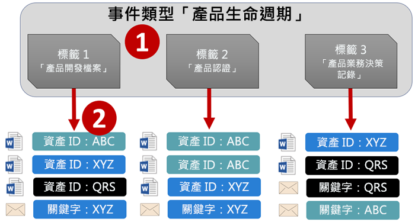
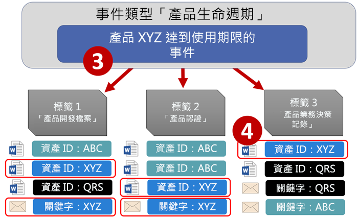
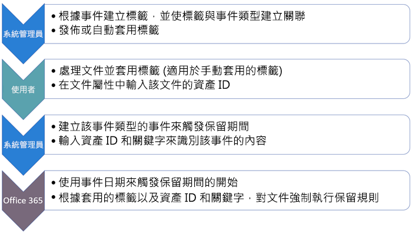
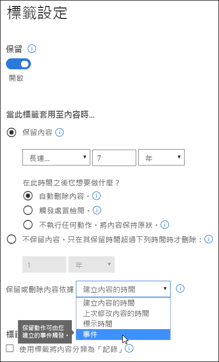
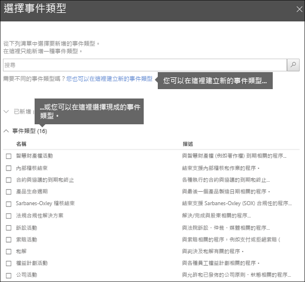
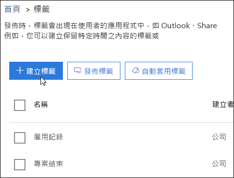
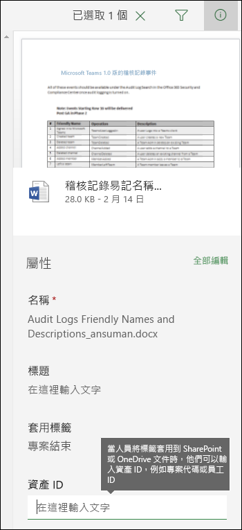
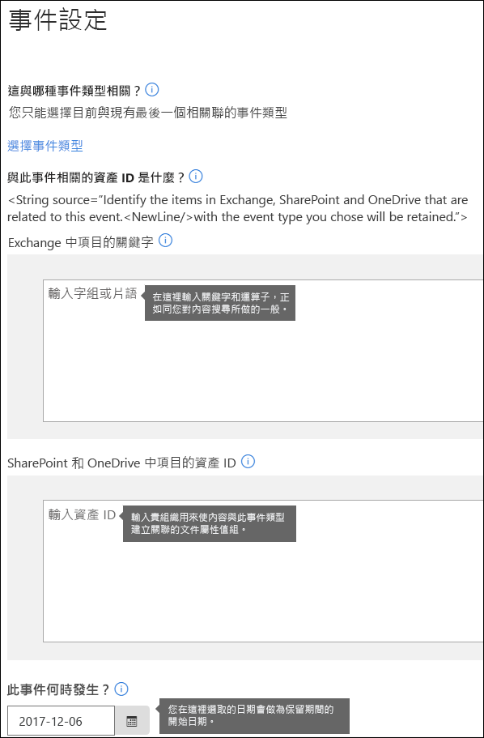

# 事件導向保留的概觀

當您保留內容時，保留期間通常是依據內容的存留期 - 例如，您在文件建立之後保留 7 年，然後刪除。但是使用 Office 365 中的標籤，您也可以讓發生特定類型事件的時間作為保留期間的依據。事件會觸發啟動保留期間，具有套用至該類型事件之標籤的所有事件，會強制執行標籤的保留動作。
  
例如，您可以針對下列項目，使用具有事件導向保留的標籤：
  
- **員工離開組織**假設員工記錄必須從員工離開組織之後開始保留 10 年。經過 10 年之後，與該員工雇用、績效及離職相關的所有文件都需要處置。觸發 10 年保留期間的事件是員工離開組織。 
    
- **合約到期**假設與合約相關的所有記錄必須從合約到期時間起保留 5 年。觸發 5 年保留期間的事件是合約到期日。 
    
- **產品生命週期**貴組織可能有與產品最後製造日期相關的保留需求，例如技術規格。在此情況下，最後製造日期是觸發保留期間的事件。 
    
事件導向保留通常作為記錄管理處理程序的一部分。這表示：
  
- 根據事件的標籤通常也會將內容分類為記錄。如需詳細資訊，請參閱[使用內容搜尋來尋找套用特定保留標籤的所有內容](labels.md#using-content-search-to-find-all-content-with-a-specific-retention-label-applied-to-it)。
    
- 已宣告為記錄但是其事件觸發程序尚未發生的文件，會無限期保留 (記錄無法永久刪除)，直到事件觸發該文件的保留期間。
    
- 根據事件的標籤通常會在保留期間結束時觸發處置檢閱，讓記錄管理員可以手動檢查並處置內容。如需詳細資訊，請參閱[處置檢閱概觀](disposition-reviews.md)。
    
根據事件的標籤具有與 Office 365 中的任何標籤相同的功能。若要深入了解，請參閱[標籤概觀](labels.md)。
    
## 了解事件類型、標籤、事件和資產識別碼之間的關聯性

若要成功使用事件導向保留，請務必了解如下所示的事件類型、標籤、事件和資產識別碼之間的關聯性。圖表後有說明。
  

  

  
1. 建立不同類型內容的標籤，然後將其與事件類型產生關聯。例如，不同類型產品檔案和記錄的標籤會與名為「產品生命週期」的事件類型相關聯，因為這些記錄必須從產品達到其生命週期結束開始保留 10 年。
    
2. 使用者 (通常是記錄管理員) 將標籤套用至內容和 (適用於 SharePoint 和 OneDrive 文件) 輸入每個項目的資產識別碼。在此範例中，資產識別碼是組織所使用的產品名稱或代碼。因此，每個產品的記錄會獲得指派標籤，而每一筆記錄具有包含資產識別碼的屬性。圖表代表組織中所有產品記錄的**所有內容**，每個項目都帶有記錄中產品的資產識別碼。 
    
3. 產品生命週期是事件類型；達到生命週期結尾的特定產品是事件。該事件類型的事件發生時 - 在此情況下，當產品達到其生命週期結尾時 - 您建立事件，指定：
    
  - 資產識別碼 (適用於 SharePoint 和 OneDrive 文件)
    
  - 關鍵字 (適用於 Exchange 項目)。在此範例中，組織在包含產品記錄的訊息中使用產品代碼，因此 Exchange 項目的關鍵字與 SharePoint 和 OneDrive 文件中的資產識別碼相同。
    
  - 發生事件的日期。此日期作為保留期間的開始日期。此日期只能是目前或未來的日期，不能是過去的日期。
    
4. 在您建立事件之後，事件日期會同步處理至具有該事件類型標籤和包含指定資產識別碼或關鍵字的所有內容。與其他任何標籤一樣，這個同步處理最多會耗費 7 天的時間。在上圖中，用紅色圈起來的所有項目具有由此事件觸發的保留期間，換句話說，當此產品達到其生命週期結尾時，該事件會觸發該產品記錄的保留期間。
    
請務必了解如果您未指定資產識別碼或事件的關鍵字，具有該事件類型標籤的**所有內容**將會具有由事件觸發的保留期間。這表示在上圖中，所有內容都會開始保留。這可能不是您想要的結果。 
  
最後請記住，每個標籤具有自己的保留設定。在此範例中，全部都指定 10 年，但是事件有可能觸發具有不同保留期間的標籤。
  
## 如何設定事件導向保留

以下是事件導向保留的高階工作流程。隨後是更詳細的步驟。
  

  
### 步驟 1：建立其保留期間根據事件的標籤

在安全性與合規性中心的左側導覽中，於 [分類]**** 底下選擇 [標籤]**** \> [建立標籤]****。
  
當您建立標籤時，開啟保留，然後如下所示選擇選項，以根據事件保留或刪除內容。這表示當您在 [事件]**** 頁面上建立事件時，保留設定在 9 月 5 日之前不會生效。 
  
請注意，事件導向保留通常是用於分類為記錄的內容。基於這個原因，當您根據事件建立標籤時，通常會選擇選項 [使用標籤將內容分類為「記錄」]****。
  
另請注意，事件導向保留需要保留設定：
  
- 保留內容。
    
- 自動刪除內容或在保留期間結束時觸發處置檢閱。
    

  
### 步驟 2：選擇該標籤的事件類型

在標籤設定中，當您選擇以**事件**作為標籤的依據選項之後，您會看到選項 [選擇事件類型]****。事件類型只是您想要與標籤產生關聯之事件的一般說明。
  
例如，如果您建立名為「產品生命週期」的事件類型，您會建立事件型標籤，具有名稱說明您想要將標籤套用到什麼類型的內容，例如「產品開發檔案」或「產品業務決策記錄」。
  
請注意，一旦您選擇事件類型並建立標籤，就無法變更事件類型。
  

  
### 步驟 3：發佈或自動套用標籤

就像任何標籤一樣，您需要發佈或自動套用事件型標籤，以便手動或自動套用至內容。在 [標籤]**** 頁面上進行這項操作。請注意，將內容分類為記錄的標籤只能發佈和手動套用到內容；無法自動套用到內容。 
  

  
### 步驟 4：輸入資產識別碼

在事件導向標籤套用到內容之後，您可以為每個項目輸入資產識別碼。例如，貴組織可能會使用：
  
- 產品代碼，您可以用來保留僅限特定產品的內容。
    
- 專案代碼，您可以用來保留僅限特定專案的內容。
    
- 員工識別碼，您可以用來保留僅限特定人員的內容。
    
了解 Asset ID 只是 SharePoint 和商務用 OneDrive 中的另一個文件屬性。貴組織可能已經使用其他文件屬性和識別碼來分類內容。若是如此，您也可以在建立事件時使用這些屬性和值 - 請參閱下方的步驟 6。重點是貴組織必須在文件中使用一些 property:value 組合，以便讓該項目與事件類型產生關聯。
  

  
### 步驟 5：建立事件

發生該事件類型的特定執行個體時 - 例如，產品達到其生命週期的結尾 - 請移至安全性與合規性中心中的 [事件] 頁面，並且建立事件。您需要藉由建立它來手動觸發事件。
  
![安全性與合規性中心內的 [事件] 頁面](media/811bddfb-a7e9-4990-bf5e-abe0dfb91809.png)
  
### 步驟 6：選擇與步驟 2 中的標籤所使用相同的事件類型

當您建立事件時，選擇與步驟 2 中的標籤所使用相同的事件類型 - 例如，產品生命週期。只有標籤套用至該事件類型的內容，會觸發其保留期間。
  

  
### 步驟 7：輸入關鍵字或資產識別碼

現在您可以藉由指定資產識別碼 (適用於 SharePoint 和 OneDrive 內容) 或關鍵字 (適用於 Exchange 內容)，來縮小內容的範圍。對於資產識別碼，只會在具有指定 property:value 配對的內容上強制執行保留。如果未輸入資產識別碼，具有該事件類型標籤的**所有內容**都會套用相同的保留日期。 
  
了解 Asset ID 只是 SharePoint 和商務用 OneDrive 中的另一個文件屬性。如果您使用 Asset ID 屬性，您要在資產識別碼的方塊中輸入 ComplianceAssetID:\<value\>，如下所示。
  
貴組織可能已將其他屬性和識別碼套用至與此事件類型相關的文件。例如，如果您必須偵測特定產品的記錄，識別碼可能是自訂屬性 ProductID 和值 "XYZ" 的組合。在此情況下，您要在資產識別碼的方塊中輸入 ProductID:XYZ，如下所示。
  
對於 Exchange 項目，您可以包含關鍵字。您可以藉由使用像是 AND、OR 和 NOT 的搜尋運算子來精簡查詢。如需詳細資訊，請參閱[內容搜尋的關鍵字查詢和搜尋條件](keyword-queries-and-search-conditions.md)。
  
最後，請選擇發生事件的日期；此日期會作為保留期間的開始日期。在您建立事件之後，該事件日期會同步處理至具有該事件類型標籤、資產識別碼和關鍵字的所有內容。就像任何標籤一樣，此同步處理會耗費最多 7 天的時間。
  

  
## 使用內容搜尋來尋找具有特定標籤或資產識別碼的所有內容

將標籤指派給內容之後，您可以使用安全性與合規性中心中的內容搜尋，尋找以特定標籤分類或包含特定資產識別碼的所有內容。
  
當您建立內容搜尋時：
  
- 若要尋找具有特定標籤的所有內容時，請選擇**合規性標記**條件，然後輸入完整標籤名稱或，或輸入部分標籤名稱並使用萬用字元。 
    
- 若要尋找具有特定資產識別碼的所有內容，請輸入 **ComplianceAssetID** 屬性和值，例如 ComplianceAssetID:\<value\>。 
    
如需詳細資訊，請參閱[內容搜尋的關鍵字查詢和搜尋條件](keyword-queries-and-search-conditions.md)。
  
## 權限

若要取得 [事件]**** 頁面的存取權，檢閱者必須是具有**處置管理**角色和**僅限檢視稽核記錄**角色之角色群組的成員。我們建議建立稱為「處置檢閱者」的新角色群組，將這兩個角色新增至該角色群組，然後將成員新增至角色群組。 
  
如需詳細資訊，請參閱[授與使用者存取 Office 365 安全性與合規性中心的權限](grant-access-to-the-security-and-compliance-center.md)。
  
## 使用 PowerShell 讓事件自動化

在 Office 365 安全性與合規性中心，您只能手動建立事件；無法在事件發生時自動觸發事件。但是，您可以使用 PowerShell 指令碼讓您的業務應用程式的事件型保留自動化。
  
我們目前正在開發 API，讓您可以將商務應用程式 (例如 HR、CRM 或財務應用程式) 連線到事件導向保留。例如，您可以將您的 HR 系統連線到事件導向保留，以便在員工離開組織時，該事件類型的事件會自動觸發。
  
在那之前，以下是適用於事件導向保留的 PowerShell Cmdlet：
  
- [Get-ComplianceRetentionEventType](https://go.microsoft.com/fwlink/?linkid=873002)
    
- [New-ComplianceRetentionEventType](https://go.microsoft.com/fwlink/?linkid=873004)
    
- [Remove-ComplianceRetentionEventType](https://go.microsoft.com/fwlink/?linkid=873005)
    
- [Set-ComplianceRetentionEventType](https://go.microsoft.com/fwlink/?linkid=873006)
    
- [Get-ComplianceRetentionEvent](https://go.microsoft.com/fwlink/?linkid=873001)
    
- [New-ComplianceRetentionEvent](https://go.microsoft.com/fwlink/?linkid=873003)
    

