# 檔案計劃管理員的概觀

檔案計劃管理員提供對於保留標籤、保留標籤原則的進階管理功能，並且提供整合的方式讓標籤和標籤至內容活動周遊整個內容生命週期 – 從建立、共同作業、記錄宣告、保留，到最終的處置。

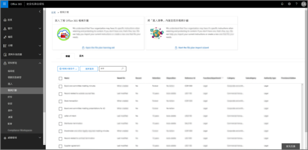

## 存取檔案計劃管理員

存取檔案計劃管理員有兩個需求，需求如下：
- Office 365 企業版 E5 訂閱。
- 使用者已獲指派「安全性與合規性中心」的下列其中一個角色：
    - 保留管理員
    - 僅檢視保留管理員

## 預設保留標籤和標籤原則

如果安全性與合規性中心中沒有保留標籤，第一次在左側導覽中選擇 [檔案計畫]**** 時，這會建立稱為**預設資料控管發佈原則**的標籤原則。 

此標籤原則包含三個保留標籤：

- **作業程序**
- **一般業務**
- **合約協定**

設定這些保留標籤只是為了保留內容，而非刪除內容。 此標籤原則將發佈到整個組織，並可加以停用或移除。 

您可以判斷誰開啟了檔案計畫管理員並開始了初次執行體驗，方法是檢閱活動 [建立保留原則]**** 和 [為保留原則建立了保留組態]**** 的稽核記錄。

> [!NOTE]
> 由於客戶的意見反應，我們已移除了會建立預設保留標籤和以上所提及的保留標籤原則的這項功能。 只有在 2019 年 4 月 11 日之前開啟檔案計劃管理員的情況下，才會看到這些保留標籤和保留標籤原則。

## 瀏覽您的檔案計劃

檔案計劃管理員可讓您更輕鬆地從單一檢視，查看所有保留標籤和原則及其設定。

請注意，在檔案計劃外部所建立的保留標籤可以在檔案計劃中使用，反之亦然。

在 [檔案計劃標籤]**** 索引標籤上，下列額外資訊和功能可供使用：

### 標籤設定資料行

- [根據]**** 會識別觸發程序類型，該觸發程序會開始保留期間。有效的值是：
    - 事件
    - 建立時機
    - 上次修改時間
    - 套用標籤時機
- [記錄]**** 會識別項目是否會在套用標籤時變成宣告的記錄。有效的值是：
    - 否
    - 是
    - Yes(Regulatory)
- [保留]**** 會識別保留類型。有效的值是：
    - 保留
    - 保留與刪除
    - 刪除
- [處置]**** 會識別保留期間結束時內容會發生什麼情形。有效的值是：
    - Null
    - 不執行任何動作
    - 自動刪除
    - 需要檢閱 (也稱為處置檢閱)

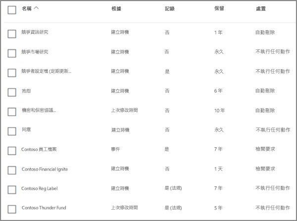

### 保留標籤檔案計劃描述元資料行

您現在可以在保留標籤組態中包含詳細資訊。將檔案計劃描述元插入保留標籤可以改善檔案計劃的管理性和組織。

為了讓您開始使用，檔案計劃管理員會為以下項目提供現成的值：函式/部門、分類、授權類型和佈建/引文。您可以在建立或編輯保留標籤時新增檔案計劃描述元值。

以下是建立或編輯保留標籤時的檔案計劃描述元步驟檢視。

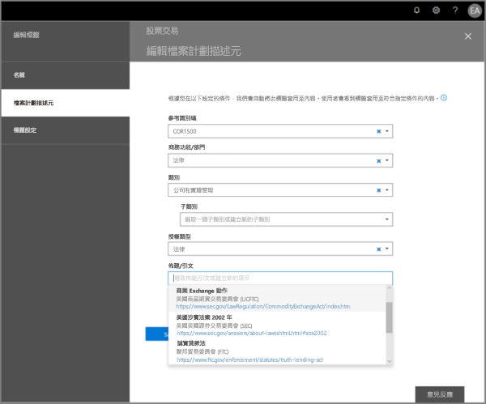

以下是檔案計劃管理員的標籤索引標籤上，檔案計劃描述元的檢視。

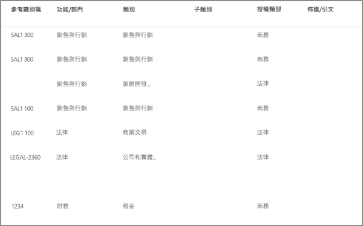

## 匯出所有現有的保留標籤以分析及/或執行離線檢閱

您可以從檔案計劃管理員將所有保留標籤的詳細資料匯出至 .csv 檔案，以協助您加速與貴組織中資料控管專案關係人進行的定期合規性檢閱。

若要匯出所有保留標籤，請移至 [檔案計劃管理員]**** \> [檔案計劃動作]**** \> [匯出標籤]****。

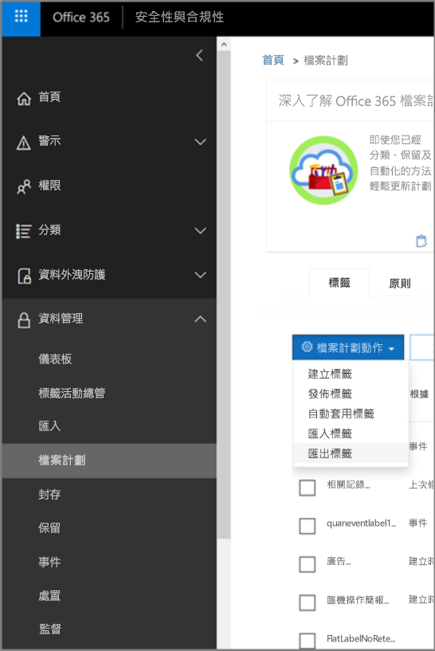

包含所有現有保留標籤的 *.csv 檔案隨即開啟。

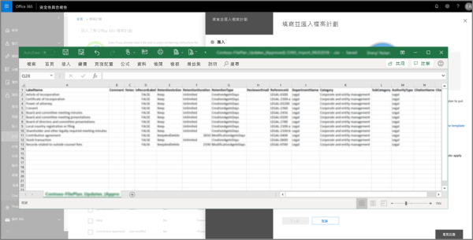

## 將保留標籤匯入至您的檔案計劃

您可以從檔案計劃管理員大量匯入新的保留標籤，以及修改現有的保留標籤。

若要匯入新的保留標籤並更新現有的保留標籤，請移至 [檔案計劃管理員]**** \> [檔案計劃動作]**** \> [匯入標籤]****。

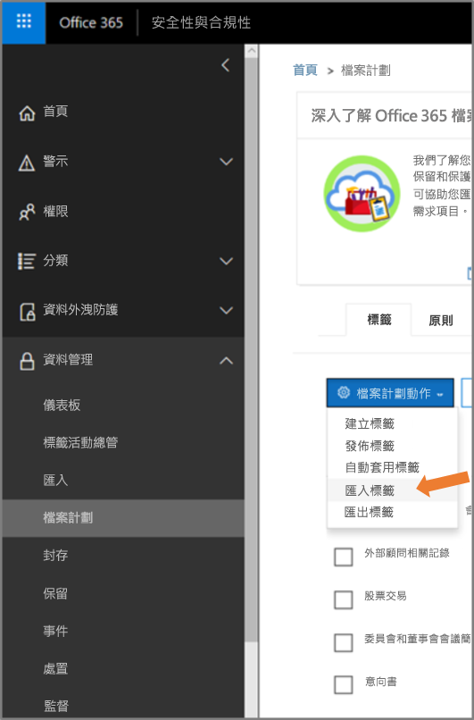

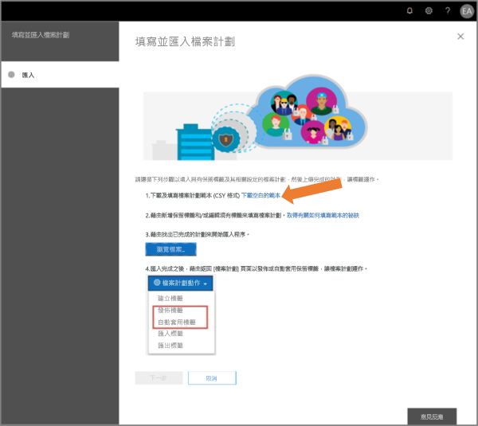

下載空白範本 (或從匯出目前的檔案計劃開始)。

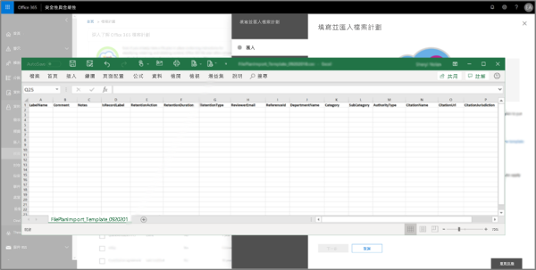

填入範本 (即將推出：單一保留標籤有效值組合的參考資訊)。

上傳已填入資訊的範本，檔案計劃管理員會驗證項目並且顯示匯入統計資料。

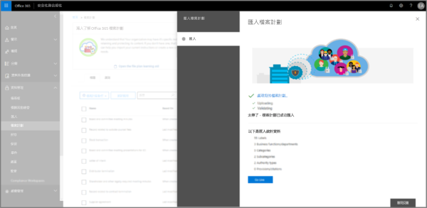

萬一有驗證錯誤，檔案計劃匯入將會繼續驗證匯入檔案中的每個項目，並在匯入檔案中顯示參考行/列數的所有錯誤、複製顯示的錯誤結果，讓您可以輕鬆地返回匯入檔案並更正錯誤。 

匯入完成後，返回檔案計劃管理員，讓新的保留標籤與新的或現有的保留標籤原則產生關聯。

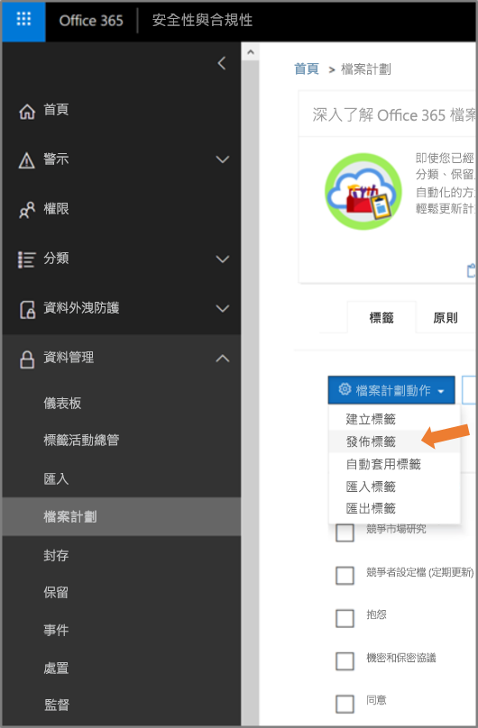

