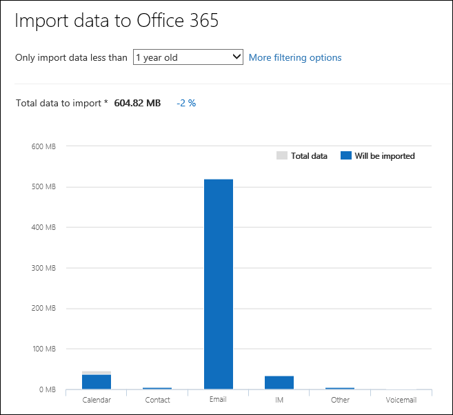

# 匯入至 Office 365 的 PST 檔案時篩選資料

使用 Office 365 匯入服務中的新的智慧型匯入功能，來篩選實際取得匯入至目標信箱的 PST 檔案中的項目。 以下為運作方式：
  
- 您可以建立及提交 PST 匯入工作之後，PST 檔案上傳至 Microsoft 雲端中的 Azure 儲存體] 區域中。
    
- Office 365 會分析安全無虞的方式，PST 檔案中的資料，藉由識別的保留天數的信箱項目和 PST 檔案中包含不同的郵件類型。
    
- 當分析已完成，且可匯入資料時，您必須匯入或修剪匯入藉由設定篩選器來控制哪些資料取得匯入資料時的 PST 檔案中的所有資料的選項。 例如，您可以選擇：
    
  - 匯入特定天數的項的目。
    
  - 選取 [匯入訊息類型。
    
  - 排除特定人員所傳送或接收的郵件。
    
- 設定篩選設定之後，Office 365 匯入僅符合要匯入工作中所指定的目標信箱的篩選準則的資料。
    
下圖顯示的智慧型匯入程序，並會醒目提示您執行的工作和 Office 365 所執行的工作。
  

  
## 開始之前

- 本主題中的步驟假設您已建立 PST 匯入工作中的 Office 365 匯入服務透過網路上傳或磁碟機運送。 逐步指示，請參閱下列主題：
    
  - [使用網路上傳將 PST 檔案匯入 Office 365](use-network-upload-to-import-pst-files.md)
    
  - [使用磁碟機運送將 PST 檔案匯入 Office 365](use-drive-shipping-to-import-pst-files-to-office-365.md)
    
- 之後您可以使用網路上傳，合規性中心設為**在進行中的分析**，這表示 Office 365 會分析您上傳的 PST 檔案中的資料安全性 & [匯入] 頁面上匯入工作的狀態，以建立匯入工作。 按一下 [**重新整理**更新匯入工作的狀態。 
    
- 磁碟機運送匯入工作，如資料會分析 Office 365 Microsoft 資料中心人員會收到您的硬碟機，並將 PST 檔案上傳至您的組織的 Azure 儲存體區域之後。
  
## 篩選取得匯入至信箱的資料

您已建立之後 PST 匯入工作，請遵循下列步驟之前進行篩選資料匯入 Office 365。
  
1. 移至 [[https://protection.office.com/](https://protection.office.com/)並登入 Office 365 組織中系統管理員帳戶使用的認證。 
    
2. 按一下 [**資料控管** \> **匯入**。
    
    貴組織的匯入工作會列在 [**匯入**] 頁面上。 請注意，在 [**狀態**] 欄中的**分析完成**值表示有已由 Office 365 進行分析，並準備好讓您匯入的匯入工作。 
    
    
  
3. 您想要完成匯入工作，按一下 [**準備好匯入至 Office 365** 。 
    
    飛入] 頁面上的會顯示 PST 檔案的相關資訊與匯入工作的其他資訊。
    
4. 按一下 [**匯入至 Office 365**。
    
    會顯示 [**篩選您的資料**] 頁面。 它包含在 PST 檔案匯入工作，包括資訊的資料保留資料的相關資料見解。 
    
    ![篩選您的資料] 頁面上顯示資料見解的 PST 檔案匯入工作](media/3b537ec0-25a4-45a4-96d5-a429e2a33128.png)
  
5. 根據您想要是否修剪匯入的資料到 Office 365，在**您想要篩選您的資料？**，執行下列其中一項：
    
    a. 按一下 [**是，我想要匯入之前先加以篩選**修剪您匯入的資料，然後按一下 [**下一步**。
    
    [**匯入資料到 Office 365 頁面**] 頁面上會顯示與 Office 365 執行分析的觀點，詳細的資料。 
    
    
  
    在此頁面上圖顯示將匯入的資料量。 圖形中顯示的 PST 檔案中，找到每個郵件類型的相關資訊。 您可以將游標停留每一列中顯示該郵件類型的特定資訊。 也是根據分析的 PST 檔案的不同的保留時間下限值下拉式清單。 當您在下拉式清單中選取的保留天數時，此圖形會更新以顯示多少資料將會匯入所選的天數。 
    
    b. 若要設定新增篩選器，以減少的匯入的資料量，請按一下 [**更多的篩選選項**。
    
    ![修剪匯入的資料 [更多選項] 頁面上設定篩選器](media/3f8d68c3-3fe2-4b4e-9488-b368b98fa9fe.png)
  
    您可以設定這些篩選器：
    
      - **保留時間下限**-選取要匯入保留天數，因此只有項目，會比指定使用期限。 請參閱關於 Office 365 如何判斷**保留**篩選時代 bucket 描述[的詳細資訊](#more-information)一節。 
    
      - **Type** -此區段顯示匯入工作的 PST 檔案中找不到的所有郵件類型。 您可以取消選取您想要排除的訊息類型旁的方塊。 請注意，您不能排除的其他郵件類型。 請參閱清單[的詳細資訊](#more-information)一節所包含的其他類別中的信箱項目。 
    
      - **使用者**-您可以排除郵件已傳送或接收的特定對象。 若要排除人員出現在 [從:] 欄位中以:] 欄位中，] 或 [副本： 欄位的郵件，按一下該收件者類型旁的 [**排除的使用者**。 輸入該人員的電子郵件地址 （SMTP 地址），按一下 [**新增**![[新增] 圖示](media/457cd93f-22c2-4571-9f83-1b129bcfb58e.gif)若要將其新增至該收件者類型，排除使用者清單，然後按一下 [**儲存**] 以儲存排除的使用者清單。 
    
        > [!NOTE]
        > Office 365 不會顯示資料見解所得設定**人員**的篩選器。 不過，如果您將此篩選器，以排除特定人員所傳送或接收的郵件，這些郵件會排除在實際匯入程序期間。 
  
    c. **更多篩選選項**飛入] 以儲存您的篩選設定] 頁面中，按一下 [**套用]** 。 
    
    深入了解在**匯入資料到 Office 365** ] 頁面上會更新您篩選設定為基礎的資料，包括將匯入的資料總數根據篩選設定。 請注意，也會顯示篩選器設定的摘要。 您可以**編輯**按一下旁的 [篩選器，視需要變更此設定。 
    
    
  
    d. 按 [下一步]****。
    
    狀態] 頁面隨即顯示您篩選設定。 同樣地，您可以編輯的任何篩選器設定。
    
    e. 按一下 [開始匯入的 [**匯入資料**]。 請注意，顯示總將匯入的資料量。 
    
    Or
    
    a. 按一下 [**否，我想要匯入每個項目**匯入 Office 365 的 PST 檔案中的所有資料，然後按一下 [**下一步**。
    
    b. 在 [**匯入資料到 Office 365** ] 頁面上，按一下 [開始匯入的 [**匯入資料**。 請注意，顯示總將匯入的資料量。 
    
6. 在 [**匯入**] 頁面上，按一下 [**重新整理**。 匯入工作的狀態會顯示在 [**狀態**] 欄中。 
    
7. 按一下 [匯入該工作以顯示更多詳細的資訊，例如每個 PST 檔案與您設定篩選設定的狀態。

  
## 詳細資訊

- Office 365 如何判斷時代篩選器時，會遞增？ 當 Office 365 分析 PST 檔案時，它會尋找在每個項目的送出或收到的時間戳記 （如果項目有兩個傳送和接收的時間戳記，便會選取最舊的日期）。 然後 Office 365 查看該時間戳記的年份值，並將其比較至判斷項目的存留期為目前日期。 這些 ages 然後可用在下拉式清單中的值為**保留**篩選。 例如，如果 PST 檔案有來自 2016年、 2015年及 2014，然後**保留**篩選中的值會是**1 年**、 **2 年**及**3 年**。
    
- 下表列出隨附的 [**其他**] 類別中**更多選項**飛入] 頁面上的**類型**篩選的郵件類型 （請參閱步驟 5b 前程序中的）。 目前，您無法在 Pst 匯入 Office 365 時，排除在 「 其他 」 類別中的項目。 
    
    |**郵件類別識別項**|**使用此郵件類別的信箱項目**|
    |:-----|:-----|
    |IPM。活動    |日誌項目    |
    |IPM。文件    |文件及檔案 （不會附加至電子郵件）    |
    |IPM。檔案    |（與 IPM 相同。文件）    |
    |IPM。Note.IMC.Notification    |以 Internet Mail Connect，這是網際網路的 Exchange Server 閘道傳送報告    |
    |IPM。Note.Microsoft.Fax    |傳真訊息    |
    |IPM。Note.Rules.Oof.Template.Microsoft    |不在辦公室的自動回覆郵件    |
    |IPM。Note.Rules.ReplyTemplate.Microsoft    |收件匣規則所傳送的回覆    |
    |IPM。OLE。類別    |週期性系列的例外狀況    |
    |IPM。Recall.Report    |郵件回收報告    |
    |IPM。遠端    |遠端郵件    |
    |IPM。報表    |項目狀態報表    |
