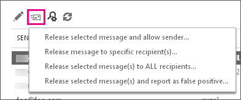

# 以系統管理員身分找到並釋放被隔離的郵件

本主題說明如何 Exchange Online 與 Exchange Online Protection (EOP) 系統管理員可以尋找、 釋出，並報告在 Exchange 系統管理中心 (EAC) 的隔離郵件。Office 365 引導至其中一個隔離的郵件因為它們已識別為垃圾郵件或其符合傳輸規則。 
  
使用安全性&amp;規範中心，而不是 EAC 中完成這些工作，以及檢視的任何並使用 [傳送至隔離因為它們包含惡意程式碼的郵件。如需詳細資訊，請參閱[Office 365 中的隔離電子郵件訊息](https://support.office.com/en-US/article/Quarantine-email-messages-in-Office-365-4c234874-015e-4768-8495-98fcccfc639b)。
  
在 EAC 中的 [**隔離**] 頁面上將列出隔離的郵件。根據預設，訊息會排序從到最舊**RECEIVED**上最新的欄位。**寄件者**、**主旨**和**到期日**的值也會列出每封郵件。您可以按一下其標題排序上所有這些欄位。如果您按一下欄標題第二次時，會回復的排序順序。[**隔離**] 頁面上會顯示最大值為 500 封郵件。 
  
您可以檢視清單中所有的隔離郵件，或是您可以藉由指定篩選準則搜尋特定的郵件 （篩選也可以協助減少您的結果集如果您有超過 500 封郵件）。搜尋找到特定隔離的郵件之後，您可以檢視郵件詳細資料。您也可以：
  
- 郵件釋出給一或多個收件者，並選擇性地其報告為誤判 （非垃圾郵件） 郵件給 Microsoft 垃圾郵件分析小組，將評估和分析郵件。根據此分析結果，整個服務的垃圾郵件內容篩選規則可能會調整以允許透過訊息。
    
- 釋出郵件並允許從該寄件者的所有未來的郵件。
    
## 開始之前有哪些須知？

- 您必須獲得權限才能執行此程序或程序。若您需要哪些權限，請參閱[Feature Permissions in Exchange Online](http://technet.microsoft.com/library/15073ce1-0917-403b-8839-02a2ebc96e16.aspx)主題中的 「 隔離 」 項目。 
    
- 您可以釋出或多個郵件報告一次 [**隔離**] 頁面。或者您可以建立遠端 Windows PowerShell 指令碼來完成此工作。使用[Get-quarantinemessage](http://technet.microsoft.com/library/88026da1-8dbc-49e7-80e8-112a32773c34.aspx)指令程式來搜尋的郵件，以及[版本 QuarantineMessage](http://technet.microsoft.com/library/4a3aa05c-238f-46f2-b8dd-b0e3c38eab3e.aspx)指令程式來釋放它們。 
    
- 如需適用於此主題中程序的快速鍵相關資訊，請參閱 **Exchange 系統管理中心的鍵盤快速鍵**。
    
> [!TIP]
> 有問題嗎？在 Exchange 論壇中尋求協助。 論壇的網址為：[Exchange Server](https://go.microsoft.com/fwlink/p/?linkId=60612)、[Exchange Online](https://go.microsoft.com/fwlink/p/?linkId=267542)或 [Exchange Online Protection](https://go.microsoft.com/fwlink/p/?linkId=285351)。 
  
## 使用進階搜尋來篩選和尋找隔離郵件

在 Exchange 系統管理中心 (EAC)，您可以使用進階搜尋，根據數個不同條件來篩選隔離的郵件。這些條件可以分開使用，也可以一起使用。搜尋將會提供符合所有篩選準則的郵件清單。
  
1. 在 EAC 中，瀏覽至 [**保護** \> **隔離**，然後按一下 [**進階的搜尋**。
    
2. 在 [**進階搜尋**] 視窗中，選取符合下列條件的任何組合。選取 [關聯] 核取方塊以啟用每一個條件。不支援萬用字元。 
    
1. **郵件識別碼**您可以使用此參數來執行特定郵件的目標的搜尋。例如，如果特定郵件是由傳送或適合您的組織中的使用者，但它永不到達其目的地，您可以搜尋郵件使用郵件追蹤功能。如需詳細資訊，請參閱[執行郵件追蹤和檢視結果](http://technet.microsoft.com/library/74a9fc59-7e0e-4832-baf9-2a86418b0079.aspx)。如果您發現郵件已傳送至隔離區，或許因為符合規則或已識別為垃圾郵件您可以再輕鬆尋找此訊息隔離區中指定其訊息識別碼。請務必包含完整的訊息識別碼字串。這可能會包含角括弧 (\<\>)。 
    
2. **寄件者電子郵件地址** 指定寄送郵件人員的電子郵件地址。 
    
3. **收件者電子郵件地址** 指定郵件預定收件者的電子郵件地址。 
    
4. **主旨** 指定郵件的主旨行文字。 
    
5. **接收**您亦可選取收到郵件隔離區過去 24 小時內 （**今天**），在過去週 （**過去 7 天**） 內過去 48 小時 （**最後一筆 2 天**） 內或者您亦可選取自訂的時間間隔的期間無法傳遞郵件。接收到隔離區。 
    
6. **過期**您可以選取郵件將從隔離刪除下一個 24 小時內 （**今天**） 下, 一步 （**下一步 7 天**） 在下一週內 48 小時 （**下一步 2 天**） 內或您可以選取自訂的時間間隔期間的郵件將會從隔離刪除。
    
    > [!IMPORTANT]
    > 根據預設，垃圾郵件隔離的郵件中保留隔離 15 天時被隔離的郵件符合傳輸規則為 7 天存留在隔離區中。在這段時間內 Office 365 刪除的郵件，並不會擷取。無法可設定隔離的郵件符合傳輸規則的保留期間。不過，透過 **（天） 的保留天數垃圾郵件**設定內容篩選器原則中可以降低垃圾郵件隔離的郵件的保留期間。如需詳細資訊，請參閱[設定垃圾郵件篩選器原則](configure-your-spam-filter-policies.md)。 
  
7. **類型** 您可指定是要搜尋被識別為 **[垃圾郵件]** 的隔離郵件，或是搜尋符合某個 **[傳輸規則]** 的郵件。
    
3. 按一下 **[確定]**，開始執行進階搜尋。 
    
    > [!NOTE]
    > 若要清除搜尋準則並檢視隔離中的所有郵件，請清除 **[進階搜尋]** 視窗中的所有核取方塊，然後按一下 **[確定]**。 
  
搜尋郵件後，符合您指定之準則的結果會顯示在使用者介面中。EAC 中最多可以顯示 500 封郵件。 
  
## 檢視特定隔離郵件的詳細資料

在 [**隔離**] 頁面中找到特定隔離的郵件之後, 您可以檢視其詳細。 
  
1. 在 [**隔離**] 頁面上選取特定郵件，並畫面右邊的詳細資料窗格中會顯示該郵件的屬性摘要。 
    
    **[郵件狀態]** 值如下： 
    
  - **類型** 指出郵件被識別為 **[垃圾郵件]** 或是符合某個 **[傳輸規則]**。
    
  - **到期** 將從隔離刪除此郵件的日期。 
    
    **[郵件詳細資料]** 值如下： 
    
  - **寄件者** 傳送郵件之人員的電子郵件地址。 
    
  - **主旨** 郵件的主旨行文字。 
    
  - **收到日期** 隔離收到郵件的日期。 
    
  - **大小** 郵件的大小，單位為 KB，如果郵件大小超過 999 KB 則為 MB。 
    
  - **檢視郵件標頭**按一下此連結以開啟 [**郵件標頭**] 對話方塊，讓您檢視郵件標頭文字。您也可以將郵件標頭文字複製到剪貼簿並將它貼到[郵件標頭 Analyzer](https://testconnectivity.microsoft.com/?tabid=mha)。一次在郵件標頭 Analyzer 工具] 按一下 [**分析標頭**以擷取標頭的相關資訊。 
    
    > [!TIP]
    > 如需服務所插入之特定反垃圾郵件郵件標頭欄位的相關資訊，請參閱[反垃圾郵件訊息標頭](anti-spam-message-headers.md)。 
  
  - **預覽的電子郵件**按一下此連結以檢閱訊息的文字。 
    
2. 如果您按兩下隔離郵件，則會開啟 **[隔離郵件]** 視窗並顯示下列資訊： 
    
  - **已釋放** 已釋放其郵件的所有電子郵件地址清單 (若有的話)。 
    
  - **尚未釋出到**郵件已不已釋放其，如果有任何的所有電子郵件地址清單。您可以按一下 [**釋出到**] 連結以釋出郵件;如需釋出郵件的詳細資訊，請參閱下一節。 
    
  - **郵件識別碼** 在郵件標頭中找到的網際網路郵件識別碼 (也稱為用戶端識別碼)。 
    
    按一下 **[關閉]** 返回主要隔離窗格。 
    
## 釋出隔離的郵件

如果您想要釋出到收件者的郵件，是您的選項：
  
- [釋出隔離的郵件，並允許未來的郵件寄件者](find-and-release-quarantined-messages-as-an-administrator.md#Releasequarantinedmessageallowfuturemessagesfromsender)
    
- [釋出隔離的郵件給特定收件者而不將其報告為誤判](find-and-release-quarantined-messages-as-an-administrator.md#Releasequarantinedmessagetospecificrecipientswithoutreportingasfalsepositive)
    
- [釋出給所有收件者的一個或多個隔離的郵件](find-and-release-quarantined-messages-as-an-administrator.md#Releaseoneormorequarantinedmessagestoallrecipients)
    
- [釋出到所有收件者和報告誤判的一或多個隔離的郵件](find-and-release-quarantined-messages-as-an-administrator.md#Releaseoneormorequarantinedmessagestoallrecipientsandreportfalsepositives)
    
### 釋出隔離的郵件，並允許未來的郵件寄件者

1. 在 EAC 中，瀏覽至 [**保護** \> **隔離**。
    
2. 按一下以選取它，然後按一下 [**釋出郵件**] 圖示，如下列螢幕擷取畫面所示的訊息上。 
  

  
從下拉式清單中按一下 [**選取的郵件釋出及允許寄件者**]。 
    
3. **釋出郵件並允許寄件者**] 對話方塊隨即開啟。（選用） 您可以選擇要報個訊息給 Microsoft，然後按一下 [**釋出，並允許**。將會釋放郵件給所有收件者地址來與允許從此寄件者的所有未來訊息。不過，如果此郵件遭隔離時因傳輸規則或封鎖的寄件者、 寄件者會繼續封鎖未來的郵件。 
    
### 釋出隔離的郵件給特定收件者而不將其報告為誤判

1. 在 EAC 中，瀏覽至 [**保護** \> **隔離**。
    
2. 選取郵件、 按一下 [**釋出郵件**] 圖示，然後從下拉式清單中按一下 [**釋出郵件給特定收件人**。 
    
3. 在 **[釋出郵件]** 對話方塊中，選取下列其中一個選項： 
    
  - **將郵件釋出給所有收件者** 如果您選取此選項，請注意，您只能將郵件釋出給同一位收件者一次。如果收件者先前已收到郵件，系統不會再將郵件釋出給該名收件者。 
    
  - **釋出郵件給指定的收件者**選取 [可以釋放其郵件的收件者]。因為每個收件者只有發行一次一則訊息，其發行的 recipients 出現這份清單中。支援多重選取項目。收件者的選項之後，請按一下 [**新增**]。
    
4. 按一下 **[釋出]**。 
    
如果您按一下 [**重新整理**圖示來重新整理資料，然後按兩下郵件，您應該會看到它在預定的收件者已經發行。 
  
### 釋出給所有收件者的一個或多個隔離的郵件

1. 在 EAC 中，瀏覽至 [**保護** \> **隔離**。
    
2. 按一下以選取它，或使用 shift 鍵來選取多個郵件訊息上。然後按一下 [**釋出郵件**] 圖示。 
    
3. 從下拉式清單中按一下 [**發行給所有收件者所選的郵件**]。 
    
4. [警告] 對話方塊隨即開啟。閱讀 [警告並選取 **[是]** 如果您想要繼續執行。當您選取這個選項時，請注意郵件不一次以上發行到相同的收件者。如果收件者先前已收到訊息，它不會釋放再次到該收件者。 
    
### 釋出到所有收件者和報告誤判的一或多個隔離的郵件

1. 在 EAC 中，瀏覽至 [**保護** \> **隔離**。
    
2. 按一下以選取它，或使用 shift 鍵來選取多個郵件訊息上。然後按一下 [**釋出郵件**] 圖示。 
    
3. 按一下 [從下拉式清單中的 [**版本選取郵件並報告為誤判**]。 
    
4. [警告] 對話方塊隨即開啟。閱讀 [警告並選取 **[是]** 如果您想要繼續執行。當您選取這個選項時，請注意郵件不一次以上發行到相同的收件者。如果收件者先前已收到訊息，它不會釋放再次到該收件者。 
    
     當您選擇這個選項時，將會釋放郵件給不接收所有收件者。如果是垃圾郵件隔離的郵件，它也會報告給 Microsoft 垃圾郵件分析小組，將評估和分析郵件。根據此分析結果，整個服務的垃圾郵件內容篩選規則可能會調整以允許透過訊息。 
    
> [!TIP]
> 協助確保該郵件不標記為垃圾郵件[如何協助確保郵件未標示為垃圾郵件](how-to-help-ensure-that-a-message-isn-t-marked-as-spam.md)中的步驟。 
  
如果您按一下 [**重新整理**圖示來重新整理資料，然後按兩下郵件，您應該會看到它在預定的收件者已經發行。 
  
## 相關資訊

[隔離常見問題集](quarantine-faq.md)
  

