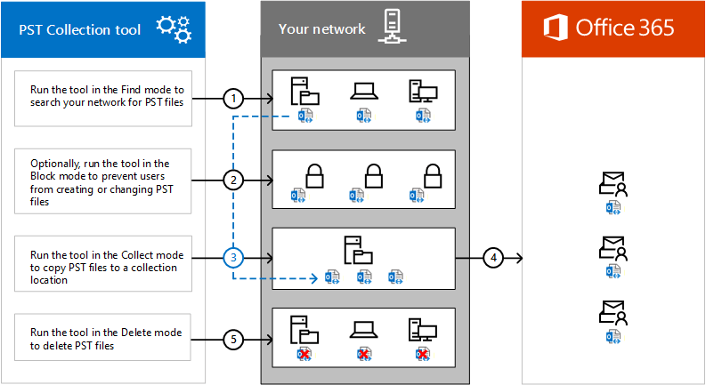

# <a name="use-the-pst-collection-tool-to-find-copy-and-delete-pst-files-in-your-organization"></a>使用 PST 集合工具來尋找、 複製及刪除組織中的 PST 檔案

您可以使用 Microsoft PST 集合工具來搜尋您組織的網路的 PST 檔案。此工具可協助您取得散佈整個組織中的 PST 檔案的存貨。尋找 PST 檔案之後，您可以使用 PST 集合工具將其複製集中的位置。集中一處具有 Pst 則可讓您匯入至 Exchange Online 信箱 （或單一 Exchange Online 信箱），其中您可以再套用一組豐富的 Office 365 中的符合性功能。包含將 Pst 匯入使用者的封存信箱，搜尋您匯入使用 eDiscovery 搜尋工具使用 eDiscovery 保留郵件的 PST 檔案中的特定郵件的保留與 Office 365 的保留原則和管理生命週期使用訊息上述訊息的循環記錄管理功能的 Exchange Online。您確信您收集 PST 檔案都已成功匯入至 Office 365 後，您可以使用此工具在網路上從其原始位置刪除這些。 
  
您可以運用 PST 集合工具的另一項重點是防止使用者建立新的 PST 檔案並變更現有您在網路找到的 PST 檔案。這些 「 封鎖 」 功能可讓您尋找、 收集及匯入 Office 365 的已知的一組 PST 檔案和防止未來激增的組織中的 PST 檔案。 
  
## <a name="how-the-pst-collection-tool-works"></a>PST 集合工具的運作方式

以下是使用 PST 集合工具來尋找、 控制、 收集和刪除您組織中的 PST 檔案的程序的快速概觀 （英文）。
  

  
1. **[步驟 1： 尋找在您的網路上的 PST 檔案](#step-1-find-pst-files-on-your-network)**-當您執行工具，以尋找 PST 檔案，您指定的位置，例如包含適用於用戶端和伺服器電腦的 Active Directory 物件的組織單位。您也可以搜尋特定機器或網路檔案共用。當您執行此工具時，在目標電腦上安裝 「 輕量型"的集合代理程式。此代理程式搜尋 PST 檔案的目標電腦並再將資訊傳送回至 PST 集合工具需發現任何 PST 檔案。此工具會建立記錄檔包含在指定的位置中找到的 PST 檔案的相關資訊。當您執行此工具在稍後步驟使用這些檔案。 
    
2. **[（選用） 步驟 2： 控制 PST 檔案的存取](#optional-step-2-control-access-to-pst-files)**-此工具會以防止使用者建立或變更 PST 檔案的設定來建立群組原則物件 (GPO)。此 GPO 會套用至您的網域中的每一個使用者。此選用的步驟可協助您"鎖定"中找不到步驟 1 您可以收集、 匯入和而不需要建立新的 PST 檔案中予以刪除 PST 檔案或變更現有的 PST 檔案。 
    
3. **[步驟 3： 將 PST 檔案複製到集合位置](#step-3-copy-the-pst-files-to-a-collection-location)**-這可讓您收集在一個位置的 PST 檔案，讓您可以使用匯入其 Exchange Online 信箱匯入 Office 365 服務在步驟 4。當您執行此工具"收集 」 模式中時，每個集合代理程式會複製到集合位置安裝代理程式的目標機器 PST 檔案。 
    
4. **[步驟 4: PST 檔案匯入 Office 365](#step-4-import-the-pst-files-to-office-365)** -已 PST 檔案複製到一個位置之後，即準備好匯入到 Exchange Online 信箱。 
    
5. **[步驟 5： 在網路找到的 PST 檔案的刪除](#step-5-delete-the-pst-files-found-on-your-network)**-之後 PST 檔案找到並收集都已匯入 Office 365 中的 Exchange Online 信箱，您可以使用 PST 集合工具從原始位置刪除 PST 檔案其中它們在 [步驟 1 中找到。 

## <a name="before-you-begin"></a>開始之前

- 請遵循下列步驟來下載到本機電腦的 PST 集合工具。 
    
    1. [下載 PST 集合工具](https://aka.ms/pstcollectiontool)。
    
    2. 在快顯視窗中，按一下 [**儲存** \> PSTCollectionTool.zip 檔案儲存到資料夾本機電腦上的 [**另存為**。 
    
    3. 擷取 PSTCollectionTool.zip 檔案的資料夾上您的本機電腦;預設資料夾名稱是 PSTCollectionTool。
    
- 若要執行任何模式 （Find、 封鎖、 複製或刪除） PST 集合工具，您必須是 Active Directory 網域中 Domain 管理員群組的成員。 

## <a name="step-1-find-pst-files-on-your-network"></a>步驟 1： 尋找在您的網路上的 PST 檔案

第一個步驟是執行 PST 集合工具來尋找在組織中的 PST 檔案。您可以使用工具來搜尋下列類型的位置。 
  
- 在內部部署 Active Directory 網域中的組織單位 (Ou)。此工具會在指定的 OU 中搜尋所包含的所有機器。 
    
- 用戶端和伺服器的電腦。此工具會搜尋指定的機器。 
    
- 網路檔案共用。此工具會搜尋指定的網路檔案共用。 
    
請參閱描述`Locations`表格中的每個這些位置類型使用的語法範例的下列程序的參數。 
  
> [!IMPORTANT]
> 您必須執行的 [尋找模式 PST 集合工具才能執行其他動作，例如封鎖、 收集，或刪除 PST 檔案。 
  
1. 本機電腦上開啟命令提示字元 （系統管理員身分執行）。
    
2. 移至 PSTCollectionTool 資料夾 （或您 PSTCollectionTool.zip 檔案解壓縮至資料夾）。
    
3. 變更至 DataCollectorMaster 目錄。
    
4. 執行下列命令，以尋找 PST 檔案中指定的位置。
    
    ```
    DataCollectorMaster.exe -DataSource Pst -Mode Find -JobName <Name> -Locations <Locations to search for PSTs> -LogLocation <Location to store log files> -ConfigurationLocation <Location to store configuration files>
    ```

    下表說明參數和其所需的值時執行 DataCollectorMaster.exe 命令來尋找 PST 檔案。 
    
    |參數 * * *|****Description****|範例 * * *|
    |:-----|:-----|:-----|
    | `DataSource` <br/> |指定要搜尋之資料類型。目前，您可以使用 PST 集合工具來搜尋 PST 檔案。  <br/> | `-DataSource Pst` <br/> |
    | `Mode` <br/> |會指定將執行此工具的作業類型。使用值`Find`找出 PST 檔案中指定的位置。請注意此工具可尋找並取得連線至 Outlook 設定檔的 Outlook 和 PST 檔案中所開啟的 PST 檔案的相關資訊。<br/> | `-Mode Find` <br/> |
    | `JobName` <br/> |會指定 PST 集合工作的名稱。當您執行 PST 集合工具，以封鎖、 收集和刪除執行工具來尋找 PST 檔案時找到 PST 檔案，您會使用這個相同的工作名稱。工作名稱也會新增至記錄檔、 設定檔名。  <br/> | `-JobName PstSearch1` <br/> |
    | `Locations` <br/> | 指定要搜尋的 PST 檔案的一或多個位置。如果您指定一個以上的位置，請使用分號 （;） 分隔個別的位置。請務必環繞個別雙引號具有此參數的值 ("")。<br/><br/>   以下是必要的 identity 值格式類型的可搜尋的位置。  <br/><br/>        **Ou** -使用辨別名稱 (DN) 來識別 Ou;例如：`"OU=NorthAmerica,OU=NWRegion,OU=ITServices,DC=contoso,DC=com"` <br/> > [!IMPORTANT]> 您不能指定內建的電腦容器 (例如 CN = 電腦，DC = contoso，DC = com") 因為不是組織單位。<br/> <br/> **機器**-DN 或完整的網域名稱 (FQDN) 來識別您的網路; 上的用戶端和伺服器機器例如：  <br/>  DN：`"CN=FILESERVER01,CN=Computers,DC=contoso,DC=com"` <br/>  或  <br/>  FQDN：`"FILESERVER01.contoso.com"` <br/><br/>  **網路檔案共用**-使用 UNC 名稱來識別網路檔案共用 ；例如，`"\\FILESERVER02\Users"` <br/> | `-Locations "CN=FILESERVER01,CN=Computers,DC=contoso,DC=com";"CN=FILESERVER02,CN=Computers,DC=contoso,DC=com"` <br/> |
    | `LogLocation` <br/> |指定記錄檔會複製到的資料夾。如果資料夾不存在，將會建立當您執行此工具。  <br/> | `-LogLocation "c:\users\admin\desktop\PSTCollection"` <br/> |
    | `ConfigurationLocation` <br/> |會指定.xml 設定檔會複製到資料夾。這個檔案包含當您執行此工具時找到每個 PST 檔案的相關資訊。當您在複製找到 PST 檔案的步驟 3 中執行此工具會使用這個檔案。  <br/> | `-ConfigurationLocation "c:\users\admin\desktop\PSTCollection\Configuration"` <br/> |
    | `ExcludedLocations` <br/> |此選用參數會指定以尋找作業期間略過的位置。您可以排除特定 Ou、 機器、 和網路檔案共用。例如，您無法排除機器，例如電腦設定為 SQL server （或其他類型的應用程式伺服器）、 使用者沒有存取權。如果您指定要排除的多個位置，請使用分號 （;） 分隔個別的位置。請務必環繞個別雙引號具有此參數的值 ("")。  <br/> | `-ExcludedLocations "SQLSERVER01.contoso.com"` <br/> |
    | `ForceRestart` <br/> |此選用參數可讓您以現有的 PST 集合工作的尋找模式執行此工具。當您使用`ForceRestart`切換、 舊尋找作業的結果會捨棄該工作，並工具會重新掃描的指定的位置和建立新的記錄檔、 設定檔。<br/> | `-ForceRestart` <br/> |
   
    以下是使用實際值的每個參數的 DataCollectorMaster.exe 命令語法範例：
    
    ```
    DataCollectorMaster.exe -DataSource Pst -Mode Find -JobName PstSearch1 -Locations "CN=FILESERVER01,CN=Computers,DC=contoso,DC=com";"CN=FILESERVER02,CN=Computers,DC=contoso,DC=com" -LogLocation "c:\users\admin\desktop\PSTCollection" -ConfigurationLocation "c:\users\admin\desktop\PSTCollection\Configuration"
    ```

    執行命令後，會顯示詳細的狀態訊息顯示進度的尋找 PST 檔案中指定的位置。While 之後最終狀態郵件會顯示所找到的 PST 檔案的總數、 是否已完成之工作，以及如果未發生任何錯誤。相同的狀態訊息會複製到.log 檔案。
    
### <a name="results-of-running-datacollectormasterexe-in-the-find-mode"></a>尋找模式中執行 DataCollectorMaster.exe 的結果

下列檔案成功執行 PST 集合工具尋找模式之後，會建立並儲存在所指定的資料夾中`LogLocation`和`ConfigurationLocation`參數。 
  
- **\<工作名稱\>_尋找_\<DateTimeStamp\>.log** -記錄檔包含已顯示狀態訊息。在所指定的資料夾中建立此檔案`LogLocation`參數。 
    
- **\<工作名稱\>_尋找_\<DateTimeStamp\>.csv** -CSV 檔含有所找到的每一個 PST 檔案的資料列。每個 PST 的資訊包括 PST 檔案已找到、 PST 檔案的完整檔案路徑位置、 PST 檔案和大小 （kb) 的 PST 檔案的擁有人的電腦。在所指定的資料夾中建立此檔案`LogLocation`參數。 
    
    > [!TIP]
    > 使用 Excel 中加總] 工具來計算 CSV 檔案中所列的所有 PST 檔案的總大小 （以 kb 為單位）。然後您可以使用轉換計算器轉換的總大小 (mb) 或十億位元組 (GB)。 
  
- **\<工作名稱\>_尋找_\<DateTimeStamp\>.xml** -XML 檔中包含的相關資訊的參數值使用當您在尋找模式中執行此工具。此檔案也會包含每個所找到的 PST 檔案的相關資訊。當您執行重新執行相同的工具收集、 工作來封鎖，或刪除 PST 檔案所找到時使用此檔案中的資料。在所指定的資料夾中建立此檔案`ConfigurationLocation`參數。 
    
    > [!IMPORTANT]
    > 不要重新命名、 變更或移動此檔案。會使用 PST 集合工具時重新執行此工具在區塊、 複製或刪除模式相同的工作。 

## <a name="optional-step-2-control-access-to-pst-files"></a>（選用）步驟 2： 控制 PST 檔案的存取

此選擇性步驟屬性可讓您 「 鎖定"中找不到步驟 1 您可以收集和匯入 Office 365 的已知的一組 PST 檔案的 PST 檔案。當您執行 PST 集合工具的 [封鎖模式時，便會發生下列事項： 
  
- 此工具會建立群組原則物件 (GPO) 名為*PST 流量控制項*。此 GPO 連結到您的網域，並套用至組織中所有已驗證的使用者。 
    
- PST 流量控制項 GPO 建立登錄設定在組織中的機器上。根據您所使用的參數，您可以建立登錄設定防止使用者建立新的 PST 檔案和登錄設定防止使用者變更現有的 PST 檔案。
    
> [!NOTE]
> 如果您的組織太中斷控制存取權 PST 檔案，您可能會考慮略過此步驟中，並執行步驟 3 至 PST 檔案複製到一個集中的位置。然後您可以重複步驟 1 的相同工作 (使用`ForceRestart`參數) 以尋找您已 Pst 檔案複製到集合位置之後建立的其他 Pst 檔案。如果找不到新的 PST 檔案，您可以將其複製到集合位置。當您使用`ForceRestart`參數時重新執行此工具的 [尋找模式、 從上一個尋找作業的工作結果則會捨棄、 和此工具會重新掃描的指定的位置。 

若要封鎖 PST 檔案的存取權：

1. 本機電腦上開啟命令提示字元 （系統管理員身分執行）。
    
2. 前往您下載 PST 集合工具的目錄。
    
3. 執行下列命令以封鎖對在步驟 1 中找到的 PST 檔案的存取。

    ```
    DataCollectorMaster.exe -DataSource Pst -Mode Block -JobName <Name of job from Step 1> -ConfigurationLocation <Location of configuration files from Step 1> -BlockChangesToFiles -BlockNewFiles
    ```

    下表會說明當您執行 DataCollectorMaster.exe 命令來封鎖建立及變更 PST 檔案的參數和其所需的值。 
    
    |參數 * * *|****Description****|範例 * * *|
    |:-----|:-----|:-----|
    | `DataSource` <br/> |指定要搜尋之資料類型。目前，您可以使用 PST 集合工具來搜尋 PST 檔案。  <br/> | `-DataSource Pst` <br/> |
    | `Mode` <br/> |會指定將執行此工具的作業類型。使用值`Block`可防止使用者建立新的 PST 檔案，並變更現有的 PST 檔案。<br/> | `-Mode Block` <br/> |
    | `JobName` <br/> |會指定現有的 PST 集合工作的名稱。您必須使用此當您在步驟 1 中尋找模式執行工具時所用的相同工作名稱。工作名稱也會新增為當您在區塊模式執行工具時所建立的記錄檔案的名稱。  <br/> | `-JobName PstSearch1` <br/> |
    | `ConfigurationLocation` <br/> |會指定資料夾包含您在尋找模式執行工具時所建立的.xml 設定檔案。使用此參數在步驟 1 中所用的相同值。  <br/> | `-ConfigurationLocation "c:\users\admin\desktop\PSTCollection\Configuration"` <br/> |
    | `LogLocation` <br/> |會指定將會封鎖作業的記錄檔複製到資料夾。這是選用的參數。如果您未包含它，就會記錄檔複製到下載 PST 集合工具的資料夾。請考慮使用相同的記錄位置所用當您執行此工具的步驟 1 中的 [尋找模式，讓所有記錄檔會都儲存在相同的資料夾中。  <br/> | `-LogLocation "c:\users\admin\desktop\PSTCollection"` <br/> |
    | `BlockChangesToFiles` <br/> |若要防止使用者變更 PST 檔案中使用此參數。當您使用此參數時，會建立下列登錄項目：`HKEY_CURRENT_USER\Software\Policies\Microsoft\Office\<version>\Outlook\PST\PstDisableGrow`和資料值設為 1。當您在區塊模式中執行 PST 集合工具時所建立的 GPO 機器在組織中建立這個登錄設定。<br/> | `-BlockChangesToFiles` <br/> |
    | `BlockNewFiles` <br/> |若要防止建立新的 PST 檔案、 開啟及將 PST 檔案匯入 Outlook 和匯出從 Outlook PST 檔案的使用者使用此參數。當您使用此參數時，會建立下列登錄項目：`HKEY_CURRENT_USER\Software\Policies\Microsoft\Office\<version>\Outlook\DisablePst`和資料值設為 1。當您在區塊模式中執行 PST 集合工具時所建立的 GPO 機器在組織中建立這個登錄設定。<br/> | `-BlockNewFiles` <br/> |
   
    以下是使用實際值的每個參數的 DataCollectorMaster.exe 命令語法範例：

    ```
    DataCollectorMaster.exe -DataSource Pst -Mode Block -JobName PstSearch1 -ConfigurationLocation "c:\users\admin\desktop\PSTCollection\Configuration" -LogLocation "c:\users\admin\desktop\PSTCollection" -BlockChangesToFiles -BlockNewFiles
    ```
    
    系統提示您確認您要封鎖新的 PST 檔案或現有的 PST 檔案的變更。確認您想要繼續進行，且命令執行成功後，表示已建立新的 GPO，名為"PST 流量控制項 」 顯示一則訊息。
    
## <a name="step-3-copy-the-pst-files-to-a-collection-location"></a>步驟 3： 將 PST 檔案複製至集合的位置

下一步是將複製 PST 檔案位置找到 [當您執行 PST 集合工具的 [尋找模式。這可讓您收集，讓您可以稍後匯入到 Office 365 的單一位置的 PST 檔案。將 PST 檔案複製到集合位置之前，請考慮決定所需的儲存空間總量。您可以這麼做使用計算所有 PST 檔案的總大小的步驟 1 中建立 CSV 檔案。
  
> [!NOTE]
> 您已匯入 Office 365 PST 檔案並刪除其原始位置之後，您可能會想要刪除您在此步驟中複製到集合位置。 
  
1. 本機電腦上開啟命令提示字元 （系統管理員身分執行）。
    
2. 前往您下載 PST 集合工具的目錄。
    
3. 執行下列命令以將 PST 檔案複製到指定的位置。
    
    ```
    DataCollectorMaster.exe -DataSource Pst -Mode Collect -JobName <Name of job from Step 1> -Locations <same locations from Step 1> -ConfigurationLocation <Location of configuration files from Step 1> -CopyLocation <Location to copy PST files to>
    ```

    下表說明參數和其所需的值時執行複製 PST 檔案的 DataCollectorMaster.exe 命令。 
    
    |參數 * * *|****Description****|範例 * * *|
    |:-----|:-----|:-----|
    | `DataSource` <br/> |指定要搜尋之資料類型。目前，您可以使用 PST 集合工具來搜尋 PST 檔案。  <br/> | `-DataSource Pst` <br/> |
    | `Mode` <br/> |會指定將執行此工具的作業類型。使用值`Collect`複製 PST 檔案的找不到當您執行的 [尋找模式工具。請注意此工具在 Outlook 中開啟並連線至 Outlook 設定檔的 PST 檔案複製可以複製 PST 檔案。<br/> | `-Mode Collect` <br/> |
    | `JobName` <br/> |會指定現有的 PST 集合工作的名稱。您必須使用此當您在步驟 1 中尋找模式執行工具時所用的相同工作名稱。工作名稱也會新增為當您在收集模式執行工具時所建立的記錄檔案的名稱。  <br/> | `-JobName PstSearch1` <br/> |
    | `Locations` <br/> |使用相同的值所用`Locations`在步驟 1 中的參數。您已包含此參數時若要重新執行工具，從其在步驟 5 中的原始位置刪除 PST 檔案，以收集模式執行此工具。<br/> | `-Locations "CN=FILESERVER01,CN=Computers,DC=contoso,DC=com"; "CN=FILESERVER02,CN=Computers,DC=contoso,DC=com"` <br/> |
    | `ConfigurationLocation` <br/> |指定包含您在尋找模式執行工具時所建立的.xml 設定檔案的資料夾。使用此參數在步驟 1 中所用的相同值。  <br/> | `-ConfigurationLocation "c:\users\admin\desktop \PSTCollection\Configuration"` <br/> |
    | `CopyLocation` <br/> |會指定您要複製至 PST 檔案集合位置。您可以將檔案複製到檔案伺服器、 網路檔案共用或硬碟。此位置必須存在於之前以收集模式執行此工具。此工具不會建立位置，並將傳回的錯誤訊息不存在。  <br/> 此外，您必須給此參數所指定的集合位置的寫入權限。  <br/> | `-CopyLocation "\\FILESERVER03\PSTs"` <br/> |
    | `LogLocation` <br/> |指定記錄檔收集模式會複製到的資料夾。這是選用的參數。如果您未包含它，就會記錄檔複製到下載 PST 集合工具的資料夾。請考慮使用相同的記錄位置所用當您執行此工具的步驟 1 中的 [尋找模式，讓所有記錄檔會都儲存在相同的資料夾中。  <br/> | `-LogLocation "c:\users\admin\desktop\PSTCollection"` <br/> |
    | `ForceRestart` <br/> |此選用參數可讓您重新執行此工具在現有的 PST 集合工作集合模式。如果您先前在收集模式中，執行此工具，但再次使用尋找模式中執行此工具`ForceRestart`切換重新掃描的 PST 檔案的位置，您可以使用此參數重新集合模式中執行此工具和重新將未找到何時發生 PST 檔案複製至您重新掃描的位置。當使用`ForceRestart`交換器集合模式，此工具會忽略任何先前集合作業並嘗試從零開始複製 PST 檔案。<br/> | `-ForceRestart` <br/> |
   
    以下是語法的 DataCollectorMaster.exe 工具使用每個參數的實際值範例：
    
    ```
    DataCollectorMaster.exe -DataSource Pst -Mode Collect -JobName PstSearch1 -Locations "CN=FILESERVER01,CN=Computers,DC=contoso,DC=com";"CN=FILESERVER02,CN=Computers,DC=contoso,DC=com" -ConfigurationLocation "c:\users\admin\desktop\PSTCollection\Configuration" -CopyLocation "\\FILESERVER03\PSTs" -LogLocation "c:\users\admin\desktop\PSTCollection"
    ```

    執行此命令後，會顯示詳細的狀態訊息顯示進度的收集在步驟 1 中找到的 PST 檔案。在一段時間之後, 最終狀態郵件會顯示是否未發生任何錯誤和記錄檔複製到的位置。相同的狀態訊息會複製到.log 檔案。
    
### <a name="results-of-running-datacollectormasterexe-in-the-collect-mode"></a>收集模式中執行 DataCollectorMaster.exe 的結果

成功執行 DataCollectorMaster.exe 收集模式之後，建立及儲存在所指定的資料夾中的下列檔案`LogLocation`和`ConfigurationLocation`參數。 
  
- **\<工作名稱\>_收集_\<DateTimeStamp\>.log** -記錄檔包含已顯示狀態訊息。在所指定的資料夾中建立此檔案`LogLocation`參數。 
    
- **\<工作名稱\>_收集_\<DateTimeStamp\>.xml** -XML 檔案只包含其中所使用的工具已執行收集模式中的參數值的相關資訊。此檔案中的資料會用執行時重新執行 DataCollectorMaster.exe 工具，以刪除 PST 檔案 ；請參閱 ＜[步驟 5](#step-5-delete-the-pst-files-found-on-your-network)。
    

## <a name="step-4-import-the-pst-files-to-office-365"></a>步驟 4： 將 PST 檔案匯入 Office 365

您已收集在步驟 1 中找到的 PST 檔案之後下, 一步是匯入到 Office 365 中的信箱。為組件或匯入程序，您必須建立 CSV 對應檔案包含您想要匯入每個 PST 檔案的資料列。每一列中的資訊指定 PST 檔案並將使用者的電子郵件地址的名稱與您是否要將 PST 檔案匯入使用者的主要或封存信箱。使用中的資訊**工作名稱\>_尋找_\<DateTimeStamp.csv**檔案 （在步驟中建立） 可協助您建立 CSV 對應檔 1。 
  
至 PST 檔案匯入 Office 365 的逐步指示，請參閱下列主題：
  
- [使用網路上傳將 PST 檔案匯入 Office 365](use-network-upload-to-import-pst-files.md)
    
- [使用磁碟機運送將 PST 檔案匯入 Office 365](use-drive-shipping-to-import-pst-files-to-office-365.md)
    

## <a name="step-5-delete-the-pst-files-found-on-your-network"></a>步驟 5： 刪除您網路上找到的 PST 檔案

找到並收集到的 PST 檔案匯入 Office 365 中的 Exchange Online 信箱之後，您可以使用 PST 集合工具刪除其中步驟 1 中所找到的原始來源位置的 PST 檔案。 
  
1. 本機電腦上開啟命令提示字元 （系統管理員身分執行）。
    
2. 前往您下載 PST 集合工具的目錄。
    
3. 執行下列命令以刪除 PST 檔案。

    ```
    DataCollectorMaster.exe -DataSource Pst -Mode Delete -JobName <Name of job from Step 1> -ConfigurationLocation <Location of configuration files from Step 1> -CopyLocation <Location to copy PST files to>
    ```

    下表說明參數和其所需的值時執行 DataCollectorMaster.exe 命令刪除 PST 檔案。 
    
    |參數 * * *|****Description****|範例 * * *|
    |:-----|:-----|:-----|
    | `DataSource` <br/> |指定要搜尋之資料類型。目前，您可以使用 PST 集合工具來搜尋 PST 檔案。            <br/> | `-DataSource Pst` <br/> |
    | `Mode` <br/> |會指定將執行此工具的作業類型。使用值`Delete`刪除 PST 檔案的找不到當您執行的 [尋找模式工具。<br/> | `-Mode Delete` <br/> |
    | `JobName` <br/> |會指定現有的 PST 集合工作的名稱。您必須使用此您在尋找模式和步驟 1] 和 [步驟 3 中的收集模式中執行此工具時所用的相同工作名稱。工作名稱也會新增為當您在刪除模式執行工具時所建立的記錄檔案的名稱。  <br/> | `-JobName PstSearch1` <br/> |
    | `ConfigurationLocation` <br/> |指定包含您收集模式執行工具時所建立的.xml 設定檔案的資料夾。使用此參數在步驟 3 中所用的相同值。  <br/> | `-ConfigurationLocation "c:\users\admin\ desktop\PSTCollection\Configuration"` <br/> |
    | `LogLocation` <br/> |會指定刪除模式的記錄檔會複製到資料夾。這是選用的參數。如果您未包含它，就會記錄檔複製到下載 PST 集合工具的資料夾。請考慮使用相同的記錄位置所用當您執行此工具的 [尋找] 和 [步驟 1] 和 [步驟 3 中收集模式，讓所有記錄檔會都儲存在相同的資料夾中。  <br/> | `-LogLocation "c:\users\admin\desktop\PSTCollection"` <br/> |
    | `ForceRestart` <br/> |此選用參數可讓您重新現有 PST 集合工作的刪除模式中執行此工具。如果您先前在 「 刪除 」 模式中執行此工具，但再次使用尋找模式中執行此工具`ForceRestart`切換重新掃描的 PST 檔案的位置，您可以使用此參數重新刪除模式中執行此工具和刪除有已找到時 PST 檔案 re scanned 位置。當使用`ForceRestart`參數在刪除模式下，此工具會忽略任何舊的 Delete 作業並嘗試再次刪除 PST 檔案。<br/> | `-ForceRestart` <br/> 

    以下是語法的 DataCollectorMaster.exe 工具使用每個參數的實際值範例：
    
    ```
    DataCollectorMaster.exe -DataSource Pst -Mode Delete -JobName PstSearch1 -ConfigurationLocation "c:\users\admin\desktop\PSTCollection\Configuration" -LogLocation "c:\users\admin\desktop\PSTCollection"
    ```
   
    執行此命令後，會隨即顯示顯示進度刪除已在步驟 1 中找到並收集步驟 3 中的 PST 檔案的詳細的狀態訊息。在一段時間之後, 最終狀態郵件會顯示是否未發生任何錯誤和記錄檔複製到的位置。相同的狀態訊息會複製到.log 檔案。
    
### <a name="results-of-running-datacollectormasterexe-in-the-delete-mode"></a>刪除模式中執行 DataCollectorMaster.exe 的結果

您已順利 DataCollectorMaster.exe 模式中執行刪除之後，下列檔案建立且由指定的資料夾中儲存`LogLocation`和`ConfigurationLocation`參數。 
  
- **\<工作名稱\>_刪除_\<DateTimeStamp\>.log** -記錄檔包含已顯示狀態訊息。在所指定的資料夾中建立此檔案`LogLocation`參數。 
    
- **\<工作名稱\>_刪除_\<DateTimeStamp\>.xml** -XML 檔案只包含其中所使用的工具已執行刪除模式中的參數值的相關資訊。它也會列出已遭刪除每個 PST 檔案的名稱及檔案路徑。在所指定的資料夾中建立此檔案`ConfigurationLocation`參數。 
