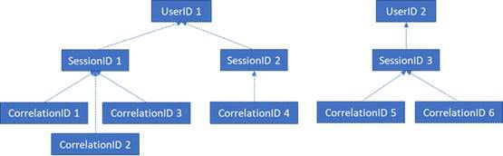

# 適用於 Office Web Apps Server 和 Office Online Server 的 GDPRGDPR for Office Web Apps Server and Office Online Server

Office Online Server 和 Office Web Apps Server 遙測資料是以 ULS 記錄的形式儲存。您可以使用 [ULS 檢視器](https://www.microsoft.com/en-us/download/details.aspx?id=44020)，從您的內部部署租用戶檢視 ULS 記錄。Office Online Server and Office Web Apps Server telemetry data is stored in the form of ULS logs. You can use [ULS Viewer](https://www.microsoft.com/en-us/download/details.aspx?id=44020) to view ULS logs from your on-premises tenant.

每個記錄行包含 CorrelationID。相關的記錄行會共用相同的 CorrelationID。每個 CorrelationID 繫結至單一 SessionID，而一個 SessionID 可能與許多 CorrelationID 相關。每個 SessionID 可能與單一 UserID 相關，某些工作階段是匿名的，因此沒有相關聯的 UserID。為了判斷哪些資料與特定使用者相關聯，會從單一 UserID 對應至與該使用者相關聯的 SessionID、從這些 SessionID 對應至相關聯的 CorrelationID，然後從這些 CorrelationID 對應至這些相互關聯中的所有記錄。請參閱下圖以了解不同識別碼之間的關係。Every log line contains a CorrelationID. Related log lines share the same CorrelationID. Each CorrelationID is tied to a single SessionID, and one SessionID may be related to many CorrelationIDs. Each SessionID may be related to a single UserID, although some sessions can be anonymous and therefore not have an associated UserID. In order to determine what data is associated with a particular user, it is therefore possible to map from a single UserID to the SessionIDs associated with that user, from those SessionIDs to the associated CorrelationIDs, and from those CorrelationIDs to all the logs in those correlations. See the below diagram for the relationship between the different IDs.

## 收集記錄Gathering Logs

舉例來說，若要收集與 UserID 1 相關聯的所有記錄，第一個步驟是收集與 UserID 1 相關聯的所有工作階段 (也就是 SessionID 1 和 SessionID2)。下一步是收集與 SessionID 1 相關聯的所有相互關聯 (也就是 CorrelationIDs 1、2 和 3) 以及與 SessionID 2 相關聯的所有相互關聯 (也就是 CorrelationID 4)。最後，收集與清單中的每個相互關聯相關聯的所有記錄。In order to gather all logs associated with UserID 1, for example, the first step would be to gather all sessions associated with UserID 1 (i.e. SessionID 1 and SessionID2). The next step would be to gather all correlations associated with SessionID 1 (i.e. CorrelationIDs 1, 2, and 3) and with SessionID 2 (i.e. CorrelationID 4). Finally, gather all logs associated with each of the correlations in the list.

1.  啟動 UlsViewerLaunch UlsViewer

2.  開啟對應至預期時間範圍的 ULS 記錄；ULS 記錄儲存在 %PROGRAMDATA%\\Microsoft\\OfficeWebApps\\Data\\Logs\\ULSOpen up the uls log corresponding to the intended timeframe; ULS logs are stored in %PROGRAMDATA%\\Microsoft\\OfficeWebApps\\Data\\Logs\\ULS

3.  編輯 | 修改篩選Edit | Modify Filter

4.  套用以下篩選：Apply a filter that is:

    -   EventID 等於 apr3y 或EventID equals apr3y Or

    -   EventID 等於 bp2d6EventID equals bp2d6

5.  雜湊的 UserIds 會在其中一個事件的 Message 中Hashed UserIds will be in the Message of either one of these two events

6.  針對 apr3y，Message 會包含 UserID 值和 PUID 值For apr3y, the Message will contain a UserID value and a PUID value

7.  針對 bp2d6，Message 會包含一些資訊。LoggableUserId 值欄位是雜湊的 UserID。For bp2d6, the Message will contain quite a bit of information. The LoggableUserId Value field is the hashed UserID.

8.  一旦從其中一個標記取得雜湊的 UserId，該資料列的 WacSessionId 值在 ULSViewer 中會包含與該使用者相關聯的 WacSessionIdOnce the hashed UserId is obtained from either of these two tags, the WacSessionId value of that row in ULSViewer will contain the WacSessionId associated with that user

9.  收集與有問題的使用者相關聯的所有 WacSessionId 值Collect all of the WacSessionId values associated with the user in question

10. 針對清單中的第一個 WacSessionId，以所有 EventId 等於 "xmnv"、Message 等於 "UserSessionId=\<WacSessionId\>" 進行篩選 (使用您的 WacSessionId 取代篩選的 \<WacSessionId\> 部分)Filter for all EventId equals "xmnv", Message equals "UserSessionId=\<WacSessionId\>" for the first WacSessionId in the list (replacing the \<WacSessionId\> part of the filter with your WacSessionId)

11. 收集與該 WacSessionId 相符的所有 Correlation 值Collect all values of Correlation that match that WacSessionId

12. 為有問題的使用者針對清單中 WacSessionId 的所有值，重複步驟 10-11Repeat steps 10-11 for all values of WacSessionId in your list for the user in question

13. 針對所有 Correlation 等於您的清單中第一個 Correlation 進行篩選Filter for all Correlation equals the first Correlation in your list

14. 收集符合該 Correlation 的所有記錄Collect all logs matching that Correlation

15. 為有問題的使用者針對清單中 Correlation 的所有值，重複步驟 13-14Repeat steps 13-14 for all values of Correlation in your list for the user in question

## 資料類型Types of Data

Office Online 記錄包含各種不同類型的資料。以下是 ULS 記錄可能包含的資料範例：Office Online logs contain a variety of different types of data. The following are examples of the data that ULS logs may contain:

-   使用產品時發生的問題的錯誤碼Error codes for issues encountered during use of the product

-   按一下按鈕和與應用程式使用方式相關的其他資料片段Button clicks and other pieces of data about app usage

-   應用程式及/或應用程式內特定功能的效能資料Performance data about the app and/or particular features within the app

-   使用者電腦所在的一般位置資訊 (例如，從 IP 位址衍生的國家/區域、州和城市)，而不是準確的地理位置General location information about where the user’s computer is (e.g. country / region, state, and city, derived from the IP address), but not precise geolocation

-   瀏覽器的相關基本中繼資料，例如，瀏覽器名稱和版本，以及電腦，例如，作業系統類型和版本Basic metadata about the browser, e.g. browser name and version, and the computer, e.g. OS type and version

-   來自文件主機的錯誤訊息 (例如，OneDrive、SharePoint、Exchange)Error messages from the document host (e.g. OneDrive, SharePoint, Exchange)

-   應用程式內部程序的相關資訊，與使用者採取的任何動作不相關Information about processes internal to the app, unrelated to any action the user has taken
