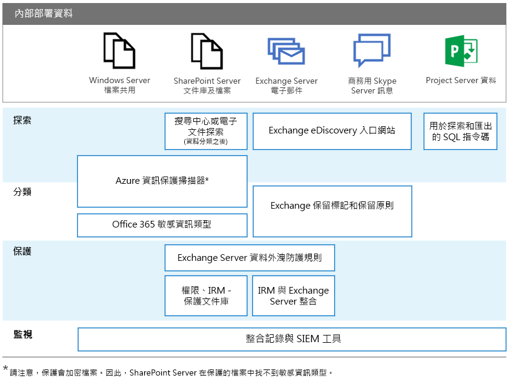

# 適用於內部部署 Office 伺服器的 GDPR

一般資料保護規定 (GDPR) 引進了適用於組織的需求，以保護個人資料並且適當地回應資料主體要求。這一系列的文章提供內部部署工作負載的建議方法：

-   [SharePoint Server](gdpr-for-sharepoint-server.md)

-   [Exchange Server](gdpr-for-exchange-server.md)

-   [商務用 Skype Server](gdpr-for-skype-for-business-server.md)

-   [Project Server](gdpr-for-project-server.md)

-   [Office Web Apps Server 和 Office Online Server](gdpr-for-office-online-server.md)

-   [內部部署檔案共用](gdpr-for-on-premises-file-shares.md)

如需有關 GDPR 以及 Microsoft 可以如何協助您的詳細資訊，請參閱 [Microsoft 信任中心](https://www.microsoft.com/en-us/TrustCenter/Privacy/gdpr/default.aspx)。

在您使用內部部署資料進行任何工作之前，請洽詢您的法務和合規性小組，以尋求指引並且深入了解使用個人資料的現有分類結構描述和方法。Microsoft 在位於 [http://aka.ms/gdprpartners](<http://aka.ms/gdprpartners>) 的「Microsoft GDPR 資料探索工具組」中提供開發和擴充分類結構描述的建議。這個工具組也會說明將內部部署資料移至雲端 (您可以在其中使用更複雜的資料控管功能) 的方法。本節中的這篇文章提供對於要保留在內部部署的資料的建議。

下圖列出在各個工作負載中使用的建議功能，以探索、分類、保護及監視個人資料。請參閱本節中的文章以取得詳細資訊。

## 圖例說明

為了便於存取，下表會在圖例中提供相同的範例。

|             |Windows Server 檔案共用|SharePoint Server|Exchange Server|商務用 Skype|Project Server|
|:------------|:-------------------------|:----------------|:--------------|:-----------------|:-------------|
|探索|Azure 資訊保護掃描器*|搜尋中心或 eDiscovery (在資料分類之後)；Azure 資訊保護掃描器*|Exchange eDiscovery 入口網站|Exchange eDiscovery 入口網站|用於探索和匯出的 SQL 指令碼|
|分類|Azure 資訊保護掃描器 *；Office 365 機密資訊類型|Azure 資訊保護掃描器 *；Office 365 機密資訊類型|Exchange 保留標記和保留原則|Exchange 保留標記和保留原則||
|保護||Exchange Server 資料外洩防護規則；權限，文件庫的 IRM 保護|Exchange Server 資料外洩防護規則；與 Exchange Server 的 IRM 整合|||
|監視|整合記錄與 SIEM 工具|整合記錄與 SIEM 工具|整合記錄與 SIEM 工具|整合記錄與 SIEM 工具|整合記錄與 SIEM 工具|

*請注意，保護會加密檔案。因此，SharePoint Server 在保護的檔案中找不到機密資訊類型。
