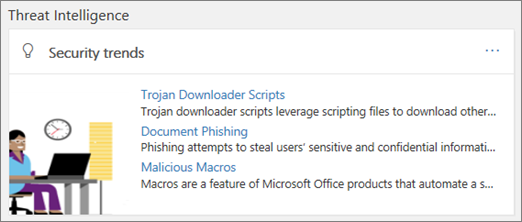

# 開始使用威脅調查和回應 (Office 365 高級威脅防護方案 2)

如果您是組織的安全小組的一部分, 您可以使用 Office 365 威脅調查和回應功能來保護您的使用者免遭攻擊。 Office 365 Advanced 威脅防護方案 2 (先前稱為 Office 365 威脅情報) 可協助安全性分析師和系統管理員, 根據您的 Office 365 環境中發生的情況, 讓使用者安全地冒泡, 並識別動作。 這些真知灼見是根據威脅情報資料與系統的完整存放庫, 以找出與攻擊行為和可疑活動相符的模式。
  
請閱讀本文以深入瞭解威脅調查和回應, 以及如何開始。
  
## Office 365 包含的威脅調查和回應功能是什麼？

威脅調查和回應功能可協助推動 Office 365 安全性&amp;與合規性中心提供的威脅和相關回應動作。 這些真知灼見可協助貴組織的安全小組保護 Office 365 使用者免遭電子郵件或檔案的攻擊。 這些功能可協助監控信號, 並收集多個來源的資料, 例如使用者活動、驗證、電子郵件、已遭破壞的電腦, 以及安全性事件。 商務決策者和 Office 365 全域系統管理員、安全性系統管理員和安全性分析師都可以使用此資訊來瞭解並回應 Office 365 使用者的威脅, 並保護其智慧財產權。

> [!IMPORTANT]
> Office 365 威脅情報現在是 Office 365 的高級威脅防護方案 2, 以及額外的威脅防護功能。 若要深入瞭解, 請參閱[office 365 高級威脅防護方案和價格](https://products.office.com/exchange/advance-threat-protection), 以及[Office 365 高級威脅防護服務說明](https://docs.microsoft.com/office365/servicedescriptions/office-365-advanced-threat-protection-service-description)。
  
## 熟悉威脅儀表板、Explorer 和事件

安全性&amp;合規性中心內的這些威脅調查和回應功能面, 是一組工具和回應工作流程, 包括[威脅儀表板](#threat-dashboard)、[威脅 Explorer](#threat-explorer)、[事件](get-started-with-ti.md#incidents)、[攻擊模擬](attack-simulator.md)和自動調查 & 回應。
  
### 威脅儀表板

使用 [威脅] 儀表板 (也稱為 [安全性][儀表板](security-dashboard.md)), 快速查看已解決的威脅, 並以視覺方式向企業決策者報告 Office 365 服務如何保護您的業務。
  

  
若要查看和使用此儀表板, 請&amp;在安全性與合規性中心, 移至 [**威脅管理** \> ]**儀表板**。
  
### 威脅總管

使用[威脅瀏覽器 (和即時偵測)](threat-explorer.md)來分析威脅、查看一段時間內的攻擊量, 以及依威脅系列、攻擊者基礎結構等等分析資料。 威脅瀏覽器 (也稱為 Explorer) 是任何安全性分析師的調查工作流程的開始位置。
  

  
若要查看和使用此報告, 請在&amp;安全性與合規性中心, 移至 [**威脅管理** \> **瀏覽器**]。
  
 ### 故障

使用事件清單 (這也稱為「調查」) 來查看飛行安全性事件的清單。 事件用來追蹤威脅, 例如可疑的電子郵件訊息, 以及進行進一步的調查和修復。
  

  
若要查看您組織的目前事件清單, &amp;請在安全性與合規性中心, 移至 [**威脅管理** \> **審查** \> **事件**]。
  
![在安全性&amp;與合規性中心中, 選擇\> [威脅管理審查]](media/e0f46454-fa38-40f0-a120-b595614d1d22.png)
  
## 深入瞭解惡意&amp;代碼威脅

作為 Office 365 高級威脅防護方案2選項的一部分, 安全性分析師可以查看已知威脅的詳細資料。 若要判斷是否有額外的預防措施/步驟可讓使用者保持安全, 這是很有用的。
  
 
  
## 如何取得這些威脅調查和回應功能？

Office 365 的威脅 Invesigation 和回應功能包含在 Office 365 高級威脅防護方案2和企業版 E5 中。 

> [!TIP]
> 如果您的組織有 Office 365 訂閱, 但未包含這些威脅調查和回應功能, 您可以使用 Office 365 高級威脅防護, 以附加元件形式購買。 如需規劃選項的詳細資訊, 請參閱[office 365 Platform 服務說明: office &amp; 365 安全性合規性中心](https://docs.microsoft.com/office365/servicedescriptions/office-365-platform-service-description/office-365-securitycompliance-center)和[購買或編輯商務用 Office 365 的附加](https://docs.microsoft.com/office365/admin/subscriptions-and-billing/buy-or-edit-an-add-on)元件。
  
1. 如果是 Office 365 全域系統管理員, 請[https://admin.microsoft.com](https://admin.microsoft.com)移至, 並使用 office 365 的公司或學校帳戶登入。 
    
2. 選擇 [系統**管理** \> **帳單**] 以查看您目前的訂閱所包含的內容。 
    - 如果您看到**office 365 企業版 E5**, 表示您的組織有 Office 365 高級威脅防護方案 2 (包括威脅調查和回應功能)。 
    - 如果您看到不同的訂閱, 例如**Office 365 Enterprise E3**或**Office 365 企業版 E1**, 請考慮新增 Office 365 Advanced 威脅防護方案2。 (若要這麼做, 請選擇 [ **+ 新增訂閱**]。)
    
3. 在 Microsoft 365 系統管理中心, 選擇 [**使用者** \> ] [作用中**使用者**]。
    
5. 將 Office 365 高級威脅防護方案2授權指派給所有作用中的使用者。 (只有擁有這項授權的使用者才會顯示在報表中, 例如 Explorer)。
    
6. 將角色指派給組織中要使用 Office 365 高級威脅防護的人員。 請參閱[授與使用者存取 Office 365 安全性&amp;與規範中心的許可權](grant-access-to-the-security-and-compliance-center.md), 並參照下表: 

  |**若要執行此動作 .。。**   |**您必須擁有其中一個角色**   |  
  |:-----|:-----|
  |使用 [威脅] 儀表板 (或新的[安全性儀表板](security-dashboard.md))  查看最近或目前威脅的相關資訊    |Office 365 全域系統管理員    安全性系統管理員 (在安全性&amp;與合規性中心中指派)    安全性讀取器 (在安全性&amp;與合規性中心中指派)    |
  |使用[威脅瀏覽器 (和即時偵測)](threat-explorer.md)來分析威脅    |Office 365 全域系統管理員    安全性系統管理員 (在安全性&amp;與合規性中心中指派)    安全性讀取器 (在安全性&amp;與合規性中心中指派)    |
  |查看事件 (也稱為調查)   將電子郵件訊息新增至事件    |Office 365 全域系統管理員    安全性系統管理員 (在安全性&amp;與合規性中心中指派)    安全性讀取器 (在安全性&amp;與合規性中心中指派)    |
  |觸發事件中的電子郵件動作    尋找並刪除可疑的電子郵件    |Office 365 全域系統管理員或安全性系統管理員    上述其中一個角色, 以及搜尋和清除 (在安全性&amp;與合規性中心中指派)    |
  |使用 Microsoft Defender ATP 整合 Office 365 高級威脅防護方案2    整合 Office 365 Advanced 威脅防護方案2與 SIEM server    |Office 365 全域系統管理員    安全性系統管理員 (在安全性&amp;與合規性中心中指派)    在其他應用程式中指派適當的角色 (例如 Microsoft Defender Security Center 或 SIEM server)    |
   
如需角色、角色群組及許可權的詳細資訊, 請參閱[Office 365 安全性&amp;與合規性中心的許可權](permissions-in-the-security-and-compliance-center.md)。
    
## 後續步驟

- [瞭解威脅追蹤器-新增和值得注意的](threat-trackers.md)
    
- [尋找並調查已傳遞的惡意電子郵件 (Office 365 威脅調查和回應)](investigate-malicious-email-that-was-delivered.md)
    
- [整合 Office 365 威脅調查, 並使用 Microsoft Defender Advanced 威脅防護進行回應](integrate-office-365-ti-with-wdatp.md)
    
- [深入瞭解攻擊模擬器](attack-simulator.md)
  

