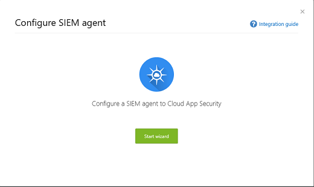

# <a name="integrate-your-siem-server-with-office-365-cloud-app-security"></a>將 SIEM 伺服器與 Office 365 雲端 App 安全性整合
  
|評估 * *\>**|規劃 * *\>**|部署 * *\>**|使用率 * * *|
|:-----|:-----|:-----|:-----|
|[啟動評估](office-365-cas-overview.md) <br/> |[開始規劃](get-ready-for-office-365-cas.md) <br/> |您在此處 ！  <br/> [後續步驟](utilization-activities-for-ocas.md) <br/> |[開始使用](utilization-activities-for-ocas.md) <br/> |
   
## <a name="overview-and-prerequisites"></a>概觀和先決條件

您可以整合[Office 365 雲端應用程式的安全性](get-ready-for-office-365-cas.md)與安全性資訊和事件管理 (SIEM) 伺服器以啟用集中式監視的提醒。這是特別有用的使用雲端服務的組織與內部伺服器應用程式。整合和 SIEM server 可讓您更妥善地保護同時維持自動化特定安全性程序並相互關聯有所助益之間雲端架構的一般安全性的工作流程] 的 [您的 Office 365 應用程式的安全性小組與內部事件。  
  
當您第一次使用 Office 365 雲端應用程式安全性整合 SIEM 伺服器時，從最後一個兩天的通知轉寄給 SIEM 伺服器上，為所有的提醒從加上 then 上 （根據您選取任何篩選器）。此外，如果您停用此功能段，當您再次啟用它，它會轉寄過去兩天的警示，然後所有通知從然後起。

### <a name="siem-integration-architecture"></a>SIEM 整合架構

SIEM 代理程式已設定在貴組織的網路。當部署和設定 SIEM 代理程式會提取所設定的資料類型 （警示） 使用 Office 365 雲端應用程式安全性 RESTful api （英文）。連接埠 443 上加密 HTTPS 通道上再傳送流量。
  
當 SIEM 代理程式會從 Office 365 雲端應用程式安全性擷取資料時，它會 Syslog 郵件傳送至本機 SIEM 伺服器使用 （TCP 或 UDP 以自訂連接埠） 在安裝期間所提供的網路組態。


### <a name="supported-siem-servers"></a>支援的 SIEM 伺服器

Office 365 雲端應用程式安全性目前支援下列 SIEM 伺服器：
- 微焦點討論 ArcSight
- 一般 CEF

### <a name="prerequisites"></a>必要條件

- 您必須是全域管理員或安全性管理員可執行本文所述的工作。請參閱[中的 Office 365 安全性權限&amp;規範中心](permissions-in-the-security-and-compliance-center.md)

- 您必須[啟用 Office 365 雲端應用程式安全性](turn-on-office-365-cas.md)您的組織。

- 必須開啟[稽核記錄](turn-audit-log-search-on-or-off.md)，for Office 365

- 您必須符合下列需求才能設定 SIEM 伺服器整合的標準伺服器：
    - 作業系統： Windows 或 Linux （這可以是在虛擬機器）
    - CPU： 2
    - 磁碟空間： 20 GB
    - RAM： 2 GB
    - 安裝[Oracle Java 8](http://www.oracle.com/technetwork/java/javase/downloads/index.html)
    - 設定[網路需求](https://docs.microsoft.com/cloud-app-security/network-requirements)所述的防火牆

- 您必須具有**遠端 syslog 主機**及**Syslot 連接埠號碼**的詳細資料。網路管理員或安全性管理員應該能夠協助您找出該資訊。 

- 您必須下載[JAR 檔案](https://go.microsoft.com/fwlink/?linkid=838596)需要整合 SIEM server 同意[軟體授權](https://go.microsoft.com/fwlink/?linkid=862491)條款。
 
## <a name="step-1-set-it-up-a-siem-agent-in-office-365-cloud-app-security"></a>步驟 1： 會將它設定 Office 365 雲端應用程式安全性 SIEM 代理程式

1. 移至雲端應用程式安全性入口網站 ([https://portal.cloudappsecurity.com](https://portal.cloudappsecurity.com)) 並登入。
  
2. 按一下 [**設定** \> **安全性延伸模組**，然後選擇 [SIEM 代理程式。<br/>


3. 選擇 [**新增 SIEM 代理程式**。<br/>
    
4. 選擇 [**啟動精靈**]。<br/> 
    
5. 在**一般**步驟中，指定的名稱，然後**選取 [SIEM 格式**並設定任何**進階設定**相關的格式。然後選擇 [**下一步**。<br/>
    
6. 在 [**遠端 Syslog** ] 步驟中指定的 IP 位址或**遠端 syslog 主機**及**Syslog 連接埠號碼**組成的主機名稱。選取 [TCP] 或 [UDP] 做為遠端 Syslog 通訊協定。（您可以使用您的網路管理員或安全性管理員以取得這些詳細資料若您尚未擁有工作）。然後選擇 [**下一步**。<br/>
  
7. 在 [**資料類型**的步驟，執行下列其中一個動作] 和 [**下一步**：
    - 保留預設設定的**所有提醒**<br/>或
    - 按一下 [**所有提醒**、，然後選擇 [**特定篩選器**。定義篩選器以選取您想要 SIEM 伺服器傳送的提醒的類型。<br/>![精靈] 的資料類型步驟](media/ArcSightS1ExportOptions.png)
  
8. 在 [恭喜] 畫面上複製的權杖並將其儲存供日後。<br/> 

> [!IMPORTANT]
> 此時，您已設定好 SIEM 代理程式在 Office 365 雲端應用程式安全性]，但尚未完成 SIEM server 的整合。繼續下一個步驟以繼續 SIEM server 的整合。

按一下 [關閉] 並在安全性延伸模組] 畫面上保留精靈] 之後，您可以看到表格中所新增的 SIEM 代理程式。它要等到更新版本連線就會顯示狀態的**建立日期**。


    
## <a name="step-2-download-a-jar-file-and-run-it-on-your-siem-server"></a>步驟 2： 糖檔案下載並執行 SIEM 伺服器上

1. 下載[Microsoft 雲端應用程式安全性 SIEM 代理程式](https://go.microsoft.com/fwlink/?linkid=838596)並解壓縮資料夾。（您必須同意這些[軟體授權合約](https://go.microsoft.com/fwlink/?linkid=862491)才能繼續執行。） 
    
2. 擷取.jar 檔案、 資料夾及執行 SIEM 伺服器上。
    
3. 在執行後檔案，請在命令提示字元中執行下列： 命令：<br/>
  ```
  java -jar mcas-siemagent-0.87.20-signed.jar [--logsDirectory DIRNAME] [--proxy ADDRESS[:PORT]] --token TOKEN
  ```
### <a name="important-notes"></a>重要附註

- 檔案名稱可能會有所不同根據 SIEM 代理程式的版本。 

- 我們建議您在 server 安裝期間執行 SIEM 伺服器上的糖檔案。

    - **Windows**： 執行為排定的工作，同時務必使用設定至**不論使用者登入與否均執行**工作並清除 [**如果它是執行超過停止的任務**] 選項。

    - **Linux**： 將執行的命令以**&** 至`rc.local`檔案。 <br/>範例：<br/> 
    ```
    java -jar mcas-siemagent-0.87.20-signed.jar [--logsDirectory DIRNAME] [--proxy ADDRESS[:PORT]] --token TOKEN &
    ```

- 在方括參數是選擇性的而且應用於唯有相關。使用下列變數：

    - **DIRNAME**是您想要用於本機代理程式偵錯記錄檔的目錄路徑。

    - **位址 [: 連接埠]** 是 proxy 伺服器位址和連接埠的伺服器用來連線到網際網路。

    - **TOKEN**是您在第一個程序中複製的 SIEM 代理程式權杖。

    - 若要取得說明，請輸入`-h`。 
  
## <a name="step-3-validate-that-the-siem-agent-is-working"></a>步驟 3： 驗證 SIEM 代理程式正常運作

1. 請務必在 Office 365 雲端應用程式安全性入口網站中的 SIEM 代理程式的狀態不會顯示為**連線錯誤**或**已中斷連線**及會有任何代理程式通知。<br/>例如，我們可以看到 SIEM 伺服器所連接：<br/><br/>然後，我們可以看到 SIEM 伺服器中斷連線：<br/> 
  
2. 在您 Syslog/SIEM 的伺服器，請確定您會看到提醒已從 Office 365 雲端應用程式安全性抵達。
  
## <a name="what-the-logfiles-look-like"></a>記錄檔的外觀

以下是可能 SIEM 伺服器傳送的提醒記錄檔範例：

```
2017-07-15T20:42:30.531Z CEF:0|MCAS|SIEM_Agent|0.102.17|ALERT_CABINET_EVENT_MATCH_AUDIT|myPolicy|3|externalId=596a7e360c204203a335a3fb start=1500151350531 end=1500151350531 msg=Activity policy ''myPolicy'' was triggered by ''admin@box-contoso.com'' suser=admin@box-contoso.com destinationServiceName=Box cn1Label=riskScore cn1= cs1Label=portalURL cs1=https://cloud-app-security.com/#/alerts/596a7e360c204203a335a3fb cs2Label=uniqueServiceAppIds cs2=APPID_BOX cs3Label=relatedAudits cs3=1500151288183_acc891bf-33e1-424b-a021-0d4370789660 cs4Label=policyIDs cs4=59f0ab82f797fa0681e9b1c7

2017-07-16T09:36:26.550Z CEF:0|MCAS|SIEM_Agent|0.102.17|ALERT_CABINET_EVENT_MATCH_AUDIT|test-activity-policy|3|externalId=596b339b0c204203a33a51ae start=1500197786550 end=1500197786550 msg=Activity policy ''test-activity-policy'' was triggered by ''user@contoso.com'' suser=user@contoso.com destinationServiceName=Salesforce cn1Label=riskScore cn1= cs1Label=portalURL cs1=https://cloud-app-security.com/#/alerts/596b339b0c204203a33a51ae cs2Label=uniqueServiceAppIds cs2=APPID_SALESFORCE cs3Label=relatedAudits cs3=1500197720691_b7f6317c-b8de-476a-bc8f-dfa570e00349 cs4Label=policyIDs cs4=

2017-07-16T09:17:03.361Z CEF:0|MCAS|SIEM_Agent|0.102.17|ALERT_CABINET_EVENT_MATCH_AUDIT|test-activity-policy3|3|externalId=596b2fd70c204203a33a3eeb start=1500196623361 end=1500196623361 msg=Activity policy ''test-activity-policy3'' was triggered by ''admin@contoso.com'' suser=admin@contoso.com destinationServiceName=Office 365 cn1Label=riskScore cn1= cs1Label=portalURL cs1=https://cloud-app-security.com/#/alerts/596b2fd70c204203a33a3eeb cs2Label=uniqueServiceAppIds cs2=APPID_O365 cs3Label=relatedAudits cs3=1500196549157_a0e01f8a-e29a-43ae-8599-783c1c11597d cs4Label=policyIDs cs4=

2017-07-16T09:17:15.426Z CEF:0|MCAS|SIEM_Agent|0.102.17|ALERT_CABINET_EVENT_MATCH_AUDIT|test-activity-policy|3|externalId=596b2fd70c204203a33a3eec start=1500196635426 end=1500196635426 msg=Activity policy ''test-activity-policy'' was triggered by ''admin@contoso.com'' suser=admin@contoso.com destinationServiceName=Microsoft Office 365 admin center cn1Label=riskScore cn1= cs1Label=portalURL cs1=https://cloud-app-security.com/#/alerts/596b2fd70c204203a33a3eec cs2Label=uniqueServiceAppIds cs2=APPID_O365_PORTAL cs3Label=relatedAudits cs3=1500196557398_3e102b20-d9fa-4f66-b550-8c7a403bb4d8 cs4Label=policyIDs cs4=59f0ab35f797fa9811e9b1c7

2017-07-16T09:17:46.290Z CEF:0|MCAS|SIEM_Agent|0.102.17|ALERT_CABINET_EVENT_MATCH_AUDIT|test-activity-policy4|3|externalId=596b30200c204203a33a4765 start=1500196666290 end=1500196666290 msg=Activity policy ''test-activity-policy4'' was triggered by ''admin@contoso.com'' suser=admin@contoso.com destinationServiceName=Microsoft Exchange Online cn1Label=riskScore cn1= cs1Label=portalURL cs1=https://cloud-app-security.com/#/alerts/596b30200c204203a33a4765 cs2Label=uniqueServiceAppIds cs2=APPID_OUTLOOK cs3Label=relatedAudits cs3=1500196587034_a8673602-7e95-46d6-a1fe-c156c4709c5d cs4Label=policyIDs cs4=

2017-07-16T09:41:04.369Z CEF:0|MCAS|SIEM_Agent|0.102.17|ALERT_CABINET_EVENT_MATCH_AUDIT|test-activity-policy2|3|externalId=596b34b10c204203a33a5240 start=1500198064369 end=1500198064369 msg=Activity policy ''test-activity-policy2'' was triggered by ''user2@test15-adallom.com'' suser=user2@test15-adallom.com destinationServiceName=Google cn1Label=riskScore cn1= cs1Label=portalURL cs1=https://cloud-app-security.com/#/alerts/596b34b10c204203a33a5240 cs2Label=uniqueServiceAppIds cs2=APPID_33626 cs3Label=relatedAudits cs3=1500197996117_fd71f265-1e46-4f04-b372-2e32ec874cd3 cs4Label=policyIDs cs4=
```

而以下是另一個範例中，這次 CEF 格式：


|CEF 欄位名稱  | 描述  |
|---------|---------|
|啟動     | 提醒的時間戳記        |
|結束     | 提醒的時間戳記        |
|rt     | 提醒的時間戳記        |
|msg     | 在 Office 365 雲端應用程式安全性入口網站中所示警示描述        |
|suser     | 警示主體使用者        |
|destinationServiceName     | 提醒源自應用程式，例如 Office 365、 SharePoint、 或 OneDrive        |
|csLabel     | 而異 （標籤有不同的意義）。一般而言，標籤是自我闡明的例如 targetObjects。        |
|cs     | 對應的標籤 （例如如同標籤範例通知之目標使用者） 的資訊        |

## <a name="additional-tasks-as-needed"></a>其他工作 （如需）

您已設定 SIEM 伺服器並已整合與 Office 365 雲端應用程式安全性之後，您可能需要重新產生的語彙基元、 編輯 SIEM 代理程式或刪除 SIEM 代理程式。下列各節說明如何執行這些工作。

### <a name="regenerate-a-token"></a>重新產生的語彙基元

如果您遺失您權杖，您可以重新產生一個。 

1. 在 Office 365 雲端應用程式安全性入口網站 ([https://portal.cloudappsecurity.com](https://portal.cloudappsecurity.com))、 選擇 [**設定** > **安全性延伸模組**。

2. 在表格中，找出 SIEM 代理程式的列。 

3. 按一下省略符號、，然後選擇 [**重新產生的語彙基元**。<br/>
  
### <a name="edit-a-siem-agent"></a>編輯 SIEM 代理程式

1. 在 Office 365 雲端應用程式安全性入口網站 ([https://portal.cloudappsecurity.com](https://portal.cloudappsecurity.com))、 選擇 [**設定** > **安全性延伸模組**。

2. 找到 SIEM 代理程式的列。 

3. 按一下省略符號、，然後選擇 [**編輯**。（如果您編輯 SIEM 代理程式，您不需要重新執行.jar 檔案 ； 它會自動更新）。<br/>
  
### <a name="delete-a-siem-agent"></a>刪除 SIEM 代理程式

1. 在 Office 365 雲端應用程式安全性入口網站 ([https://portal.cloudappsecurity.com](https://portal.cloudappsecurity.com))、 選擇 [**設定** > **安全性延伸模組**。

2. 找到 SIEM 代理程式的列。 

3. 按一下省略符號、，然後選擇 [**刪除**。<br/>![若要刪除的 SIEM 代理程式，並選擇 [省略符號，然後選擇 [刪除]。](media/540b5bdf-5574-4ecc-a7b0-92a499a387d7.png)

  
## <a name="next-steps"></a>後續步驟

- [推出 Office 365 雲端 App 安全性後的使用活動](utilization-activities-for-ocas.md)
    
- [檢閱並採取行動提醒](review-office-365-cas-alerts.md)
    
- [群組簡化管理 IP 位址](group-your-ip-addresses-in-ocas.md)
    

