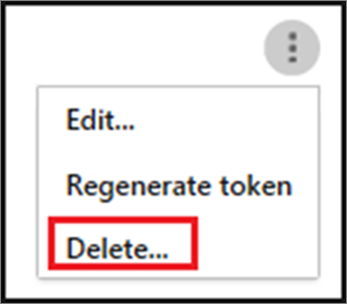

# <a name="integrate-your-siem-server-with-office-365-cloud-app-security"></a><span data-ttu-id="2772b-104">將 SIEM 伺服器與 Office 365 雲端 App 安全性整合</span><span class="sxs-lookup"><span data-stu-id="2772b-104">Integrate your SIEM server with Office 365 Cloud App Security</span></span>
  
|<span data-ttu-id="2772b-105">評估 \* *\>*\*</span><span class="sxs-lookup"><span data-stu-id="2772b-105">\*\*\*\*Evaluation\*\* \>\*\*</span></span>|<span data-ttu-id="2772b-106">規劃 \* *\>*\*</span><span class="sxs-lookup"><span data-stu-id="2772b-106">\*\*\*\*Planning\*\* \>\*\*</span></span>|<span data-ttu-id="2772b-107">部署 \* *\>*\*</span><span class="sxs-lookup"><span data-stu-id="2772b-107">\*\*\*\*Deployment\*\* \>\*\*</span></span>|<span data-ttu-id="2772b-108">使用率 \* \* \*</span><span class="sxs-lookup"><span data-stu-id="2772b-108">\*\*\*\*Utilization\*\*\*\*</span></span>|
|:-----|:-----|:-----|:-----|
|[<span data-ttu-id="2772b-109">啟動評估</span><span class="sxs-lookup"><span data-stu-id="2772b-109">Start evaluating</span></span>](office-365-cas-overview.md) <br/> |[<span data-ttu-id="2772b-110">開始規劃</span><span class="sxs-lookup"><span data-stu-id="2772b-110">Start planning</span></span>](get-ready-for-office-365-cas.md) <br/> |<span data-ttu-id="2772b-111">您在此處 ！</span><span class="sxs-lookup"><span data-stu-id="2772b-111">You are here!</span></span>  <br/> [<span data-ttu-id="2772b-112">下一步</span><span class="sxs-lookup"><span data-stu-id="2772b-112">Next step</span></span>](utilization-activities-for-ocas.md) <br/> |[<span data-ttu-id="2772b-113">開始使用</span><span class="sxs-lookup"><span data-stu-id="2772b-113">Start utilizing</span></span>](utilization-activities-for-ocas.md) <br/> |
   
## <a name="overview-and-prerequisites"></a><span data-ttu-id="2772b-114">概觀與必要條件</span><span class="sxs-lookup"><span data-stu-id="2772b-114">Overview and prerequisites</span></span>

<span data-ttu-id="2772b-115">您可以將[Office 365 雲端 App 安全性](get-ready-for-office-365-cas.md)整合與您的安全性資訊和事件管理 (SIEM) 伺服器，以啟用集中式監視的提醒。</span><span class="sxs-lookup"><span data-stu-id="2772b-115">You can integrate [Office 365 Cloud App Security](get-ready-for-office-365-cas.md) with your security information and event management (SIEM) server to enable centralized monitoring of alerts.</span></span> <span data-ttu-id="2772b-116">這是特別有用的組織使用雲端服務，而且在內部伺服器應用程式。</span><span class="sxs-lookup"><span data-stu-id="2772b-116">This is especially beneficial for organizations who are using cloud services and on-premises server applications.</span></span> <span data-ttu-id="2772b-117">您可以將整合到 SIEM 伺服器從 Office 365 雲端 App 安全性提取警示和活動 SIEM 伺服器。</span><span class="sxs-lookup"><span data-stu-id="2772b-117">You can integrate your SIEM server to pull alerts and activities from Office 365 Cloud App Security into your SIEM server.</span></span> <span data-ttu-id="2772b-118">與 SIEM 伺服器整合可讓您更妥善地保護您的 Office 365 應用程式同時維護您的一般安全性工作流程，自動化特定安全性程序和雲端式之間相互關聯的安全性小組與內部事件。</span><span class="sxs-lookup"><span data-stu-id="2772b-118">Integrating with a SIEM server allows your security team to better protect your Office 365 applications while maintaining your usual security workflow, by automating certain security procedures and correlating between cloud-based and on-premises events.</span></span>  
  
<span data-ttu-id="2772b-119">當您第一次將 SIEM 伺服器整合與 Office 365 雲端 App 安全性時，從過去兩天的提醒轉寄給 SIEM 伺服器上，為所有警示從 then 上 （根據您選取任何篩選條件）。</span><span class="sxs-lookup"><span data-stu-id="2772b-119">When you first integrate your SIEM server with Office 365 Cloud App Security, alerts from the last two days are forwarded to the SIEM server, as well as all alerts from then on (based on any filters you select).</span></span> <span data-ttu-id="2772b-120">此外，如果您停用此功能一段，當您重新啟用，它會將轉寄過去兩天的提醒，然後所有警示從然後起。</span><span class="sxs-lookup"><span data-stu-id="2772b-120">Additionally, if you disable this feature for an extended period, when you enable it again, it will forward the past two days of alerts and then all alerts from then on.</span></span>

### <a name="siem-integration-architecture"></a><span data-ttu-id="2772b-121">SIEM 整合架構</span><span class="sxs-lookup"><span data-stu-id="2772b-121">SIEM integration architecture</span></span>

<span data-ttu-id="2772b-122">SIEM 代理程式是設定在貴組織的網路。</span><span class="sxs-lookup"><span data-stu-id="2772b-122">A SIEM agent is set up in your organization's network.</span></span> <span data-ttu-id="2772b-123">SIEM 代理程式時部署和設定，提取所設定的資料類型 （警示） 使用 Office 365 雲端 App 安全性 RESTful Api。</span><span class="sxs-lookup"><span data-stu-id="2772b-123">When deployed and configured, the SIEM agent pulls the data types that were configured (alerts) using Office 365 Cloud App Security RESTful APIs.</span></span> <span data-ttu-id="2772b-124">透過連接埠 443 上的加密 HTTPS 通道然後傳送流量。</span><span class="sxs-lookup"><span data-stu-id="2772b-124">The traffic is then sent over an encrypted HTTPS channel on port 443.</span></span>
  
<span data-ttu-id="2772b-125">當 SIEM 代理程式會擷取資料，從 Office 365 雲端 App 安全性時，它會將 Syslog 郵件傳送至本機 SIEM 伺服器使用 （TCP 或 UDP 與自訂連接埠） 的安裝期間所提供的網路組態中。</span><span class="sxs-lookup"><span data-stu-id="2772b-125">When a SIEM agent retrieves data from Office 365 Cloud App Security, it sends the Syslog messages to your local SIEM server using the network configurations that are provided during setup (TCP or UDP with a custom port).</span></span>


### <a name="supported-siem-servers"></a><span data-ttu-id="2772b-127">支援的 SIEM 伺服器</span><span class="sxs-lookup"><span data-stu-id="2772b-127">Supported SIEM servers</span></span>

<span data-ttu-id="2772b-128">Office 365 雲端 App 安全性目前支援下列的 SIEM 伺服器：</span><span class="sxs-lookup"><span data-stu-id="2772b-128">Office 365 Cloud App Security currently supports the following SIEM servers:</span></span>
- <span data-ttu-id="2772b-129">微焦點討論 ArcSight</span><span class="sxs-lookup"><span data-stu-id="2772b-129">Micro Focus ArcSight</span></span>
- <span data-ttu-id="2772b-130">一般 CEF</span><span class="sxs-lookup"><span data-stu-id="2772b-130">Generic CEF</span></span>

### <a name="prerequisites"></a><span data-ttu-id="2772b-131">必要條件</span><span class="sxs-lookup"><span data-stu-id="2772b-131">Prerequisites</span></span>

- <span data-ttu-id="2772b-132">您必須是全域系統管理員或安全性系統管理員可執行本文所述的工作。</span><span class="sxs-lookup"><span data-stu-id="2772b-132">You must be a global administrator or security administrator to perform the tasks described in this article.</span></span> <span data-ttu-id="2772b-133">請參閱[中的 Office 365 安全性權限&amp;合規性中心](permissions-in-the-security-and-compliance-center.md)</span><span class="sxs-lookup"><span data-stu-id="2772b-133">See [Permissions in the Office 365 Security &amp; Compliance Center](permissions-in-the-security-and-compliance-center.md)</span></span>

- <span data-ttu-id="2772b-134">您必須擁有[Office 365 雲端 App 安全性啟用](turn-on-office-365-cas.md)您的組織。</span><span class="sxs-lookup"><span data-stu-id="2772b-134">You must have [Office 365 Cloud App Security enabled](turn-on-office-365-cas.md) for your organization.</span></span>

- <span data-ttu-id="2772b-135">必須開啟[稽核記錄](turn-audit-log-search-on-or-off.md)，Office 365</span><span class="sxs-lookup"><span data-stu-id="2772b-135">[Audit logging](turn-audit-log-search-on-or-off.md) must be turned on for Office 365</span></span>

- <span data-ttu-id="2772b-136">您必須符合下列需求才能設定 SIEM 伺服器整合的標準伺服器：</span><span class="sxs-lookup"><span data-stu-id="2772b-136">You must have a standard server that meets the following requirements in order to configure SIEM server integration:</span></span>
    - <span data-ttu-id="2772b-137">作業系統： Windows 或 Linux （這可以是虛擬機器）</span><span class="sxs-lookup"><span data-stu-id="2772b-137">OS: Windows or Linux (this can be a virtual machine)</span></span>
    - <span data-ttu-id="2772b-138">CPU: 2</span><span class="sxs-lookup"><span data-stu-id="2772b-138">CPU: 2</span></span>
    - <span data-ttu-id="2772b-139">磁碟空間： 20 GB</span><span class="sxs-lookup"><span data-stu-id="2772b-139">Disk space: 20 GB</span></span>
    - <span data-ttu-id="2772b-140">RAM: 2 GB</span><span class="sxs-lookup"><span data-stu-id="2772b-140">RAM: 2 GB</span></span>
    - <span data-ttu-id="2772b-141">安裝[Oracle Java 8](http://www.oracle.com/technetwork/java/javase/downloads/index.html)</span><span class="sxs-lookup"><span data-stu-id="2772b-141">[Oracle Java 8](http://www.oracle.com/technetwork/java/javase/downloads/index.html) installed</span></span>
    - <span data-ttu-id="2772b-142">設定[網路需求](https://docs.microsoft.com/cloud-app-security/network-requirements)所述的防火牆</span><span class="sxs-lookup"><span data-stu-id="2772b-142">Firewall configured as described in [Network requirements](https://docs.microsoft.com/cloud-app-security/network-requirements)</span></span>

- <span data-ttu-id="2772b-143">您必須具有 「**遠端 syslog 主機**」 和 「 **Syslot 連接埠號碼**的相關詳細資料。</span><span class="sxs-lookup"><span data-stu-id="2772b-143">You must have details about your **Remote syslog host** and **Syslot port number**.</span></span> <span data-ttu-id="2772b-144">網路系統管理員或安全性系統管理員應該能夠協助您找出該資訊。</span><span class="sxs-lookup"><span data-stu-id="2772b-144">A network administrator or security administrator should be able to help you locate that information.</span></span> 

- <span data-ttu-id="2772b-145">若要下載[JAR 檔案](https://go.microsoft.com/fwlink/?linkid=838596)需要整合 SIEM 伺服器，您必須同意[軟體授權](https://go.microsoft.com/fwlink/?linkid=862491)條款。</span><span class="sxs-lookup"><span data-stu-id="2772b-145">You must agree to [software license terms](https://go.microsoft.com/fwlink/?linkid=862491) to download the [JAR file](https://go.microsoft.com/fwlink/?linkid=838596) you'll need to integrate your SIEM server.</span></span>
 
## <a name="step-1-set-it-up-a-siem-agent-in-office-365-cloud-app-security"></a><span data-ttu-id="2772b-146">步驟 1： 設定 Office 365 雲端 App 安全性中的 SIEM 代理程式</span><span class="sxs-lookup"><span data-stu-id="2772b-146">Step 1: Set it up a SIEM agent in Office 365 Cloud App Security</span></span>

1. <span data-ttu-id="2772b-147">移至 Cloud App Security 入口網站 ([https://portal.cloudappsecurity.com](https://portal.cloudappsecurity.com))，並登入。</span><span class="sxs-lookup"><span data-stu-id="2772b-147">Go to the Cloud App Security portal ([https://portal.cloudappsecurity.com](https://portal.cloudappsecurity.com)) and sign in.</span></span>
  
2. <span data-ttu-id="2772b-148">按一下 [**設定** \> **安全性延伸模組**]，然後選擇 [SIEM 代理程式。</span><span class="sxs-lookup"><span data-stu-id="2772b-148">Click **Settings** \> **Security extensions**, and then choose SIEM agents.</span></span><br/>
<span data-ttu-id="2772b-149"></span><span class="sxs-lookup"><span data-stu-id="2772b-149"></span></span>

3. <span data-ttu-id="2772b-150">選擇 [**新增 SIEM 代理程式**。</span><span class="sxs-lookup"><span data-stu-id="2772b-150">Choose **Add SIEM agent**.</span></span><br/><span data-ttu-id="2772b-151"></span><span class="sxs-lookup"><span data-stu-id="2772b-151"></span></span>
    
4. <span data-ttu-id="2772b-152">選擇 [**啟動精靈**]。</span><span class="sxs-lookup"><span data-stu-id="2772b-152">Choose **Start wizard**.</span></span><br/><span data-ttu-id="2772b-153"></span><span class="sxs-lookup"><span data-stu-id="2772b-153"></span></span> 
    
5. <span data-ttu-id="2772b-154">在**一般**步驟中，指定名稱，然後**選取 [SIEM 格式**並設定任何**進階設定]** 相關的格式。</span><span class="sxs-lookup"><span data-stu-id="2772b-154">In the **General** step, specify a name, and **Select your SIEM format** and set any **Advanced settings** that are relevant to that format.</span></span> <span data-ttu-id="2772b-155">然後選擇 [**下一步**。</span><span class="sxs-lookup"><span data-stu-id="2772b-155">Then choose **Next**.</span></span><br/><span data-ttu-id="2772b-156"></span><span class="sxs-lookup"><span data-stu-id="2772b-156"></span></span>
    
6. <span data-ttu-id="2772b-157">在 [**遠端 Syslog** ] 步驟中，指定 IP 位址] 或 [**遠端 syslog 主機**」 和 「 **Syslog 連接埠號碼**的主機名稱。</span><span class="sxs-lookup"><span data-stu-id="2772b-157">In the **Remote Syslog** step, specify the IP address or hostname of the **Remote syslog host** and the **Syslog port number**.</span></span> <span data-ttu-id="2772b-158">為遠端 Syslog 通訊協定，選取 [TCP] 或 [UDP。</span><span class="sxs-lookup"><span data-stu-id="2772b-158">Select TCP or UDP as the Remote Syslog protocol.</span></span> <span data-ttu-id="2772b-159">（您可以使用您的網路系統管理員或安全性系統管理員以取得這些詳細資料，如果您未安裝它們。）然後選擇 [**下一步**。</span><span class="sxs-lookup"><span data-stu-id="2772b-159">(You can work with your network administrator or security administrator to get these details if you don't have them.) Then choose **Next**.</span></span><br/><span data-ttu-id="2772b-160"></span><span class="sxs-lookup"><span data-stu-id="2772b-160"></span></span>
  
7. <span data-ttu-id="2772b-161">在 [**資料類型**] 步驟中，執行下列其中一項，然後按一下 [**下一步**：</span><span class="sxs-lookup"><span data-stu-id="2772b-161">In the **Data Types** step, do one of the following, and then click **Next**:</span></span>
    - <span data-ttu-id="2772b-162">保留預設設定的**所有提醒**</span><span class="sxs-lookup"><span data-stu-id="2772b-162">Keep the default setting of **All Alerts**</span></span><br/><span data-ttu-id="2772b-163">或</span><span class="sxs-lookup"><span data-stu-id="2772b-163">OR</span></span>
    - <span data-ttu-id="2772b-164">按一下 [**所有警示**，，，然後選擇**特定篩選器**。</span><span class="sxs-lookup"><span data-stu-id="2772b-164">Click **All alerts**, and then choose **Specific filters**.</span></span> <span data-ttu-id="2772b-165">定義篩選器以選取您想要傳送給 SIEM 伺服器的提醒的類型。</span><span class="sxs-lookup"><span data-stu-id="2772b-165">Define filters to select the kinds of alerts you want to send to your SIEM server.</span></span>
<br/><span data-ttu-id="2772b-166"></span><span class="sxs-lookup"><span data-stu-id="2772b-166"></span></span>
  
8. <span data-ttu-id="2772b-167">在 [恭喜] 畫面中，將複製的權杖，並將其儲存供之後參考。</span><span class="sxs-lookup"><span data-stu-id="2772b-167">On the Congratulations screen, copy the token and save it for later.</span></span><br/> 

> [!IMPORTANT]
> <span data-ttu-id="2772b-169">此時，您已設定好 Office 365 雲端 App 安全性中的 SIEM 代理程式，但尚未完成您 SIEM 伺服器整合。</span><span class="sxs-lookup"><span data-stu-id="2772b-169">At this point, you have set up a SIEM agent in Office 365 Cloud App Security, but your SIEM server integration is not yet finished.</span></span> <span data-ttu-id="2772b-170">請繼續下一個步驟以繼續執行您 SIEM 伺服器整合。</span><span class="sxs-lookup"><span data-stu-id="2772b-170">Proceed to the next step to continue your SIEM server integration.</span></span>

<span data-ttu-id="2772b-171">按一下 [關閉]，並保留精靈中，在 [安全性 extensions 畫面上之後，您可以看到您在資料表中新增的 SIEM 代理程式。</span><span class="sxs-lookup"><span data-stu-id="2772b-171">After you click Close and leave the wizard, on the Security extensions screen, you can see the SIEM agent you added in the table.</span></span> <span data-ttu-id="2772b-172">它會顯示**建立**] 狀態，直到它稍後連線。</span><span class="sxs-lookup"><span data-stu-id="2772b-172">It will show a status of **Created** until it's connected later.</span></span>


    
## <a name="step-2-download-a-jar-file-and-run-it-on-your-siem-server"></a><span data-ttu-id="2772b-174">步驟 2： 下載糖檔案，並在 SIEM 伺服器上執行</span><span class="sxs-lookup"><span data-stu-id="2772b-174">Step 2: Download a JAR file and run it on your SIEM server</span></span>

1. <span data-ttu-id="2772b-175">下載[Microsoft 雲端 App 安全性 SIEM 代理程式](https://go.microsoft.com/fwlink/?linkid=838596)，並將解壓縮的資料夾。</span><span class="sxs-lookup"><span data-stu-id="2772b-175">Download the [Microsoft Cloud App Security SIEM Agent](https://go.microsoft.com/fwlink/?linkid=838596) and unzip the folder.</span></span> <span data-ttu-id="2772b-176">（您必須同意[軟體授權合約](https://go.microsoft.com/fwlink/?linkid=862491)才能繼續執行。）</span><span class="sxs-lookup"><span data-stu-id="2772b-176">(You must agree to [software license terms](https://go.microsoft.com/fwlink/?linkid=862491) in order to proceed.)</span></span> 
    
2. <span data-ttu-id="2772b-177">.Jar 檔案解壓縮 zip 的資料夾，並在 SIEM 伺服器上執行它。</span><span class="sxs-lookup"><span data-stu-id="2772b-177">Extract the .jar file from the zipped folder and run it on your SIEM server.</span></span>
    
3. <span data-ttu-id="2772b-178">之後執行檔案，請執行下列命令： 命令：</span><span class="sxs-lookup"><span data-stu-id="2772b-178">After running the file, run the following: command:</span></span><br/>
  ```
  java -jar mcas-siemagent-0.87.20-signed.jar [--logsDirectory DIRNAME] [--proxy ADDRESS[:PORT]] --token TOKEN
  ```
### <a name="important-notes"></a><span data-ttu-id="2772b-179">重要注意事項</span><span class="sxs-lookup"><span data-stu-id="2772b-179">Important notes</span></span>

- <span data-ttu-id="2772b-180">檔案名稱可能有所不同 SIEM 代理程式的版本。</span><span class="sxs-lookup"><span data-stu-id="2772b-180">The file name may differ depending on the version of the SIEM agent.</span></span> 

- <span data-ttu-id="2772b-181">我們建議您在伺服器安裝期間執行 SIEM 伺服器上的糖檔案。</span><span class="sxs-lookup"><span data-stu-id="2772b-181">We recommend that you run the JAR file on your SIEM server during server setup.</span></span>

    - <span data-ttu-id="2772b-182">**Windows**： 執行當做排程工作，並確認其設定**不論使用者登入與否均執行**工作，並清除**停止工作，只有在執行時間超過**] 選項。</span><span class="sxs-lookup"><span data-stu-id="2772b-182">**Windows**: Run as a scheduled task, making sure to configure the task to **Run whether the user is logged on or not** and clear the **Stop the task if it runs longer than** option.</span></span>

    - <span data-ttu-id="2772b-183">**Linux**： 新增執行的命令**&** 至`rc.local`檔案。</span><span class="sxs-lookup"><span data-stu-id="2772b-183">**Linux**: Add the run command with an **&** to the `rc.local` file.</span></span> <br/><span data-ttu-id="2772b-184">範例：</span><span class="sxs-lookup"><span data-stu-id="2772b-184">Example:</span></span><br/> 
    ```
    java -jar mcas-siemagent-0.87.20-signed.jar [--logsDirectory DIRNAME] [--proxy ADDRESS[:PORT]] --token TOKEN &
    ```

- <span data-ttu-id="2772b-185">參數在方括是選擇性的而且只有相關應該使用。</span><span class="sxs-lookup"><span data-stu-id="2772b-185">Parameters in brackets [] are optional, and should be used only if relevant.</span></span> <span data-ttu-id="2772b-186">使用下列變數：</span><span class="sxs-lookup"><span data-stu-id="2772b-186">Use the following variables:</span></span>

    - <span data-ttu-id="2772b-187">**DIRNAME**是您想要用於本機代理程式偵錯記錄檔之目錄的路徑。</span><span class="sxs-lookup"><span data-stu-id="2772b-187">**DIRNAME** is the path to the directory you want to use for local agent debug logs.</span></span>

    - <span data-ttu-id="2772b-188">**地址 [: 連接埠]** 是伺服器用來連線到網際網路的連接埠與 proxy 伺服器位址。</span><span class="sxs-lookup"><span data-stu-id="2772b-188">**ADDRESS[:PORT]** is the proxy server address and port that the server uses to connect to the Internet.</span></span>

    - <span data-ttu-id="2772b-189">**語彙基元**是您在第一個程序中複製的 SIEM 代理程式語彙基元。</span><span class="sxs-lookup"><span data-stu-id="2772b-189">**TOKEN** is the SIEM agent token you copied in the first procedure.</span></span>

    - <span data-ttu-id="2772b-190">若要取得協助，請輸入`-h`。</span><span class="sxs-lookup"><span data-stu-id="2772b-190">To get help, type `-h`.</span></span> 
  
## <a name="step-3-validate-that-the-siem-agent-is-working"></a><span data-ttu-id="2772b-191">步驟 3： 驗證 SIEM 代理程式正常運作</span><span class="sxs-lookup"><span data-stu-id="2772b-191">Step 3: Validate that the SIEM agent is working</span></span>

1. <span data-ttu-id="2772b-192">請確定 SIEM 代理程式在 Office 365 雲端 App 安全性入口網站中的狀態不會顯示為**連線錯誤**或**中斷連線**，而且有無代理程式的通知。</span><span class="sxs-lookup"><span data-stu-id="2772b-192">Make sure the status of the SIEM agent in the Office 365 Cloud App Security portal is not displayed as **Connection error** or **Disconnected** and that there are no agent notifications.</span></span><br/><span data-ttu-id="2772b-193">例如，我們可以看到 SIEM 伺服器連線：</span><span class="sxs-lookup"><span data-stu-id="2772b-193">For example, here we can see the SIEM server is connected:</span></span><br/><span data-ttu-id="2772b-194"></span><span class="sxs-lookup"><span data-stu-id="2772b-194"></span></span><br/><span data-ttu-id="2772b-195">然後，在這裡，我們可以看到 SIEM 伺服器已中斷連線：</span><span class="sxs-lookup"><span data-stu-id="2772b-195">And here, we can see the SIEM server is disconnected:</span></span><br/><span data-ttu-id="2772b-196"></span><span class="sxs-lookup"><span data-stu-id="2772b-196"></span></span> 
  
2. <span data-ttu-id="2772b-197">在 Syslog/SIEM 伺服器，請確定您看到提醒已從 Office 365 雲端 App 安全性抵達。</span><span class="sxs-lookup"><span data-stu-id="2772b-197">In your Syslog/SIEM server, make sure you see that alerts have arrived from Office 365 Cloud App Security.</span></span>
  
## <a name="what-the-logfiles-look-like"></a><span data-ttu-id="2772b-198">記錄檔的外觀</span><span class="sxs-lookup"><span data-stu-id="2772b-198">What the logfiles look like</span></span>

<span data-ttu-id="2772b-199">以下是可能會傳送至 SIEM 伺服器提醒的記錄檔範例：</span><span class="sxs-lookup"><span data-stu-id="2772b-199">Here's an alerts logfile example that might be sent to a SIEM server:</span></span>

```
2017-07-15T20:42:30.531Z CEF:0|MCAS|SIEM_Agent|0.102.17|ALERT_CABINET_EVENT_MATCH_AUDIT|myPolicy|3|externalId=596a7e360c204203a335a3fb start=1500151350531 end=1500151350531 msg=Activity policy ''myPolicy'' was triggered by ''admin@box-contoso.com'' suser=admin@box-contoso.com destinationServiceName=Box cn1Label=riskScore cn1= cs1Label=portalURL cs1=https://cloud-app-security.com/#/alerts/596a7e360c204203a335a3fb cs2Label=uniqueServiceAppIds cs2=APPID_BOX cs3Label=relatedAudits cs3=1500151288183_acc891bf-33e1-424b-a021-0d4370789660 cs4Label=policyIDs cs4=59f0ab82f797fa0681e9b1c7

2017-07-16T09:36:26.550Z CEF:0|MCAS|SIEM_Agent|0.102.17|ALERT_CABINET_EVENT_MATCH_AUDIT|test-activity-policy|3|externalId=596b339b0c204203a33a51ae start=1500197786550 end=1500197786550 msg=Activity policy ''test-activity-policy'' was triggered by ''user@contoso.com'' suser=user@contoso.com destinationServiceName=Salesforce cn1Label=riskScore cn1= cs1Label=portalURL cs1=https://cloud-app-security.com/#/alerts/596b339b0c204203a33a51ae cs2Label=uniqueServiceAppIds cs2=APPID_SALESFORCE cs3Label=relatedAudits cs3=1500197720691_b7f6317c-b8de-476a-bc8f-dfa570e00349 cs4Label=policyIDs cs4=

2017-07-16T09:17:03.361Z CEF:0|MCAS|SIEM_Agent|0.102.17|ALERT_CABINET_EVENT_MATCH_AUDIT|test-activity-policy3|3|externalId=596b2fd70c204203a33a3eeb start=1500196623361 end=1500196623361 msg=Activity policy ''test-activity-policy3'' was triggered by ''admin@contoso.com'' suser=admin@contoso.com destinationServiceName=Office 365 cn1Label=riskScore cn1= cs1Label=portalURL cs1=https://cloud-app-security.com/#/alerts/596b2fd70c204203a33a3eeb cs2Label=uniqueServiceAppIds cs2=APPID_O365 cs3Label=relatedAudits cs3=1500196549157_a0e01f8a-e29a-43ae-8599-783c1c11597d cs4Label=policyIDs cs4=

2017-07-16T09:17:15.426Z CEF:0|MCAS|SIEM_Agent|0.102.17|ALERT_CABINET_EVENT_MATCH_AUDIT|test-activity-policy|3|externalId=596b2fd70c204203a33a3eec start=1500196635426 end=1500196635426 msg=Activity policy ''test-activity-policy'' was triggered by ''admin@contoso.com'' suser=admin@contoso.com destinationServiceName=Microsoft Office 365 admin center cn1Label=riskScore cn1= cs1Label=portalURL cs1=https://cloud-app-security.com/#/alerts/596b2fd70c204203a33a3eec cs2Label=uniqueServiceAppIds cs2=APPID_O365_PORTAL cs3Label=relatedAudits cs3=1500196557398_3e102b20-d9fa-4f66-b550-8c7a403bb4d8 cs4Label=policyIDs cs4=59f0ab35f797fa9811e9b1c7

2017-07-16T09:17:46.290Z CEF:0|MCAS|SIEM_Agent|0.102.17|ALERT_CABINET_EVENT_MATCH_AUDIT|test-activity-policy4|3|externalId=596b30200c204203a33a4765 start=1500196666290 end=1500196666290 msg=Activity policy ''test-activity-policy4'' was triggered by ''admin@contoso.com'' suser=admin@contoso.com destinationServiceName=Microsoft Exchange Online cn1Label=riskScore cn1= cs1Label=portalURL cs1=https://cloud-app-security.com/#/alerts/596b30200c204203a33a4765 cs2Label=uniqueServiceAppIds cs2=APPID_OUTLOOK cs3Label=relatedAudits cs3=1500196587034_a8673602-7e95-46d6-a1fe-c156c4709c5d cs4Label=policyIDs cs4=

2017-07-16T09:41:04.369Z CEF:0|MCAS|SIEM_Agent|0.102.17|ALERT_CABINET_EVENT_MATCH_AUDIT|test-activity-policy2|3|externalId=596b34b10c204203a33a5240 start=1500198064369 end=1500198064369 msg=Activity policy ''test-activity-policy2'' was triggered by ''user2@test15-adallom.com'' suser=user2@test15-adallom.com destinationServiceName=Google cn1Label=riskScore cn1= cs1Label=portalURL cs1=https://cloud-app-security.com/#/alerts/596b34b10c204203a33a5240 cs2Label=uniqueServiceAppIds cs2=APPID_33626 cs3Label=relatedAudits cs3=1500197996117_fd71f265-1e46-4f04-b372-2e32ec874cd3 cs4Label=policyIDs cs4=
```

<span data-ttu-id="2772b-200">而以下是另一個範例中，這次 CEF 格式：</span><span class="sxs-lookup"><span data-stu-id="2772b-200">And here's another sample, this time in CEF format:</span></span>


|<span data-ttu-id="2772b-201">CEF 欄位名稱</span><span class="sxs-lookup"><span data-stu-id="2772b-201">CEF field name</span></span>  | <span data-ttu-id="2772b-202">說明</span><span class="sxs-lookup"><span data-stu-id="2772b-202">Description</span></span>  |
|---------|---------|
|<span data-ttu-id="2772b-203">start</span><span class="sxs-lookup"><span data-stu-id="2772b-203">start</span></span>     | <span data-ttu-id="2772b-204">警示的時間戳記</span><span class="sxs-lookup"><span data-stu-id="2772b-204">alert timestamp</span></span>        |
|<span data-ttu-id="2772b-205">結束</span><span class="sxs-lookup"><span data-stu-id="2772b-205">end</span></span>     | <span data-ttu-id="2772b-206">警示的時間戳記</span><span class="sxs-lookup"><span data-stu-id="2772b-206">alert timestamp</span></span>        |
|<span data-ttu-id="2772b-207">rt</span><span class="sxs-lookup"><span data-stu-id="2772b-207">rt</span></span>     | <span data-ttu-id="2772b-208">警示的時間戳記</span><span class="sxs-lookup"><span data-stu-id="2772b-208">alert timestamp</span></span>        |
|<span data-ttu-id="2772b-209">msg</span><span class="sxs-lookup"><span data-stu-id="2772b-209">msg</span></span>     | <span data-ttu-id="2772b-210">在 Office 365 雲端 App 安全性入口網站中所示警示描述</span><span class="sxs-lookup"><span data-stu-id="2772b-210">alert description as shown in the Office 365 Cloud App Security portal</span></span>        |
|<span data-ttu-id="2772b-211">suser</span><span class="sxs-lookup"><span data-stu-id="2772b-211">suser</span></span>     | <span data-ttu-id="2772b-212">警示的主體使用者</span><span class="sxs-lookup"><span data-stu-id="2772b-212">alert subject user</span></span>        |
|<span data-ttu-id="2772b-213">destinationServiceName</span><span class="sxs-lookup"><span data-stu-id="2772b-213">destinationServiceName</span></span>     | <span data-ttu-id="2772b-214">源自應用程式，例如 Office 365、 SharePoint 或 OneDrive 的警示</span><span class="sxs-lookup"><span data-stu-id="2772b-214">alert originating app, such as Office 365, SharePoint, or OneDrive</span></span>        |
|<span data-ttu-id="2772b-215">csLabel</span><span class="sxs-lookup"><span data-stu-id="2772b-215">csLabel</span></span>     | <span data-ttu-id="2772b-216">而有所不同 （標籤會有不同的意義）。</span><span class="sxs-lookup"><span data-stu-id="2772b-216">Varies (labels have different meanings).</span></span> <span data-ttu-id="2772b-217">一般而言，標籤是自我闡明的例如 targetObjects。</span><span class="sxs-lookup"><span data-stu-id="2772b-217">Typically, labels are self-explanatory, like targetObjects.</span></span>        |
|<span data-ttu-id="2772b-218">cs</span><span class="sxs-lookup"><span data-stu-id="2772b-218">cs</span></span>     | <span data-ttu-id="2772b-219">對應到標籤 （例如依標籤範例警示的目標使用者） 的資訊</span><span class="sxs-lookup"><span data-stu-id="2772b-219">Information corresponding to a label (such as the target user of an alert as per the label example)</span></span>        |

## <a name="additional-tasks-as-needed"></a><span data-ttu-id="2772b-220">其他工作 （視需要）</span><span class="sxs-lookup"><span data-stu-id="2772b-220">Additional tasks (as needed)</span></span>

<span data-ttu-id="2772b-221">您已設定 SIEM 伺服器，且已整合與 Office 365 雲端 App 安全性後，您可能需要重新產生的語彙基元，編輯 SIEM 代理程式，或刪除的 SIEM 代理程式。</span><span class="sxs-lookup"><span data-stu-id="2772b-221">After you have configured your SIEM server and have integrated it with Office 365 Cloud App Security, you might need to regenerate a token, edit a SIEM agent, or delete a SIEM agent.</span></span> <span data-ttu-id="2772b-222">下列各節說明如何執行這些工作。</span><span class="sxs-lookup"><span data-stu-id="2772b-222">The following sections describe how to perform these tasks.</span></span>

### <a name="regenerate-a-token"></a><span data-ttu-id="2772b-223">重新產生的語彙基元</span><span class="sxs-lookup"><span data-stu-id="2772b-223">Regenerate a token</span></span>

<span data-ttu-id="2772b-224">如果您遺失您的權杖，您就可以將一個重新產生。</span><span class="sxs-lookup"><span data-stu-id="2772b-224">If you lose your token, you can regenerate one.</span></span> 

1. <span data-ttu-id="2772b-225">在 Office 365 雲端 App 安全性入口網站 ([https://portal.cloudappsecurity.com](https://portal.cloudappsecurity.com))，選擇 [**設定** > **安全性延伸模組**。</span><span class="sxs-lookup"><span data-stu-id="2772b-225">In the Office 365 Cloud App Security portal ([https://portal.cloudappsecurity.com](https://portal.cloudappsecurity.com)), choose **Settings** > **Security extensions**.</span></span>

2. <span data-ttu-id="2772b-226">在表格中，找出 SIEM 代理程式的列。</span><span class="sxs-lookup"><span data-stu-id="2772b-226">In the table, locate the row for the SIEM agent.</span></span> 

3. <span data-ttu-id="2772b-227">按一下省略符號，然後再選擇 [**重新產生語彙基元**。</span><span class="sxs-lookup"><span data-stu-id="2772b-227">Click the ellipses, and then choose **Regenerate token**.</span></span><br/><span data-ttu-id="2772b-228"></span><span class="sxs-lookup"><span data-stu-id="2772b-228"></span></span>
  
### <a name="edit-a-siem-agent"></a><span data-ttu-id="2772b-229">編輯 SIEM 代理程式</span><span class="sxs-lookup"><span data-stu-id="2772b-229">Edit a SIEM agent</span></span>

1. <span data-ttu-id="2772b-230">在 Office 365 雲端 App 安全性入口網站 ([https://portal.cloudappsecurity.com](https://portal.cloudappsecurity.com))，選擇 [**設定** > **安全性延伸模組**。</span><span class="sxs-lookup"><span data-stu-id="2772b-230">In the Office 365 Cloud App Security portal ([https://portal.cloudappsecurity.com](https://portal.cloudappsecurity.com)), choose **Settings** > **Security extensions**.</span></span>

2. <span data-ttu-id="2772b-231">SIEM 代理程式，找出資料列。</span><span class="sxs-lookup"><span data-stu-id="2772b-231">Locate the row for the SIEM agent.</span></span> 

3. <span data-ttu-id="2772b-232">按一下省略符號，然後再選擇 [**編輯**。</span><span class="sxs-lookup"><span data-stu-id="2772b-232">Click the ellipses, and then choose **Edit**.</span></span> <span data-ttu-id="2772b-233">（如果您編輯 SIEM 代理程式時，您不需要重新執行.jar 檔案; 它會自動更新）。</span><span class="sxs-lookup"><span data-stu-id="2772b-233">(If you edit the SIEM agent, you do not need to re-run the .jar file; it updates automatically.)</span></span> <br/><span data-ttu-id="2772b-234">![若要編輯您的 SIEM 代理程式，選擇省略符號，，，然後選擇 [編輯]。](media/96d0b362-3e0c-4dff-b2b4-d7af5b1bfb91.png)</span><span class="sxs-lookup"><span data-stu-id="2772b-234"></span></span>
  
### <a name="delete-a-siem-agent"></a><span data-ttu-id="2772b-235">刪除 SIEM 代理程式</span><span class="sxs-lookup"><span data-stu-id="2772b-235">Delete a SIEM agent</span></span>

1. <span data-ttu-id="2772b-236">在 Office 365 雲端 App 安全性入口網站 ([https://portal.cloudappsecurity.com](https://portal.cloudappsecurity.com))，選擇 [**設定** > **安全性延伸模組**。</span><span class="sxs-lookup"><span data-stu-id="2772b-236">In the Office 365 Cloud App Security portal ([https://portal.cloudappsecurity.com](https://portal.cloudappsecurity.com)), choose **Settings** > **Security extensions**.</span></span>

2. <span data-ttu-id="2772b-237">SIEM 代理程式，找出資料列。</span><span class="sxs-lookup"><span data-stu-id="2772b-237">Locate the row for the SIEM agent.</span></span> 

3. <span data-ttu-id="2772b-238">按一下省略符號，然後再選擇 [**刪除**。</span><span class="sxs-lookup"><span data-stu-id="2772b-238">Click the ellipses, and then choose **Delete**.</span></span><br/><span data-ttu-id="2772b-239">![若要刪除的 SIEM 代理程式，選擇省略符號，，然後選擇 [刪除]。](media/540b5bdf-5574-4ecc-a7b0-92a499a387d7.png)</span><span class="sxs-lookup"><span data-stu-id="2772b-239"></span></span>

  
## <a name="next-steps"></a><span data-ttu-id="2772b-240">後續步驟</span><span class="sxs-lookup"><span data-stu-id="2772b-240">Next steps</span></span>

- [<span data-ttu-id="2772b-241">推出 Office 365 雲端 App 安全性後的使用活動</span><span class="sxs-lookup"><span data-stu-id="2772b-241">Utilization activities after rolling out Office 365 Cloud App Security</span></span>](utilization-activities-for-ocas.md)
    
- [<span data-ttu-id="2772b-242">檢閱並採取相應動作提醒</span><span class="sxs-lookup"><span data-stu-id="2772b-242">Review and take action on alerts</span></span>](review-office-365-cas-alerts.md)
    
- [<span data-ttu-id="2772b-243">您的 IP 位址，以簡化管理群組</span><span class="sxs-lookup"><span data-stu-id="2772b-243">Group your IP addresses to simplify management</span></span>](group-your-ip-addresses-in-ocas.md)
    

