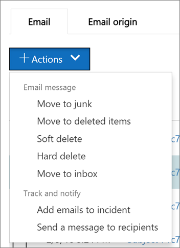

# 尋找並調查已傳遞 Office 365 中的惡意電子郵件

[Office 365 進階威脅防護](office-365-atp.md)可讓您調查，將您的使用者放在風險，並採取動作來保護您的組織活動。 例如，如果您是貴組織的安全性小組的一部分，您可以尋找和調查可疑的電子郵件已傳遞至您的使用者。 您可以使用[威脅總管 （或即時偵測的資訊）](threat-explorer.md)。
  
## 開始之前...]

請確定符合下列需求：
  
- 您的組織有[Office 365 進階威脅防護](office-365-atp.md)，並[將授權指派給使用者](https://docs.microsoft.com/en-us/office365/admin/subscriptions-and-billing/assign-licenses-to-users)。
    
- [Office 365 稽核記錄](turn-audit-log-search-on-or-off.md)已為您的組織。 
    
- 貴組織的原則定義的反垃圾郵件、 反惡意程式碼、 反網路釣魚，依此類推。 請參閱[針對 Office 365 中的威脅保護](protect-against-threats.md)。
    
- 您是 Office 365 全域管理員，或具有安全性系統管理員或 「 搜尋及清除角色指派安全性&amp;合規性中心。 請參閱[中的 Office 365 安全性權限&amp;合規性中心](permissions-in-the-security-and-compliance-center.md)。
    
## 處理可疑的電子郵件

惡意攻擊者可能會將郵件傳送至您的使用者嘗試與釣魚程式其認證，並存取您公司的機密資料 ！ 若要避免這種情況，您應該使用在 Office 365 中，包括[Exchange Online Protection](eop/exchange-online-protection-overview.md)和[進階威脅防護](office-365-atp.md)的威脅保護服務。 不過，有的時間攻擊者時將郵件傳送給使用者的 url 然後僅更新版本上將該 URL 點對惡意內容 （惡意程式碼等）。 

或者，您可能會發現太晚而遭入侵您組織中的使用者，以及攻擊時遭到盜用了該使用者，使用該帳戶傳送電子郵件給您公司中的其他使用者。 一部分 < cleaning up 這兩種情況，您可能想要移除使用者收件匣的電子郵件。 在這類的情況下，您可以利用[威脅總管 （或即時偵測）](threat-explorer.md)來尋找和移除這些電子郵件訊息 ！

## 重新路由傳送的電子郵件的所在位置後採取的動作

因此問題的電子郵件至何處，以及哪些工具可協助了解發生了什麼事它們現場？ 威脅總管欄位報告資訊可協助系統管理員會解碼問題的電子郵件事件。

### 檢視的電子郵件標頭，並下載電子郵件內文

**電子郵件標頭預覽和下載的電子郵件內文**是很有幫助的電子郵件威脅總管中可用的威脅管理功能。 系統管理員將能夠分析並下載標頭和威脅的電子郵件。 存取使用這項功能是由所控制角色型存取控制 (RBAC)，以減少使用者的電子郵件內容的曝光度的風險。

若要授與下載的郵件，並預覽所有電子郵件] 檢視中的標頭的能力，必須將新*角色*，稱為 「 預覽 」 新增到另一個 Office 365 角色群組 （例如到秒作業或秒的系統管理員）。

若要查看彈出式視窗與您的電子郵件下載電子郵件標頭預覽] 選項： 

1. 移至 [[https://protection.office.com](https://protection.office.com)和 Office 365 使用公司或學校帳戶登入。 這會帶您前往安全性&amp;合規性中心。 
    
2. 在左側導覽中，選擇 [**威脅管理，** \> **總管**。

3. 按一下 [上威脅總管表格中的主題。

這會開啟彈出式視窗中，位於這兩個標頭預覽] 和 [電子郵件下載連結。

> [!IMPORTANT]
> 請使用這兩個表格巨集中接續在一起。 其中一個會告訴您 RBAC 有需要，另一個，應授與權限的位置。

|活動  |具有存取權的 RBAC new-rolegroup |所需的 '預覽' 角色？  |
|---------|---------|---------|
|使用分析威脅威脅總管 （和即時偵測的資訊）     |  Office 365 全域系統管理員  安全性系統管理員   安全性讀取者      | 否   |
|使用檢視的電子郵件，以及預覽標頭和下載隔離電子郵件威脅總管 （和即時偵測的資訊）    |     Office 365 全域系統管理員   安全性系統管理員  安全性讀取者    |       否  |
|使用威脅總管檢視標頭，並下載傳遞至信箱的電子郵件     |      Office 365 全域系統管理員  安全性系統管理員  安全性讀取者   預覽    |   是      |

 

|RBAC new-rolegroup  |使用者指派給它們的位置  |
|---------|---------|
| 全域系統管理員   | Office 365 Admin Center        |
| 安全性系統管理員      |    安全規範中心     |
| 安全性讀取者   |    安全規範中心     |
|      |    安全規範中心     |

> [!CAUTION]
> 請記住，「 預覽 」 是角色並不 new-rolegroup 和該角色必須新增至 New-rolegroup 事後。

### 請檢查傳遞動作及位置

威脅總管即時偵測已新增取代傳遞狀態的傳遞巨集指令並傳遞位置欄位。 這會導致您的電子郵件的登陸其中的更完整圖片。 這項變更的目標的一部分是狩獵更輕鬆地進行安全性 Ops 的人員，但最終結果知道一眼問題電子郵件的位置。

傳遞狀態現在劃分為兩個資料行：

- **傳遞動作**-這封電子郵件的狀態為何？
- **傳遞位置**-其中這封電子郵件路由傳送結果？

傳遞動作是因為現有的原則或偵測電子郵件所採取的動作。 以下是可能一封電子郵件可以採取的動作：

- **已傳遞**– 電子郵件已傳遞至收件匣或資料夾的使用者和該使用者可以直接存取。
- **Junked** – 電子郵件已傳送至任一使用者的垃圾郵件] 資料夾，或刪除資料夾，且使用者在其 [垃圾郵件或刪除的郵件] 資料夾中具有存取電子郵件。
- **封鎖**– 任何電子郵件，會受到隔離，失敗，或已卸除。 這是完全無法存取之使用者所 ！
- **取代**– 惡意附件由 state 附件的.txt 檔案所取代其中任何電子郵件程式惡意。
 
傳遞位置顯示原則，以及執行後續傳遞的偵測的結果。 它會連結到傳遞巨集指令。 此欄位已新增至提供深入時找到問題郵件採取的動作。 以下是傳遞位置的可能值：

- **收件匣或資料夾**– 電子郵件是在收件匣或資料夾中 （根據您的電子郵件的規則）。
- **在內部或外部**– 信箱不存在於雲端上，但在-內部部署。
- **垃圾郵件資料夾**– 中之使用者的 [垃圾郵件] 資料夾中的電子郵件。
- **刪除的項目] 資料夾**– 之使用者的已刪除項目] 資料夾中的電子郵件。
- **隔離**-隔離中的電子郵件以及不在使用者的信箱。
- **失敗**– 電子郵件無法連到信箱。
- **丟棄**– 電子郵件會取得某處遺失，在 [郵件流程。

### 檢視您的電子郵件的時間表
  
 **電子郵件時間表**威脅總管中的另一個欄位也會較容易搜尋系統管理員適用的設。 而不寶貴的時間檢查電子郵件可能會移到何處，當時調查事件，當多個事件發生，在或接近，同時在電子郵件，這些事件會顯示在 [時間表] 檢視。 發生後傳遞至您的郵件部分事件會擷取 '*特殊動作*] 欄中。 合併資訊從時間表的郵件採取郵件後傳遞的特殊動作提供系統管理員深入資訊原則和威脅處理 （例如其中已路由傳送郵件，以及在某些情況下，最終評估已）。

## 尋找並刪除可疑的電子郵件的郵件傳遞

> [!TIP]
> 威脅總管 （有時稱為總管），是功能強大的報表，可以有多個用途，例如尋找及刪除的郵件，用來識別惡意電子郵件寄件者的 IP 位址或開始進一步調查的事件。 下列程序著重於使用 Explorer 來尋找並從收件者信箱刪除惡意電子郵件。

若要查看變更先前的傳遞狀態欄位 （現在傳遞巨集指令與傳遞位置）： 

1. 移至 [[https://protection.office.com](https://protection.office.com)和 Office 365 使用公司或學校帳戶登入。 這會帶您前往安全性&amp;合規性中心。 
    
2. 在左側導覽中，選擇 [**威脅管理，** \> **總管**。

![威脅總管] 的傳遞巨集指令與傳遞位置欄位。](media/ThreatExFields.PNG)

您可能會發現此圖形中新的 ['特殊動作'] 欄。 這項功能的目標是告訴系統管理員處理電子郵件的結果。 特殊動作可能會更新威脅總管] 中的*電子郵件時間表*，這是針對在系統管理員更妥善地進行狩獵體驗新功能的結尾。

電子郵件時間表剪下向下上隨機化因為較少的時間所花費的嘗試了解事件發生於由於電子郵件抵達檢查不同的位置。 當多個事件會發生，在或接近，同時在一封電子郵件時，這些事件會顯示在 [時間表] 檢視中。 某些後續傳遞至您的郵件，即會發生的事件將會擷取 '特殊動作] 欄中。 在後續傳遞郵件所採取的*特殊動作*與組合在一起，郵件從*時間表的電子郵件*的資訊會提供系統管理員深入解析到其原則的運作方式，其中最後已路由傳送郵件，並在某些情況下，哪些最後一評估為。 特殊動作] 欄可以在中傳遞巨集指令並傳遞位置，但若要查看電子郵件時間表的相同位置存取：

1. 按一下電子郵件的主旨。
2. 在出現面板中，按一下 [*電子郵件時間表*。 (將出現在像是 '摘要' 或 '詳述'] 面板上的其他標題之間 et cetera。)

一旦您開啟電子郵件時間表，您應該會看到會告訴您在該郵件的後續傳遞事件的資料表或在電子郵件沒有進一步事件，您應該會看到將狀態的結果，例如*封鎖*的原始傳遞的單一事件使用*釣魚程式*類似的結論。 ] 索引標籤也會有 [匯出完整的電子郵件時間表，] 選項，這會匯出] 索引標籤上的所有詳細資料和電子郵件 （像是主旨、 寄件者、 收件者、 網路和訊息識別碼） 的詳細資訊。

3. 在 [檢視] 功能表中，選擇 [**所有電子郵件**。 ![使用 [檢視] 功能表的電子郵件和內容的報告之間選擇](media/d39013ff-93b6-42f6-bee5-628895c251c2.png)
  
4. 請注意報表，例如**已傳遞**、**未知**，或**傳遞至垃圾郵件**中顯示的標籤。  （根據對貴組織的電子郵件所採取的動作，您可能會看到其他標籤，例如**封鎖**或**取代**）。
    
5. 在報告中，選擇 [**已傳遞**的以檢視僅最後出現在使用者的收件匣的電子郵件]。 
  
6. 下方圖表中，檢閱圖表下方的**電子郵件**清單。 
  
7. 在清單中，選擇 [項目來檢視電子郵件訊息的相關詳細資料]。 例如，您可以按一下 [檢視資訊寄件者、 收件者、 附件及其他類似的電子郵件的主旨行。 
  
8. 之後檢視電子郵件的相關資訊，請啟動 **+ 動作**清單中選取一或多個項目。
    
9. 使用 **+ 動作**清單將套用的動作，例如**將移至刪除**的項目。 這會從收件者的信箱刪除選取的郵件。 
  
## 相關主題

[Office 365 進階的威脅保護計劃 2](office-365-ti.md)
  
[防範 Office 365 中的威脅](protect-against-threats.md)
  
[檢視 Office 365 進階威脅防護報告](view-reports-for-atp.md)
  

