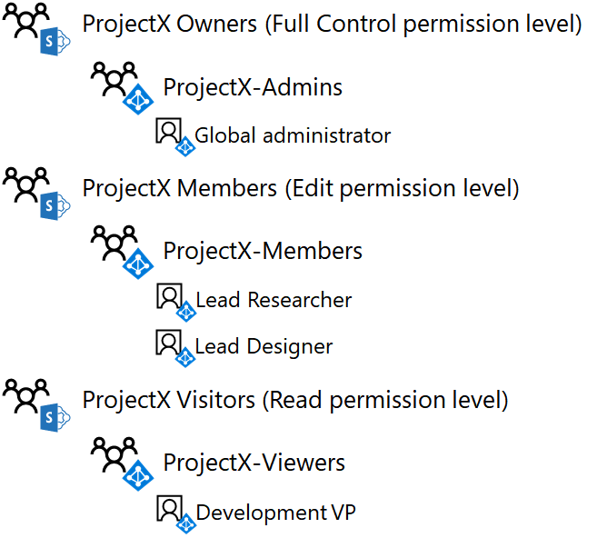

# <a name="isolated-sharepoint-online-team-site-devtest-environment"></a>獨立的 SharePoint Online 小組網站開發/測試環境

 **摘要：** 設定組織的其他 Office 365 開發/測試環境中隔離的 SharePoint Online 小組網站。
  
在 Office 365 中的 SharePoint Online 小組網站是使用一般的文件庫、 OneNote 筆記本中和其他服務的共同作業的位置。 在許多情況下，您跨部門或組織想寬的存取和共同作業。 不過，在某些情況下，您要緊密控制存取和一小群的人員的共同作業的權限。
  
SharePoint 群組和權限等級由控制存取 SharePoint Online 小組網站和使用者可以執行的動作。 根據預設，SharePoint Online 網站有三個層級的存取：
  
- **成員**，該使用者可以檢視、 建立及修改網站上的資源。
    
- **擁有者**，擁有在網站的完整控制權，包括變更權限的能力。
    
- **訪客**，只可以檢視在網站上的資源。
    
此文章步驟您透過秘密研究專案的隔離 SharePoint Online 小組網站的設定為名為 ProjectX。 存取需求如下：
  
- 只有專案的成員可以存取網站及其內容 （文件、 OneNote 筆記本、 頁面），與編輯和檢視控制透過群組成員資格的 SharePoint 權限等級。
    
- 只有網站建立者和網站系統管理員群組的成員可以執行網站管理，包括修改網站層級權限。
    
有三個階段，以設定 Office 365 開發/測試環境中的隔離 SharePoint Online 小組網站：
  
1. 建立 Office 365 開發/測試環境。
    
2. 為 ProjectX 建立使用者和群組。
    
3. 建立新的 ProjectX SharePoint Online 小組網站並且隔離它。
    
> [!TIP]
> 按一下[這裡](http://aka.ms/catlgstack)，可查看 One Microsoft Cloud 測試實驗室指南堆疊中文件的所有視覺對應。
  
## <a name="phase-1-build-out-your-lightweight-or-simulated-enterprise-office-365-devtest-environment"></a>階段 1：建置輕量型或模擬的企業 Office 365 開發/測試環境

如果您只想以具有最小需求的輕量型方式建立隔離的 SharePoint Online 小組網站，請遵循指示，以在階段 2 和 3 的[Office 365 開發/測試環境](https://docs.microsoft.com/office365/enterprise/office-365-dev-test-environment)中。
  
如果您想要在模擬的企業組態中建立隔離的 SharePoint Online 小組網站，請遵循[Office 365 開發/測試環境的 DirSync](https://docs.microsoft.com/office365/enterprise/dirsync-for-your-office-365-dev-test-environment)中的指示。
  
> [!NOTE]
> 建立隔離的 SharePoint Online 網站不需要模擬的企業版開發/測試環境，其中包含連線至網際網路的模擬內部網路和 Windows Server AD 樹系中的目錄同步處理。 它提供了此選項，讓您可以測試隔離的 SharePoint Online 網站與代表典型組織的環境中實驗。 
  
## <a name="phase-2-create-user-accounts-and-access-groups"></a>階段 2： 建立使用者帳戶，並存取群組

使用[連線到 Office 365 PowerShell](https://technet.microsoft.com/library/dn975125.aspx)中的指示，連線至以全域管理員帳戶從您 Office 365 訂閱：
  
- 您的電腦 (適用於輕量型 Office 365 開發/測試環境)。
    
- CLIENT1 虛擬機器 (適用於模擬的企業 Office 365 開發/測試環境)。
    
若要建立新的存取群組的 ProjectX SharePoint Online 小組網站，請在 Windows Azure Active Directory 模組的 Windows PowerShell 提示字元執行下列命令：
  
```
$groupName="ProjectX-Members"
$groupDesc="People allowed to collaborate for ProjectX."
New-MsolGroup -DisplayName $groupName -Description $groupDesc
$groupName="ProjectX-Admins"
$groupDesc="People allowed to administer SharePoint for ProjectX."
New-MsolGroup -DisplayName $groupName -Description $groupDesc
$groupName="ProjectX-Viewers"
$groupDesc="People allowed to view the SharePoint resources for ProjectX."
New-MsolGroup -DisplayName $groupName -Description $groupDesc
```

> [!TIP]
> 按一下[這裡](https://gallery.technet.microsoft.com/PowerShell-commands-for-an-b2608df1)，其中包含所有在本文中的 PowerShell 命令文字檔案。
  
填入您的組織名稱 (範例︰contosotoycompany)，位置的兩個字元國家/地區代碼，再從適用於 Windows PowerShell 的 Windows Azure Active Directory 模組提示字元中執行下列命令︰
  
```
$orgName="<organization name>"
$loc="<two-character country code, such as US>"
$licAssignment= $orgName + ":ENTERPRISEPREMIUM"
$userName= "designer@" + $orgName + ".onmicrosoft.com"
New-MsolUser -DisplayName "Lead Designer" -FirstName Lead -LastName Designer -UserPrincipalName $userName -UsageLocation $loc -LicenseAssignment $licAssignment -ForceChangePassword $false
```

從**New-msoluser**命令的顯示畫面，記下針對 Lead Designer 帳戶產生的密碼，並且記錄於安全的位置。
  
從適用於 Windows PowerShell 的 Windows Azure Active Directory 模組提示字元中執行下列命令︰
  
```
$userName= "researcher@" + $orgName + ".onmicrosoft.com"
New-MsolUser -DisplayName "Lead Researcher" -FirstName Lead -LastName Researcher -UserPrincipalName $userName -UsageLocation $loc -LicenseAssignment $licAssignment -ForceChangePassword $false
```

從**New-msoluser**命令的顯示畫面，記下針對 Lead Researcher 帳戶產生的密碼，並且記錄於安全的位置。
  
從適用於 Windows PowerShell 的 Windows Azure Active Directory 模組提示字元中執行下列命令︰
  
```
$userName= "devvp@" + $orgName + ".onmicrosoft.com"
New-MsolUser -DisplayName "Development VP" -FirstName Development -LastName VP -UserPrincipalName $userName -UsageLocation $loc -LicenseAssignment $licAssignment -ForceChangePassword $false
```

從**New-msoluser**命令的顯示畫面，記下針對 Development VP 帳戶產生的密碼，並且記錄於安全的位置。
  
接下來，將新的帳戶新增至新的存取群組，請在 Windows Azure Active Directory 模組的 Windows PowerShell 提示字元執行這些 PowerShell 命令：
  
```
$grpName="ProjectX-Members"
$userUPN="designer@" + $orgName + ".onmicrosoft.com"
Add-MsolGroupMember -GroupObjectId (Get-MsolGroup | Where { $_.DisplayName -eq $grpName }).ObjectID -GroupMemberObjectId (Get-MsolUser | Where { $_.UserPrincipalName -eq $userUPN }).ObjectID -GroupMemberType "User"
$userUPN="researcher@" + $orgName + ".onmicrosoft.com"
Add-MsolGroupMember -GroupObjectId (Get-MsolGroup | Where { $_.DisplayName -eq $grpName }).ObjectID -GroupMemberObjectId (Get-MsolUser | Where { $_.UserPrincipalName -eq $userUPN }).ObjectID -GroupMemberType "User"
$grpName="ProjectX-Admins"
Add-MsolGroupMember -GroupObjectId (Get-MsolGroup | Where { $_.DisplayName -eq $grpName }).ObjectID -GroupMemberObjectId (Get-MsolUser | Where { $_.UserPrincipalName -eq $userCredential.UserName }).ObjectID -GroupMemberType "User"
$grpName="ProjectX-Viewers"
$userUPN="devvp@" + $orgName + ".onmicrosoft.com"
Add-MsolGroupMember -GroupObjectId (Get-MsolGroup | Where { $_.DisplayName -eq $grpName }).ObjectID -GroupMemberObjectId (Get-MsolUser | Where { $_.UserPrincipalName -eq $userUPN }).ObjectID -GroupMemberType "User"
```

結果：
  
- ProjectX 成員存取群組包含 Lead Designer 和 Lead Researcher 使用者帳戶
    
- Projectx-admins 存取群組包含試用版訂閱的全域系統管理員帳戶
    
- Projectx-viewers 存取群組包含 Development VP 使用者帳戶
    
圖 1 顯示存取群組及其成員資格。
  
**圖 1**


  
## <a name="phase-3-create-a-new-projectx-sharepoint-online-team-site-and-isolate-it"></a>階段 3： 建立新的 ProjectX SharePoint Online 小組網站並且隔離它

若要為 ProjectX 建立 SharePoint Online 小組網站，請執行下列動作：
  
1. 使用瀏覽器上您的本機電腦 （輕量級組態） 或在 CLIENT1 上 （模擬的企業組態） 登入 Office 365 入口網站 ([https://admin.microsoft.com](https://admin.microsoft.com)) 使用您的全域系統管理員帳戶。
    
2. 在磚清單中，按一下 [SharePoint]****。
    
3. 在瀏覽器中新 SharePoint 索引標籤，按一下 [ **+ 建立網站**。
    
4. 在 [**小組網站名稱**] 中，輸入**ProjectX**。 在 [**隱私權設定**] 中，選取 [**私人-只有成員可以存取此網站**。
    
5. 在 [**小組網站描述**] 中，輸入**ProjectX 的 SharePoint 網站**]，然後按一下 [**下一步**。
    
6. 在**您要新增誰**？] 窗格中，按一下 [**完成]**。
    
7. 在您瀏覽器] 中 [工具] 列中，新的**ProjectX-首頁**] 索引標籤上按一下 [設定] 圖示，，然後按一下 [**網站權限**。
    
8. 在 [網站權限]**** 窗格中，按一下 [進階權限設定]****。
    
9. 在新**的權限： Project X**在瀏覽器索引標籤上，按一下 [**存取要求設定**]。
    
10. 在 [**存取要求設定**] 對話方塊中，清除 [**允許成員共用網站以及個別檔案和資料夾**並**允許存取權要求**（使所有三個核取方塊皆已取消），然後按一下 [**確定]**。
    
11. 按一下清單中的 [ **ProjectX 成員**]。
    
12. 在 [人員與群組]**** 頁面上，按一下 [新增]****。
    
13. 在 [**共用**] 對話方塊中，輸入**Projectx-members**，加以選取，，然後按一下 [**共用**。
    
14. 按一下瀏覽器上的 [上一頁] 按鈕。
    
15. 在清單中，按一下 [ **ProjectX 擁有者**。
    
16. 在 [人員與群組]**** 頁面上，按一下 [新增]****。
    
17. 在 [**共用**] 對話方塊中，輸入**Projectx-admins**，加以選取，，然後按一下 [**共用**。
    
18. 按一下瀏覽器上的 [上一頁] 按鈕。
    
19. 按一下清單中的 [ **ProjectX 訪客**]。
    
20. 在 [人員與群組]**** 頁面上，按一下 [新增]****。
    
21. 在 [**共用**] 對話方塊中，輸入**Projectx-viewers**，加以選取，，然後按一下 [**共用**。
    
22. 關閉瀏覽器中的 [**人員與群組**] 索引標籤，按一下 [在您瀏覽器] 的 [ **Projectx-home** ] 索引標籤，然後關閉 [**網站權限**] 窗格。
    
以下是設定權限的結果：
  
- [ProjectX 成員] SharePoint 群組包含只 ProjectX 成員存取群組 （其中僅包含 Lead Designer 和 Lead Researcher 使用者帳戶） 和 「 ProjectX 群組 （其中僅包含全域系統管理員使用者帳戶）。
    
- ProjectX 擁有者 SharePoint 群組僅包含 Projectx-admins 存取群組 （它僅包含全域系統管理員使用者帳戶）。
    
- ProjectX 訪客 SharePoint 群組僅包含 Projectx-viewers 存取群組 （它僅包含 Development VP 使用者帳戶）。
    
- 成員無法修改網站層級權限 （這只能由 Projectx-admins 群組的成員）。
    
- 其他使用者帳戶無法存取網站或其資源，或要求存取網站。
    
圖 2 顯示 SharePoint 群組及其成員資格。
  
**圖 2**


  
現在讓我們示範使用 Lead Designer 使用者帳戶的存取：
  
1. 關閉瀏覽器中的 [ **Projectx-home** ] 索引標籤，然後按一下 [在瀏覽器中的 [ **Microsoft Office 的首頁**] 索引標籤。
    
2. 按一下您的全域管理員的名稱，然後按一下 [**登出]**。
    
3. 登入 Office 365 入口網站 ([https://admin.microsoft.com](https://admin.microsoft.com)) 使用 Lead Designer 帳戶名稱及其密碼。
    
4. 在磚清單中，按一下 [SharePoint]****。
    
5. 在瀏覽器中新**SharePoint**索引標籤，在 [搜尋] 方塊中，輸入**ProjectX**啟動搜尋，然後按一下 [ **ProjectX**小組網站。 您應該針對 ProjectX 小組網站的瀏覽器中看到新的索引標籤。
    
6. 按一下 [設定] 圖示。 請注意，沒有**網站**權限的選項。 這是正確的因為只有 Projectx-admins 群組的成員可修改在網站上的權限
    
7. 開啟 [記事本] 或您所選擇的文字編輯器。
    
8. 複製 ProjectX 小組網站的 URL，並將它貼至記事本或文字編輯器中的新一行。
    
9. 在 [新**Projectx-home** ] 索引標籤瀏覽器中，按一下 [**文件**。
    
10. 複製 ProjectX 文件] 資料夾的 URL，並將它貼至記事本或文字編輯器中的新一行。
    
11. 新**Projectx-documents** ] 索引標籤上瀏覽器中，按一下 [**新增 > Word 文件**]。
    
12. 在 [ **Word Online** ] 頁面中輸入一些文字，以指出**儲存**，按一下瀏覽器的上一頁按鈕，然後重新整理] 頁面上的狀態等。 您應該會看到新**Document.docx** **文**件資料夾。
    
13. 按一下**Document.docx**文件的省略符號，然後按一下 [**取得連結**。
    
14. 複製 [**共用 'Document.docx'** ] 對話方塊中的 URL 並將它貼至記事本或文字編輯器中的新一行，然後關閉 [**共用 'Document.docx'** ] 對話方塊。
    
15. 關閉瀏覽器中的**ProjectX 文件**和**SharePoint**索引標籤，然後按一下 [ **Microsoft Office 的首頁**] 索引標籤。
    
16. 按一下 [ **Lead Designer** ] 名稱，然後按一下 [**登出]**。
    
現在讓我們示範使用 Development VP 使用者帳戶的存取：
  
1. 登入 Office 365 入口網站 ([https://admin.microsoft.com](https://admin.microsoft.com)) 使用 Development VP 帳戶名稱及其密碼。
    
2. 在磚清單中，按一下 [SharePoint]****。
    
3. 在瀏覽器中新**SharePoint**索引標籤，在 [搜尋] 方塊中，輸入**ProjectX**啟動搜尋，然後按一下 [ **ProjectX**小組網站。 您應該針對 ProjectX 小組網站的瀏覽器中看到新的索引標籤。
    
4. 按一下 [**文件**，，，然後按一下 [ **document.docx]** 檔案。
    
5. 在瀏覽器的 [ **Document.docx** ] 索引標籤中嘗試修改的文字。 您應該會看到訊息，說明**這份文件是唯讀屬性。** 這是因為 Development VP 使用者帳戶只具有網站檢視權限可預期。
    
6. 關閉瀏覽器中的 [ **Document.docx**、 **ProjectX 文件**，以及**SharePoint** ] 索引標籤。
    
7. 按一下 [ **Microsoft Office 的首頁**] 索引標籤，按一下 [ **Development VP** ] 名稱，然後按一下 [**登出]**。
    
現在讓我們示範使用沒有權限的使用者帳戶的存取：
  
1. 登入 Office 365 入口網站 ([https://admin.microsoft.com](https://admin.microsoft.com)) 使用的使用者 3 帳戶名稱及其密碼。
    
2. 在磚清單中，按一下 [SharePoint]****。
    
3. 在瀏覽器中新**SharePoint**索引標籤，在 [搜尋] 方塊中輸入**ProjectX** ，然後啟動搜尋。 您應該會看到郵件**則是 Nothing 以下符合您的搜尋。**
    
4. 從記事本或文字編輯器開啟執行個體，針對 ProjectX 網站 URL 複製到您的瀏覽器網址列，然後按**Enter**。 您應該會看到 **「 拒絕存取 」** ] 頁面。
    
5. 從記事本或文字編輯器，將 [ProjectX 文件] 資料夾的 URL 複製到您的瀏覽器網址列，然後按**Enter**。 您應該會看到 **「 拒絕存取 」** ] 頁面。
    
6. 從記事本或文字編輯器，將 Documents.docx 檔案的 URL 複製到您的瀏覽器網址列，然後按**Enter**。 您應該會看到 **「 拒絕存取 」** ] 頁面。
    
7. 關閉瀏覽器中的 [ **SharePoint** ] 索引標籤，按一下 [ **Microsoft Office 的首頁**] 索引標籤，按一下**User 3** ] 名稱，，然後按一下 [**登出]**。
    
隔離的 SharePoint Online 網站已準備好以利您進一步試驗。
  
## <a name="next-step"></a>下一步

當您準備好要在生產環境中部署獨立的 SharePoint Online 小組網站時，請參閱＜[設計獨立的 SharePoint Online 小組網站](design-an-isolated-sharepoint-online-team-site.md)＞中的逐步設計考量。
  
## <a name="see-also"></a>另請參閱

[獨立的 SharePoint Online 小組網站](isolated-sharepoint-online-team-sites.md)。
  
[雲端採用測試實驗室指南 (TLG)](https://docs.microsoft.com/office365/enterprise/cloud-adoption-test-lab-guides-tlgs)
  
[基底組態開發/測試環境](https://docs.microsoft.com/office365/enterprise/base-configuration-dev-test-environment)
  
[Office 365 開發/測試環境](https://docs.microsoft.com/office365/enterprise/office-365-dev-test-environment)
  
[雲端採用和混合式解決方案](https://docs.microsoft.com/office365/enterprise/cloud-adoption-and-hybrid-solutions)


