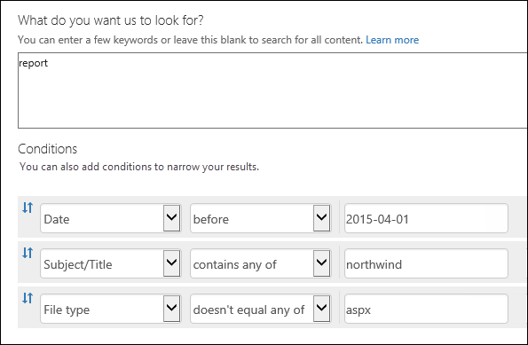

# <a name="keyword-queries-and-search-conditions-for-content-search"></a><span data-ttu-id="16d59-103">內容搜尋的關鍵字查詢和搜尋條件</span><span class="sxs-lookup"><span data-stu-id="16d59-103">Keyword queries and search conditions for Content Search</span></span>

<span data-ttu-id="16d59-p101">本主題說明您可以在 Exchange Online 與儲存在 SharePoint 文件中的電子郵件項目中搜尋的電子郵件和文件屬性及使用 Office 365 安全性內容的搜尋功能的網站 OneDrive for Business&amp;規範置中。您也可以使用**\*-ComplianceSearch**中安全性的指令程式&amp;規範中心 PowerShell 搜尋這些屬性。同時說明主題：</span><span class="sxs-lookup"><span data-stu-id="16d59-p101">This topic describes the email and document properties that you can search for in email items in Exchange Online and documents stored on SharePoint and OneDrive for Business sites by using the Content Search feature in the Office 365 Security &amp; Compliance Center. You can also use the **\*-ComplianceSearch** cmdlets in Security &amp; Compliance Center PowerShell to search for these properties. The topic also describes:</span></span>   
  
- <span data-ttu-id="16d59-107">使用布林搜尋運算子、 搜尋條件及其他搜尋查詢技術 （英文） 調整您的搜尋結果。</span><span class="sxs-lookup"><span data-stu-id="16d59-107">Using Boolean search operators, search conditions, and other search query techniques to refine your search results.</span></span>
    
- <span data-ttu-id="16d59-108">搜尋機密資料類型與 SharePoint 和 OneDrive for Business 中的自訂敏感資料類型。</span><span class="sxs-lookup"><span data-stu-id="16d59-108">Searching for sensitive data types and custom sensitive data types in SharePoint and OneDrive for Business.</span></span>
    
- <span data-ttu-id="16d59-109">搜尋網站內容的共用與組織外的使用者</span><span class="sxs-lookup"><span data-stu-id="16d59-109">Searching for site content that's shared with users outside of your organization</span></span>
    
<span data-ttu-id="16d59-110">如需如何建立內容的搜尋的逐步指示，請參閱[Office 365 中的內容搜尋](content-search.md)。</span><span class="sxs-lookup"><span data-stu-id="16d59-110">For step-by-step instructions on how to create a Content Search, see [Content Search in Office 365](content-search.md).</span></span> |

  
> [!NOTE]
> <span data-ttu-id="16d59-p102">內容搜尋安全性&amp;規範中心及對應**\*-ComplianceSearch**中安全性的指令程式&amp;規範中心 PowerShell 使用關鍵字查詢語言 (KQL)。如需詳細資訊，請參閱[關鍵字查詢語言語法參考 （英文）](https://go.microsoft.com/fwlink/?LinkId=269603)。</span><span class="sxs-lookup"><span data-stu-id="16d59-p102">Content Search in the Security &amp; Compliance Center and the corresponding **\*-ComplianceSearch** cmdlets in Security &amp; Compliance Center PowerShell use the Keyword Query Language (KQL). For more detailed information, see [Keyword Query Language syntax reference](https://go.microsoft.com/fwlink/?LinkId=269603).</span></span> 
  
## <a name="searchable-email-properties"></a><span data-ttu-id="16d59-113">可搜尋的電子郵件屬性</span><span class="sxs-lookup"><span data-stu-id="16d59-113">Searchable email properties</span></span>

<span data-ttu-id="16d59-p103">下表列出使用中的安全性內容搜尋功能可搜尋的電子郵件內容&amp;規範中心或使用**新 ComplianceSearch**或**組 ComplianceSearch**指令程式。表格包含每個屬性並由範例傳回的搜尋結果的描述_屬性： 值_語法範例。您可以輸入這些`property:value`成對的關鍵字] 方塊的內容搜尋。</span><span class="sxs-lookup"><span data-stu-id="16d59-p103">The following table lists email message properties that can be searched by using the Content Search feature in the Security &amp; Compliance Center or by using the **New-ComplianceSearch** or the **Set-ComplianceSearch** cmdlet. The table includes an example of the  _property:value_ syntax for each property and a description of the search results returned by the examples. You can type these  `property:value` pairs in the keywords box for a Content Search.</span></span> 
  
|<span data-ttu-id="16d59-117">**屬性**</span><span class="sxs-lookup"><span data-stu-id="16d59-117">**Property**</span></span>|<span data-ttu-id="16d59-118">**屬性描述**</span><span class="sxs-lookup"><span data-stu-id="16d59-118">**Property description**</span></span>|<span data-ttu-id="16d59-119">**範例**</span><span class="sxs-lookup"><span data-stu-id="16d59-119">**Examples**</span></span>|<span data-ttu-id="16d59-120">**範例所傳回的搜尋結果**</span><span class="sxs-lookup"><span data-stu-id="16d59-120">**Search results returned by the examples**</span></span>|
|:-----|:-----|:-----|:-----|
|<span data-ttu-id="16d59-121">AttachmentNames</span><span class="sxs-lookup"><span data-stu-id="16d59-121">AttachmentNames</span></span>  <br/> |<span data-ttu-id="16d59-122">附加到電子郵件的檔案名稱。</span><span class="sxs-lookup"><span data-stu-id="16d59-122">The names of files attached to an email message.</span></span>  <br/> |`attachmentnames:annualreport.ppt`  <br/> `attachmentnames:annual*`  <br/> |<span data-ttu-id="16d59-p104">郵件包含一個名為 annualreport.ppt 的附件檔案。在第二個範例中，使用萬用字元會傳回在附件的檔案名稱中包含「annual」字詞的訊息。</span><span class="sxs-lookup"><span data-stu-id="16d59-p104">Messages that have an attached file named annualreport.ppt. In the second example, using the wildcard returns messages with the word "annual" in the file name of an attachment.</span></span>  <br/> |
|<span data-ttu-id="16d59-125">密件副本</span><span class="sxs-lookup"><span data-stu-id="16d59-125">Bcc</span></span>  <br/> |<span data-ttu-id="16d59-126">電子郵件訊息的 [密件副本] 欄位。<sup>1</sup></span><span class="sxs-lookup"><span data-stu-id="16d59-126">The BCC field of an email message.<sup>1</sup></span></span> <br/> |`bcc:pilarp@contoso.com`  <br/> `bcc:pilarp`  <br/> `bcc:"Pilar Pinilla"`  <br/> |<span data-ttu-id="16d59-127">所有的範例會傳回包含在密件副本欄位中具有 Pilar Pinilla 的郵件。</span><span class="sxs-lookup"><span data-stu-id="16d59-127">All examples return messages with Pilar Pinilla included in the Bcc field.</span></span>  <br/> |
|<span data-ttu-id="16d59-128">類別</span><span class="sxs-lookup"><span data-stu-id="16d59-128">Category</span></span>  <br/> | <span data-ttu-id="16d59-p105">要搜尋的類別。使用者可以使用 Outlook 或 Outlook Web App 定義類別。可能的值為：</span><span class="sxs-lookup"><span data-stu-id="16d59-p105">The categories to search. Categories can be defined by users by using Outlook or Outlook Web App. The possible values are:</span></span>  <br/><br/>  <span data-ttu-id="16d59-132">藍色</span><span class="sxs-lookup"><span data-stu-id="16d59-132">blue</span></span>  <br/>  <span data-ttu-id="16d59-133">綠色</span><span class="sxs-lookup"><span data-stu-id="16d59-133">green</span></span>  <br/>  <span data-ttu-id="16d59-134">橙色</span><span class="sxs-lookup"><span data-stu-id="16d59-134">orange</span></span>  <br/>  <span data-ttu-id="16d59-135">紫色</span><span class="sxs-lookup"><span data-stu-id="16d59-135">purple</span></span>  <br/>  <span data-ttu-id="16d59-136">紅色</span><span class="sxs-lookup"><span data-stu-id="16d59-136">red</span></span>  <br/>  <span data-ttu-id="16d59-137">黃色</span><span class="sxs-lookup"><span data-stu-id="16d59-137">yellow</span></span>  <br/> |`category:"Red Category"`  <br/> |<span data-ttu-id="16d59-138">來源信箱中已指派紅色類別的郵件。 </span><span class="sxs-lookup"><span data-stu-id="16d59-138">Messages that have been assigned the red category in the source mailboxes.</span></span>  <br/> |
|<span data-ttu-id="16d59-139">副本</span><span class="sxs-lookup"><span data-stu-id="16d59-139">Cc</span></span>  <br/> |<span data-ttu-id="16d59-140">電子郵件訊息的 [副本] 欄位。<sup>1</sup></span><span class="sxs-lookup"><span data-stu-id="16d59-140">The CC field of an email message.<sup>1</sup></span></span> <br/> |`cc:pilarp@contoso.com`  <br/> `cc:"Pilar Pinilla"`  <br/> |<span data-ttu-id="16d59-141">在這兩個範例中，具有在 [副本] 欄位中指定 Pilar Pinilla 的郵件。</span><span class="sxs-lookup"><span data-stu-id="16d59-141">In both examples, messages with Pilar Pinilla specified in the CC field.</span></span>  <br/> |
|<span data-ttu-id="16d59-142">Folderid</span><span class="sxs-lookup"><span data-stu-id="16d59-142">Folderid</span></span>  <br/> |<span data-ttu-id="16d59-p106">識別碼 (GUID) 特定信箱資料夾的資料夾。如果您使用此屬性，請務必搜尋指定的資料夾位於的信箱。請注意只有在指定的資料夾拼寫須符合。將不會搜尋的資料夾中的任何子資料夾。若要搜尋的子資料夾，您需要使用 Folderid 屬性針對您想要搜尋的子資料夾。</span><span class="sxs-lookup"><span data-stu-id="16d59-p106">The folder ID (GUID) of a specific mailbox folder. If you use this property, be sure to search the mailbox that the specified folder is located in. Note that only the specified folder will be searched. Any subfolders in the folder won't be searched. To search sub-folders, you need to use the Folderid property for the sub-folder you want to search.  </span></span><br/> <span data-ttu-id="16d59-148">如需搜尋 Folderid 屬性以及如何使用指令碼來取得特定信箱的識別碼資料夾的詳細資訊，請參閱[使用 Office 365 中的目標集合的內容搜尋](use-content-search-for-targeted-collections.md)。</span><span class="sxs-lookup"><span data-stu-id="16d59-148">For more information about searching for the Folderid property and using a script to obtain the folder IDs for a specific mailbox, see [Use Content Search in Office 365 for targeted collections](use-content-search-for-targeted-collections.md).</span></span>  <br/> |`folderid:4D6DD7F943C29041A65787E30F02AD1F00000000013A0000`  <br/> `folderid:2370FB455F82FC44BE31397F47B632A70000000001160000 AND participants:garthf@contoso.com`  <br/> |<span data-ttu-id="16d59-p107">第一個範例會傳回指定的信箱資料夾中的所有項目。第二個範例會傳回已傳送或接收 garthf@contoso.com 所指定的信箱資料夾中的所有項目。</span><span class="sxs-lookup"><span data-stu-id="16d59-p107">The first example returns all items in the specified mailbox folder. The second example return all items in the specified mailbox folder that were sent or received by garthf@contoso.com.</span></span>  <br/> |
|<span data-ttu-id="16d59-151">從</span><span class="sxs-lookup"><span data-stu-id="16d59-151">From</span></span>  <br/> |<span data-ttu-id="16d59-152">電子郵件訊息的寄件者。<sup>1</sup></span><span class="sxs-lookup"><span data-stu-id="16d59-152">The sender of an email message.<sup>1</sup></span></span> <br/> |`from:pilarp@contoso.com`  <br/> `from:contoso.com`  <br/> |<span data-ttu-id="16d59-153">指定的使用者或從指定的網域傳送的郵件。</span><span class="sxs-lookup"><span data-stu-id="16d59-153">Messages sent by the specified user or sent from a specified domain.</span></span>  <br/> |
|<span data-ttu-id="16d59-154">HasAttachment</span><span class="sxs-lookup"><span data-stu-id="16d59-154">HasAttachment</span></span>  <br/> |<span data-ttu-id="16d59-p108">會指出將郵件具有附件。使用的值則為**true**或**false**。</span><span class="sxs-lookup"><span data-stu-id="16d59-p108">Indicates whether or not a message has an attachment. Use the values **true** or **false**.  </span></span><br/> |`from:pilar@contoso.com AND hasattachment:true`  <br/> |<span data-ttu-id="16d59-157">所傳送的郵件指定的使用者具有附件。</span><span class="sxs-lookup"><span data-stu-id="16d59-157">Messages sent by the specified user that have attachments.</span></span>  <br/> |
|<span data-ttu-id="16d59-158">Importance</span><span class="sxs-lookup"><span data-stu-id="16d59-158">Importance</span></span>  <br/> |<span data-ttu-id="16d59-p109">電子郵件寄件者可以在傳送郵件時指定的重要性。根據預設，郵件是傳送使用標準的重要性，除非寄件者設定為**高**或**低**重要性。</span><span class="sxs-lookup"><span data-stu-id="16d59-p109">The importance of an email message, which a sender can specify when sending a message. By default, messages are sent with normal importance, unless the sender sets the importance as **high** or **low**.  </span></span><br/> |`importance:high`  <br/> `importance:medium`  <br/> `importance:low`  <br/> |<span data-ttu-id="16d59-161">標示為高重要性、中重要性或低重要性的郵件。</span><span class="sxs-lookup"><span data-stu-id="16d59-161">Messages that are marked as high importance, medium importance, or low importance.</span></span>  <br/> |
|<span data-ttu-id="16d59-162">IsRead</span><span class="sxs-lookup"><span data-stu-id="16d59-162">IsRead</span></span>  <br/> |<span data-ttu-id="16d59-p110">會指出已讀取的郵件。使用的值則為**true**或**false**。</span><span class="sxs-lookup"><span data-stu-id="16d59-p110">Indicates whether or not messages have been read. Use the values **true** or **false**.  </span></span><br/> |`isread:true`  <br/> `isread:false`  <br/> |<span data-ttu-id="16d59-p111">第一個範例會傳回郵件並將 IsRead 屬性設定為**True**。第二個範例會傳回郵件 IsRead 屬性設定為**False**。</span><span class="sxs-lookup"><span data-stu-id="16d59-p111">The first example returns messages with the IsRead property set to **True**. The second example returns messages with the IsRead property set to **False**.  </span></span><br/> |
|<span data-ttu-id="16d59-167">ItemClass</span><span class="sxs-lookup"><span data-stu-id="16d59-167">ItemClass</span></span>  <br/> |<span data-ttu-id="16d59-p112">使用這個屬性來搜尋您的組織匯入至 Office 365 的協力廠商的特定資料類型。這個屬性使用下列語法：`itemclass:ipm.externaldata.<third-party data type>*`</span><span class="sxs-lookup"><span data-stu-id="16d59-p112">Use this property to search specific third-party data types that your organization imported to Office 365. Use the following syntax for this property:  `itemclass:ipm.externaldata.<third-party data type>*`</span></span> <br/> |`itemclass:ipm.externaldata.Facebook* AND subject:contoso`  <br/> `itemclass:ipm.externaldata.Twitter* AND from:"Ann Beebe" AND "Northwind Traders"`  <br/> |<span data-ttu-id="16d59-p113">第一個範例會傳回包含單字的 Facebook 項目 「 contoso 」 主旨屬性中。第二個範例會傳回的當天的 Ann Beebe 且包含關鍵字文句"Northwind Traders 」 的 Twitter 項目。</span><span class="sxs-lookup"><span data-stu-id="16d59-p113">The first example returns Facebook items that contain the word "contoso" in the Subject property. The second example returns Twitter items that were posted by Ann Beebe and that contain the keyword phrase "Northwind Traders".  </span></span><br/> <span data-ttu-id="16d59-172">如要使用的協力廠商資料類型 ItemClass 屬性的值的完整清單，請參閱[使用搜尋的已匯入 Office 365 的協力廠商資料的內容搜尋](use-content-search-to-search-third-party-data-that-was-imported.md)。</span><span class="sxs-lookup"><span data-stu-id="16d59-172">For a complete list of values to use for third-party data types for the ItemClass property, see [Use Content Search to search third-party data that was imported to Office 365](use-content-search-to-search-third-party-data-that-was-imported.md).</span></span>  <br/> |
|<span data-ttu-id="16d59-173">類型</span><span class="sxs-lookup"><span data-stu-id="16d59-173">Kind</span></span>  <br/> | <span data-ttu-id="16d59-p114">若要搜尋的電子郵件訊息的類型。可能的值：</span><span class="sxs-lookup"><span data-stu-id="16d59-p114">The type of email message to search for. Possible values:</span></span>  <br/>  <span data-ttu-id="16d59-176">連絡人</span><span class="sxs-lookup"><span data-stu-id="16d59-176">contacts</span></span>  <br/>  <span data-ttu-id="16d59-177">文件</span><span class="sxs-lookup"><span data-stu-id="16d59-177">docs</span></span>  <br/>  <span data-ttu-id="16d59-178">電子郵件</span><span class="sxs-lookup"><span data-stu-id="16d59-178">email</span></span>  <br/>  <span data-ttu-id="16d59-179">externaldata</span><span class="sxs-lookup"><span data-stu-id="16d59-179">externaldata</span></span>  <br/>  <span data-ttu-id="16d59-180">傳真</span><span class="sxs-lookup"><span data-stu-id="16d59-180">faxes</span></span>  <br/>  <span data-ttu-id="16d59-181">IM</span><span class="sxs-lookup"><span data-stu-id="16d59-181">im</span></span>  <br/>  <span data-ttu-id="16d59-182">日誌</span><span class="sxs-lookup"><span data-stu-id="16d59-182">journals</span></span>  <br/>  <span data-ttu-id="16d59-183">會議</span><span class="sxs-lookup"><span data-stu-id="16d59-183">meetings</span></span>  <br/>  <span data-ttu-id="16d59-184">microsoftteams （從聊天室、 會議及電話的 Microsoft 小組中傳回的項目）</span><span class="sxs-lookup"><span data-stu-id="16d59-184">microsoftteams (returns items from chats, meetings, and calls in Microsoft Teams)</span></span>  <br/>  <span data-ttu-id="16d59-185">附註</span><span class="sxs-lookup"><span data-stu-id="16d59-185">notes</span></span>  <br/>  <span data-ttu-id="16d59-186">張貼</span><span class="sxs-lookup"><span data-stu-id="16d59-186">posts</span></span>  <br/>  <span data-ttu-id="16d59-187">rssfeeds</span><span class="sxs-lookup"><span data-stu-id="16d59-187">rssfeeds</span></span>  <br/>  <span data-ttu-id="16d59-188">工作</span><span class="sxs-lookup"><span data-stu-id="16d59-188">tasks</span></span>  <br/>  <span data-ttu-id="16d59-189">語音信箱</span><span class="sxs-lookup"><span data-stu-id="16d59-189">voicemail</span></span>  <br/> |`kind:email`  <br/> `kind:email OR kind:im OR kind:voicemail`  <br/> `kind:externaldata`  <br/> |<span data-ttu-id="16d59-p115">第一個範例會傳回符合搜尋準則的電子郵件訊息。第二個範例會傳回電子郵件、 立即訊息交談 （包括 Skype 商務交談和聊天室中的 Microsoft 小組） 和語音訊息符合搜尋準則。第三個範例會傳回已匯入 Office 365 中的信箱與協力廠商資料來源，例如 Twitter、 Facebook，以及 Jabber Cisco、 符合搜尋準則的項目。如需詳細資訊，請參閱[Office 365 中的封存與協力廠商資料](https://go.microsoft.com/fwlink/p/?linkid=716918)。</span><span class="sxs-lookup"><span data-stu-id="16d59-p115">The first example returns email messages that meet the search criteria. The second example returns email messages, instant messaging conversations (including Skype for Business conversations and chats in Microsoft Teams), and voice messages that meet the search criteria. The third example returns items that were imported to mailboxes in Office 365 from third-party data sources, such as Twitter, Facebook, and Cisco Jabber, that meet the search criteria. For more information, see [Archiving third-party data in Office 365](https://go.microsoft.com/fwlink/p/?linkid=716918).  </span></span><br/> |
|<span data-ttu-id="16d59-194">參與者</span><span class="sxs-lookup"><span data-stu-id="16d59-194">Participants</span></span>  <br/> |<span data-ttu-id="16d59-195">電子郵件中所有的人員欄位；這些欄位為 [寄件者]、[收件者]、[副本] 及 [密件副本]。<sup>1</sup></span><span class="sxs-lookup"><span data-stu-id="16d59-195">All the people fields in an email message; these fields are From, To, CC, and BCC.<sup>1</sup></span></span> <br/> |`participants:garthf@contoso.com`  <br/> `participants:contoso.com`  <br/> |<span data-ttu-id="16d59-p116">garthf@contoso.com 所傳送或接收的郵件。第二個範例會傳回 contoso.com 網域中的使用者所傳送或接收的所有郵件。</span><span class="sxs-lookup"><span data-stu-id="16d59-p116">Messages sent by or sent to garthf@contoso.com. The second example returns all messages sent by or sent to a user in the contoso.com domain.</span></span>  <br/> |
|<span data-ttu-id="16d59-198">已收到</span><span class="sxs-lookup"><span data-stu-id="16d59-198">Received</span></span>  <br/> |<span data-ttu-id="16d59-199">收件者收到電子郵件的日期。</span><span class="sxs-lookup"><span data-stu-id="16d59-199">The date that an email message was received by a recipient.</span></span>  <br/> |`received:04/15/2016`  <br/> `received>=01/01/2016 AND received<=03/31/2016`  <br/> |<span data-ttu-id="16d59-p117">2016 年 4 月 15, 所接收的郵件。第二個範例會傳回所有 2016 年 1 月 1，與 2016 年 3 月 31 之間收到的訊息。</span><span class="sxs-lookup"><span data-stu-id="16d59-p117">Messages that were received on April 15, 2016. The second example returns all messages received between January 1, 2016 and March 31, 2016.</span></span>  <br/> |
|<span data-ttu-id="16d59-202">收件者</span><span class="sxs-lookup"><span data-stu-id="16d59-202">Recipients</span></span>  <br/> |<span data-ttu-id="16d59-203">電子郵件中所有的收件者欄位；這些欄位為 [收件者]、[副本] 及 [密件副本]。<sup>1</sup></span><span class="sxs-lookup"><span data-stu-id="16d59-203">All recipient fields in an email message; these fields are To, CC, and BCC.<sup>1</sup></span></span> <br/> |`recipients:garthf@contoso.com`  <br/> `recipients:contoso.com`  <br/> |<span data-ttu-id="16d59-p118">傳送至 garthf@contoso.com 的郵件。第二個範例會傳回傳送至 contoso.com 網域中任何使用者的郵件。</span><span class="sxs-lookup"><span data-stu-id="16d59-p118">Messages sent to garthf@contoso.com. The second example returns messages sent to any recipient in the contoso.com domain.</span></span>  <br/> |
|<span data-ttu-id="16d59-206">寄件日期</span><span class="sxs-lookup"><span data-stu-id="16d59-206">Sent</span></span>  <br/> |<span data-ttu-id="16d59-207">寄件者傳送電子郵件的日期。</span><span class="sxs-lookup"><span data-stu-id="16d59-207">The date that an email message was sent by the sender.</span></span>  <br/> |`sent:07/01/2016`  <br/> `sent>=06/01/2016 AND sent<=07/01/2016`  <br/> |<span data-ttu-id="16d59-208">在特定日期傳送或指定的日期範圍內所傳送的郵件。</span><span class="sxs-lookup"><span data-stu-id="16d59-208">Messages that were sent on the specified date or sent within the specified date range.</span></span>  <br/> |
|<span data-ttu-id="16d59-209">大小</span><span class="sxs-lookup"><span data-stu-id="16d59-209">Size</span></span>  <br/> |<span data-ttu-id="16d59-210">項目的大小 (以位元組為單位)。</span><span class="sxs-lookup"><span data-stu-id="16d59-210">The size of an item, in bytes.</span></span>  <br/> |`size>26214400`  <br/> `size:1..1048567`  <br/> |<span data-ttu-id="16d59-p119">郵件大於 25??MB。第二個範例會傳回介於 1 到 1,048,567 位元組 (1 MB) 的大小的郵件。</span><span class="sxs-lookup"><span data-stu-id="16d59-p119">Messages larger than 25??MB. The second example returns messages from 1 through 1,048,567 bytes (1 MB) in size.</span></span>  <br/> |
|<span data-ttu-id="16d59-213">主旨</span><span class="sxs-lookup"><span data-stu-id="16d59-213">Subject</span></span>  <br/> |<span data-ttu-id="16d59-214">電子郵件的主旨行中的文字。</span><span class="sxs-lookup"><span data-stu-id="16d59-214">The text in the subject line of an email message.</span></span>  <br/> <span data-ttu-id="16d59-p120">**附註：** 當您在查詢中使用 Subject 屬性時，???the 搜尋會傳回所有在其中的主旨行包含您要搜尋的文字的郵件。換句話說，查詢不會傳回僅有完全相符的郵件。例如，如果您搜尋`subject:"Quarterly Financials"`、 結果將會包含 「 Quarterly Financials 2018"之主旨的郵件。</span><span class="sxs-lookup"><span data-stu-id="16d59-p120">**Note:** When you use the Subject property in a query, ???the search returns all messages in which the subject line contains the text you're searching for. In other words, the query doesn't return only those messages that have an exact match. For example, if you search for  `subject:"Quarterly Financials"`, your results will include messages with the subject "Quarterly Financials 2018".  </span></span><br/> |`subject:"Quarterly Financials"`  <br/> `subject:northwind`  <br/> |<span data-ttu-id="16d59-p121">包含片語"Quarterly Financials"的主旨行文字中的任何位置的郵件。第二個範例會傳回包含 word northwind 主旨行中的所有郵件。</span><span class="sxs-lookup"><span data-stu-id="16d59-p121">Messages that contain the phrase "Quarterly Financials" anywhere in the text of the subject line. The second example returns all messages that contain the word northwind in the subject line.</span></span>  <br/> |
|<span data-ttu-id="16d59-220">到</span><span class="sxs-lookup"><span data-stu-id="16d59-220">To</span></span>  <br/> |<span data-ttu-id="16d59-221">電子郵件的 [收件者] 欄位。<sup>1</sup></span><span class="sxs-lookup"><span data-stu-id="16d59-221">The To field of an email message.<sup>1</sup></span></span> <br/> |`to:annb@contoso.com`  <br/> `to:annb ` <br/> `to:"Ann Beebe"`  <br/> |<span data-ttu-id="16d59-222">所有範例會傳回在 [收件者:] 行中指定 Ann Beebe 的郵件。</span><span class="sxs-lookup"><span data-stu-id="16d59-222">All examples return messages where Ann Beebe is specified in the To: line.</span></span>  <br/> |
   
> [!NOTE]
> <span data-ttu-id="16d59-p122"><sup>1</sup>個收件者屬性的值，您可以使用電子郵件地址 （也稱為的*使用者主體名稱*或 UPN）、 顯示名稱或別名為指定的使用者。例如，您可以使用 annb@contoso.com、 annb、 或"Ann Beebe"來指定 Ann Beebe 的使用者。</span><span class="sxs-lookup"><span data-stu-id="16d59-p122"><sup>1</sup> For the value of a recipient property, you can use email address (also called *user principal name* or UPN), display name, or alias to specify a user. For example, you can use annb@contoso.com, annb, or "Ann Beebe" to specify the user Ann Beebe.</span></span><br/><br/><span data-ttu-id="16d59-p123">搜尋任何收件者屬性 （From、 To、 [副本]、 [密件副本、 參與者及收件者） 的 Office 365 嘗試展開每位使用者的身分識別所要尋找 Azure Active Directory 中向上它們。 如果在 Azure Active Directory 中找到使用者，就會包含使用者的電子郵件地址 （或 UPN）、 別名、 顯示名稱以及 LegacyExchangeDN 擴充查詢。</span><span class="sxs-lookup"><span data-stu-id="16d59-p123">When searching any of the recipient properties (From, To, Cc, Bcc, Participants, and Recipients), Office 365 attempts to expand the identity of each user by looking them up in Azure Active Directory.  If the user is found in Azure Active Directory, the query is expanded to include the user's email address (or UPN), alias, display name, and LegacyExchangeDN.</span></span><br/><br/><span data-ttu-id="16d59-227">例如，例如查詢`participants:ronnie@contoso.com`就會展開成`participants:ronnie@contoso.com OR participants:ronnie OR participants:"Ronald Nelson" OR participants:"<LegacyExchangeDN>"`。</span><span class="sxs-lookup"><span data-stu-id="16d59-227">For example, a query such as `participants:ronnie@contoso.com` expands to `participants:ronnie@contoso.com OR participants:ronnie OR participants:"Ronald Nelson" OR participants:"<LegacyExchangeDN>"`.</span></span>

## <a name="searchable-site-properties"></a><span data-ttu-id="16d59-228">可搜尋的網站屬性</span><span class="sxs-lookup"><span data-stu-id="16d59-228">Searchable site properties</span></span>

<span data-ttu-id="16d59-p124">下表列出的一些 SharePoint 與 OneDrive 商務屬性可以使用內容的搜尋功能安全性搜尋&amp;規範中心或使用**新 ComplianceSearch**或**設定 ComplianceSearch**指令程式。表格包含每個屬性並由範例傳回的搜尋結果的描述_屬性： 值_語法範例。</span><span class="sxs-lookup"><span data-stu-id="16d59-p124">The following table lists some of the SharePoint and OneDrive for Business properties that can be searched by using the Content Search feature in the Security &amp; Compliance Center or by using the **New-ComplianceSearch** or the **Set-ComplianceSearch** cmdlet. The table includes an example of the  _property:value_ syntax for each property and a description of the search results returned by the examples.</span></span> 
  
<span data-ttu-id="16d59-p125">可搜尋的 SharePoint 內容的完整清單，請參閱[編目及 managed 屬性在 SharePoint 中的概觀](https://go.microsoft.com/fwlink/p/?LinkId=331599)。可以搜尋標示 [**是]** **設定為可查詢**] 欄中的屬性。</span><span class="sxs-lookup"><span data-stu-id="16d59-p125">For a complete list of SharePoint properties that can be searched, see [Overview of crawled and managed properties in SharePoint](https://go.microsoft.com/fwlink/p/?LinkId=331599). Properties marked with a **Yes** in the **Queryable** column can be searched.</span></span> 
  
|<span data-ttu-id="16d59-233">**屬性**</span><span class="sxs-lookup"><span data-stu-id="16d59-233">**Property**</span></span>|<span data-ttu-id="16d59-234">**屬性描述**</span><span class="sxs-lookup"><span data-stu-id="16d59-234">**Property description**</span></span>|<span data-ttu-id="16d59-235">**範例**</span><span class="sxs-lookup"><span data-stu-id="16d59-235">**Example**</span></span>|<span data-ttu-id="16d59-236">**範例所傳回的搜尋結果**</span><span class="sxs-lookup"><span data-stu-id="16d59-236">**Search results returned by the examples**</span></span>|
|:-----|:-----|:-----|:-----|
|<span data-ttu-id="16d59-237">Author</span><span class="sxs-lookup"><span data-stu-id="16d59-237">Author</span></span>  <br/> |<span data-ttu-id="16d59-p126">[作者] 欄位從 Office 文件可保存如果複製文件。例如，如果使用者建立文件和電子郵件它給其他人，然後將其上傳至 SharePoint 文件將仍保留原始作者。請務必使用這個屬性的使用者的顯示名稱。</span><span class="sxs-lookup"><span data-stu-id="16d59-p126">The author field from Office documents, which persists if a document is copied. For example, if a user creates a document and the emails it to someone else who then uploads it to SharePoint, the document will still retain the original author. Be sure to use the user's display name for this property.</span></span>  <br/> |`author:"Garth Fort"`  <br/> |<span data-ttu-id="16d59-241">Garth Fort 所編寫的所有文件。</span><span class="sxs-lookup"><span data-stu-id="16d59-241">All documents that are authored by Garth Fort.</span></span>  <br/> |
|<span data-ttu-id="16d59-242">ContentType</span><span class="sxs-lookup"><span data-stu-id="16d59-242">ContentType</span></span>  <br/> |<span data-ttu-id="16d59-243">項目，例如項目、 文件或視訊 SharePoint 內容類型。</span><span class="sxs-lookup"><span data-stu-id="16d59-243">The SharePoint content type of an item, such as Item, Document, or Video.</span></span>  <br/> |`contenttype:document`  <br/> |<span data-ttu-id="16d59-244">會傳回所有文件。</span><span class="sxs-lookup"><span data-stu-id="16d59-244">All documents would be returned.</span></span>  <br/> |
|<span data-ttu-id="16d59-245">建立日期</span><span class="sxs-lookup"><span data-stu-id="16d59-245">Created</span></span>  <br/> |<span data-ttu-id="16d59-246">項目建立的日期。</span><span class="sxs-lookup"><span data-stu-id="16d59-246">The date that an item is created.</span></span>  <br/> |`created\>=06/01/2016`  <br/> |<span data-ttu-id="16d59-247">建立在或 2016 年 6 月 1 之後, 的所有項目。</span><span class="sxs-lookup"><span data-stu-id="16d59-247">All items created on or after June 1, 2016.</span></span>  <br/> |
|<span data-ttu-id="16d59-248">CreatedBy</span><span class="sxs-lookup"><span data-stu-id="16d59-248">CreatedBy</span></span>  <br/> |<span data-ttu-id="16d59-p127">建立或已上傳項目的人員。請務必使用這個屬性的使用者的顯示名稱。</span><span class="sxs-lookup"><span data-stu-id="16d59-p127">The person that created or uploaded an item. Be sure to use the user's display name for this property.</span></span>  <br/> |`createdby:"Garth Fort"`  <br/> |<span data-ttu-id="16d59-251">Garth Fort 所建立或上傳的所有項目。</span><span class="sxs-lookup"><span data-stu-id="16d59-251">All items created or uploaded by Garth Fort.</span></span>  <br/> |
|<span data-ttu-id="16d59-252">DetectedLanguage</span><span class="sxs-lookup"><span data-stu-id="16d59-252">DetectedLanguage</span></span>  <br/> |<span data-ttu-id="16d59-253">項目的語言。</span><span class="sxs-lookup"><span data-stu-id="16d59-253">The language of an item.</span></span>  <br/> |`detectedlanguage:english`  <br/> |<span data-ttu-id="16d59-254">英文版的所有項目。</span><span class="sxs-lookup"><span data-stu-id="16d59-254">All items in English.</span></span>  <br/> |
|<span data-ttu-id="16d59-255">FileExtension</span><span class="sxs-lookup"><span data-stu-id="16d59-255">FileExtension</span></span>  <br/> |<span data-ttu-id="16d59-256">檔案 ； 的副檔名例如 docx、 一、 pptx、 或 xlsx。</span><span class="sxs-lookup"><span data-stu-id="16d59-256">The extension of a file; for example, docx, one, pptx, or xlsx.</span></span>  <br/> |`fileextension:xlsx`  <br/> |<span data-ttu-id="16d59-257">所有的 Excel 檔案 (Excel 2007 與更新版本)</span><span class="sxs-lookup"><span data-stu-id="16d59-257">All Excel files (Excel 2007 and later)</span></span>  <br/> |
|<span data-ttu-id="16d59-258">FileName</span><span class="sxs-lookup"><span data-stu-id="16d59-258">FileName</span></span>  <br/> |<span data-ttu-id="16d59-259">檔案的名稱。</span><span class="sxs-lookup"><span data-stu-id="16d59-259">The name of a file.</span></span>  <br/> |`filename:"marketing plan"`  <br/> `filename:estimate`  <br/> |<span data-ttu-id="16d59-p128">第一個範例會傳回在標題中具有精準字詞「marketing plan」的檔案。第二個範例會傳回檔案名稱中具有「estimate」字詞的檔案。</span><span class="sxs-lookup"><span data-stu-id="16d59-p128">The first example returns files with the exact phrase "marketing plan" in the title. The second example returns files with the word "estimate" in the file name.</span></span>  <br/> |
|<span data-ttu-id="16d59-262">LastModifiedTime</span><span class="sxs-lookup"><span data-stu-id="16d59-262">LastModifiedTime</span></span>  <br/> |<span data-ttu-id="16d59-263">項目上次變更日期。</span><span class="sxs-lookup"><span data-stu-id="16d59-263">The date that an item was last changed.</span></span>  <br/> |`lastmodifiedtime>=05/01/2016`  <br/> `lastmodifiedtime>=05/10/2016 AND lastmodifiedtime<=06/1/2016`  <br/> |<span data-ttu-id="16d59-p129">第一個範例會傳回在或之後 2016 年 5 月 1，已變更的項目。第二個範例會傳回 2016 年 5 月 1，與 2016 年 6 月 1、 之間變更的項目。</span><span class="sxs-lookup"><span data-stu-id="16d59-p129">The first example returns items that were changed on or after May 1, 2016. The second example returns items changed between May 1, 2016 and June 1, 2016.</span></span>  <br/> |
|<span data-ttu-id="16d59-266">ModifiedBy</span><span class="sxs-lookup"><span data-stu-id="16d59-266">ModifiedBy</span></span>  <br/> |<span data-ttu-id="16d59-p130">上次變更項目的人員。請務必使用這個屬性的使用者的顯示名稱。</span><span class="sxs-lookup"><span data-stu-id="16d59-p130">The person who last changed an item. Be sure to use the user's display name for this property.</span></span>  <br/> |`modifiedby:"Garth Fort"`  <br/> |<span data-ttu-id="16d59-269">上次由 Garth Fort 變更的所有項目。</span><span class="sxs-lookup"><span data-stu-id="16d59-269">All items that were last changed by Garth Fort.</span></span>  <br/> |
|<span data-ttu-id="16d59-270">路徑</span><span class="sxs-lookup"><span data-stu-id="16d59-270">Path</span></span>  <br/> |<span data-ttu-id="16d59-p131">在 SharePoint 或 OneDrive 商務網站的特定的資料夾路徑 (URL)。如果您使用此屬性，請務必在指定的資料夾位於網站中搜尋。</span><span class="sxs-lookup"><span data-stu-id="16d59-p131">The path (URL) of a specific folder on a SharePoint or OneDrive for Business site. If you use this property, be sure to search the site that the specified folder is located in.  </span></span><br/> <span data-ttu-id="16d59-273">若要傳回在您為 path 屬性所指定資料夾的子資料夾中的項目，您必須新增 /\*至指定的資料夾的 URL例如，`path: "https://contoso.sharepoint.com/Shared Documents/*"`</span><span class="sxs-lookup"><span data-stu-id="16d59-273">To return items located in subfolders in the folder that you specify for the path property, you have to add /\* to the URL of the specified folder; for example,  `path: "https://contoso.sharepoint.com/Shared Documents/*"`</span></span>  <br/> <br/> <span data-ttu-id="16d59-p132">**附註：** 使用`Path`搜尋 OneDrive 位置屬性不會傳回搜尋結果中的媒體檔案，例如.png、.tiff、 或使用的.wav 檔。使用搜尋查詢中的不同網站屬性來搜尋 OneDrive 資料夾中的媒體檔案。</span><span class="sxs-lookup"><span data-stu-id="16d59-p132">**Note:** Using the  `Path` property to search OneDrive locations won't return media files, such as .png, .tiff, or .wav files, in the search results. Use a different site property in your search query to search for media files in OneDrive folders. </span></span><br/> <br/> <span data-ttu-id="16d59-276">如需搜尋的 Path 屬性以及如何使用指令碼來取得特定站台上的資料夾路徑 Url 的詳細資訊，請參閱[使用 Office 365 中的目標集合的內容搜尋](use-content-search-for-targeted-collections.md)。</span><span class="sxs-lookup"><span data-stu-id="16d59-276">For more information about searching for the Path property and using a script to obtain the path URLs for folders on a specific site, see [Use Content Search in Office 365 for targeted collections](use-content-search-for-targeted-collections.md).</span></span>  <br/> |`path:"https://contoso-my.sharepoint.com/personal/garthf_contoso_com/Documents/Private"`  <br/> `path:"https://contoso-my.sharepoint.com/personal/garthf_contoso_com/Documents/Shared with Everyone/*" AND filename:confidential`  <br/> |<span data-ttu-id="16d59-p133">第一個範例會傳回指定之 OneDrive for Business 資料夾中的所有項目。第二個範例會傳回指定的網站] 資料夾 （和所有子資料夾） 中含有單字"confidential"檔案名稱] 中的文件。</span><span class="sxs-lookup"><span data-stu-id="16d59-p133">The first example returns all items in the specified OneDrive for Business folder. The second example returns documents in the specified site folder (and all subfolders) that contain the word "confidential" in the file name.</span></span>  <br/> |
|<span data-ttu-id="16d59-279">SharedWithUsersOWSUser</span><span class="sxs-lookup"><span data-stu-id="16d59-279">SharedWithUsersOWSUser</span></span>  <br/> |<span data-ttu-id="16d59-p134">指定的使用者與共用及顯示在使用者的 OneDrive for Business 網站**與我共用**] 頁面上的文件。這些是已明確指定的使用者藉由與共用其他人您組織中的文件。當您匯出符合搜尋查詢使用 SharedWithUsersOWSUser 屬性的文件時、 文件都要匯出從指定的使用者與共用的文件的人員原始內容的位置。如需詳細資訊，請參閱[您的組織內的搜尋網站內容的共用](keyword-queries-and-search-conditions.md#internal)。</span><span class="sxs-lookup"><span data-stu-id="16d59-p134">Documents that have been shared with the specified user and displayed on the **Shared with me** page in the user's OneDrive for Business site. These are documents that have been explicitly shared with the specified user by other people in your organization. When you export documents that match a search query that uses the SharedWithUsersOWSUser property, the documents are exported from the original content location of the person who shared the document with the specified user. For more details, see [Searching for site content shared within your organization](keyword-queries-and-search-conditions.md#internal).  </span></span><br/> |`sharedwithusersowsuser:garthf`  <br/> `sharedwithusersowsuser:"garthf@contoso.com"`  <br/> |<span data-ttu-id="16d59-284">這兩個範例會傳回所有內部文件的已與阮建輝明確共用和會出現在阮建輝**與我共用**] 頁面上 OneDrive for Business 帳戶。</span><span class="sxs-lookup"><span data-stu-id="16d59-284">Both examples return all internal documents that have been explicitly shared with Garth Fort and that appear on the **Shared with me** page in Garth Fort's OneDrive for Business account.</span></span>  <br/> |
|<span data-ttu-id="16d59-285">網站</span><span class="sxs-lookup"><span data-stu-id="16d59-285">Site</span></span>  <br/> |<span data-ttu-id="16d59-286">網站的 URL 或組織中的網站群組。</span><span class="sxs-lookup"><span data-stu-id="16d59-286">The URL of a site or group of sites in your organization.</span></span>  <br/> |`site:"https://contoso-my.sharepoint.com"`  <br/> `site:"https://contoso.sharepoint.com/sites/teams"`  <br/> |<span data-ttu-id="16d59-p135">第一個範例會從 OneDrive for Business 網站的組織中的所有使用者傳回的項目。第二個範例會傳回所有小組網站的項目。</span><span class="sxs-lookup"><span data-stu-id="16d59-p135">The first example returns items from the OneDrive for Business sites for all users in the organization. The second example returns items from all team sites.</span></span>  <br/> |
|<span data-ttu-id="16d59-289">大小</span><span class="sxs-lookup"><span data-stu-id="16d59-289">Size</span></span>  <br/> |<span data-ttu-id="16d59-290">項目的大小 (以位元組為單位)。</span><span class="sxs-lookup"><span data-stu-id="16d59-290">The size of an item, in bytes.</span></span>  <br/> |`size>=1`  <br/> `size:1..10000`  <br/> |<span data-ttu-id="16d59-p136">第一個範例會傳回大於 1 個位元組的項目。第二個範例會傳回 1 到 10,000 個位元組大小的項目。</span><span class="sxs-lookup"><span data-stu-id="16d59-p136">The first example returns items larger than 1 byte. The second example returns items from 1 through 10,000 bytes in size.</span></span>  <br/> |
|<span data-ttu-id="16d59-293">標題</span><span class="sxs-lookup"><span data-stu-id="16d59-293">Title</span></span>  <br/> |<span data-ttu-id="16d59-p137">文件的標題。Title 屬性是在 Microsoft Office 文件中所指定的中繼資料。它是不同的文件的檔案名稱。</span><span class="sxs-lookup"><span data-stu-id="16d59-p137">The title of the document. The Title property is metadata that's specified in Microsoft Office documents. It's different from the file name of the document.</span></span>  <br/> |`title:"communication plan"`  <br/> |<span data-ttu-id="16d59-297">Office 文件的 [標題] 中繼資料屬性中包含「communication plan」一詞的任何文件。</span><span class="sxs-lookup"><span data-stu-id="16d59-297">Any document that contains the phrase "communication plan" in the Title metadata property of an Office document.</span></span>  <br/> |
   
## <a name="searchable-contact-properties"></a><span data-ttu-id="16d59-298">可搜尋連絡人屬性</span><span class="sxs-lookup"><span data-stu-id="16d59-298">Searchable contact properties</span></span>

<span data-ttu-id="16d59-p138">下表列出的連絡人的內容編製索引及您可搜尋的使用內容搜尋。這些是可供使用者 （也稱為個人連絡人） 位於使用者信箱的個人通訊錄中的連絡人設定的屬性。若要搜尋連絡人，您可以選取的信箱搜尋，並再使用關鍵字查詢中的一或多個連絡人的屬性。</span><span class="sxs-lookup"><span data-stu-id="16d59-p138">The following table lists the contact properties that are indexed and that you can search for using Content Search. These are the properties that are available for users to configure for the contacts (also called personal contacts) that are located in the personal address book of a user's mailbox. To search for contacts, you can select the mailboxes to search and then use one or more contact properties in the keyword query.</span></span>
  
> [!TIP]
> <span data-ttu-id="16d59-302">若要搜尋的值包含空格或特殊字元，請使用雙引號 ("") 來包含片語;例如， `businessaddress:"123 Main Street"`。</span><span class="sxs-lookup"><span data-stu-id="16d59-302">To search for values that contain spaces or special characters, use double quotation marks ("  ") to contain the phrase; for example,  `businessaddress:"123 Main Street"`.</span></span> 
  
|<span data-ttu-id="16d59-303">**屬性**</span><span class="sxs-lookup"><span data-stu-id="16d59-303">**Property**</span></span>|<span data-ttu-id="16d59-304">**屬性描述**</span><span class="sxs-lookup"><span data-stu-id="16d59-304">**Property description**</span></span>|
|:-----|:-----|
|<span data-ttu-id="16d59-305">BusinessAddress</span><span class="sxs-lookup"><span data-stu-id="16d59-305">BusinessAddress</span></span>  <br/> |<span data-ttu-id="16d59-p139">**商務地址**屬性中的位址。此屬性也稱為**公司**地址連絡人內容] 頁面上。</span><span class="sxs-lookup"><span data-stu-id="16d59-p139">The address in the **Business Address** property. The property is also called the **Work** address on the contact properties page.  </span></span><br/> |
|<span data-ttu-id="16d59-308">BusinessPhone</span><span class="sxs-lookup"><span data-stu-id="16d59-308">BusinessPhone</span></span>  <br/> |<span data-ttu-id="16d59-309">在任何**商務電話**的電話號碼字屬性。</span><span class="sxs-lookup"><span data-stu-id="16d59-309">The phone number in any of the **Business Phone** number properties.</span></span>  <br/> |
|<span data-ttu-id="16d59-310">CompanyName</span><span class="sxs-lookup"><span data-stu-id="16d59-310">CompanyName</span></span>  <br/> |<span data-ttu-id="16d59-311">在 [**公司**] 屬性名稱。</span><span class="sxs-lookup"><span data-stu-id="16d59-311">The name in the **Company** property.</span></span>  <br/> |
|<span data-ttu-id="16d59-312">部門</span><span class="sxs-lookup"><span data-stu-id="16d59-312">Department</span></span>  <br/> |<span data-ttu-id="16d59-313">在 [**部門**] 屬性名稱。</span><span class="sxs-lookup"><span data-stu-id="16d59-313">The name in the **Department** property.</span></span>  <br/> |
|<span data-ttu-id="16d59-314">DisplayName</span><span class="sxs-lookup"><span data-stu-id="16d59-314">DisplayName</span></span>  <br/> |<span data-ttu-id="16d59-p140">連絡人的顯示名稱。這是在連絡人的**全名**屬性的名稱。</span><span class="sxs-lookup"><span data-stu-id="16d59-p140">The display name of the contact. This is the name in the **Full Name** property of the contact.  </span></span><br/> |
|<span data-ttu-id="16d59-317">EmailAddress</span><span class="sxs-lookup"><span data-stu-id="16d59-317">EmailAddress</span></span>  <br/> |<span data-ttu-id="16d59-p141">之任何連絡人的電子郵件地址屬性的地址。請注意使用者可以新增多個電子郵件地址的連絡人。使用此屬性會傳回符合任何連絡人的電子郵件地址的連絡人。</span><span class="sxs-lookup"><span data-stu-id="16d59-p141">The address for any email address property for the contact. Note that users can add multiple email addresses for a contact. Using this property would return contacts that match any of the contact's email addresses.</span></span>  <br/> |
|<span data-ttu-id="16d59-321">FileAs</span><span class="sxs-lookup"><span data-stu-id="16d59-321">FileAs</span></span>  <br/> |<span data-ttu-id="16d59-p142">**檔案做為**屬性。此屬性用來指定如何連絡人會列於使用者的連絡人清單中。例如，連絡人無法列為*FirstName、 LastName*或*LastName、 FirstName* 。</span><span class="sxs-lookup"><span data-stu-id="16d59-p142">The **File as** property. This property is used to specify how the contact is listed in the user's contact list. For example, a contact could be listed as  *FirstName,LastName*  or  *LastName,FirstName*  .  </span></span><br/> |
|<span data-ttu-id="16d59-325">GivenName</span><span class="sxs-lookup"><span data-stu-id="16d59-325">GivenName</span></span>  <br/> |<span data-ttu-id="16d59-326">**名字**屬性中的名稱。</span><span class="sxs-lookup"><span data-stu-id="16d59-326">The name in the **First Name** property.</span></span>  <br/> |
|<span data-ttu-id="16d59-327">HomeAddress</span><span class="sxs-lookup"><span data-stu-id="16d59-327">HomeAddress</span></span>  <br/> |<span data-ttu-id="16d59-328">**住家**地址屬性的任何地址。</span><span class="sxs-lookup"><span data-stu-id="16d59-328">The address in any of the **Home** address properties.</span></span>  <br/> |
|<span data-ttu-id="16d59-329">住家電話</span><span class="sxs-lookup"><span data-stu-id="16d59-329">HomePhone</span></span>  <br/> |<span data-ttu-id="16d59-330">在任何的**住家**電話的電話號碼字屬性。</span><span class="sxs-lookup"><span data-stu-id="16d59-330">The phone number in any of the **Home** phone number properties.</span></span>  <br/> |
|<span data-ttu-id="16d59-331">IMAddress</span><span class="sxs-lookup"><span data-stu-id="16d59-331">IMAddress</span></span>  <br/> |<span data-ttu-id="16d59-332">IM 位址屬性，通常是用於立即訊息的電子郵件地址。</span><span class="sxs-lookup"><span data-stu-id="16d59-332">The IM address property, which is typically an email address used for instant messaging.</span></span>  <br/> |
|<span data-ttu-id="16d59-333">MiddleName</span><span class="sxs-lookup"><span data-stu-id="16d59-333">MiddleName</span></span>  <br/> |<span data-ttu-id="16d59-334">**中間**的 name 屬性中的名稱。</span><span class="sxs-lookup"><span data-stu-id="16d59-334">The name in the **Middle** name property.</span></span>  <br/> |
|<span data-ttu-id="16d59-335">MobilePhone</span><span class="sxs-lookup"><span data-stu-id="16d59-335">MobilePhone</span></span>  <br/> |<span data-ttu-id="16d59-336">在**行動**電話的電話號碼字屬性。</span><span class="sxs-lookup"><span data-stu-id="16d59-336">The phone number in the **Mobile** phone number property.</span></span>  <br/> |
|<span data-ttu-id="16d59-337">Nickname</span><span class="sxs-lookup"><span data-stu-id="16d59-337">Nickname</span></span>  <br/> |<span data-ttu-id="16d59-338">**暱稱**屬性中的名稱。</span><span class="sxs-lookup"><span data-stu-id="16d59-338">The name in the **Nickname** property.</span></span>  <br/> |
|<span data-ttu-id="16d59-339">OfficeLocation</span><span class="sxs-lookup"><span data-stu-id="16d59-339">OfficeLocation</span></span>  <br/> |<span data-ttu-id="16d59-340">在 [ **Office** ] 或 [**辦公室位置**屬性值。</span><span class="sxs-lookup"><span data-stu-id="16d59-340">The value in **Office** or **Office location** property.</span></span>  <br/> |
|<span data-ttu-id="16d59-341">OtherAddress</span><span class="sxs-lookup"><span data-stu-id="16d59-341">OtherAddress</span></span>  <br/> |<span data-ttu-id="16d59-342">**其他**地址屬性的值。</span><span class="sxs-lookup"><span data-stu-id="16d59-342">The value for the **Other** address property.</span></span>  <br/> |
|<span data-ttu-id="16d59-343">Surname</span><span class="sxs-lookup"><span data-stu-id="16d59-343">Surname</span></span>  <br/> |<span data-ttu-id="16d59-344">中**最後**的 name 屬性的名稱。</span><span class="sxs-lookup"><span data-stu-id="16d59-344">The name in the **Last** name property.</span></span>  <br/> |
|<span data-ttu-id="16d59-345">職稱</span><span class="sxs-lookup"><span data-stu-id="16d59-345">Title</span></span>  <br/> |<span data-ttu-id="16d59-346">**職稱**屬性中的標題。</span><span class="sxs-lookup"><span data-stu-id="16d59-346">The title in the **Job title** property.</span></span>  <br/> |
   

## <a name="searchable-sensitive-data-types"></a><span data-ttu-id="16d59-347">可搜尋的敏感資料類型</span><span class="sxs-lookup"><span data-stu-id="16d59-347">Searchable sensitive data types</span></span>

<span data-ttu-id="16d59-p143">您可以使用 「 內容搜尋功能安全性&amp;規範中心來搜尋的機密資料，如信用卡號或社會安全號碼儲存文件中 SharePoint 和 OneDrive for Business 的網站。您可以這麼做使用`SensitiveType`屬性和敏感資訊的名稱輸入關鍵字查詢中。例如，查詢`SensitiveType:"Credit Card Number"`會傳回含有信用卡號的文件。查詢`SensitiveType:"U.S. Social Security Number (SSN)"`傳回包含美國社會安全號碼的文件。若要查看可搜尋的機密資料類型的清單，請移至**分類**\>中安全性的**敏感資訊類型**&amp;規範中心。您也可以使用**Get DlpSensitiveInformationType** cmdlet 安全性&amp;規範中心 PowerShell 將顯示的敏感資訊類型清單。</span><span class="sxs-lookup"><span data-stu-id="16d59-p143">You can use the Content Search feature in the Security &amp; Compliance Center to search for sensitive data, such as credit card numbers or social security numbers, that is stored in documents on SharePoint and OneDrive for Business sites. You can do this by using the  `SensitiveType` property and the name of a sensitive information type in a keyword query. For example, the query  `SensitiveType:"Credit Card Number"` returns documents that contain a credit card number. The query  `SensitiveType:"U.S. Social Security Number (SSN)"` returns documents that contains a U.S. social security number. To see a list of the sensitive data types that you can search for, go to **Classifications** \> **Sensitive information types** in the Security &amp; Compliance Center. Or you can use the **Get-DlpSensitiveInformationType** cmdlet in the Security &amp; Compliance Center PowerShell to display a list of sensitive information types.</span></span> 
  
<span data-ttu-id="16d59-p144">您也可以使用`SensitiveType`屬性來搜尋您 （或另一個系統管理員） 為組織建立自訂的敏感資訊類型的名稱。請注意您可以在安全性**敏感資訊類型**] 頁面上使用 [ **Publisher** ] 欄&amp;區分內建及自訂機密規範中心 （或 PowerShell 中的**Publisher**屬性）資訊類型。如需詳細資訊，請參閱[建立自訂的敏感資訊類型](create-a-custom-sensitive-information-type.md)。</span><span class="sxs-lookup"><span data-stu-id="16d59-p144">You can also use the  `SensitiveType` property to search for the name of a custom sensitive information type that you (or another administrator) created for your organization. Note that you can use the **Publisher** column on the **Sensitive information types** page in the Security &amp; Compliance Center (or the **Publisher** property in PowerShell) to differentiate between built-in and custom sensitive information types. For more information, see [Create a custom sensitive information type](create-a-custom-sensitive-information-type.md).</span></span>
  
<span data-ttu-id="16d59-357">如需關於使用建立查詢`SensitiveType`屬性，請參閱[表單來尋找機密資料儲存在網站上的查詢](form-a-query-to-find-sensitive-data-stored-on-sites.md)。</span><span class="sxs-lookup"><span data-stu-id="16d59-357">For more information about creating queries using the  `SensitiveType` property, see [Form a query to find sensitive data stored on sites](form-a-query-to-find-sensitive-data-stored-on-sites.md).</span></span>
  
## <a name="search-operators"></a><span data-ttu-id="16d59-358">搜尋運算子</span><span class="sxs-lookup"><span data-stu-id="16d59-358">Search operators</span></span>

<span data-ttu-id="16d59-p145">布林搜尋運算子，例如**AND** **OR**，且**不**會協助您包括或排除特定字詞的搜尋查詢中所定義更精確的搜尋。其他技術，例如使用屬性運算子 (例如\>= 或。。 {3})、 引號括號，且萬用字元，協助您調整搜尋查詢。下表列出您可以使用縮小或擴大搜尋結果的運算子。</span><span class="sxs-lookup"><span data-stu-id="16d59-p145">Boolean search operators, such as **AND**, **OR**, and **NOT**, help you define more-precise searches by including or excluding specific words in the search query. Other techniques, such as using property operators (such as \>= or ..), quotation marks, parentheses, and wildcards, help you refine a search query. The following table lists the operators that you can use to narrow or broaden search results.</span></span> 
  
|<span data-ttu-id="16d59-362">**運算子**</span><span class="sxs-lookup"><span data-stu-id="16d59-362">**Operator**</span></span>|<span data-ttu-id="16d59-363">**Usage**</span><span class="sxs-lookup"><span data-stu-id="16d59-363">**Usage**</span></span>|<span data-ttu-id="16d59-364">**描述**</span><span class="sxs-lookup"><span data-stu-id="16d59-364">**Description**</span></span>|
|:-----|:-----|:-----|
|<span data-ttu-id="16d59-365">AND</span><span class="sxs-lookup"><span data-stu-id="16d59-365">AND</span></span>  <br/> |<span data-ttu-id="16d59-366">keyword1 AND keyword2</span><span class="sxs-lookup"><span data-stu-id="16d59-366">keyword1 AND keyword2</span></span>  <br/> |<span data-ttu-id="16d59-p146">會傳回內含指定的關鍵字的所有項目或`property:value`運算式。例如，`from:"Ann Beebe" AND subject:northwind`會傳回所有包含主旨行中的 word northwind Ann Beebe 所傳送的郵件。<sup>2</sup></span><span class="sxs-lookup"><span data-stu-id="16d59-p146">Returns items that include all of the specified keywords or  `property:value` expressions. For example,  `from:"Ann Beebe" AND subject:northwind` would return all messages sent by Ann Beebe that contained the word northwind in the subject line. <sup>2</sup></span></span> <br/> |
|+  <br/> |<span data-ttu-id="16d59-370">keyword1 + keyword2 + keyword3</span><span class="sxs-lookup"><span data-stu-id="16d59-370">keyword1 + keyword2 + keyword3</span></span>  <br/> |<span data-ttu-id="16d59-p147">會傳回包含*一個*項目，`keyword2`或`keyword3`*和*也包含`keyword1`。因此，此範例會相當於查詢`(keyword2 OR keyword3) AND keyword1`。  </span><span class="sxs-lookup"><span data-stu-id="16d59-p147">Returns items that contain  *either*  `keyword2` or  `keyword3` *and*  that also contain  `keyword1`. Therefore, this example is equivalent to the query  `(keyword2 OR keyword3) AND keyword1`.  </span></span><br/> <span data-ttu-id="16d59-p148">請注意，查詢`keyword1 + keyword2`(之後空白**+** 符號) 不是使用相同 \* \* AND \* \* 運算子。此查詢就是相當於`"keyword1 + keyword2"`並傳回 「 實際 」 階段的項目`"keyword1 + keyword2"`。</span><span class="sxs-lookup"><span data-stu-id="16d59-p148">Note that the query  `keyword1 + keyword2` (with a space after the **+** symbol) isn't the same as using the \*\* AND \*\* operator. This query would be equivalent to  `"keyword1 + keyword2"` and return items with the exact phase  `"keyword1 + keyword2"`.  </span></span><br/> |
|<span data-ttu-id="16d59-375">OR</span><span class="sxs-lookup"><span data-stu-id="16d59-375">OR</span></span>  <br/> |<span data-ttu-id="16d59-376">keyword1 OR keyword2</span><span class="sxs-lookup"><span data-stu-id="16d59-376">keyword1 OR keyword2</span></span>  <br/> |<span data-ttu-id="16d59-p149">會傳回包含一或多個指定關鍵字的項目或`property:value`運算式。<sup>2</sup></span><span class="sxs-lookup"><span data-stu-id="16d59-p149">Returns items that include one or more of the specified keywords or  `property:value` expressions. <sup>2</sup></span></span> <br/> |
|<span data-ttu-id="16d59-379">NOT</span><span class="sxs-lookup"><span data-stu-id="16d59-379">NOT</span></span>  <br/> |<span data-ttu-id="16d59-380">keyword1 NOT keyword2</span><span class="sxs-lookup"><span data-stu-id="16d59-380">keyword1 NOT keyword2</span></span>  <br/> <span data-ttu-id="16d59-381">NOT from:"Ann Beebe"</span><span class="sxs-lookup"><span data-stu-id="16d59-381">NOT from:"Ann Beebe"</span></span>  <br/> <span data-ttu-id="16d59-382">Im 不種類：</span><span class="sxs-lookup"><span data-stu-id="16d59-382">NOT kind:im</span></span>  <br/> |<span data-ttu-id="16d59-p150">排除關鍵字所指定的項目或`property:value`運算式。在第二個範例會排除 Ann Beebe 所傳送的郵件。第三個範例會排除任何立即訊息交談，例如 Skype 商務儲存至交談記錄的信箱資料夾的交談。<sup>2</sup></span><span class="sxs-lookup"><span data-stu-id="16d59-p150">Excludes items specified by a keyword or a  `property:value` expression. In the second example excludes messages sent by Ann Beebe. The third example excludes any instant messaging conversations, such as Skype for Business conversations that are saved to the Conversation History mailbox folder. <sup>2</sup></span></span> <br/> |
|-  <br/> |<span data-ttu-id="16d59-387">keyword1 -keyword2</span><span class="sxs-lookup"><span data-stu-id="16d59-387">keyword1 -keyword2</span></span>  <br/> |<span data-ttu-id="16d59-p151">相同**不**運算子。因此這個查詢會傳回包含的項目`keyword1`會排除包含的項目和`keyword2`。</span><span class="sxs-lookup"><span data-stu-id="16d59-p151">The same as the **NOT** operator. So this query returns items that contain  `keyword1` and would exclude items that contain  `keyword2`.  </span></span><br/> |
|<span data-ttu-id="16d59-390">NEAR</span><span class="sxs-lookup"><span data-stu-id="16d59-390">NEAR</span></span>  <br/> |<span data-ttu-id="16d59-391">keyword1 NEAR(n) keyword2</span><span class="sxs-lookup"><span data-stu-id="16d59-391">keyword1 NEAR(n) keyword2</span></span>  <br/> |<span data-ttu-id="16d59-p152">傳回與彼此、 相近的單字的項目其中 n 等於字數分開。例如，`best NEAR(5) worst`會傳回任何項目單字"百分比顯示"所在內的"最佳"的五個字。如果未不指定任何數字，則預設距離是八個單字。<sup>2</sup></span><span class="sxs-lookup"><span data-stu-id="16d59-p152">Returns items with words that are near each other, where n equals the number of words apart. For example,  `best NEAR(5) worst` returns any item where the word "worst" is within five words of "best". If no number is specified, the default distance is eight words. <sup>2</sup></span></span> <br/> |
|<span data-ttu-id="16d59-396">ONEAR</span><span class="sxs-lookup"><span data-stu-id="16d59-396">ONEAR</span></span>  <br/> |<span data-ttu-id="16d59-397">keyword1 ONEAR(n) keyword2</span><span class="sxs-lookup"><span data-stu-id="16d59-397">keyword1 ONEAR(n) keyword2</span></span>  <br/> |<span data-ttu-id="16d59-p153">類似**附近**，但傳回的項目中指定的順序靠近彼此的單字。例如，`best ONEAR(5) worst`會傳回其中的字"適合使用 「 發生"最糟"字詞前面且兩個文字內的其他每五個字的任何項目。如果未不指定任何數字，則預設距離是八個單字。<sup>2</sup></span><span class="sxs-lookup"><span data-stu-id="16d59-p153">Similar to **NEAR**, but returns items with words that are near each other in the specified order. For example,  `best ONEAR(5) worst` returns any item where the word "best" occurs before the word "worst" and the two words are within five words of each other. If no number is specified, the default distance is eight words. <sup>2</sup></span></span> <br/> <span data-ttu-id="16d59-p154">> [!NOTE]搜尋信箱; 時不支援將 > **ONEAR**運算子僅適用於搜尋 SharePoint 和 OneDrive for Business 的網站時。如果您在相同的搜尋中搜尋信箱和網站及查詢包含**ONEAR**運算子，搜尋會傳回信箱項目如果當您使用**NEAR**運算子。換句話說，搜尋未傳回項目之指定的文字的彼此附近不論發生之文字的順序。</span><span class="sxs-lookup"><span data-stu-id="16d59-p154">> [!NOTE]> The **ONEAR** operator isn't supported when searching mailboxes; it only works when searching SharePoint and OneDrive for Business sites. If you're searching mailboxes and sites in the same search and the query includes the **ONEAR** operator, the search will return mailbox items as if you were using the **NEAR** operator. In other words, the search returns items in which the specified words are near each other regardless of the order in which the words occur.</span></span>           |
|<span data-ttu-id="16d59-405">:</span><span class="sxs-lookup"><span data-stu-id="16d59-405"></span></span>  <br/> |<span data-ttu-id="16d59-406">property:value</span><span class="sxs-lookup"><span data-stu-id="16d59-406">property:value</span></span>  <br/> |<span data-ttu-id="16d59-p155">冒號 （:） 中的`property:value`語法會指定要搜尋的屬性的值包含指定的值。例如，`recipients:garthf@contoso.com`傳回傳送至 garthf@contoso.com 任何訊息。</span><span class="sxs-lookup"><span data-stu-id="16d59-p155">The colon (:) in the  `property:value` syntax specifies that the value of the property being searched for contains the specified value. For example,  `recipients:garthf@contoso.com` returns any message sent to garthf@contoso.com.  </span></span><br/> |
|=  <br/> |<span data-ttu-id="16d59-409">property=value</span><span class="sxs-lookup"><span data-stu-id="16d59-409">property=value</span></span>  <br/> |<span data-ttu-id="16d59-410">相同 **:** 運算子。</span><span class="sxs-lookup"><span data-stu-id="16d59-410">The same as the **:** operator.</span></span>  <br/> |
|\<  <br/> |<span data-ttu-id="16d59-411">屬性\<值</span><span class="sxs-lookup"><span data-stu-id="16d59-411">property\<value</span></span>  <br/> |<span data-ttu-id="16d59-p156">代表所搜尋的屬性小於指定的值。 <sup>1</sup></span><span class="sxs-lookup"><span data-stu-id="16d59-p156">Denotes that the property being searched is less than the specified value. <sup>1</sup></span></span> <br/> |
|\>  <br/> |<span data-ttu-id="16d59-414">屬性\>值</span><span class="sxs-lookup"><span data-stu-id="16d59-414">property\>value</span></span>  <br/> |<span data-ttu-id="16d59-415">代表所搜尋的屬性大於指定的值。<sup>1</sup></span><span class="sxs-lookup"><span data-stu-id="16d59-415">Denotes that the property being searched is greater than the specified value.<sup>1</sup></span></span> <br/> |
|\<=  <br/> |<span data-ttu-id="16d59-416">屬性\<= 值</span><span class="sxs-lookup"><span data-stu-id="16d59-416">property\<=value</span></span>  <br/> |<span data-ttu-id="16d59-417">代表所搜尋的屬性小於或等於指定的值。<sup>1</sup></span><span class="sxs-lookup"><span data-stu-id="16d59-417">Denotes that the property being searched is less than or equal to a specific value.<sup>1</sup></span></span> <br/> |
|\>=  <br/> |<span data-ttu-id="16d59-418">屬性\>= 值</span><span class="sxs-lookup"><span data-stu-id="16d59-418">property\>=value</span></span>  <br/> |<span data-ttu-id="16d59-419">代表所搜尋的屬性大於或等於指定的值。<sup>1</sup></span><span class="sxs-lookup"><span data-stu-id="16d59-419">Denotes that the property being searched is greater than or equal to a specific value.<sup>1</sup></span></span> <br/> |
|<span data-ttu-id="16d59-420">..</span><span class="sxs-lookup"><span data-stu-id="16d59-420"></span></span>  <br/> |<span data-ttu-id="16d59-421">屬性： value1.value2</span><span class="sxs-lookup"><span data-stu-id="16d59-421">property:value1..value2</span></span>  <br/> |<span data-ttu-id="16d59-422">代表所搜尋的屬性大於或等於 value1 且小於或等於 value2。<sup>1</sup></span><span class="sxs-lookup"><span data-stu-id="16d59-422">Denotes that the property being searched is greater than or equal to value1 and less than or equal to value2.<sup>1</sup></span></span> <br/> |
|<span data-ttu-id="16d59-423">"  "</span><span class="sxs-lookup"><span data-stu-id="16d59-423"></span></span>  <br/> |<span data-ttu-id="16d59-424">"fair value"</span><span class="sxs-lookup"><span data-stu-id="16d59-424">"fair value"</span></span>  <br/> <span data-ttu-id="16d59-425">主旨:"Quarterly Financials"</span><span class="sxs-lookup"><span data-stu-id="16d59-425">subject:"Quarterly Financials"</span></span>  <br/> |<span data-ttu-id="16d59-426">使用雙引號 ("") 搜尋精確對應字詞或字詞關鍵字和`property:value`搜尋查詢。</span><span class="sxs-lookup"><span data-stu-id="16d59-426">Use double quotation marks ("  ") to search for an exact phrase or term in keyword and  `property:value` search queries.</span></span>  <br/> |
|\*  <br/> |<span data-ttu-id="16d59-427">cat\*</span><span class="sxs-lookup"><span data-stu-id="16d59-427">cat\*</span></span>  <br/> <span data-ttu-id="16d59-428">主旨： 設定\*</span><span class="sxs-lookup"><span data-stu-id="16d59-428">subject:set\*</span></span>  <br/> |<span data-ttu-id="16d59-p157">前置詞萬用字元搜尋 （星號放置一個字結尾處） 符合零或多個關鍵字中的字元或`property:value`查詢。例如，`title:set*`傳回含有字組、 設定和設定 （與其他 「 設定 」 的開頭的字） 的文件中的文件標題。</span><span class="sxs-lookup"><span data-stu-id="16d59-p157">Prefix wildcard searches (where the asterisk is placed at the end of a word) match for zero or more characters in keywords or  `property:value` queries. For example,  `title:set*` returns documents that contain the word set, setup, and setting (and other words that start with "set") in the document title.  </span></span><br/><br/> <span data-ttu-id="16d59-p158">**附註：** 您可以使用僅限前置詞萬用字元搜尋 ；例如， **cat\*** 或**設定\***。尾碼搜尋 ( \*\* \*cat\*\* )、 中置搜尋 ( **c\*t** )，以及子字串搜尋 ( \*\* \*cat\* \*\* ) 不受支援。</span><span class="sxs-lookup"><span data-stu-id="16d59-p158">**Note:** You can use only prefix wildcard searches; for example, **cat\*** or **set\***. Suffix searches ( **\*cat** ), infix searches ( **c\*t** ), and substring searches ( **\*cat\*** ) are not supported.</span></span>           |
|<span data-ttu-id="16d59-433">(  )</span><span class="sxs-lookup"><span data-stu-id="16d59-433"></span></span>  <br/> |<span data-ttu-id="16d59-434"> (fair OR free) AND (from:contoso.com)</span><span class="sxs-lookup"><span data-stu-id="16d59-434">(fair OR free) AND (from:contoso.com)</span></span>  <br/> <span data-ttu-id="16d59-435"> (IPO OR initial) AND (stock OR shares)</span><span class="sxs-lookup"><span data-stu-id="16d59-435">(IPO OR initial) AND (stock OR shares)</span></span>  <br/> <span data-ttu-id="16d59-436"> (quarterly financials)</span><span class="sxs-lookup"><span data-stu-id="16d59-436">(quarterly financials)</span></span>  <br/> |<span data-ttu-id="16d59-p159">括弧括住群組在一起布林片語`property:value`項目和關鍵字。例如，`(quarterly financials)`會傳回包含每季文字的項目及 financials。</span><span class="sxs-lookup"><span data-stu-id="16d59-p159">Parentheses group together Boolean phrases,  `property:value` items, and keywords. For example,  `(quarterly financials)` returns items that contain the words quarterly and financials.  </span></span><br/> |
   
> [!NOTE]
> <span data-ttu-id="16d59-439"><sup>1</sup>會使用此運算子具有日期或數字值的屬性。</span><span class="sxs-lookup"><span data-stu-id="16d59-439"><sup>1</sup> Use this operator for properties that have date or numeric values.</span></span><br/> <span data-ttu-id="16d59-p160"><sup>2</sup>布林搜尋運算子必須為大寫;例如， **AND**。如果您使用小寫的運算子，例如**和**，它會視為在搜尋查詢關鍵字。</span><span class="sxs-lookup"><span data-stu-id="16d59-p160"><sup>2</sup> Boolean search operators must be uppercase; for example, **AND**. If you use a lowercase operator, such as **and**, it will be treated as a keyword in the search query.</span></span> 
  
## <a name="search-conditions"></a><span data-ttu-id="16d59-442">新增條件</span><span class="sxs-lookup"><span data-stu-id="16d59-442">Search conditions</span></span>

<span data-ttu-id="16d59-p161">您可以新增條件，將搜尋縮小並傳回結果集更精簡的搜尋查詢。每個條件將子句新增至 KQL 搜尋查詢，建立及執行當您啟動搜尋。</span><span class="sxs-lookup"><span data-stu-id="16d59-p161">You can add conditions to a search query to narrow a search and return a more refined set of results. Each condition adds a clause to the KQL search query that is created and run when you start the search.</span></span>
  
[<span data-ttu-id="16d59-445">一般屬性的條件 </span><span class="sxs-lookup"><span data-stu-id="16d59-445">Conditions for common properties</span></span>](#conditions-for-common-properties)

[<span data-ttu-id="16d59-446">郵件屬性的條件</span><span class="sxs-lookup"><span data-stu-id="16d59-446">Conditions for mail properties</span></span>](#conditions-for-mail-properties)

[<span data-ttu-id="16d59-447">文件屬性的條件</span><span class="sxs-lookup"><span data-stu-id="16d59-447">Conditions for document properties</span></span>](#conditions-for-document-properties)

[<span data-ttu-id="16d59-448">與條件搭配使用的運算子</span><span class="sxs-lookup"><span data-stu-id="16d59-448">Operators used with conditions</span></span>](#operators-used-with-conditions)

[<span data-ttu-id="16d59-449">使用條件的指導方針</span><span class="sxs-lookup"><span data-stu-id="16d59-449">Guidelines for using conditions</span></span>](#guidelines-for-using-conditions)

[<span data-ttu-id="16d59-450">範例</span><span class="sxs-lookup"><span data-stu-id="16d59-450">Examples of using conditions in search queries</span></span>](#examples-of-using-conditions-in-search-queries)
  
### <a name="conditions-for-common-properties"></a><span data-ttu-id="16d59-451">一般屬性的條件 </span><span class="sxs-lookup"><span data-stu-id="16d59-451">Conditions for common properties</span></span>

<span data-ttu-id="16d59-p162">建立使用通用屬性相同的搜尋中搜尋信箱和網站時的條件。下表列出可用來新增條件時使用的屬性。</span><span class="sxs-lookup"><span data-stu-id="16d59-p162">Create a condition using common properties when searching mailboxes and sites in the same search. The following table lists the available properties to use when adding a condition.</span></span>
  
|<span data-ttu-id="16d59-454">**條件**</span><span class="sxs-lookup"><span data-stu-id="16d59-454">**Condition**</span></span>|<span data-ttu-id="16d59-455">**描述**</span><span class="sxs-lookup"><span data-stu-id="16d59-455">**Description**</span></span>|
|:-----|:-----|
|<span data-ttu-id="16d59-456">日期</span><span class="sxs-lookup"><span data-stu-id="16d59-456">Date</span></span>  <br/> |<span data-ttu-id="16d59-p163">電子郵件、 已接收到收件者或寄件者所傳送郵件的日期。文件、 文件的上次修改的日期。</span><span class="sxs-lookup"><span data-stu-id="16d59-p163">For email, the date a message was received by a recipient or sent by the sender. For documents, the date a document was last modified.</span></span>  <br/> |
|<span data-ttu-id="16d59-459">寄件者/撰寫者</span><span class="sxs-lookup"><span data-stu-id="16d59-459">Sender/Author</span></span>  <br/> |<span data-ttu-id="16d59-p164">電子郵件傳送訊息的人員。文件的 Office 文件從 [作者] 欄位中所引用的人員。您可以輸入多個名稱，用逗號隔開。兩個或多個值以邏輯方式連線**或**接線生。</span><span class="sxs-lookup"><span data-stu-id="16d59-p164">For email, the person who sent a message. For documents, the person cited in the author field from Office documents. You can type more than one name, separated by commas. Two or more values are logically connected by the **OR** operator.  </span></span><br/> |
|<span data-ttu-id="16d59-464">大小 （位元組）</span><span class="sxs-lookup"><span data-stu-id="16d59-464">Size (in bytes)</span></span>  <br/> |<span data-ttu-id="16d59-465">針對電子郵件和文件，為項目的大小 (以位元組計)。</span><span class="sxs-lookup"><span data-stu-id="16d59-465">For both email and documents, the size of the item (in bytes).</span></span>  <br/> |
|<span data-ttu-id="16d59-466">主旨/標題</span><span class="sxs-lookup"><span data-stu-id="16d59-466">Subject/Title</span></span>  <br/> |<span data-ttu-id="16d59-p165">電子郵件之郵件的主旨行中的文字。文件、 文件的標題。如先前所述的標題屬性是 Microsoft Office 文件中所指定的中繼資料。您可以輸入多個主題/標題、 以逗號分隔的名稱。兩個或多個值以邏輯方式連線**或**接線生。</span><span class="sxs-lookup"><span data-stu-id="16d59-p165">For email, the text in the subject line of a message. For documents, the title of the document. As previously explained, the Title property is metadata specified in Microsoft Office documents. You can type the name of more than one subject/title, separated by commas. Two or more values are logically connected by the **OR** operator.  </span></span><br/> |
|<span data-ttu-id="16d59-472">合規性標籤</span><span class="sxs-lookup"><span data-stu-id="16d59-472">Compliance tag</span></span>  <br/> |<span data-ttu-id="16d59-p166">電子郵件和文件，且已指派給郵件和文件自動標籤原則或標籤的標籤已手動指派使用者。標籤可用來分類電子郵件和文件資料管理和強制執行保留標籤所定義的分類為基礎的規則。您可以輸入部分標籤名稱和使用萬用字元或輸入完整的標籤名稱。如需詳細資訊，請參閱 ＜ [Overview of Office 365 中的標籤](labels.md)。</span><span class="sxs-lookup"><span data-stu-id="16d59-p166">For both email and documents, labels that have been assigned to messages and documents automatically by label policies or labels that have been manually assigned by users. Labels are used to classify email and documents for data governance and enforce retention rules based on the classification defined by the label. You can type part of the label name and use a wildcard or type the complete label name. For more information, see [Overview of labels in Office 365](labels.md).  </span></span><br/> |
  
### <a name="conditions-for-mail-properties"></a><span data-ttu-id="16d59-477">郵件屬性的條件</span><span class="sxs-lookup"><span data-stu-id="16d59-477">Conditions for mail properties</span></span>

<span data-ttu-id="16d59-p167">搜尋信箱或公用資料夾時使用電子郵件屬性來建立條件。下表列出您可以用於條件的電子郵件屬性。請注意，這些屬性是先前所說明的電子郵件屬性的子集；會重複這些說明以方便您使用。</span><span class="sxs-lookup"><span data-stu-id="16d59-p167">Create a condition using mail properties when searching mailboxes or public folders. The following table lists the email properties that you can use for a condition. Note that these properties are a subset of the email properties that were previously described; these descriptions are repeated for your convenience.</span></span>
  
|<span data-ttu-id="16d59-481">**條件**</span><span class="sxs-lookup"><span data-stu-id="16d59-481">**Condition**</span></span>|<span data-ttu-id="16d59-482">**描述**</span><span class="sxs-lookup"><span data-stu-id="16d59-482">**Description**</span></span>|
|:-----|:-----|
|<span data-ttu-id="16d59-483">訊息類型</span><span class="sxs-lookup"><span data-stu-id="16d59-483">Message kind</span></span>  <br/> | <span data-ttu-id="16d59-p168">要搜尋的郵件類型。這是 Kind email 屬性為相同的屬性。可能的值：</span><span class="sxs-lookup"><span data-stu-id="16d59-p168">The message type to search. This is the same property as the Kind email property. Possible values:</span></span>  <br/><br/>  <span data-ttu-id="16d59-487">連絡人</span><span class="sxs-lookup"><span data-stu-id="16d59-487">contacts</span></span>  <br/>  <span data-ttu-id="16d59-488">文件</span><span class="sxs-lookup"><span data-stu-id="16d59-488">docs</span></span>  <br/>  <span data-ttu-id="16d59-489">電子郵件</span><span class="sxs-lookup"><span data-stu-id="16d59-489">email</span></span>  <br/>  <span data-ttu-id="16d59-490">externaldata</span><span class="sxs-lookup"><span data-stu-id="16d59-490">externaldata</span></span>  <br/>  <span data-ttu-id="16d59-491">傳真</span><span class="sxs-lookup"><span data-stu-id="16d59-491">faxes</span></span>  <br/>  <span data-ttu-id="16d59-492">IM</span><span class="sxs-lookup"><span data-stu-id="16d59-492">im</span></span>  <br/>  <span data-ttu-id="16d59-493">日誌</span><span class="sxs-lookup"><span data-stu-id="16d59-493">journals</span></span>  <br/>  <span data-ttu-id="16d59-494">會議</span><span class="sxs-lookup"><span data-stu-id="16d59-494">meetings</span></span>  <br/>  <span data-ttu-id="16d59-495">microsoftteams</span><span class="sxs-lookup"><span data-stu-id="16d59-495">microsoftteams</span></span>  <br/>  <span data-ttu-id="16d59-496">附註</span><span class="sxs-lookup"><span data-stu-id="16d59-496">notes</span></span>  <br/>  <span data-ttu-id="16d59-497">張貼</span><span class="sxs-lookup"><span data-stu-id="16d59-497">posts</span></span>  <br/>  <span data-ttu-id="16d59-498">rssfeeds</span><span class="sxs-lookup"><span data-stu-id="16d59-498">rssfeeds</span></span>  <br/>  <span data-ttu-id="16d59-499">工作</span><span class="sxs-lookup"><span data-stu-id="16d59-499">tasks</span></span>  <br/>  <span data-ttu-id="16d59-500">語音信箱</span><span class="sxs-lookup"><span data-stu-id="16d59-500">voicemail</span></span>  <br/> |
|<span data-ttu-id="16d59-501">參與者</span><span class="sxs-lookup"><span data-stu-id="16d59-501">Participants</span></span>  <br/> |<span data-ttu-id="16d59-502">電子郵件中所有的人員欄位；這些欄位為 [寄件者]、[收件者]、[副本] 及 [密件副本]。</span><span class="sxs-lookup"><span data-stu-id="16d59-502">All the people fields in an email message; these fields are From, To, CC, and BCC.</span></span>  <br/> |
|<span data-ttu-id="16d59-503">類型</span><span class="sxs-lookup"><span data-stu-id="16d59-503">Type</span></span>  <br/> |<span data-ttu-id="16d59-p169">電子郵件項目的訊息類別屬性。這是 ItemClass email 屬性為相同的屬性。它也是多重值條件。因此，若要選取多個郵件類別，按住**CTRL**鍵並再按您想要新增至條件下拉式清單中的兩個或多個郵件類別。選取清單中每個郵件類別將會以邏輯方式連接所對應的搜尋查詢中的**OR**運算子。</span><span class="sxs-lookup"><span data-stu-id="16d59-p169">The message class property for an email item. This is the same property as the ItemClass email property. It's also a multi-value condition. So to select multiple message classes, hold the **CTRL** key and then click two or more message classes in the drop-down list that you want to add to the condition. Each message class that you select in the list will be logically connected by the **OR** operator in the corresponding search query.  </span></span><br/> <span data-ttu-id="16d59-509">如需 Exchange 及所使用的郵件類別 （和其對應的郵件類別識別） 清單您可以在**郵件類別**清單中選取，請參閱[項目類型和郵件類別](https://go.microsoft.com/fwlink/?linkid=848143)。</span><span class="sxs-lookup"><span data-stu-id="16d59-509">For a list of the message classes (and their corresponding message class ID) that are used by Exchange and that you can select in the **Message class** list, see [Item Types and Message Classes](https://go.microsoft.com/fwlink/?linkid=848143).</span></span>  <br/> |
|<span data-ttu-id="16d59-510">已收到</span><span class="sxs-lookup"><span data-stu-id="16d59-510">Received</span></span>  <br/> |<span data-ttu-id="16d59-p170">收件者收到電子郵件的日期。這是與 [收到日期] 電子郵件屬性相同的屬性。</span><span class="sxs-lookup"><span data-stu-id="16d59-p170">The date that an email message was received by a recipient. This is the same property as the Received email property.</span></span>  <br/> |
|<span data-ttu-id="16d59-513">收件者</span><span class="sxs-lookup"><span data-stu-id="16d59-513">Recipients</span></span>  <br/> |<span data-ttu-id="16d59-p171">若要傳送之人員的電子郵件。這是 To 電子郵件屬性為相同的屬性。</span><span class="sxs-lookup"><span data-stu-id="16d59-p171">The person an email message was sent to. This is the same property as the To email property.</span></span>  <br/> |
|<span data-ttu-id="16d59-516">寄件者</span><span class="sxs-lookup"><span data-stu-id="16d59-516">Sender</span></span>  <br/> |<span data-ttu-id="16d59-517">電子郵件訊息的寄件者。</span><span class="sxs-lookup"><span data-stu-id="16d59-517">The sender of an email message.</span></span>  <br/> |
|<span data-ttu-id="16d59-518">寄件日期</span><span class="sxs-lookup"><span data-stu-id="16d59-518">Sent</span></span>  <br/> |<span data-ttu-id="16d59-p172">寄件者傳送的電子郵件的日期。這是傳送電子郵件屬性相同的屬性。</span><span class="sxs-lookup"><span data-stu-id="16d59-p172">The date that an email message was sent by the sender. This is the same property as the Sent email property.</span></span>  <br/> |
|<span data-ttu-id="16d59-521">主旨</span><span class="sxs-lookup"><span data-stu-id="16d59-521">Subject</span></span>  <br/> |<span data-ttu-id="16d59-522">電子郵件的主旨行中的文字。</span><span class="sxs-lookup"><span data-stu-id="16d59-522">The text in the subject line of an email message.</span></span>  <br/> |
|<span data-ttu-id="16d59-523">到</span><span class="sxs-lookup"><span data-stu-id="16d59-523">To</span></span>  <br/> |<span data-ttu-id="16d59-524">電子郵件收件者。</span><span class="sxs-lookup"><span data-stu-id="16d59-524">The recipient of an email message.</span></span>  <br/> |
  
### <a name="conditions-for-document-properties"></a><span data-ttu-id="16d59-525">文件屬性的條件</span><span class="sxs-lookup"><span data-stu-id="16d59-525">Conditions for document properties</span></span>

<span data-ttu-id="16d59-p173">建立搜尋上 SharePoint 和 OneDrive for Business 的網站的文件時使用文件屬性的條件。下表列出您可以使用情況的文件屬性。請注意這些屬性的子集先前所述的 ； 網站屬性為方便您使用重複這些描述。</span><span class="sxs-lookup"><span data-stu-id="16d59-p173">Create a condition using document properties when searching for documents on SharePoint and OneDrive for Business sites. The following table lists the document properties that you can use for a condition. Note that these properties are a subset of the site properties that were previously described; these descriptions are repeated for your convenience.</span></span>
  
|<span data-ttu-id="16d59-529">**條件**</span><span class="sxs-lookup"><span data-stu-id="16d59-529">**Condition**</span></span>|<span data-ttu-id="16d59-530">**描述**</span><span class="sxs-lookup"><span data-stu-id="16d59-530">**Description**</span></span>|
|:-----|:-----|
|<span data-ttu-id="16d59-531">Author</span><span class="sxs-lookup"><span data-stu-id="16d59-531">Author</span></span>  <br/> |<span data-ttu-id="16d59-p174">[作者] 欄位從 Office 文件可保存如果複製文件。例如，如果使用者建立文件和電子郵件它給其他人，然後將其上傳至 SharePoint 文件將仍保留原始作者。</span><span class="sxs-lookup"><span data-stu-id="16d59-p174">The author field from Office documents, which persists if a document is copied. For example, if a user creates a document and the emails it to someone else who then uploads it to SharePoint, the document will still retain the original author.</span></span>  <br/> |
|<span data-ttu-id="16d59-534">職稱</span><span class="sxs-lookup"><span data-stu-id="16d59-534">Title</span></span>  <br/> |<span data-ttu-id="16d59-p175">文件的標題。Title 屬性是在 Office 文件中所指定的中繼資料。它會不同於文件的檔案名稱。</span><span class="sxs-lookup"><span data-stu-id="16d59-p175">The title of the document. The Title property is metadata that's specified in Office documents. It's different than the file name of the document.</span></span>  <br/> |
|<span data-ttu-id="16d59-538">建立時間</span><span class="sxs-lookup"><span data-stu-id="16d59-538">Created</span></span>  <br/> |<span data-ttu-id="16d59-539">建立文件的日期。</span><span class="sxs-lookup"><span data-stu-id="16d59-539">The date that a document is created.</span></span>  <br/> |
|<span data-ttu-id="16d59-540">上次修改日期</span><span class="sxs-lookup"><span data-stu-id="16d59-540">Last modified</span></span>  <br/> |<span data-ttu-id="16d59-541">上次變更文件的日期。</span><span class="sxs-lookup"><span data-stu-id="16d59-541">The date that a document was last changed.</span></span>  <br/> |
|<span data-ttu-id="16d59-542">檔案類型</span><span class="sxs-lookup"><span data-stu-id="16d59-542">File type</span></span>  <br/> |<span data-ttu-id="16d59-p176">檔案 ； 的副檔名例如 docx、 一、 pptx、 或 xlsx。這是做為 FileExtension site 屬性為相同的屬性。</span><span class="sxs-lookup"><span data-stu-id="16d59-p176">The extension of a file; for example, docx, one, pptx, or xlsx. This is the same property as the FileExtension site property.</span></span>  <br/> |
  
### <a name="operators-used-with-conditions"></a><span data-ttu-id="16d59-545">與條件搭配使用的運算子</span><span class="sxs-lookup"><span data-stu-id="16d59-545">Operators used with conditions</span></span>

<span data-ttu-id="16d59-p177">當您新增條件時，您可以選取與條件的屬性類型相關的運算子。下表會描述搭配條件使用的運算子，並列出搜尋查詢中所使用的對等用法。</span><span class="sxs-lookup"><span data-stu-id="16d59-p177">When you add a condition, you can select an operator that is relevant to type of property for the condition. The following table describes the operators that are used with conditions and lists the equivalent that is used in the search query.</span></span>
  
|<span data-ttu-id="16d59-548">**運算子**</span><span class="sxs-lookup"><span data-stu-id="16d59-548">**Operator**</span></span>|<span data-ttu-id="16d59-549">**查詢對等用法**</span><span class="sxs-lookup"><span data-stu-id="16d59-549">**Query equivalent**</span></span>|<span data-ttu-id="16d59-550">**描述**</span><span class="sxs-lookup"><span data-stu-id="16d59-550">**Description**</span></span>|
|:-----|:-----|:-----|
|<span data-ttu-id="16d59-551">之後</span><span class="sxs-lookup"><span data-stu-id="16d59-551">After</span></span>  <br/> |`property>date`  <br/> |<span data-ttu-id="16d59-p178">與日期條件搭配使用。傳回指定日期之後所傳送、接收或修改的項目。 </span><span class="sxs-lookup"><span data-stu-id="16d59-p178">Used with date conditions. Returns items that were sent, received, or modified after the specified date.</span></span>  <br/> |
|<span data-ttu-id="16d59-554">之前</span><span class="sxs-lookup"><span data-stu-id="16d59-554">Before</span></span>  <br/> |`property<date`  <br/> |<span data-ttu-id="16d59-p179">與日期條件搭配使用。傳回指定日期之前所傳送、接收或修改的項目。</span><span class="sxs-lookup"><span data-stu-id="16d59-p179">Used with date conditions. Returns items that were sent, received, or modified before the specified date.</span></span>  <br/> |
|<span data-ttu-id="16d59-557">介於</span><span class="sxs-lookup"><span data-stu-id="16d59-557">Between</span></span>  <br/> |`date..date`  <br/> |<span data-ttu-id="16d59-p180">使用未含日期及大小的條件。日期條件搭配使用時，傳回的項目那里已傳送、 接收到，或修改指定的日期範圍內。大小條件搭配使用時，會傳回其大小是在指定範圍內的項目。</span><span class="sxs-lookup"><span data-stu-id="16d59-p180">Use with date and size conditions. When used with a date condition, returns items there were sent, received, or modified within the specified date range. When used with a size condition, returns items whose size is within the specified range.</span></span>  <br/> |
|<span data-ttu-id="16d59-561">包含任何</span><span class="sxs-lookup"><span data-stu-id="16d59-561">Contains any of</span></span>  <br/> |`(property:value) OR (property:value)`  <br/> |<span data-ttu-id="16d59-p181">搭配條件為指定的字串值的屬性。會傳回包含一或多個指定的字串任何的值部分的項目。</span><span class="sxs-lookup"><span data-stu-id="16d59-p181">Used with conditions for properties that specify a string value. Returns items that contain any part of one or more specified string values.</span></span>  <br/> |
|<span data-ttu-id="16d59-564">不包含任何</span><span class="sxs-lookup"><span data-stu-id="16d59-564">Doesn't contain any of</span></span>  <br/> |`-property:value`  <br/> `NOT property:value`  <br/> |<span data-ttu-id="16d59-p182">與指定字串值的屬性條件搭配使用。傳回不包含一或多個指定字串值任何部分的項目。</span><span class="sxs-lookup"><span data-stu-id="16d59-p182">Used with conditions for properties that specify a string value. Returns items that don't contain any part of the specified string value.</span></span>  <br/> |
|<span data-ttu-id="16d59-567">不等於任何
</span><span class="sxs-lookup"><span data-stu-id="16d59-567">Doesn't equal any of</span></span>  <br/> |`-property=value`  <br/> `NOT property=value`  <br/> |<span data-ttu-id="16d59-p183">與指定字串值的屬性條件搭配使用。傳回不包含指定字串的項目。</span><span class="sxs-lookup"><span data-stu-id="16d59-p183">Used with conditions for properties that specify a string value. Returns items that don't contain the specific string.</span></span>  <br/> |
|<span data-ttu-id="16d59-570">等於</span><span class="sxs-lookup"><span data-stu-id="16d59-570">Equals</span></span>  <br/> |`size=value`  <br/> |<span data-ttu-id="16d59-571">傳回與指定大小相等的項目。<sup>1</sup></span><span class="sxs-lookup"><span data-stu-id="16d59-571">Returns items that are equal to the specified size.<sup>1</sup></span></span> <br/> |
|<span data-ttu-id="16d59-572">等於任何</span><span class="sxs-lookup"><span data-stu-id="16d59-572">Equals any of</span></span>  <br/> |`(property=value) OR (property=value)`  <br/> |<span data-ttu-id="16d59-p184">與指定字串值的屬性條件搭配使用。傳回與一或多個指定值完全相符的項目。</span><span class="sxs-lookup"><span data-stu-id="16d59-p184">Used with conditions for properties that specify a string value. Returns items that are an exact match of one or more specified string values.</span></span>  <br/> |
|<span data-ttu-id="16d59-575">大於</span><span class="sxs-lookup"><span data-stu-id="16d59-575">Greater</span></span>  <br/> |`size>value`  <br/> |<span data-ttu-id="16d59-576">傳回指定屬性大於指定值的項目。<sup>1</sup></span><span class="sxs-lookup"><span data-stu-id="16d59-576">Returns items where the specified property is greater than the specified value.<sup>1</sup></span></span> <br/> |
|<span data-ttu-id="16d59-577">大於或等於</span><span class="sxs-lookup"><span data-stu-id="16d59-577">Greater or equal</span></span>  <br/> |`size>=value`  <br/> |<span data-ttu-id="16d59-578">傳回指定屬性大於或等於指定值的項目。<sup>1</sup></span><span class="sxs-lookup"><span data-stu-id="16d59-578">Returns items where the specified property is greater than or equal to the specified value.<sup>1</sup></span></span> <br/> |
|<span data-ttu-id="16d59-579">小於</span><span class="sxs-lookup"><span data-stu-id="16d59-579">Less</span></span>  <br/> |`size<value`  <br/> |<span data-ttu-id="16d59-580">傳回大於或等於特定值的項目。<sup>1</sup></span><span class="sxs-lookup"><span data-stu-id="16d59-580">Returns items that are greater than or equal to the specific value.<sup>1</sup></span></span> <br/> |
|<span data-ttu-id="16d59-581">小於或等於</span><span class="sxs-lookup"><span data-stu-id="16d59-581">Less or equal</span></span>  <br/> |`size<=value`  <br/> |<span data-ttu-id="16d59-582">傳回大於或等於特定值的項目。<sup>1</sup></span><span class="sxs-lookup"><span data-stu-id="16d59-582">Returns items that are greater than or equal to the specific value.<sup>1</sup></span></span> <br/> |
|<span data-ttu-id="16d59-583">不等於</span><span class="sxs-lookup"><span data-stu-id="16d59-583">Not equal</span></span>  <br/> |`size<>value`  <br/> |<span data-ttu-id="16d59-584"> 傳回與指定大小不相等的項目。<sup>1</sup></span><span class="sxs-lookup"><span data-stu-id="16d59-584">Returns items that don't equal the specified size.<sup>1</sup></span></span> <br/> |
   
> [!NOTE]
> <span data-ttu-id="16d59-585"><sup>1</sup>此運算子是僅供使用 Size 屬性的條件。</span><span class="sxs-lookup"><span data-stu-id="16d59-585"><sup>1</sup> This operator is available only for conditions that use the Size property.</span></span> 
  
### <a name="guidelines-for-using-conditions"></a><span data-ttu-id="16d59-586">使用條件的指導方針</span><span class="sxs-lookup"><span data-stu-id="16d59-586">Guidelines for using conditions</span></span>

<span data-ttu-id="16d59-587">使用搜尋條件時，請務必記住下列幾點。</span><span class="sxs-lookup"><span data-stu-id="16d59-587">Keep the following in mind when using search conditions.</span></span>
  
- <span data-ttu-id="16d59-p185">條件是以邏輯方式連線到 （在 [關鍵字] 方塊中指定） 的關鍵字查詢**和**運算子。這表示項目必須滿足的關鍵字查詢與結果中包含的條件。這是條件，縮減結果協助的方式。</span><span class="sxs-lookup"><span data-stu-id="16d59-p185">A condition is logically connected to the keyword query (specified in the keyword box) by the **AND** operator. That means that items have to satisfy both the keyword query and the condition to be included in the results. This is how conditions help to narrow your results.</span></span> 
    
- <span data-ttu-id="16d59-p186">如果您將兩個或多個唯一的條件新增至搜尋查詢 （指定不同的屬性的條件） 時，這些條件就必定連線所**AND**運算子。這表示會傳回只滿足 （除了任何關鍵字查詢） 的所有條件的項目。</span><span class="sxs-lookup"><span data-stu-id="16d59-p186">If you add two or more unique conditions to a search query (conditions that specify different properties), those conditions are logically connected by the **AND** operator. That means only items that satisfy all the conditions (in addition to any keyword query) are returned.</span></span> 
    
- <span data-ttu-id="16d59-p187">若您要新增多個條件的相同的屬性，這些條件就必定連線**或**接線生。這表示會傳回符合關鍵字查詢及任何一項條件的項目。如此，相同的條件群組給對方連接所連接的**OR**運算子，然後**和**接線生連線設定的唯一條件。</span><span class="sxs-lookup"><span data-stu-id="16d59-p187">If you add more than one condition for the same property, those conditions are logically connected by the **OR** operator. That means items that satisfy the keyword query and any one of the conditions are returned. So, groups of the same conditions are connected to each other by the **OR** operator and then sets of unique conditions are connected by the **AND** operator.</span></span> 
    
- <span data-ttu-id="16d59-p188">如果您將多個值 （以逗號或分號分隔） 新增至單一條件時，這些值是透過**OR**運算子連接。這表示如果它們包含任何指定之條件中屬性的值會傳回的項目。</span><span class="sxs-lookup"><span data-stu-id="16d59-p188">If you add multiple values (separated by commas or semi-colons) to a single condition, those values are connected by the **OR** operator. That means items are returned if they contain any of the specified values for the property in the condition.</span></span> 
    
- <span data-ttu-id="16d59-p189">使用關鍵字] 方塊與條件來建立搜尋查詢會顯示在 [**搜尋**] 頁面選取搜尋的詳細資料窗格中。在右邊的標記法的每個項目查詢`(c:c)`表示加入至查詢的條件。</span><span class="sxs-lookup"><span data-stu-id="16d59-p189">The search query that is created by using the keywords box and conditions is displayed on the **Search** page, in the details pane for the selected search. In a query, everything to the right of the notation  `(c:c)` indicates conditions that are added to the query.</span></span> 
    
- <span data-ttu-id="16d59-p190">條件只能將屬性新增至搜尋查詢;不要為首行新增運算子。這就是為什麼詳細資料窗格中顯示的查詢不會顯示右邊的運算子`(c:c)`註解。KQL 新增邏輯運算子 （根據先前所述的規則） 時執行查詢。</span><span class="sxs-lookup"><span data-stu-id="16d59-p190">Conditions only add properties to the search query; the don't add operators. This is why the query displayed in the detail pane doesn't show operators to the right of the  `(c:c)` notation. KQL adds the logical operators (according to the previously explained rules) when the executing the query.</span></span> 
    
- <span data-ttu-id="16d59-p191">您可以使用拖曳並捨棄控制項重新排序條件的順序。只要按一下條件的控制項上並將它移向上或向下。</span><span class="sxs-lookup"><span data-stu-id="16d59-p191">You can use the drag and drop control to re-sequence the order of conditions. Just click on the control for a condition and move it up or down.</span></span>
    
- <span data-ttu-id="16d59-p192">如先前所述的部分條件屬性可讓您輸入多個值。每個值以邏輯方式是透過**OR**運算子連接。這會產生相同的邏輯為具有多個執行個體的相同的條件，其中每一個都位於單一值。下圖顯示含有多個值的單一條件的範例和多個條件 （適用於相同的屬性） 的單一值的範例。這兩個範例會導致相同查詢：`(filetype="docx") OR (filetype="pptx") OR (filetype="xlsx")`</span><span class="sxs-lookup"><span data-stu-id="16d59-p192">As previously explained, some condition properties allow you to type multiple values. Each value is logically connected by the **OR** operator. This results in the same logic as having multiple instances of the same condition, where each has a single value. The following illustrations shows an example of a single condition with multiple values and an example of multiple conditions (for the same property) with a single value. Both examples result in the same query:  `(filetype="docx") OR (filetype="pptx") OR (filetype="xlsx")`</span></span>
    
    
  
    
  
> [!TIP]
> <span data-ttu-id="16d59-p193">如果條件接受多個值，則我們建議您使用單一條件，並指定多個值 (以逗號或分號分隔)。這有助於確保所套用的查詢邏輯為您所想要的。</span><span class="sxs-lookup"><span data-stu-id="16d59-p193">If a condition accepts multiple values, we recommend that you use a single condition and specify multiple values (separated by commas or semi-colons). This helps ensure the query logic that's applied is what you intend.</span></span> 
  
### <a name="examples-of-using-conditions-in-search-queries"></a><span data-ttu-id="16d59-614">範例</span><span class="sxs-lookup"><span data-stu-id="16d59-614">Examples of using conditions in search queries</span></span>

<span data-ttu-id="16d59-615">下列範例顯示 GUI 型版本與條件，會顯示所選的搜尋 （這也由**Get ComplianceSearch**指令程式所傳回） 的詳細資料窗格中的搜尋查詢語法的搜尋查詢和邏輯對應 KQL 查詢。</span><span class="sxs-lookup"><span data-stu-id="16d59-615">The following examples show the GUI-based version of a search query with conditions, the search query syntax that is displayed in the details pane of the selected search (which is also returned by the **Get-ComplianceSearch** cmdlet), and the logic of the corresponding KQL query.</span></span> 
  
#### <a name="example-1"></a><span data-ttu-id="16d59-616">範例 1</span><span class="sxs-lookup"><span data-stu-id="16d59-616">Example 1</span></span>

<span data-ttu-id="16d59-617">本範例會傳回包含信用卡號且已上次修改日期早於 2016 年 1 月 1、 商務網站的 SharePoint 和 OneDrive 的文件。</span><span class="sxs-lookup"><span data-stu-id="16d59-617">This example returns documents on SharePoint and OneDrive for Business sites that contain a credit card number and were last modified before January 1, 2016.</span></span>
  
 <span data-ttu-id="16d59-618">**GUI**</span><span class="sxs-lookup"><span data-stu-id="16d59-618">**GUI**</span></span>
  

  
 <span data-ttu-id="16d59-620">**搜尋查詢語法**</span><span class="sxs-lookup"><span data-stu-id="16d59-620">**Search query syntax**</span></span>
  
 `SensitiveType:"Credit Card Number(c:c)(lastmodifiedtime<2016-01-01)`
  
 <span data-ttu-id="16d59-621">**搜尋查詢邏輯**</span><span class="sxs-lookup"><span data-stu-id="16d59-621">**Search query logic**</span></span>
  
 `SensitiveType:"Credit Card Number" AND (lastmodifiedtime<2016-01-01)`
  
#### <a name="example-2"></a><span data-ttu-id="16d59-622">範例 2</span><span class="sxs-lookup"><span data-stu-id="16d59-622">Example 2</span></span>

<span data-ttu-id="16d59-p194">本範例傳回包含關鍵字「report」的電子郵件項目或文件，這些項目或文件是在 2015 年 4 月1 日以前傳送或建立，且在電子郵件的主旨欄位或文件的標題屬性中包含「northwind」一字。查詢會排除符合其他搜尋準則的網頁。 </span><span class="sxs-lookup"><span data-stu-id="16d59-p194">This example returns email items or documents that contain the keyword "report", that were sent or created before April 1, 2105, and that contain the word "northwind" in the subject field of email messages or in the title property of documents. The query excludes Web pages that meet the other search criteria.</span></span>
  
 <span data-ttu-id="16d59-625">**GUI**</span><span class="sxs-lookup"><span data-stu-id="16d59-625">**GUI**</span></span>
  

  
 <span data-ttu-id="16d59-627">**搜尋查詢語法**</span><span class="sxs-lookup"><span data-stu-id="16d59-627">**Search query syntax**</span></span>
  
 `report(c:c)(date<2016-04-01)(subjecttitle:"northwind")(-filetype="aspx")`
  
 <span data-ttu-id="16d59-628">**搜尋查詢邏輯**</span><span class="sxs-lookup"><span data-stu-id="16d59-628">**Search query logic**</span></span>
  
 `report AND (date<2016-04-01) AND (subjecttitle:"northwind") NOT (filetype="aspx")`
  
#### <a name="example-3"></a><span data-ttu-id="16d59-629">範例 3</span><span class="sxs-lookup"><span data-stu-id="16d59-629">Example 3</span></span>
<span data-ttu-id="16d59-630"><a name="conditionexamples"> </a></span><span class="sxs-lookup"><span data-stu-id="16d59-630"></span></span>

<span data-ttu-id="16d59-631">本範例會傳回電子郵件或行事曆會議的 12/1/2016年與 11/30/2016年之間傳送且包含"電話"或"smartphone"開頭的單字。</span><span class="sxs-lookup"><span data-stu-id="16d59-631">This example returns email messages or calendar meetings that were sent between 12/1/2016 and 11/30/2016 and that contain words that start with "phone" or "smartphone".</span></span>
  
 <span data-ttu-id="16d59-632">**GUI**</span><span class="sxs-lookup"><span data-stu-id="16d59-632">**GUI**</span></span>
  

  
 <span data-ttu-id="16d59-634">**搜尋查詢語法**</span><span class="sxs-lookup"><span data-stu-id="16d59-634">**Search query syntax**</span></span>
  
 `phone* OR smartphone*(c:c)(sent=2016-12-01..2016-11-30)(kind="email")(kind="meetings")`
  
 <span data-ttu-id="16d59-635">**搜尋查詢邏輯**</span><span class="sxs-lookup"><span data-stu-id="16d59-635">**Search query logic**</span></span>
  
 `phone* OR smartphone* AND (sent=2016-12-01..2016-11-30) AND ((kind="email") OR (kind="meetings"))`
  
## <a name="searching-for-site-content-shared-with-external-users"></a><span data-ttu-id="16d59-636">搜尋與外部使用者共用的網站內容</span><span class="sxs-lookup"><span data-stu-id="16d59-636">Searching for site content shared with external users</span></span>

<span data-ttu-id="16d59-p195">您也可以使用 「 內容搜尋功能安全性&amp;規範中心來搜尋儲存在 SharePoint 和 OneDrive 已與組織外的人共用的商務網站的文件。這可協助您識別共用您組織外部的敏感或機密資訊。您可以這麼做使用`ViewableByExternalUsers`關鍵字查詢中的屬性。這個屬性會傳回已使用其中一種共用方法共用與外部使用者的網站或文件：</span><span class="sxs-lookup"><span data-stu-id="16d59-p195">You can also use the Content Search feature in the Security &amp; Compliance Center to search for documents stored on SharePoint and OneDrive for Business sites that have been shared with people outside of your organization. This can help you identify sensitive or proprietary information that's being shared outside your organization. You can do this by using the  `ViewableByExternalUsers` property in a keyword query. This property will return documents or sites that have been shared with external users by using one of the following sharing methods:</span></span> 
  
- <span data-ttu-id="16d59-641">需要使用者在登入經驗證使用者組織共用邀請。</span><span class="sxs-lookup"><span data-stu-id="16d59-641">A sharing invitation that requires users to sign in to your organization as an authenticated user.</span></span>
    
- <span data-ttu-id="16d59-642">可讓具有此連結無須來驗證存取資源的任何人匿名來賓連結。</span><span class="sxs-lookup"><span data-stu-id="16d59-642">An anonymous guest link, which allows anyone with this link to access the resource without having to be authenticated.</span></span>
    
<span data-ttu-id="16d59-643">以下列舉幾個想法︰</span><span class="sxs-lookup"><span data-stu-id="16d59-643">Here are some examples:</span></span>
  
- <span data-ttu-id="16d59-644">查詢`ViewableByExternalUsers:true AND SensitiveType:"Credit Card Number"`會傳回已與組織外部人員共用且包含信用卡號的所有項目。</span><span class="sxs-lookup"><span data-stu-id="16d59-644">The query  `ViewableByExternalUsers:true AND SensitiveType:"Credit Card Number"` will return all items that have been shared with people outside your organization and contain a credit card number.</span></span> 
    
- <span data-ttu-id="16d59-645">查詢`ViewableByExternalUsers:true AND ContentType:document AND site:"https://contoso.sharepoint.com/Sites/Teams"`會傳回所有在組織中已與外部使用者共用的小組網站上的文件的清單。</span><span class="sxs-lookup"><span data-stu-id="16d59-645">The query  `ViewableByExternalUsers:true AND ContentType:document AND site:"https://contoso.sharepoint.com/Sites/Teams"` will return a list of documents on all team sites in the organization that have been shared with external users.</span></span> 
    
> [!TIP]
> <span data-ttu-id="16d59-p196">例如在搜尋查詢`ViewableByExternalUsers:true AND ContentType:document`可能會傳回許多.aspx 檔案的搜尋結果中。若要避免這些 （或其他類型的檔案），您可以使用`FileExtension`排除特定檔案類型的屬性例如`ViewableByExternalUsers:true AND ContentType:document NOT FileExtension:aspx`。</span><span class="sxs-lookup"><span data-stu-id="16d59-p196">A search query such as  `ViewableByExternalUsers:true AND ContentType:document` might return a lot of .aspx files in the search results. To eliminate these (or other types of files), you can use the  `FileExtension` property to exclude specific file types; for example  `ViewableByExternalUsers:true AND ContentType:document NOT FileExtension:aspx`.</span></span> 
  
<span data-ttu-id="16d59-p197">什麼是被視為與組織外部人員共用的內容？在您的組織 SharePoint 和 OneDrive 文件的商務網站的共用的傳送共用邀請或在公用位置中的共用。例如，下列的使用者活動會導致外部使用者可檢視的內容：</span><span class="sxs-lookup"><span data-stu-id="16d59-p197">What is considered content that is shared with people outside your organization? Documents in your organization's SharePoint and OneDrive for Business sites that are shared by sending a sharing invitations or that are shared in public locations. For example, the following user activities result in content that is viewable by external users:</span></span>
  
- <span data-ttu-id="16d59-651">使用者會與您組織外部的人員共用檔案或資料夾。
</span><span class="sxs-lookup"><span data-stu-id="16d59-651">A user shares a file or folder with a person outside your organization.</span></span>
    
- <span data-ttu-id="16d59-p198">使用者會建立並將連結傳送給組織外部人員共用檔案。此連結可讓外部使用者可以檢視 （或編輯） 檔案。</span><span class="sxs-lookup"><span data-stu-id="16d59-p198">A user creates and sends a link to a shared file to a person outside your organization. This link allows the external user to view (or edit) the file.</span></span>
    
- <span data-ttu-id="16d59-654">使用者會傳送共用邀請或來賓連結給組織外部的人員以檢視 (或編輯) 共用的檔案。</span><span class="sxs-lookup"><span data-stu-id="16d59-654">A user sends a sharing invitation or a guest link to a person outside your organization to view (or edit) a shared file.</span></span>
    
### <a name="issues-using-the-viewablebyexternalusers-property"></a><span data-ttu-id="16d59-655">問題使用 ViewableByExternalUsers 屬性</span><span class="sxs-lookup"><span data-stu-id="16d59-655">Issues using the ViewableByExternalUsers property</span></span>

<span data-ttu-id="16d59-p199">雖然`ViewableByExternalUsers`屬性代表與外部使用者是否為共用文件或網站的狀態，有一些警告至這個屬性與項目的不會反映。在下列情況下的值`ViewableByExternalUsers`屬性將不會更新，並使用此屬性的內容的搜尋查詢的結果可能不正確。</span><span class="sxs-lookup"><span data-stu-id="16d59-p199">While the  `ViewableByExternalUsers` property represents the status of whether a document or site is shared with external users, there are some caveats to what this property does and doesn't reflect. In the following scenarios, the value of the  `ViewableByExternalUsers` property won't be updated, and the results of a Content Search query that uses this property may be inaccurate.</span></span> 
  
- <span data-ttu-id="16d59-p200">共用原則，例如關閉外部共用網站或組織的變更。屬性仍會顯示為要從外部存取即使外部存取已被撤銷先前的共用文件。</span><span class="sxs-lookup"><span data-stu-id="16d59-p200">Changes to sharing policy, such as turning off external sharing for a site or for the organization. The property will still show previously shared documents as being externally accessible even though external access might have been revoked.</span></span>
    
- <span data-ttu-id="16d59-p201">變更群組的成員資格，如新增或移除 Office 365 群組或 Office 365 安全性群組的外部使用者。屬性將不會自動進行更新群組有權存取的項目。</span><span class="sxs-lookup"><span data-stu-id="16d59-p201">Changes to group membership, such as adding or removing external users to Office 365 Groups or Office 365 security groups. The property won't automatically be updated for items the group has access to.</span></span>
    
- <span data-ttu-id="16d59-662">傳送的共用邀請外部使用者收件者所在尚未接受邀請中，與因此尚不具有內容的存取權。</span><span class="sxs-lookup"><span data-stu-id="16d59-662">Sending sharing invitations to external users where the recipient hasn't accepted the invitation, and therefore doesn't yet have access to the content.</span></span>
    
<span data-ttu-id="16d59-663">在下列情況下，`ViewableByExternalUsers`屬性不會反映目前的共用狀態之前的網站或文件庫重新編目，且重新編製索引。</span><span class="sxs-lookup"><span data-stu-id="16d59-663">In these scenarios, the  `ViewableByExternalUsers` property won't reflect the current sharing status until the site or document library is re-crawled and re-indexed.</span></span> 

## <a name="searching-for-site-content-shared-within-your-organization"></a><span data-ttu-id="16d59-664">搜尋共用您的組織內的網站內容</span><span class="sxs-lookup"><span data-stu-id="16d59-664">Searching for site content shared within your organization</span></span>

<span data-ttu-id="16d59-p202">如先前所述，您可以使用`SharedWithUsersOWSUser`屬性讓搜尋的具備已在組織中的人員之間共用的文件。當人員與貴組織內的其他使用者共用的檔案 （或資料夾） 時、 共用檔案連結會出現在 OneDrive for Business 帳戶的檔案已與共用的人**與我共用**] 頁面上。例如，若要搜尋被 Sara Davis 與共用的文件，您可以使用查詢`SharedWithUsersOWSUser:"sarad@contoso.com"`。如果您匯出此搜尋結果時，將會下載 （位於與 Sara 共享文件的人員的內容位置） 的原始文件。</span><span class="sxs-lookup"><span data-stu-id="16d59-p202">As previously explained, you can use the  `SharedWithUsersOWSUser` property so search for documents that have been shared between people in your organization. When a person shares a file (or folder) with another user inside your organization, a link to the shared file appears on the **Shared with me** page in the OneDrive for Business account of the person who the file was shared with. For example, to search for the documents that have been shared with Sara Davis, you can use the query  `SharedWithUsersOWSUser:"sarad@contoso.com"`. If you export the results of this search, the original documents (located in the content location of the person who shared the documents with Sara) will be downloaded.</span></span>
  
<span data-ttu-id="16d59-p203">請注意必須與特定使用者使用時要在搜尋結果中傳回明確共用文件`SharedWithUsersOWSUser`屬性。例如時人員共用其 OneDrive 帳戶中的文件，擁有與任何人 （組織內外） 共用、 共用只能與組織內的人員或其與特定人員共用選項。以下是顯示的三個共用選項的 onedrive 的 [**共用**] 視窗的螢幕擷取畫面。</span><span class="sxs-lookup"><span data-stu-id="16d59-p203">Note that documents must be explicitly shared with a specific user to be returned in search results when using the  `SharedWithUsersOWSUser` property. For example, when a person shares a document in their OneDrive account, they have the option to share it with anyone (inside or outside the organization), share it only with people inside the organization, or share it with a specific person. Here's a screenshot of the **Share** window in OneDrive, that shows the three sharing options.</span></span> 
  

  
<span data-ttu-id="16d59-673">僅使用 （與**特定的人**共用） 的第三個選項共用的文件會使用搜尋查詢所傳回`SharedWithUsersOWSUser`屬性。</span><span class="sxs-lookup"><span data-stu-id="16d59-673">Only documents that are shared by using the third option (shared with **Specific people**) will be returned by a search query that uses the  `SharedWithUsersOWSUser` property.</span></span> 

## <a name="searching-for-skype-for-business-conversations"></a><span data-ttu-id="16d59-674">搜尋的 Skype 商務交談</span><span class="sxs-lookup"><span data-stu-id="16d59-674">Searching for Skype for Business conversations</span></span>

<span data-ttu-id="16d59-675">您可以使用下列關鍵字查詢特別搜尋中 Skype 商務交談中的內容：</span><span class="sxs-lookup"><span data-stu-id="16d59-675">You can use the following keyword query to specifically search for content in Skype for Business conversations:</span></span>

```
kind:im
```

<span data-ttu-id="16d59-p204">請注意先前的搜尋查詢也會傳回從 Microsoft 小組的聊天室。若要避免此問題，您可以將搜尋結果縮小至使用下列關鍵字查詢包含只 Skype 商務交談的：</span><span class="sxs-lookup"><span data-stu-id="16d59-p204">Note the previous search query will also return chats from Microsoft Teams. To prevent this, you can narrow the search results to include only Skype for Business conversations by using the following keyword query:</span></span>

```
kind:im AND subject:conversation
```

<span data-ttu-id="16d59-678">先前的關鍵字查詢排除的 Microsoft 小組中聊天因為 Skype 商務交談的儲存為開頭的字 「 交談 」 主旨行的電子郵件。</span><span class="sxs-lookup"><span data-stu-id="16d59-678">The previous keyword query excludes chats in Microsoft Teams because Skype for Business conversations are saved as email messages with a Subject line that starts with the word "Conversation".</span></span>

<span data-ttu-id="16d59-679">若要在特定日期範圍內發生的商務交談的搜尋 Skype，使用下列關鍵字查詢：</span><span class="sxs-lookup"><span data-stu-id="16d59-679">To search for Skype for Business conversations that occurred within a specific date range, use the following keyword query:</span></span>

```
kind:im AND subject:conversation AND (received=startdate..enddate)
```

## <a name="search-tips-and-tricks"></a><span data-ttu-id="16d59-680">搜尋秘訣與技巧</span><span class="sxs-lookup"><span data-stu-id="16d59-680">Search tips and tricks</span></span>

- <span data-ttu-id="16d59-p205">關鍵字搜尋不區分大小寫。例如，**cat** 和 **CAT** 得到的結果一樣。 </span><span class="sxs-lookup"><span data-stu-id="16d59-p205">Keyword searches are not case sensitive. For example, **cat** and **CAT** return the same results.</span></span> 
    
- <span data-ttu-id="16d59-683">布林值運算元**AND**、**或**、**不**、 **NEAR**及**ONEAR**必須大寫。</span><span class="sxs-lookup"><span data-stu-id="16d59-683">The Boolean operators **AND**, **OR**, **NOT**, **NEAR**, and **ONEAR** must be uppercase.</span></span> 
    
- <span data-ttu-id="16d59-p206">兩個關鍵字或兩個之間有空格`property:value`運算式會使用**與**相同。例如，`from:"Sara Davis" subject:reorganization`會傳回所有所傳送的郵件 Sara Davis 包含主旨行中的 word 重組。</span><span class="sxs-lookup"><span data-stu-id="16d59-p206">A space between two keywords or two  `property:value` expressions is the same as using **AND**. For example,  `from:"Sara Davis" subject:reorganization` returns all messages sent by Sara Davis that contain the word reorganization in the subject line.</span></span> 
    
- <span data-ttu-id="16d59-p207">使用比對的語法`property:value`格式。值不區分大小寫，以及它們不能有空格之後運算子。如果有空格、 預定的值將只是全文檢索搜尋。例如`to: pilarp`搜尋的"pilarp"為關鍵字，而不是以 pilarp 所傳送的郵件。</span><span class="sxs-lookup"><span data-stu-id="16d59-p207">Use syntax that matches the  `property:value` format. Values are not case-sensitive, and they can't have a space after the operator. If there is a space, your intended value will just be a full-text search. For example `to: pilarp` searches for "pilarp" as a keyword, rather than for messages that were sent to pilarp.</span></span> 
    
- <span data-ttu-id="16d59-p208">當您搜尋收件者屬性時 (例如 To、From、Cc 或 Recipients)，可以使用 SMTP 地址、別名或顯示名稱以代表收件者。例如，您可以使用 pilarp@contoso.com、pilarp 或「Pilar Pinilla」。</span><span class="sxs-lookup"><span data-stu-id="16d59-p208">When searching a recipient property, such as To, From, Cc, or Recipients, you can use an SMTP address, alias, or display name to denote a recipient. For example, you can use pilarp@contoso.com, pilarp, or "Pilar Pinilla".</span></span>
    
- <span data-ttu-id="16d59-p209">您可以使用僅限前置詞萬用字元搜尋 ；例如， **cat\*** 或**設定\***。尾碼搜尋 ( \*\* \*cat\*\* )、 中置搜尋 ( **c\*t** )，以及子字串搜尋 ( \*\* \*cat\* \*\* ) 不受支援。</span><span class="sxs-lookup"><span data-stu-id="16d59-p209">You can use only prefix wildcard searches; for example, **cat\*** or **set\***. Suffix searches ( **\*cat** ), infix searches ( **c\*t** ), and substring searches ( **\*cat\*** ) are not supported.</span></span> 
    
- <span data-ttu-id="16d59-p210">搜尋屬性、 時使用雙引號 ("") 如果搜尋的值包含多個單字。例如`subject:budget Q1`會傳回包含**預算**中的郵件的主旨行且包含**Q1**無所不在郵件或中的任何郵件屬性。使用`subject:"budget Q1"`會傳回包含**預算 Q1**主旨行中的任何位置的所有郵件。</span><span class="sxs-lookup"><span data-stu-id="16d59-p210">When searching a property, use double quotation marks ("  ") if the search value consists of multiple words. For example `subject:budget Q1` returns messages that contain **budget** in the in the subject line and that contain **Q1** anywhere in the message or in any of the message properties. Using `subject:"budget Q1"` returns all messages that contain **budget Q1** anywhere in the subject line.</span></span> 
    
- <span data-ttu-id="16d59-p211">若要排除標示為具有特定屬性值從搜尋結果的內容，放置減號 （-） 屬性的名稱之前。例如，`-from:"Sara Davis"`就會排除任何 Sara Davis 所傳送的郵件。</span><span class="sxs-lookup"><span data-stu-id="16d59-p211">To exclude content marked with a certain property value from your search results, place a minus sign (-) before the name of the property. For example, `-from:"Sara Davis"` will exclude any messages sent by Sara Davis.</span></span>

- <span data-ttu-id="16d59-p212">您可以將匯出郵件類型為基礎的項目。例如，若要匯出 Skype 交談和聊天室的 Microsoft 小組中，使用語法`kind:im`。若要傳回僅電子郵件訊息，您可以使用`kind:email`。若要傳回的聊天室、 會議及電話中的 Microsoft 小組，請使用`kind:microsoftteams`。</span><span class="sxs-lookup"><span data-stu-id="16d59-p212">You can export items based on message type. For example, to export Skype conversations and chats in Microsoft Teams, use the syntax `kind:im`. To return only email messages, you would use `kind:email`. To return chats, meetings, and calls in Microsoft Teams, use `kind:microsoftteams`.</span></span>
