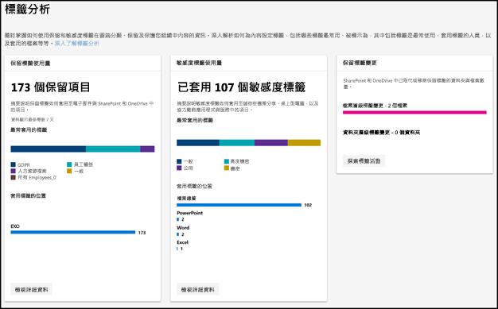
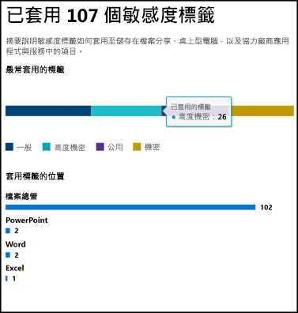
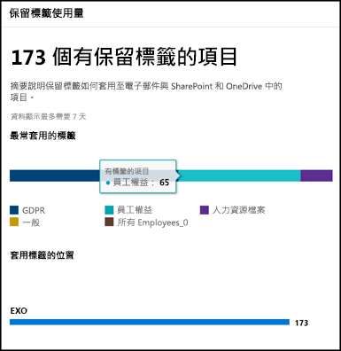

# 利用標籤分析檢視標籤使用量View label usage with label analytics

建立您的保留標籤和敏感度標籤後，您將想要查看租用戶間使用標籤的情況。After you create your retention labels and sensitivity labels, you’ll want to see how they’re being used across your tenant. 利用 Microsoft 365 合規性中心和 Microsoft 365 安全性中心中的標籤分析，您可以快速查看最常使用的標籤，以及套用標籤的位置。With label analytics in the Microsoft 365 compliance center and Microsoft 365 security center, you can quickly see which labels are used the most and where they’re being applied.

比方說，利用標籤分析，您可以檢視：For example, with label analytics, you can view the:

- 套用至內容的保留標籤和敏感度標籤的總數。Total number of retention labels and sensitivity labels applied to content.
- 最常使用的標籤和套用每個標籤的次數計數。Top labels and the count of how many times each label was applied.
- 套用標籤的位置和每個位置的計數。Locations where labels are applied and the count for each location.
- 已變更或移除其保留標籤的檔案和資料夾的計數。Count for how many files and folders had their retention label changed or removed.

您可以在 [Microsoft 365 合規性中心](https://compliance.microsoft.com/labelanalytics)或 [Microsoft 365 安全性中心](https://security.microsoft.com/labelanalytics) > 的 [分類]\*\*\*\* >  [標籤分析]\*\*\*\* 中找到標籤分析。You can find label analytics in the [Microsoft 365 compliance center](https://compliance.microsoft.com/labelanalytics) or [Microsoft 365 security center](https://security.microsoft.com/labelanalytics) > **Classification** > **Label analytics**.

## 敏感度標籤使用量Sensitivity label usage

有關敏感度標籤使用量的資料是從 Azure 資訊保護的報告提取，如需詳細資訊，請參閱 [Azure 資訊保護的集中報告](https://docs.microsoft.com/zh-TW/azure/information-protection/reports-aip)。The data on sensitivity label usage is pulled from the reports for Azure Information Protection – for more information, see [Central reporting for Azure Information Protection](https://docs.microsoft.com/zh-TW/azure/information-protection/reports-aip).

請注意，Azure 資訊保護報告具有[先決條件](https://docs.microsoft.com/zh-TW/azure/information-protection/reports-aip#prerequisites-for-azure-information-protection-analytics)，也適用於 Microsoft 365 合規性中心和 Microsoft 365 安全性中心中敏感度標籤的標籤分析。Note that the Azure Information Protection reports have [prerequisites](https://docs.microsoft.com/zh-TW/azure/information-protection/reports-aip#prerequisites-for-azure-information-protection-analytics) that also apply to label analytics on sensitivity labels in the Microsoft 365 compliance center and Microsoft 365 security center. 比方說，您需要包含記錄分析的 Azure 訂閱，因為這些報告為根據 Azure Log Analytics 服務，從 Azure 資訊保護用戶端與掃描器傳送資訊保護稽核事件至集中位置的結果。For example, you need an Azure subscription that includes the Log Analytics because these reports are a result of sending information protection audit events from Azure Information Protection clients and scanners to a centralized location based on Azure Log Analytics service.

針對敏感度標籤使用量：For sensitivity label usage:

- 資料中沒有任何延遲。There is no latency in the data. 這是即時的報告。This is a real-time report.
- 若要查看每個最常使用標籤的計數，請指向長條圖，然後讀取出現的工具提示。To see the count for each top label, point to the bar graph and read the tool tip that appears.
- 報告會顯示每個 App 套用敏感度標籤的位置 (其中會顯示每個位置的保留標籤)。The report shows where sensitivity labels are applied per app (whereas retention labels are shown per location).

## 保留標籤使用量Retention label usage

此報告會顯示最常使用標籤為何和套用標籤位置的快速檢視。This report shows a quick view of what the top labels are and where they’re applied. 如需 SharePoint 和 OneDrive 中的內容加標籤方式的詳細資訊，請參閱[檢視文件的標籤活動](view-label-activity-for-documents.md)。For more detailed information on how content in SharePoint and OneDrive is labeled, see [View label activity for documents](view-label-activity-for-documents.md).

針對保留標籤使用量：For retention label usage:

- 資料會每週彙總，因此可能需要最多 7 天，資料才會顯示在報告中。Data is aggregated weekly, so it may take up to seven days for data to appear in the report.
- 若要查看每個最常使用標籤的計數，請指向長條圖，然後讀取出現的工具提示。To see the count for each top label, point to the bar graph and read the tool tip that appears.
- 報告會顯示每個位置套用保留標籤的位置 (其中會顯示每個 App 的敏感度標籤)。The report shows where retention labels are applied per location (whereas sensitivity labels are shown per app).
- 針對保留標籤，這是您的租用戶中所有時間的資料摘要，未篩選至特定日期範圍。For retention labels, this is a summary of the all-time data in your tenant; it’s not filtered to a specific date range. 相反地，[標籤活動總管] 只會顯示過去 30 天的資料。By contrast, the [Label Activity Explorer](view-label-activity-for-documents.md) shows data from only the past 30 days.

## 檢視具有特定保留標籤的所有內容View all content with a specific retention label

從保留標籤使用量報告中，您可以快速瀏覽套用了該標籤的所有內容。From the retention label usage report, you can quickly explore all content with that label applied. (請注意，我們目前正在處理此功能，因此要檢視所有加標籤的內容，需要的步驟會較少。)(Note that we're currently working on this feature, so that it will take fewer steps to view all the labeled content.)

首先，選擇報告底端的 [檢視詳細資料]\*\*\*\*。First, choose **View Details** at the bottom of the report.

![保留標籤使用量報告下方的 [檢視詳細資料] 選項](media/retention-label-usage-view-details.png)

然後在右窗格中選擇 [保留標籤] > [探索項目]\*\*\*\*。Then choose a retention label > **Explore items** in the right pane.

![右窗格中的 [探索項目] 選項](media/retention-label-usage-explore-items.png)

針對該標籤，您可以選擇 [活動]\*\*\*\* 索引標籤以依位置檢視具有該標籤的項目計數。For that label, you can choose the **Activity** tab to view a count of items with that label by location.

![保留標籤的 [活動] 索引標籤](media/retention-label-usage-activity-tab.png)

您也可以選擇 [套用此標籤的項目]\*\*\*\* 索引標籤。然後可以深入了解特定位置：You can also choose the **Items with this label** tab. Then you can drill into specific locations:

- 針對 Exchange Online，您會看到信箱的清單，並含有每一個信箱中加標籤項目的計數。For Exchange Online, you see a list of mailboxes with the count of labeled items in each mailbox.
- 針對 SharePoint Online 和商務用 OneDrive，您會看到網站集合和 OneDrive 帳戶的清單，並含有每個位置中加標籤項目的計數。For SharePoint Online and OneDrive for Business, you see a list of site collections and OneDrive accounts with the count of labeled items in each location.

選擇信箱或網站集合時，您可以檢視該位置中具有該保留標籤的項目清單。When you choose a mailbox or site collection, you can view a list of items with that retention label in that location.

![[套用此標籤的項目] 索引標籤，顯示具有該保留標籤的所有項目](media/retention-label-usage-content-explorer.png)

## 權限Permissions

若要檢視標籤分析，您必須獲指派 Azure Active Directory 中的下列其中一個角色：To view label analytics, you must be assigned one of the following roles in Azure Active Directory:

- 全域系統管理員Global administrator
- 合規性系統管理員Compliance administrator
- 安全性系統管理員Security administrator
- 安全性讀取者Security reader

此外，請注意，這類報告會使用 Azure 監視器將資料儲存在您的組織擁有的 Log Analytics 工作區。In addition, note these reports use Azure Monitor to store the data in a Log Analytics workspace that your organization owns. 因此，應該將使用者新增為保留資料的 Azure 監視工作區的讀取者。如需詳細資訊，請參閱 [Azure 資訊保護分析所需的權限](https://docs.microsoft.com/zh-TW/azure/information-protection/reports-aip#permissions-required-for-azure-information-protection-analytics)。Therefore, the user should be added as a reader to the Azure Monitoring worksapce that holds the data - for more information, see [Permissions required for Azure Information Protection analytics](https://docs.microsoft.com/zh-TW/azure/information-protection/reports-aip#permissions-required-for-azure-information-protection-analytics).

