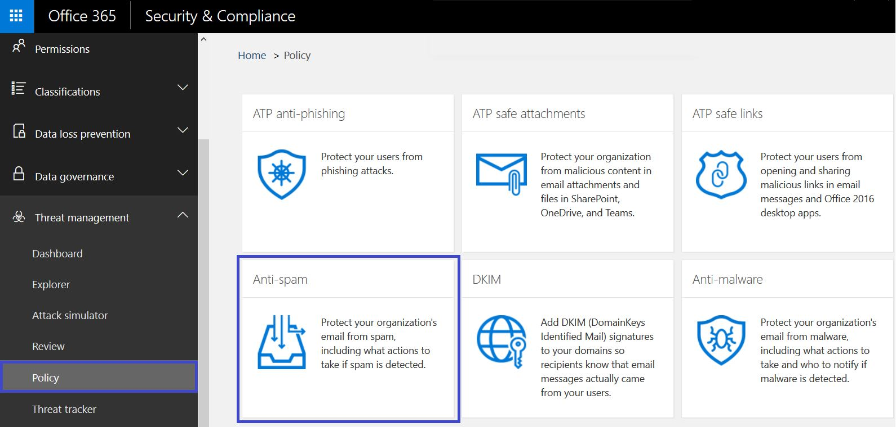

# 深入了解詐騙情報

在 [安全性] 中使用詐騙智慧&amp;規範中心**反垃圾郵件設定] 頁面上**檢閱所有寄件者是詐騙屬於貴組織的其中一個網域或詐騙的外部網域上。詐騙智慧是可用的 Office 365 企業版 E5 一部分或分開進階威脅保護的一部分。 
  
## 可以檢閱何種類型的電子郵件詐騙和其應該使用防止與詐騙智慧？

網域自己，您可以檢閱寄件者詐騙網域，然後選擇 [允許繼續或封鎖的寄件者寄件者。外部的網域，您可以讓結合傳送的基礎結構、 寄件者網域雖然沒有個別傳送電子郵件地址。
  
當寄件者假裝電子郵件地址時，其顯示寄送郵件代表某個貴組織的網域或傳送給組織外部網域內的一或多個使用者帳戶。令、 有詐騙有些合法的商業原因。例如，在下列情況下，有用封鎖來自詐騙網域寄件者：
  
- 您必須與協力廠商寄件者傳送大量郵件給公司投票的員工使用您的網域。
    
- 您有雇用外部的公司產生並送出代替您撥打電話通告或產品更新。
    
- 助理定期需要針對在組織內的另一個人傳送電子郵件。
    
- 設定為詐騙自己的組織為了傳送內部通知電子郵件應用程式。
    
外部網域經常傳送詐騙的電子郵件、 及的原因有許多是合法。例如，以下是一些合法的情況下時外部寄件者傳送詐騙的電子郵件：
  
- 寄件者位於討論郵寄] 清單中，並郵寄清單轉送電子郵件從原始寄件者至郵寄清單上的所有參與者。
    
- 外部的公司已傳送代表 （例如自動化的報表或軟體為-a-服務公司） 的其他公司的電子郵件。
    
您必須以確保不會在 Office 365 或外部的電子郵件系統中的垃圾郵件篩選器中取得的合法 spoofers 所傳送的信箱攔截一種方式。一般而言，Office 365 將這些電子郵件視為垃圾郵件。為 Office 365 系統管理員必須能夠設定安全性詐騙篩選器，以避免此&amp;規範中心。如果您擁有網域，您可以設定 SPF、 DKIM 及 DMARC 允許這些寄件者。
  
另一方面，惡意 spoofers，那些詐騙網域或傳送垃圾郵件或網路釣魚電子郵件的外部網域的寄件者必須被封鎖。詐騙也是網路釣客取得使用者認證的常用方式。Office 365 內可協助保護組織的寄件者從這些惡意的電子郵件的內建詐騙保護。詐騙保護您的組織的網域一定是在所有 Office 365 客戶，且外部網域詐騙保護在預設的進階威脅保護客戶。若要進一步增強此保護，告訴我們的寄件者已授權可詐騙貴組織的網域並代替您撥打電話時，傳送電子郵件和如果任何外部網域允許的詐騙。任何未授權的寄件者傳送的電子郵件會被視為垃圾郵件或 Office 365 所詐騙。留意詐騙網域的寄件者和說明我們藉由使用安全性改進詐騙智慧&amp;規範中心。
  
## 管理安全性詐騙智慧&amp;規範中心

設定 「 詐騙智慧原則一定會強制執行 Office 365 所。您無法停用，但您可以選擇您想要主動管理它的多少。
  
您可以檢閱的寄件者詐騙網域或外部網域，然後決定是否應該允許每個寄件者使用安全性進行&amp;規範中心。寄件者假裝從您的網域或外部網域各詐騙的使用者帳戶，您可以在下表中檢視的資訊。
  
|**參數**|**描述**|
|:-----|:-----|
|Sender    |也稱為則為 true 的寄件者。這通常是詐騙電子郵件的來源的網域。Office 365 決定指標詐騙貴組織的傳送端 IP 位址 (PTR) DNS 記錄的網域。如果有不找到任何網域，報表會改用顯示寄件者的 IP 位址。    |
|詐騙的使用者    |詐騙寄件者的使用者帳戶。    **內部**] 索引標籤僅。此欄位包含單一電子郵件地址或如果寄件者詐騙多個使用者帳戶，包含**一個以上**。  僅**外部**索引標籤。外部網域只包含傳送端網域，並不包含完整的電子郵件地址。  > [!TIP]> **的進階 admins。** 詐騙的使用者是從也是由郵件用戶端顯示 From 地址的地址 (5322.From) 地址。這有時稱為 header.from 地址。由 SPF 不檢查此位址此有效性。           |
|訊息數目    |代表已識別詐騙的寄件者或寄件者您組織在過去 30 天內寄件者傳送的郵件數目。    |
|使用者抱怨的數目    |過去 30 天內欄位所針對此寄件者的使用者使用您的使用者抱怨。客訴通常是向 Microsoft 垃圾送出表單中。    |
|驗證結果    |這個值是**傳遞**如果寄件者通過 Exchange Online Protection (EOP) 寄件者驗證檢查，例如 SPF 或 DKIM、**失敗**如果寄件者失敗 EOP 寄件者驗證檢查或**未知**如果這些檢查的結果不是已知。    |
|所設定的決策    |顯示 Office 365 系統管理員或詐騙智慧原則是否決定允許寄件者詐騙使用者。    |
|上次呈現    |在其上接收到郵件從此寄件者代表此詐騙使用者終止日期。    |
|允許詐騙吗？    | 會顯示允許從此寄件者傳送代表詐騙使用者的電子郵件。可能的值包括：  **[是]** 允許從此詐騙的寄件者的所有詐騙的位址詐騙貴組織。    **否**將不會允許從此詐騙的寄件者的詐騙的位址詐騙貴組織。而是從此寄件者的郵件將 Office 365 所標示為垃圾郵件。  **一些使用者**如果寄件者詐騙多位使用者，允許從此寄件者一些詐騙的位址詐騙組織、 其餘部分將會標示為垃圾郵件。若要查看特定地址使用 [**詳細資料**] 索引標籤。  |
|詐騙類型    |這個值是**內部**網域時的其中一個您的組織已佈建網域，否則值是**外部**。    |
   
 **若要管理寄件者所使用的安全性詐騙網域&amp;規範中心**
  
1. 移至 [[安全性&amp;規範中心](https://protection.office.com)。
    
2. 以您工作或學校的帳戶登入 Office 365。您的帳戶必須在 Office 365 組織中系統管理員認證。
    
3. 安全性&amp;規範中心展開**Threat Management** \> **原則** \> **反垃圾郵件**。
  

  
4. 在右窗格中的**反垃圾郵件設定**] 頁面上選取 [**自訂**] 索引標籤，然後向下捲動和**詐騙智慧原則**。 
  

  
5. 若要檢視的詐騙網域的寄件者清單，選擇 [**檢閱新的寄件者**和選取 * * 您的網域 * *] 索引標籤。 
    
    如果您已經過檢閱寄件者，並想要變更一些您先前的選擇，您可以選擇**我已檢閱 Show me 寄件者**而。不論執行哪項中會出現下列面板。 
  

  
詐騙的每個使用者會顯示在個別的資料列，讓您可以選擇是否要允許或封鎖來自詐騙每位使用者個別寄件者。
  
將寄件者新增至使用者的 [允許] 清單中，從 [**允許] 詐騙**] 欄中選取 **[是]** 。若要將寄件者新增至使用者的 [封鎖] 清單中，選擇 [**否]**。
  
網域將原則設定您無法擁有，選取 [**外部網域**] 索引標籤變更任何寄件者為 **[是]** 允許未經驗證的電子郵件傳送至您的組織的寄件者的 [**允許詐騙**] 欄中。或者，如果您認為 Office 365 所做的 documents 傳送詐騙的電子郵件寄件者的錯誤，**允許以詐騙**資料行變更為 [**否]**。 
  

  
6. 選擇 [**儲存**] 以儲存任何變更。 
    
## 設定反詐騙原則

除了允許或封鎖來自詐騙的電子郵件傳送至您的組織特定寄件者，您也可以設定您想要篩選方式嚴格、 詐騙郵件找到時，所採取的動作和要啟用 Safety 秘訣反詐騙。
  
反詐騙保護會套用至電子郵件來自網域至 Office 365 組織外部的寄件者。您可以將原則套用至收件者的信箱已授權的 Office 365 企業版 E5 或進階威脅保護。您可以管理反詐騙及其他 ATP 反網路釣魚設定原則。如需 ATP 反網路釣魚設定的詳細資訊，請參閱[Set up Office 365 反網路釣魚原則](https://support.office.com/article/set-up-office-365-atp-anti-phishing-policies-5a6f2d7f-d998-4f31-b4f5-f7cbf6f38578?ui=en-US&amp;rs=en-US&amp;ad=US#phishpolicyoptions)。
  
Office 365 包含預設反詐騙保護一律執行。此預設保護看不見安全性&amp;規範中心或透過 Windows PowerShell cmdlet 可擷取。您無法修改預設反詐騙保護。但是，您可以設定 Office 365 如何嚴格強制在您建立的每個反網路釣魚原則中的反詐騙保護。 
  
即使反詐騙原則會出現 [安全性 ATP 反網路釣魚原則&amp;規範中心它不會繼承其預設行為從現有的網路釣魚底下的反垃圾郵件組態設定。如果您有之下**反垃圾郵件**設定\>**網路釣魚**想要複製的反詐騙，您必須建立反網路釣魚原則，然後編輯反網路釣魚原則以反映您詐騙的設定身分詐騙部分下一節，而不是接受在背景執行的預設設定中所述。 
  
 **使用 [安全性設定反詐騙保護反網路釣魚原則內&amp;規範中心**
  
1. 移至 [[安全性&amp;規範中心](https://protection.office.com)。
    
2. 以您工作或學校的帳戶登入 Office 365。您的帳戶必須在 Office 365 組織中系統管理員認證。
    
3. 安全性&amp;規範中心展開**Threat Management** \> **原則** \> **ATP 反網路釣魚**。 
    
4. 在右窗格中的**反網路釣魚**] 頁面上，選取您想要設定的反網路釣魚原則。 
    
5. 在出現，請在**詐騙**] 資料列] 頁面上選擇 [**編輯**]。 
    
6. 在**詐騙臨界值**] 頁面上，如果您選取 [**預設值**，則會傳遞明確或隱含通過驗證的所有郵件，亦即會傳送一般電子郵件篩選。如果您選取**嚴格**，然後使用中型信賴隱含通過驗證的郵件也稱為"柔複雜"複合式驗證、 可以略過仍以及標示為詐騙電子郵件。嚴格的設定不積極並且將會產生誤判。讓您選擇，然後選取 [**動作**。 
  

  
7. 下一步] 設定時為跨網域詐騙偵測到的郵件時要採取的動作。若要將郵件移至 [收件者的垃圾郵件] 資料夾是預設行為。若要將郵件傳送至隔離區是其他選項。如需管理傳送至隔離郵件的詳細資訊，請參閱[Office 365 中的隔離電子郵件訊息](quarantine-email-messages.md)。
  

  
8. 選擇是否要啟用或停用反詐騙 safety 秘訣。Office 365 建議以警告時他們互動寄件者已不驗證身分識別的使用者啟用該**驗證會失敗**safety 提示。Office 365 也建議針對較小群使用者的**驗證虛複雜**啟用 safety 提示因為如果使用者接收電子郵件從許多合法，但未獲授權來源此 safety 提示可能會產生許多的警告。 
  

  
讓您選擇，然後選取 [**儲存**。 
    
## 若要管理詐騙和網路釣魚與 Office 365 的其他方式

是嚴有關詐騙和網路釣魚保護。以下是檢查詐騙網域的寄件者和協助防止會毀損貴組織的相關的方法：
  
- 檢查您的例行工作的一部分的 Exchange Online Protection 詐騙的郵件] 報告。您可以使用這份報告通常以檢視和協助管理詐騙的寄件者。資訊，請參閱**詐騙郵件報告**中[使用郵件保護報告以檢視有關惡意程式碼、 垃圾郵件和規則偵測的 Office 365 中](https://technet.microsoft.com/library/dn500744%28v=exchg.150%29.aspx)。
    
- 更多進階 Office 365 系統管理員：
    
  - 檢閱您的寄件者原則架構 (SPF) 設定。快速介紹 SPF 以及要取得其快速地設定，請參閱[Set up SPF 避免詐騙的 Office 365 中](https://technet.microsoft.com/library/dn789058%28v=exchg.150%29.aspx)。更深入了解 Office 365 如何使用 SPF，或者例如混合部署的疑難排解或非標準部署開始使用[Office 365 如何使用寄件者原則架構 (SPF) 若要防止詐騙](https://technet.microsoft.com/library/mt712724%28v=exchg.150%29.aspx)。
    
  - 檢閱您 DomainKeys 識別郵件 (DKIM) 的設定。您應該使用 DKIM 除了 SPF 和 DMARC 避免 spoofers 傳送看起來像它們來自您網域的郵件。DKIM 可讓您將數位簽章新增至郵件標頭中的電子郵件訊息。資訊，請參閱[使用 DKIM 驗證自 Office 365 中您網域傳送的輸出電子郵件](https://technet.microsoft.com/library/mt695945%28v=exchg.150%29.aspx)。
    
  - 檢閱您網域式訊息驗證，Reporting，and Conformance (DMARC) 的設定。實作與 SPF 和 DKIM DMARC 提供其他保護詐騙和網路釣魚電子郵件。DMARC 協助接收的郵件系統決定如何處理郵件會從您網域傳送未通過 SPF 或 DKIM 檢查。資訊，請參閱[使用 DMARC 來驗證 Office 365 中的電子郵件](https://technet.microsoft.com/library/mt734386%28v=exchg.150%29.aspx)。
    
  - 使用[Get PhishFilterPolicy](https://technet.microsoft.com/en-us/library/mt735158%28v=exchg.160%29.aspx) Windows PowerShell 指令程式來收集詐騙的寄件者的詳細的資料、 產生允許與封鎖清單，並協助您決定如何產生更完整的 SPF、 DKIM 及 DMARC DNS 記錄而不需要您合法電子郵件取得攔截外部垃圾郵件篩選器中。如需詳細資訊，請參閱[antispoofing 保護 Office 365 中的運作方式](https://blogs.msdn.microsoft.com/tzink/2016/02/23/how-antispoofing-protection-works-in-office-365/)。
    

