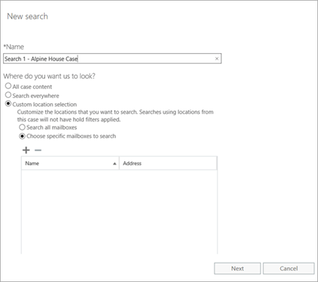

# <a name="manage-ediscovery-cases-in-the-security--compliance-center"></a>管理安全性 & 合規性中心中的 eDiscovery 案例

您可以使用 eDiscovery 案例中安全性 & 合規性中心，以控制可以建立、 存取及管理組織中的 eDiscovery 案例。 如果您的組織有 Office 365 E5 訂閱，您也可以使用 eDiscovery 案例來使用 Office 365 進階電子文件探索分析搜尋結果。
  
EDiscovery 案例可讓您將成員新增至案例，控制哪些類型的特定案例的成員可以執行，保留內容位置相關的法律案件，並關聯的單一案例中的多個內容搜尋的動作。 您也可以匯出與案例相關聯任何內容搜尋的結果或準備進階 eDiscovery 中分析的搜尋結果。 eDiscovery 案例是一個好方法來限制誰可以存取特定的法律案件的內容搜尋和搜尋結果中您的組織。
  
使用下列工作流程來設定和安全性 & 合規性中心] 及 [進階電子文件探索中使用 eDiscovery 案例。
  
[步驟 1： 將 eDiscovery 權限指派給潛在的案例成員](manage-ediscovery-cases.md#step1_1)
  
[步驟 2： 建立新的案例](manage-ediscovery-cases.md#step2_1)
  
[步驟 3： 將成員新增至案例](manage-ediscovery-cases.md#step2a_1)
  
[步驟 4： 就地保留上的內容位置](manage-ediscovery-cases.md#step3_1)
  
[步驟 5： 建立及執行與案例相關聯的內容搜尋](manage-ediscovery-cases.md#step4_1)
  
[步驟 6： 匯出與案例相關聯的內容搜尋的結果](manage-ediscovery-cases.md#step5_1)
  
[步驟 7： 準備搜尋結果的進階電子文件](manage-ediscovery-cases.md#step7_1)
  
[步驟 8： 移至進階電子文件中的案例](manage-ediscovery-cases.md#gotoAeD_1)
  
[（選用）步驟 9： 關閉案例](manage-ediscovery-cases.md#closecase_1)
  
[（選用）步驟 10： 重新開啟關閉的案例](manage-ediscovery-cases.md#reopencase_1)
  
[詳細資訊](manage-ediscovery-cases.md#moreinfo_1)
  
## <a name="step-1-assign-ediscovery-permissions-to-potential-case-members"></a>步驟 1： 將 eDiscovery 權限指派給潛在的案例成員
<a name="step1_1"> </a>

第一個步驟是將適當的 eDiscovery 相關權限指派給人員，以便您可以將其新增至 eDiscovery 案例在步驟 2 中。 您必須是 「 組織管理 」 角色群組的成員 （或獲指派 「 角色管理角色） 中的安全性 & 合規性中心，以指派 eDiscovery 權限。 下列清單說明安全性 & 合規性中心中的 eDiscovery 相關的角色群組。
  
- **檢閱者**這個角色群組具有最嚴格的 eDiscovery 相關權限。 此群組的成員只能看到並開啟安全性 & 他們是成員的合規性中心中的 [ **eDiscovery** ] 頁面上的情況下的清單。 他們無法建立的情況下，將成員新增至案例、 建立保留、 建立搜尋、 匯出搜尋結果或準備進階電子文件中的結果。 不過，成員可以存取執行分析工作的進階電子文件中的案例。 
    
- **eDiscovery 管理員**這個角色群組的成員可以建立及管理 eDiscovery 案例。 他們可以新增和移除成員、 將的內容上的位置保留、 建立及編輯與案例相關聯的內容搜尋、 匯出內容搜尋結果，並準備進階 eDiscovery 中分析的搜尋結果。 有兩個此角色群組中的子群組。 這些子群組之間的差異根據範圍。
    
  - **eDiscovery 管理員**可以檢視及管理 eDiscovery 案例他們建立或成員。 如果其他 eDiscovery 管理員會建立案例，但不會將第二個 eDiscovery 管理員新增為該案例的成員，第二個 eDiscovery 管理員無法檢視或在安全性 & 合規性中心中開啟 [ **eDiscovery** ] 頁面上的案例。 eDiscovery 管理員也可以存取其執行分析工作的進階電子文件中的案例。 
    
  - **eDiscovery 系統管理員**可以執行 eDiscovery 管理員可以執行的所有案例的管理工作。 此外，eDiscovery 系統管理員可以：
    
  - 檢視 [eDiscovery]**** 頁面上列出的所有案例。 
    
  - 在自行新增為案例的成員之後管理組織中的任何 eDiscovery 案例。
    
  - 在 [進階電子文件，例如處理進行分析案例資料、 設定案例，以及進階電子文件的資料匯出執行管理工作。 這是因為在安全性 & 合規性中心 eDiscovery 系統管理員的人員會自動新增為系統管理員可以在進階電子文件。
    
    請參閱您可能想 eDiscovery 系統管理員在組織中原因的[詳細資訊](manage-ediscovery-cases.md#moreinfo_1)一節。 
    
> [!IMPORTANT]
> 如果某人不屬於其中一個 eDiscovery 相關的角色群組，或不是已指派 「 檢閱者 」 角色的角色群組的成員，您無法將其新增為 eDiscovery 案例的成員。 
  
 **若要指派 eDiscovery 權限：**
  
1. 移至 [https://compliance.microsoft.com](https://compliance.microsoft.com)。
    
2. 使用公司或學校帳戶登入 Office 365。
    
3. 在安全性 & 合規性中心中，按一下 [**權限**，，然後執行下列其中一個下列根據您想要指派 eDiscovery 權限。
    
  - 若要指派檢閱者權限，請選取 「**檢閱者**」 角色群組，然後再按一下 [**成員**] 旁的 [**編輯**。 按一下 [**選擇成員**，請按一下 [**新增**選取的使用者，您想要新增至 「 檢閱者 」 角色群組，然後按一下 [**新增]**。
    
  - 若要指派 eDiscovery 管理員 」 權限，請選取**eDiscovery 管理員**角色群組、，然後按一下 [ **eDiscovery 管理員**] 旁的 [**編輯**。 依序按一下 [**選擇電子文件探索管理員**、* * 新增 * *，選取您想要新增為 eDiscovery 管理員] 中，使用者，然後按一下 [**新增]**。
    
  - 若要指派 eDiscovery 系統管理員權限，請選取**eDiscovery 管理員**角色群組，然後再按一下 [ **eDiscovery 系統管理員**] 旁的 [**編輯**。 依序按一下 [**選擇電子文件探索管理員**、**新增**選取您想要新增為 eDiscovery 系統管理員的使用者]，然後按一下 [**新增]**。
    
4. 您已新增所有使用者之後，按一下 [**完成**]，按一下 [**儲存**] 以將變更儲存到角色群組、，然後按一下 [**關閉**。
    

  
## <a name="step-2-create-a-new-case"></a>步驟 2： 建立新的案例
<a name="step2_1"> </a>

下一步是建立新的 eDiscovery 案例。 您必須是要建立 eDiscovery 案例 eDiscovery 管理員角色群組的成員。 如先前所述，您建立新的案例中安全性 & 合規性中心之後, 您 （和其他案例的成員） 能夠存取，進階電子文件中的相同案例如果您的組織有 Office 365 E5 訂閱。
  
1. 移至 [https://compliance.microsoft.com](https://compliance.microsoft.com)。
    
2. 使用公司或學校帳戶登入 Office 365。
    
3. 在 [安全性 & 合規性中心中，按一下 [ **eDiscovery** \> **eDiscovery**]，然後按一下 [**建立案例**。
    
4. 在**新的案例**頁面上，為這種情況命名，鍵入選擇性描述，，然後按一下**儲存**。 請注意，案例名稱必須是唯一在組織中。
    
    ![新案例] 頁面上](media/538f66b8-eb6e-4c4c-83d8-7154fd85883a.png)
  
    新的案例會顯示在 [ **eDiscovery** ] 頁面上的案例清單。 請注意，您可以游標停留在案例名稱以顯示資訊的情況下，包括案例 （**作用中**或**已關閉**） 的狀態的描述 （也就建立在先前步驟中） 的情況下，且這種情況時上次變更和誰變更它。
    
    > [!TIP]
    > 建立新的案例之後，您可以隨時命名。 只要按一下 [ **eDiscovery** ] 頁面上的大小寫名稱。 在 [**管理此情況下**彈出式頁面上，變更顯示在 [**名稱**] 方塊中的名稱，然後儲存變更。 
  
## <a name="step-3-add-members-to-a-case"></a>步驟 3： 將成員新增至案例
<a name="step2a_1"> </a>

建立新的案例之後下, 一步是將成員新增至案例。 如同先前的說明，為成員的檢閱者的使用者或 eDiscovery 管理員角色群組可以新增為案例的成員。 請注意 eDiscovery 案例的建立者的管理員會自動新增為成員。
  
1. 在 [安全性 & 合規性中心中，按一下 [ **eDiscovery** \> **eDiscovery**來顯示貴組織中的案例清單。 
    
2. 按一下您想要將成員新增至案例的名稱。
    
    **管理此情況下**彈出式頁面隨即顯示。 
    
    ![按一下 [大小寫名稱以顯示 [管理此案例] 頁面上](media/2364dc08-a3dc-4724-acf4-7a68c8588e6f.png)
  
3. [**管理成員**] 下方按一下 [**新增**]，以將成員新增至案例。 
    
4. 在清單中的人員可以新增為案例的成員，按一下您要新增至案例的人員名稱旁邊的核取方塊。
    
    > [!TIP]
    > 如果您有大型清單的人員可以新增為成員，使用 [**搜尋**] 方塊來搜尋特定人員清單中。 
  
5. 您選取的人員新增為群組的成員之後，按一下 [**新增**]。
    
    在 [**管理此情況下**，按一下 [**儲存**] 以儲存新的案例成員的清單。 
    
6. 按一下 [**儲存**] 以儲存新的案例成員的清單。 
  
## <a name="step-4-place-content-locations-on-hold"></a>步驟 4： 就地保留上的內容位置
<a name="step3_1"> </a>

您可以使用 eDiscovery 案例來建立保留來保留可能會與案件相關的內容。 您可以保留的信箱和 OneDrive for Business 網站的人員負責 custodians 的情況下。 您也可以將保留在群組信箱、 SharePoint 網站與 OneDrive for Business 網站的 Office 365 群組。 同樣地，您可以保留的信箱和 Microsoft Teams 相關聯的網站。 當您將保留內容的位置時，內容會保留直到您從內容的位置，或直到您刪除保留移除保留為止。
  
當您建立保留時，您會有範圍的內容，會保留在指定的內容位置中的下列選項：
  
- 您建立其中所有內容都會都被保留無限期保留。 或者，您可以建立查詢式的保留保留放置只有符合搜尋查詢的內容。
    
- 您可以指定日期範圍，以保留，已傳送、 接收或建立該日期範圍內的內容。 或者，您可以保留不論當它已傳送、 接收或建立的所有內容。
    
> [!NOTE]
> 您最多可包含 10000 跨組織中的所有 eDiscovery 案例保留原則。 
  
若要建立 eDiscovery 案例保留：
  
1. 在 [安全性 & 合規性中心中，按一下 [ **eDiscovery** \> **eDiscovery**來顯示貴組織中的案例清單。 
    
2. 您想要建立保留的案例旁邊，按一下 [**開啟**]。 
    
3. 在**首頁**上的情況下，按一下 [**保留**]。
    
    ![按一下 [保留以顯示 [案件保留] 頁面。](media/25c0300a-bd33-4443-a121-d595b1a3e00f.png)
  
4. 在 [**保留**] 頁面上，按一下 [**新增**。
    
5. 在 [**建立新的保留**] 頁面上指定保留的名稱。 保留名稱必須是您組織中唯一的。 
    
6. 選擇 [內容位置，您想要就地保留。 您可以在保留上放置信箱、 網站及公用資料夾。
    
    
  
1. **信箱**按一下 [**新增**來指定要就地保留的信箱。 使用 [搜尋] 方塊來尋找要就地保留的使用者信箱和通訊群組 （來保留群組成員的信箱）。 您可以也保留相關聯的信箱上的 Office 365 群組或 Microsoft 小組。 
    
    > [!NOTE]
    > 當您按一下 [**新增**若要指定要就地保留的信箱，會顯示信箱選擇器是空的。 這項設計的目的是提升效能。 若要將人員新增至這份清單，在 [搜尋] 方塊中輸入的名稱 （最少的 3 個字元），然後按一下 [**搜尋**。 
  
2. **網站**按一下 [**新增**指定 SharePoint 和 OneDrive for Business 網站来就地保留。 輸入您想要就地保留每個網站的 URL。 您也可以新增 SharePoint 網站的 URL 的 Office 365 群組或 Microsoft 小組。 
    
    請參閱 <<c0>的詳細資訊] 區段中，將 Office 365 群組和 Microsoft Teams 放入保留的秘訣。 
    
    > [!NOTE]
    > 會變更人員的使用者主要名稱 (UPN) 的少數情況下，其 OneDrive 帳戶的 URL 也會變更以納入新的 UPN。 如果發生這種情況，您必須新增使用者的新 OneDrive URL，並移除舊來修改保留。 
  
3. **公用資料夾**按一下 [將所有公用資料夾放在您 Exchange Online 組織上的保留**保留所有公用資料夾**。 請注意，您無法選擇特定公用資料夾移轉至置於保留。 保留選取如果您不想要保留的公用資料夾上的 [**不保留任何公用資料夾**] 選項。 
    
7. 當您完成新增至保留的內容位置時，按一下 [**下一步**]。
    
8. 若要建立查詢式保留與條件，完成下列設定。 否則，只要按一下 [**完成**] 以保留所有內容。 
    
    
  
    如需有關建立搜尋查詢和使用條件的詳細資訊，請參閱[關鍵字查詢和搜尋條件的內容搜尋](keyword-queries-and-search-conditions.md)。
    
1. 下] 方塊中**什麼您希望我們要尋找的？**，以便符合搜尋準則的內容處於保留狀態] 方塊中輸入搜尋查詢。 您可以指定關鍵字，郵件內容或文件屬性，例如檔案名稱。 您也可以使用更複雜的查詢，使用布林運算子，例如**AND**、 **OR**，或**不**。 如果您讓 [關鍵字] 方塊空白，則位於指定的內容位置中的所有內容將會都放在保留。 
    
2. **條件**，按一下 [**新增條件，** 若要新增一或多個條件來縮小搜尋查詢的保留。 每個條件將子句新增至 KQL 搜尋查詢，建立及執行當您建立保留。 例如您可以指定日期範圍，以便電子郵件或站台內遠距的日期所建立的文件會處於暫止狀態。 條件會以 **AND** 運算子的邏輯方式連接至關鍵字查詢 (在關鍵字方塊中指定)。 保留，表示項目必須滿足的關鍵字查詢和要放在條件。 
    
9. 後設定查詢式保留中，按一下 [**完成**] 以建立保留。 
  
### <a name="hold-statistics"></a>保留統計資料

在一段時間之後, 會選取保留的 [**保留**] 頁面的詳細資料窗格中顯示新的保留相關資訊。 此資訊包括的信箱數目站台上的按住並保留已處於內容相關的統計資料，例如總數和大小的項目處於保留狀態，而且上一次的保留所計算的統計資料。 這些保留統計值能協助您識別舉行多少的 eDiscovery 案例相關的內容。 
  

  
請謹記下列事項需要注意的保留統計資料：
  
- 保留的項目數總計會指出從會處於保留狀態的所有內容來源的項目數。 如果您已建立查詢式保留功能，這項統計資料會指出符合查詢的項目數。
    
- 保留的項目數也包含的內容位置中找到的未編製索引項目。 請注意，是否您建立查詢式保留時，內容位置中所有未編製索引的項目會處於保留狀態。 這包括未編製索引的項目不符合搜尋準則的查詢式保留和未編製索引的項目可能以外的日期範圍條件。 這是不同於執行內容搜尋] 中，其中不符合搜尋查詢或日期範圍條件會排除的未編製索引項目不包含在搜尋結果時，會發生什麼事。 如需未編製索引的項目的詳細資訊，請參閱 <<c0>在 Office 365 中的內容搜尋中未編製索引項目。
    
- 您可以取得最新的保留統計資料**更新統計資料**，重新執行搜尋，即可估計，計算目前的保留的項目數目。 如有必要，請按一下 [**重新整理**在工具列中，以更新詳細資料窗格中的保留統計資料。 
    
- 若要增加一段時間，因為使用者其信箱或網站是保留通常會傳送或接收新的電子郵件訊息及建立新的 SharePoint 和 OneDrive for Business 文件保留它的內文中的項目數目。
  
## <a name="step-5-create-and-run-a-content-search-associated-with-a-case"></a>步驟 5： 建立及執行與案例相關聯的內容搜尋
<a name="step4_1"> </a>

建立 eDiscovery 案例，並與案例相關的任何 custodians 會處於保留狀態之後，您可以建立及執行一或多個與案例相關聯的內容搜尋。 在安全性 & 合規性中心中的 [**搜尋**] 頁面上未列出與案例相關聯的內容搜尋。 這表示，與案例相關聯的內容搜尋僅可由大小寫的小組成員，也是 「 eDiscovery 管理員 」 角色群組的成員。 
  
1. 在 [安全性 & 合規性中心中，按一下 [ **eDiscovery** \> **eDiscovery**來顯示貴組織中的案例清單。 
    
2. 您想要建立 「 內容搜尋 」 中的案例旁邊，按一下 [**開啟**]。 
    
3. 在**首頁**上的情況下，按一下 [**搜尋**]。
    
    ![在這種情況的首頁上，按一下 [搜尋]](media/bd358eb3-12d4-4f0c-8317-d192286813d0.png)
  
4. 在 [**搜尋**] 頁面上，按一下 [**新增**。
    
5. 在 [**新搜尋**] 頁面上，輸入搜尋的名稱。 與案例相關聯的內容搜尋必須有 Office 365 組織內是唯一的名稱。 
    
6. 選擇您想要搜尋的內容位置。 您可以在相同的搜尋來搜尋信箱、 網站及公用資料夾。
    
    ![搜尋案例的內容位置] 中，所有內容的位置，或選取特定的內容位置](media/08c523dc-cba8-4fce-aee6-f86251204393.png)
  
1. **所有案例的內容**選取此選項可搜尋已被置於保留的情況下的所有內容位置。 如果案例包含多個保留，當您選取此選項時，便會搜尋從所有的保留位置的內容。 此外，如果查詢式保留打電話內容的位置，只會保留的項目便會搜尋當您執行您要在此步驟中建立的內容搜尋。 例如，如果使用者已處於查詢為基礎的案例保留，會保留已傳送或特定日期之前建立的項目，這些項目會搜尋所使用的內容搜尋的搜尋準則。 這被透過連線的案例保留查詢和使用**AND**運算子的內容搜尋查詢。 請參閱如需詳細資訊搜尋案例內容本文結尾處的[詳細資訊](manage-ediscovery-cases.md#moreinfo_1)一節。 
    
2. **搜尋位置**選取此選項可搜尋組織中的所有內容位置。 當您選取此選項時，您可以選擇搜尋所有 Exchange 信箱 （這包括信箱的所有 Office 365 群組和 Microsoft Teams），所有 SharePoint 和 OneDrive for Business 網站 （其中包含所有 Office 365 群組和 Microsoft 的網站Teams)，及其所有的公用資料夾。
    
3. **自訂位置選取項目**選取此選項以選取您想要搜尋的網站與信箱。 當您選取此選項時，信箱和網站的清單會預先填入位置會置於保留案例內的內容。 您也可以選擇在組織中搜尋所有公用資料夾。
    
    
  
    如果您選取此選項，並搜尋上的任何內容位置，但保留，從查詢為基礎的案例保留任何查詢不會套用至搜尋查詢。 換句話說，搜尋所有位置中的內容，而不只是查詢為基礎的案例保留所要保留的內容。
    
    您可以移除的預先填入的大小寫內容位置，或新增新的。 如果您選擇此選項，您也可以搜尋特定服務 （例如搜尋所有 Exchange 信箱） 的所有內容位置的彈性，或您可以搜尋特定的內容位置的服務。 您也可以選擇要搜尋組織中的公用資料夾。
    
    新增要搜尋的內容位置時，請謹記下列事項：
    
  - 當您按一下 [**新增**若要指定要搜尋信箱，會顯示信箱選擇器是空的。 這項設計的目的是提升效能。 若要新增至這份清單的收件者，在 [搜尋] 方塊中輸入的名稱 （最少的 3 個字元），然後按一下 [**搜尋**。
    
  - 您可以將非使用中信箱、 Office 365 群組、 Microsoft Teams 和通訊群組新增至要搜尋的信箱清單。 不支援動態通訊群組。 如果您新增 Office 365 群組或 Microsoft Teams，被搜尋的群組或小組信箱;無法搜尋的群組成員的信箱。
    
  - 如果您不想要在搜尋中包含任何信箱或網站，選取**要搜尋的選擇特定信箱**或**選擇特定網站新增至搜尋**，但不信箱或網站新增至清單。
    
  - 若要新增網站按一下 [**新增**，然後輸入您想要搜尋每個網站的 URL。 您也可以新增 SharePoint 網站的 URL 的 Office 365 群組和 Microsoft Teams。 
    
7. 之後您選取要搜尋，請按一下 [**下一步**的內容位置。
    
8. 在 [新搜尋]**** 頁面上，您可以新增關鍵字和條件來建立搜尋查詢。 <br/>
  
9. 在 [您希望我們尋找什麼?]**** 下方的方塊，在方塊中輸入搜尋查詢。 您可以指定關鍵字、例如傳送和接收日期的郵件屬性，或者例如檔案名稱或文件上次變更的日期的文件屬性。 您可以使用更複雜的查詢，請使用布林運算子，例如**AND**、**或**、**不**、 **NEAR**或**ONEAR**。 您也可以搜尋 （如社會安全編號） 中的文件或外部共用的文件中搜尋的敏感資訊。 如果您將 [關鍵字] 方塊保留空白，位於指定的內容位置中的所有內容將會都包含在搜尋結果中。 
    
10. 您可以按一下**顯示關鍵字清單**] 核取方塊並輸入每一列中的關鍵字。 如果您這麼做時，每一列上的關鍵字來建立搜尋查詢中的**OR**運算子連線。 
    
    
  
    為什麼要使用關鍵字清單？ 您可以取得顯示多少個項目比對每個關鍵字的統計資料。 這可協助您快速找出哪些關鍵字是最 （和至少） 有效。 您也可以使用 （以括號括住） 的關鍵字文句] 列中。 如需搜尋統計資料的詳細資訊，請參閱 <<c0>檢視的內容搜尋結果的關鍵字統計資料。
    
    如需使用關鍵字清單的詳細資訊，請參閱 <<c0>的詳細資訊。
    
11. 按一下 [檢查您的查詢不受支援的字元，以及可能不會被大寫的布林值運算子 [**檢查查詢錯字**。 不支援的字元通常隱藏和通常會造成搜尋錯誤或傳回非預期的結果。 如需會檢查不支援字元的詳細資訊，請參閱[檢查您的內容搜尋查詢有錯誤](check-your-content-search-query-for-errors.md)。
    
12. **條件**，將新增至搜尋查詢以縮小搜尋範圍，並傳回更精細的結果集的條件。 每個條件會將一個子句新增至 KQL 搜尋查詢，當您啟動搜尋時便會建立並執行。 條件會以 **AND** 運算子的邏輯方式連接至關鍵字查詢 (在關鍵字方塊中指定)。 這表示結果中包含的項目必須同時滿足關鍵字查詢與條件。 這就是條件如何協助您縮小搜尋結果。 
    
    如需建立搜尋查詢和使用條件的相關資訊，請參閱 [Keyword queries for Content Search](keyword-queries-and-search-conditions.md)。
    
13. 按一下 [搜尋]**** 以儲存搜尋設定並開始搜尋。 
    
    已啟動搜尋。 在一段時間之後, 的估計項目在搜尋結果會顯示在詳細資料窗格中。 預估包括的總大小和數目符合搜尋準則的項目。 搜尋 estimate 也包括所搜尋的內容位置的未編製索引的項目數。 不符合搜尋準則的未建立索引的項目數會包含在詳細資料窗格中顯示的搜尋統計資料。 如果搜尋查詢 （因為其他郵件或文件的內容符合搜尋準則） 未編製索引的項目相符，就不會包括在估計的未編製索引的項目數目。 如果未編製索引的項目會排除的搜尋準則，它也不會包括在未編製索引的項目估計值。
    
    在搜尋完成之後，您可以預覽搜尋結果。 如有必要，請按一下 [**重新整理**以更新詳細資料窗格中的資訊。 
  
## <a name="step-6-export-the-results-of-a-content-search-associated-with-a-case"></a>步驟 6： 匯出與案例相關聯的內容搜尋的結果
<a name="step5_1"> </a>

成功執行搜尋之後，您可以匯出搜尋結果。 當您匯出搜尋結果時，信箱項目會下載為個別郵件或 PST 檔案中。 當您匯出內容從 SharePoint 和 OneDrive for Business 網站時，匯出的原生 Office 文件和其他文件複本。 也匯出資訊清單中的檔案 （XML 格式），其中包含每個搜尋結果的相關資訊。
  
您可以匯出[與案例相關聯的單一搜尋結果匯出](manage-ediscovery-cases.md#singlesearch_1)的結果，或者您可以匯出其結果的[匯出與案例相關聯的多個搜尋的結果](manage-ediscovery-cases.md#multiplesearches_1)。
  
### <a name="export-the-results-of-a-single-search-associated-with-a-case"></a>匯出與案例相關聯的單一搜尋結果
<a name="singlesearch_1"> </a>

1. 在 [安全性 & 合規性中心中，按一下 [ **eDiscovery** \> **eDiscovery**來顯示貴組織中的案例清單。 
    
2. 您想要匯出從搜尋的案例旁邊，按一下 [**開啟**]。 
    
3. 在**首頁**上的情況下，按一下 [**搜尋**]。
    
4. 在清單中搜尋的情況下，按一下您想要從中匯出搜尋結果，請按一下 [**匯出**的搜尋，然後按一下 [**匯出結果**。
    
    **匯出搜尋結果**頁面隨即顯示。 工作流程，以將結果匯出內容搜尋從相關聯的案例是相同匯出**內容搜尋**] 頁面上的搜尋的搜尋結果。 如需逐步指示，請參閱 <<c0>匯出搜尋結果從安全性 &amp; 合規性中心。
    
    > [!NOTE]
    > 當您匯出搜尋結果時，您必須啟用重複資料刪除，這樣即使多個相同的郵件執行個體可能已找到所搜尋之信箱中匯出只有一份電子郵件訊息的選項。 如需詳細資訊需重複資料刪除和如何重複的項目識別，請參閱[eDiscovery 搜尋結果中的重複資料刪除](de-duplication-in-ediscovery-search-results.md)。 
  
5. 您開始執行匯出之後，按一下 [**匯出**要顯示的匯出工作所存在的案例清單。 
    
    
  
    您可能需要按一下 [**重新整理**更新以顯示您剛剛建立的匯出工作的匯出工作的清單。 請注意，匯出工作有相同名稱的對應的內容搜尋與 **_Export**附加至搜尋名稱的結尾。 
    
6. 按一下您剛才建立的詳細資料窗格中顯示狀態資訊的匯出工作。 這項資訊包含已移轉至 Microsoft 雲端中的 Azure 儲存體] 區域的項目百分比。
    
    所傳輸的所有項目之後，按一下 [搜尋結果下載到本機電腦的 [**下載匯出的結果**。 如需詳細資訊，請參閱 < 步驟 2 中<b0>匯出搜尋結果從安全性 &amp; 合規性中心</b0>
    
### <a name="export-the-results-of-multiple-searches-associated-with-a-case"></a>匯出與案例相關聯的多個搜尋的結果
<a name="multiplesearches_1"> </a>

為與案例相關聯的替代匯出的單一內容搜尋的結果，您可以從相同的情況下，在單一匯出匯出多個搜尋的結果。 匯出多個搜尋的結果是更快且更容易比匯出結果一個搜尋一次。
  
> [!NOTE]
> 如果其中一個這些搜尋設定為搜尋案例的所有內容，您無法匯出多個搜尋的結果。 只匯出 eDiscovery 案例相關聯的搜尋多個搜尋的結果。 您無法匯出安全性 & 合規性中心中的 [**內容搜尋**] 頁面上列出的多個搜尋的結果。 
  
1. 在 [安全性 & 合規性中心中，按一下 [ **eDiscovery** \> **eDiscovery**來顯示貴組織中的案例清單。 
    
2. 您想要匯出從搜尋的案例旁邊，按一下 [**開啟**]。 
    
3. 在**首頁**上的情況下，按一下 [**搜尋**]。
    
4. 在清單中搜尋的情況下，選取您想要從中匯出搜尋結果的兩個或多個搜尋。
    
    > [!NOTE]
    > 若要選取多個搜尋，請按住**ctrl 鍵**，當您按一下每個搜尋。 或者，您可以藉由按一下第一次搜尋，按住**Shift**鍵，然後再按一下 [上次搜尋選取多個相鄰的搜尋。 
  
5. 選取搜尋之後，按一下 [**匯出**，然後按一下 [**匯出結果**。
    
6. * * 匯出搜尋結果*n*搜尋 * *] 頁面隨即出現，其中*n*是搜尋您要匯出的結果數目。 請注意，您必須授與匯出作業的名稱。 
    
    工作流程，以匯出與案例相關聯的多個內容搜尋的結果會匯出在單一搜尋的搜尋結果相同。 如需逐步指示，請參閱 <<c0>匯出搜尋結果從安全性 &amp; 合規性中心。
    
    > [!NOTE]
    > 當您從與案例相關聯的多個搜尋匯出搜尋結果時，您也必須啟用重複資料刪除，如此只有一個電子郵件訊息的複本匯出即使多個相同的郵件執行個體可能已經中找到的選項在一或多個搜尋所搜尋的信箱。 如需詳細資訊需重複資料刪除和如何重複的項目識別，請參閱[eDiscovery 搜尋結果中的重複資料刪除](de-duplication-in-ediscovery-search-results.md)。 
  
7. 開始執行匯出之後，按一下 [匯出清單顯示的 [**匯出**工作，該案例。 
    
    
  
    您可能需要按一下 [**重新整理**更新以顯示您剛剛建立的匯出工作的匯出工作的清單。 請注意，匯出工作中所含的搜尋會列在 [**搜尋**] 欄中。 
    
8. 按一下您剛才建立的詳細資料窗格中顯示狀態資訊的匯出工作。 這項資訊包含已移轉至 Microsoft 雲端中的 Azure 儲存體] 區域的項目百分比。
    
9. 所傳輸的所有項目之後，按一下 [搜尋結果下載到本機電腦的 [**下載匯出的結果**。 如需詳細資訊，請參閱 < 步驟 2 中<b0>匯出搜尋結果從安全性 &amp; 合規性中心</b0>
    
#### <a name="more-information-about-exporting-the-results-of-multiple-searches"></a>匯出多個搜尋結果的詳細資訊

- 當您匯出多個搜尋的結果時，所有搜尋的搜尋查詢會結合使用**或**運算子，然後開始合併的搜尋。 預估的搜尋結果的合併會顯示在所選的匯出工作的詳細資料窗格中。 搜尋結果會再轉接到 Microsoft cloud 中的 [Azure 儲存體] 區域。 傳輸狀態也會顯示在詳細資料窗格中。 如先前所述，已轉移所有的搜尋結果之後，您就可以下載到本機電腦。 
    
- 從搜尋查詢，以您想要匯出的所有搜尋的關鍵字數量上限為 500。 （這是單一的內容搜尋的相同限制）。 這是因為匯出工作使用**OR**運算子合併所有搜尋查詢。 如果您超過此限制，將會傳回錯誤。 在此情況下，您必須以匯出結果從較少的搜尋或簡化您想要匯出搜尋的搜尋查詢。 
    
- 匯出搜尋結果會依內容來源中找不到項目。 這表示中匯出結果的內容來源可能有不同的搜尋所傳回的項目。 例如，如果您選擇要匯出的每個信箱的一個 PST 檔案中的電子郵件，將 PST 檔案可能來自多個搜尋的結果。
    
- 如果在相同的電子郵件項目或從相同的內容位置的文件會傳回由一個以上的您匯出搜尋，將會匯出只有一份項目。
    
- 您在建立之後，您無法編輯多個搜尋匯出。 例如，您無法新增或移除匯出的搜尋。 您必須建立新的匯出工作變更的搜尋結果會匯出。 建立匯出工作之後，您只可以將結果下載至電腦、 重新啟動匯出或刪除匯出工作。
    
- 如果您重新啟動匯出，匯出工作，請搜尋查詢的任何變更不會影響搜尋結果，擷取出來。 當您重新啟動匯出時，將會再次執行相同的合併的搜尋查詢作業建立匯出工作時所執行。
    
- 如果您重新從 [**匯出**] 頁面上匯出 eDiscovery 案例中，會轉接至 Azure 存放區域的搜尋結果將會覆寫先前的結果;之前發生的結果傳輸不會提供下載。 
    
- 準備進階 eDiscovery 中分析的多個搜尋的結果無法使用。 您只可以準備進階 eDiscovery 中分析的單一搜尋的結果。
  
## <a name="step-7-prepare-search-results-for-advanced-ediscovery"></a>步驟 7： 準備搜尋結果的進階電子文件
<a name="step7_1"> </a>

如果您的組織有 Office 365 E5 訂閱，您可以準備進階 eDiscovery 中分析的案例相關聯的內容搜尋的結果。 準備搜尋結果之後，您可以移至進階電子文件 (請參閱[步驟 8： 移至進階電子文件中的情況](manage-ediscovery-cases.md#gotoAeD_1))，並且處理進一步進階 eDiscovery 中分析的搜尋結果資料。
  
當您準備進階 eDiscovery 的搜尋結果時，光學字元辨識 (OCR) 功能會自動從影像擷取文字。 OCR 鬆散檔案可支援、 電子郵件附件，與內嵌影像。 這可讓您對映像檔案中的任何文字套用進階電子文件 （近似重複項目、 電子郵件執行緒、 主題和預測撰寫程式碼） 的文字分析功能。
  
> [!NOTE]
> 若要分析使用進階電子文件的使用者資料，使用者 (資料的 custodian) 必須被指派 Office 365 E5 授權。 或者，使用 Office 365 E1 或 E3 授權的使用者可被指派的進階電子文件獨立授權。 系統管理員和法務人員對於已指派給的情況下，並使用進階電子文件探索分析資料不需要 E5 授權。 
  
1. 在 [安全性 & 合規性中心中，按一下 [ **eDiscovery** \> **eDiscovery**來顯示貴組織中的案例清單。 
    
2. 您想要準備進階 eDiscovery 中分析的搜尋結果的案例旁邊，按一下 [**開啟**]。 
    
3. 在 [**首頁**] 頁面的情況下，按一下 [**搜尋**]，然後選取搜尋]。
    
4. 在 [詳細資料] 窗格中，[**進階電子文件探索分析結果**，請按一下 [**準備供分析的結果**。
    
5. 在**準備供分析的結果**的頁面上，執行下列動作︰  
    
  - 選擇要準備進階 eDiscovery 中分析的編製索引的項目、 已編製索引和未編製索引項目或僅未編製索引的項目。
    
  - 選擇是否要包含在符合搜尋準則的 SharePoint 上找到的文件的所有版本。 這個選項只在搜尋內容來源包含網站時才會出現。
    
  - 指定是否要通知訊息傳送 （或複製） 給人員準備程序完成時，且資料就緒可進行處理進階電子文件中。
    
6. 按一下 [準備]****。
    
    搜尋結果會準備用於進階電子文件探索分析。
    
7. 在 [詳細資料] 窗格中，按一下 [**檢查準備狀態**顯示準備程序的相關資訊。 準備程序完成時，您可以移至進階電子文件處理資料以供分析中的案例。 
  
## <a name="step-8-go-to-the-case-in-advanced-ediscovery"></a>步驟 8： 移至進階電子文件中的案例
<a name="gotoAeD_1"> </a>

在 [安全性 & 合規性中心建立案例之後，您可以移至進階電子文件中的相同情況。
  
若要移至進階電子文件探索中的案例：
  
1. 在 [安全性 & 合規性中心中，按一下 [ **eDiscovery** \> **eDiscovery**來顯示貴組織中的案例清單。 
    
2. 您想要移至進階電子文件中的案例旁邊，按一下 [**開啟**]。 
    
3. 在 [**首頁**] 頁面的情況下，按一下 [**切換至進階電子文件**。
    
    
  
    **連線至進階電子文件**會顯示進度列。 當您已連線至進階電子文件時，容器清單會顯示在頁面上。 
    
    
  
    這些容器代表您準備好在步驟 7 中的進階 eDiscovery 中分析的搜尋結果。 請注意，容器的名稱相同的名稱內容搜尋的情況下安全性 & 合規性中心中。 在清單容器是您備妥。 如果不同的使用者準備進階電子文件中的搜尋結果，將不會在清單中包含對應的容器。
    
4. 若要從容器的搜尋結果資料載入至進階電子文件中的案例中，選取容器，並按一下 [**程序**。
    
    如何處理程序容器的相關資訊，請參閱[執行處理序模組及載入 Office 365 進階電子文件探索中的資料](run-the-process-module-and-load-data-in-advanced-ediscovery.md)。
    
> [!TIP]
> 按一下 [**切換至 eDiscovery**回到安全性 & 合規性中心中的相同情況。 
  
## <a name="optional-step-9-close-a-case"></a>（選用）步驟 9： 關閉案例
<a name="closecase_1"> </a>

法律案件或調查的 eDiscovery 案例所支援完成時，您可以關閉案例。 以下是當您關閉案例時，會發生什麼事：
  
- 如果這種情況中包含保留任何內容位置，將會關閉這些保留。 這可能會導致內容被永久刪除或清除，由使用者或自動化程序，例如刪除原則。
    
- 關閉案例只會關閉該案例相關聯的保留。 如果其他保留的位置上的內容位置 （例如訴訟暫止狀態。 保留原則或從不同的 eDiscovery 案例保留） 仍會維護這些保留。
    
- 這種情況仍然會列在安全性 & 合規性中心中的 [eDiscovery] 頁面上。 會保留的詳細資訊、 保留、 搜尋，並關閉案例的成員。
    
- 會在關閉之後，您可以編輯案例。 例如，您可以新增或移除成員，建立搜尋、 匯出搜尋結果，以及準備進階 eDiscovery 中分析的搜尋結果。 作用中及已關閉的情況下的主要差異在於，保留已關閉時關閉案例。
    
若要關閉案例：
  
1. 在 [安全性 & 合規性中心中，按一下 [ **eDiscovery** \> **eDiscovery**來顯示貴組織中的案例清單。 
    
2. 按一下您想要關閉的大小寫名稱。
    
    **管理此情況下**彈出式頁面隨即顯示。 
    
3. 在 [**管理案例狀態**] 下按一下 [![移除 [預覽] 按鈕](media/b6512677-5e7b-42b0-a8a3-3be1d7fa23ee.gif)**關閉案例**。
    
4. 在 [**詳細資料**] 頁面上，按一下 [**關閉案例**。
    
    會顯示警告，指出保留與案例相關聯，將會關閉。
    
5. 按一下 [ **]** 以關閉 [大小寫。 
    
    在 [**管理此情況下**彈出式視窗] 頁面上的狀態會從**作用中**變更為**關閉**。
    
6. 關閉 [**管理此案例**。
    
7. 在 [ **eDiscovery** ] 頁面上，按一下 [更新關閉案例的狀態的 [**重新整理**。 可能需要最多 60 分鐘才能完成關閉程序。 
    
    程序完成時，這種情況的狀態會變更為**關閉**，在 [ **eDiscovery** ] 頁面上。 按一下 [名稱]，以顯示 [**管理此情況下**彈出式視窗] 頁面上，其中包含有關的資訊，這種情況已關閉時的案例及使用者關閉它。 
  
## <a name="optional-step-10-re-open-a-closed-case"></a>（選用）步驟 10： 重新開啟關閉的案例
<a name="reopencase_1"> </a>

當您重新開啟案例時，不會自動恢復都已準備就緒時關閉這種情況的任何保留。 這種情況重新開啟後，您必須移至 [**保留**] 頁面上，然後開啟先前保留。 若要開啟保留，請選取並按一下 [詳細資料窗格中的 [**加以開啟**。 
  
1. 在 [安全性 & 合規性中心中，按一下 [ **eDiscovery** \> **eDiscovery**來顯示貴組織中的案例清單。 
    
2. 按一下您想要重新開啟案例的名稱。
    
    **管理此情況下**彈出式頁面隨即顯示。 
    
3. **管理案例的狀態**，請按一下 [**重新開啟案例**。
    
    會顯示警告，指出已與案例相關聯，當它關閉時保留，不會自動開啟。
    
4. 按一下 [ **]** 以重新開啟案例。 
    
    在 [**管理此情況下**彈出式視窗] 頁面上的狀態會從**已關閉**變更為 [**作用中**。
    
5. 關閉 [**管理此案例**。
    
6. 在 [ **eDiscovery** ] 頁面上，按一下 [更新重新開啟案例的狀態的 [**重新整理**。 可能需要最多 60 分鐘重新開始處理程序完成。 
    
    程序完成時，這種情況的狀態會變更為**作用中**，在 [ **eDiscovery** ] 頁面上。 
  
## <a name="more-information"></a>詳細資訊
<a name="moreinfo_1"> </a>

- **是否有任何 eDiscovery 案例或保留與 eDiscovery 案例相關聯的限制？** 下表列出 eDiscovery 案例] 和 [案件保留的限制。
    
|**限制說明**|**限制**|
|:-----|:-----|
|組織的情況下的最大數目  <br/> |無限制  <br/> |
|組織保留案例的最大數目  <br/> |10,000  <br/> |
|在單一的案例保留的信箱數目上限  <br/> |1,000  <br/> |
|最大數目 SharePoint 和 OneDrive for Business 網站中的單一案件保留  <br/> |100  <br/> |
   
- **已在案例管理] 頁面上建立進階電子文件中的情況下呢？** 您可以在安全性 & 合規性中心**eDiscovery** ] 頁面底部的連結，即可存取較舊的進階電子文件探索案例的清單。 不過，若要執行任何工作在舊的情況下，您必須連絡 Office 365 支援人員，並要求這種情況要移至新的 eDiscovery 案例中安全性 & 合規性中心。 
    
- **為什麼要建立 eDiscovery 管理員？** 如同先前的說明的 eDiscovery 系統管理員是 eDiscovery 管理員角色群組可以檢視及存取組織中的所有 eDiscovery 案例的成員。 這項功能來存取所有 eDiscovery 案例有兩個重要目的：
    
  - 如果身為 eDiscovery 案例唯一成員的人員離開您的組織，沒有任何人 (包括「組織管理」角色群組的成員或「eDiscovery 管理員」角色群組的其他成員) 可以存取該 eDiscovery 案例，因為他們不是案例的成員。 在此情況下，完全無法存取案例的資料。 但 eDiscovery 系統管理員可以存取組織中的所有 eDiscovery 案例，因為他們可以檢視安全性 & 合規性中心中的案例，並將自己或其他 eDiscovery 管理員新增為案例的成員。
    
  - EDiscovery 系統管理員可以檢視和存取所有 eDiscovery 案例，因為他們可以稽核和確立所有案例] 和 [相關聯的內容搜尋。 這有助於防止內容搜尋或 eDiscovery 案例的任何誤用。 因為 eDiscovery 系統管理員可以存取的內容搜尋的結果中的潛在機密資訊，您應該限制 eDiscovery 系統管理員的人數。
    
    最後，如同先前的說明，在規範中心會自動新增為進階電子文件中的系統管理員的安全性 & eDiscovery 系統管理員。 這表示 eDiscovery 系統管理員的人員可以在 [進階電子文件，例如使用者設定、 建立的情況下，以及將資料新增到的情況下執行管理工作。
    
- **要就地保留的內容位置的授權需求是甚麼？** 一般而言，組織需要 Office 365 E3 訂閱或更新版本，才能就地保留內容的位置。 若要將信箱置於保留，則需要 Exchange Online Plan 2 授權。 如需詳細資訊，請參閱此[常見問題集](https://support.office.com/article/9d1a29ae-b7b4-4a27-9c8c-84289023dcae.aspx#Q5)。

- **什麼應該您了解在步驟 5 中搜尋所有案例的內容？** 如先前所述，您可以搜尋已被置於案例中保留的內容位置。 當您這麼做時，只會比對的保留條件的內容為 [搜尋]。 如果沒有任何保留準則，搜尋所有內容。 如果內容是在查詢式保留，只比對這兩個保留準則 （從保留放置在步驟 4） 內容和搜尋準則 （由在步驟 5 中的搜尋） 會傳回與搜尋結果。
    
    以下是搜尋案例的所有內容時，請牢記的一些事項：
    
  - 如果內容的位置是相同的案例中的多項保留的一部分，保留查詢會接著**或**運算子結合，當您搜尋該內容的位置，使用 [所有案例內容] 選項。 同樣地，如果兩個的內容位置屬於不同保留，其中一個是查詢為基礎，而另一個是設為無限無限期保留 （所有內容都會都被保留），則所有內容會無限期的保留因為都是搜尋。 
    
  - 如果內容搜尋的案例和您已設定其來搜尋所有案例的內容，然後將保留變更 （藉由新增或移除的內容位置或變更保留查詢），這些變更更新的搜尋組態。 不過，您必須保留變更來更新搜尋結果之後，重新執行搜尋。
    
  - 如果多個 case 個保留電子文件探索案例中的內容位置上，並選取要搜尋所有案例的內容，該搜尋查詢的關鍵字數量上限為 500。 這是因為內容搜尋所使用的**OR**運算子結合所有查詢式保留。 如果有超過 500 個關鍵字中合併保留查詢及內容的搜尋查詢，然後搜尋信箱中的所有內容，而不只是該內容符合任何查詢為基礎的案例保留。 
    
  - 如果案例保留狀態為 [已**開啟**，您仍然可以在時開啟保留搜尋案例的內容位置。
    
  - 如前所述，若搜尋設定成搜尋案例的所有內容，則您不能包含該都搜尋，如果您想要匯出多個搜尋的結果。 如果搜尋來搜尋所有案例的內容設定，然後您必須將匯出的單一搜尋結果。
    
- **怎麼即將在 Office 365 群組和 Microsoft Teams 中放置保留嗎？** Microsoft Teams 之內建 Office 365 群組。 因此，將它們放入保留電子文件探索案例中是非常類似。 將 Office 365 群組和 Microsoft Teams 上保留時，請保持記住下列事項。 
    
  - 若要將保留位於 Office 365 群組和 Microsoft Teams 的內容，您必須指定信箱和 SharePoint 網站的群組或小組與相關聯。
    
  - 執行**Get UnifiedGroup**指令程式在 Exchange Online 中檢視 Office 365 群組或 Microsoft 小組的內容。 這是一個好方法來取得有相關聯的 Office 365 群組或 Microsoft 小組網站的 URL。 例如，下列指令會選取的內容顯示名為資深領導團隊的 Office 365 群組： 
    
  ```
  Get-UnifiedGroup "Senior Leadership Team" | FL DisplayName,Alias,PrimarySmtpAddress,SharePointSiteUrl
  DisplayName            : Senior Leadership Team
  Alias                  : seniorleadershipteam
  PrimarySmtpAddress     : seniorleadershipteam@contoso.onmicrosoft.com
  SharePointSiteUrl      : https://contoso.sharepoint.com/sites/seniorleadershipteam
  
  ```

    > [!NOTE]
    > 若要執行**Get UnifiedGroup**指令程式，您必須獲指派 「 僅檢視收件者角色在 Exchange Online 或是角色群組的成員，才會有指派 「 僅檢視收件者 」 角色。 
  
  - 當使用者的信箱被搜尋時，將不會搜尋任何 Office 365 群組或使用者是屬於 Microsoft 小組。 同樣地，當您將 Office 365 群組或 Microsoft 小組保留，只有群組信箱和群組網站置於保留;OneDrive for Business 網站的群組成員與信箱未處於暫止狀態除非您明確地將它們加入保留。 因此，如果您將 Office 365 群組或 Microsoft 小組需要按住法律理由，請考慮新增的信箱和 OneDrive for Business 網站上相同的群組和小組成員保留。
    
  - 若要取得的 Office 365 群組或 Microsoft 小組成員的清單，您可以檢視上的內容**首頁\>群組**Microsoft 365 系統管理中心] 頁面。 或者，您可以在 Exchange Online PowerShell 中執行下列命令： 
    
  ```
  Get-UnifiedGroupLinks <group or team name> -LinkType Members | FL DisplayName,PrimarySmtpAddress 
  ```

    > [!NOTE]
    > 若要執行**Get UnifiedGroupLinks**指令程式，您必須獲指派 「 僅檢視收件者角色在 Exchange Online 或是角色群組的成員，才會有指派 「 僅檢視收件者 」 角色。 
  
  - 屬於 Microsoft Teams 通道的交談儲存在 Microsoft 小組與相關聯的信箱。 同樣地，小組成員共用通道中的檔案會儲存在小組的 SharePoint 網站上。 因此，您必須將 Microsoft 小組信箱和 SharePoint 網站上的保留來保留通話，並在通道中的檔案。
    
    或者，屬於 Microsoft Teams 中的聊天室清單的交談會儲存在使用者的信箱的使用者參與聊天。 與使用者共用聊天交談中的檔案會儲存在商務用 OneDrive 網站共用檔案的使用者。 因此，您必須將個別使用者信箱和商務用 OneDrive 網站上保留來保留通話，並在 [聊天室] 清單中的檔案。 這就是為什麼很保留除了放置小組信箱 （和站台） 之 Microsoft 小組成員的信箱是個好主意。
    
    > [!IMPORTANT]
    > 參與 Microsoft Teams 中的聊天室清單的一部分的交談中的使用者必須具有 （以雲端為基礎） 的 Exchange Online 信箱，才能保留聊天交談，當信箱處於 eDiscovery 保留。 這是因為是 [聊天室] 清單的一部分的交談會儲存在雲端式信箱的交談參與者。 如果交談參與者都不會有 Exchange Online 信箱，您無法保留聊天交談。 例如，在 Exchange 混合式部署中，使用內部部署信箱的使用者可能可以參與 Microsoft Teams 中的聊天室清單的一部分的交談。 不過在此情況下，這些對話中的內容不會保留因為使用者不具有雲端式信箱。 
  
  - 每個 Microsoft Team 或小組通道包含 Wiki 筆記記錄及共同作業。 Wiki 內容會自動儲存至含有.mht 格式的檔案。 此檔案會儲存在小組的 SharePoint 網站上的 microsoft Teams Wiki 資料文件庫。 您可以將小組的 SharePoint 網站置於保留狀態，保留 Wiki 中放置內容。
    
    > [!NOTE]
    > 若要保留的 Microsoft Team 或小組通道的 Wiki 內容 （當您將保留小組的 SharePoint 網站） 的功能已於 2017 年 6 月 22 日發行。 如果小組網站上保留，內容會保留在該日期開始在 Wiki。 不過，如果被保留的小組網站和 Wiki 內容已刪除之前 2017 年 6 月 22 日，已不會保留 Wiki 內容。 
  
- **如何找到 URL onedrive for Business 網站？** 若要收集的 Url 清單 onedrive，讓您可以將其新增至保留，或搜尋貴組織中的商務網站相關聯的 eDiscovery 案例，請參閱[建立您組織中的所有 OneDrive 位置清單](https://support.office.com/article/8e200cb2-c768-49cb-88ec-53493e8ad80a)。 本文中的此指令碼會建立文字檔，其中包含所有 OneDrive 網站的清單。 若要執行此指令碼，您必須安裝並使用 SharePoint Online 管理命令介面。 請務必將貴組織的我的網站網域的 URL 附加到您想要搜尋每個 OneDrive 網站。 這是包含所有 OneDrive; 的網域例如， `https://contoso-my.sharepoint.com`。 以下是使用者的 OneDrive 網站 URL 的範例： `https://contoso-my.sharepoint.com/personal/sarad_contoso_onmicrosoft.com`。
