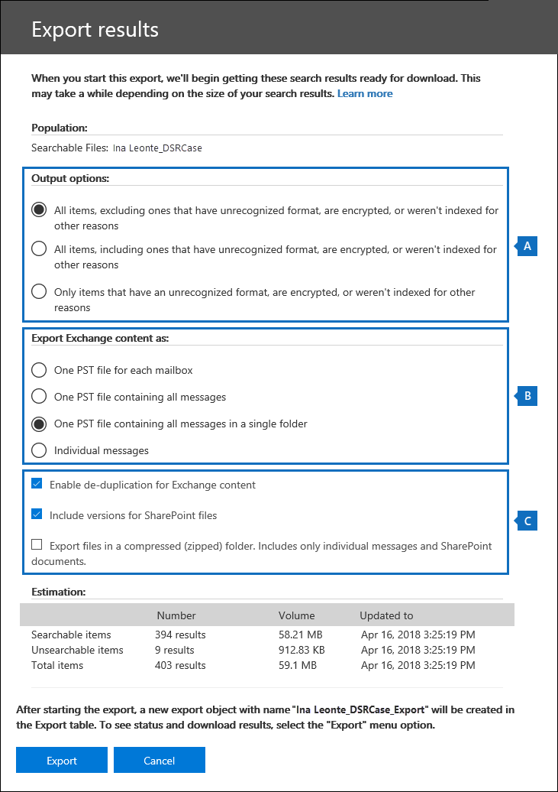

# <a name="manage-gdpr-data-subject-requests-with-the-dsr-case-tool-in-the-security--compliance-center"></a><span data-ttu-id="52e5a-105">管理與安全性 & 合規性中心的 DSR 案例工具的 GDPR 資料主體要求</span><span class="sxs-lookup"><span data-stu-id="52e5a-105">Manage GDPR data subject requests with the DSR case tool in the Security & Compliance Center</span></span>

<span data-ttu-id="52e5a-106">歐盟一般資料保護規定 (GDPR) 是用於保護與啟用個人工作隱私權權限歐盟 (EU) 內。</span><span class="sxs-lookup"><span data-stu-id="52e5a-106">The EU General Data Protection Regulation (GDPR) is about protecting and enabling individuals' privacy rights inside the European Union (EU).</span></span> <span data-ttu-id="52e5a-107">GDPR 提供個人，在歐盟 （又稱為資料主體） 存取、 擷取、 更正、 清除，並限制處理其個人資料的權限。</span><span class="sxs-lookup"><span data-stu-id="52e5a-107">The GDPR gives individuals in the European Union (known as data subjects) the right to access, retrieve, correct, erase, and restrict processing of their personal data.</span></span> <span data-ttu-id="52e5a-108">GDPR 規定的個人資料表示與已識別或可識別之自然人員相關的任何資訊。</span><span class="sxs-lookup"><span data-stu-id="52e5a-108">Under the GDPR, personal data means any information relating to an identified or identifiable natural person.</span></span> <span data-ttu-id="52e5a-109">資料主體要求或 DSR，會呼叫其組織的人員在其個人資料採取動作的正式要求。</span><span class="sxs-lookup"><span data-stu-id="52e5a-109">A formal request by a person to their organization to take an action on their personal data is called a Data Subject Request or DSR.</span></span> <span data-ttu-id="52e5a-110">如需 Office 365 中的資料回應 Dsr 的詳細資訊，請參閱 < <b0>Office 365 資料主體要求的指南</b0>。</span><span class="sxs-lookup"><span data-stu-id="52e5a-110">For detailed information about responding to DSRs for data in Office 365, see [Office 365 Data Subject Request Guide](https://go.microsoft.com/fwlink/?linkid=871169 ).</span></span>
  
<span data-ttu-id="52e5a-111">若要管理以回應貴組織中的人員所提交 DSR 調查，您可以使用 DSR 案例工具安全性 & 合規性中心中，尋找儲存在內容：</span><span class="sxs-lookup"><span data-stu-id="52e5a-111">To manage investigations in response to a DSR submitted by a person in your organization, you can use the DSR case tool in the Security & Compliance Center to find content stored in:</span></span>
  
- <span data-ttu-id="52e5a-112">貴組織中任何使用者信箱。</span><span class="sxs-lookup"><span data-stu-id="52e5a-112">Any user mailbox in your organization.</span></span> <span data-ttu-id="52e5a-113">這包括 Skype 商務交談和一對一聊天中 Microsoft Teams</span><span class="sxs-lookup"><span data-stu-id="52e5a-113">This includes Skype for Business conversations and one-to-one chats in Microsoft Teams</span></span>
    
- <span data-ttu-id="52e5a-114">與 Office 365 群組和 Microsoft Teams 中的所有小組信箱相關聯的所有信箱</span><span class="sxs-lookup"><span data-stu-id="52e5a-114">All mailboxes associated with an Office 365 Group and all team mailboxes in Microsoft Teams</span></span>
    
- <span data-ttu-id="52e5a-115">貴組織中所有的 Sharepoint 網站和商務用 OneDrive 帳戶</span><span class="sxs-lookup"><span data-stu-id="52e5a-115">All SharePoint Online sites and OneDrive for Business accounts in your organization</span></span>
    
- <span data-ttu-id="52e5a-116">所有小組網站與貴組織中的 Office 365 群組網站</span><span class="sxs-lookup"><span data-stu-id="52e5a-116">All Teams sites and Office 365 Group sites in your organization</span></span>
    
- <span data-ttu-id="52e5a-117">Exchange Online 中的所有公用資料夾</span><span class="sxs-lookup"><span data-stu-id="52e5a-117">All public folders in Exchange Online</span></span>
    
<span data-ttu-id="52e5a-118">您可以使用 DSR 案例工具：</span><span class="sxs-lookup"><span data-stu-id="52e5a-118">Using the DSR case tool you can:</span></span>
  
- <span data-ttu-id="52e5a-119">針對每一個 DSR 調查建立個別案例。</span><span class="sxs-lookup"><span data-stu-id="52e5a-119">Create a separate case for each DSR investigation.</span></span>
    
- <span data-ttu-id="52e5a-120">控制可以存取的 DSR 案例藉由將人員加入為成員的大小寫;只有成員可以存取這種情況，且只能在安全性 & 合規性中心的**DSR 案例**頁面上看到其清單中的情況下的情況。</span><span class="sxs-lookup"><span data-stu-id="52e5a-120">Control who has access to the DSR case by adding people as members of the case; only members can access the case and can only see their cases in the list of cases on the **DSR cases** page in the Security & Compliance Center.</span></span> <span data-ttu-id="52e5a-121">此外，您可以將不同的權限指派給不同屬於相同的案例。</span><span class="sxs-lookup"><span data-stu-id="52e5a-121">Additionally, you can assign different permissions to different members of the same case.</span></span> <span data-ttu-id="52e5a-122">例如，您可以允許某些成員僅限檢視的案例和搜尋結果，並允許其他成員，以建立搜尋和匯出搜尋結果。</span><span class="sxs-lookup"><span data-stu-id="52e5a-122">For example, you can allow some members to only view the case and search results and allow other members to create searches and export search results.</span></span> 
    
- <span data-ttu-id="52e5a-123">使用內建搜尋建立或上傳的特定資料主體的所有內容。</span><span class="sxs-lookup"><span data-stu-id="52e5a-123">Use the built-in search to search for all content created or uploaded by a specific data subject.</span></span>
    
- <span data-ttu-id="52e5a-124">（選用） 修改內建的搜尋查詢，然後重新執行搜尋來縮小搜尋結果。</span><span class="sxs-lookup"><span data-stu-id="52e5a-124">Optionally revise the built-in search query and re-run the search to narrow the search results.</span></span>
    
- <span data-ttu-id="52e5a-125">新增其他的 DSR 案例相關聯的內容搜尋。</span><span class="sxs-lookup"><span data-stu-id="52e5a-125">Add additional content searches associated with the DSR case.</span></span> <span data-ttu-id="52e5a-126">這包括建立從 「 我的分析和 Office 漫遊服務傳回已局部編製索引的項目和系統產生的記錄檔的搜尋。</span><span class="sxs-lookup"><span data-stu-id="52e5a-126">This includes creating searches that return partially indexed items and system-generated logs from My Analytics and the Office Roaming Service.</span></span>
    
- <span data-ttu-id="52e5a-127">匯出資料，以回應 DSR 存取或匯出要求。</span><span class="sxs-lookup"><span data-stu-id="52e5a-127">Export data in response to a DSR access or export request.</span></span>
    
- <span data-ttu-id="52e5a-128">刪除的情況下，當 DSR 調查程序完成;這會移除所有的搜尋並匯出與案例相關聯的工作。</span><span class="sxs-lookup"><span data-stu-id="52e5a-128">Delete cases when the DSR investigation process is complete; this will remove all searches and export jobs associated with the case.</span></span>
    
<span data-ttu-id="52e5a-129">以下是使用 DSR 案例工具來管理 DSR 調查的高層級程序：</span><span class="sxs-lookup"><span data-stu-id="52e5a-129">Here's the high-level process for using the DSR case tool to manage DSR investigations:</span></span>
  
[<span data-ttu-id="52e5a-130">步驟 1： 將 eDiscovery 權限指派給潛在的案例成員</span><span class="sxs-lookup"><span data-stu-id="52e5a-130">Step 1: Assign eDiscovery permissions to potential case members</span></span>](#step-1-assign-ediscovery-permissions-to-potential-case-members)

[<span data-ttu-id="52e5a-131">步驟 2： 建立 DSR 案例，並新增成員</span><span class="sxs-lookup"><span data-stu-id="52e5a-131">Step 2: Create a DSR case and add members</span></span>](#step-2-create-a-dsr-case-and-add-members)

[<span data-ttu-id="52e5a-132">步驟 3： 執行搜尋查詢</span><span class="sxs-lookup"><span data-stu-id="52e5a-132">Step 3: Run the search query</span></span>](#step-3-run-the-search-query)

[<span data-ttu-id="52e5a-133">步驟 4： 將資料匯出</span><span class="sxs-lookup"><span data-stu-id="52e5a-133">Step 4: Export the data</span></span>](#step-4-export-the-data)

[<span data-ttu-id="52e5a-134">（選用）步驟 5： 修改內建的搜尋查詢</span><span class="sxs-lookup"><span data-stu-id="52e5a-134">(Optional) Step 5: Revise the built-in search query</span></span>](#optional-step-5-revise-the-built-in-search-query)

[<span data-ttu-id="52e5a-135">使用 DSR 案例工具的詳細資訊</span><span class="sxs-lookup"><span data-stu-id="52e5a-135">More information about using the DSR case tool</span></span>](#more-information-about-using-the-dsr-case-tool)
  
> [!IMPORTANT]
> <span data-ttu-id="52e5a-136">我們工具可協助系統管理員執行 DSR 存取，或藉由讓他們能利用內建的搜尋和匯出 DSR 案例工具中找到的功能中匯出要求。</span><span class="sxs-lookup"><span data-stu-id="52e5a-136">Our tools can help admins perform DSR access or export requests by enabling them to utilize the built-in search and export functionality found in the DSR case tool.</span></span> <span data-ttu-id="52e5a-137">此工具可協助以利匯出資料的 DSR 要求送出的資料主體相關的最佳方法。</span><span class="sxs-lookup"><span data-stu-id="52e5a-137">The tool helps to facilitate a best-effort method to export data that's relevant to a DSR request submitted by a data subject.</span></span> <span data-ttu-id="52e5a-138">不過，請務必注意搜尋結果可能會有根據 [資料主體或系統管理員採取行動，可能會影響項目會被視為 「 個人資料 」 進行匯出。</span><span class="sxs-lookup"><span data-stu-id="52e5a-138">However, it's important to note that search results can vary based on the data subject or the admin actions taken that may impact whether or not an item would be deemed as "personal data" for export purposes.</span></span> <span data-ttu-id="52e5a-139">例如，如果資料主體已修改檔案的最後一個人他們沒有建立，檔案可能不會傳回搜尋結果中。</span><span class="sxs-lookup"><span data-stu-id="52e5a-139">For example, if the data subject was the last person to modify a file they didn't create, the file might not be returned in the search results.</span></span> <span data-ttu-id="52e5a-140">同樣地，系統管理員可以將資料匯出不包括已局部編製索引的項目或 SharePoint 文件的所有版本。</span><span class="sxs-lookup"><span data-stu-id="52e5a-140">Similarly, an admin could export data without including partially indexed items or all versions of SharePoint documents.</span></span> <span data-ttu-id="52e5a-141">因此，所提供的工具可協助加速存取和匯出資料要求;不過，結果受限於特定的系統和資料主體使用案例。</span><span class="sxs-lookup"><span data-stu-id="52e5a-141">Therefore, the tools provided can help facilitate accessing and exporting data requests; however, the results are subject to specific admin and data subject usage scenarios.</span></span> 
  
## <a name="step-1-assign-ediscovery-permissions-to-potential-case-members"></a><span data-ttu-id="52e5a-142">步驟 1： 將 eDiscovery 權限指派給潛在的案例成員</span><span class="sxs-lookup"><span data-stu-id="52e5a-142">Step 1: Assign eDiscovery permissions to potential case members</span></span>

<span data-ttu-id="52e5a-143">根據預設，Office 365 全域系統管理員可以存取安全性 & 合規性中心的 DSR 案例工具。</span><span class="sxs-lookup"><span data-stu-id="52e5a-143">By default, an Office 365 global administrator can access the DSR case tool in the Security & Compliance Center.</span></span> <span data-ttu-id="52e5a-144">根據設計，例如資料隱私權長，人力資源管理員] 中，其他使用者或其他人參與 DSR 調查的不具 DSR 案例工具來存取，而必須被指派適當的權限來存取工具。</span><span class="sxs-lookup"><span data-stu-id="52e5a-144">By design, other users such as a data privacy officer, a human resources manager, or other people involved in DSR investigations don't have access to the DSR case tool and will have to be assigned the appropriate permissions to access the tool.</span></span> <span data-ttu-id="52e5a-145">若要這麼做最簡單的方法是移至安全性 & 合規性中心中的 [**權限**] 頁面上，並將使用者新增至 「 eDiscovery 管理員 」 角色群組。</span><span class="sxs-lookup"><span data-stu-id="52e5a-145">The easiest way to do this is to go to the **Permissions** page in the Security & Compliance Center and add users to the eDiscovery Manager role group.</span></span> <span data-ttu-id="52e5a-146">請注意，您還必須將這些權限指派，讓您可以將其新增為您在步驟 2 中建立的 DSR 案例的成員。</span><span class="sxs-lookup"><span data-stu-id="52e5a-146">Note that you also have to assign these permissions so you can add them as members of the DSR case that you create in Step 2.</span></span> 
  
<span data-ttu-id="52e5a-147">如需逐步指示，請參閱[指派 Office 365 安全性 & 合規性中心中的 eDiscovery 權限](assign-ediscovery-permissions.md)。</span><span class="sxs-lookup"><span data-stu-id="52e5a-147">For step-by-step instructions, see [Assign eDiscovery permissions in the Office‍ 365 Security & Compliance Center](assign-ediscovery-permissions.md).</span></span>
  
> [!NOTE]
> <span data-ttu-id="52e5a-148">根據預設，Office 365 全域系統管理員 （或其他安全性 & 合規性中心中 「 組織管理角色群組的成員不需要匯出內容搜尋結果 （請參閱本文中的步驟 4） 的必要權限。</span><span class="sxs-lookup"><span data-stu-id="52e5a-148">By default, an Office 365 global administrator (or other members of the Organization Management role group in the Security & Compliance Center don't have the necessary permissions to export Content Search results (see Step 4 in this article).</span></span> <span data-ttu-id="52e5a-149">若要解決這個問題，系統管理員可以在自行新增為 eDiscovery 管理員角色群組的成員。</span><span class="sxs-lookup"><span data-stu-id="52e5a-149">To address this, an admin can add themselves as a member of the eDiscovery Manager role group.</span></span> 
  
## <a name="step-2-create-a-dsr-case-and-add-members"></a><span data-ttu-id="52e5a-150">步驟 2： 建立 DSR 案例，並新增成員</span><span class="sxs-lookup"><span data-stu-id="52e5a-150">Step 2: Create a DSR case and add members</span></span>

<span data-ttu-id="52e5a-151">下一步是建立 DSR 案例。</span><span class="sxs-lookup"><span data-stu-id="52e5a-151">The next step is to create a DSR case.</span></span> <span data-ttu-id="52e5a-152">當您建立的情況下時，您可選擇啟動內建的搜尋，或者您可以建立這種情況而不需啟動搜尋。</span><span class="sxs-lookup"><span data-stu-id="52e5a-152">When you create a case, you can choose to start the built-in search or you can create the case without starting the search.</span></span> <span data-ttu-id="52e5a-153">下列程序會指示您建立這種情況，而不必從開始搜尋，然後告訴您如何將成員新增至案例。</span><span class="sxs-lookup"><span data-stu-id="52e5a-153">The following procedure will instruct you to create the case without starting the search and then show you how to add members to the case.</span></span>
  
1. <span data-ttu-id="52e5a-154">移至 [[https://protection.office.com](https://protection.office.com)並登入 Office 365 中，使用公司或學校帳戶。</span><span class="sxs-lookup"><span data-stu-id="52e5a-154">Go to [https://protection.office.com](https://protection.office.com) and sign in to Office 365 using your work or school account.</span></span> 
    
2. <span data-ttu-id="52e5a-155">在 [安全性 & 合規性中心中，按一下 [**資料隱私權** \> **資料主體要求**]，然後按一下 [**新的 DSR 案例**。</span><span class="sxs-lookup"><span data-stu-id="52e5a-155">In the Security & Compliance Center, click **Data privacy** \> **Data subject requests**, and then click  **New DSR case**.</span></span>
    
3. <span data-ttu-id="52e5a-156">在**新的 DSR 情況下**彈出式頁面上，為這種情況命名鍵入選擇性描述，，然後按 [**下一步**。</span><span class="sxs-lookup"><span data-stu-id="52e5a-156">On the **New DSR case** flyout page, give the case a name, type an optional description, and then click **Next**.</span></span> <span data-ttu-id="52e5a-157">請注意，必須在您的組織中是唯一的大小寫名稱。</span><span class="sxs-lookup"><span data-stu-id="52e5a-157">Note that the name of the case must be unique in your organization.</span></span>
    
    > [!TIP]
    > <span data-ttu-id="52e5a-158">請考慮新增送出您正在調查在名稱中 DSR 要求之人員的名稱及/或新的案例的描述。</span><span class="sxs-lookup"><span data-stu-id="52e5a-158">Consider adding the name of the person who submitted the DSR request that you're investigating in the name and/or description of the new case.</span></span> <span data-ttu-id="52e5a-159">請注意，只有此案例 （和 eDiscovery 系統管理員） 的成員將能夠看到 [**資料主體要求**] 頁面上的案例清單中的大小寫。</span><span class="sxs-lookup"><span data-stu-id="52e5a-159">Note that only members of this case (and eDiscovery Administrators) will be able to see the case in the list of cases on the **Data subject requests** page.</span></span> 
  
4. <span data-ttu-id="52e5a-160">在**要求詳細資料**] 頁面的 [**資料主體 （使用者歸檔此要求的人員）**，選取您想要尋找和匯出資料，然後按一下 [**下一步**的人員。</span><span class="sxs-lookup"><span data-stu-id="52e5a-160">On the **Request details** page, under **Data subject (the person who filed this request)**, select the person that you want to find and export data for and then click **Next**.</span></span>
    
5. <span data-ttu-id="52e5a-161">在 [**確認您案例的設定**] 頁面上，您可以變更大小寫名稱與描述] 中，並選取不同的資料主體。</span><span class="sxs-lookup"><span data-stu-id="52e5a-161">On the **Confirm your case settings** page, you can change the case name and description, and select a different data subject.</span></span> <span data-ttu-id="52e5a-162">否則，只要按一下 [**儲存**。</span><span class="sxs-lookup"><span data-stu-id="52e5a-162">Otherwise, just click **Save**.</span></span>
    
    <span data-ttu-id="52e5a-163">會顯示一個頁面，確認已建立新的 DSR 案例。</span><span class="sxs-lookup"><span data-stu-id="52e5a-163">A page is displayed that confirms the new DSR case has been created.</span></span>
    
    ![開始搜尋，或只需關閉新的 DSR 案例] 頁面上](media/b5e62c2c-cafe-4a8d-a38c-789ed9f9ccbd.png)
  
    <span data-ttu-id="52e5a-165">此時，您可以執行下列其中一個下列兩件事：</span><span class="sxs-lookup"><span data-stu-id="52e5a-165">At this point, you can do one of two things:</span></span>
    
    <span data-ttu-id="52e5a-166">a.</span><span class="sxs-lookup"><span data-stu-id="52e5a-166">a.</span></span> <span data-ttu-id="52e5a-167">按一下 [**我的搜尋結果的顯示**啟動搜尋。</span><span class="sxs-lookup"><span data-stu-id="52e5a-167">Clicking **Show me search results** starts the search.</span></span> <span data-ttu-id="52e5a-168">這是預設選項。</span><span class="sxs-lookup"><span data-stu-id="52e5a-168">This is the default selection.</span></span> <span data-ttu-id="52e5a-169">當您選取此選項會執行內建搜尋和結果所傳回之步驟 3 所述。</span><span class="sxs-lookup"><span data-stu-id="52e5a-169">The built-in search that is run when you select this option and the results that are returned are discussed in Step 3.</span></span>
    
    <span data-ttu-id="52e5a-170">b.</span><span class="sxs-lookup"><span data-stu-id="52e5a-170">b.</span></span> <span data-ttu-id="52e5a-171">按一下 [**完成]** 關閉新的 DSR 案例，而不啟動內建的查詢。</span><span class="sxs-lookup"><span data-stu-id="52e5a-171">Clicking **Finish** closes the new DSR case without starting the built-in search.</span></span> <span data-ttu-id="52e5a-172">當您選取此選項時，新的 DSR 案例會顯示在 [**資料主體要求**] 頁面。</span><span class="sxs-lookup"><span data-stu-id="52e5a-172">When you select this option, the new DSR case is displayed on the **Data subject requests** page.</span></span>
    
6. <span data-ttu-id="52e5a-173">因此，您可以移至新的 DSR 案例，並將成員新增至其，請按一下 [**完成**]。</span><span class="sxs-lookup"><span data-stu-id="52e5a-173">Click **Finish** so that you can go in to the new DSR case and add members to it.</span></span> 
    
7. <span data-ttu-id="52e5a-174">在 [**資料主體要求**] 頁面上，按一下您剛才建立的 DSR 案例名稱。</span><span class="sxs-lookup"><span data-stu-id="52e5a-174">On the **Data subject requests** page, click the name of the DSR case that you just created.</span></span> 
    
8. <span data-ttu-id="52e5a-175">在 [**管理此情況下**彈出式視窗] 頁面上的 [**管理成員**] 下方按一下 [**新增**]。</span><span class="sxs-lookup"><span data-stu-id="52e5a-175">On the **Manage this case** flyout page, under **Manage members**, click **Add**.</span></span> 
    
    <span data-ttu-id="52e5a-176">[**使用者**] 下方的已指派適當的 eDiscovery 權限的人員清單隨即顯示。</span><span class="sxs-lookup"><span data-stu-id="52e5a-176">Under **Users**, a list of people that have been assigned the appropriate eDiscovery permissions is displayed.</span></span> <span data-ttu-id="52e5a-177">請注意此清單中，就會顯示您指派至步驟 1 中的 eDiscovery 權限的人員。</span><span class="sxs-lookup"><span data-stu-id="52e5a-177">Note that the people you assigned eDiscovery permissions to in Step 1 will be displayed in this list.</span></span> 
    
9. <span data-ttu-id="52e5a-178">選取要新增為成員的 DSR 案例，按一下 [**新增**]，然後儲存變更的人員。</span><span class="sxs-lookup"><span data-stu-id="52e5a-178">Select the people to add as members of the DSR case, click **Add**, and then save your changes.</span></span>
    
    <span data-ttu-id="52e5a-179">請注意，所以您也可以新增為 DSR 案例的成員的角色群組]，即可**新增**[**管理角色群組**。</span><span class="sxs-lookup"><span data-stu-id="52e5a-179">Note that you can also add role groups as members of DSR case by clicking **Add** under **Manage role groups**.</span></span> 
    
## <a name="step-3-run-the-search-query"></a><span data-ttu-id="52e5a-180">步驟 3： 執行搜尋查詢</span><span class="sxs-lookup"><span data-stu-id="52e5a-180">Step 3: Run the search query</span></span>

<span data-ttu-id="52e5a-181">您建立的 DSR 案例，並新增成員之後下, 一步是執行與案例相關聯的內建搜尋。</span><span class="sxs-lookup"><span data-stu-id="52e5a-181">After you create a DSR case and add members, the next step is to run the built-in search that's associated with the case.</span></span> <span data-ttu-id="52e5a-182">此預設搜尋查詢會執行下列動作：</span><span class="sxs-lookup"><span data-stu-id="52e5a-182">This default search query does the following:</span></span>
  
- <span data-ttu-id="52e5a-183">您的所有電子郵件項目已傳送或接收的資料主體的組織中搜尋所有信箱。</span><span class="sxs-lookup"><span data-stu-id="52e5a-183">Searches all mailboxes in your organization for all email items that were sent or received by the data subject.</span></span> <span data-ttu-id="52e5a-184">這被透過使用搜尋資料主體的電子郵件中的所有人員欄位中的*參與者*電子郵件屬性。</span><span class="sxs-lookup"><span data-stu-id="52e5a-184">This is accomplished by using the  *Participants*  email property, which searches for the data subject in all the people fields in an email message.</span></span> <span data-ttu-id="52e5a-185">此屬性會傳回在其資料主體是**從**、**至**、 **[副本]** 或 **[密件副本]** 欄位中的項目。</span><span class="sxs-lookup"><span data-stu-id="52e5a-185">This property returns items in which the data subject is in the **From**, **To**, **CC**, and **BCC** fields.</span></span> <span data-ttu-id="52e5a-186">Exchange Online 中的公用資料夾也會搜尋傳送或接收的資料主體的郵件。</span><span class="sxs-lookup"><span data-stu-id="52e5a-186">Public folders in Exchange Online are also searched for messages sent or received by the data subject.</span></span> 
    
- <span data-ttu-id="52e5a-187">您的文件與項目建立或上傳的資料主體的組織中搜尋所有網站。</span><span class="sxs-lookup"><span data-stu-id="52e5a-187">Searches all sites in your organization for documents and items that were created or uploaded by the data subject.</span></span> <span data-ttu-id="52e5a-188">這可以藉由使用下列的網站內容：</span><span class="sxs-lookup"><span data-stu-id="52e5a-188">This is accomplished by using the following site properties:</span></span>
    
  - <span data-ttu-id="52e5a-189">*作者*屬性傳回的項目，其中資料主體會列在 Office 文件中的 [作者] 欄位。</span><span class="sxs-lookup"><span data-stu-id="52e5a-189">The  *Author*  property returns items where the data subject is listed in the author field in Office documents.</span></span> <span data-ttu-id="52e5a-190">此值持續發生，即使複製並由其他人上傳文件。</span><span class="sxs-lookup"><span data-stu-id="52e5a-190">This value persists, even if the document is copied and uploaded by someone else.</span></span> 
    
  - <span data-ttu-id="52e5a-191">*CreatedBy*屬性會傳回已建立或上傳的資料主體的項目。</span><span class="sxs-lookup"><span data-stu-id="52e5a-191">The  *CreatedBy*  property returns items that were created or uploaded by the data subject.</span></span> 
    
<span data-ttu-id="52e5a-192">以下是當您建立的 DSR 案例時，自動取得建立內建搜尋的關鍵字查詢外觀。</span><span class="sxs-lookup"><span data-stu-id="52e5a-192">Here's what the keyword query looks like for the built-in search that gets automatically created when you create a DSR case.</span></span>
  
```
participants:"<email address>" OR author:"<display name>" OR createdby:"<display name>"
```

<span data-ttu-id="52e5a-193">例如，如果資料主體的名稱是為 Leonte，關鍵字查詢看起來會像這樣：</span><span class="sxs-lookup"><span data-stu-id="52e5a-193">For example, if the name of the data subject is Ina Leonte, the keyword query would look like this:</span></span>
  
```
participants:"ina@contoso.com" OR author:"Ina Leonte" OR createdby:"Ina Leonte"
```

 <span data-ttu-id="52e5a-194">**若要執行的 DSR 案例的內建搜尋：**</span><span class="sxs-lookup"><span data-stu-id="52e5a-194">**To run the built-in search for a DSR case:**</span></span>
  
1. <span data-ttu-id="52e5a-195">在 [安全性 & 合規性中心中，按一下 [**資料隱私權** \> **資料主體要求**，然後按一下您在步驟 2 中建立的 DSR 案例旁邊的 [**開啟**。</span><span class="sxs-lookup"><span data-stu-id="52e5a-195">In the Security & Compliance Center, click **Data privacy** \> **Data subject requests**, and then click **Open** next to the DSR case that you created in Step 2.</span></span> 
    
    <span data-ttu-id="52e5a-196">按一下頂端的 [] 頁面的 [**搜尋**] 索引標籤，然後按一下 [建立新的 DSR 案例時所建立的內建搜尋] 旁的核取方塊。</span><span class="sxs-lookup"><span data-stu-id="52e5a-196">Click the **Search** tab at the top of the page, and then click the checkbox next to the built-in search that was created when you created the new DSR case.</span></span> <span data-ttu-id="52e5a-197">請注意搜尋具有相同名稱的 DSR 案例。</span><span class="sxs-lookup"><span data-stu-id="52e5a-197">Note the search has the same name as the DSR case.</span></span> 
    
2. <span data-ttu-id="52e5a-198">在 [搜尋] 彈出式頁面中，按一下 [**開啟查詢**]。</span><span class="sxs-lookup"><span data-stu-id="52e5a-198">In the search flyout page, click **Open query**.</span></span>
    
    <span data-ttu-id="52e5a-199">當您開啟查詢時，搜尋會啟動，而且將在一段時間內完成。</span><span class="sxs-lookup"><span data-stu-id="52e5a-199">When you open the query, the search is started and will complete in a few moments.</span></span> 
    
3. <span data-ttu-id="52e5a-200">搜尋完成時，請按一下 [預覽搜尋結果的**預覽結果**]。</span><span class="sxs-lookup"><span data-stu-id="52e5a-200">When the search is complete, click **Preview results** to preview the search results.</span></span> <span data-ttu-id="52e5a-201">如需詳細資訊，請參閱[預覽搜尋結果](content-search.md#preview-search-results)。</span><span class="sxs-lookup"><span data-stu-id="52e5a-201">For more information, see [Preview search results](content-search.md#preview-search-results).</span></span>
    
    > [!TIP]
    > <span data-ttu-id="52e5a-202">您也可以檢視搜尋查詢統計資料，若要查看信箱和站台由搜尋所傳回的項目及包含符合搜尋查詢的項目上方內容位置的數目。</span><span class="sxs-lookup"><span data-stu-id="52e5a-202">You can also view the search query statistics to see the number of mailbox and site items that are returned by the search, and the top content locations that contain items that match the search query.</span></span> <span data-ttu-id="52e5a-203">如需詳細資訊，請參閱[檢視資訊和搜尋相關的統計資料](content-search.md#view-information-and-statistics-about-a-search)。</span><span class="sxs-lookup"><span data-stu-id="52e5a-203">For more information see, [View information and statistics about a search](content-search.md#view-information-and-statistics-about-a-search).</span></span> 
  
<span data-ttu-id="52e5a-204">您可以編輯內建的搜尋查詢，變更搜尋時，內容位置並再重新執行搜尋。</span><span class="sxs-lookup"><span data-stu-id="52e5a-204">You can edit the built-in search query, change the content locations that are searched, and then re-run the search.</span></span> <span data-ttu-id="52e5a-205">如需詳細資訊，請參閱 「[步驟 5](#optional-step-5-revise-the-built-in-search-query) 」。</span><span class="sxs-lookup"><span data-stu-id="52e5a-205">See [Step 5](#optional-step-5-revise-the-built-in-search-query) for more information.</span></span> 
  
## <a name="step-4-export-the-data"></a><span data-ttu-id="52e5a-206">步驟 4： 將資料匯出</span><span class="sxs-lookup"><span data-stu-id="52e5a-206">Step 4: Export the data</span></span>

<span data-ttu-id="52e5a-207">執行內建的搜尋之後，您可以匯出搜尋結果。</span><span class="sxs-lookup"><span data-stu-id="52e5a-207">After you run the built-in search, you can export the search results.</span></span> <span data-ttu-id="52e5a-208">或者，匯出資料之前，您可能想要修訂查詢，以降低搜尋結果數目。</span><span class="sxs-lookup"><span data-stu-id="52e5a-208">Alternatively, before you export the data, you may want to revise the query to reduce the number of search results.</span></span> <span data-ttu-id="52e5a-209">如需縮小搜尋結果的詳細資訊，請參閱步驟 5。</span><span class="sxs-lookup"><span data-stu-id="52e5a-209">See Step 5 for more information about narrowing the search results.</span></span>
  
<span data-ttu-id="52e5a-210">當您匯出搜尋結果時，信箱項目可以下載為個別郵件或 PST 檔案中。</span><span class="sxs-lookup"><span data-stu-id="52e5a-210">When you export search results, mailbox items can be downloaded in PST files or as individual messages.</span></span> <span data-ttu-id="52e5a-211">當您匯出內容從 SharePoint 和 OneDrive 帳戶時，會匯出的原生 Office 文件和其他文件複本。</span><span class="sxs-lookup"><span data-stu-id="52e5a-211">When you export content from SharePoint and OneDrive accounts, copies of native Office documents and other documents are exported.</span></span> <span data-ttu-id="52e5a-212">也包含在搜尋結果的結果包含的檔案，會匯出每個項目的相關資訊。</span><span class="sxs-lookup"><span data-stu-id="52e5a-212">A results file that contains information about every item that is exported is also included with the search results.</span></span> <span data-ttu-id="52e5a-213">如需將匯出的詳細資訊，請參閱[匯出內容搜尋結果](export-search-results.md)。</span><span class="sxs-lookup"><span data-stu-id="52e5a-213">For more detailed information about exporting, see [Export Content Search results](export-search-results.md).</span></span>
  
> [!NOTE]
> <span data-ttu-id="52e5a-214">根據預設，Office 365 全域系統管理員 （或其他安全性 & 合規性中心中 「 組織管理角色群組的成員） 不需要匯出內容搜尋結果的必要權限。</span><span class="sxs-lookup"><span data-stu-id="52e5a-214">By default, an Office 365 global administrator (or other members of the Organization Management role group in the Security & Compliance Center) don't have the necessary permissions to export Content Search results.</span></span> <span data-ttu-id="52e5a-215">若要解決這個問題，系統管理員可以在自行新增為 eDiscovery 管理員角色群組的成員。</span><span class="sxs-lookup"><span data-stu-id="52e5a-215">To address this, an admin can add themselves as a member of the eDiscovery Manager role group.</span></span> 
  
<span data-ttu-id="52e5a-216">您用來將資料匯出的電腦必須符合下列系統需求：</span><span class="sxs-lookup"><span data-stu-id="52e5a-216">The computer you use to export data has to meet the following system requirements:</span></span>
  
- <span data-ttu-id="52e5a-217">32 位元或 64 位元版本的 Windows 7 和更新版本</span><span class="sxs-lookup"><span data-stu-id="52e5a-217">32- or 64-bit versions of Windows 7 and later versions</span></span>
    
- <span data-ttu-id="52e5a-218">Microsoft.NET Framework 4.7</span><span class="sxs-lookup"><span data-stu-id="52e5a-218">Microsoft .NET Framework 4.7</span></span>
    
- <span data-ttu-id="52e5a-219">支援的瀏覽器：</span><span class="sxs-lookup"><span data-stu-id="52e5a-219">A supported browser:</span></span>
    
  - <span data-ttu-id="52e5a-220">Microsoft Edge</span><span class="sxs-lookup"><span data-stu-id="52e5a-220">Microsoft Edge</span></span>
    
    <span data-ttu-id="52e5a-221">或</span><span class="sxs-lookup"><span data-stu-id="52e5a-221">Or</span></span>
    
  - <span data-ttu-id="52e5a-222">Microsoft Internet Explorer 10 或更新版本</span><span class="sxs-lookup"><span data-stu-id="52e5a-222">Microsoft Internet Explorer 10 and later versions</span></span>
    
    > [!NOTE]
    > <span data-ttu-id="52e5a-223">Microsoft 不會製造廠商分機或 ClickOnce 應用程式的附加元件。</span><span class="sxs-lookup"><span data-stu-id="52e5a-223">Microsoft doesn't manufacture third-party extensions or add-ons for ClickOnce applications.</span></span> <span data-ttu-id="52e5a-224">匯出資料與協力廠商分機或附加元件使用不受支援的瀏覽器不支援。</span><span class="sxs-lookup"><span data-stu-id="52e5a-224">Exporting data using an unsupported browser with third-party extensions or add-ons isn't supported.</span></span> 
  
 <span data-ttu-id="52e5a-225">**若要匯出資料的 DSR 案例中內建的搜尋：**</span><span class="sxs-lookup"><span data-stu-id="52e5a-225">**To export data from the built-in search in a DSR case:**</span></span>
  
1. <span data-ttu-id="52e5a-226">在 [安全性 & 合規性中心中，按一下 [**資料隱私權** \> **資料主體要求**，然後按一下您想要匯出資料的 DSR 案例旁邊的 [**開啟**。</span><span class="sxs-lookup"><span data-stu-id="52e5a-226">In the Security & Compliance Center, click **Data privacy** \> **Data subject requests**, and then click **Open** next to the DSR case that you want to export data from.</span></span> 
    
2. <span data-ttu-id="52e5a-227">按一下頂端的 [] 頁面的 [**搜尋**] 索引標籤，然後按一下 [建立的 DSR 案例時所建立的內建搜尋] 旁的核取方塊。</span><span class="sxs-lookup"><span data-stu-id="52e5a-227">Click the **Search** tab at the top of the page, and then click the checkbox next to the built-in search that was created when you created the DSR case.</span></span> <span data-ttu-id="52e5a-228">或按一下 [其他搜尋] 以從搜尋中匯出資料。</span><span class="sxs-lookup"><span data-stu-id="52e5a-228">Or click another search to export data from that search.</span></span> 
    
3. <span data-ttu-id="52e5a-229">在 [搜尋] 彈出式頁面中，按一下 [**更多**，，然後選取 [**匯出結果**，從下拉式清單。</span><span class="sxs-lookup"><span data-stu-id="52e5a-229">On the search flyout page, click  **More**, and then select **Export results** from the drop-down list.</span></span> 
    
4. <span data-ttu-id="52e5a-230">在 [**匯出結果**] 頁面上，選取下列建議 DSR 匯出要求的選項。</span><span class="sxs-lookup"><span data-stu-id="52e5a-230">On the **Export results** page, select the following recommended options for DSR export requests.</span></span> 
    
    
  
    <span data-ttu-id="52e5a-232">a.</span><span class="sxs-lookup"><span data-stu-id="52e5a-232">a.</span></span> <span data-ttu-id="52e5a-233">在 [**輸出] 選項**，選取第一個選項 （**不含和具有和，具有無法辨識的格式、 加密，或因為其他原因而未建立索引的所有項目**） 匯出已編製索引項目。</span><span class="sxs-lookup"><span data-stu-id="52e5a-233">Under **Output options**, select the first option ( **All items, excluding ones that have ones that have an unrecognized format, are encrypted, or weren't indexed for other reasons**) to export indexed items only.</span></span> <span data-ttu-id="52e5a-234">您不想要匯出已局部編製索引的項目從內建搜尋的原因是因為其他使用者的已局部編製索引項目將會匯出。</span><span class="sxs-lookup"><span data-stu-id="52e5a-234">The reason you don't want to export partially indexed items from the built-in search is because partially indexed items from other users will be exported.</span></span> <span data-ttu-id="52e5a-235">若要匯出資料主體的已局部編製索引項目，建議您建立個別的搜尋。</span><span class="sxs-lookup"><span data-stu-id="52e5a-235">To export only the partially indexed items for the data subject, we recommend that you create a separate search.</span></span> <span data-ttu-id="52e5a-236">如需詳細資訊，請參閱 「 使用 DSR 案例工具的相關的其他資訊 」 區段中的 [[匯出已局部編製索引的項目](#exporting-partially-indexed-items)。</span><span class="sxs-lookup"><span data-stu-id="52e5a-236">For more information, see [Exporting partially indexed items](#exporting-partially-indexed-items) in the "More information about using the DSR case tool" section.</span></span>
    
    <span data-ttu-id="52e5a-237">b.</span><span class="sxs-lookup"><span data-stu-id="52e5a-237">b.</span></span> <span data-ttu-id="52e5a-238">在 [**匯出 Exchange 內容為**下選取第三個選項，**包含單一資料夾中的所有郵件的一個 PST 檔案**。</span><span class="sxs-lookup"><span data-stu-id="52e5a-238">Under **Export Exchange content as**, select the third option, **One PST file containing all messages in a single folder**.</span></span> <span data-ttu-id="52e5a-239">因為某些結果可能來自另一個使用者的信箱中的項目，此選項只列出單一資料夾中的項目，而不會指出實際信箱，且您取消重複的下一個項目中所建議的結果時所使用的最佳選項.</span><span class="sxs-lookup"><span data-stu-id="52e5a-239">Because some of the results may be for items that originated in another user's mailbox, this option just lists the item in a single folder without indicating the actual mailbox and is the best option to use when you de-duplicate the results as recommended in the next item.</span></span> <span data-ttu-id="52e5a-240">此選項也可讓資料主體檢閱 （依傳送日期排序項目） 的先後順序中的項目，而無須瀏覽原始信箱資料夾結構的每個項目。</span><span class="sxs-lookup"><span data-stu-id="52e5a-240">This option also lets the data subject review items in chronological order (items are sorted by sent date) without having to navigate the original mailbox folder structure for each item.</span></span>
    
    <span data-ttu-id="52e5a-241">c.</span><span class="sxs-lookup"><span data-stu-id="52e5a-241">c.</span></span> <span data-ttu-id="52e5a-242">選取 [**啟用重複資料刪除**] 選項以排除重複的電子郵件訊息。</span><span class="sxs-lookup"><span data-stu-id="52e5a-242">Select **Enable de-duplication** option to excludes duplicate email messages.</span></span> <span data-ttu-id="52e5a-243">我們建議此選項，因為內建的搜尋組織中搜尋所有信箱。</span><span class="sxs-lookup"><span data-stu-id="52e5a-243">We recommend this option because the built-in search searches all mailboxes in your organization.</span></span> <span data-ttu-id="52e5a-244">因此如果所搜尋的信箱中找到多份相同的訊息，此選項表示將匯出只有一個郵件副本。</span><span class="sxs-lookup"><span data-stu-id="52e5a-244">So if multiple copies of the same message are found in the mailboxes that were searched, this option means only one copy of a message will be exported.</span></span> <span data-ttu-id="52e5a-245">此選項，同時將單一資料夾中的 PST 檔案會導致 DSR 的最佳使用者經驗中其中一個匯出的郵件匯出要求。</span><span class="sxs-lookup"><span data-stu-id="52e5a-245">This option, together will exporting messages in one PST file in a single folder results in the best user experience for DSR export requests.</span></span> <span data-ttu-id="52e5a-246">請注意 Results.csv 匯出報告也會列出所有位置找到重複的郵件。</span><span class="sxs-lookup"><span data-stu-id="52e5a-246">Note that the Results.csv export report will list all locations where duplicate messages were found.</span></span>
    
    <span data-ttu-id="52e5a-247">（選用） 您可以選取要匯出的 SharePoint 和 OneDrive 文件的所有版本**的 SharePoint 文件包含版本**選項。</span><span class="sxs-lookup"><span data-stu-id="52e5a-247">Optionally, you can select **Include versions for SharePoint documents** option to export all versions of SharePoint and OneDrive documents.</span></span> <span data-ttu-id="52e5a-248">這需要該版本設定已開啟文件庫。</span><span class="sxs-lookup"><span data-stu-id="52e5a-248">This requires that versioning is turned on for document libraries.</span></span> <span data-ttu-id="52e5a-249">此選項可協助確保所有相關的資料會匯出。</span><span class="sxs-lookup"><span data-stu-id="52e5a-249">This option helps to ensure that all relevant data is exported.</span></span>
    
5. <span data-ttu-id="52e5a-250">選擇 [匯出設定之後，按一下 [**匯出**]。</span><span class="sxs-lookup"><span data-stu-id="52e5a-250">After you choose the export settings, click **Export**.</span></span>
    
    <span data-ttu-id="52e5a-251">在搜尋結果會準備下載，這表示他們正在上傳至 Microsoft 雲端中組織的 Azure 儲存體區域。</span><span class="sxs-lookup"><span data-stu-id="52e5a-251">The search results are prepared for downloading, which means they're uploaded to the Azure storage area for your organization in the Microsoft cloud.</span></span> <span data-ttu-id="52e5a-252">接下來的步驟顯示如何下載到本機電腦的此資料。</span><span class="sxs-lookup"><span data-stu-id="52e5a-252">The next steps show you how to download this data to your local computer.</span></span>
    
6. <span data-ttu-id="52e5a-253">按一下 [**匯出**] 索引標籤以顯示您剛剛建立的匯出工作。</span><span class="sxs-lookup"><span data-stu-id="52e5a-253">Click the **Export** tab to display the export job you just created.</span></span> <span data-ttu-id="52e5a-254">請注意，匯出工作有相同的名稱做為對應搜尋與 **_Export**附加至搜尋名稱的結尾。</span><span class="sxs-lookup"><span data-stu-id="52e5a-254">Note that export jobs have the same name as the corresponding search with **_Export** appended to the end of search name.</span></span> 
    
7. <span data-ttu-id="52e5a-255">按一下您剛才建立以顯示 [匯出] 彈出式頁面匯出工作。</span><span class="sxs-lookup"><span data-stu-id="52e5a-255">Click the export job that you just created to display the export flyout page.</span></span> <span data-ttu-id="52e5a-256">此頁面會顯示資訊，請在搜尋範圍，例如大小和要匯出的項目數總計，以及已移轉至 Azure 存放區域的項目百分比。</span><span class="sxs-lookup"><span data-stu-id="52e5a-256">This page shows information about the search, such as the size and total number of items to be exported, and the percentage of the items that have been transferred to an Azure storage area.</span></span> <span data-ttu-id="52e5a-257">按一下 [**重新整理**更新上傳狀態資訊。</span><span class="sxs-lookup"><span data-stu-id="52e5a-257">Click **Refresh** to update the upload status information.</span></span> 
    
8. <span data-ttu-id="52e5a-258">**匯出金鑰**，請按一下 [**複製到剪貼簿**。</span><span class="sxs-lookup"><span data-stu-id="52e5a-258">Under **Export key**, click **Copy to clipboard**.</span></span> <span data-ttu-id="52e5a-259">若要下載搜尋結果，您將在步驟 11 使用此機碼。</span><span class="sxs-lookup"><span data-stu-id="52e5a-259">You will use this key in step 11 to download the search results.</span></span>
    
9. <span data-ttu-id="52e5a-260">按一下 [頂端的 [匯出] 彈出式頁面的 [**下載結果**。</span><span class="sxs-lookup"><span data-stu-id="52e5a-260">Click  **Download results** at the top of the export flyout page.</span></span> 
    
10. <span data-ttu-id="52e5a-261">在頁面底部快顯視窗中，按一下 [若要開啟 [ **Microsoft Office 365 電子文件探索匯出工具**的 [**開啟**]。</span><span class="sxs-lookup"><span data-stu-id="52e5a-261">In the pop-up window at the bottom of the page, click **Open** to open the **Microsoft Office 365 eDiscovery Export Tool**.</span></span> <span data-ttu-id="52e5a-262">**EDiscovery 匯出工具，** 將會安裝您下載搜尋結果第一次。</span><span class="sxs-lookup"><span data-stu-id="52e5a-262">The **eDiscovery Export Tool** will be installed the first time you download search results.</span></span> 
    
11. <span data-ttu-id="52e5a-263">在**eDiscovery 匯出工具**中，貼上您在步驟 8 中適當的方塊中複製的匯出金鑰。</span><span class="sxs-lookup"><span data-stu-id="52e5a-263">In the **eDiscovery Export Tool**, paste the export key that you copied in step 8 in the appropriate box.</span></span>
    
12. <span data-ttu-id="52e5a-264">按一下 [瀏覽]\*\*\*\* 以指定搜尋結果檔案要下載到的位置。</span><span class="sxs-lookup"><span data-stu-id="52e5a-264">Click **Browse** to specify the location where you want to download the search result files.</span></span> 
    
    > [!NOTE]
    > <span data-ttu-id="52e5a-265">因為大量的磁碟活動 （讀取和寫入） 中，您應該搜尋結果下載至本機磁碟機。不檔案下載到對應的網路磁碟機或其他網路位置。</span><span class="sxs-lookup"><span data-stu-id="52e5a-265">Due to the high amount of disk activity (reads and writes), you should download search results to a local disk drive; don't download them to a mapped network drive or other network location.</span></span> 
  
13. <span data-ttu-id="52e5a-266">按一下 [開始]\*\*\*\* 將搜尋結果下載至您的電腦。</span><span class="sxs-lookup"><span data-stu-id="52e5a-266">Click **Start** to download the search results to your computer.</span></span> 
    
    <span data-ttu-id="52e5a-267">**EDiscovery 匯出工具**會顯示在匯出程序，包括的估計項目數量 （及大小） 的其餘項目若要下載的狀態資訊。</span><span class="sxs-lookup"><span data-stu-id="52e5a-267">The **eDiscovery Export Tool** displays status information about the export process, including an estimate of the number (and size) of the remaining items to be downloaded.</span></span> <span data-ttu-id="52e5a-268">匯出程序完成時，您可以存取已下載的所在位置的檔案。</span><span class="sxs-lookup"><span data-stu-id="52e5a-268">When the export process is complete, you can access the files in the location where they were downloaded.</span></span> <span data-ttu-id="52e5a-269">如需當您下載內容搜尋結果時包含報告的詳細資訊，請參閱 「 匯出內容搜尋結果 」 的[詳細資訊](export-search-results.md#more-information)一節。</span><span class="sxs-lookup"><span data-stu-id="52e5a-269">For more information about the reports that included when you download Content Search results, see the [More information](export-search-results.md#more-information) section in "Export Content Search results".</span></span> 
    
<span data-ttu-id="52e5a-270">會匯出資料之後，搜尋結果，並匯出報告位於資料夾中具有相同名稱的 DSR 案例。</span><span class="sxs-lookup"><span data-stu-id="52e5a-270">After the data is exported, the search results and export reports are located in a folder that has the same name as the DSR case.</span></span> <span data-ttu-id="52e5a-271">包含信箱項目 PST 檔案位於名為**Exchange**的子資料夾中。</span><span class="sxs-lookup"><span data-stu-id="52e5a-271">The PST files that contain mailbox items are located in a subfolder named **Exchange**.</span></span> <span data-ttu-id="52e5a-272">文件和網站中的其他項目位於名為**SharePoint**的子資料夾中。</span><span class="sxs-lookup"><span data-stu-id="52e5a-272">Documents and other items from sites are located in a subfolder named **SharePoint**.</span></span> 
  
## <a name="optional-step-5-revise-the-built-in-search-query"></a><span data-ttu-id="52e5a-273">（選用）步驟 5： 修改內建的搜尋查詢</span><span class="sxs-lookup"><span data-stu-id="52e5a-273">(Optional) Step 5: Revise the built-in search query</span></span>

<span data-ttu-id="52e5a-274">執行內建的搜尋之後，您可以修改，來縮小要傳回較少的搜尋結果的範圍。</span><span class="sxs-lookup"><span data-stu-id="52e5a-274">After you run the built-in search, you can revise it to narrow the scope to return fewer search results.</span></span> <span data-ttu-id="52e5a-275">您可以新增至查詢的條件來執行這項操作。</span><span class="sxs-lookup"><span data-stu-id="52e5a-275">You can do this by adding conditions to the query.</span></span> <span data-ttu-id="52e5a-276">條件是以邏輯方式連線到的關鍵字查詢**AND**運算子。</span><span class="sxs-lookup"><span data-stu-id="52e5a-276">A condition is logically connected to the keyword query by the **AND** operator.</span></span> <span data-ttu-id="52e5a-277">這表示要在搜尋結果中，關鍵字查詢和新增任何條件，必須滿足的項目傳回。</span><span class="sxs-lookup"><span data-stu-id="52e5a-277">That means to be returned in the search results, items must satisfy both the keyword query and any conditions you add.</span></span> <span data-ttu-id="52e5a-278">這是條件如何協助來縮小結果。</span><span class="sxs-lookup"><span data-stu-id="52e5a-278">This is how conditions help to narrow the results.</span></span> <span data-ttu-id="52e5a-279">如果您將兩個或多個唯一的條件新增至搜尋查詢 （指定不同的屬性的條件） 時，這些條件會以邏輯方式連線**AND**運算子。</span><span class="sxs-lookup"><span data-stu-id="52e5a-279">If you add two or more unique conditions to a search query (conditions that specify different properties), those conditions are logically connected by the **AND** operator.</span></span> <span data-ttu-id="52e5a-280">這表示會傳回滿足 （除了關鍵字查詢） 的所有條件的項目。</span><span class="sxs-lookup"><span data-stu-id="52e5a-280">That means only items that satisfy all the conditions (in addition to the keyword query) are returned.</span></span> <span data-ttu-id="52e5a-281">如果您將多個值 （以逗點或分號分隔） 新增至一個單一條件時，這些值**OR**運算子來連線。</span><span class="sxs-lookup"><span data-stu-id="52e5a-281">If you add multiple values (separated by commas or semi-colons) to a single condition, those values are connected by the **OR** operator.</span></span> <span data-ttu-id="52e5a-282">這表示如果它們包含任何條件中屬性的指定值，會傳回項目。</span><span class="sxs-lookup"><span data-stu-id="52e5a-282">That means items are returned if they contain any of the specified values for the property in the condition.</span></span> 
  
<span data-ttu-id="52e5a-283">以下是一些範例的條件，您可以新增至內建的搜尋查詢的 DSR 案例。</span><span class="sxs-lookup"><span data-stu-id="52e5a-283">Here are some examples of the conditions that you can add to the built-in search query of a DSR case.</span></span> <span data-ttu-id="52e5a-284">在搜尋查詢中使用的實際屬性的名稱會顯示括號。</span><span class="sxs-lookup"><span data-stu-id="52e5a-284">The name of the actual property used in a search query is shown parentheses.</span></span>
  
- <span data-ttu-id="52e5a-285">**檔案類型 ( `filetype`)** -指定的文件或檔案的副檔名。</span><span class="sxs-lookup"><span data-stu-id="52e5a-285">**File type ( `filetype`)** - Specifies the extension of a document or file.</span></span> <span data-ttu-id="52e5a-286">使用此條件可搜尋文件和特定的 Office 應用程式，例如 Word、 Excel 及 OneNote 所建立的檔案。</span><span class="sxs-lookup"><span data-stu-id="52e5a-286">Use this condition to search for documents and files created by specific Office applications, such as Word, Excel, and OneNote.</span></span> 
    
- <span data-ttu-id="52e5a-287">**訊息類型 ( `kind`)** -會指定要搜尋的電子郵件項目的類型。</span><span class="sxs-lookup"><span data-stu-id="52e5a-287">**Message type ( `kind`)** - Specifies the type of email item to search for.</span></span> <span data-ttu-id="52e5a-288">例如，您可以使用語法`kind:email OR kind:im`傳回僅電子郵件訊息與 Skype 商務對話或 Microsoft teams 的一對一聊天室。</span><span class="sxs-lookup"><span data-stu-id="52e5a-288">For example, you can use the syntax  `kind:email OR kind:im` to return only email messages and Skype for Business conversations or one-to-one chats in Microsoft Teams.</span></span> 
    
- <span data-ttu-id="52e5a-289">**合規性標記 (`compliancetag`)** -指定指派給電子郵件或文件標籤。</span><span class="sxs-lookup"><span data-stu-id="52e5a-289">**Compliance tag (`compliancetag`)** - Specifies a label assigned to an email message or a document.</span></span> <span data-ttu-id="52e5a-290">此條件會傳回分類具有特定標籤的項目。</span><span class="sxs-lookup"><span data-stu-id="52e5a-290">This condition will return items that are classified with a specific label.</span></span> <span data-ttu-id="52e5a-291">標籤用來分類電子郵件和文件的資料控管和強制執行的標籤所定義的分類為基礎的保留規則。</span><span class="sxs-lookup"><span data-stu-id="52e5a-291">Labels are used to classify email and documents for data governance and enforce retention rules based on the classification defined by the label.</span></span> <span data-ttu-id="52e5a-292">這是 DSR 調查的有用條件，因為您的組織可能會使用標籤來分類資料隱私權的相關內容或，其中包含個人資料或機密資訊。</span><span class="sxs-lookup"><span data-stu-id="52e5a-292">This is a useful condition for DSR investigations because your organization may be using labels to classify content related to data privacy or that contains personal data or sensitive information.</span></span> <span data-ttu-id="52e5a-293">此條件的值，使用第一個部分標籤名稱或完整標籤名稱與萬用字元。</span><span class="sxs-lookup"><span data-stu-id="52e5a-293">For the value of this condition, use the complete label name or the first part of the label name with a wildcard.</span></span> <span data-ttu-id="52e5a-294">如需詳細資訊，請參閱 < <b0>Overview of Office 365 中的標籤</b0>。</span><span class="sxs-lookup"><span data-stu-id="52e5a-294">For more information, see [Overview of labels in Office 365](labels.md).</span></span>
    
<span data-ttu-id="52e5a-295">清單，以及使用 DSR 案例工具中的所有條件的說明，請參閱 「 關鍵字查詢和搜尋條件的內容搜尋 」 文件中的[搜尋條件](keyword-queries-and-search-conditions.md#search-conditions)。</span><span class="sxs-lookup"><span data-stu-id="52e5a-295">For a list and description of all the conditions available in the DSR case tool, see [Search conditions](keyword-queries-and-search-conditions.md#search-conditions) in the "Keyword queries and search conditions for Content Search" article.</span></span> 
  
### <a name="changing-the-content-locations-that-are-searched"></a><span data-ttu-id="52e5a-296">變更要搜尋的內容位置</span><span class="sxs-lookup"><span data-stu-id="52e5a-296">Changing the content locations that are searched</span></span>

<span data-ttu-id="52e5a-297">除了修改內建搜尋 DSR 案例，您也可以變更要搜尋的內容位置。</span><span class="sxs-lookup"><span data-stu-id="52e5a-297">In addition to revising the built-in search for a DSR case, you can also change the content locations that are searched.</span></span> <span data-ttu-id="52e5a-298">如先前所述，內建的搜尋會在組織中，任何 Exchange Online 的公用資料夾中搜尋每個信箱和站台。</span><span class="sxs-lookup"><span data-stu-id="52e5a-298">As previously explained, the built-in search searches every mailbox and site in the organization, and any Exchange Online public folders.</span></span> <span data-ttu-id="52e5a-299">例如，您可以將搜尋縮小到僅搜尋資料主體的信箱和 OneDrive 帳戶，並選取 SharePoint 網站。</span><span class="sxs-lookup"><span data-stu-id="52e5a-299">For example, you could narrow the search to only search the data subject's mailbox and OneDrive account and selected SharePoint sites.</span></span> <span data-ttu-id="52e5a-300">如果您選擇搜尋特定的網站，您必須新增每個您想要搜尋的網站。</span><span class="sxs-lookup"><span data-stu-id="52e5a-300">If you choose to search specific sites, you'll have to add each site that you want to search.</span></span>
  
<span data-ttu-id="52e5a-301">若要修改要搜尋的內容位置：</span><span class="sxs-lookup"><span data-stu-id="52e5a-301">To modify the content locations to search:</span></span>
  
1. <span data-ttu-id="52e5a-302">開啟您要變更的內容位置的內建搜尋。</span><span class="sxs-lookup"><span data-stu-id="52e5a-302">Open the built-in search that you want to change the content locations for.</span></span>
    
2. <span data-ttu-id="52e5a-303">在搜尋查詢中，[**位置**] 中，按一下 [**修改**] 旁的**特定位置**選項。</span><span class="sxs-lookup"><span data-stu-id="52e5a-303">In the search query, under **Locations**, click **Modify** next to the **Specific locations** option.</span></span> 
    
    ![按一下 [修改] 來變更內建的搜尋查詢的內容位置](media/d66f7ba7-b71f-4ff5-a030-460ff02e3123.png)
  
    <span data-ttu-id="52e5a-305">**修改位置**彈出式頁面隨即顯示。</span><span class="sxs-lookup"><span data-stu-id="52e5a-305">The **Modify locations** flyout page is displayed.</span></span> <span data-ttu-id="52e5a-306">以下是中的內建的搜尋，以及修改要搜尋的位置的相關資訊的內容位置的描述。</span><span class="sxs-lookup"><span data-stu-id="52e5a-306">Here's a description of the content locations in the built-in search and some information about modifying the locations that are searched.</span></span> 
    
    
  
    <span data-ttu-id="52e5a-308">a.</span><span class="sxs-lookup"><span data-stu-id="52e5a-308">a.</span></span> <span data-ttu-id="52e5a-309">會選取下彈出式頁面頂端的 [信箱] 區段中的 [**選取所有**切換，這會指出要搜尋所有信箱。</span><span class="sxs-lookup"><span data-stu-id="52e5a-309">The toggle under **Select all** in mailbox section at the top of the flyout page is selected, which indicates that all mailboxes are searched.</span></span> <span data-ttu-id="52e5a-310">若要縮小搜尋範圍，請按一下要取消選取它，然後按一下 [**選擇使用者、 群組或小組**，並選擇要搜尋的特定信箱切換。</span><span class="sxs-lookup"><span data-stu-id="52e5a-310">To narrow the scope of the search, click the toggle to unselect it, and then click **Choose users, groups, or teams** and choose specific mailboxes to search.</span></span>
    
    <span data-ttu-id="52e5a-311">b.</span><span class="sxs-lookup"><span data-stu-id="52e5a-311">b.</span></span> <span data-ttu-id="52e5a-312">會選取下彈出式頁面中間的網站] 區段中的 [**全選**切換，這會指出要搜尋的所有網站。</span><span class="sxs-lookup"><span data-stu-id="52e5a-312">The toggle under **Select all** in the sites section in the middle of the flyout page is selected, which indicates that all sites are searched.</span></span> <span data-ttu-id="52e5a-313">若要將搜尋縮小到選取的網站，您會取消選取 [切換，然後按一下 [**選擇網站**。</span><span class="sxs-lookup"><span data-stu-id="52e5a-313">To narrow the search to selected sites, you would unselect the toggle and then click **Choose sites**.</span></span> <span data-ttu-id="52e5a-314">您必須將您想要搜尋，每個特定網站新增包括資料主體的 OneDrive 帳戶。</span><span class="sxs-lookup"><span data-stu-id="52e5a-314">You'll have to add each specific site that you want to search, including the data subject's OneDrive account.</span></span>
    
    <span data-ttu-id="52e5a-315">c.</span><span class="sxs-lookup"><span data-stu-id="52e5a-315">c.</span></span> <span data-ttu-id="52e5a-316">已選取 [Exchange 公用資料夾] 區段中的切換，這表示要搜尋的所有 Exchange 公用資料夾。</span><span class="sxs-lookup"><span data-stu-id="52e5a-316">The toggle in the Exchange public folders section is selected, which means all Exchange public folders are searched.</span></span> <span data-ttu-id="52e5a-317">您可以僅搜尋所有 Exchange 公用資料夾] 或 [無這些附註。</span><span class="sxs-lookup"><span data-stu-id="52e5a-317">Note that you can only search all Exchange public folders or none of them.</span></span> <span data-ttu-id="52e5a-318">您無法選擇特定信箱進行搜尋。</span><span class="sxs-lookup"><span data-stu-id="52e5a-318">You can't choose specific ones to search.</span></span>
    
3. <span data-ttu-id="52e5a-319">如果您修改內建的搜尋中的內容位置，按一下 [**儲存&amp;執行**重新開始搜尋。</span><span class="sxs-lookup"><span data-stu-id="52e5a-319">If you modify the content locations in the built-in search, click **Save &amp; run** to re-start the search.</span></span> 
  
## <a name="more-information-about-using-the-dsr-case-tool"></a><span data-ttu-id="52e5a-320">使用 DSR 案例工具的詳細資訊</span><span class="sxs-lookup"><span data-stu-id="52e5a-320">More information about using the DSR case tool</span></span>

<span data-ttu-id="52e5a-321">下列各節包含有關使用 DSR 案例工具來回應 DSR 匯出要求的詳細資訊。</span><span class="sxs-lookup"><span data-stu-id="52e5a-321">The following sections contain more information about using the DSR case tool to respond to DSR export requests.</span></span>
  
[<span data-ttu-id="52e5a-322">從我的分析 」 和 「 Office 漫遊服務匯出資料</span><span class="sxs-lookup"><span data-stu-id="52e5a-322">Exporting data from MyAnalytics and the Office Roaming Service</span></span>](#exporting-data-from-myanalytics-and-the-office-roaming-service)

[<span data-ttu-id="52e5a-323">匯出已局部編製索引的項目</span><span class="sxs-lookup"><span data-stu-id="52e5a-323">Exporting partially indexed items</span></span>](#exporting-partially-indexed-items)

[<span data-ttu-id="52e5a-324">搜尋和匯出資料從 Microsoft Teams 和 Office 365 群組</span><span class="sxs-lookup"><span data-stu-id="52e5a-324">Searching and exporting data from Microsoft Teams and Office 365 Groups</span></span>](#searching-and-exporting-data-from-microsoft-teams-and-office-365-groups)

[<span data-ttu-id="52e5a-325">搜尋 Exchange 公用資料夾</span><span class="sxs-lookup"><span data-stu-id="52e5a-325">Searching Exchange public folders</span></span>](#searching-exchange-public-folders)
  
### <a name="exporting-data-from-myanalytics-and-the-office-roaming-service"></a><span data-ttu-id="52e5a-326">從我的分析 」 和 「 Office 漫遊服務匯出資料</span><span class="sxs-lookup"><span data-stu-id="52e5a-326">Exporting data from MyAnalytics and the Office Roaming Service</span></span>

<span data-ttu-id="52e5a-327">您可以使用 DSR 案例工具來搜尋並匯出 MyAnalytics 和 Office 漫遊服務所產生的使用情形資料。</span><span class="sxs-lookup"><span data-stu-id="52e5a-327">You can use the DSR case tool to search for and export usage data that's generated by MyAnalytics and the Office Roaming Service.</span></span> <span data-ttu-id="52e5a-328">以下是這些服務所執行的工作的描述：</span><span class="sxs-lookup"><span data-stu-id="52e5a-328">Here's a description of what these services do:</span></span>
  
- <span data-ttu-id="52e5a-329">**MyAnalytics** -為使用者提供深入了解有關如何在每日花在其根據其信箱中的郵件和行事曆資料的時間。</span><span class="sxs-lookup"><span data-stu-id="52e5a-329">**MyAnalytics** - Provides users with insights about how they spend their time based on the mail and calendar data in their mailbox.</span></span> <span data-ttu-id="52e5a-330">所有的 MyAnalytics 觀點衍生自使用者的信箱中的電子郵件和會議標頭。</span><span class="sxs-lookup"><span data-stu-id="52e5a-330">All MyAnalytics insights are derived from email and meeting headers in the user's mailbox.</span></span> <span data-ttu-id="52e5a-331">指派 MyAnalytics 授權的使用者可以登入 Office 365 並移至要檢視關於如何在每日花在其時間深入了解 MyAnalytics 儀表板。</span><span class="sxs-lookup"><span data-stu-id="52e5a-331">Users that are assigned a MyAnalytics license can sign in to Office 365 and go to the MyAnalytics dashboard to view the insights about how they spend their time.</span></span> <span data-ttu-id="52e5a-332">（使用者可以螢幕擷取畫面，以回應 DSR 存取要求這些深入資訊。）</span><span class="sxs-lookup"><span data-stu-id="52e5a-332">(Users can screen shots of these insights in response to a DSR access request).</span></span> <span data-ttu-id="52e5a-333">DSR 案例中內建的搜尋將會匯出用來產生 MyAnalytics 觀點的資料。</span><span class="sxs-lookup"><span data-stu-id="52e5a-333">The built-in search in a DSR case will export the data that's used to generate MyAnalytics insights.</span></span> 
    
- <span data-ttu-id="52e5a-334">**Office 漫遊服務**-漫遊是儲存 Office 相關的設定，例如 Office 佈景主題、 自訂字典、 語言設定、 開發人員模式和自動校正的服務。</span><span class="sxs-lookup"><span data-stu-id="52e5a-334">**Office Roaming Service** - Roaming is a service that stores Office-related settings, such as Office theme, custom dictionary, language settings, developer mode, and auto correct.</span></span> 
    
<span data-ttu-id="52e5a-335">從 MyAnalytics 及 Office 漫遊服務資料會儲存在隱藏的資料夾位於 Exchange Online 信箱的非人際郵件 (非 IPM) 樹狀子目錄中的資料主體的信箱。</span><span class="sxs-lookup"><span data-stu-id="52e5a-335">The data from MyAnalytics and the Office Roaming service is stored in a data subject's mailbox in hidden folders located in a non-interpersonal message (non-IPM) subtree of Exchange Online mailboxes.</span></span> <span data-ttu-id="52e5a-336">這表示當他們使用 Outlook 或其他郵件用戶端來存取其信箱的使用者檢視中隱藏資料。</span><span class="sxs-lookup"><span data-stu-id="52e5a-336">This means the data is hidden from the user's view when they use Outlook or other mail clients to access their mailbox.</span></span> <span data-ttu-id="52e5a-337">如需隱藏的資料夾的詳細資訊，請參閱 < <b0>MAPI 隱藏的資料夾</b0>。</span><span class="sxs-lookup"><span data-stu-id="52e5a-337">For more information about hidden folders, see [MAPI Hidden Folders](https://go.microsoft.com/fwlink/?linkid=872758).</span></span>
  
<span data-ttu-id="52e5a-338">您可以建立不同的內容搜尋 （和其關聯的 DSR 案例），會傳回 MyAnalytics 和 Office 漫遊服務使用狀況資料的資料主體的信箱中。</span><span class="sxs-lookup"><span data-stu-id="52e5a-338">You can create a separate content search (and associate it with a DSR case) that returns the MyAnalytics and the Office Roaming Service usage data in the data's subjects mailbox.</span></span> <span data-ttu-id="52e5a-339">此資料不包含在搜尋統計資料，並無法供預覽。</span><span class="sxs-lookup"><span data-stu-id="52e5a-339">This data isn't included in the search statistics and it won't be available for preview.</span></span> <span data-ttu-id="52e5a-340">但是，您可以將它匯出，然後提供給資料主體回應 DSR 匯出要求。</span><span class="sxs-lookup"><span data-stu-id="52e5a-340">But you can export it and then give it to the data subject in response to a DSR export request.</span></span>
  
<span data-ttu-id="52e5a-341">當您從 MyAnalytics 及 Office 漫遊服務匯出資料時，資料會儲存至不同的資料夾位於**ApplicationDataRoot**資料夾，也就是資料主體的電子郵件地址的名稱在資料夾下是每個應用程式。</span><span class="sxs-lookup"><span data-stu-id="52e5a-341">When you export data from MyAnalytics and the Office Roaming Service, the data is saved to a separate folder for each application that's located in the **ApplicationDataRoot** folder, which is under a folder that is name with the data subject's email address.</span></span> <span data-ttu-id="52e5a-342">此資料匯出成 JSON 檔案，也就是可讀取的文字檔案類似 XML 或 TXT 檔案，會附加至電子郵件訊息。</span><span class="sxs-lookup"><span data-stu-id="52e5a-342">This data is exported as JSON files, which are human-readable text files similar to XML or TXT files, that are attached to email messages.</span></span> <span data-ttu-id="52e5a-343">目前，這些資料夾是一個名為指派給 MyAnalytics 和 Office 漫遊服務中，如下表所列的全域唯一識別碼 (GUID)。</span><span class="sxs-lookup"><span data-stu-id="52e5a-343">Currently, these folders are named with a globally unique identifier (GUID) that's assigned to MyAnalytics and the Office Roaming Service, which are listed in the following table.</span></span> <span data-ttu-id="52e5a-344">在未來版本的 DSR 案例工具，GUID 會取代實際的應用程式的名稱。</span><span class="sxs-lookup"><span data-stu-id="52e5a-344">In future versions of the DSR case tool, the GUID will be replaced with the name of the actual application.</span></span> 
  
|<span data-ttu-id="52e5a-345">**Application**</span><span class="sxs-lookup"><span data-stu-id="52e5a-345">**Application**</span></span>|<span data-ttu-id="52e5a-346">**GUID/資料夾名稱**</span><span class="sxs-lookup"><span data-stu-id="52e5a-346">**GUID/folder name**</span></span>|
|:-----|:-----|
|<span data-ttu-id="52e5a-347">MyAnalytics</span><span class="sxs-lookup"><span data-stu-id="52e5a-347">MyAnalytics</span></span>  <br/> |<span data-ttu-id="52e5a-348">3c896ded-22c5-450f-91f6-3d1ef0848f6e</span><span class="sxs-lookup"><span data-stu-id="52e5a-348">3c896ded-22c5-450f-91f6-3d1ef0848f6e</span></span>  <br/> |
|<span data-ttu-id="52e5a-349">Office 漫遊服務</span><span class="sxs-lookup"><span data-stu-id="52e5a-349">Office Roaming Service</span></span>  <br/> |<span data-ttu-id="52e5a-350">1caee58f-eb14-4a6b-9339-1fe2ddf6692b</span><span class="sxs-lookup"><span data-stu-id="52e5a-350">1caee58f-eb14-4a6b-9339-1fe2ddf6692b</span></span>  <br/> |
   
 <span data-ttu-id="52e5a-351">**若要搜尋並匯出 MyAnalytics 和 Office 漫遊服務資料：**</span><span class="sxs-lookup"><span data-stu-id="52e5a-351">**To search for and export MyAnalytics and Office Roaming Service data:**</span></span>
  
1. <span data-ttu-id="52e5a-352">在 [安全性 & 合規性中心中，按一下 [**資料隱私權** \> **資料主體要求**，然後按一下 [**開啟**] 旁的 DSR 案例為您想要匯出的流量資料的資料主體。</span><span class="sxs-lookup"><span data-stu-id="52e5a-352">In the Security & Compliance Center, click **Data privacy** \> **Data subject requests**, and then click **Open** next to the DSR case for the data subject that you want to export usage data for.</span></span> 
    
2. <span data-ttu-id="52e5a-353">按一下頂端的 [] 頁面的 [**搜尋**] 索引標籤，然後按一下 [ **「 引導式搜尋**。</span><span class="sxs-lookup"><span data-stu-id="52e5a-353">Click the **Search** tab at the top of the page, and then click  **Guided search**.</span></span>
    
3. <span data-ttu-id="52e5a-354">在 [**命名您的搜尋**] 頁面上，按一下 [**取消**]。</span><span class="sxs-lookup"><span data-stu-id="52e5a-354">Click **Cancel** on the **Name your search** page.</span></span> 
    
4. <span data-ttu-id="52e5a-355">在 [**搜尋查詢**下,**類型**的情況，選取**MyAnalytics**和**Office 漫遊服務**旁的核取方塊。</span><span class="sxs-lookup"><span data-stu-id="52e5a-355">Under **Search query**, in the **Type** condition, select the check boxes next to **MyAnalytics** and **Office Roaming Service**.</span></span> 
    
    
  
    <span data-ttu-id="52e5a-357">請注意**類型**條件 （也就是電子郵件訊息類別） 應該是唯一的項目在搜尋查詢。</span><span class="sxs-lookup"><span data-stu-id="52e5a-357">Note that the **Type** condition (which are email message classes) should be the only item in the search query.</span></span> <span data-ttu-id="52e5a-358">您可以刪除 [**關鍵字**] 方塊，或保留空白。</span><span class="sxs-lookup"><span data-stu-id="52e5a-358">You can delete the **Keywords** box or leave it blank.</span></span> 
    
5. <span data-ttu-id="52e5a-359">[**位置**] 中，請確定已選取**特定位置**，然後按一下 [**修改]**。</span><span class="sxs-lookup"><span data-stu-id="52e5a-359">Under **Locations**, make sure **Specific locations** is selected and then click **Modify**.</span></span>
    
6. <span data-ttu-id="52e5a-360">在上方部分**修改位置**彈出式頁面 （信箱的章節） 的詳細資訊，按一下 [**選擇使用者、 群組或小組**。</span><span class="sxs-lookup"><span data-stu-id="52e5a-360">On top part of the **Modify locations** flyout page (the mailbox section), click **Choose users, groups, or teams**.</span></span>
    
7. <span data-ttu-id="52e5a-361">在 [**編輯位置**] 頁面上，按一下 [**選擇使用者、 群組或小組**，選擇 [資料主體的信箱，然後儲存您的選取範圍。</span><span class="sxs-lookup"><span data-stu-id="52e5a-361">On the **Edit locations** page, click **Choose users, groups, or teams**, choose the data subject's mailbox, and then save your selection.</span></span> 
    
8. <span data-ttu-id="52e5a-362">按一下 [**儲存&amp;執行**，然後命名為搜尋]，並將其儲存。</span><span class="sxs-lookup"><span data-stu-id="52e5a-362">Click **Save &amp; run**, and then name the search and save it.</span></span>
    
    <span data-ttu-id="52e5a-363">已啟動搜尋。</span><span class="sxs-lookup"><span data-stu-id="52e5a-363">The search is started.</span></span>
    
 <span data-ttu-id="52e5a-364">**若要匯出 MyAnalytics 和 Office 漫遊服務資料：**</span><span class="sxs-lookup"><span data-stu-id="52e5a-364">**To export MyAnalytics and Office Roaming Service data:**</span></span>
  
1. <span data-ttu-id="52e5a-365">您在上一個步驟中建立搜尋完成時，請按一下頂端的 [] 頁面的 [**搜尋**] 索引標籤，然後按一下 [搜尋] 旁的核取方塊。</span><span class="sxs-lookup"><span data-stu-id="52e5a-365">When the search that you created in the previous step is complete, click the **Search** tab at the top of the page, and then click the checkbox next to the search.</span></span> <span data-ttu-id="52e5a-366">您可能需要按一下 [**重新整理**以顯示搜尋]。</span><span class="sxs-lookup"><span data-stu-id="52e5a-366">You may have to click  **Refresh** to display the search.</span></span> 
    
2. <span data-ttu-id="52e5a-367">在 [搜尋] 彈出式頁面中，按一下 [**更多**，，然後選取 [**匯出結果**，從下拉式清單。</span><span class="sxs-lookup"><span data-stu-id="52e5a-367">On the search flyout page, click  **More**, and then select **Export results** from the drop-down list.</span></span> 
    
3. <span data-ttu-id="52e5a-368">在 [**匯出結果**] 頁面上，選取這些建議匯出使用狀況資料的選項。</span><span class="sxs-lookup"><span data-stu-id="52e5a-368">On the **Export results** page, select the these recommended options to export usage data.</span></span> 
    
    
  
    <span data-ttu-id="52e5a-370">a.</span><span class="sxs-lookup"><span data-stu-id="52e5a-370">a.</span></span> <span data-ttu-id="52e5a-371">在 [**輸出] 選項**，選取第一個選項 （**不含和具有和，具有無法辨識的格式、 加密，或因為其他原因而未建立索引的所有項目**） 匯出已編製索引項目。</span><span class="sxs-lookup"><span data-stu-id="52e5a-371">Under **Output options**, select the first option ( **All items, excluding ones that have ones that have an unrecognized format, are encrypted, or weren't indexed for other reasons**) to export indexed items only.</span></span>
    
    <span data-ttu-id="52e5a-372">b.</span><span class="sxs-lookup"><span data-stu-id="52e5a-372">b.</span></span> <span data-ttu-id="52e5a-373">在 [**匯出 Exchange 內容為**下選取第二個選項，**包含所有郵件的一個 PST 檔案**。</span><span class="sxs-lookup"><span data-stu-id="52e5a-373">Under **Export Exchange content as**, select the second option, **One PST file containing all messages**.</span></span>
    
    <span data-ttu-id="52e5a-374">c.</span><span class="sxs-lookup"><span data-stu-id="52e5a-374">c.</span></span> <span data-ttu-id="52e5a-375">保留其餘未選取的匯出選項。</span><span class="sxs-lookup"><span data-stu-id="52e5a-375">Leave the remaining export options unselected.</span></span>
    
4. <span data-ttu-id="52e5a-376">選擇 [匯出設定之後，按一下 [**匯出**]。</span><span class="sxs-lookup"><span data-stu-id="52e5a-376">After you choose the export settings, click **Export**.</span></span>
    
    <span data-ttu-id="52e5a-377">在搜尋結果會準備下載，這表示他們正在上傳至 Microsoft 雲端中組織的 Azure 儲存體區域。</span><span class="sxs-lookup"><span data-stu-id="52e5a-377">The search results are prepared for downloading, which means they're uploaded to the Azure storage area for your organization in the Microsoft cloud.</span></span> <span data-ttu-id="52e5a-378">接下來的步驟顯示如何下載到本機電腦的此資料。</span><span class="sxs-lookup"><span data-stu-id="52e5a-378">The next steps show you how to download this data to your local computer.</span></span>
    
5. <span data-ttu-id="52e5a-379">按一下 [**匯出**] 索引標籤以顯示您剛剛建立的匯出工作。</span><span class="sxs-lookup"><span data-stu-id="52e5a-379">Click the **Export** tab to display the export job you just created.</span></span> <span data-ttu-id="52e5a-380">請注意，匯出工作有相同的名稱做為對應搜尋與 **_Export**附加至搜尋名稱的結尾。</span><span class="sxs-lookup"><span data-stu-id="52e5a-380">Note that export jobs have the same name as the corresponding search with **_Export** appended to the end of search name.</span></span> 
    
6. <span data-ttu-id="52e5a-381">按一下您剛才建立以顯示 [匯出] 彈出式頁面匯出工作。</span><span class="sxs-lookup"><span data-stu-id="52e5a-381">Click the export job that you just created to display the export flyout page.</span></span> 
    
7. <span data-ttu-id="52e5a-382">**匯出金鑰**，請按一下 [**複製到剪貼簿**。</span><span class="sxs-lookup"><span data-stu-id="52e5a-382">Under **Export key**, click **Copy to clipboard**.</span></span> <span data-ttu-id="52e5a-383">若要下載搜尋結果，您將步驟 10 中使用此機碼。</span><span class="sxs-lookup"><span data-stu-id="52e5a-383">You will use this key in step 10 to download the search results.</span></span>
    
8. <span data-ttu-id="52e5a-384">按一下 [頂端的 [匯出] 彈出式頁面的 [**下載結果**。</span><span class="sxs-lookup"><span data-stu-id="52e5a-384">Click  **Download results** at the top of the export flyout page.</span></span> 
    
9. <span data-ttu-id="52e5a-385">在頁面底部快顯視窗中，按一下 [若要開啟 [ **Microsoft Office 365 電子文件探索匯出工具**的 [**開啟**]。</span><span class="sxs-lookup"><span data-stu-id="52e5a-385">In the pop-up window at the bottom of the page, click **Open** to open the **Microsoft Office 365 eDiscovery Export Tool**.</span></span> <span data-ttu-id="52e5a-386">**EDiscovery 匯出工具，** 將會安裝您下載搜尋結果第一次。</span><span class="sxs-lookup"><span data-stu-id="52e5a-386">The **eDiscovery Export Tool** will be installed the first time you download search results.</span></span> 
    
10. <span data-ttu-id="52e5a-387">在 [電子文件探索匯出工具]\*\*\*\* 中，於適當的方塊中貼上您在步驟 7 中所複製的匯出金鑰。</span><span class="sxs-lookup"><span data-stu-id="52e5a-387">In the **eDiscovery Export Tool**, paste the export key that you copied in step 7 in the appropriate box.</span></span>
    
11. <span data-ttu-id="52e5a-388">按一下 [瀏覽]\*\*\*\* 以指定搜尋結果檔案要下載到的位置。</span><span class="sxs-lookup"><span data-stu-id="52e5a-388">Click **Browse** to specify the location where you want to download the search result files.</span></span> 
    
    > [!NOTE]
    > <span data-ttu-id="52e5a-389">因為大量的磁碟活動 （讀取和寫入） 中，您應該搜尋結果下載至本機磁碟機。不檔案下載到對應的網路磁碟機或其他網路位置。</span><span class="sxs-lookup"><span data-stu-id="52e5a-389">Due to the high amount of disk activity (reads and writes), you should download search results to a local disk drive; don't download them to a mapped network drive or other network location.</span></span> 
  
12. <span data-ttu-id="52e5a-390">按一下 [開始]\*\*\*\* 將搜尋結果下載至您的電腦。</span><span class="sxs-lookup"><span data-stu-id="52e5a-390">Click **Start** to download the search results to your computer.</span></span> 
    
    <span data-ttu-id="52e5a-391">**EDiscovery 匯出工具**會顯示在匯出程序，包括的估計項目數量 （及大小） 的其餘項目若要下載的狀態資訊。</span><span class="sxs-lookup"><span data-stu-id="52e5a-391">The **eDiscovery Export Tool** displays status information about the export process, including an estimate of the number (and size) of the remaining items to be downloaded.</span></span> <span data-ttu-id="52e5a-392">匯出程序完成時，您可以在 Outlook 中開啟 Exchange PST 檔案，然後再移至**ApplicationDataRoot**資料夾以存取 MyAnalytics 和漫遊服務的子資料夾。</span><span class="sxs-lookup"><span data-stu-id="52e5a-392">When the export process is complete, you can open the Exchange PST file in Outlook and then go to the **ApplicationDataRoot** folder to access the subfolders to MyAnalytics and Roaming service.</span></span> 
    
    <span data-ttu-id="52e5a-393">如先前所述，包含流量資料的 JSON 檔案會附加到郵件。</span><span class="sxs-lookup"><span data-stu-id="52e5a-393">As previously explained, the JSON files that contains usage data are attached to messages.</span></span> <span data-ttu-id="52e5a-394">若要檢視的 JSON 檔案，按一下一則訊息，然後開啟附加的 JSON 檔案。</span><span class="sxs-lookup"><span data-stu-id="52e5a-394">To view a JSON file, click a message and then open the attached JSON file.</span></span> 
  
### <a name="exporting-partially-indexed-items"></a><span data-ttu-id="52e5a-395">匯出已局部編製索引的項目</span><span class="sxs-lookup"><span data-stu-id="52e5a-395">Exporting partially indexed items</span></span>

<span data-ttu-id="52e5a-396">我們建議您不要從您建立新的 DSR 案例時所建立的內建搜尋匯出已局部編製索引的項目 （也稱為未編製索引的項目）。</span><span class="sxs-lookup"><span data-stu-id="52e5a-396">We recommend that you don't export partially indexed items (also called unindexed items) from the built-in search that's created when you create a new DSR case.</span></span> <span data-ttu-id="52e5a-397">這是因為搜尋結果將多個可能會包含已局部編製索引項目在您組織中，其他使用者，不只是部分資料主體的索引項目）。</span><span class="sxs-lookup"><span data-stu-id="52e5a-397">That's because the search results will more than likely include partially indexed items for other users in your organization, and not just partially indexed items for the data subject).</span></span> <span data-ttu-id="52e5a-398">相反地，我們建議您建立個別的內容搜尋與 DSR 案例，用以匯出僅給資料主體相關的已局部編製索引項目相關聯。</span><span class="sxs-lookup"><span data-stu-id="52e5a-398">Instead, we recommend that you create a separate Content Search that's associated with the DSR case that's designed to export only the partially indexed items related to the data subject.</span></span> 
  
<span data-ttu-id="52e5a-399">以下是已局部編製索引的項目匯出高層級程序。</span><span class="sxs-lookup"><span data-stu-id="52e5a-399">Here's a high-level process to export partially indexed items.</span></span> <span data-ttu-id="52e5a-400">它們匯出之後，您可以檢閱它們，以判斷回應 DSR 存取項目時，或匯出要求。</span><span class="sxs-lookup"><span data-stu-id="52e5a-400">After they're export, you can review them to determine if an items is responsive to a DSR access or export request.</span></span>
  
1. <span data-ttu-id="52e5a-401">開啟的 DSR 案例，並在 [**搜尋**] 頁面上建立新的搜尋。</span><span class="sxs-lookup"><span data-stu-id="52e5a-401">Open the DSR case and create a new search on the **Search** page.</span></span> 
    
2. <span data-ttu-id="52e5a-402">設定搜尋查詢及內容的位置使用下列準則，來搜尋：</span><span class="sxs-lookup"><span data-stu-id="52e5a-402">Use the following criteria for configuring the search query and the content locations to search:</span></span>
    
    - <span data-ttu-id="52e5a-403">使用 [空白/空白關鍵字查詢]。</span><span class="sxs-lookup"><span data-stu-id="52e5a-403">Use an empty/blank keyword query.</span></span> <span data-ttu-id="52e5a-404">這會傳回所有項目中要搜尋的內容位置。</span><span class="sxs-lookup"><span data-stu-id="52e5a-404">This will return all items in the content locations that are searched.</span></span>
    
    - <span data-ttu-id="52e5a-405">搜尋資料主體的 Exchange Online 信箱和其 OneDrive 帳戶。</span><span class="sxs-lookup"><span data-stu-id="52e5a-405">Search only the data subject's Exchange Online mailbox and their OneDrive account.</span></span>
    
3. <span data-ttu-id="52e5a-406">執行搜尋，並完成之後，您可以匯出及下載搜尋結果 （如[步驟 4](#step-4-export-the-data)所述）。</span><span class="sxs-lookup"><span data-stu-id="52e5a-406">After you run the search and it completes, you can export and download the search results (as described in [Step 4](#step-4-export-the-data)).</span></span> <span data-ttu-id="52e5a-407">使用下列設定來匯出已局部編製索引的項目。</span><span class="sxs-lookup"><span data-stu-id="52e5a-407">Use the following settings to export partially indexed items.</span></span> 
    
    - <span data-ttu-id="52e5a-408">[**輸出選項**] 下選取 [匯出已局部編製索引項目第三個選項 （**只具有無法辨識的格式的項目已加密，或未編製索引的其他原因**）。</span><span class="sxs-lookup"><span data-stu-id="52e5a-408">Under **Output options**, select the third option ( **Only items that have an unrecognized format, are encrypted, or weren't indexed for other reasons**) to export partially indexed items only.</span></span>
    
    - <span data-ttu-id="52e5a-409">[**匯出 Exchange 內容當作**，您可以選取任何根據您的喜好設定] 選項。</span><span class="sxs-lookup"><span data-stu-id="52e5a-409">Under **Export Exchange content as**, you can select any option based on your preferences.</span></span> 
    
    - <span data-ttu-id="52e5a-410">選取 [**包含版本的 SharePoint 文件**] 選項將會匯出文件的版本為版本已局部編製索引。</span><span class="sxs-lookup"><span data-stu-id="52e5a-410">Selecting the **Include versions for SharePoint documents** option will export versions of documents if a version is partially indexed.</span></span> 
    
<span data-ttu-id="52e5a-411">如需已局部編製索引項目的詳細資訊，請參閱：</span><span class="sxs-lookup"><span data-stu-id="52e5a-411">For more information about partially indexed items, see:</span></span> 
  
- [<span data-ttu-id="52e5a-412">位於 Office 365 中內容搜尋的已局部編製索引項目</span><span class="sxs-lookup"><span data-stu-id="52e5a-412">Partially indexed items in Content Search in Office 365</span></span>](partially-indexed-items-in-content-search.md)

- [<span data-ttu-id="52e5a-413">匯出已局部編製索引的項目</span><span class="sxs-lookup"><span data-stu-id="52e5a-413">Exporting partially indexed items</span></span>](export-search-results.md#exporting-partially-indexed-items)
    
### <a name="searching-and-exporting-data-from-microsoft-teams-and-office-365-groups"></a><span data-ttu-id="52e5a-414">搜尋和匯出資料從 Microsoft Teams 和 Office 365 群組</span><span class="sxs-lookup"><span data-stu-id="52e5a-414">Searching and exporting data from Microsoft Teams and Office 365 Groups</span></span>

<span data-ttu-id="52e5a-415">屬於 [聊天室] 清單中 （稱為小組聊天或一對一的聊天室） 的 Microsoft Teams 的交談會儲存在 Exchange Online 信箱的使用者參與聊天。</span><span class="sxs-lookup"><span data-stu-id="52e5a-415">Conversations that are part of the Chat list in Microsoft Teams (called Team chats or one-to-one chats) are stored in the Exchange Online mailbox of the users who participate in the chats.</span></span> <span data-ttu-id="52e5a-416">此外，一對一聊天室中的人員共用的檔案會儲存在 OneDrive 帳戶中的人員共用檔案。</span><span class="sxs-lookup"><span data-stu-id="52e5a-416">Also, the files a person shares in a one-to-one chat are stored in the OneDrive account of the person who shares the file.</span></span> <span data-ttu-id="52e5a-417">因為內建的搜尋會搜尋所有信箱和 OneDrive 帳戶的組織中，小組聊天和聊天工作階段 （資料主體建立或上傳） 中的共用文件是搜尋將傳回內建的 DSR 案例中。</span><span class="sxs-lookup"><span data-stu-id="52e5a-417">Because the built-in search searches all mailboxes and OneDrive accounts in the organization, team chats and documents shared in a chat session (that the data subject created or uploaded) will be returned by built-in search in a DSR case.</span></span>
  
<span data-ttu-id="52e5a-418">或者，屬於 （也稱為通道訊息） 的小組通道的交談儲存在小組與相關聯的信箱。</span><span class="sxs-lookup"><span data-stu-id="52e5a-418">Alternatively, conversations that are part of a Teams channel (also called channel messages) are stored in the mailbox that's associated with a team.</span></span> <span data-ttu-id="52e5a-419">因為要搜尋的 Microsoft Teams 相關聯的所有信箱的內建的搜尋也會傳回這些類型的資料主體參與對話。</span><span class="sxs-lookup"><span data-stu-id="52e5a-419">These types of conversations that the data subject participated in are also returned by the built-in search because all mailboxes associated with Microsoft Teams are searched.</span></span> <span data-ttu-id="52e5a-420">此外，可能會有小組通道中共用資料主體的磚會儲存在小組的 SharePoint 網站。</span><span class="sxs-lookup"><span data-stu-id="52e5a-420">Additionally, tiles that a data subject might have shared in a Teams channel are stored on the team's SharePoint site.</span></span> <span data-ttu-id="52e5a-421">建立檔案或 uploadedby 資料主體搜尋將傳回內建的 DSR 案例中因為與 Microsoft Teams 相關聯的網站都包含在搜尋]。</span><span class="sxs-lookup"><span data-stu-id="52e5a-421">Files created or uploadedby the data subject will be returned by the built-in search in a DSR case because sites associated with Microsoft Teams are included in the search.</span></span>
  
<span data-ttu-id="52e5a-422">同樣地，也會包含信箱與對應至 Office 365 群組的 SharePoint 網站中的內建的搜尋。</span><span class="sxs-lookup"><span data-stu-id="52e5a-422">Similarly, mailboxes and SharePoint sites that correspond to an Office 365 Group are also included in the built-in search.</span></span> <span data-ttu-id="52e5a-423">這表示電子郵件訊息，其中傳送或接收的資料主體，並將傳回的檔案建立或上傳的資料主體。</span><span class="sxs-lookup"><span data-stu-id="52e5a-423">This means that email messages that where sent or received by the data subject and files created or uploaded by the data subject will be returned.</span></span> 
  
<span data-ttu-id="52e5a-424">如需使用內容搜尋來搜尋 Microsoft Teams 和 Office 365 群組中的項目，或請參閱如何取得成員的清單的詳細資訊，請參閱 <<c0>在 Office 365 中的內容搜尋中的 「 搜尋 Microsoft Teams 和 Office 365 群組 」 一節。</span><span class="sxs-lookup"><span data-stu-id="52e5a-424">For more information about using Content Search to search for items in Microsoft Teams and Office 365 Groups or to see how to get a list of a members, see the "Searching Microsoft Teams and Office 365 Groups" section in [Content Search in Office 365](content-search.md#searching-microsoft-teams-and-office-365-groups).</span></span> 
  
### <a name="searching-exchange-public-folders"></a><span data-ttu-id="52e5a-425">搜尋 Exchange 公用資料夾</span><span class="sxs-lookup"><span data-stu-id="52e5a-425">Searching Exchange public folders</span></span>

<span data-ttu-id="52e5a-426">在 DSR 案例中內建的搜尋會僅傳回電子郵件資料主體傳送給擁有郵件功能的公用資料夾或其他人傳送到公用資料夾和也會複製資料主體的郵件。</span><span class="sxs-lookup"><span data-stu-id="52e5a-426">The built-in search in a DSR case will only return email messages that the data subject sent to a mail-enabled public folder or messages that someone else sent to a public folder and also copied the data subject .</span></span> <span data-ttu-id="52e5a-427">它不會傳回資料主體可能已張貼的郵件到公用資料夾。</span><span class="sxs-lookup"><span data-stu-id="52e5a-427">It will not return message that the data subject might have posted to a public folder.</span></span> <span data-ttu-id="52e5a-428">若要搜尋的資料主體張貼至公用資料夾的項目，您可以建立不同建立個別的內容搜尋會搜尋張貼至公用資料夾資料主體的任何項目。</span><span class="sxs-lookup"><span data-stu-id="52e5a-428">To search for items that the data subject posted to a public folder, you can create a separate create a separate Content Search that searches for any item posted to a public folder by the data subject.</span></span>
  
<span data-ttu-id="52e5a-429">以下是搜尋的資料主體可能已張貼至公用資料夾的項目高層級程序。</span><span class="sxs-lookup"><span data-stu-id="52e5a-429">Here's a high-level process to search for items that the data subject might have posted to a public folder.</span></span> 
  
1. <span data-ttu-id="52e5a-430">開啟的 DSR 案例，並在 [**搜尋**] 頁面上建立新的搜尋。</span><span class="sxs-lookup"><span data-stu-id="52e5a-430">Open the DSR case and create a new search on the **Search** page.</span></span> 
    
2. <span data-ttu-id="52e5a-431">設定搜尋查詢及內容的位置使用下列準則，來搜尋：</span><span class="sxs-lookup"><span data-stu-id="52e5a-431">Use the following criteria for configuring the search query and the content locations to search:</span></span>
    
  - <span data-ttu-id="52e5a-432">在 [**關鍵字**] 方塊中，使用下列的搜尋查詢：</span><span class="sxs-lookup"><span data-stu-id="52e5a-432">In the **Keywords** box, use the following search query:</span></span> 
    
    ```
    itemclass:ipm.post AND "<email address of the data subject>"
    ```

  - <span data-ttu-id="52e5a-433">搜尋所有 Exchange 公用資料夾</span><span class="sxs-lookup"><span data-stu-id="52e5a-433">Search all Exchange public folders</span></span>
    
  - <span data-ttu-id="52e5a-434">執行搜尋，並完成之後，您可以匯出及下載搜尋結果 （如[步驟 4](#step-4-export-the-data)所述）。</span><span class="sxs-lookup"><span data-stu-id="52e5a-434">After you run the search and it completes, you can export and download the search results (as described in [Step 4](#step-4-export-the-data)).</span></span> <span data-ttu-id="52e5a-435">使用下列設定來匯出已局部編製索引的項目。</span><span class="sxs-lookup"><span data-stu-id="52e5a-435">Use the following settings to export partially indexed items.</span></span> 
