# 使用合規性管理員來符合使用Microsoft 雲端服務時的資料保護和法規要求Use Compliance Manager to help meet data protection and regulatory requirements when using Microsoft cloud services

 合規性管理員無法使用 21Vianet 運作的 Office 365、Office 365 德國、Office 365 U.S. Government Community High (GCC High)，或 Office 365 美國國防部。\*\**Compliance Manager isn't available in Office 365 operated by 21Vianet, Office 365 Germany, Office 365 U.S. Government Community High (GCC High), or Office 365 Department of Defense.* 
  
合規性管理員是 Microsoft [服務信任入口網站](https://support.office.com/article/f30e2353-0bd6-41ed-8347-eea1fb8d2662)中以工作流程為基礎的風險評估工具，可讓您追蹤、指派及驗證貴組織與 Microsoft 專業服務和 Microsoft 雲端服務相關的法規遵循活動，例如 Microsoft Office 365、Microsoft Dynamics 365，以及 Microsoft Azure。Compliance Manager, a workflow-based risk assessment tool in the Microsoft [Service Trust Portal](https://support.office.com/article/f30e2353-0bd6-41ed-8347-eea1fb8d2662), enables you to track, assign, and verify your organization's regulatory compliance activities related to Microsoft Professional Services and Microsoft cloud services, such as Microsoft Office 365, Microsoft Dynamics 365, and Microsoft Azure. 

合規性管理員：Compliance Manager:
  
- 將針對各種標準的 Microsoft 雲端服務進行的各種協力廠商稽核中，Microsoft 提供給稽核員及管理者的詳細資訊 (例如 ISO 27001、ISO 27018 和 NIST)，以及 Microsoft 在內部編譯以遵循法規的資訊 (例如 HIPAA 和歐盟一般資料保護規範或稱 GDPR)，結合貴組織遵循這些標準和法規的自我評估。Combines the detailed information provided by Microsoft to auditors and regulators as part of various third-party audits of Microsoft 's cloud services against various standards (for example, ISO 27001, ISO 27018, and NIST) and information that Microsoft compiles internally for its compliance with regulations (such as HIPAA and the EU General Data Protection Regulation, or GDPR) with your own self-assessment of your organization's compliance with these standards and regulations.
    
- 可讓您指派、追蹤及記錄合規性與評估相關的活動，從而協助貴組織跨小組障礙，達成貴組織的合規性目標。Enables you to assign, track, and record compliance and assessment-related activities, which can help your organization cross team barriers to achieve your organization's compliance goals.
    
- 提供「合規性分數」來協助您追蹤進度，並排定稽核控制項的優先順序，可協助減少貴組織的風險。Provides a Compliance Score to help you track your progress and prioritize the auditing controls that will help reduce your organization's exposure to risk.
    
- 提供安全存放庫，讓您可上傳並管理辨識項，以及與您合規性活動相關的其他成品。Provides a secure repository for you to upload and manage evidence and other artifacts related to your compliance activities.
    
- 在 Microsoft Excel 中產生豐富詳細的報告，以記錄由 Microsoft 與貴組織執行的合規性活動，可提供給稽核員、管理者，以及其他法規遵循專案關係人。Produces richly detailed reports in Microsoft Excel that document the compliance activities performed by Microsoft and your organization, which can be provided to auditors, regulators, and other compliance stakeholders.

如需合規性管理員的簡短示範，請參閱這個[合規性管理員](https://www.youtube.com/watch?v=r1vs8NdSXKQ)影片。For a brief demo of Compliance Manager, see this [Compliance Manager](https://www.youtube.com/watch?v=r1vs8NdSXKQ) video.

    
> [!IMPORTANT]
> 合規性管理員是一個儀表板，提供您資料保護與合規性結構的摘要，以及改善資料保護與合規性的建議。合規性管理員中所提供的「客戶動作」也是建議；每個組織皆可選擇在實作之前，評估這些建議在其個別法規環境中的效果。合規性管理員中所找到的建議不應視為規範的保證。Compliance Manager is a dashboard that provides a summary of your data protection and compliance stature and recommendations to improve data protection and compliance. The Customer Actions provided in Compliance Manager are recommendations; it is up to each organization to evaluate the effectiveness of these recommendations in their respective regulatory environment prior to implementation. Recommendations found in Compliance Manager should not be interpreted as a guarantee of compliance.

    
## 合規性管理員為何？What is Compliance Manager?

「合規性管理員」是以工作流程為基礎的風險評估工具，專門設計來協助您管理雲端責任分擔模型內的法規合規性。合規性管理員為您提供標準的儀表板檢視以及法規和評估，當中包含 Microsoft 的控制項實作細節和測試結果，以及客戶控制實作指導方針及追蹤，可供貴組織進入。合規性管理員會提供認證評估控制項定義、實作和測試控制項的指導方針、控制項的風險加權分數、以角色為基礎的存取權管理，以及追蹤控制項實作、測試狀態和辨識項管理的就地控制執行作業工作流程。合規性管理員會最佳化合規性工作流程，方法是讓客戶以邏輯方式分組評估，並將評估控制項測試套用至相同或相關的控制項，以減少重複的工作，在不同的認證中符合相同控制項需求時可能會需要。Compliance Manager is a workflow-based risk assessment tool designed to help you manage regulatory compliance within the shared responsibility model of the cloud. Compliance Manager provides you with a dashboard view of standards and regulations and assessments that contain Microsoft's control implementation details and test results and customer control implementation guidance and tracking for your organization to enter. Compliance Manager provides certification assessment control definitions, guidance on implementation and testing of controls, risk-weighted scoring of controls, role-based access management, and an in-place control action assignment workflow to track control implementation, testing status and evidence management. Compliance Manager optimizes compliance workload by enabling customers to logically group assessments together and apply assessment control testing to identical or related controls, reducing the duplication of effort that might otherwise be required to satisfy identical control requirements across different certifications.

## 合規性管理員中的評估Assessments in Compliance Manager

合規性管理員的核心元件名為「評估」\*\*。「評估」是 Microsoft 服務針對憑證標準或資料保護規定 (例如 ISO 27001:2013 和 GDPR) 的評估。「評估」可協助您針對所選 Microsoft 雲端服務的業界標準，分辨貴組織的資料保護及合規性狀態。您可實作對應至要評估的憑證標準之控制項來完成評估。The core component of Compliance Manager is called an *Assessment*. An Assessment is an assessment of a Microsoft service against a certification standard or data protection regulation (such as ISO 27001:2013, and the GDPR). Assessments help you to discern your organization's data protection and compliance posture against the selected industry standard for the selected Microsoft cloud service. Assessments are completed by the implementation of the controls that map to the certification standard being assessed. 
  
「評估」的結構取決於責任，會在 Microsoft 與貴組織之間共用，以評估雲端中的安全性與合規性風險，並實作合規性標準、資料保護標準、規定或法律所指定的資料保護。The structure of an Assessment is based on the responsibility that is shared between Microsoft and your organization for assessing security and compliance risks in the cloud and for implementing the data protection safeguards specified by a compliance standard, a data protection standard, a regulation, or a law.
  
「評估」是由多個元件所組成，也就是：An Assessment is made of several components, which are:
  
- **範圍內的服務** - 每個評估適用於一組特定的 Microsoft 服務，會列在「範圍內的雲端服務」一節中。**In-Scope Services** - Each assessment applies to a specific set of Microsoft services, which are listed in the In-Scope Cloud Services section. 
    
- **Microsoft 管理控制項** - 對於每個雲端服務，Microsoft 會實作及管理一組「控制項」\*\* 作為 Microsoft 與各種標準和法規的合規性。這些控制項會組織成「控制項系列」\*\*，符合對應憑證或「評估」所符合規定的結構。對於每個 Microsoft 管理控制項，「合規性管理員」會提供 Microsoft 實作控制項的方法，以及獨立協力廠商稽核員測試及驗證實作的方式和時間。**Microsoft Managed Controls** - For each cloud service, Microsoft implements and manages a set of  *controls*  as part of Microsoft's compliance with various standards and regulations. These controls are organized into  *control families*  that align with the structure from the corresponding certification or regulation that the Assessment is aligned to. For each Microsoft managed control, Compliance Manager provides details about how Microsoft implemented the control, along with how and when that implementation was tested and validated by an independent third-party auditor. 
    
    以下是 Office 365 的「評估」和 GDPR 中「安全性」\*\*\*\* 控制項系列中，三種 Microsoft 管理控制項的範例。Here's an example of three Microsoft managed controls in the **Security** control family from an Assessment of Office 365 and the GDPR. 

    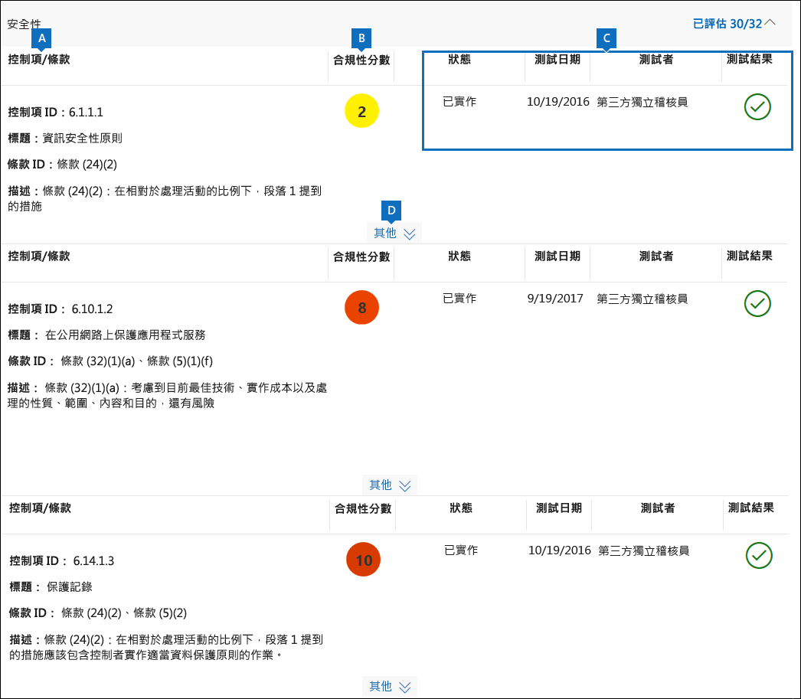
  
  a. 從對應到 Microsoft 管理控制項的認證或法規指定下列資訊。a. Specifies the following information from the certification or regulation that maps to the Microsoft managed control.

  - **控制識別碼** - 控制項所對應認證或規定中的小節或文章號碼。**Control ID** - The section or article number from the certification or regulation that the control maps to.
    
  - **標題** - 所對應憑證或規定的標題。**Title** - The title from the corresponding certification or regulation.
    
  - **文章識別碼** - 僅 GDPR 評估包含此欄位，因為它會指定對應的 GDPR 文章編號。**Article ID** - This field is included only for GDPR assessments, as it specifies the corresponding GDPR article number.
    
  - **描述** - 標準或法規的文字，對應至所選的 Microsoft 管理控制項。**Description** - Text of the standard or regulation that maps to the selected Microsoft managed control.

  b. 控制項的「合規性分數」，這表示與每個 Microsoft 管理控制項相關聯的風險層級 (因不符合或控制項失敗)。如需詳細資訊，請參閱[了解合規性分數](#understanding-the-compliance-score) (英文)。請注意，合規性分數分級介於 1 到 10，且是以色彩標示。黃色表示低風險控制項、橘色表示中風險控制項，而紅色標示高風險控制項。b. The Compliance Score for the control, which indicates the level of risk (due to non-compliance or control failure) associated with each Microsoft managed control. See [Understanding the Compliance Score](#understanding-the-compliance-score) for more information. Note that Compliance Scores are rated from 1 to 10 and are color-coded. Yellow indicates low risk controls, orange indicates medium-risk controls, and red indicated high-risk controls. 
    
  c. 控制項實作狀態的相關資訊、該控制項所測試的日期、執行測試的人員，以及測試結果。c. Information about the implementation status of a control, the date the control was tested, who performed the test, and the test result.
    
  d. 對於每個控制項，您可以按一下 [更多]\*\*\*\* 以查看詳細資訊，包括關於 Microsoft 控制項實作的詳細資料，以及獨立協力廠商稽核員如何測試及驗證控制項的詳細資料。d. For each control, you can click **More** to see additional information, including details about Microsoft's implementation of the control and details about how the control was tested and validated by an independent third-party auditor. 
    
- **客戶管理控制項** - 這是由貴組織所管理控制項的集合。貴組織負責實作這些控制項，作為指定標準或規定合規性程序的一部分。客戶管理控制項也會組織成對應認證或規定的控制項系列。若要進行合規性動作，請使用客戶管理控制項，實作 Microsoft 所建議的建議活動。貴組織可以使用預先設計的指導方針，和每個客戶管理控制項中的建議客戶動作，來管理該控制項的實作和評估程序。**Customer Managed Controls** - This is the collection of controls that are managed by your organization. Your organization is responsible for implementing these controls as part of your compliance process for a given standard or regulation. Customer managed controls are also organized into control families for the corresponding certification or regulation. Use the customer managed controls to implement the recommended actions suggested by Microsoft as part of your compliance activities. Your organization can use the prescriptive guidance and recommended Customer Actions in each customer managed control to manage the implementation and assessment process for that control.
    
    「評估」中的客戶管理控制項也都有內建的工作流程管理功能，可供您用來管理及追蹤貴組織完成「評估」的進度。例如，貴組織中的法務人員可將動作項目指派給 IT 系統管理員，其有執行控制項所建議動作的責任和必要權限。工作完成時，IT 系統管理員可以上傳其實作工作的辨識項 (例如，設定或原則設定的螢幕擷取畫面)，然後將 [動作項目] 指派回法務人員來評估收集到的辨識項、測試控制項的實作，並記錄「合規性管理員」中的實作日期和測試結果。如需詳細資訊，請參閱文章中的[管理評估程序](#managing-the-assessment-process)一節。Customer managed controls in Assessments also have built-in workflow management functionality that you can use to manage and track your organization's progress towards completing the Assessment. For example, a Compliance Officer in your organization can assign an Action Item to an IT admin who has the responsibility and necessary permissions to perform the actions that are recommended for the control. When that work is complete, the IT admin can upload evidence of their implementation tasks (for example, screen shots of configuration or policy settings) and then assign the Action Item back to the Compliance Officer to evaluate the collected evidence, test the implementation of the control, and record the implementation date and test results in Compliance Manager. For more information, see the [Managing the assessment process](#managing-the-assessment-process) section in the article. 
  
## 權限和角色型存取控制Permissions and role-based access control

根據預設，貴組織中使用 Office 365 或 Azure AD 帳戶的所有人員都可存取「合規性管理員」，並可在「合規性管理員」中執行任何動作。若要從預設權限變更為角色型存取控制模型，至少必須將一位使用者新增至每個「合規性管理員」角色 (請參閱下列指示)。使用者新增至角色後，指派給該角色的動作執行權限，會從可供所有使用者使用的預設權限組中移除，只有已佈建該角色的使用者可以存取「合規性管理員」，及執行該角色所允許的動作。By default, everyone in your organization with an Office 365 or Azure AD account has access to Compliance Manager and can perform any action in Compliance Manager. To change from default permissions to the role-based access control model, at least one user must be added to each Compliance Manager role (see the following instructions). After a user is added to a role, the permissions to perform the actions assigned to that role are removed from the default set of permissions available to all users, and only users that have been provisioned that role will be able to access Compliance Manager and perform the actions allowed by that role.
  
一旦您已實作角色型存取後，任何未指派給已定義之「合規性管理員」角色的使用者都會有來賓存取權。Once role-based access has been implemented, any user that is not assigned to a defined Compliance Manager role will have Guest access.
  
> [!NOTE]
> 若要完整實作角色型存取控制，以管理可在「合規性管理員」中存取及執行動作的人員，必須將使用者新增至每個角色，以變更預設的權限。例如，如果您將使用者新增至角色，讓使用者管理評估「評估」，則只有該角色的成員可以管理「評估」。同樣地，如果您沒有將使用者新增至角色，讓使用者讀取「評估」中的資料，則貴組織中的所有使用者都可存取「合規性管理員」及讀取任何「評估」中的資料。To fully implement role-based access control to manage who can access and perform actions in Compliance Manager, a user must be added to each role to change the default permissions. For example, if you add a user to the role that lets users manage Assessments, only members of that role can manage Assessments. Similarly, if you don't add a user to the role that lets users read the data in Assessments, then all users in your organization can access Compliance Manager and read data in any Assessment. 
  
下表說明每個「合規性管理員」權限，以及其允許使用者執行的動作。表格也會顯示每個權限所指派的角色。The following table describes each Compliance Manager permission and what it allows the user do. The table also indicates the role that each permission is assigned to.
  
||**合規性管理員讀取者****Compliance Manager Reader**|**合規性參與者****Compliance Manager Contributor**|**合規性管理員評估者****Compliance Manager Assessor**|**合規性管理員管理者****Compliance Manager Administrator**|**入口網站管理員****Portal Admin**|
|:-----|:-----|:-----|:-----|:-----|:-----|
|**讀取資料** - 使用者可以讀取但無法編輯資料。**Read data** - Users can read but not edit data.    |             |             |             |             |             |
|**編輯資料** - 使用者可以編輯所有欄位，除了 [測試結果] 和 [測試日期] 欄位以外。**Edit data** - Users can edit all fields, except the Test Result and Test Date fields.    ||             |             |             |             |
|**編輯測試結果** - 使用者可以編輯 [測試結果] 和 [測試日期] 欄位。**Edit test results** - Users can edit the Test Result and Test Date fields.    |||             |             |             |
|**管理評估** - 使用者可以建立、封存和刪除「評估」。**Manage assessments** - Users can create, archive, and delete Assessments.    ||||             |             |
|**管理使用者** - 使用者可以在其組織中，將其他使用者新增至「讀取者」、「參與者」、「評估者」和「管理員」角色。貴組織中具有全域管理員角色的使用者才可以從入口網站管理員角色中新增或移除使用者。**Manage users** - Users can add other users in their organization to the Reader, Contributor, Assessor, and Administrator roles. Only those users with the Global Administrator role in your organization can add or remove users from the Portal Admin role.    |||||             |
   
### 來賓存取Guest access
  
「合規性管理員」存取設定完成後，根據預設，沒有佈建角色的任何使用者都會在 [來賓存取]\*\*\*\* 角色中 (這也是任何如個人 Microsoft 帳戶等非組織佈建帳戶的體驗)。[來賓存取] 使用者無法完整存取所有「合規性管理員」功能，且無法看到任何組織的合規性評估資料，無論他們可如何使用「合規性管理員」來檢視 Microsoft 的合規性評估報告，和服務信任文件。如需可存取和不可存取內容的說明，請參閱下面影像，可存取的功能會以藍色外框顯示，不可存取的功能會以紅色外框顯示。After Compliance Manager access has been configured, any user that does not have a provisioned role is in the **Guest access** role by default (which is also the experience of any non-organization-provisioned accounts like personal Microsoft Accounts). Guest Access users do not have full access to all of the Compliance Manager features and are not able to see any of the organization's compliance assessment data, however they are able to use Compliance Manager to view Microsoft's compliance assessment reports and Service Trust documents. For an illustration of what is and is not accessible, see the images below where accessible features are outlined in blue and inaccessible features are outlined in red. 
  
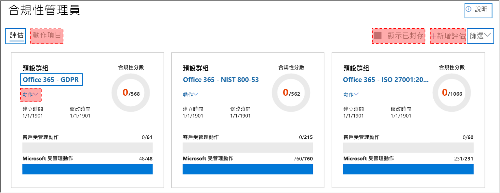
  
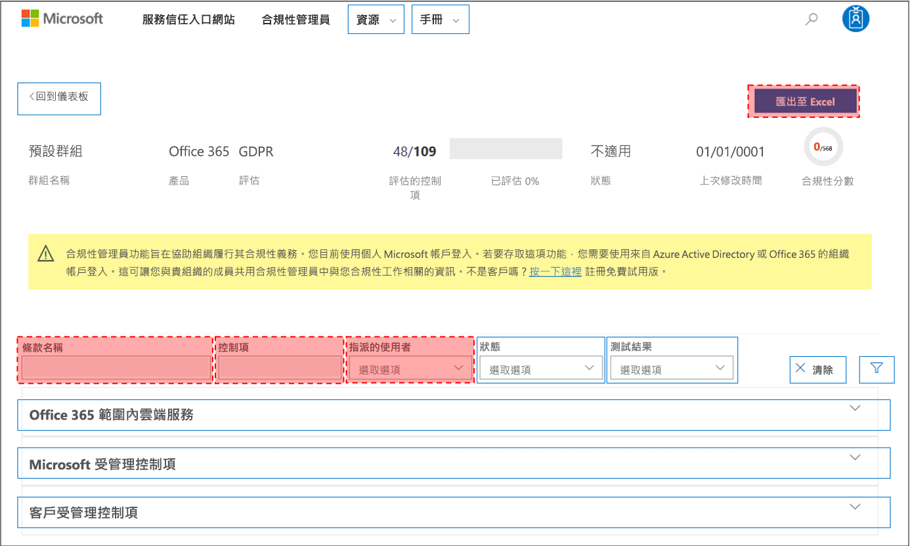

## 了解合規性分數Understanding the Compliance Score

在儀表板上，「合規性管理員」會在磚的右上角顯示 Office 365 評估的總分。這是「評估」的整體總「合規性分數」，且是「評估」中每個標示為 [已實作] 和 [已測試] 控制項評估所收到的累積分數。新增「評估」時，您會看到「合規性分數」已接近完成，因為 Microsoft 已實作、且經獨立協力廠商測試的 Microsoft 管理控制項都已套用。On the Dashboard, Compliance Manager displays a total score for Office 365 assessments in the upper right hand corner of the tile. This is the overall total Compliance Score for the Assessment, and is the accumulation of points received for each control assessment that has been marked as Implemented and Tested in the Assessment. When adding an Assessment, you will see that the Compliance Score is already on the way towards completion because the points for the Microsoft managed controls that have been implemented by Microsoft and tested by independent third parties are already applied.
  

  
其餘的分數是來自成功的客戶控制項評估、來自實作及測試客戶管理控制項，每一項都有特定值，作為整體合規性分數。The remaining points come from the successful customer control assessment, from the implementation and testing of the customer-managed controls, each of which has a specific value that contributes to the overall compliance score. 
  
每個「評估」都會顯示以風險為基礎的合規性分數，可協助您評估與「評估」中每個控制項 (包括 Microsoft 管理與客戶管理控制項) 相關聯的風險層級 (因為非合規性或控制項失敗)。每個客戶管理控制項都會指派可能的點數 (稱為「嚴重性排名」\*\*)，範圍從 1 到 10，其中與控制項失敗時較高風險相關聯的控制項會獲得較高分，風險較低的控制項則獲得較低分數。Each Assessment displays a risk-based Compliance Score to help you assess the level of risk (due to non-compliance or control failure) associated with each control (including both Microsoft managed and customer managed controls) in an Assessment. Each customer managed control is assigned a possible number of points (called a  *severity ranking*  ) on a scale from 1 to 10, where more points are awarded for controls associated with a higher risk factor if the control fails, and fewer points are awarded for lower-risk controls. 
  
例如，如下所示的使用者存取管理評估控制項具有非常高的嚴重性風險排名，因此會顯示 10 的指派值。For example, the User Access Management assessment control shown below has a very high severity risk ranking, and displays an assigned value of 10.
  

  
 相較之下，如下所示的資訊備份評估控制項具有較低的嚴重性風險排名，因此會顯示 3 的指派值。By comparison, the Information Backup assessment control shown below has a lower severity risk ranking, and displays an assigned value of 3. 
  
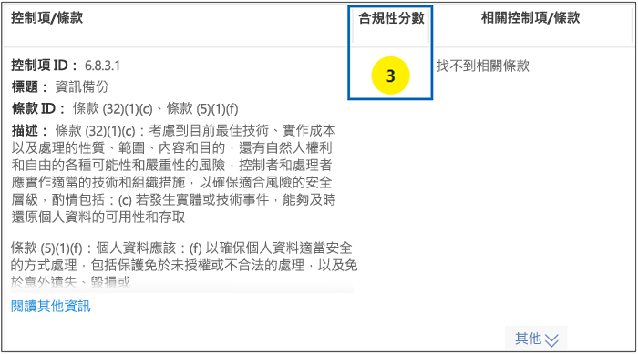
  
合規性管理員會指派預設嚴重性排名給每個控制項。風險排名是根據下列準則來計算：The Compliance Manager assigns a default severity ranking to each control. Risk rankings are calculated based on the following criteria:
  
- 控制項是否避免事件發生 (最高排名) 會偵測所發生的事件，或修正事件的影響 (最低排名)。針對嚴重性排名，防止威脅且為必要的控制項會指派最多點數；需偵測或修正的控制項 (無論是必要或選擇性) 會指派最少點數。Whether a control prevents incidents from happening (highest ranking), detects incidents that have happened, or corrects the impact of an incident (lowest ranking). In terms of severity ranking, a control that prevents a threat and is mandatory is assigned the highest number of points; controls that are detective or corrective (regardless of whether they're mandatory or discretionary) are assigned the lowest number of points.
    
- 控制項 (經實作之後) 是必要的，因此使用者無法繞徑 (例如，使用者必須重設使用者密碼，並符合密碼長度和字元要求)，或是選擇性的，而使用者可以繞徑 (例如，要求使用者在他們的電腦自動安裝時鎖定螢幕畫面的商務規則)。Whether a control (after it's been implemented) is mandatory and therefore can't be by-passed by users (for example, users having to reset their password and meet password length and character requirements) or discretionary and can be by-passed by users (for example, business rules that require users to lock their screens when their computers are unattended).
    
- 與資料機密性、完整性和可用性風險相關的控制項，無論這類風險是來自內部或外部威脅，或是威脅是惡意還是意外的。(例如，可協助防止外部攻擊者破壞網路，並取得個人識別資訊存取權的控制項，會比與避免員工不小心將網路路由器設定設定錯誤控制項而導致網路中斷的相關控制項指派更多點數)。Controls related to risks to data confidentiality, integrity, and availability, whether these risks come from internal or external threats, and whether the threat is malicious or accidental. For example, controls that would help prevent an external attacker from breaching that network and gaining access to personally identifiable information would be assigned more points than a control related to preventing an employee from accidentally mis-configuring a network router setting that results in a network outage).
    
- 每個控制項與法律和外部驅動程式相關的風險，例如合約、法規和公用承諾。Risks related to legal and external drivers, such as contracts, regulations, and public commitments, for each control.
    
顯示的控制項合規性分數值會依通過/失敗基礎「完整」套用\*\* 至合規性總分--控制項實作並通過後續評估測試，或相反狀況；沒有部分實作的部分分數。僅當控制項將其 [實作狀態]\*\*\*\* 設為 [已實作]\*\*\*\* 或 [替代實作]\*\*\*\*，且 [測試結果]\*\*\*\* 設為 [通過]\*\*\*\* 時，指派的點數才會新增至合規性總分。The displayed Compliance Score values for the control are applied  *in their entirety*  to the Total Compliance Score on a pass/fail basis--either the control is implemented and passes the subsequent assessment test or it does not; there is no partial credit for a partial implementation. Only when the control has its **Implementation Status** set to **Implemented** or **Alternative Implementation** and the **Test Result** is set to **Passed** are the assigned points added to the Total Compliance Score. 
  
最重要的是，合規性分數可協助您安排要優先專注進行實作的控制項，方法是指出在發生與控制項相關的失敗時，哪些控制項具有較大的潛在威脅。除了風險優先順序之外，值得注意的是，評估控制項與其他控制項相關時 (不論是在相同的評估內，或是相同評估群組中的另一個評估中)，成功 完成單一控制項可能會大幅降低根據控制項測試結果同步處理的工作。Most importantly, the Compliance Score can help you prioritize which controls to focus on for implementation by indicating which controls that have a higher potential risk if there is a failure related to a control. In addition to risk-based prioritization, it is worthwhile noting that where assessment controls are related to other controls (either within the same assessment or in another assessment that is in the same assessment grouping) completing a single control successfully can result in a significant reduction of effort based on the synchronization of control test results.
  
例如，在下圖中，我們看到 Office 365 - GDPR 評估目前已評估 46%，111 個控制項評估中，有 51 個已完成，合規性總分為 289 分 (滿分 600)。For example, in the image below we see that the Office 365 - GDPR Assessment is currently 46% assessed, with 51 of 111 control assessments completed for a Total Compliance score of 289 out of a possible 600.
  
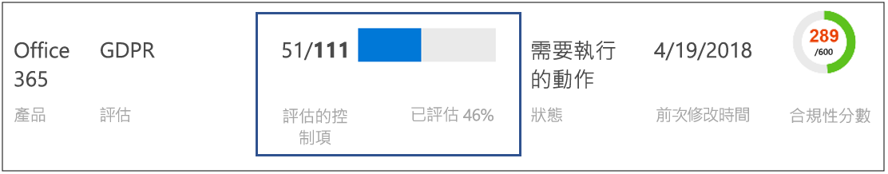
  
在評估中，GDPR 控制項 7.5.5 與其他5 個控制項相關 (7.4.1、7.4.3、7.4.4、7.4.8 和 7.4.9)，每個都有 6 或 8 分的中高嚴重性風險排名分數。使用評估篩選器，我們選取了這所有的控制項，讓它們可在 [評估] 檢視中顯示，且可從下方看到，它們全都尚未評估。Within the assessment GDPR control 7.5.5 is related to 5 other controls (7.4.1, 7.4.3, 7.4.4,.7.4.8, and 7.4.9) each with a moderate to high severity risk rating score of 6 or 8). Using the assessment filter, we have selected all of these controls, making them visible in the assessment view, and can see below that none of them have been assessed. 
  
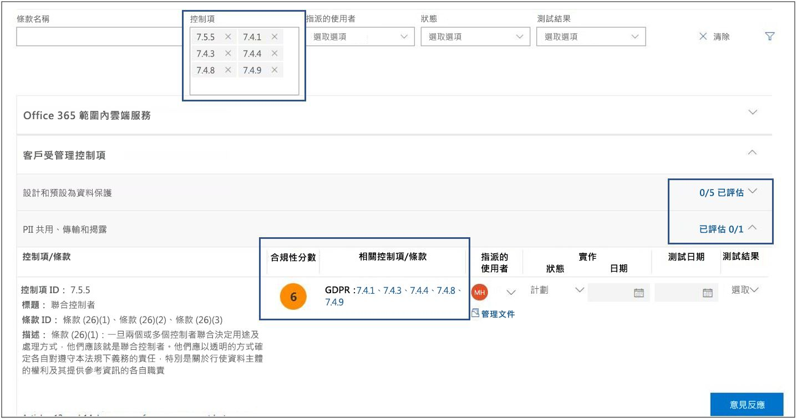 由於這 6 個控制項都是相關的，完成其中任何一個都將導致此評估內相關 控制項中的測試結果同步處理 (就像相同評估群組中任何相關控制項的那樣)。在實作完成且測試 GDPR 控制項 7.5.5 之後，控制項詳細資料區域會重新整理，以顯示 6 個控制項都已評估，相對會增加已評估控制項的數目至 57，且 51% 已評估，合規性總分會變更 + 40。As those 6 controls are related, the completion of any one them will result in a synchronization of those test results across the related controls within this assessment (just as it will for any related controls in an assessment that is in the same assessment grouping). Upon completion of the implementation and testing of GDPR control 7.5.5, the control detail area refreshes to show that all 6 controls have been assessed, with a corresponding increase in the number of assessed controls to 57 and 51% assessed, and a change in total Compliance Score of +40. 
  
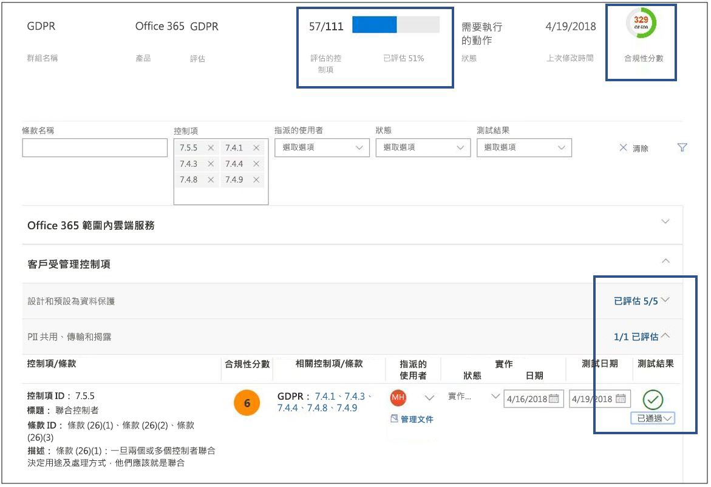
  
如果您要使用會影響其他相關控制項的方式來變更相關控制項的 [實作狀態]，將會顯示此確認更新對話方塊。This confirmation update dialog box will appear if you are about to change the Implementation Status of a related control in a way that will impact the other related controls.
  
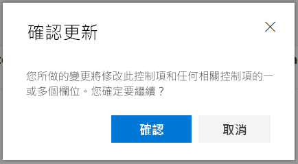
  
> [!NOTE]
> 目前，只有 Office 365 雲端服務的評估會包括合規性分數。Azure 和 Dynamics 的評估會顯示評估狀態。Currently, only Assessments for Office 365 cloud services include a Compliance Score. Assessments for Azure and Dynamics show an assessment status. 

## 合規性分數方法Compliance Score methodology

合規性分數 (如 Microsoft 安全分數) 類似於其他行為式評分系統；貴組織的活動會增加其合規性分數，方法為執行與資料保護、隱私權和安全性相關的活動。The Compliance Score, like the Microsoft Secure Score, is similar to other behavior-based scoring systems; your organization's activity can increase its Compliance Score by performing activities related to data protection, privacy, and security.
  
> [!NOTE]
> 合規性分數並不會表達組織符合任何特定標準或規定的絕對測量。而是表示您採用控制項的程度，可降低個人資料和個別隱私權的風險。沒有任何服務可保證您符合標準或規定，且不能以任何形式解釋合規性分數作為保證。The Compliance Score does not express an absolute measure of organizational compliance with any particular standard or regulation. It expresses the extent to which you have adopted controls which can reduce the risks to personal data and individual privacy. No service can guarantee that you are compliant with a standard or regulation, and the Compliance Score should not be interpreted as a guarantee in any way. 
  
「合規性管理員」中的「評估」是根據雲端運算的責任分擔模型。在責任分擔模型中，Microsoft 和每位客戶會分擔責任，當資料儲存在我們的雲端時，共同保護客戶的資料。Assessments in Compliance Manager are based on the shared responsibility model for cloud computing. In the shared responsibility model, Microsoft and each customer share responsibility for the protection of the customer's data when that data is stored in our cloud.
  
如下列 Office 365 GDPR 評估所示，Microsoft 和客戶分別負責執行多項動作，專為滿足要評估的要求標準或規定所設計。為了合理化並了解各種標準和規定所需的動作，合規性管理員會將所有標準和規定當成控制項架構。因此，由 Microsoft 和每個「評估」的客戶所執行的動作包括實作和驗證不同的控制項。As shown in the Office 365 GDPR Assessment below, Microsoft and customers are each responsible for performing a variety of Actions that are designed to satisfy the requirements of the standard or regulation being assessed. To rationalize and understand the required Actions across a variety of standards and regulations, Compliance Manager treats all standards and regulations as if they were control frameworks. Thus, the Actions performed by Microsoft and by customers for each Assessment involve the implementation and validation of various controls.
  
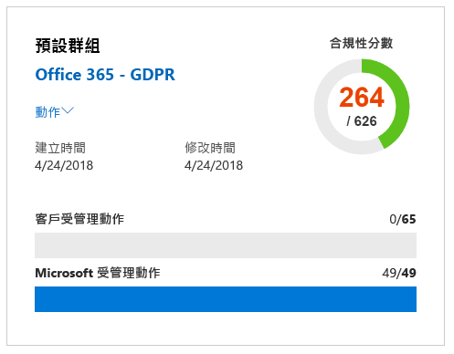
  
以下是執行一般動作的基本工作流程：Here's the basic workflow for a typical Action:
  
1. 組織的合規性、風險、隱私權和/或資料保護長會將工作指派給組織中的人員以實作控制項。該人員可能為：The Compliance, Risk, Privacy, and/or Data Protection Officer of an organization assigns the task to someone in the organization to implement a control. That person could be:

    - 企業原則擁有者A business policy owner
    
    - IT 實施者An IT implementer
    
    - 組織中負責執行工作的另一個人員Another individual in the organization who has responsibility for performing the task
    
2. 該人員會執行實作控制項所需的工作、將實作的辨識項上傳到合規性管理員，並將繫結至控制項的動作標記為已實作。一旦完成這些工作後，他們會將動作指派至評估進行驗證。評估者可能是：That individual performs the tasks necessary to implement the control, uploads evidence of implementation into Compliance Manager, and marks the control(s) tied to the Action as implemented. Once these tasks are completed, they assign the Action to an Assessor for validation. Assessors can be:
    
    - 在組織中執行控制項驗證的內部評估者Internal assessors that perform validation of controls within an organization
    
    - 檢查、驗證及證實合規性的外部評估者，例如稽核 Microsoft 雲端服務的協力廠商獨立組織External assessors that examine, verify, and certify compliance, such as the third-party independent organizations that audit Microsoft's cloud services
    
3. 評估者會驗證控制項及檢查辨識項，並將控制項標記為已評估，以及評估的結果 (例如，跳過)。The Assessor validates the control and examines the evidence and marks the control(s) as assessed and the results of the assessment (e.g., passed).
    
一旦評估過所有與「評估」相關聯的控制項後，評估就會視為完成。Once all the controls associated with an Assessment have been assessed, the Assessment is considered completed.
  
合規性管理員中的每個「評估」都會預先載入資訊，提供 Microsoft 所採取的動作，滿足 Microsoft 所負責控制項需求的詳細資料。這項資訊包含有關 Microsoft 如何實作每個控制項，以及協力廠商稽核者評估及驗證 Microsoft 實作的方式與時機相關詳細資料。基於這個原因，每個「評估」的 Microsoft 管理控制項都會標示為 [已評估]，且「評估」的合規性分數會加以反映。Every Assessment in Compliance Manager comes pre-loaded with information that provides details about the Actions taken by Microsoft to satisfy the requirements of the controls for which Microsoft is responsible. This information includes details about how Microsoft has implemented each control and how and when Microsoft's implementation was assessed and verified by a third-party auditor. For this reason, the Microsoft Managed Controls for each Assessment are marked as Assessed, and the Compliance Score for the Assessment reflects this.
  
每個評估都會包含根據責任分擔模型的合規性分數總計。Microsoft 的 Office 365 控制項實作和測試都會計入與 GDPR 評估相關聯總分的一部分。當客戶實作和測試每個客戶動作時，「評估」的合規性分數會依指派給控制項的值而增加。Each Assessment includes a total Compliance Score based on the shared responsibility model. Microsoft's implementation and testing of controls for Office 365 contributes a portion of the total possible points associated with a GDPR assessment. As the customer implements and tests each of the customer Actions, the Compliance Score for the Assessment will increase by the value assigned to the control. 
  
 ### 風險計分方法Risk-based scoring methodology
  
合規性管理員會使用風險計分方法，計分範圍從 1-10，並在控制項失敗或不符合的情況下指派較高的值給代表較高的風險。合規性分數所使用的計分系統是根據幾個重要的因素，例如：Compliance Manager uses a risk-based scoring methodology with a scale from 1-10 that assigns a higher value to controls that represent a higher risk in the event the control fails or is non-compliant. The scoring system used by Compliance Score is based on several key factors, such as:
  
- 控制項的本質The essence of the control
    
- 根據威脅類型的控制項風險層級The level of risk of the control based on the kinds of threats
    
- 控制項的外部驅動程式The external drivers for the control
    
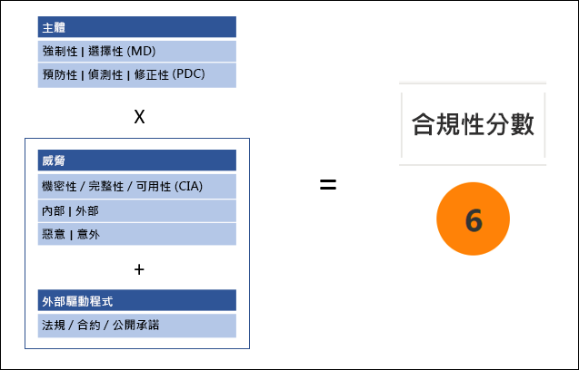
  
 ### 控制項的本質Essence of the control
  
控制項的本質取決於控制項是強制或是選擇性的，以及是否為預防性、偵測性還是修正性的。The essence of the control is based on whether the control is Mandatory or Discretionary, and whether it is Preventative, Detective, or Corrective.
  
 ### 必要或選擇性Mandatory or discretionary
  
 「強制控制項」\*\* 是無法故意或無意略過的控制項。通用強制控制項的範例是集中管理密碼原則，可設定密碼長度、複雜度及到期日的需求。使用者必須符合這些需求，才能存取系統。*Mandatory controls*  are controls that cannot be bypassed either intentionally or accidentally. An example of a common mandatory control is a centrally-managed password policy that sets requirements for password length, complexity, and expiration. Users must comply with these requirements in order to access the system. 
  
 「選擇性控制項」\*\* 依賴使用者了解原則，並採取適當動作。例如，當使用者離開電腦時會要求鎖定電腦的原則是選擇性控制項，因為它依賴使用者。*Discretionary controls*  rely upon users to understand policy and act accordingly. For example, a policy requiring users to lock their computer when they leave it is a discretionary control because it relies on the user. 
  
 ### 預防性、偵測性或修正性Preventative, detective, or corrective
  
 「預防性控制項」\*\* 會避免特定的風險。例如，使用加密靜態保護資訊是預防攻擊、入侵等的預防性控制項。責任分散是預防性控制項，可管理感興趣的衝突及防止詐騙。*Preventative controls*  are those that prevent specific risks. For example, protecting information at rest using encryption is a preventative control against attacks, breaches, etc. Separation of duties is a preventative control to manage conflict of interest and to guard against fraud. 
  
 「偵測性控制項」\*\* 是主動監視系統，可找出代表風險或可用來偵測入侵或判斷是否已發生弱點的不規則條件或行為。系統存取稽核及特殊權限系統管理動作稽核是不同類型的偵測性監視控制項；法規合規性稽核是一種偵測性控制項，可用來找出程序問題。*Detective controls*  are those that actively monitor systems to identify irregular conditions or behaviors that represent risk or that can be used to detect intrusions or determine if a breach has occurred. System access auditing and privileged administrative actions auditing are types of detective monitoring controls; regulatory compliance audits are a type of detective control used to find process issues. 
  
 「修正性控制項」\*\* 會嘗試將不良的安全性事件保持在最小值、採取修正動作以降低立即的效果及回復損毀，如果可能的話。隱私權事件回應是修正性控制項，可在入侵後將損害及還原系統限制為作業狀態。*Corrective controls*  are those that try to keep the adverse effects of a security incident to a minimum, take corrective action to reduce the immediate effect, and reverse the damage, if possible. Privacy incident response is a corrective control to limit damage and restore systems to an operational state after a breach. 
  
我們使用這些因素評估每一個控制項，可決定控制項的本質，並將相對於其所代表之風險的值指派給它。By evaluating each control using these factors, we determine the essence of the control and assign it a value relative to the risk that it represents.
  
 **威脅****Threat**
  
||||
|:-----|:-----|:-----|
||**強制性****Mandatory**   |**選擇性****Discretionary**   |
|**預防性****Preventative**   |高風險High risk    |中度風險Medium risk    |
|**偵測性****Detective**   |中度風險Medium risk    |低風險Low risk    |
|**修正性****Corrective**   |中度風險Medium risk    |低風險Low risk    |
   
威脅是指會對基本且廣泛接受的安全性標準造成風險的任何項目，稱為資料的 CIA 三角理論：機密性、完整性和可用性：Threat refers to anything that poses a risk to the fundamental, universally-accepted security standard known as the CIA triad for data: Confidentiality, Integrity, and Availability:
  
- 機密性表示資訊只能由信任的授權對象閱讀及了解。Confidentiality means that information can be read and understood only by trusted, authorized parties.
    
- 完整性表示資訊尚未由未授權的使用者修改或損毀。Integrity means that information has not been modified or destroyed by unauthorized parties.
    
- 可用性表示資訊隨時可供存取，並具有高品質的服務。Availability means that information can be accessed readily with a high level of quality of service.
    
這些特性失敗會視為單一入侵系統。威脅可能來自內部和外部來源，且執行者的意圖可能是不小心或惡意的。這些因素會在威脅模型中估計，將高、中或低的威脅層級指派給每個案例組合。A failure of any of these characteristics is considered a compromise of the system as a whole. Threats can come from both internal and external sources, and an actor's intent can be accidental or malicious. These factors are estimated in a threat matrix that assigns threat levels of either High, Moderate, or Low to each combination of scenarios.

||**內部****Internal** ||**外部****External** ||||
|:-----|:-----|:-----|:-----|:-----|:-----|:-----|
||*惡意**Malicious* |*意外**Accidental* |*惡意**Malicious* |*意外**Accidental* |||
|**具機密性****Confidentiality** |(H、M 或 L)(H, M, or L)    |(H、M 或 L)(H, M, or L)    |(H、M 或 L)(H, M, or L)    |(H、M 或 L)(H, M, or L)|
|**完整性****Integrity** |(H、M 或 L)(H, M, or L)    |(H、M 或 L)(H, M, or L)    |(H、M 或 L)(H, M, or L)    |(H、M 或 L)(H, M, or L)|
|**可用性****Availability** |(H、M 或 L)(H, M, or L)    |(H、M 或 L)(H, M, or L)    |(H、M 或 L)(H, M, or L)    |(H、M 或 L)(H, M, or L)|
   
 **外部驅動程式****External drivers**
  
|**合約****Contracts**|**法規****Regulations**|**公開承諾****Public commitments**|
|:-----|:-----|:-----|
|(H、M 或 L)(H, M, or L)    |(H、M 或 L)(H, M, or L)    |(H、M 或 L)(H, M, or L)    |
   
相關法規、合約和公開承諾等外部因素可能會影響設計用來保護資料，並避免資料入侵的控制項，這些因素每一個都會指派高、中或低的風險值。External factors such as applicable regulations, contracts, and public commitments can influence controls designed to protect data and prevent data breaches, and each of these factors are assigned risk values or High, Moderate or Low.
  
在 CIA/威脅和法律/外部驅動程式代表的 15 個可能風險案例中這些高、中或低的風險值預估出現次數會加以結合來提供風險加權，將指定數值的風險出現次數和可能性視為重要的，並在計算控制項的嚴重性等級時納入考量。The estimated number of occurrences of these risk values of High, Moderate, or Low across the 15 possible risk scenarios represented in the CIA/Threat and Legal/External Drivers are combined to provide a risk weighting, which considers the likelihood and number of occurrences of risks at a given value as significant and is taken into consideration when calculating the severity ranking of the control.
  
根據控制項的嚴重性等級，控制項會被指派數字 1 (最低) 到 10 (最高) 之間的合規性分數，分成下列的風險類別：Based on the control's severity ranking, the control is assigned its compliance score value, a number between 1 (low) and 10 (high), grouped into the following categories of risk:
  
|**風險層級****Risk level**|**控制項的值****Control value**|
|:-----|:-----|
|低Low    |1-31-3    |
|仲裁Moderate    |66    |
|高High    |88    |
|嚴重Severe    |1010    |
   
藉由透過最高合規性分數值來排列評估控制項的優先順序，組織將會集中於最高風險的項目，及接收比例較高的正面意見反應，針對每個已完成的控制項評估將更多分數新增至合規性分數總分。By prioritizing assessment controls with the highest compliance score values, the organization will be concentrating on the highest risk items and receive proportionally higher positive feedback in the form of more points added to the total compliance score for the assessment for each control assessment completed.
  
### 計分方法摘要Summmary of scoring methodology
  
合規性分數是合規性管理員協助組織了解及管理其合規性方式的核心元件。評估的合規性分數是公司使用特定標準與法規作為數字的合規性運算式，分數越高 (最高為「評估」的配置分數上限)，公司的合規性狀態越好。了解合規性計分方法，其中評估控制項會指派介於 1-10 (最高到最低) 的風險嚴重性值，以及完成的控制項評估如何新增至合規性分數總分，對於組織優先處理其動作是很重要的。The Compliance Score is a core component of the way that Compliance Manager helps organizations understand and manage their compliance. The Compliance Score for an assessment is an expression of the company's compliance with a given standard or regulation as a number, where the higher the score (up to the maximum number of points allocated for the Assessment), the better the company's compliance posture. Understanding the compliance scoring methodology in which assessment controls are assigned risk severity values between 1- 10 (low to high), and how completed control assessments add to the total compliance score is crucial to organizations for prioritizing their actions.

## 群組評估Grouping Assessments

當您建立新的評估時，系統會提示您建立指派「評估」的新群組，或指派「評估」至現有的群組。群組可讓您以邏輯方式組織「評估」，並共用「評估」之間一般資訊與工作流程工作，其具有相同或相關的客戶管理控制項。When you create a new Assessment, you're prompted to create a new group to assign the Assessment to or assign the Assessment to an existing group. Groups allow you to logically organize Assessments and share common information and workflow tasks between Assessments that have the same or related customer managed controls.
  
例如，您可以在貴組織內依年或小組、部門或機關群組「評估」，或依年將它們群組。以下是幾個群組的範例，以及其中可能包含的「評估」。For example, you could group Assessments by year or teams, departments, or agencies within your organization or group them by year. Here are some examples of groups and the Assessments they might contain.
  
- GDPR 評估 - 2018GDPR Assessments - 2018
    
  - Office 365 + GDPROffice 365 + GDPR
    
  - Azure + GDPRAzure + GDPR
    
  - Dynamics + GDPRDynamics + GDPR
    
- Azure 評估 - 2018Azure Assessments - 2018
    
  - Azure + GDPRAzure + GDPR
    
  - Azure + ISO 27001:2013Azure + ISO 27001:2013
    
  - Azure + ISO 27018:2014Azure + ISO 27018:2014
    
- 資料安全性與隱私權評估Data Security and Privacy Assessments
    
  - Office 365 + ISO 27001:2013Office 365 + ISO 27001:2013
    
  - Office 365 + ISO 27018:2014Office 365 + ISO 27018:2014
    
  - Azure + ISO 27001:2013Azure + ISO 27001:2013
    
  - Azure + ISO 27018:2014Azure + ISO 27018:2014
    
> [!TIP]
> 建議您判斷貴組織的群組策略，然後再新增新的評估。We recommend that your determine a grouping strategy for your organization before adding new assessments. 
  
以下是幾種群組評估的需求：These are the requirements for grouping Assessments:
  
- 群組名稱 (也稱為「群組 ID」\*\*) 在貴組織中必須是唯一的。Group names (also called  *Group IDs*  ) must be unique within your organization. 
    
- 群組可以包含相同憑證/規定的「評估」，但每個群組針對特定的雲端服務/認證組只能包含一個「評估」。例如，群組不能包含 Office 365 和 GDPR 的兩個「評估」。同樣地，只要每個的對應憑證/規定不同，群組就可以包含同一個雲端服務的多個「評估」。Groups can contain Assessments for the same certification/regulation, but each group can only contain one Assessment for a specific cloud service/certification pair. For example, a group can't contain two Assessments for Office 365 and GDPR. Similarly, a group can contain multiple Assessments for the same cloud service as long as the corresponding certification/regulation for each one is different.
    
一旦將評估新增至評估群組後，就無法變更群組。您可以重新命名評估群組，會變更所有與該群組相關聯評估的評估群組名稱。您可以建立新的評估和新的評估群組，並從現有的評估複製資訊，這樣會在不同的評估群組中有效建立該評估的複本。封存評估會中斷評估與評估群組之間的關係；對其他相關評估的任何進一步更新都不會再反映於封存的評估中。Once an assessment has been added to an assessment grouping, the grouping cannot be changed. You can rename the assessment group, which changes the name of the assessment grouping for all of the assessments associated with that group. You can create a new assessment and a new assessment group and copy information from an existing assessment, which effectively creates a duplicate of that assessment in a different assessment group. Archiving an assessment breaks the relationship between that assessment and the assessment group; any further updates to other related assessments are no longer reflected in the archived assessment.
  
如先前所述，使用群組的主要優點之一是，當同一個群組中兩個不同「評估」共用相同的客戶管理控制權 (因此每個控制項的客戶動作都一樣) 時，在一個「評估」中完成實作詳細資料、測試資訊以及控制項的狀態，會同步處理至群組中任何其他「評估」的同一個控制項。換句話說，如果「評估」共用相同的控制項，且這些「評估」位於同一個群組，您就只須管理一個「評估」中控制項的評估程序。該控制項的結果將會自動同步到其他「評估」。例如，ISO 27001 和 ISO 27018 都有關於密碼原則的控制項。如果一個「評估」中的控制項測試狀態設定為「通過」，只要兩個評估都屬於同一個「評估」群組，其他「評估」中的控制項將會更新 (並標示為「通過」)。As previous explained, one key advantage of using groups is that when two different Assessments in the same group share the same customer managed control (and therefore the customer actions would be the same for each control), then the completion of implementation details, testing information, and status for the control in one Assessment would be synchronized to the same control in any other Assessment in the group. In other words, if Assessments share the same control and those Assessments are in the same group, you'd only have to manage the assessment process for the control in one Assessment. The results for that control will be automatically synchronized to other Assessments. For example, ISO 27001 and ISO 27018 both have a control related to password policies. If the Test Status for the control is set to "Passed" in one Assessment, the control will be updated (and marked as "Passed") in the other Assessment, as long as both assessments are part of the same Assessment Group.
  
作為範例，請考慮這兩個相關的評估控制項，每個都與公用網路資料加密有關，Office 365 中的控制項 6.10.1.2 - GDPR 評估，和 Office 365 中的控制項 SC-13 - NIST 800-53 評估。這些是相關的評估控制項，在兩個不同的評估中；一開始，沒有任何評估完成任何客戶的控制項評估，如合規性管理員儀表板所顯示的下列兩個「評估」。As an example of this, consider these two related assessment controls, each having to do with encryption of data on public networks, control 6.10.1.2 in the Office 365 - GDPR assessment, and control SC-13 in the Office 365 - NIST 800-53 assessment. These are related assessment controls, in two different assessments, both in the Default Group; initially, neither assessment has completed any customer control assessments, as is displayed on the Compliance Manager Dashboard that shows these two Assessments.
  
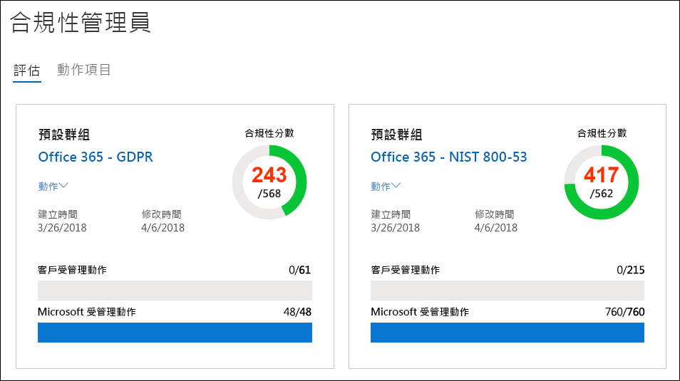
  
按一下 [Office 365 - GDPR]\*\*\*\* 評估，並使用篩選控制項，可檢視 GDPR 控制項 6.10.1.2，我們會看到 NIST 800-53 控制項 SC 13 列為相關的控制項。By clicking the **Office 365 - GDPR** assessment, and using the filter controls to view GDPR control 6.10.1.2, we see that NIST 800-53 control SC-13 is listed as a related control.
  
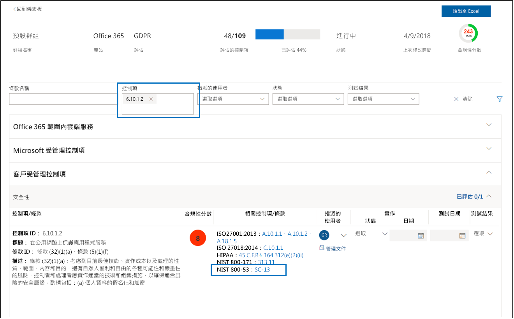
  
 我們在這裡顯示實作完成和測試 GDPR 控制項 6.10.1.2。Here we show the completion of the implementation and testing of GDPR control 6.10.1.2. 
  
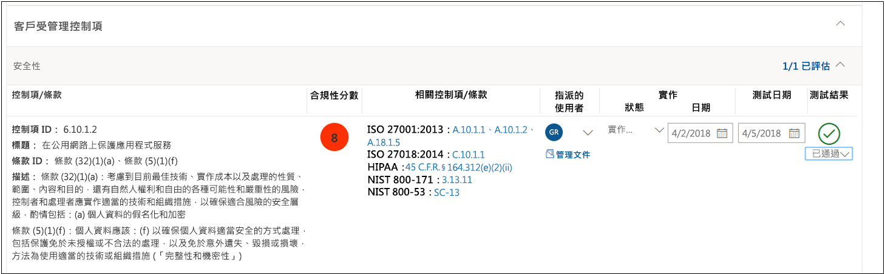
  
瀏覽至群組評估中相關的控制項，我們可以看到 NIST 800-53 SC-13 也已使用相同的日期與時間標示為已完成，而無需其他實作或測試工作。By navigating to the related control in the grouped assessment, we see that NIST 800-53 SC-13 has also been marked as completed with the same date and time, with no additional implementation or testing effort.
  
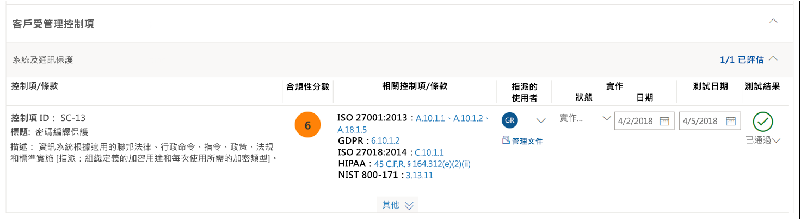
  
回到儀表板中，我們可以看到每個評估有 1 個控制項評估已完成，且每個評估的合規性總分增加了 8 (該共用控制項的合規性分數值)。Back at the Dashboard, we can see that each assessment has 1 control assessment completed and that the total Compliance Score for each assessment has increased by 8 (the compliance score value of that shared control).
  
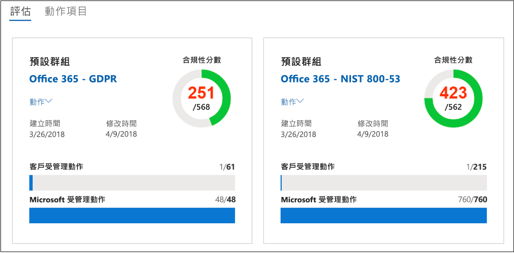

## 系統管理功能Administrative functions

有特定的系統管理功能，僅提供給租用戶系統管理員帳戶，且僅當以全域系統管理員身分登入時才會顯示。There are specific administrative functions that are only available to the tenant administrator account, and will only be visible when logged in as a global administrator.
  
> [!NOTE]
> 下拉式清單中受限制文件的權限存取可讓系統管理員提供使用者存取 Microsoft 在服務信任入口網站上共用的受限制文件。受限制的文件功能無法使用，但即將推出。The Access to Restricted Documents permission in the drop-down list will allow administrators to give users access to restricted documents that Microsoft shares on the Service Trust Portal. The Restricted Documents feature isn't available, but is coming soon. 
  
### 將合規性管理員角色指派給使用者Assigning Compliance Manager roles to users

每個合規性管理員角色都有不太相同的權限。您可以檢視指派給每個角色的權限、可以查看哪些使用者位於哪些角色中，以及透過服務信任入口網站新增使用者或從該角色中移除使用者，方法是選取 [系統管理員]\*\*\*\* 功能表項目，然後選擇 [設定]\*\*\*\*。Each Compliance Manager role has slightly different permissions. You can view the permissions assigned to each role, see which users are in which roles, and add or remove users from that role through the Service Trust Portal by selecting the **Admin** menu item, and then choosing **Settings**. 
  
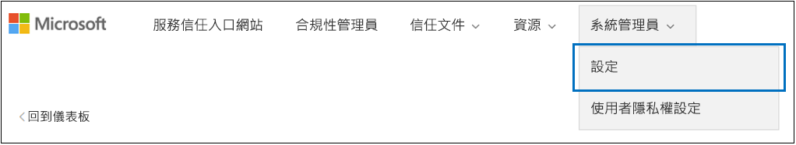
  
若要新增使用者或從合規性管理員角色中移除使用者。To add or remove users from Compliance Manager roles.
  
1. 請移至 [https://servicetrust.microsoft.com](https://servicetrust.microsoft.com)。Go to [https://servicetrust.microsoft.com](https://servicetrust.microsoft.com).
    
2. 使用您的 Azure Active Directory 全域系統管理員帳戶登入。Sign in with your Azure Active Directory global administrator account.
    
3. 在服務信任入口網站頂端的功能表列上，按一下 [系統管理員]\*\*\*\*，然後選擇 [設定]\*\*\*\*。On the Service Trust Portal top menu bar, click **Admin** and then choose **Settings**. 
    
4. 在 [選取角色]\*\*\*\* 下拉式清單中，按一下您想要管理的角色。In the **Select Role** drop-down list, click the role that you want to manage. 
    
5. 新增至每個角色的使用者會列在 [選取角色]\*\*\*\* 頁面上。Users added to the each role are listed on the **Select Role** page. 
    
6. 若要將使用者新增至此角色，請按一下 [新增]\*\*\*\*。在 [新增使用者]\*\*\*\* 對話方塊中，按一下使用者欄位。您可以捲動瀏覽可用的使用者清單，或根據您的搜尋字詞，開始輸入使用者名稱來篩選清單。按一下使用者以將該帳戶新增至要佈建的 [新增使用者]\*\*\*\* 清單。如果您想要同時新增多個使用者，開始輸入使用者名稱來篩選清單，然後按一下使用者以新增至清單。按一下 [儲存]\*\*\*\* 以佈建所選的角色給這些使用者。To add users to this role, click **Add**. In the **Add Users** dialog, click the user field. You can scroll through the list of available users or begin typing the user name to filter the list based on your search term. Click the user to add that account to the **Add Users** list to be provisioned with that role. If you would like to add multiple users concurrently, begin typing a user name to filter the list, and then click the user to add to the list. Click **Save** to provision the selected role to these users. 
    
    
  
7. 若要從此角色移除使用者，請選取使用者並按一下 [刪除]\*\*\*\*。To remove users from this role, select the user(s) and click **Delete**. 
    
    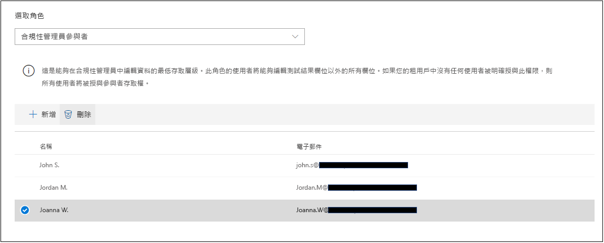
 
## 使用者隱私權設定User Privacy settings

某些規定要求組織必須要能夠刪除使用者記錄資料。若要啟用這項，合規性管理員會提供 [使用者隱私權設定]\*\*\*\* 功能，可讓系統管理員：Certain regulations require that an organization must be able to delete user history data. To enable this, Compliance Manager provides the **User Privacy Settings** functions, that allow administrators to: 
  
- [使用者搜尋Search for a user](#search-for-a-user)

- [匯出帳戶資料歷程記錄的報告Export a report of account data history](#export-report-of-account-data-history)

- [重新指派動作項目Reassign action items](#reassign-action-items)

- [刪除使用者資料歷程記錄Delete user data history](#delete-user-data-history)
    
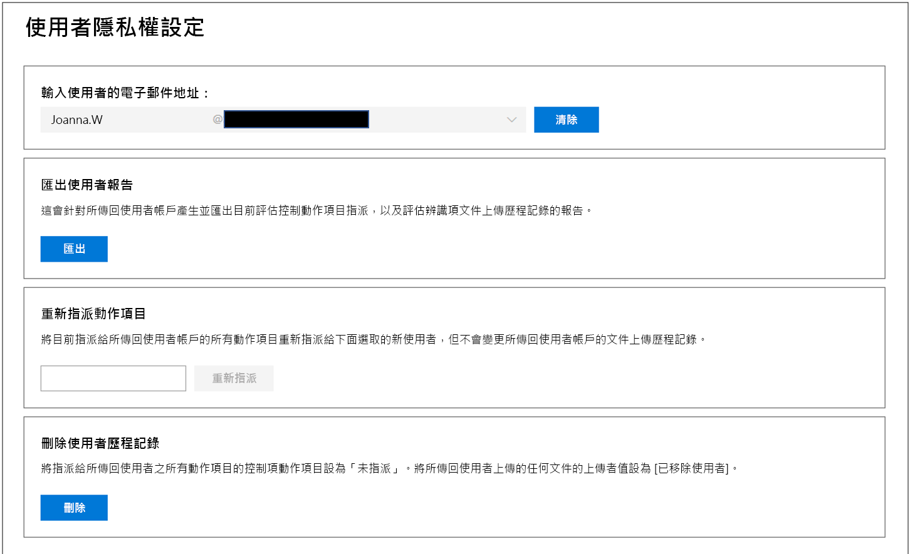
  
### 搜尋使用者Search for a user

若要搜尋使用者帳戶：To search for a user account:
  
1. 輸入別名來輸入使用者電子郵件地址 (@ 符號左邊的資訊)，並按一下右側網域尾碼來選擇網域名稱。如果這是具有多個已註冊網域的租用戶，您可以再次檢查電子郵件地址網域名稱尾碼，以確保資訊正確。Enter the user email address by typing in the alias (the information to the left of the @ symbol) and choosing the domain name by clicking on the domain suffix list on the right. If this is tenant with multiple registered domains, you can double check the email address domain name suffix to ensure that it is correct.
    
2. 當您輸入正確的使用者名稱時，按一下 [搜尋]\*\*\*\*。When you have the username correctly entered, click **Search**. 
    
3. 如果找不到該使用者帳戶，「找不到使用者」錯誤訊息會顯示在頁面上。檢查使用者的電子郵件地址資訊、視需要修正，然後按一下 [搜尋]\*\*\*\* 再試一次。If the user account is not found, the error message 'User not found' will be displayed on the page. Check the user's email address information, make corrections as necessary and click **Search** to try again. 
    
4. 找到使用者帳戶時，按鈕的文字會從 [搜尋]\*\*\*\* 變更為 [清除]\*\*\*\*，這表示傳回的使用者帳戶是額外功能的作業內容，將會顯示在下面，且執行這些功能將會套用到這個使用者帳戶。If user account is found, the text of the button will change from **Search** to **Clear**, which indicates that the returned user account is the operating context for the additional functions that will be displayed below, that running those functions will apply to this user account. 
    
5. 若要清除搜尋結果，並搜尋不同的使用者，請按一下 [清除]\*\*\*\*。To clear search results and search for a different user, click **Clear**. 
    
### 匯出帳戶資料歷程記錄的報告Export a report of account data history

一旦已識別使用者帳戶後，您可能需要產生相依性的報告，有連結到此帳戶。這項資訊可讓您重新指派開啟動作項目，或確定存取先前已上傳的辨識項。Once the user account has been identified, you may wish to generate a report of dependencies that exist linked to this account. This information will allow you to reassign open action items or ensure access to previously uploaded evidence. 
  
 若要產生並匯出報告：To generate and export a report:
  
1. 按一下 [匯出]\*\*\*\* 以產生及下載目前指派給已傳回使用者帳戶的合規性管理員控制項動作項目的報告，以及該使用者所上傳的文件清單。如果沒有指派的動作或上傳的文件，將顯示一則錯誤訊息：「沒有此使用者的資料」。Click **Export** to generate and download a report of the Compliance Manager control action items currently assigned to the returned user account, as well as the list of documents uploaded by that user. If there are no assigned actions or uploaded documents, an error message will state "No data for this user". 
    
2. 報告會在作用中的瀏覽器視窗背景中下載 - 如果您沒有看到下載快顯功能表，可能需要檢查您的瀏覽器下載記錄。The report downloads in the background of the active browser window - if you don't see a download popup you want to check your browser download history.
    
3. 開啟文件以檢視報告資料。Open the document to review the report data.
    
> [!NOTE]
> 這並不是歷程記錄報告，會保留並顯示動作項目作業歷程記錄的狀態變更。所產生的報告是報告執行時所指派項目的控制項動作項目 (寫入報表的日期和時間戳記) 的快照。例如，如果針對相同的使用者重新產生此報告，動作項目的任何後續重新指派都將會導致不同的快照報告資料。This is not a historical report that retains and displays state changes to action item assignment history. The generated report is a snapshot of the control action items assigned at the time that the report is run (date and time stamp written into the report). For instance, any subsequent reassignment of action items will result in different snapshot report data if this report is generated again for the same user. 
  
### 重新指派動作項目Reassign action items

這項功能可讓組織移除使用者帳戶上任何使用中或未完成的相依性，方法是將所傳回使用者帳戶的所有動作項目擁有權 (其中同時包含作用中和已完成的動作項目) 重新指派給下面選取的新使用者。此動作不會變更已傳回使用者帳戶的文件上傳歷程記錄。This function enables an organization to remove any active or outstanding dependencies on the user account by reassigning all action item ownership (which includes both active and completed action items) from the returned user account to a new user selected below. This action does not change document upload history for the returned user account. 
  
 若要將動作項目重新指派給其他使用者：To reassign action items to another user:
  
1. 按一下輸入方塊以瀏覽並選取所傳回使用者的動作項目應被指派的組織中的另一位使用者。Click the input box to browse for and select another user within the organization to whom the returned user's action items should be assigned.
    
2. 選取 [取代]\*\*\*\* 以將所傳回使用者的所有控制項動作項目重新指派給新選取的使用者。Select **Replace** to reassign all control action items from the returned user to the newly selected user. 
    
3. 確認對話方塊隨即出現，指出「這會將目前使用者的所有控制項動作項目重新指派給所選取的使用者。這個動作無法復原。是否確定要繼續？」A confirmation dialog box appear stating "This will reassign all control action items from the current user to the selected user. This action cannot be undone. Are you sure you want to continue?"
    
4. 若要繼續，請按一下 [確定]\*\*\*\*，否則請按一下 [取消]\*\*\*\*。To continue click **OK**,, otherwise click **Cancel**. 
    
> [!NOTE]
> 所有的動作項目 (作用中及已完成) 將會指派給新選取的使用者。不過，此動作不會影響文件上傳歷程記；先前指派使用者所上傳的任何文件仍會顯示日期/時間和先前指派使用者的名稱。All action items (both active and completed) will be assigned to the newly selected user. However, this action does not affect the document upload history; any documents uploaded by the previously assigned user will still show the date/time and name of the previously assigned user. 
  
變更文件上傳歷程記錄以移除先前指派的使用者必須以手動程序執行。在這種情況下，系統管理員必須：Changing the document upload history to remove the previously assigned user will have to be done as a manual process. In that case, the administrator will need to:
  
1. 開啟先前已下載的 [匯出] 報告。Open the previously downloaded Export report.
  
2. 找出並瀏覽至所需的控制項動作項目。Identify and navigate to the desired control action item.
  
3. 按一下 [管理文件]\*\*\*\* 以瀏覽到該控制項的辨識項存放庫。Click **Manage Documents** to navigate to the evidence repository for that control. 
  
4. 下載文件。Download the document.
  
5. 刪除辨識存放庫中的文件。Delete the document in the evidence repository.
  
6. 重新上傳文件。文件現在會有新的上傳日期、時間和上傳者的使用者名稱。Re-upload the document. The document will now have a new upload date, time and Uploaded By username. 
  
### 刪除使用者資料歷程記錄Delete user data history

這會將指派給所傳回使用者之所有動作項目的控制項動作項目設為「未指派」。這也會將所傳回使用者上傳的任何文件的上傳者值設為 [已移除使用者]This sets control action items to 'unassigned' for all action items assigned to the returned user. This also sets uploaded by value to 'user removed' for any documents uploaded by the returned user
  
 若要刪除使用者帳戶動作項目和文件上傳記錄：To delete the user account action item and document upload history:
  
1. 按一下 [刪除]\*\*\*\*。Click **Delete**. 

    確認對話方塊將會出現，指出「這會將所有控制項動作項目作業和所選取使用者的文件上傳歷程記錄移除。這個動作無法復原。是否確定要繼續？」A confirmation dialog will be displayed, stating "This will remove all control action item assignments and the document upload history for the selected user. This action cannot be undone. Are you sure you want to continue?"
    
3. 若要繼續，請按一下 [確定]\*\*\*\*，否則請按一下 [取消]\*\*\*\*。To continue click **OK**, otherwise click **Cancel**. 
  
## 使用合規性管理員Using Compliance Manager

合規性管理員會提供工具給您，可指派、追蹤及記錄合規性與評估相關的活動，從而協助貴組織跨小組障礙，達成貴組織的合規性目標。Compliance Manager provides you with tools to assign, track, and record compliance and assessment-related activities, and to help your organization cross team barriers to achieve your organization's compliance goals.
  
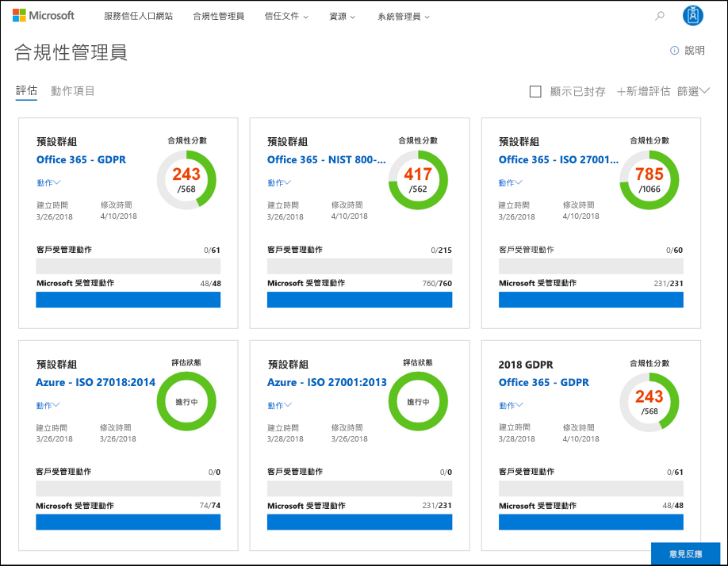

## 存取合規性管理員Accessing Compliance Manager

您可以從服務信任入口網站存取合規性管理員。任何人只要有 Microsoft 帳戶或 Azure Active Directory 組織帳戶都可以存取合規性管理員。You access Compliance Manager from the Service Trust Portal. Anyone with a Microsoft account or Azure Active Directory organizational account can access Compliance Manager.
  
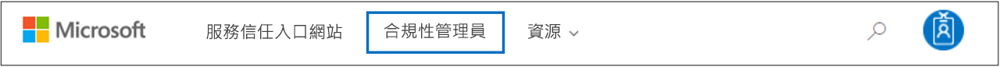
  
1. 請移至 [https://servicetrust.microsoft.com](https://servicetrust.microsoft.com/)。Go to [https://servicetrust.microsoft.com](https://servicetrust.microsoft.com/).
    
2. 使用您的 Azure Active Directory (Azure AD) 使用者帳戶登入。Sign in with your Azure Active Directory (Azure AD) user account.
    
3. 在服務信任入口網站中，按一下 [合規性管理員]\*\*\*\*。In the Service Trust Portal, click **Compliance Manager**. 
    
4. 顯示保密協議之後，請閱讀，然後按一下 [同意]\*\*\*\* 以繼續進行。您僅需執行此動作，隨即會顯示合規性管理員儀表板。When the Non-Disclosure Agreement is displayed, read it, and then click **Agree** to continue. You'll only have to do this once, and then the Compliance Manager dashboard is displayed. 

    為協助您快速上手，我們依預設新增了下列「評估」：To get you started, we've added the following Assessments by default:
    
    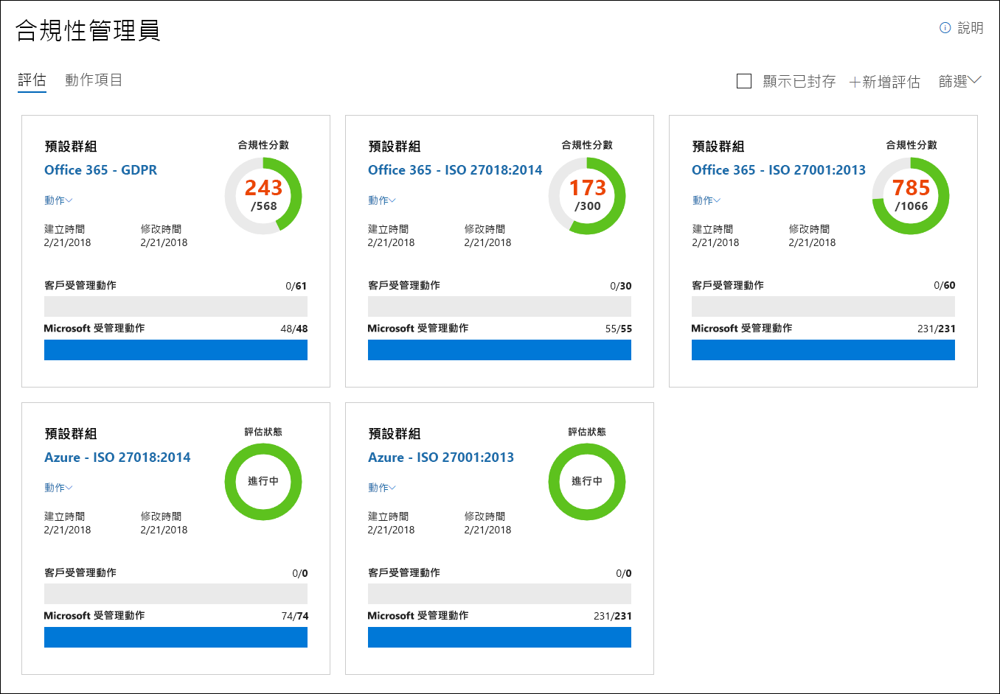
    
5. 按一下[說明]\*\*\*\*，以進行簡短的合規性管理員教學課程。Click  **Help** to take a short tour of Compliance Manager. 
  
## 檢視動作項目Viewing action items

合規性管理員提供您所有已指派控制項評估動作項目的檢視，讓您快速且輕鬆地對其採取動作。您可以檢視所有動作項目，或選取對應特定憑證的動作項目，方法是按一下與該評估相關聯的索引標籤。例如，在下圖中，已選取 GDPR 索引標籤，顯示與 GDPR 評估相關的控制項。Compliance Manager provides a convenient view of all your assigned control assessment action items, enabling you to quickly and easily take action on them. You can view all action items or select the action items that correspond with a specific certification by clicking on the tab associated with that assessment. For instance, in the image below, the GDPR tab has been selected, showing controls that related to the GDPR assessment.
  
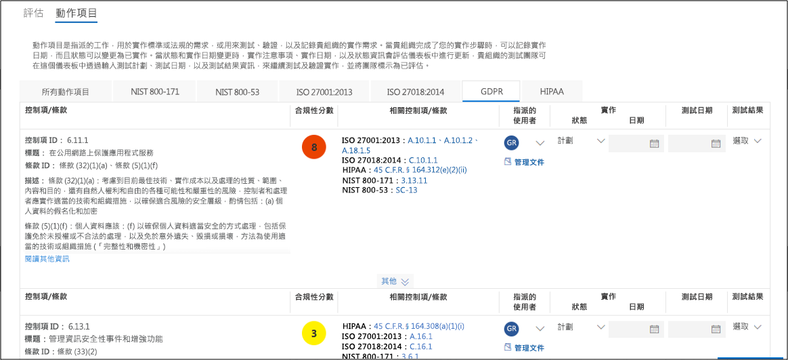
  
若要檢視您的動作項目：To view your action items:
  
1. 移至合規性管理員儀表板Go to the Compliance Manager dashboard
    
2. 按一下 [動作項目]\*\*\*\* 連結，而頁面會重新整理以顯示已指派給您的動作項目。Click the **Action Items** link, and the page will refresh to show the action items that have been assigned to you. 
    
    根據預設，會顯示所有的動作項目。如果您有多個認證的動作項目，就會在評估控制項最上方的索引標籤中列出認證的名稱。若要查看特定憑證的動作項目，請按一下該索引標籤。By default, all action items are shown. If you have action items across multiple certifications, the names of the certifications will be listed in tabs across the top of the assessment control. To see the action items for a specific certification, click that tab.

## 新增評估Adding an Assessment

若要將評估新增到合規性管理員：To add an Assessment to Compliance Manager:
  
1. 在合規性管理員儀表板中，按一下 [新增圖示][新增評估]\*\*\*\*。In the Compliance Manager dashboard, click  **Add Assessment**. 
    
2. 在 [新增評估]\*\*\*\* 視窗中，您可以建立要新增「評估」的新群組，或將其新增至現有的群組 (內建的群組稱為「初始群組」)。根據您所選擇的選項，請輸入新群組的名稱，或從下拉式清單中選取現有的群組。如需詳細資訊，請參閱[群組評估](meet-data-protection-and-regulatory-reqs-using-microsoft-cloud.md#grouping)。In the **Add an Assessment** window, you can create a new group to add the Assessment to or you can add it to an existing group (the built-in group is named "Initial Group".) Depending on the option you choose, either type the name of a new group or select an existing group from the drop-down list. For more information, see [Grouping Assessments](meet-data-protection-and-regulatory-reqs-using-microsoft-cloud.md#grouping).
    
    如果您建立新的群組，也可以選擇從現有的群組將資訊複製到新的「評估」。這表示新增至您複製來源的群組中「評估」的客戶管理控制項「實作詳細資料與測試計劃」和「管理回應」欄位的任何資訊，會複製到新的「評估」中同一個 (或相關) 客戶管理控制項。如果您要將新的「評估」新增至現有群組，該群組中「評估」的一般資訊將會複製到新的「評估」。如需詳細資訊，請參閱[從現有的評估複製資訊](meet-data-protection-and-regulatory-reqs-using-microsoft-cloud.md#copying)。If you create a new group, you also have the option to copy information from an existing group to the new Assessment. That means any information that was added to the Implementation Details and Test Plan and Management Response fields of customer managed controls from Assessments in the group that you're copying from are copied to the same (or related) customer managed controls in the new Assessment. If you're adding a new Assessment to an existing group, common information from Assessments in that group will be copied to the new Assessment. For more information, see [Copying information from existing Assessments](meet-data-protection-and-regulatory-reqs-using-microsoft-cloud.md#copying).
    
3. 按 [下一步]\*\*\*\* 並執行下列動作：Click **Next**, and do the following:
    
    a. 從 [選取產品]\*\*\*\* 下拉式清單選擇要針對合規性存取的 Microsoft 雲端服務。a. Choose a Microsoft cloud service to assess for compliance from the **Select a product** drop down list. 
    
    b. 從 [選取憑證]\*\*\*\* 下拉式清單中選擇要存取所選雲端服務的憑證。b. Choose a certification to assess the selected cloud service against from the **Select a certification** drop down list. 
    
4. 按一下 [新增至儀表板]\*\*\*\* 來建立「評估」；評估會在現有磚的清單結尾新增至合規性管理員作為新的磚。Click **Add to Dashboard** to create the Assessment; the assessment will be added to the Compliance Manager dashboard as a new tile at the end of the list of existing tiles. 
    
    合規性管理員儀表板上的**評估磚**會顯示評估群組、評估的名稱 (自動建立為一組服務名稱，然後選取憑證)、建立日期和上次修改時間、合規性分數總分 (也就是所有已實作、測試及通過的指派控制項風險值的加總)，以及底部的度列指示器，顯示已評估的控制項數目。The **Assessment Tile** on the Compliance Manager dashboard, displays the assessment grouping, the name of the assessment (automatically created as a combination of the Service name and the certification selected), the date it was created and when it was last modified, the Total Compliance Score (which is the sum of all of the assigned control risk values that have been implemented, tested and passed), and progress indicators along the bottom that show the number of controls that have been assessed. 
    
5. 按一下「評估」的名稱即可開啟它，然後檢視「評估」的詳細資料。Click the Assessment name to open it, and view the details of the Assessment.
    
6. 按一下 [動作]\*\*\*\* 功能表來檢視您指派的動作項目、重新命名評估群組、匯出評估報告，或封存評估。Click on the **Actions** menu to view your assigned action items, rename the assessment group, export the assessment report, or archive the assessment. 
    
    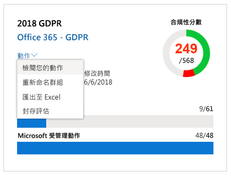

## 從現有「評估」複製資訊Copying information from existing Assessments

如先前所解說，當您建立新的評估群組時，可以選擇將資訊從現有群組中的「評估」複製到新群組中的新「評估」。這可讓您將已完成的評估和測試工作套用到新「評估」中的相同客戶管理控制項。例如，如果您在貴組織中有所有 GDPR 相關「評估」的群組，當您將新「評估」新增至群組時，可以從現有評估工作複製一般資訊。As previously explained, when you create a new assessment group, you have the option to copy information from Assessments in an existing group to the new Assessment in the new group. This allows you to apply the assessment and testing work that's been completed to the same customer managed controls in the new Assessment. For example, if you have a group for all GDPR-related Assessments in your organization, you can copy common information from existing assessment work when add a new Assessment to the group.
  
您可以將下列客戶資訊複製到新的「評估」：You can copy the following information from customer to a new Assessment:
  
- 評估使用者。「評估」使用者是控制項指派對象的使用者。Assessment Users. An Assessment user is a user who the control is assigned to.
    
- 狀態、日期測試和測試結果。Status, Test Date, and Test Results.
    
- 實作詳細資料和測試計劃資訊。Implementation details and test plan information.
    
同樣地，同一個「評估」群組內共用客戶管理控制項中的資訊會進行同步處理。相同「評估」內相關客戶管理控制項中的資訊也會進行同步處理。Similarly, information from shared customer managed controls within the same Assessment group is synchronized. And information in related customer managed controls within the same Assessment is also synchronized.

## 檢視評估Viewing Assessments

1. 找出對應到您想要檢視評估的「評估磚」，然後按一下評估名稱即可開啟，並檢視與「評估」相關的 Microsoft 和客戶管理控制項，以及一份「評估」範圍內的雲端服務清單。以下是 Office 365 和 GDPR 的「評估」範例。Locate the Assessment Tile corresponding to the assessment you wish to view, then click the assessment name to open it and view the Microsoft and customer managed controls associated with the Assessment, along with a list of the cloud services that are in-scope for the Assessment. Here's an example of the Assessment for Office 365 and GDPR.
    
    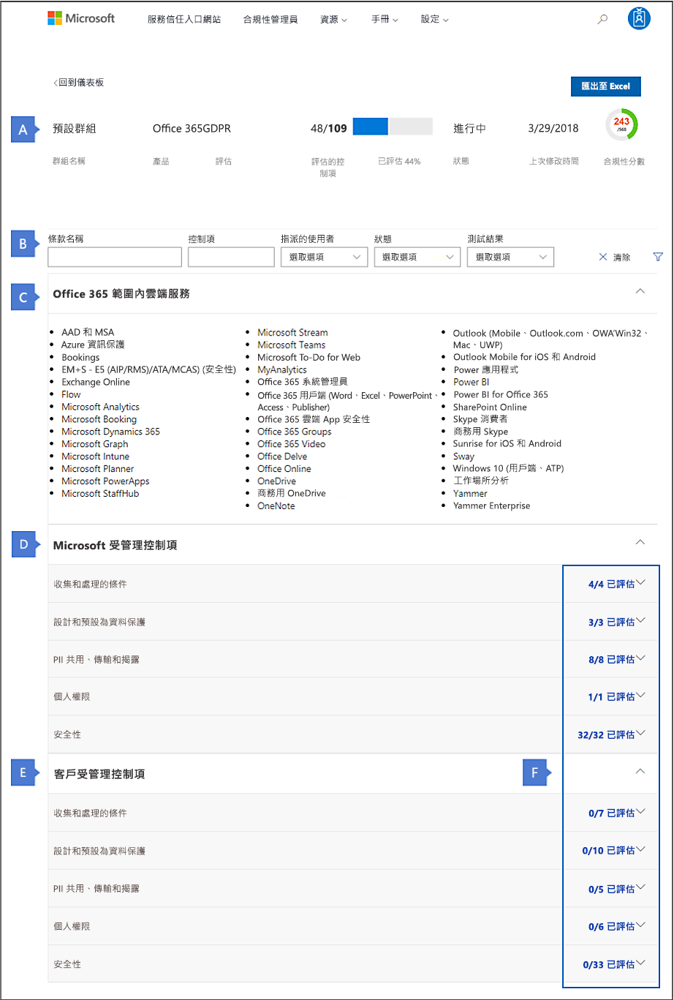
  
1. 此區段會顯示「評估」摘要資訊，包括「評估群組」的名稱、「產品」、「評估名稱」、評估控制項的數目This section shows the Assessment summary information, including the name of the Assessment Grouping, Product, Assessment name, number of Assess controls
    
2. 本節會顯示「評估篩選器」控制項。如需如何使用「評估篩選器」控制項的更詳細說明，請參閱[管理評估程序](meet-data-protection-and-regulatory-reqs-using-microsoft-cloud.md#managecomplianceprocess_1)一節。This section shows the Assessment Filter controls. For a more detailed explanation of how to use the Assessment Filter controls see the [Managing the assessment process](meet-data-protection-and-regulatory-reqs-using-microsoft-cloud.md#managecomplianceprocess_1) section. 
    
3. 本節會顯示評估範圍內的個別雲端服務。This section shows the individual cloud services that are in-scope for the assessment.
    
4. 本節中包含 Microsoft 管理控制項。相關的控制項會依控制項系列組織。按一下控制項系列加以展開，並顯示個別的控制項。This section contains Microsoft managed controls. Related controls are organized by control family. Click a control family to expand it and display individual controls.
    
5. 本節中包含客戶管理控制項，其也會依控制項系列組織。按一下控制項系列加以展開，並顯示個別的控制項。This section contains customer managed controls, which are also organized by control family. Click a control family to expand it and display individual controls.
    
6. 顯示控制項系列中的控制項總數，以及這些控制項中已評估的數量。合規性管理員的主要功能是追蹤貴組織評估客戶管理控制項的進度。如需詳細資訊，請參閱[了解合規性分數](meet-data-protection-and-regulatory-reqs-using-microsoft-cloud.md#compliancescore)一節。Displays the total number of controls in the control family, and how many of those controls have been assessed. A key capability of Compliance Manager is tracking your organization's progress on assessing the customer managed controls. For more information, see the [Understanding the Compliance Score](meet-data-protection-and-regulatory-reqs-using-microsoft-cloud.md#compliancescore) section. 

## 管理評估程序Managing the assessment process

「評估」的建立者一開始是唯一的「評估使用者」。針對每個客戶管理控制項，您可以將動作項目指派給貴組織中的人員，該人員就可以執行建議客戶，並收集並上傳的辨識項評估使用者。當您指派動作項目時，可以選擇傳送電子郵件給人員，當中包含建議的客戶動作和動作項目優先順序等詳細資訊。電子郵件通知會包含 [動作項目]\*\*\*\* 儀表板的連結，它會列出所有指派給該人員的動作項目。The creator of an Assessment is initially the only Assessment User. For each customer managed control, you can assign an Action Item to a person in your organization so that person becomes an Assessment User who can perform the recommended Customer Actions, and gather and upload evidence. When you assign an Action Item, you can choose to send an email to the person that contains details including the recommended Customer Actions and the Action Item priority. The email notification includes a link to the **Action Items** dashboard, which lists all Action Items assigned to that person. 
  
以下是您可以使用合規性管理員工作流程功能執行的工作清單。Here's a list of tasks that you can perform using the workflow features of Compliance Manager.
  
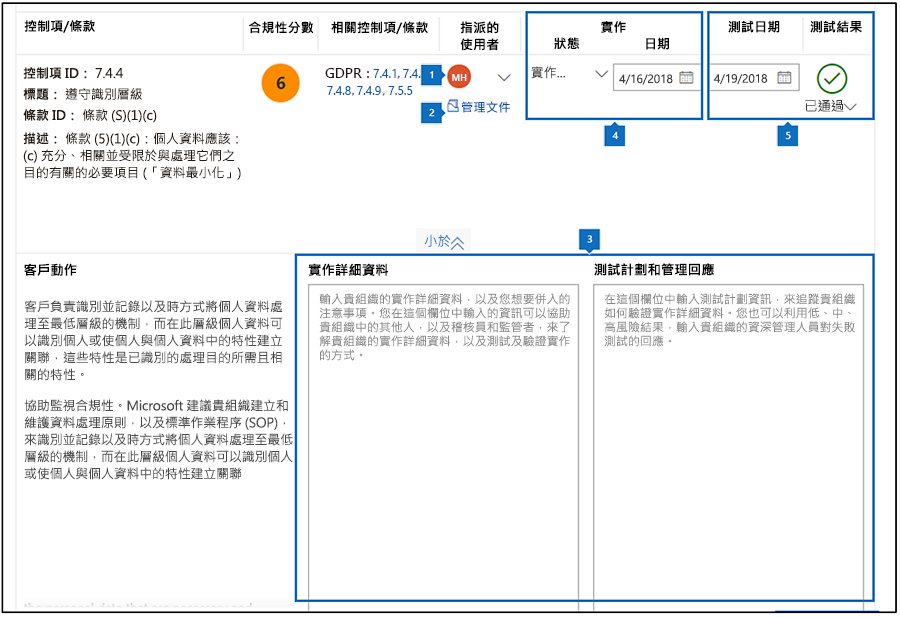
  
1. **使用篩選選項來尋找特定的評估控制項** - 合規性管理員提供 [篩選選項]\*\*\*\*，提供您高度細微的選取範圍準則來顯示評估控制項，協助您精確將目標鎖定在特定區域以進行合規性。**Use the Filter Options to find specific assessment controls** - Compliance Manager provides **Filter Options**, giving you highly granular selection criteria for displaying assessment controls, helping you to precisely target specific areas of your compliance efforts. 
    
    按一下頁面右側的漏斗圖示以顯示或隱藏 [篩選選項]\*\*\*\* 控制項。這些控制項可讓您指定篩選準則，且只有符合這些準則的評估控制項會在下方顯示。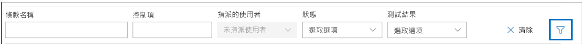Click on the funnel icon on the right hand side of the page to show or hide the **Filter Options** controls. These controls allow you to specify filter criteria, and only the assessment controls that fit those criteria will be displayed below. 
  
    - **文章** - 篩選文件名稱，並傳回與文章相關聯的評估控制項。例如，輸入「文章 (5)」會傳回文章的選取項目清單，其名稱包含字串，例如文章 (5)(1)(a)、文章 (5)(1)(b)、文章 (5)(1)(c) 等等。選取文章 (5)(1)(c) 會傳回與文章 (5)(1)(c) 相關聯的控制項。這是多重選取欄位，可使用 OR 運算子與多個值 -- 例如，如果您選取文章 (5)(1)(a)，然後新增文章 (5)(1)(c)，篩選器會傳回與文章 (5)(1)(a) 或文章 (5)(1)(c) 相關聯的控制項。**Articles** - filters on the article name and returns the assessment controls associated to that article. For instance, typing in "Article (5)" returns a selection list of articles whose name includes that string, i.e. Article (5)(1)(a), Article (5)(1)(b), Article (5)(1)(c), etc. Selecting Article (5)(1)(c) will return the controls associated with Article (5)(1)(c). This is multiselect field that uses an OR operator with multiple values -- for instance, if you select Article (5)(1)(a) and then add Article (5)(1)(c), the filter will return controls associated with either Article (5)(1)(a) or Article (5)(1)(c). 
    
      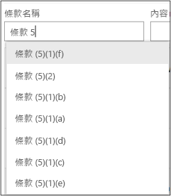
  
    - **控制項** - 傳回名稱符合篩選的控制項清單，亦即輸入 7.3 會傳回選取項目清單項目，例如 7.3.1、7.3.4、7.3.5 等。這是多重選取欄位，會使用 OR 運算子與多個值 - 例如，如果您選取 7.3.1 然後新增 7.3.4，篩選則會傳回與 7.3.1 或 7.3.4 相關聯的控制項。**Controls** - returns the list of controls whose names fit the filter, i.e. typing in 7.3 returns a selection list of items like 7.3.1, 7.3.4, 7.3.5, etc. This is multiselect field that uses an OR operator with multiple values -- for instance, if you select 7.3.1 and then add 7.3.4, the filter will return controls associated with either 7.3.1 or 7.3.4. 
    
      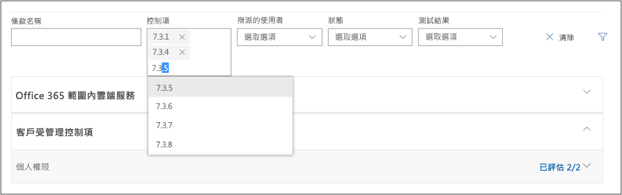
  
    - **指派的使用者** - 傳回指派給所選取使用者的控制項清單。**Assigned Users** - returns the list of controls who are assigned to the selected user. 
    
    - **狀態** - 傳回所選取狀態的控制項清單。**Status** - returns the list of controls with the selected status. 
    
    - **測試結果** - 傳回所選取測試結果的控制項清單。**Test Result** - returns the list of controls with the selected test result. 
    
    當您套用篩選條件時，適用控制項的檢視會變更以對應至您的篩選條件。展開控制項系列區段以在下方顯示控制項詳細資料。As you apply filter conditions, the view of applicable controls will change to correspond to your filter conditions. Expand the control family sections to show the control details below. 
    
    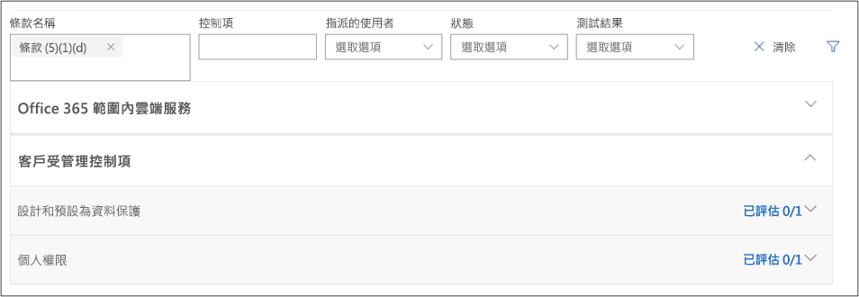
  
2. 如果選取想要的篩選而沒有顯示結果，這表示沒有對應到指定篩選條件的控制項。例如，如果您選取特定 [指派的使用者]\*\*\*\*，然後選擇 [控制]\*\*\*\* 名稱未對應至指派給該使用者的控制項，下方的頁面中不會顯示評估。If after selecting the desired filters no results are shown, that means there are no controls that correspond to the specified filter conditions. For instance, if you select a particular **Assigned User** and then choose a **Control** name that does correspond to the control assigned to that user, no assessments will be shown in the page below. 
    
3. **將動作項目指派給使用者** - 您可以指定動作項目給人員，來實作憑證/規定的需求，或是測試、確認及記錄貴組織的實作需求。當您指派動作項目時，可以選擇傳送電子郵件給人員，當中包含建議的客戶動作和動作項目優先順序的詳細資料。您也可以解除指派或重新指派動作項目給其他人員。**Assign an Action Item to a user** - You can assign an Action Item to a person to implement the requirements of a certification/regulation, or to test, verify, and document your organization's implementation requirements. When you assign an Action Item, you can choose to send an email to the person that contains details including the recommended Customer Actions and the Action Item priority. You can also unassign or reassign an Action Item to a different person. 
    
4. **管理文件** - 客戶管理控制項也可以管理與執行實作工作相關的文件，以及執行測試和驗證工作。合規性管理員中有編輯資料權限的任何人員都可以上傳文件，方法是按一下 [管理文件]\*\*\*\*。文件上傳之後，您可以按一下 [管理文件]\*\*\*\* 來檢視和下載檔案。**Manage documents** - Customer managed controls also have a place to manage documents that are related to performing implementation tasks and for performing testing and validation tasks. Anyone with permissions to edit data in Compliance Manager can upload documents by clicking **Manage Documents**. After a documented has been uploaded, you can click **Manage Documents** to view and download files. 
    
5. **提供實作和測試詳細資料** - 每個客戶管理控制項都有可編輯的欄位，使用者可以在其中新增記錄貴組織為符合憑證/規定需求所採取步驟的實作詳細資料，並驗證及記錄貴組織符合這些需求的方式。**Provide implementation and testing details** - Every customer managed control has an editable field where users can add implementation details that document the steps taken by your organization to meet the requirements of the certification/regulation, and to validate and document how your organization meets those requirements.
    
6. **設定狀態** - 在評估程序進行期間設定每個項目的狀態。可用的狀態值是 [已實作]\*\*\*\*、[替代實作]\*\*\*\*、[已計劃]\*\*\*\* 和 [範圍以外]\*\*\*\*。**Set Status** - Set the Status for each item as part of the assessment process. Available status values are **Implemented**, **Alternative Implementation**, **Planned**, and **Not in Scope**. 
    
7. **輸入測試日期和測試結果** - 具有合規性管理員評估員角色的人員可以確認已執行適當測試、檢閱實作詳細資料、測試計劃、測試結果及任何已上傳的辨識項，然後設定測試日期和測試結果。可用的測試結果值是 [通過]\*\*\*\*、[失敗-低風險]\*\*\*\*、[失敗-中度風險]\*\*\*\*\*\*\*\*，和 [失敗-高風險]\*\*\*\*。**Enter test date and test result** - The person with the Compliance Manager Assessor role can verify that proper testing performed, review the implementation details, test plan, test results, and any uploaded evidence, and then set the Test Date and Test Result. Available test result values are **Passed**, **Failed-Low Risk**, **Failed-Medium Ris** **k**, and **Failed-High Risk**. 

## 管理動作項目Managing action items

貴組織中負責評估程序的人員可以使用合規性管理員，來檢視其為使用者的所有「評估」中的客戶管理控制項。當使用者登入合規性管理員並開啟 [動作項目]\*\*\*\* 儀表板時，隨即顯示指派給他們的動作項目清單。取決於指派給使用者的合規性管理員角色，他們可以提供實作或測試詳細資料、更新狀態，或指派動作項目。The people involved in the assessment process in your organization can use Compliance Manager to review the customer managed controls from all Assessments for which they are users. When a user signs in to Compliance Manager and opens the **Action Items** dashboard, a list of Action Items assigned to them is displayed. Depending on the Compliance Manager role assigned to the user, they can provide implementation or test details, update the Status, or assign Action Items. 
  
因為憑證控制項通常是由一個人員實作並由另一個人員測試，控制項動作項目初始會指派給一個人員進行實作，一旦完成後，該人員可以重新指派控制項動作項目給下一個人員進行控制項測試並上傳辨識項。指派/重新指派此控制項動作可由具有合規性管理員角色且有足夠權限的任何使用者執行，允許集中管理控制項指派、或分散的路由控制項動作項目，適當從實作者到測試者。As certification controls are generally implemented by one person and tested by another, the control action item can be initially assigned to one person for implementation, and once that is complete, that person can reassign the control action item to the next person for control testing and uploading of evidence. This assignment/reassignment of control actions can be performed by any users who have a Compliance Manager role with sufficient permissions, allowing for central management of control assignments, or decentralized routing of control action items, from implementer to tester as appropriate.
  
若要指派動作項目：To assign an action item:
  
1. 合規性管理員儀表板，找出您想要使用之評估的評估磚，按一下評估的名稱以前往評估的詳細資料頁面。On the Compliance Manager dashboard, locate the assessment tile of the assessment you wish to work with and click on the name of the assessment to go to the assessment details page.
    
2. 您可以按一下 [篩選]\*\*\*\*，使用篩選控制項來找出您想要指派的特定評估控制項，或You can click **Filter** and use the filter controls to find the specific assessment control you wish to assign, or 
    
3. 向下捲動至 [客戶管理控制項] 區段、展開控制項系列，並捲動控制項的清單，直到您找到指派評估控制項Scroll down to the Customer Managed Controls section, expand the control family, and scroll through the list of control until you have located the assessment control to be assigned
    
4. 在 [指派的使用者]\*\*\*\* 欄中，按一下 [指派]\*\*\*\*。Under the **Assigned User** column, click **Assign**. 
    
5. 在 [指定動作項目] 對話方塊中，按一下 [指派至]\*\*\*\* 填入收件者可以指定動作的使用者清單的欄位。您可以捲動清單以找出目標使用者，或開始在欄位中輸入以搜尋使用者名稱。In the Assign Action Item dialog box, click the **Assign To** field to populate the list of users to whom the action can be assigned. You can scroll through the list to find the target user or start typing in the field to search for the username. 
    
6. 按一下使用者以指派此動作項目給他們。Click the user to assign them this action item.
    
7. 如果您想要傳送電子郵件通知給使用者以通知他們，請確保勾選 [傳送電子郵件通知]\*\*\*\* 核取方塊。If you wish to send an email notification to the user notifying them, ensure that the **Send Email Notification** checkbox is checked. 
    
8. 輸入您想要向該使用者顯示的任何附註，再按一下 [指派]\*\*\*\*。Type any notes you wish to be displayed to that user and click **Assign**. 
 
    使用者會收到其動作項目指派的通知和任何您所提供的附註。The user will receive notification of their action item assignment and any notes you have provided.
    
動作項目相關聯的附註會保存在附註區段中，可供下一次指派動作項目時使用。這些記錄不是唯讀狀態，指派動作項目的人員可加以編輯、取代或移除。The notes that are associated with the action item are persisted in the notes section, available for the next time the action item is assigned. These notes are not read-only, can be edited, replaced or removed by the person assigning the action item.

## 從評估中匯出資訊Exporting information from an Assessment

您可以將「評估」匯出至 Excel 檔案，可供貴組織中的合規性專案關係人檢閱，並提供給稽核員及管理員。此評估報告是報告建立時的日期及時間的評估快照集，且包含該評估的 Microsoft 管理控制項和客戶管理控制項的詳細資料，包括控制項實作狀態、控制項測試日期和測試結果，並提供已上傳辨識項文件的連結。建議您在封存文件前匯出評估報告，因為封存的評估不會保留其上傳文件的連結。You can export an Assessment to an Excel file, which can be reviewed by compliance stakeholders in your organization, and provided to auditors and regulators. This assessment report is a snapshot of the assessment as of the date and time that the report is created, and it contains the details of both the Microsoft-managed controls and the customer managed controls for that assessment, including control implementation status, control test date and test results, and provides links to the uploaded evidence documents. It is recommended that you export the assessment report prior to archiving an assessment, as archived assessments do not retain their links to uploaded documents.
  
若要匯出評估報告：To export an Assessment report:
  
- 在合規性管理員儀表板中，在您想要匯出的評估磚上按一下 [動作]\*\*\*\*，然後選擇 [匯出至 Excel]\*\*\*\*On the Compliance Manager dashboard, click **Actions** on the tile of the assessment you wish to export, and then choose **Export to Excel**

  或Or
    
- 如果您正在檢視 [評估詳細資料] 頁面，請按一下 [匯出至 Excel]\*\*\*\* 按鈕，位於評估合規性分數上方的頁面右上角。If you are viewing the Assessment details page, click on the **Export to Excel** button, which is located in the upper right hand corner of the page above the assessment's Compliance Score.
    
會在您的瀏覽器工作階段中下載評估報告。如果您沒有看到快顯功能表告知您這個，可能需要檢查您瀏覽器的下載項目資料夾。The assessment report will be downloaded in your browser session. If you don't see a popup informing you of this, you may wish to check your browser's downloads folder.

## 封存評估Archiving an Assessment

當您完成評估且不再需要它進行合規性目的時，可以進行封存。封存「評估」時，就會從「評估」儀表板中移除。When you have completed an Assessment and no longer need it for compliance purposes, you can archive it. When an Assessment is archived, it is removed from Assessments dashboard.
  
> [!NOTE]
> 封存「評估」時，就無法「取消封存」或還原到讀寫進度狀態。請注意，封存評估不會保留已上傳辨識項目文件的連結，強烈建議您封存之前執行「匯出評估」，因為匯出的評估報告會包含辨識項文件的連結，讓您可以繼續存取這些內容。When an Assessment is Archived, it cannot be 'unarchived' or restored to a read-write in progress state. Please note that Archived Assessments do not retain their links to uploaded evidence documents, so it is highly recommended that you perform an Export of the Assessment before archiving it, as the exported assessment report will contain links to the evidence documents, enabling you to continue to access them. 
  
若要封存評估：To archive an assessment:
  
1. 在所需評估的儀表板磚上，按一下 [動作]\*\*\*\*。On the dashboard tile of the desired assessment, click **Actions**. 
    
2. 選取 [封存評估]\*\*\*\*。Select **Archive Assessment**. 
 
    [封存評估]\*\*\*\* 對話方塊隨即顯示，要求您確認您想要封存的評估。The **Archive Assessments** dialog is displayed, asking you to confirm that you want to archive the assessment.
    
4. 若要繼續進行封存，按一下 [封存]\*\*\*\*，或是按一下 [取消]\*\*\*\*。To continue with archiving, click **Archive**, or else click **Cancel**. 
    
若要檢視封存的評估：To view archived Assessments:
  
1. 在合規性管理員儀表板上，請勾選 [顯示已封存]\*\*\*\* 核取方塊。On the Compliance Manager dashboard, check the **Show Archived** checkbox. 
    
    封存的評估會出現在標題為 [封存的評估]\*\*\*\* 列底下其他作用中評估下的新顯示區段中。The archived assessments will appear in a newly visible section below the rest of the active assessments under a bar titled **Archived Assessments**.
    
3. 按一下您想要檢視的評估名稱。Click the name of the assessment you wish to view.
    
檢視封存的評估時，通常可編輯的控制項 (也就是實作、測試結果) 都不會為使用中，且 [管理文件]\*\*\*\* 按鈕將不存在。When viewing an archived assessment, none of the normally editable controls (i.e. Implementation, Test Results) will be active, and the **Managed Documents** button will be absent.

## 使用搜尋Using search

  
按一下頁面右上角的放大鏡，以展開 [搜尋] 輸入欄位，輸入您的搜尋字詞，然後按 Enter。搜尋控制項隨即出現，並在 [搜尋] 窗格輸入欄位中出現搜尋字詞，搜尋結果會顯示在下方。Click the magnifying glass in the upper right-hand corner of the page by to expand the Search input field, enter your search terms and press Enter. The Search control will appear, with the search term in the search pane input field, and search results will appear beneath.
  
根據預設，搜尋會傳回文件結果，且您可使用 [篩選條件] 下拉式清單來調整所顯示的文件清單，以從檢視中新增或移除搜尋結果。您可以同時使用多個篩選條件屬性，將傳回的文件範圍縮小至特定雲端服務、合規性或安全性做法的類別、世界的區域或產業。按一下文件名稱連結來下載該文件。By default, Search returns Document results, and you can use the Filter By dropdown lists to refine the list of documents displayed, to add or remove search results from view. You can use multiple filter attributes at the same time to narrow the returned documents to specific cloud services, categories of compliance or security practices, regions of the world, or industries. Click the document name link to download the document.
  
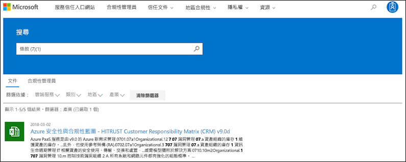
  
按一下 [合規性管理員] 連結，以顯示「合規性管理員」評估控制項。所列出的搜尋結果會顯示評估所建立的日期、評估群組的名稱、適用的雲端服務，以及控制項是 Microsoft 還是客戶管理。Click on the Compliance Manager link to display Search results for Compliance Manager assessment controls. The listed search results show the date the assessment was created, the name of the assessment grouping, the applicable cloud service, and whether the controls is Microsoft or Customer Managed.
  
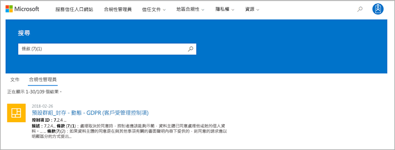
  
> [!NOTE]
> 服務信任入口網站的報告和記錄在發佈之後，至少有 12 個月可供下載，直到提供新版文件為止。Service Trust Portal reports and documents are available to download for at least twelve months after publishing or until a new version of document becomes available. 
 
## 當地語系化支援Localization support

服務信任入口網站可讓您以不同語言檢視頁面內容。若要變更頁面的語言，只要按一下頁面左上角的地球圖示，然後選取您想要的語言。Service Trust Portal enables you to view the page content in different languages. To change the page language, simply click on the globe icon in the lower left corner of the page and select the language of your choice. 
  
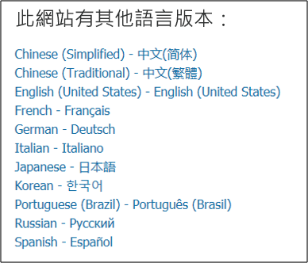

## 客戶管理控制項的變更記錄Change log for Customer Managed Controls

合規性管理員採用定期更新的設計，以跟上法規要求的變更，以及雲端服務的變更。這些更新包括客戶管理的控制措施的變更。我們會提供變更記錄檔，協助您了解這些變更的影響，包括新增或變更之內容的詳細資料，以及變更對現有評定有何影響的指導方針。一般而言，有兩種類型的變更：Compliance Manager is designed to be regularly updated to keep pace with changes in regulatory requirements, as well as changes in our cloud services. These updates include changes to the Customer Managed Controls. A Change Log is provided to help you understand the impact of these changes, including the details of the content being added or changed, and guidance as to what effect the changes have on existing Assessments. Generally, there are two types of changes:
  
- **主要**變更為客戶動作的重大變更，例如新增或移除控制項或特定編號的步驟，或變更責任、建議或辨識項的指導方針。建議您重新評估您的實作和/或受影響控制項的評估。A **Major** change is a significant change to a Customer Action, such as the addition or removal of a control or specific numbered steps, or a change in the guidance around responsibilities, recommendations, or evidence. For Major changes, we recommend that you re-evaluate your implementation and/or assessment of the affected control.
    
- **次要**變更是客戶動作的無意義變更，例如修正拼字錯誤或格式設定問題，或是更新或修正超連結。次要變更通常不需要重新評估控制項；不過，建議您檢閱更新的客戶動作。A **Minor** change is an insignificant change to a Customer Actions, such as fixing a typo or formatting issues, or updating or correcting hyperlinks. Minor changes generally do not require the control to be re-evaluated; however, we do recommend that you review the updated Customer Action.
  
### Office 365 客戶管理控制項 - 2018 年 7 月的變更記錄Office 365 Customer Managed Controls - Change Log for July 2018

|**控制項 ID****Control ID**|**評估****Assessment**|**變更類型****Type of change**|**變更描述****Description of change**|**客戶的建議動作****Recommended actions for customers**|
|:-----|:-----|:-----|:-----|:-----|:-----|:-----|:-----|:-----|
|45 C.F.R. § 164.308(a)(7)(ii)(A)45 C.F.R. § 164.308(a)(7)(ii)(A)  |Office 365：HIPAAOffice 365: HIPAA|主要Major|將 HITECH 控制項新增至 Office 365 的 HIPAA 評估Added HITECH control to HIPAA Assessment for Office 365 |檢閱新增的控制項和建議的客戶動作Review the added control and recommended Customer Actions  |
|45 C.F.R.  164.312(a)(6)(ii)45 C.F.R.  164.312(a)(6)(ii)|Office 365：HIPAAOffice 365: HIPAA|主要Major|將 HITECH 控制項新增至 Office 365 的 HIPAA 評估Added HITECH control to HIPAA Assessment for Office 365|檢閱新增的控制項和建議的客戶動作Review the added control and recommended Customer Actions |
45 C.F.R. § 164.312(c)(1)45 C.F.R. § 164.312(c)(1)| Office 365：HIPAAOffice 365: HIPAA|主要Major| 將 HITECH 控制項新增至 Office 365 的 HIPAA 評估Added HITECH control to HIPAA Assessment for Office 365 |檢閱新增的控制項和建議的客戶動作Review the added control and recommended Customer Actions  |
45 C.F.R.  § 164.316(b)(2)(iii)45 C.F.R.  § 164.316(b)(2)(iii)| Office 365：HIPAAOffice 365: HIPAA|主要Major|將 HITECH 控制項新增至 Office 365 的 HIPAA 評估Added HITECH control to HIPAA Assessment for Office 365|檢閱新增的控制項和建議的客戶動作Review the added control and recommended Customer Actions |
|

### Office 365 客戶管理控制項 - 2018 年 4 月的變更記錄Office 365 Customer Managed Controls - Change Log for April 2018

|**GDPR****GDPR**|**HIPAA****HIPAA**|**ISO 27001****ISO 27001**|**ISO 27018****ISO 27018**|**NIST 800-53****NIST 800-53**|**NIST 800-171****NIST 800-171**|**變更類型****Type of change**|**變更描述****Description of change**|**客戶的建議動作****Recommended actions for customers**|
|:-----|:-----|:-----|:-----|:-----|:-----|:-----|:-----|:-----|
|6.13.26.13.2    |||C.16.1.1C.16.1.1    |||主要Major    |先前編號為 6.12.1.1。Previously numbered as 6.12.1.1.    已新增詳細資料至建議。Added details to recommendations.    |重新評估控制項：在客戶動作中檢閱更新的指導方針，然後依照實作和評估控制項的建議步驟。Re-assess the control: Review the updated guidance in the Customer Actions and follow the recommended steps for implementing and assessing the control.    |
||||||3.1.63.1.6    |主要Major    |已新增步驟至指導方針，包括啟用稽核及搜尋稽核記錄。Added steps to guidance that include enabling auditing and searching audit logs.    |檢閱客戶動作中的更新建議。Review the updated recommendations in the Customer Actions.    |
|6.8.26.8.2    |||A.10.2A.10.2    |||主要Major    |先前編號為 6.7.2.9。Previously numbered as 6.7.2.9.    包含其他建議與動作項目的更新指導方針。Updated guidance with additional recommendations and action items.    |重新評估控制項：在客戶動作中檢閱更新的指導方針，然後依照實作和評估控制項的建議步驟。Re-assess the control: Review the updated guidance in the Customer Actions and follow the recommended steps for implementing and assessing the control.    |
|6.6.46.6.4    |45 C.F.R. § 164.312(a)(2)(i)45 C.F.R. § 164.312(a)(2)(i)              45 C.F.R. § 164.312(d)45 C.F.R. § 164.312(d)    |A.9.4.2A.9.4.2    ||IA-2IA-2    |3.5.13.5.1    |主要Major    |先前編號為 6.5.2.3。Previously numbered as 6.5.2.3.    包含其他建議與動作項目的更新指導方針。Updated guidance with additional recommendations and action items.    |重新評估控制項：在客戶動作中檢閱更新的指導方針，然後依照實作和評估控制項的建議步驟。Re-assess the control: Review the updated guidance in the Customer Actions and follow the recommended steps for implementing and assessing the control.    |
|6.13.16.13.1    |45 C.F.R. § 164.308(a)(1)(i)45 C.F.R. § 164.308(a)(1)(i)    |A.16.1A.16.1    |C.16.1C.16.1    |IR-4(a)IR-4(a)    |3.6.13.6.1    |主要Major    |先前編號為 6.12.1。Previously numbered as 6.12.1.    包含其他建議與動作項目的更新指導方針。Updated guidance with additional recommendations and action items.    |重新評估控制項：在客戶動作中檢閱更新的指導方針，然後依照實作和評估控制項的建議步驟。Re-assess the control: Review the updated guidance in the Customer Actions and follow the recommended steps for implementing and assessing the control.    |
|6.76.7    ||||||主要Major    |先前編號為 6.6.1.1。Previously numbered as 6.6.1.1.    包含其他建議與動作項目的更新指導方針。Updated guidance with additional recommendations and action items.    |重新評估控制項：在客戶動作中檢閱更新的指導方針，然後依照實作和評估控制項的建議步驟。Re-assess the control: Review the updated guidance in the Customer Actions and follow the recommended steps for implementing and assessing the control.    |
|6.6.56.6.5    |||A.10.8A.10.8    |IA-3IA-3    |3.5.23.5.2    |主要Major    |先前編號為 6.5.4.2。Previously numbered as 6.5.4.2.    包含其他建議與動作項目的更新指導方針。Updated guidance with additional recommendations and action items.    |重新評估控制項：在客戶動作中檢閱更新的指導方針，然後依照實作和評估控制項的建議步驟。Re-assess the control: Review the updated guidance in the Customer Actions and follow the recommended steps for implementing and assessing the control.    |
|6.15.16.15.1    ||||||主要Major    |先前編號為 6.14.1.3。Previously numbered as 6.14.1.3.    包含其他建議與動作項目的更新指導方針。Updated guidance with additional recommendations and action items.    |重新評估控制項：在客戶動作中檢閱更新的指導方針，然後依照實作和評估控制項的建議步驟。Re-assess the control: Review the updated guidance in the Customer Actions and follow the recommended steps for implementing and assessing the control.    |
|||||AC-2(h)(2)AC-2(h)(2)    ||次要Minor    |已新增連結至 [啟用稽核] 刀鋒視窗。Added link to Enable Auditing blade.    |不需要任何動作。No action necessary.    |
|||||AC-2(7)(b)AC-2(7)(b)    ||次要Minor    |已新增連結至 [啟用稽核] 刀鋒視窗。Added link to Enable Auditing blade.    |不需要任何動作。No action necessary.    |
|||||AC-2(h)(1)AC-2(h)(1)    ||次要Minor    |已新增連結至 [啟用稽核] 刀鋒視窗。Added link to Enable Auditing blade.    |不需要任何動作。No action necessary.    |
||45 C.F.R. § 164.308(a)(5)(ii)(C)45 C.F.R. § 164.308(a)(5)(ii)(C)    |||AC-2(g)AC-2(g)    ||次要Minor    |已新增連結至 [啟用稽核] 刀鋒視窗。Added link to Enable Auditing blade.    |不需要任何動作。No action necessary.    |
|||||AC-2(12)AC-2(12)    ||次要Minor    |已新增連結至 [啟用稽核] 刀鋒視窗。Added link to Enable Auditing blade.    |不需要任何動作。No action necessary.    |
||45 C.F.R. § 164.312(b)45 C.F.R. § 164.312(b)    |A.12.4.3A.12.4.3    ||AU-2(d)AU-2(d)    ||次要Minor    |已新增連結至 [啟用稽核] 刀鋒視窗。Added link to Enable Auditing blade.    |不需要任何動作。No action necessary.    |
|||||AC-2(4)AC-2(4)    ||次要Minor    |已新增連結至 [啟用稽核] 刀鋒視窗。Added link to Enable Auditing blade.    |不需要任何動作。No action necessary.    |
||||||3.1.73.1.7    |次要Minor    |已新增連結至 [啟用稽核] 刀鋒視窗。Added link to Enable Auditing blade.    |不需要任何動作。No action necessary.    |
|||A.16.1.7A.16.1.7    |C.12.4.2，組件 2C.12.4.2, Part 2    |||次要Minor    |已新增連結至 [啟用稽核] 刀鋒視窗。Added link to Enable Auditing blade.    |不需要任何動作。No action necessary.    |
|||||AC-2(h)(3)AC-2(h)(3)    ||次要Minor    |已新增連結至 [啟用稽核] 刀鋒視窗。Added link to Enable Auditing blade.    |不需要任何動作。No action necessary.    |
|||A.12.4.2A.12.4.2    ||||次要Minor    |已新增連結至 [啟用稽核] 刀鋒視窗。Added link to Enable Auditing blade.    |不需要任何動作。No action necessary.    |
|||A.7.2.8A.7.2.8    ||||次要Minor    |已新增連結至 [內容搜尋] 刀鋒視窗，和 DSR 入口網站。Added links to Content Search blade and to DSR portal.    |不需要任何動作。No action necessary.    |
||45 C.F.R. § 164.308(a)(3)(ii)(C)45 C.F.R. § 164.308(a)(3)(ii)(C)    |||||次要Minor    |已新增連結至 [啟用稽核] 刀鋒視窗和 Office 365 系統管理員角色支援主題。Added links to Enable Auditing blade and to Office 365 admin role support topics.    |不需要任何動作。No action necessary.    |
|5.2.15.2.1    ||||||次要Minor    |先前編號為 5.2.2。Previously numbered as 5.2.2.    已釐清指導方針內的客戶責任。Clarified customer responsibilities within guidance.    |檢閱客戶動作中的更新建議。Review the updated recommendations in the Customer Actions.    |
|6.11.16.11.1    |45 C.F.R. § 164.312(e)(2)(ii)45 C.F.R. § 164.312(e)(2)(ii)    |A.10.1.1          A.10.1.2          A.18.1.5A.10.1.1          A.10.1.2          A.18.1.5    |C.10.1.1C.10.1.1    |SC-13SC-13    |3.13.113.13.11    |次要Minor    |先前編號為 6.10.1.2。Previously numbered as 6.10.1.2.    修正拼字錯誤。Fixed typo.    |不需要任何動作。No action necessary.    |
|7.5.17.5.1    ||||||次要Minor    |先前編號為 A.7.4.1。Previously numbered as A.7.4.1.    修正拼字錯誤。Fixed typo.    |不需要任何動作。No action necessary.    |
|||A.8.2.3A.8.2.3    |||3.1.33.1.3    |次要Minor    |移除不必要的句子。Removed extra unnecessary sentence.    |不需要任何動作。No action necessary.    |
||45 C.F.R. § 164.308(a)(4)(i)45 C.F.R. § 164.308(a)(4)(i)    |A.6.1.2A.6.1.2    ||AC-5(a)AC-5(a)    |3.1.2          3.1.43.1.2          3.1.4    |次要Minor    |包含其他建議與動作項目的更新指導方針。Updated guidance with additional recommendations and action items.    |檢閱客戶動作中的更新建議。Review the updated recommendations in the Customer Actions.    |
||45 C.F.R. § 164.308(a)(7)(ii)(E)45 C.F.R. § 164.308(a)(7)(ii)(E)    |||RA-2(a)RA-2(a)    ||次要Minor    |已更新使用匯入服務說明主題連結以使用 FWLink。Updated import service help topic link to use FWLink.    |不需要任何動作。No action necessary.    |
|

### GDPR 評估控制項 ID 變更參考 - 2018 年 2 月的變更記錄GDPR Assessment Control ID Change Reference - Change Log for February 2018 

|**上一個控制項 ID (2017 年 11 月預覽)****Previous Control ID (November 2017 Preview)**|**新的控制項 ID (2018 年 2 月公開發行)****New Control ID (February 2018 GA release)**|
|:-----|:-----|
|5.2.25.2.2    |5.2.15.2.1    |
|5.2.35.2.3    |5.2.25.2.2    |
|5.2.45.2.4    |5.2.35.2.3    |
|6.1.1.16.1.1.1    |6.26.2    |
|6.10.1.26.10.1.2    |6.11.16.11.1    |
|6.10.2.56.10.2.5    |6.11.26.11.2    |
|6.11.1.26.11.1.2    |6.126.12    |
|6.12.16.12.1    |6.13.16.13.1    |
|6.12.1.16.12.1.1    |6.13.26.13.2    |
|6.12.1.56.12.1.5    |6.13.36.13.3    |
|6.14.1.36.14.1.3    |6.15.16.15.1    |
|6.14.2.16.14.2.1    |6.15.26.15.2    |
|6.14.2.36.14.2.3    |6.15.36.15.3    |
|6.2.1.16.2.1.1    |6.36.3    |
|6.3.2.26.3.2.2    |6.46.4    |
|6.4.3.16.4.3.1    |6.5.26.5.2    |
|6.4.3.26.4.3.2    |6.8.16.8.1    |
|6.4.3.36.4.3.3    |6.5.36.5.3    |
|6.5.26.5.2    |6.6.16.6.1    |
|6.5.2.16.5.2.1    |6.6.26.6.2    |
|6.5.2.26.5.2.2    |6.6.36.6.3    |
|6.5.2.36.5.2.3    |6.6.46.6.4    |
|6.5.4.26.5.4.2    |6.6.56.6.5    |
|6.6.1.16.6.1.1    |6.76.7      |
|6.7.2.76.7.2.7    |6.8.16.8.1    |
|6.7.2.96.7.2.9    |6.8.26.8.2    |
|6.8.1.46.8.1.4    |6.9.16.9.1    |
|6.8.4.16.8.4.1    |6.9.36.9.3    |
|6.8.4.26.8.4.2    |6.9.46.9.4    |
|6.9.2.16.9.2.1    |6.10.16.10.1   |
|6.9.2.36.9.2.3    |6.10.26.10.2   |
|A.7.1.1A.7.1.1    |7.2.17.2.1    |
|A.7.1.2A.7.1.2    |7.2.27.2.2    |
|A.7.1.3A.7.1.3    |7.2.37.2.3    |
|A.7.1.4A.7.1.4    |7.2.47.2.4    |
|A.7.1.5A.7.1.5    |7.2.57.2.5    |
|A.7.1.6A.7.1.6    |7.2.67.2.6    |
|A.7.1.7A.7.1.7    |7.2.77.2.7    |
|A.7.2.1A.7.2.1    |7.3.17.3.1    |
|A.7.2.10A.7.2.10   |7.3.97.3.9    |
|A.7.2.11A.7.2.11   |7.3.107.3.10   |
|A.7.2.2A.7.2.2    |7.3.27.3.2    |
|A.7.2.3A.7.2.3    |7.3.37.3.3    |
|A.7.2.4A.7.2.4    |7.3.47.3.4    |
|A.7.2.5A.7.2.5    |7.3.57.3.5    |
|A.7.2.6A.7.2.6    |7.3.67.3.6    |
|A.7.2.7A.7.2.7    |7.3.77.3.7    |
|A.7.2.8A.7.2.8    |7.3.87.3.8    |
|A.7.3.1A.7.3.1    |7.4.17.4.1    |
|A.7.3.10A.7.3.10   |7.4.107.4.10   |
|A.7.3.2A.7.3.2    |7.4.27.4.2    |
|A.7.3.3A.7.3.3    |7.4.37.4.3    |
|A.7.3.4A.7.3.4    |7.4.47.4.4    |
|A.7.3.5A.7.3.5    |7.4.57.4.5    |
|A.7.3.6A.7.3.6    |7.4.67.4.6    |
|A.7.3.7A.7.3.7    |7.4.77.4.7    |
|A.7.3.8A.7.3.8    |7.4.87.4.8    |
|A.7.3.9A.7.3.9    |7.4.97.4.9    |
|A.7.4.1A.7.4.1    |7.5.17.5.1    |
|A.7.4.2A.7.4.2    |7.5.27.5.2    |
|A.7.4.3A.7.4.3    |7.5.37.5.3    |
|A.7.4.4A.7.4.4    |7.5.47.5.4    |
|A.7.4.5A.7.4.5    |7.5.57.5.5    |
|B.8.1.1B.8.1.1    |8.2.18.2.1    |
|B.8.1.2B.8.1.2    |8.2.28.2.2    |
|B.8.1.3B.8.1.3    |8.2.38.2.3    |
|B.8.1.4B.8.1.4    |8.2.48.2.4    |
|B.8.1.5B.8.1.5    |8.2.58.2.5    |
|B.8.1.6B.8.1.6    |8.2.68.2.6    |
|B.8.2.1B.8.2.1    |8.3.18.3.1    |
|B.8.3.1B.8.3.1    |8.4.18.4.1    |
|B.8.3.2B.8.3.2    |8.4.28.4.2    |
|B.8.3.3B.8.3.3    |8.4.38.4.3    |
|B.8.4.1B.8.4.1    |8.5.18.5.1    |
|B.8.4.2B.8.4.2    |8.5.28.5.2    |
|B.8.4.3B.8.4.3    |8.5.48.5.4    |
|B.8.4.4B.8.4.4    |8.5.58.5.5    |
|B.8.4.5B.8.4.5    |8.5.38.5.3    |
|B.8.4.6B.8.4.6    |8.5.68.5.6    |
|B.8.4.7B.8.4.7    |8.5.78.5.7    |
|B.8.4.8B.8.4.8    |8.5.88.5.8    |
|
   
## 另請參閱See also

- [合規性管理員互動指南](https://content.cloudguides.com/guides/Compliance%20Manager) (英文)[Compliance Manager Interactive guide](https://content.cloudguides.com/guides/Compliance%20Manager)

- [宣布合規性管理員正式公開上市](https://techcommunity.microsoft.com/t5/Security-Privacy-and-Compliance/Announcing-Compliance-Manager-general-availability/ba-p/161922) (英文)[Announcing Compliance Manager general availability](https://techcommunity.microsoft.com/t5/Security-Privacy-and-Compliance/Announcing-Compliance-Manager-general-availability/ba-p/161922)

- [Microsoft 365 提供資訊保護策略來協助符合 GDPRMicrosoft 365 provides an information protection strategy to help with the GDPR](https://blogs.office.com/zh-TW/2018/02/22/microsoft-365-provides-an-information-protection-strategy-to-help-with-the-gdpr)
